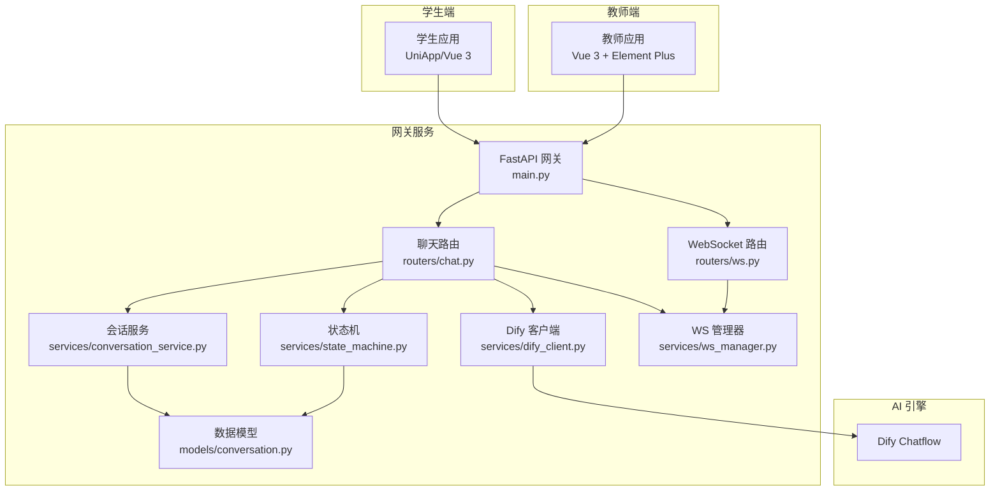
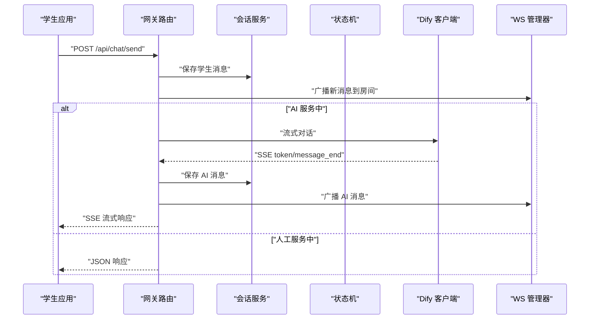
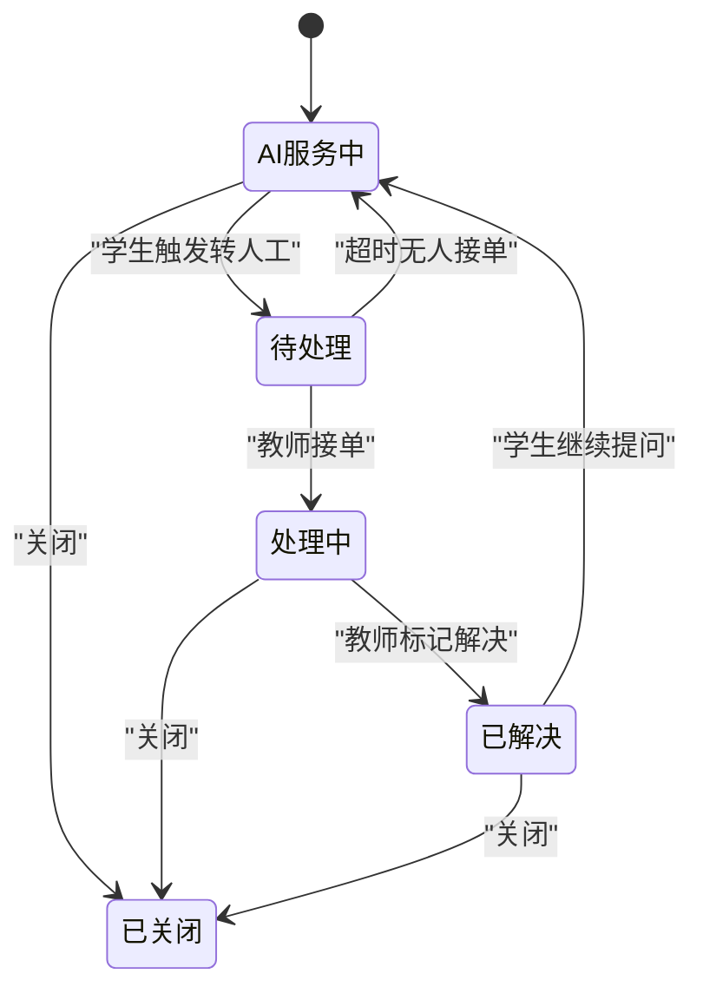
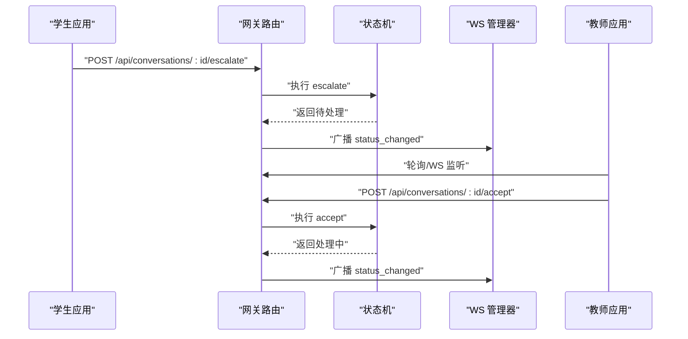
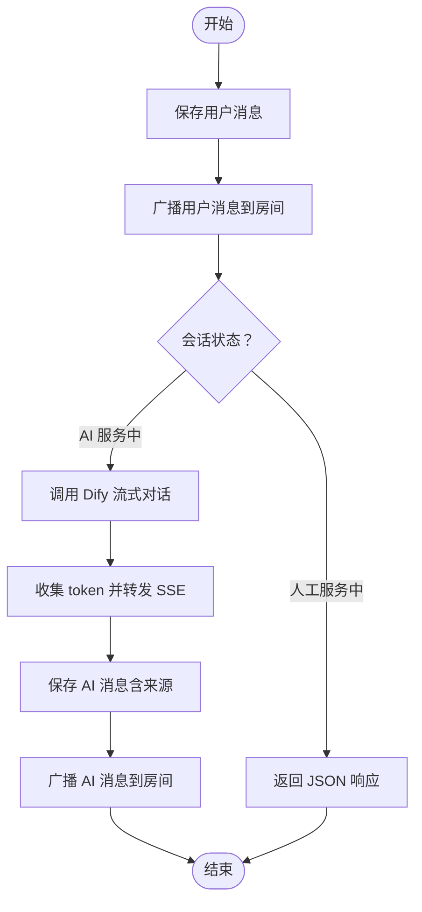
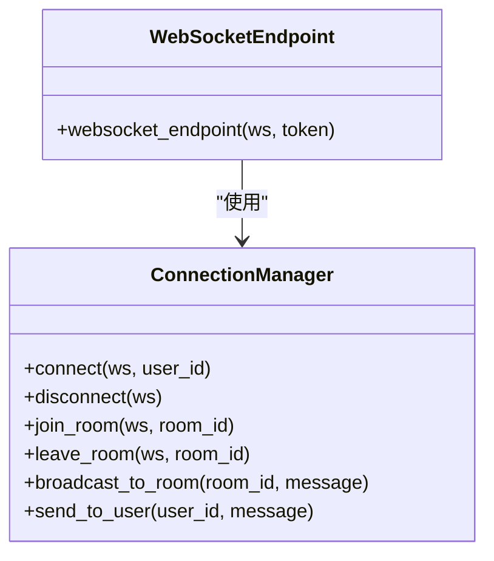
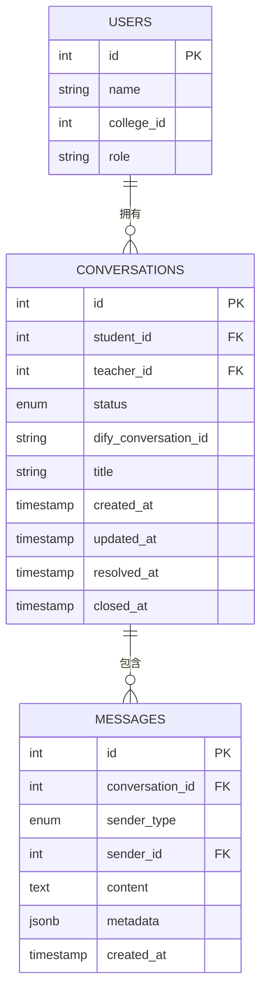
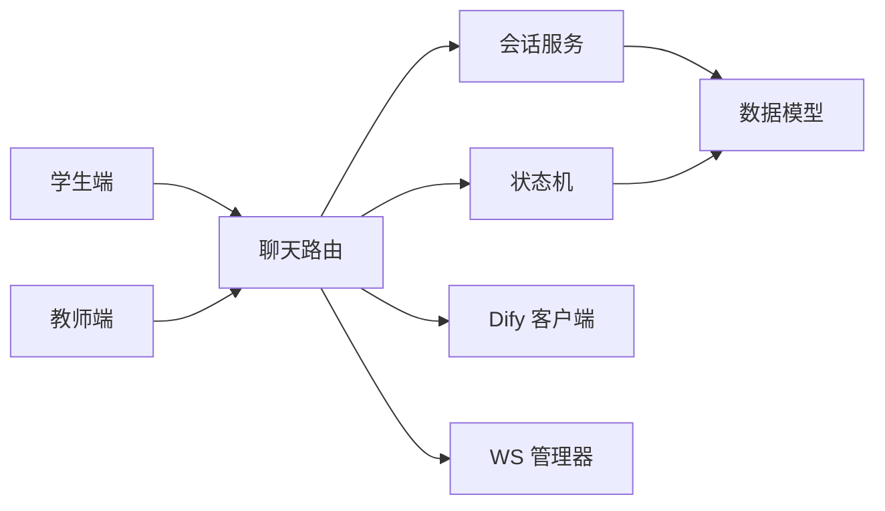

# AI 对话管理

<cite>
**本文档引用的文件**
- [README.md](file://README.md)
- [main.py](file://services/gateway/app/main.py)
- [chat.py](file://services/gateway/app/routers/chat.py)
- [ws.py](file://services/gateway/app/routers/ws.py)
- [conversation_service.py](file://services/gateway/app/services/conversation_service.py)
- [state_machine.py](file://services/gateway/app/services/state_machine.py)
- [dify_client.py](file://services/gateway/app/services/dify_client.py)
- [ws_manager.py](file://services/gateway/app/services/ws_manager.py)
- [conversation.py](file://services/gateway/app/models/conversation.py)
- [index.vue（学生端聊天页）](file://apps/student-app/src/pages/chat/index.vue)
- [chat.ts（学生端API）](file://apps/student-app/src/api/chat.ts)
- [index.vue（教师端问题列表）](file://apps/teacher-app/src/pages/questions/index.vue)
- [conversations.ts（教师端API）](file://apps/teacher-app/src/api/conversations.ts)
- [chat.ts（类型定义）](file://apps/student-app/src/types/chat.ts)
- [conversation.ts（类型定义）](file://apps/teacher-app/src/types/conversation.ts)
</cite>

## 目录
1. [简介](#简介)
2. [项目结构](#项目结构)
3. [核心组件](#核心组件)
4. [架构总览](#架构总览)
5. [详细组件分析](#详细组件分析)
6. [依赖关系分析](#依赖关系分析)
7. [性能考量](#性能考量)
8. [故障排查指南](#故障排查指南)
9. [结论](#结论)
10. [附录](#附录)

## 简介
本项目是一个基于 FastAPI + Dify 的 AI 校园智能服务系统，支持学生与 AI 助手的实时对话、智能分流至人工教师、人工教师的接单与处理、以及会话状态的全生命周期管理。系统通过 WebSocket 实现实时消息广播与状态变更通知，并通过 Dify 的流式对话能力提供低延迟的响应体验。

## 项目结构
- 后端网关服务（FastAPI）：负责认证、路由、会话与消息持久化、状态机、Dify 集成、WebSocket 管理。
- 学生端应用（UniApp/Vue 3）：发起对话、接收流式响应、查看历史、触发人工转接。
- 教师端应用（Vue 3 + Element Plus）：查看待处理工单、接单、处理、标记解决。
- 数据模型：会话与消息实体及状态枚举。
- 配置与部署：Docker Compose、Nginx 网关配置、Dify Chatflow 部署。

图表来源
- [main.py:1-78](file://services/gateway/app/main.py#L1-L78)
- [chat.py:1-191](file://services/gateway/app/routers/chat.py#L1-L191)
- [ws.py:1-119](file://services/gateway/app/routers/ws.py#L1-L119)
- [conversation_service.py:1-179](file://services/gateway/app/services/conversation_service.py#L1-L179)
- [state_machine.py:1-96](file://services/gateway/app/services/state_machine.py#L1-L96)
- [dify_client.py:1-105](file://services/gateway/app/services/dify_client.py#L1-L105)
- [ws_manager.py:1-100](file://services/gateway/app/services/ws_manager.py#L1-L100)
- [conversation.py:1-63](file://services/gateway/app/models/conversation.py#L1-L63)

章节来源
- [README.md:1-18](file://README.md#L1-L18)
- [main.py:1-78](file://services/gateway/app/main.py#L1-L78)

## 核心组件
- 会话与消息模型：定义会话状态、发送者类型、会话与消息表结构及索引。
- 会话服务：创建会话、查询会话与消息、权限校验、插入消息并更新会话时间戳。
- 状态机：定义合法的状态转换（AI 服务、待人工、人工服务、解决、关闭等）。
- Dify 客户端：封装 Dify Chatflow 的流式对话接口，支持事件驱动的数据解析。
- WebSocket 管理：连接管理、房间广播、用户级推送。
- 聊天路由：根据会话状态选择 AI 流式响应或教师直连 JSON 响应；处理人工转接与状态广播。
- 学生端与教师端：分别通过 API 与 WebSocket 实现消息收发、状态变更与工单管理。

章节来源
- [conversation.py:1-63](file://services/gateway/app/models/conversation.py#L1-L63)
- [conversation_service.py:1-179](file://services/gateway/app/services/conversation_service.py#L1-L179)
- [state_machine.py:1-96](file://services/gateway/app/services/state_machine.py#L1-L96)
- [dify_client.py:1-105](file://services/gateway/app/services/dify_client.py#L1-L105)
- [ws_manager.py:1-100](file://services/gateway/app/services/ws_manager.py#L1-L100)
- [chat.py:1-191](file://services/gateway/app/routers/chat.py#L1-L191)
- [index.vue（学生端聊天页）:1-649](file://apps/student-app/src/pages/chat/index.vue#L1-L649)
- [index.vue（教师端问题列表）:1-462](file://apps/teacher-app/src/pages/questions/index.vue#L1-L462)

## 架构总览
系统采用“网关 + 业务服务 + AI 引擎”的分层架构：
- 网关层：统一入口、认证、路由与健康检查。
- 业务层：会话与消息持久化、状态机、Dify 集成、WebSocket 广播。
- 客户端层：学生端与教师端通过 HTTP 与 WebSocket 交互。

图表来源
- [chat.py:22-103](file://services/gateway/app/routers/chat.py#L22-L103)
- [dify_client.py:22-69](file://services/gateway/app/services/dify_client.py#L22-L69)
- [conversation_service.py:148-179](file://services/gateway/app/services/conversation_service.py#L148-L179)
- [ws_manager.py:71-82](file://services/gateway/app/services/ws_manager.py#L71-L82)

## 详细组件分析

### 会话生命周期与状态管理
- 状态枚举：ai_serving、pending_teacher、teacher_serving、resolved、closed。
- 合法转换：定义了从 AI 服务到人工、人工接单、超时回退、解决与关闭等路径。
- 系统消息：每次状态变更自动插入系统消息，便于审计与回溯。
- 会话创建：学生创建会话即进入 AI 服务状态，并插入系统提示消息。

图表来源
- [state_machine.py:20-31](file://services/gateway/app/services/state_machine.py#L20-L31)
- [conversation_service.py:29-51](file://services/gateway/app/services/conversation_service.py#L29-L51)

章节来源
- [state_machine.py:1-96](file://services/gateway/app/services/state_machine.py#L1-L96)
- [conversation.py:11-16](file://services/gateway/app/models/conversation.py#L11-L16)
- [conversation_service.py:29-51](file://services/gateway/app/services/conversation_service.py#L29-L51)

### AI 服务与人工教师协作流程
- 智能分流：学生在 AI 服务中收到拒答或不确定回答时，可长按菜单或点击“转人工”按钮触发转接。
- 问题升级：状态从 AI 服务切换至待处理，系统广播状态变更并可向教师推送通知。
- 人工接管：教师端问题列表展示待处理工单，可接单进入人工服务状态，随后进行对话与问题解决。
- 状态回退：学生可在已解决后继续提问，状态回到 AI 服务。

图表来源
- [chat.py:22-103](file://services/gateway/app/routers/chat.py#L22-L103)
- [state_machine.py:34-95](file://services/gateway/app/services/state_machine.py#L34-L95)
- [index.vue（教师端问题列表）:135-188](file://apps/teacher-app/src/pages/questions/index.vue#L135-L188)

章节来源
- [index.vue（学生端聊天页）:510-534](file://apps/student-app/src/pages/chat/index.vue#L510-L534)
- [chat.ts（学生端API）:33-35](file://apps/student-app/src/api/chat.ts#L33-L35)
- [conversations.ts（教师端API）:36-38](file://apps/teacher-app/src/api/conversations.ts#L36-L38)
- [index.vue（教师端问题列表）:135-188](file://apps/teacher-app/src/pages/questions/index.vue#L135-L188)

### 对话上下文管理策略
- 历史记录存储：消息以独立记录存储，包含发送者类型、内容与元数据（如来源引用）。
- 上下文窗口：通过 Dify 的 conversation_id 维持上下文，首次对话时保存 Dify 会话 ID，后续对话复用。
- 敏感信息过滤：前端对拒答关键词与无来源的“抱歉”类内容进行识别，引导转人工，避免传递无效或潜在敏感信息。
- 分页与排序：消息按创建时间升序分页加载，确保阅读顺序正确。

图表来源
- [chat.py:84-102](file://services/gateway/app/routers/chat.py#L84-L102)
- [chat.py:105-191](file://services/gateway/app/routers/chat.py#L105-L191)
- [dify_client.py:22-69](file://services/gateway/app/services/dify_client.py#L22-L69)
- [conversation_service.py:148-179](file://services/gateway/app/services/conversation_service.py#L148-L179)

章节来源
- [conversation_service.py:129-179](file://services/gateway/app/services/conversation_service.py#L129-L179)
- [index.vue（学生端聊天页）:490-502](file://apps/student-app/src/pages/chat/index.vue#L490-L502)

### WebSocket 与实时通知
- 房间模型：房间 ID 为 “conv:{conversation_id}”，用于会话级广播。
- 连接管理：按用户与房间维护连接集合，断线清理。
- 事件类型：新消息、状态变更、转人工通知、打字指示等。
- 客户端集成：学生端与教师端均通过 WS 接收状态变更与消息，提升交互实时性。

图表来源
- [ws_manager.py:8-100](file://services/gateway/app/services/ws_manager.py#L8-L100)
- [ws.py:11-119](file://services/gateway/app/routers/ws.py#L11-L119)

章节来源
- [ws_manager.py:1-100](file://services/gateway/app/services/ws_manager.py#L1-L100)
- [ws.py:1-119](file://services/gateway/app/routers/ws.py#L1-L119)
- [index.vue（学生端聊天页）:278-326](file://apps/student-app/src/pages/chat/index.vue#L278-L326)
- [index.vue（教师端问题列表）:170-188](file://apps/teacher-app/src/pages/questions/index.vue#L170-L188)

### 数据模型与权限控制
- 会话与消息：定义主键、外键、索引与 JSONB 元数据字段，支撑消息来源与扩展信息。
- 角色与权限：学生仅能访问自身会话；教师可查看本学院待处理与自己正在服务的；管理员可查看全部。
- 状态可见性：教师端问题列表按状态筛选，支持“全部/待处理/处理中/已解决”。

图表来源
- [conversation.py:26-63](file://services/gateway/app/models/conversation.py#L26-L63)

章节来源
- [conversation.py:1-63](file://services/gateway/app/models/conversation.py#L1-L63)
- [conversation_service.py:7-26](file://services/gateway/app/services/conversation_service.py#L7-L26)
- [index.vue（教师端问题列表）:95-101](file://apps/teacher-app/src/pages/questions/index.vue#L95-L101)

## 依赖关系分析
- 路由依赖：聊天路由依赖会话服务、状态机、Dify 客户端与 WS 管理器。
- 模型依赖：会话与消息模型被会话服务与状态机使用。
- 客户端依赖：学生端与教师端通过各自 API 封装调用网关路由。
- 外部依赖：Dify Chatflow 提供流式对话能力；Redis 与 PostgreSQL 作为缓存与持久化。

图表来源
- [chat.py:1-191](file://services/gateway/app/routers/chat.py#L1-L191)
- [conversation_service.py:1-179](file://services/gateway/app/services/conversation_service.py#L1-L179)
- [state_machine.py:1-96](file://services/gateway/app/services/state_machine.py#L1-L96)
- [dify_client.py:1-105](file://services/gateway/app/services/dify_client.py#L1-L105)
- [ws_manager.py:1-100](file://services/gateway/app/services/ws_manager.py#L1-L100)
- [conversation.py:1-63](file://services/gateway/app/models/conversation.py#L1-L63)

章节来源
- [main.py:1-78](file://services/gateway/app/main.py#L1-L78)

## 性能考量
- 流式响应：AI 对话采用 SSE 流式传输，降低首字节延迟，提升用户体验。
- 广播优化：WS 管理器按房间广播，避免逐用户推送带来的额外开销。
- 数据库索引：会话与消息表建立复合索引，优化查询与分页性能。
- 缓存与健康检查：网关提供 Redis 与 Dify 健康检查，便于快速定位外部依赖问题。
- 超时与降级：Dify 请求设置合理超时，异常时返回错误事件，前端可提示重试。

## 故障排查指南
- 网关健康检查失败：检查 PostgreSQL 与 Redis 连通性，以及 Dify 参数与鉴权头。
- 会话不存在或无权限：确认 JWT 角色与会话归属，教师需具备同学院条件。
- AI 服务异常：查看 Dify 流式事件是否正常，关注 message_end 与错误事件。
- WebSocket 断连：确认客户端是否正确加入房间，服务端日志是否存在异常。
- 转人工未生效：检查状态机转换是否成功，确认 WS 是否广播状态变更。

章节来源
- [main.py:30-68](file://services/gateway/app/main.py#L30-L68)
- [chat.py:34-60](file://services/gateway/app/routers/chat.py#L34-L60)
- [ws.py:35-42](file://services/gateway/app/routers/ws.py#L35-L42)
- [dify_client.py:105-105](file://services/gateway/app/services/dify_client.py#L105-L105)

## 结论
本系统通过清晰的会话状态机、完善的上下文管理与实时通知机制，实现了从 AI 智能服务到人工教师的平滑协作。前端通过 SSE 与 WebSocket 提供流畅的交互体验，后端通过模块化设计与外部引擎集成保障可扩展性与稳定性。建议持续完善质量监控与性能指标采集，以进一步提升系统可靠性与用户体验。

## 附录
- 类型定义：学生端与教师端对会话状态与消息结构的约定，确保前后端一致性。
- 部署与配置：Docker Compose 与 Nginx 网关配置，便于本地与生产环境快速上线。

章节来源
- [chat.ts（类型定义）:39-45](file://apps/student-app/src/types/chat.ts#L39-L45)
- [conversation.ts（类型定义）:4-17](file://apps/teacher-app/src/types/conversation.ts#L4-L17)