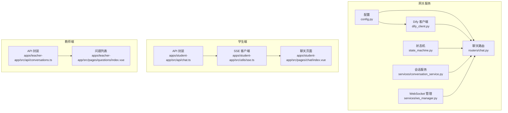
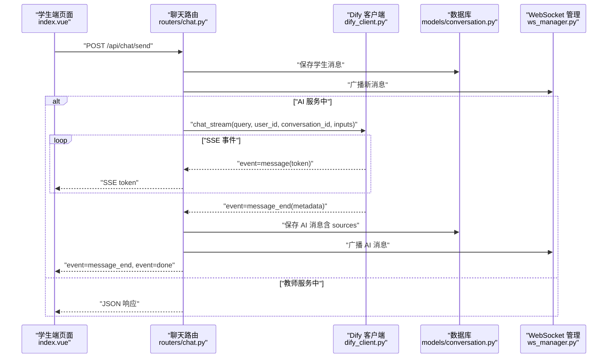
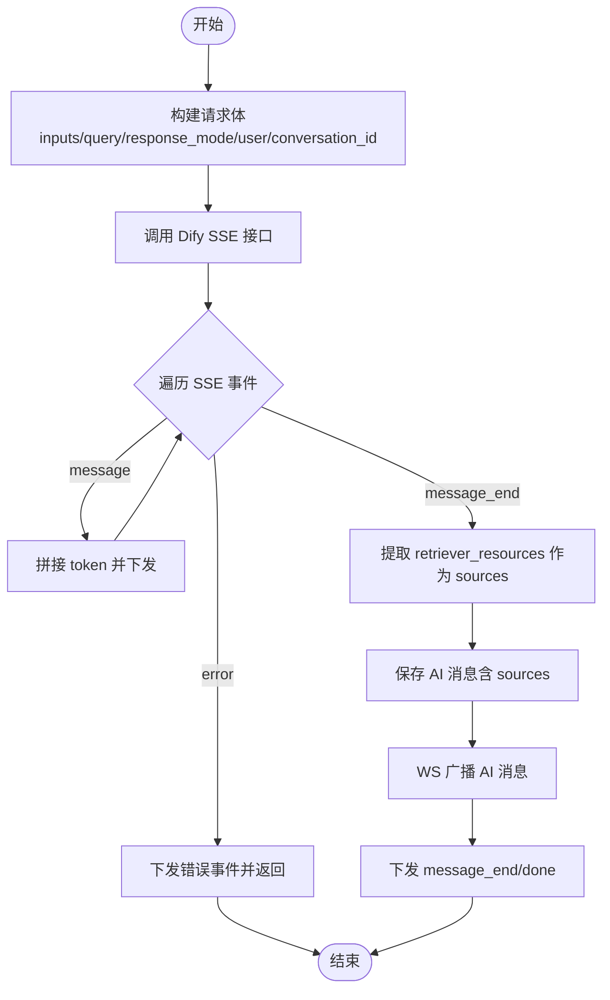
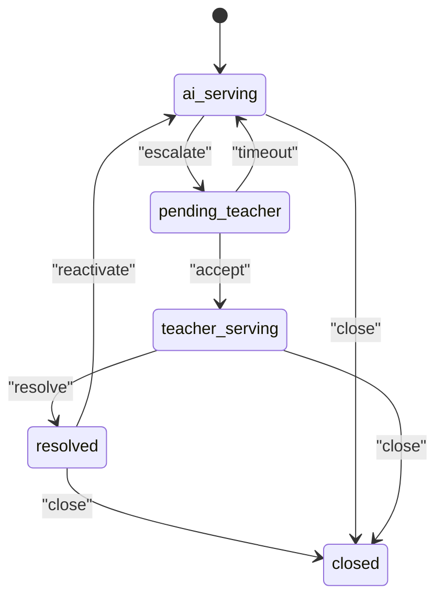
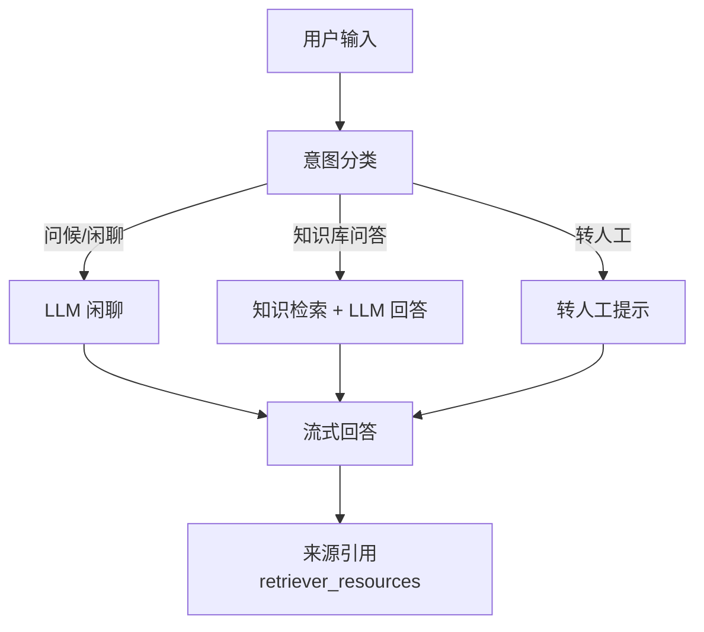
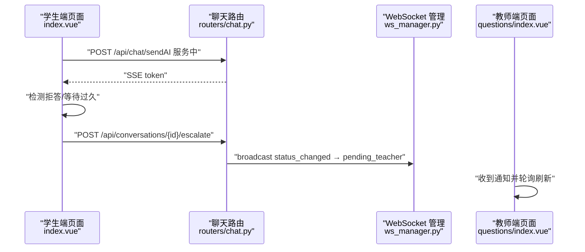
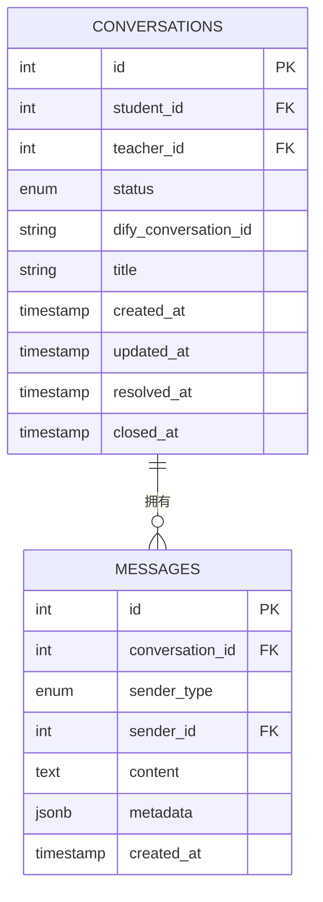
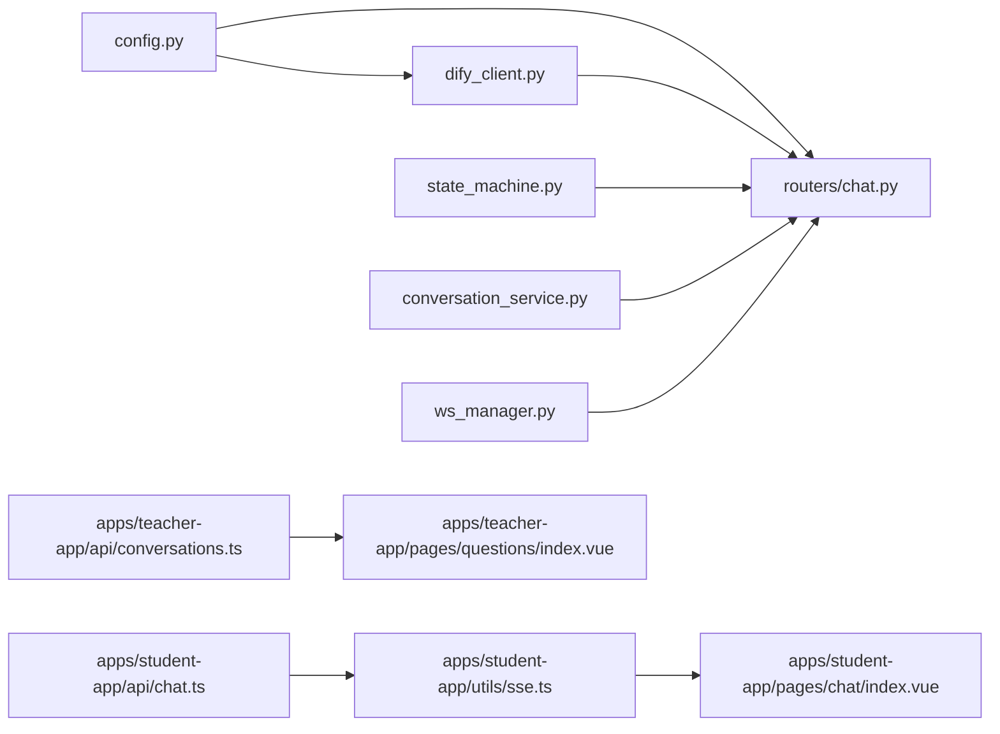

# AI 集成系统

<cite>
**本文档引用的文件**
- [dify_client.py](file://services/gateway/app/services/dify_client.py)
- [state_machine.py](file://services/gateway/app/services/state_machine.py)
- [chat.py](file://services/gateway/app/routers/chat.py)
- [conversation.py](file://services/gateway/app/models/conversation.py)
- [chat.py（学生端 API）](file://apps/student-app/src/api/chat.ts)
- [chat.ts（SSE 客户端）](file://apps/student-app/src/utils/sse.ts)
- [chat.ts（类型定义）](file://apps/student-app/src/types/chat.ts)
- [conversations.py](file://services/gateway/app/routers/conversations.py)
- [conversation_service.py](file://services/gateway/app/services/conversation_service.py)
- [config.py](file://services/gateway/app/config.py)
- [ws_manager.py](file://services/gateway/app/services/ws_manager.py)
- [yixiaoguan-chatflow.yml](file://deploy/dify/yixiaoguan-chatflow.yml)
- [index.vue（学生端聊天页面）](file://apps/student-app/src/pages/chat/index.vue)
- [index.vue（教师端问题列表）](file://apps/teacher-app/src/pages/questions/index.vue)
- [conversations.ts（教师端 API）](file://apps/teacher-app/src/api/conversations.ts)
- [docker-compose.yml](file://deploy/docker-compose.yml)
</cite>

## 目录
1. [简介](#简介)
2. [项目结构](#项目结构)
3. [核心组件](#核心组件)
4. [架构总览](#架构总览)
5. [详细组件分析](#详细组件分析)
6. [依赖关系分析](#依赖关系分析)
7. [性能考虑](#性能考虑)
8. [故障排查指南](#故障排查指南)
9. [结论](#结论)
10. [附录](#附录)

## 简介
本文件面向“医小管 v2”项目的 AI 集成系统，聚焦于 Dify AI 服务的集成实现，涵盖以下主题：
- Dify API 的调用封装与流式响应处理
- 意图识别与 RAG 知识检索在 Dify 工作流中的应用
- 会话状态管理机制（状态机设计、流转规则、错误处理）
- 智能问答完整链路：从用户输入到 AI 响应与来源引用
- 配置与调优指南、质量监控与性能优化方案
- 与人工教师服务的协作机制与问题升级流程

## 项目结构
系统由三部分组成：
- 网关服务（FastAPI）：负责认证、会话管理、Dify 调用、状态机与 WebSocket 广播
- 学生端应用（UniApp/Vue）：通过 SSE 实时接收 AI 回答，支持转人工请求
- 教师端应用（UniApp/Vue）：查看待处理工单、接单、回复与解决

**图表来源**
- [config.py:1-31](file://services/gateway/app/config.py#L1-L31)
- [dify_client.py:1-105](file://services/gateway/app/services/dify_client.py#L1-L105)
- [state_machine.py:1-96](file://services/gateway/app/services/state_machine.py#L1-L96)
- [chat.py:1-191](file://services/gateway/app/routers/chat.py#L1-L191)
- [conversation_service.py:1-179](file://services/gateway/app/services/conversation_service.py#L1-L179)
- [ws_manager.py:1-100](file://services/gateway/app/services/ws_manager.py#L1-L100)
- [chat.ts（学生端 API）:1-36](file://apps/student-app/src/api/chat.ts#L1-L36)
- [chat.ts（SSE 客户端）:1-69](file://apps/student-app/src/utils/sse.ts#L1-L69)
- [index.vue（学生端聊天页面）:1-649](file://apps/student-app/src/pages/chat/index.vue#L1-L649)
- [conversations.ts（教师端 API）:1-44](file://apps/teacher-app/src/api/conversations.ts#L1-L44)
- [index.vue（教师端问题列表）:1-462](file://apps/teacher-app/src/pages/questions/index.vue#L1-L462)

**章节来源**
- [config.py:1-31](file://services/gateway/app/config.py#L1-L31)
- [chat.py:1-191](file://services/gateway/app/routers/chat.py#L1-L191)
- [dify_client.py:1-105](file://services/gateway/app/services/dify_client.py#L1-L105)
- [state_machine.py:1-96](file://services/gateway/app/services/state_machine.py#L1-L96)
- [conversation_service.py:1-179](file://services/gateway/app/services/conversation_service.py#L1-L179)
- [ws_manager.py:1-100](file://services/gateway/app/services/ws_manager.py#L1-L100)
- [chat.ts（学生端 API）:1-36](file://apps/student-app/src/api/chat.ts#L1-L36)
- [chat.ts（SSE 客户端）:1-69](file://apps/student-app/src/utils/sse.ts#L1-L69)
- [index.vue（学生端聊天页面）:1-649](file://apps/student-app/src/pages/chat/index.vue#L1-L649)
- [conversations.ts（教师端 API）:1-44](file://apps/teacher-app/src/api/conversations.ts#L1-L44)
- [index.vue（教师端问题列表）:1-462](file://apps/teacher-app/src/pages/questions/index.vue#L1-L462)

## 核心组件
- Dify 客户端：封装 Dify Chat API 的异步流式调用，解析 SSE 事件，产出 token、结束事件与错误事件
- 会话状态机：定义合法状态转换与系统消息记录，支持升级、接单、解决、关闭等动作
- 聊天路由：统一入口，根据会话状态分流至 AI 流式回答或教师直连路径；保存消息、广播消息与更新会话
- 会话服务：创建/查询/分页消息、权限校验、新增消息并刷新会话时间
- WebSocket 管理：维护用户与房间连接，广播消息与状态变更
- 学生端 SSE 客户端：解析事件流，实时渲染 token、结束事件与错误
- 教师端：查看待处理工单、接单、回复与解决

**章节来源**
- [dify_client.py:11-105](file://services/gateway/app/services/dify_client.py#L11-L105)
- [state_machine.py:8-96](file://services/gateway/app/services/state_machine.py#L8-L96)
- [chat.py:22-191](file://services/gateway/app/routers/chat.py#L22-L191)
- [conversation_service.py:1-179](file://services/gateway/app/services/conversation_service.py#L1-L179)
- [ws_manager.py:8-100](file://services/gateway/app/services/ws_manager.py#L8-L100)
- [chat.ts（SSE 客户端）:1-69](file://apps/student-app/src/utils/sse.ts#L1-L69)

## 架构总览
下图展示了从学生发起消息到 AI 流式响应与来源引用的完整链路，以及与教师端的协作。

**图表来源**
- [chat.py:22-191](file://services/gateway/app/routers/chat.py#L22-L191)
- [dify_client.py:22-101](file://services/gateway/app/services/dify_client.py#L22-L101)
- [conversation.py:26-63](file://services/gateway/app/models/conversation.py#L26-L63)
- [ws_manager.py:71-82](file://services/gateway/app/services/ws_manager.py#L71-L82)
- [index.vue（学生端聊天页面）:423-481](file://apps/student-app/src/pages/chat/index.vue#L423-L481)

## 详细组件分析

### Dify 客户端与流式响应
- 封装 POST /v1/chat-messages（流式），解析 SSE 事件，产出：
  - message：增量 token
  - message_end：包含 retriever_resources 的元数据
  - error：错误信息
- 事件透传给上层生成器，逐 token 下发至前端，并在结束时保存完整 AI 消息与来源引用

**图表来源**
- [dify_client.py:22-101](file://services/gateway/app/services/dify_client.py#L22-L101)
- [chat.py:105-191](file://services/gateway/app/routers/chat.py#L105-L191)

**章节来源**
- [dify_client.py:11-105](file://services/gateway/app/services/dify_client.py#L11-L105)
- [chat.py:105-191](file://services/gateway/app/routers/chat.py#L105-L191)

### 会话状态机与状态流转
- 状态枚举：ai_serving、pending_teacher、teacher_serving、resolved、closed
- 合法转换：
  - ai_serving → pending_teacher（escalate）
  - pending_teacher → teacher_serving（accept）
  - pending_teacher → ai_serving（timeout）
  - teacher_serving → resolved（resolve）
  - resolved → ai_serving（reactivate）
  - resolved/closed → closed（close）
- 每次转换写入系统消息，记录操作者与时间戳

**图表来源**
- [state_machine.py:19-31](file://services/gateway/app/services/state_machine.py#L19-L31)
- [state_machine.py:34-96](file://services/gateway/app/services/state_machine.py#L34-L96)

**章节来源**
- [state_machine.py:8-96](file://services/gateway/app/services/state_machine.py#L8-L96)
- [conversation.py:11-16](file://services/gateway/app/models/conversation.py#L11-L16)

### 智能问答工作流程（含意图识别与 RAG）
- Dify 工作流节点：
  - 意图分类：问候/闲聊/知识库问答/转人工
  - 知识检索：基于知识库的 RAG
  - LLM 回答：结合上下文与检索结果生成回复
  - 结果输出：流式回答，附带来源引用
- 在网关侧，将学生输入与上下文变量（如学校 ID、姓名）注入 Dify 请求，确保个性化与合规

**图表来源**
- [yixiaoguan-chatflow.yml:128-382](file://deploy/dify/yixiaoguan-chatflow.yml#L128-L382)
- [chat.py:114-159](file://services/gateway/app/routers/chat.py#L114-L159)

**章节来源**
- [yixiaoguan-chatflow.yml:1-387](file://deploy/dify/yixiaoguan-chatflow.yml#L1-L387)
- [chat.py:114-159](file://services/gateway/app/routers/chat.py#L114-L159)

### 学生端交互与转人工协作
- 学生端通过 SSE 实时接收 token，渲染 Markdown 并展示来源引用
- 当 AI 拒答或长时间无教师在线时，学生可长按弹出菜单触发转人工
- 转人工后，状态变为 pending_teacher，教师端收到通知并可接单

**图表来源**
- [index.vue（学生端聊天页面）:510-534](file://apps/student-app/src/pages/chat/index.vue#L510-L534)
- [chat.ts（学生端 API）:33-35](file://apps/student-app/src/api/chat.ts#L33-L35)
- [chat.py:43-51](file://services/gateway/app/routers/chat.py#L43-L51)
- [ws_manager.py:71-82](file://services/gateway/app/services/ws_manager.py#L71-L82)
- [index.vue（教师端问题列表）:172-188](file://apps/teacher-app/src/pages/questions/index.vue#L172-L188)

**章节来源**
- [index.vue（学生端聊天页面）:510-534](file://apps/student-app/src/pages/chat/index.vue#L510-L534)
- [chat.ts（学生端 API）:33-35](file://apps/student-app/src/api/chat.ts#L33-L35)
- [chat.py:43-51](file://services/gateway/app/routers/chat.py#L43-L51)
- [index.vue（教师端问题列表）:172-188](file://apps/teacher-app/src/pages/questions/index.vue#L172-L188)

### 数据模型与消息存储
- 会话表：包含状态、教师绑定、Dify 会话 ID、时间戳等
- 消息表：区分发送者类型（学生/教师/AI/系统），支持 JSONB 元数据（如 sources）

**图表来源**
- [conversation.py:26-63](file://services/gateway/app/models/conversation.py#L26-L63)

**章节来源**
- [conversation.py:1-63](file://services/gateway/app/models/conversation.py#L1-L63)

## 依赖关系分析
- 网关服务依赖配置模块读取 Dify 地址与密钥
- 聊天路由依赖会话服务、状态机、Dify 客户端与 WebSocket 管理
- 学生端通过 API 封装与 SSE 客户端与网关交互
- 教师端通过 API 封装与 WebSocket 事件与网关交互

**图表来源**
- [config.py:1-31](file://services/gateway/app/config.py#L1-L31)
- [dify_client.py:1-105](file://services/gateway/app/services/dify_client.py#L1-L105)
- [chat.py:1-191](file://services/gateway/app/routers/chat.py#L1-L191)
- [state_machine.py:1-96](file://services/gateway/app/services/state_machine.py#L1-L96)
- [conversation_service.py:1-179](file://services/gateway/app/services/conversation_service.py#L1-L179)
- [ws_manager.py:1-100](file://services/gateway/app/services/ws_manager.py#L1-L100)
- [chat.ts（学生端 API）:1-36](file://apps/student-app/src/api/chat.ts#L1-L36)
- [chat.ts（SSE 客户端）:1-69](file://apps/student-app/src/utils/sse.ts#L1-L69)
- [index.vue（学生端聊天页面）:1-649](file://apps/student-app/src/pages/chat/index.vue#L1-L649)
- [conversations.ts（教师端 API）:1-44](file://apps/teacher-app/src/api/conversations.ts#L1-L44)
- [index.vue（教师端问题列表）:1-462](file://apps/teacher-app/src/pages/questions/index.vue#L1-L462)

**章节来源**
- [config.py:1-31](file://services/gateway/app/config.py#L1-L31)
- [chat.py:1-191](file://services/gateway/app/routers/chat.py#L1-L191)

## 性能考虑
- 流式传输：采用 SSE 逐 token 下发，降低首字节延迟，提升感知速度
- 连接管理：WebSocket 房间广播减少重复请求，避免轮询压力
- 数据库索引：会话与消息表建立复合索引，加速分页与权限过滤
- 超时与重试：Dify 客户端设置合理超时，异常时快速回退并提示
- 缓存与队列：可引入 Redis 缓存热点会话元数据，减轻数据库压力（部署层面建议）

[本节为通用性能建议，无需具体文件引用]

## 故障排查指南
- SSE 解析异常：客户端需忽略非数据行，捕获 JSON 解析错误
- Dify 错误事件：服务端将 error 事件透传给前端，前端显示友好提示
- 状态机非法转换：当动作与当前状态不匹配时抛出异常，需检查调用顺序
- WebSocket 断线：管理器自动清理失效连接，必要时启用轮询兜底
- 配置缺失：确认 Dify 地址、API Key、数据集 Key 已正确注入环境变量

**章节来源**
- [chat.ts（SSE 客户端）:46-67](file://apps/student-app/src/utils/sse.ts#L46-L67)
- [chat.py:145-153](file://services/gateway/app/routers/chat.py#L145-L153)
- [state_machine.py:8-14](file://services/gateway/app/services/state_machine.py#L8-L14)
- [ws_manager.py:34-46](file://services/gateway/app/services/ws_manager.py#L34-L46)
- [config.py:15-19](file://services/gateway/app/config.py#L15-L19)
- [docker-compose.yml:11-17](file://deploy/docker-compose.yml#L11-L17)

## 结论
本系统以 Dify 为核心，结合状态机与 WebSocket，实现了从意图识别、RAG 检索到流式回答与来源引用的完整链路。学生端与教师端通过统一网关协同，既保证了 AI 的高效率，又提供了平滑的人工介入通道。建议在生产环境中强化监控与告警、优化数据库索引与缓存策略，并持续迭代 Dify 工作流以提升意图识别与回答质量。

[本节为总结性内容，无需具体文件引用]

## 附录

### AI 服务配置与调优
- 环境变量
  - 数据库与 Redis：用于持久化与会话状态
  - JWT：令牌签名与有效期
  - Dify：API 地址、API Key、全局数据集 ID、数据集 API Key
- Docker 部署
  - 端口映射：网关服务暴露 8100:8000
  - 环境变量注入：通过 compose 文件传递配置
- Dify 工作流
  - 意图分类：greeting/chitchat/kb_query/transfer
  - RAG：检索模式、上下文窗口、温度参数
  - 输出：流式回答与 retriever_resources

**章节来源**
- [config.py:6-26](file://services/gateway/app/config.py#L6-L26)
- [docker-compose.yml:1-21](file://deploy/docker-compose.yml#L1-L21)
- [yixiaoguan-chatflow.yml:128-382](file://deploy/dify/yixiaoguan-chatflow.yml#L128-L382)

### 服务质量监控与性能优化
- 监控指标
  - AI 响应时延（首 token 与完整回答）
  - SSE 事件丢包率与重连次数
  - Dify 调用成功率与错误码分布
  - 会话状态切换频率与平均停留时长
- 优化建议
  - 前端：预渲染占位、骨架屏、滚动优化
  - 后端：连接池、批量写入、索引优化
  - 中间件：限流、熔断、重试与降级策略

[本节为通用指导，无需具体文件引用]