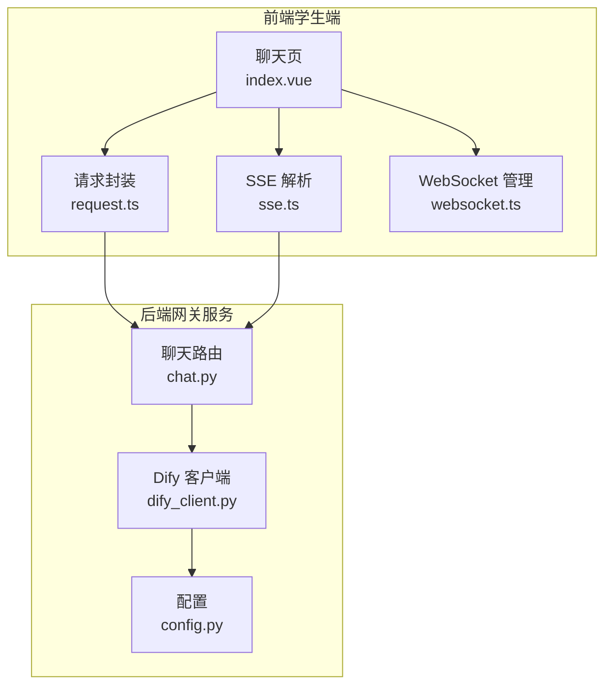
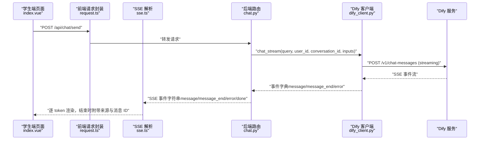
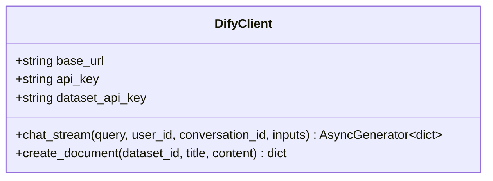
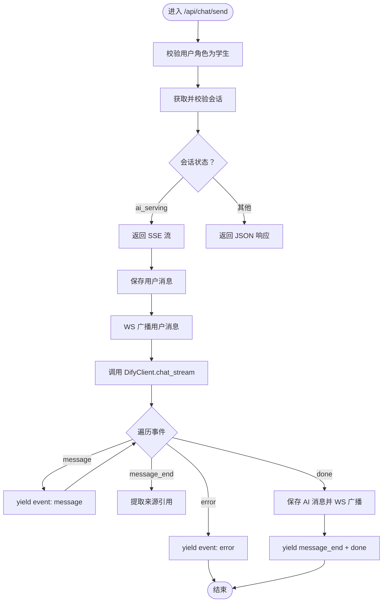
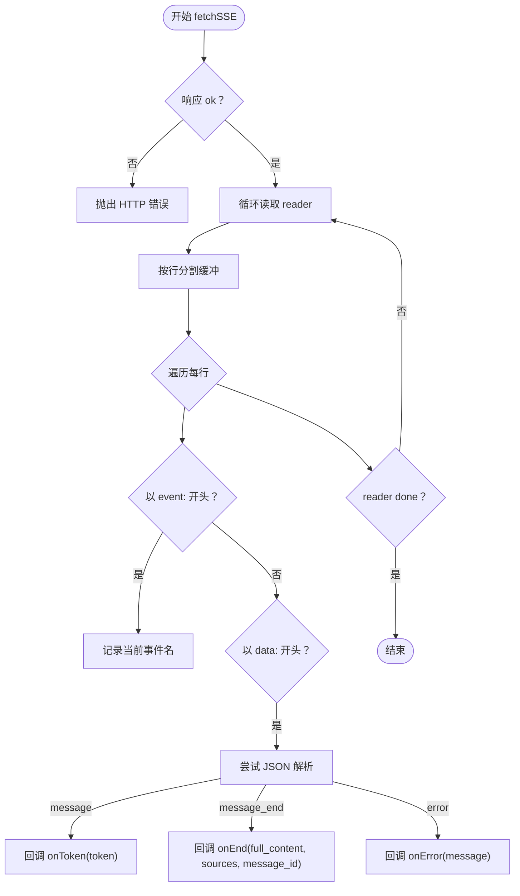
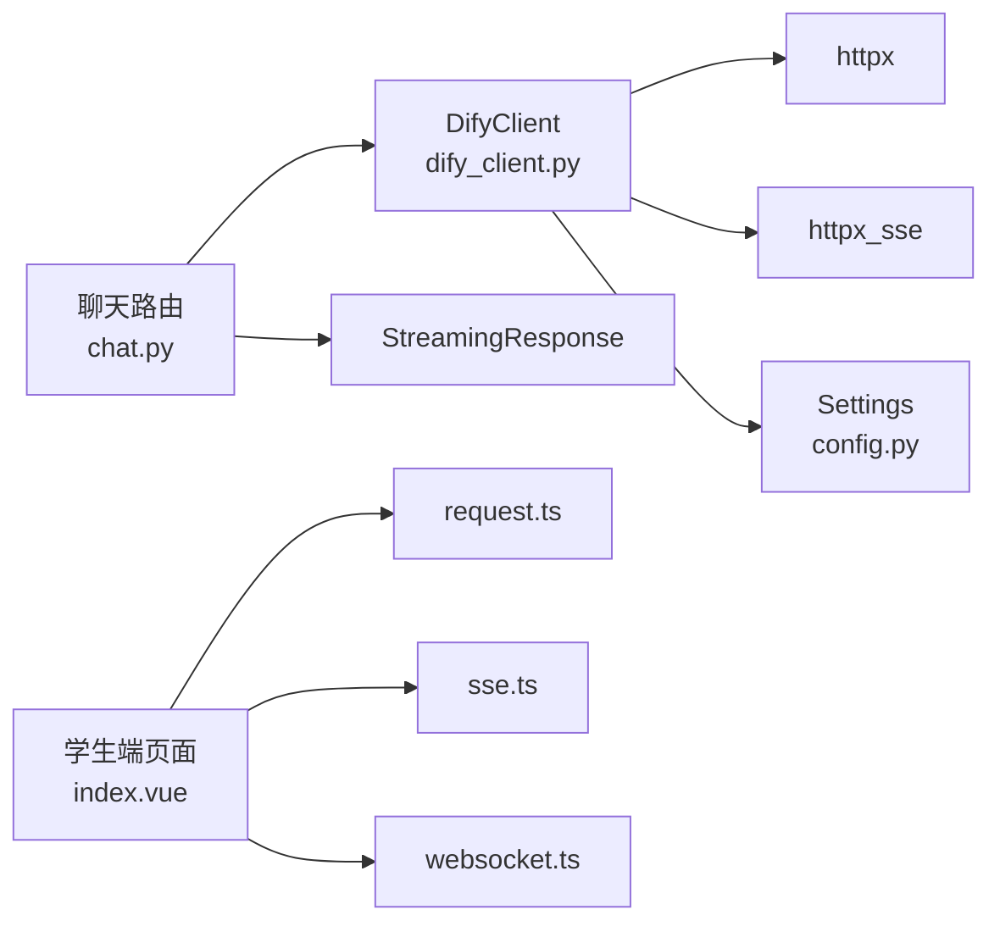

# Dify 服务集成

<cite>
**本文档引用的文件**
- [dify_client.py](file://services/gateway/app/services/dify_client.py)
- [config.py](file://services/gateway/app/config.py)
- [chat.py](file://services/gateway/app/routers/chat.py)
- [request.ts（学生端）](file://apps/student-app/src/utils/request.ts)
- [request.ts（教师端）](file://apps/teacher-app/src/utils/request.ts)
- [sse.ts](file://apps/student-app/src/utils/sse.ts)
- [chat.ts（学生端 API）](file://apps/student-app/src/api/chat.ts)
- [conversations.ts（教师端 API）](file://apps/teacher-app/src/api/conversations.ts)
- [index.vue（学生端聊天页）](file://apps/student-app/src/pages/chat/index.vue)
- [websocket.ts](file://apps/student-app/src/utils/websocket.ts)
- [chat.ts（类型定义）](file://apps/student-app/src/types/chat.ts)
- [api.ts（类型定义）](file://apps/teacher-app/src/types/api.ts)
</cite>

## 目录
1. [简介](#简介)
2. [项目结构](#项目结构)
3. [核心组件](#核心组件)
4. [架构总览](#架构总览)
5. [详细组件分析](#详细组件分析)
6. [依赖关系分析](#依赖关系分析)
7. [性能考虑](#性能考虑)
8. [故障排查指南](#故障排查指南)
9. [结论](#结论)
10. [附录](#附录)

## 简介
本文件面向 Dify AI 服务在本项目的集成，围绕后端 Python 客户端 DifyClient 的实现进行深入解析，覆盖以下主题：
- 流式聊天 API 调用（SSE）、文档创建 API（知识库迁移）
- 异步客户端配置、HTTP 请求构建、SSE 事件处理与错误处理
- API 密钥管理、超时配置、连接池设置等安全与性能优化
- 前端对流式响应数据格式与事件类型的正确处理方式
- 实际代码示例与最佳实践指引

## 项目结构
本项目采用前后端分离架构，Dify 集成主要分布在网关服务（Python/FastAPI）与前端应用（Vue/UniApp）两部分：
- 后端网关服务负责封装 Dify API 调用、状态机流转、SSE 流式转发、数据库持久化与 WebSocket 广播
- 前端应用负责用户交互、SSE 流式消费、WebSocket 会话广播、错误提示与状态切换

图表来源
- [chat.py:22-102](file://services/gateway/app/routers/chat.py#L22-L102)
- [dify_client.py:11-105](file://services/gateway/app/services/dify_client.py#L11-L105)
- [config.py:3-31](file://services/gateway/app/config.py#L3-L31)
- [request.ts（学生端）:1-44](file://apps/student-app/src/utils/request.ts#L1-L44)
- [sse.ts:13-69](file://apps/student-app/src/utils/sse.ts#L13-L69)
- [websocket.ts:3-153](file://apps/student-app/src/utils/websocket.ts#L3-L153)

章节来源
- [chat.py:1-191](file://services/gateway/app/routers/chat.py#L1-L191)
- [dify_client.py:1-105](file://services/gateway/app/services/dify_client.py#L1-L105)
- [config.py:1-31](file://services/gateway/app/config.py#L1-L31)

## 核心组件
- DifyClient：封装 Dify API 调用，提供流式聊天与文档创建能力
- FastAPI 路由 chat.py：接收前端请求，根据会话状态选择 SSE 或 JSON 路径，并与 DifyClient 交互
- 前端 SSE 工具 sse.ts：解析后端 SSE 事件，分发 message/message_end/error
- 前端请求封装 request.ts：统一处理 HTTP 请求、鉴权头注入、错误码映射
- 前端 WebSocket 管理 websocket.ts：房间加入/离开、心跳、断线重连与消息派发

章节来源
- [dify_client.py:11-105](file://services/gateway/app/services/dify_client.py#L11-L105)
- [chat.py:22-191](file://services/gateway/app/routers/chat.py#L22-L191)
- [sse.ts:13-69](file://apps/student-app/src/utils/sse.ts#L13-L69)
- [request.ts（学生端）:1-44](file://apps/student-app/src/utils/request.ts#L1-L44)
- [websocket.ts:3-153](file://apps/student-app/src/utils/websocket.ts#L3-L153)

## 架构总览
下图展示了从学生端发起消息到收到 Dify 流式响应的完整链路，以及后端如何将事件转换为标准 SSE 并持久化 AI 回复。

图表来源
- [chat.py:83-153](file://services/gateway/app/routers/chat.py#L83-L153)
- [dify_client.py:22-69](file://services/gateway/app/services/dify_client.py#L22-L69)
- [sse.ts:13-69](file://apps/student-app/src/utils/sse.ts#L13-L69)

## 详细组件分析

### DifyClient 组件
- 职责
  - 封装 Dify Chat API 的流式调用，按事件类型产出统一字典
  - 封装 Dify 文档创建 API，用于知识库迁移场景
- 关键点
  - 使用异步 HTTP 客户端与 SSE 连接，支持超时控制
  - 对非 JSON 的 SSE 数据进行容错记录
  - 通过配置读取 Dify 基础地址与 API Key

图表来源
- [dify_client.py:11-105](file://services/gateway/app/services/dify_client.py#L11-L105)

章节来源
- [dify_client.py:11-105](file://services/gateway/app/services/dify_client.py#L11-L105)

### FastAPI 路由与状态机
- 职责
  - 根据会话状态决定返回路径：AI 服务时返回 SSE，教师服务时返回 JSON
  - 在 SSE 路径中逐事件转发，并在 message_end 时持久化 AI 消息与来源信息
  - 处理异常并向前端发送 error 事件
- 关键点
  - 使用 StreamingResponse 输出 text/event-stream
  - 通过 dify_client.chat_stream 获取事件流
  - 保存 AI 消息后通过 WebSocket 广播

图表来源
- [chat.py:22-191](file://services/gateway/app/routers/chat.py#L22-L191)

章节来源
- [chat.py:22-191](file://services/gateway/app/routers/chat.py#L22-L191)

### 前端 SSE 事件处理
- 职责
  - 解析后端 SSE 事件，区分 message/token、message_end/full_content/sources/message_id、error
  - 将 token 逐步拼接至当前 AI 消息，结束后填充完整内容与来源
- 关键点
  - 事件名与数据字段需与后端保持一致
  - 对非数据行进行健壮性处理，避免解析异常中断

图表来源
- [sse.ts:13-69](file://apps/student-app/src/utils/sse.ts#L13-L69)

章节来源
- [sse.ts:13-69](file://apps/student-app/src/utils/sse.ts#L13-L69)

### 前端请求封装与错误处理
- 学生端请求封装
  - 自动注入 Authorization 头（若存在 token）
  - 统一处理 401、422 及其他 HTTP 错误，映射为用户可理解的消息
- 教师端请求封装
  - 统一处理 401 未授权跳转登录
  - 支持查询参数拼接与默认超时配置

章节来源
- [request.ts（学生端）:1-44](file://apps/student-app/src/utils/request.ts#L1-L44)
- [request.ts（教师端）:1-108](file://apps/teacher-app/src/utils/request.ts#L1-L108)

### 配置与密钥管理
- 配置项
  - Dify 基础地址、API Key、全局数据集 ID、数据集 API Key
  - 通过环境变量文件加载
- 安全建议
  - 生产环境务必设置强密钥与只读权限的数据集 API Key
  - 限制 API Key 的访问来源与作用域

章节来源
- [config.py:3-31](file://services/gateway/app/config.py#L3-L31)

## 依赖关系分析
- 后端依赖
  - httpx 异步 HTTP 客户端
  - httpx_sse 异步 SSE 连接
  - Pydantic 设置（读取 .env）
- 前端依赖
  - uni.request/fetch 与 uni.connectSocket
  - Vue 响应式与生命周期钩子

图表来源
- [dify_client.py:1-105](file://services/gateway/app/services/dify_client.py#L1-L105)
- [config.py:1-31](file://services/gateway/app/config.py#L1-L31)
- [chat.py:1-191](file://services/gateway/app/routers/chat.py#L1-L191)
- [request.ts（学生端）:1-44](file://apps/student-app/src/utils/request.ts#L1-L44)
- [sse.ts:1-69](file://apps/student-app/src/utils/sse.ts#L1-L69)
- [websocket.ts:1-153](file://apps/student-app/src/utils/websocket.ts#L1-L153)

章节来源
- [dify_client.py:1-105](file://services/gateway/app/services/dify_client.py#L1-L105)
- [chat.py:1-191](file://services/gateway/app/routers/chat.py#L1-L191)

## 性能考虑
- 超时配置
  - Dify 流式聊天：120 秒
  - 文档创建：60 秒
  - 建议：根据网络与模型响应时间调整，避免长时间占用连接
- 连接池与并发
  - 当前实现为每次调用创建独立异步客户端；如需高并发，建议引入连接池与限流策略
- SSE 缓冲与解析
  - 前端按行解析，注意大文本分片传输的健壮性
- 数据持久化
  - message_end 后一次性保存 AI 消息，减少数据库写入次数

章节来源
- [dify_client.py:55-100](file://services/gateway/app/services/dify_client.py#L55-L100)
- [chat.py:105-191](file://services/gateway/app/routers/chat.py#L105-L191)

## 故障排查指南
- 常见错误与定位
  - 401 未授权：检查前端是否注入了有效 token，后端路由是否允许当前角色访问
  - 422 参数错误：检查请求体字段与类型
  - Dify 服务异常：后端捕获异常并下发 error 事件，前端应提示用户重试
- 日志与可观测性
  - 后端对 SSE 非 JSON 数据进行警告日志记录，便于排查上游数据异常
- 断线与重连
  - 前端 WebSocket 管理器具备断线重连与心跳机制，确保会话广播稳定

章节来源
- [request.ts（学生端）:25-36](file://apps/student-app/src/utils/request.ts#L25-L36)
- [chat.py:150-153](file://services/gateway/app/routers/chat.py#L150-L153)
- [websocket.ts:129-135](file://apps/student-app/src/utils/websocket.ts#L129-L135)

## 结论
本集成以 DifyClient 为核心，结合 FastAPI 的 SSE 转发与前端的事件解析，实现了从学生端到 Dify 的低延迟流式对话体验。通过明确的事件类型与错误处理机制，系统在可用性与可维护性之间取得平衡。建议在生产环境中强化密钥管理、连接池与超时策略，并持续监控 SSE 事件的稳定性。

## 附录

### API 密钥管理与安全建议
- 使用独立的只读数据集 API Key 用于文档创建
- 限制 API Key 的来源 IP 与作用域
- 在 .env 中设置默认值，生产环境通过环境变量注入

章节来源
- [config.py:15-19](file://services/gateway/app/config.py#L15-L19)

### 超时与连接池配置建议
- 当前实现为每次调用创建异步客户端，适合低并发场景
- 高并发建议：
  - 复用 httpx.AsyncClient 并启用连接池
  - 设置合理的连接池大小与 keep-alive 超时
  - 对 Dify API 调用增加重试与熔断策略

章节来源
- [dify_client.py:55-100](file://services/gateway/app/services/dify_client.py#L55-L100)

### 流式响应数据格式与事件类型
- 事件类型
  - message：携带 token 字段，前端逐字渲染
  - message_end：携带 full_content、sources、message_id，前端完成拼接与来源展示
  - error：携带 message 字段，前端提示错误
  - done：表示流结束，前端可停止加载态
- 前端处理要点
  - 严格区分 event 与 data 行
  - 对非 JSON 的 data 行进行容错处理
  - 保持与后端一致的字段命名与数据结构

章节来源
- [chat.py:122-149](file://services/gateway/app/routers/chat.py#L122-L149)
- [sse.ts:46-66](file://apps/student-app/src/utils/sse.ts#L46-L66)

### 前端页面与工具使用示例
- 学生端聊天页
  - 发送消息时根据会话状态选择 SSE 或 JSON 路径
  - 使用 fetchSSE 消费流式事件，更新消息内容与来源
- WebSocket 管理
  - 自动重连、心跳、房间加入/离开与消息派发

章节来源
- [index.vue（学生端聊天页）:423-481](file://apps/student-app/src/pages/chat/index.vue#L423-L481)
- [websocket.ts:3-153](file://apps/student-app/src/utils/websocket.ts#L3-L153)