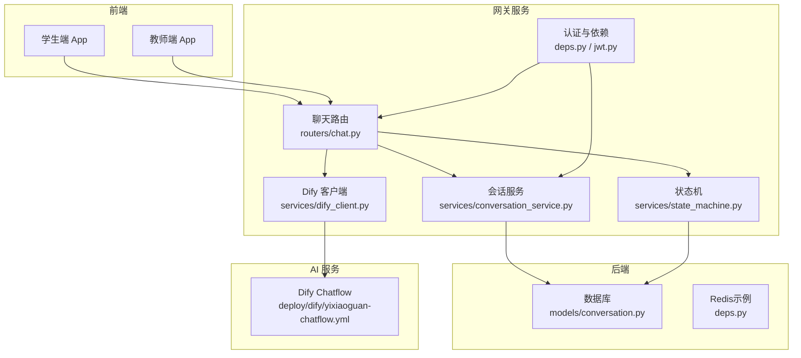
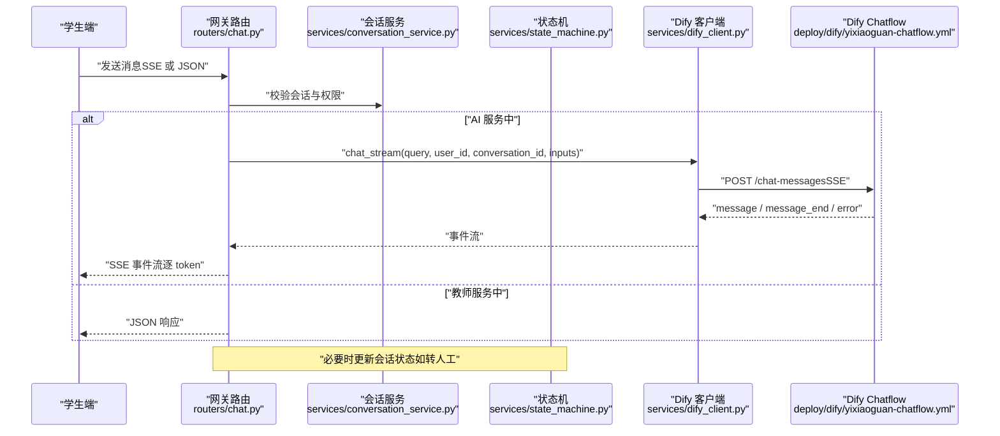
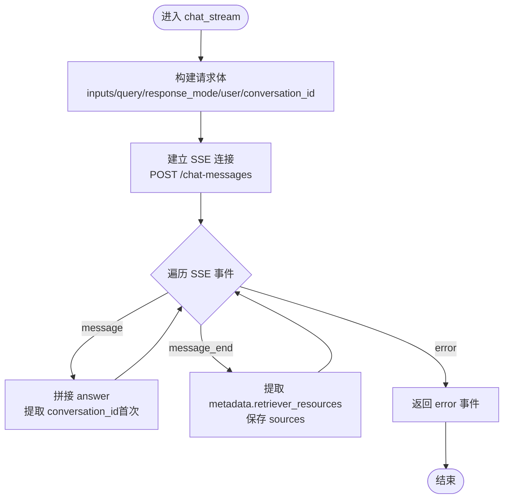
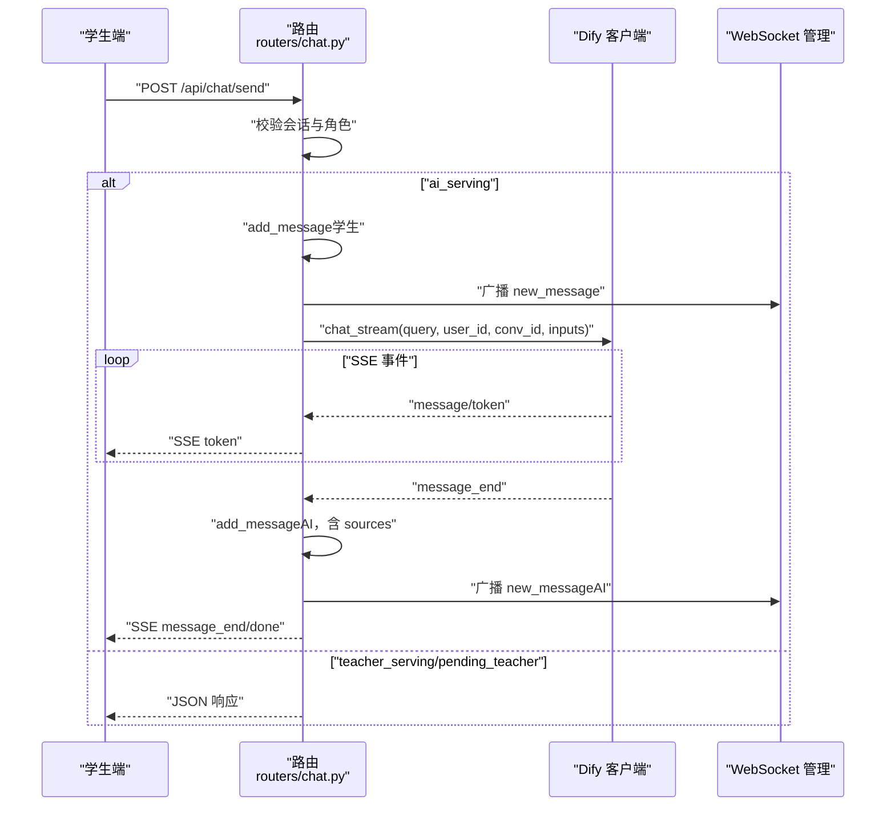
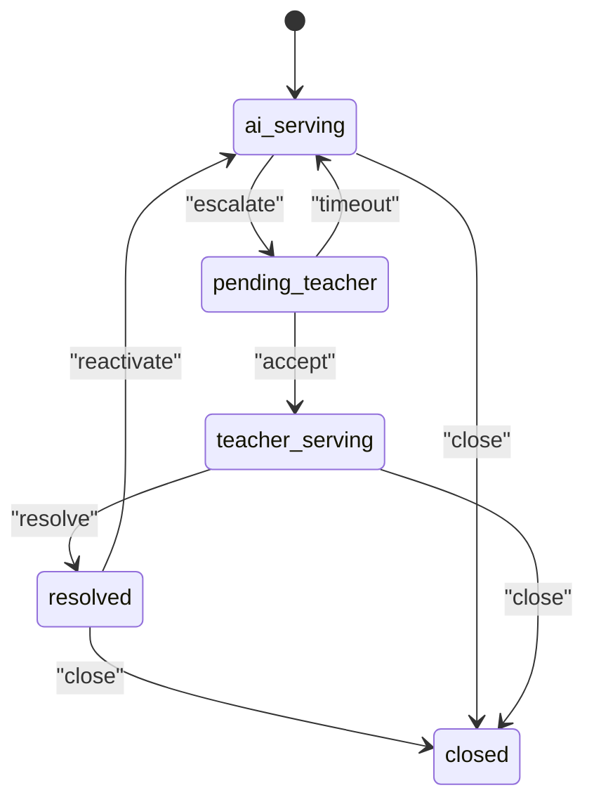
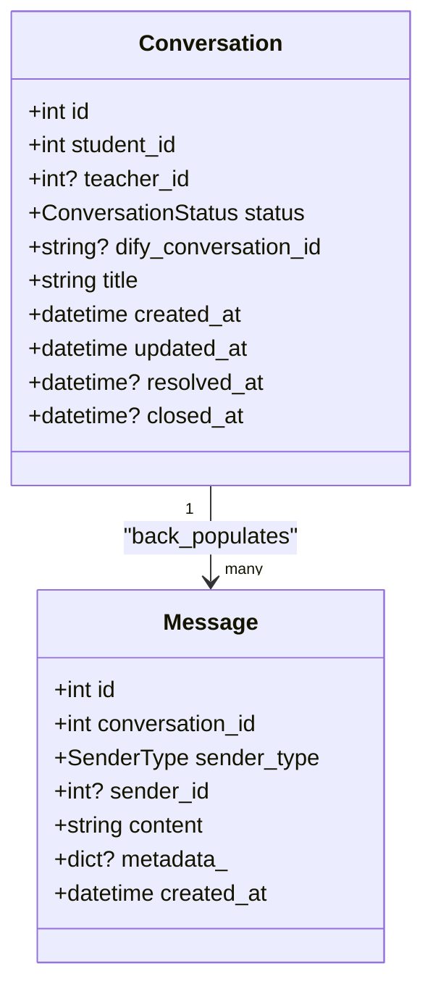
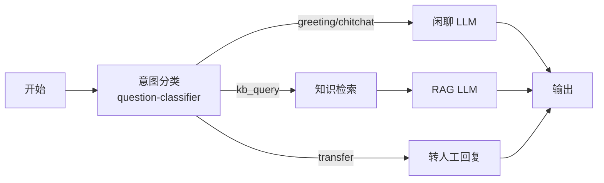
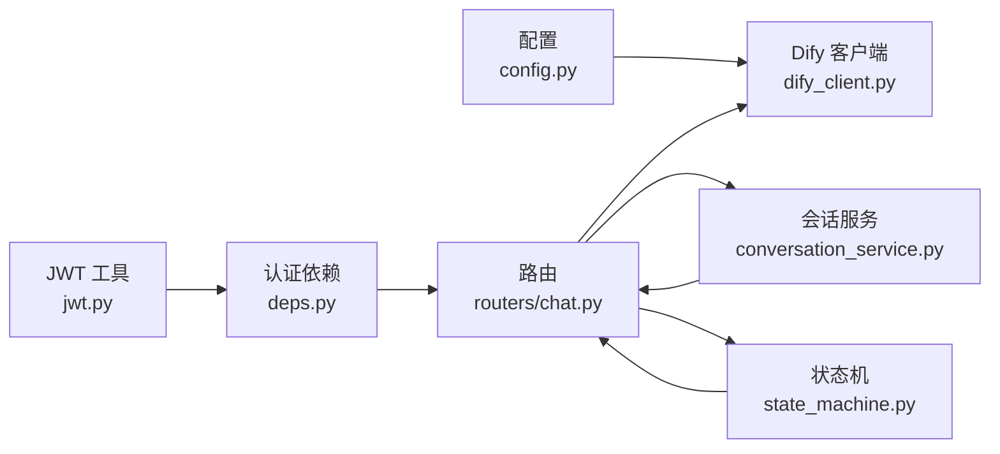

# 意图识别与分类

<cite>
**本文档引用的文件**
- [dify_client.py](file://services/gateway/app/services/dify_client.py)
- [state_machine.py](file://services/gateway/app/services/state_machine.py)
- [chat.py](file://services/gateway/app/routers/chat.py)
- [chat.py（Schema）](file://services/gateway/app/schemas/chat.py)
- [conversation.py](file://services/gateway/app/models/conversation.py)
- [config.py](file://services/gateway/app/config.py)
- [yixiaoguan-chatflow.yml](file://deploy/dify/yixiaoguan-chatflow.yml)
- [dify-chatflow-design.md](file://docs/design/dify-chatflow-design.md)
- [conversation_service.py](file://services/gateway/app/services/conversation_service.py)
- [deps.py](file://services/gateway/app/utils/deps.py)
- [jwt.py](file://services/gateway/app/utils/jwt.py)
- [chat.ts（前端 API）](file://apps/student-app/src/api/chat.ts)
- [conversations.ts（教师端 API）](file://apps/teacher-app/src/api/conversations.ts)
- [chat.vue（学生端页面）](file://apps/student-app/src/pages/chat/index.vue)
- [conversation.ts（教师端类型）](file://apps/teacher-app/src/types/conv.ts)
</cite>

## 目录
1. [简介](#简介)
2. [项目结构](#项目结构)
3. [核心组件](#核心组件)
4. [架构总览](#架构总览)
5. [详细组件分析](#详细组件分析)
6. [依赖分析](#依赖分析)
7. [性能考虑](#性能考虑)
8. [故障排查指南](#故障排查指南)
9. [结论](#结论)
10. [附录](#附录)

## 简介
本文件面向“AI 意图识别与分类系统”，围绕通过 Dify AI 服务实现的自然语言理解、意图分类与实体抽取能力，系统性阐述其在会话状态管理中的作用、自动流程路由机制、配置参数与阈值设定、以及复杂查询与多轮对话的处理策略。文档同时给出关键代码位置与可视化图示，帮助开发者快速定位实现细节与扩展点。

## 项目结构
系统采用前后端分离与微服务网关模式：
- 网关服务（FastAPI）负责认证、会话与消息持久化、状态机流转、以及与 Dify 的 SSE 流式通信。
- Dify Chatflow 作为意图识别与 RAG 的执行引擎，包含“意图分类 → 闲聊/RAG/转人工”等分支。
- 前端应用（学生端与教师端）通过 API 与 WebSocket 实现消息收发与状态同步。

图表来源
- [chat.py:1-191](file://services/gateway/app/routers/chat.py#L1-L191)
- [dify_client.py:1-105](file://services/gateway/app/services/dify_client.py#L1-L105)
- [state_machine.py:1-96](file://services/gateway/app/services/state_machine.py#L1-L96)
- [conversation.py:1-63](file://services/gateway/app/models/conversation.py#L1-L63)
- [yixiaoguan-chatflow.yml:1-387](file://deploy/dify/yixiaoguan-chatflow.yml#L1-L387)

章节来源
- [chat.py:1-191](file://services/gateway/app/routers/chat.py#L1-L191)
- [dify_client.py:1-105](file://services/gateway/app/services/dify_client.py#L1-L105)
- [state_machine.py:1-96](file://services/gateway/app/services/state_machine.py#L1-L96)
- [conversation.py:1-63](file://services/gateway/app/models/conversation.py#L1-L63)
- [yixiaoguan-chatflow.yml:1-387](file://deploy/dify/yixiaoguan-chatflow.yml#L1-L387)

## 核心组件
- Dify 客户端：封装 Dify Chat API 的流式调用，支持事件驱动的数据解析与错误处理。
- 会话与消息模型：统一存储会话状态、消息体与元数据（含来源引用）。
- 状态机：定义会话状态合法转换与系统消息写入。
- 聊天路由：根据会话状态路由至 AI 流式回答或教师直连路径；在 AI 路径中转发 Dify 的 SSE 事件。
- Chatflow：在 Dify 中定义意图分类器与分支逻辑（闲聊、知识库问答、转人工）。

章节来源
- [dify_client.py:11-105](file://services/gateway/app/services/dify_client.py#L11-L105)
- [conversation.py:26-63](file://services/gateway/app/models/conversation.py#L26-L63)
- [state_machine.py:16-96](file://services/gateway/app/services/state_machine.py#L16-L96)
- [chat.py:22-191](file://services/gateway/app/routers/chat.py#L22-L191)
- [yixiaoguan-chatflow.yml:128-186](file://deploy/dify/yixiaoguan-chatflow.yml#L128-L186)

## 架构总览
下图展示了从用户输入到 AI 回答、再到前端展示的全链路，以及意图识别在其中的关键作用。

图表来源
- [chat.py:22-191](file://services/gateway/app/routers/chat.py#L22-L191)
- [dify_client.py:22-69](file://services/gateway/app/services/dify_client.py#L22-L69)
- [yixiaoguan-chatflow.yml:128-186](file://deploy/dify/yixiaoguan-chatflow.yml#L128-L186)

## 详细组件分析

### 组件 A：Dify 客户端与 Chatflow 集成
- 职责：封装 Dify Chat API 的流式调用，解析 SSE 事件，透传 conversation_id 与 metadata。
- 关键点：
  - 使用 HTTPX 的异步客户端与 httpx_sse 的 aconnect_sse 进行 SSE 连接。
  - 事件类型包括 message（逐 token）、message_end（最终聚合）、error（错误）。
  - 将 inputs（如 college_id、student_name）注入到 Dify 请求中，用于个性化与上下文增强。
- 错误处理：对非 JSON 的 SSE 数据进行告警；捕获异常并返回 error 事件。

图表来源
- [dify_client.py:22-69](file://services/gateway/app/services/dify_client.py#L22-L69)

章节来源
- [dify_client.py:11-105](file://services/gateway/app/services/dify_client.py#L11-L105)
- [yixiaoguan-chatflow.yml:128-186](file://deploy/dify/yixiaoguan-chatflow.yml#L128-L186)

### 组件 B：聊天路由与状态路由
- 职责：根据会话状态决定消息处理路径；AI 路径返回 SSE 流；教师路径返回 JSON。
- 关键点：
  - 学生端发送消息后，先保存消息并广播至房间。
  - 若状态为 ai_serving，则调用 _stream_ai_response，内部通过 Dify 客户端拉取流式回答。
  - 在 message_end 事件后，保存 AI 消息、更新 conversation_id（若首次生成）、并通过 WebSocket 广播。
  - 若状态为 teacher_serving/pending_teacher，则直接返回 JSON 响应。
- 会话状态变更：当学生在 resolved 状态下发送消息时，自动触发 reactivate，回到 ai_serving。

图表来源
- [chat.py:22-191](file://services/gateway/app/routers/chat.py#L22-L191)
- [dify_client.py:22-69](file://services/gateway/app/services/dify_client.py#L22-L69)

章节来源
- [chat.py:22-191](file://services/gateway/app/routers/chat.py#L22-L191)

### 组件 C：状态机与会话状态管理
- 职责：定义会话状态的合法转换与系统消息写入。
- 关键点：
  - 合法转换表：ai_serving → pending_teacher（escalate）、pending_teacher → teacher_serving（accept）、teacher_serving → resolved（resolve）、resolved → ai_serving（reactivate）、任意状态 → closed（close）。
  - 转换时写入系统消息，携带动作说明与额外元数据。
  - 支持 actor 信息（如教师）与时间戳字段（resolved_at/closed_at）。

图表来源
- [state_machine.py:19-31](file://services/gateway/app/services/state_machine.py#L19-L31)

章节来源
- [state_machine.py:16-96](file://services/gateway/app/services/state_machine.py#L16-L96)

### 组件 D：模型与数据结构
- 会话状态枚举：ai_serving、pending_teacher、teacher_serving、resolved、closed。
- 发送者类型：student、ai、teacher、system。
- 消息模型：包含 content 与 JSONB 的 metadata 字段（用于 sources 等）。

图表来源
- [conversation.py:26-63](file://services/gateway/app/models/conversation.py#L26-L63)

章节来源
- [conversation.py:11-63](file://services/gateway/app/models/conversation.py#L11-L63)

### 组件 E：意图识别与分类（Chatflow）
- Chatflow 节点：
  - 开始 → 意图分类（question-classifier）→ 分支：
    - greeting/chitchat → 闲聊 LLM → 输出
    - kb_query → 知识检索（RAG）→ RAG LLM → 输出
    - transfer → 固定转人工回复
- 意图分类规则（示例）：greeting（问候）、chitchat（闲聊）、kb_query（校园事务查询）、transfer（明确转人工）。
- RAG 配置：数据集、嵌入与重排模型、Top K、阈值（当前未启用）。

图表来源
- [yixiaoguan-chatflow.yml:128-186](file://deploy/dify/yixiaoguan-chatflow.yml#L128-L186)
- [dify-chatflow-design.md:8-21](file://docs/design/dify-chatflow-design.md#L8-L21)

章节来源
- [yixiaoguan-chatflow.yml:128-186](file://deploy/dify/yixiaoguan-chatflow.yml#L128-L186)
- [dify-chatflow-design.md:23-51](file://docs/design/dify-chatflow-design.md#L23-L51)

### 组件 F：前端集成与交互
- 学生端：
  - 使用 fetchSSE 接收 Dify 的流式 token，渲染 Markdown 并展示来源引用。
  - 当 AI 回答被判定为“拒答”时，显示“转人工”入口。
  - 通过 WebSocket 监听新消息与状态变更事件，保持界面实时更新。
- 教师端：
  - 通过 API 列表与详情查看会话，支持接单、解决、关闭等状态变更。

章节来源
- [chat.vue（学生端页面）:423-481](file://apps/student-app/src/pages/chat/index.vue#L423-L481)
- [chat.ts（前端 API）:1-36](file://apps/student-app/src/api/chat.ts#L1-L36)
- [conversations.ts（教师端 API）:1-44](file://apps/teacher-app/src/api/conversations.ts#L1-L44)
- [conversation.ts（教师端类型）:1-18](file://apps/teacher-app/src/types/conv.ts#L1-L18)

## 依赖分析
- 网关路由依赖会话服务与状态机，以确保消息持久化与状态变更的原子性。
- Dify 客户端依赖配置模块提供的 API 地址与密钥。
- 前端通过 API 与 WebSocket 与网关交互，实现消息与状态的双向同步。

图表来源
- [config.py:15-19](file://services/gateway/app/config.py#L15-L19)
- [dify_client.py:14-17](file://services/gateway/app/services/dify_client.py#L14-L17)
- [deps.py:14-35](file://services/gateway/app/utils/deps.py#L14-L35)
- [jwt.py:6-16](file://services/gateway/app/utils/jwt.py#L6-L16)
- [chat.py:1-19](file://services/gateway/app/routers/chat.py#L1-L19)

章节来源
- [config.py:1-31](file://services/gateway/app/config.py#L1-L31)
- [deps.py:1-40](file://services/gateway/app/utils/deps.py#L1-L40)
- [jwt.py:1-17](file://services/gateway/app/utils/jwt.py#L1-L17)
- [chat.py:1-19](file://services/gateway/app/routers/chat.py#L1-L19)

## 性能考虑
- 流式传输：通过 SSE 将 Dify 的 token 逐步返回，降低首字节延迟，提升用户体验。
- 事件解析：对非 JSON 的 SSE 数据进行告警，避免阻塞主循环。
- 会话与消息持久化：在 message_end 后统一保存 AI 消息，减少重复 IO。
- 状态机原子更新：在状态变更时一次性写入系统消息与更新字段，保证一致性。
- 建议：
  - 为 Dify API 设置合理的超时与重试策略。
  - 对高频拒答场景，可在网关侧统计并上报，辅助优化意图分类阈值与提示词。

## 故障排查指南
- 常见错误事件：
  - Dify 返回 error：前端显示“AI 服务暂时不可用”，可提示稍后重试。
  - 网关异常：捕获异常并返回 error 事件，前端统一提示。
- 排查步骤：
  - 确认 Dify API 地址与密钥配置正确。
  - 检查 conversation_id 是否在首次调用后被正确回写。
  - 核对会话状态是否符合预期（如 resolved → reactivate）。
  - 检查 WebSocket 广播是否正常，前端是否订阅了对应房间。

章节来源
- [dify_client.py:145-153](file://services/gateway/app/services/dify_client.py#L145-L153)
- [chat.py:145-153](file://services/gateway/app/routers/chat.py#L145-L153)

## 结论
本系统通过 Dify Chatflow 的意图识别与分类能力，结合网关的状态机与消息持久化机制，实现了从自然语言理解到自动流程路由的闭环。意图分类器将用户输入归类为问候、闲聊、知识库查询与转人工四类，分别走不同的处理分支；网关在 AI 路径中以 SSE 流式返回，提升交互体验；在需要人工介入时，通过状态机与前端联动实现平滑过渡。整体架构清晰、扩展点明确，适合在教育场景中持续演进。

## 附录

### A. 配置参数与阈值
- Dify 配置（来自配置模块）：
  - dify_api_url：Dify API 基础地址
  - dify_api_key：Dify API Key
  - dify_global_dataset_id：全局知识库 ID
  - dify_dataset_api_key：知识库写入 API Key
- Chatflow 意图分类与 RAG：
  - 模型：qwen-plus
  - 分类标签：greeting、chitchat、kb_query、transfer
  - RAG：数据集、嵌入与重排、Top K、Score 阈值（当前未启用）

章节来源
- [config.py:15-19](file://services/gateway/app/config.py#L15-L19)
- [yixiaoguan-chatflow.yml:159-186](file://deploy/dify/yixiaoguan-chatflow.yml#L159-L186)
- [dify-chatflow-design.md:28-34](file://docs/design/dify-chatflow-design.md#L28-L34)

### B. 使用场景与处理示例
- 场景 1：学生询问“图书馆开放时间”
  - 意图分类：kb_query → 触发知识检索 → RAG 输出 → SSE 流式返回
- 场景 2：学生表达“我不知道怎么缴费”
  - 意图分类：chitchat → 闲聊 LLM 回复 → SSE 流式返回
- 场景 3：学生要求“转人工”
  - 意图分类：transfer → 固定转人工回复 → 状态机切换 pending_teacher → 教师端接收

章节来源
- [yixiaoguan-chatflow.yml:128-186](file://deploy/dify/yixiaoguan-chatflow.yml#L128-L186)
- [chat.vue（学生端页面）:510-534](file://apps/student-app/src/pages/chat/index.vue#L510-L534)