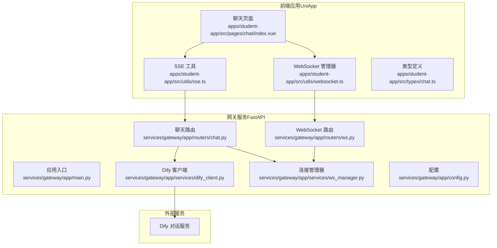
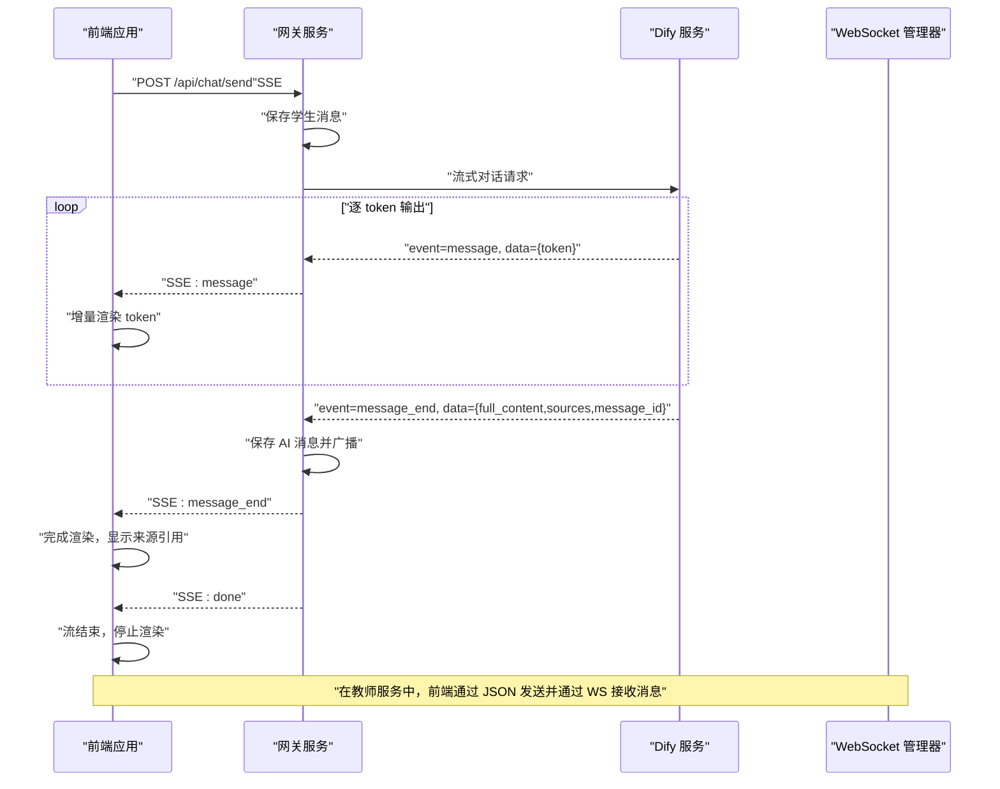
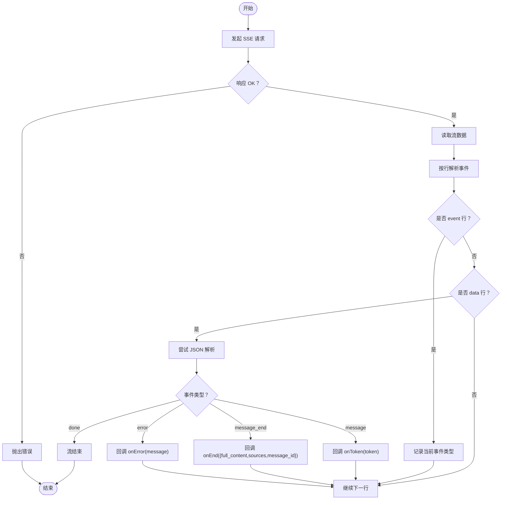
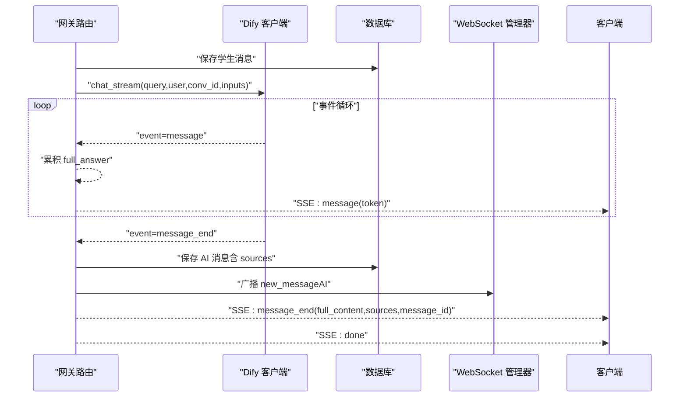
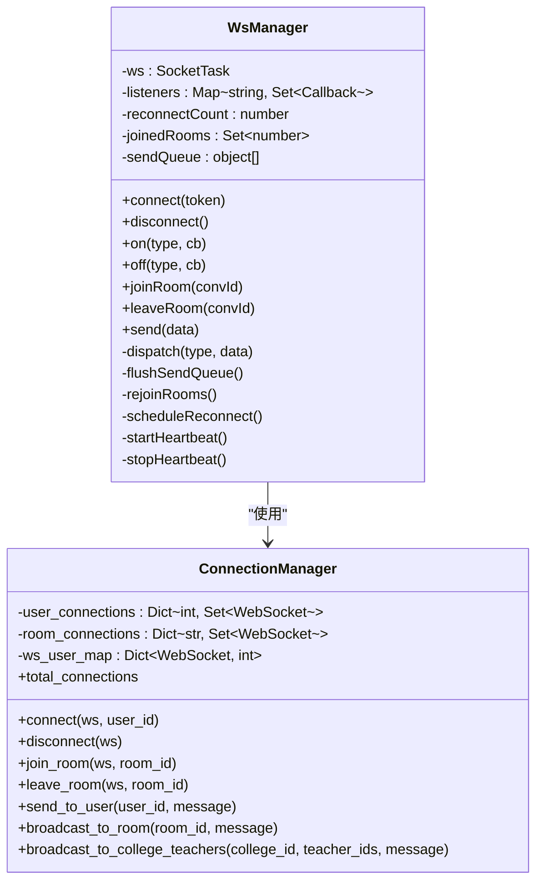
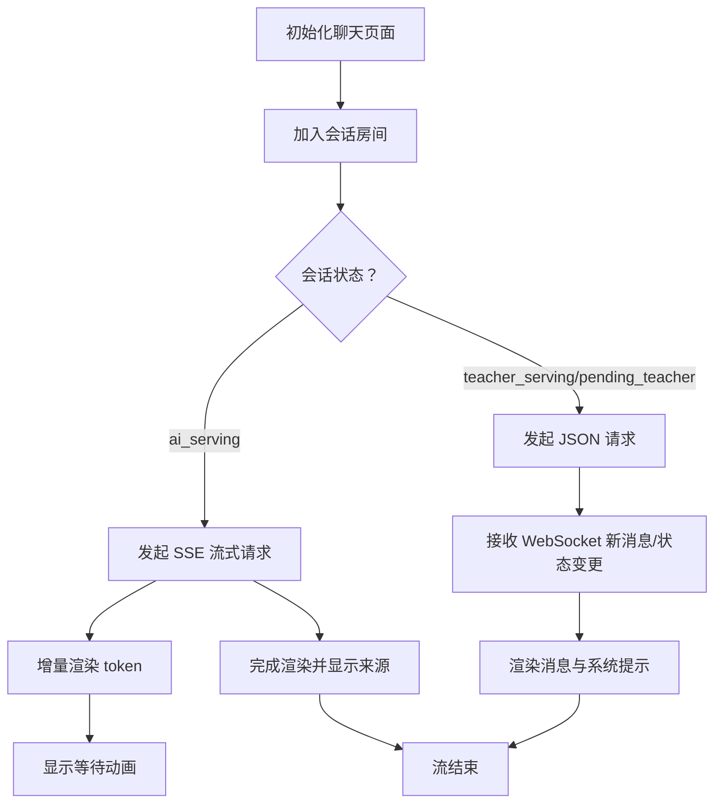
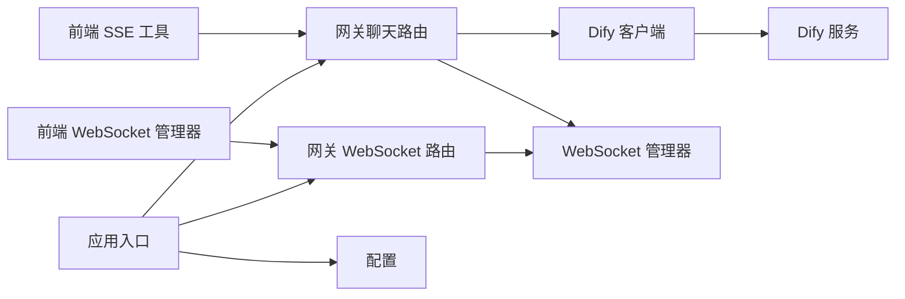

# 流式响应处理

<cite>
**本文档引用的文件**
- [apps/student-app/src/utils/sse.ts](file://apps/student-app/src/utils/sse.ts)
- [apps/student-app/src/utils/websocket.ts](file://apps/student-app/src/utils/websocket.ts)
- [apps/student-app/src/pages/chat/index.vue](file://apps/student-app/src/pages/chat/index.vue)
- [apps/student-app/src/api/chat.ts](file://apps/student-app/src/api/chat.ts)
- [apps/student-app/src/types/chat.ts](file://apps/student-app/src/types/chat.ts)
- [services/gateway/app/routers/chat.py](file://services/gateway/app/routers/chat.py)
- [services/gateway/app/routers/ws.py](file://services/gateway/app/routers/ws.py)
- [services/gateway/app/services/ws_manager.py](file://services/gateway/app/services/ws_manager.py)
- [services/gateway/app/services/dify_client.py](file://services/gateway/app/services/dify_client.py)
- [services/gateway/app/config.py](file://services/gateway/app/config.py)
- [services/gateway/app/main.py](file://services/gateway/app/main.py)
</cite>

## 目录
1. [简介](#简介)
2. [项目结构](#项目结构)
3. [核心组件](#核心组件)
4. [架构总览](#架构总览)
5. [详细组件分析](#详细组件分析)
6. [依赖关系分析](#依赖关系分析)
7. [性能考虑](#性能考虑)
8. [故障排查指南](#故障排查指南)
9. [结论](#结论)

## 简介
本文件系统性梳理了该代码库中的流式响应处理体系，重点覆盖以下方面：
- SSE（Server-Sent Events）流式传输的实现原理与事件模型
- 事件类型与数据格式规范（message、message_end、error 等）
- 实时转发机制（与 WebSocket 的协同）
- 前端渲染与状态管理
- 性能优化与错误恢复策略

## 项目结构
该系统由三部分组成：
- 前端应用（UniApp）：负责发起 SSE 请求、接收事件、渲染消息与来源引用、维护会话状态
- 网关服务（FastAPI）：负责认证、状态机流转、Dify 流式调用、SSE 事件生成与转发、WebSocket 管理
- 外部服务（Dify）：提供流式对话能力，按事件输出 token、结束与错误信息

图表来源
- [apps/student-app/src/utils/sse.ts:1-69](file://apps/student-app/src/utils/sse.ts#L1-L69)
- [apps/student-app/src/utils/websocket.ts:1-153](file://apps/student-app/src/utils/websocket.ts#L1-L153)
- [apps/student-app/src/pages/chat/index.vue:198-649](file://apps/student-app/src/pages/chat/index.vue#L198-L649)
- [services/gateway/app/routers/chat.py:1-191](file://services/gateway/app/routers/chat.py#L1-L191)
- [services/gateway/app/routers/ws.py:1-119](file://services/gateway/app/routers/ws.py#L1-L119)
- [services/gateway/app/services/ws_manager.py:1-100](file://services/gateway/app/services/ws_manager.py#L1-L100)
- [services/gateway/app/services/dify_client.py:1-105](file://services/gateway/app/services/dify_client.py#L1-L105)
- [services/gateway/app/config.py:1-31](file://services/gateway/app/config.py#L1-L31)
- [services/gateway/app/main.py:1-78](file://services/gateway/app/main.py#L1-L78)

章节来源
- [apps/student-app/src/utils/sse.ts:1-69](file://apps/student-app/src/utils/sse.ts#L1-L69)
- [apps/student-app/src/utils/websocket.ts:1-153](file://apps/student-app/src/utils/websocket.ts#L1-L153)
- [apps/student-app/src/pages/chat/index.vue:198-649](file://apps/student-app/src/pages/chat/index.vue#L198-L649)
- [services/gateway/app/routers/chat.py:1-191](file://services/gateway/app/routers/chat.py#L1-L191)
- [services/gateway/app/routers/ws.py:1-119](file://services/gateway/app/routers/ws.py#L1-L119)
- [services/gateway/app/services/ws_manager.py:1-100](file://services/gateway/app/services/ws_manager.py#L1-L100)
- [services/gateway/app/services/dify_client.py:1-105](file://services/gateway/app/services/dify_client.py#L1-L105)
- [services/gateway/app/config.py:1-31](file://services/gateway/app/config.py#L1-L31)
- [services/gateway/app/main.py:1-78](file://services/gateway/app/main.py#L1-L78)

## 核心组件
- 前端 SSE 工具：解析服务端事件，分发 message/token、message_end、error 等事件
- 前端 WebSocket 管理器：连接、心跳、重连、房间加入/离开、消息派发
- 网关聊天路由：根据会话状态选择 SSE 或 JSON 响应；调用 Dify 流式接口；保存消息并广播
- Dify 客户端：封装 Dify SSE 调用，产出事件流
- WebSocket 管理器：维护用户与房间连接映射，支持广播与按用户推送
- 类型定义：统一前后端消息结构，便于事件处理与渲染

章节来源
- [apps/student-app/src/utils/sse.ts:1-69](file://apps/student-app/src/utils/sse.ts#L1-L69)
- [apps/student-app/src/utils/websocket.ts:1-153](file://apps/student-app/src/utils/websocket.ts#L1-L153)
- [services/gateway/app/routers/chat.py:1-191](file://services/gateway/app/routers/chat.py#L1-L191)
- [services/gateway/app/services/dify_client.py:1-105](file://services/gateway/app/services/dify_client.py#L1-L105)
- [services/gateway/app/services/ws_manager.py:1-100](file://services/gateway/app/services/ws_manager.py#L1-L100)
- [apps/student-app/src/types/chat.ts:1-45](file://apps/student-app/src/types/chat.ts#L1-L45)

## 架构总览
整体交互流程如下：
- 前端在“AI 服务中”状态下，通过 SSE 路由发起流式请求
- 网关保存学生消息，调用 Dify 流式对话，按事件输出 token
- 前端收到 token 后增量渲染；收到 message_end 后完成渲染并附带来源引用
- 若发生错误，前端收到 error 事件并提示
- 在“教师服务中”或“等待教师”状态下，前端通过 JSON 接口发送消息，并通过 WebSocket 实时接收教师消息与状态变更

图表来源
- [services/gateway/app/routers/chat.py:84-191](file://services/gateway/app/routers/chat.py#L84-L191)
- [apps/student-app/src/utils/sse.ts:13-68](file://apps/student-app/src/utils/sse.ts#L13-L68)
- [apps/student-app/src/pages/chat/index.vue:423-481](file://apps/student-app/src/pages/chat/index.vue#L423-L481)

## 详细组件分析

### SSE 事件解析与处理（前端）
- 事件源建立：前端通过 fetch 发起 POST 请求，携带认证头与会话参数，期望返回 text/event-stream
- 数据流解析：使用 ReadableStream Reader 与 TextDecoder 逐字节读取，按行解析事件
- 事件类型处理：
  - message：提取 token，增量拼接到当前 AI 消息
  - message_end：填充完整内容、来源引用，停止流式渲染
  - error：显示错误提示
  - done：流结束信号，通常无需额外处理
- 错误处理：HTTP 非 OK 状态抛出错误；JSON 解析异常忽略非数据行

图表来源
- [apps/student-app/src/utils/sse.ts:13-68](file://apps/student-app/src/utils/sse.ts#L13-L68)

章节来源
- [apps/student-app/src/utils/sse.ts:1-69](file://apps/student-app/src/utils/sse.ts#L1-L69)

### 网关 SSE 生成与转发（后端）
- 路由决策：根据会话状态决定返回 SSE 或 JSON
- Dify 流式调用：封装 httpx SSE，逐事件 yield 到客户端
- 事件生成：
  - message：逐 token 输出
  - message_end：在保存 AI 消息后输出，包含完整内容、来源与消息 ID
  - error：异常时输出错误信息
- 保存与广播：保存 AI 消息到数据库，同时通过 WebSocket 广播新消息，供教师端与前端同步

图表来源
- [services/gateway/app/routers/chat.py:84-191](file://services/gateway/app/routers/chat.py#L84-L191)
- [services/gateway/app/services/dify_client.py:22-69](file://services/gateway/app/services/dify_client.py#L22-L69)

章节来源
- [services/gateway/app/routers/chat.py:1-191](file://services/gateway/app/routers/chat.py#L1-L191)
- [services/gateway/app/services/dify_client.py:1-105](file://services/gateway/app/services/dify_client.py#L1-L105)

### WebSocket 集成与实时转发
- 连接与认证：通过查询参数携带 JWT，解码后建立连接
- 房间管理：支持 join_room/leave_room，按房间广播消息
- 心跳与重连：定时 ping，断线指数退避重连
- 事件派发：统一分发到前端监听器，包括新消息、状态变更等

图表来源
- [apps/student-app/src/utils/websocket.ts:3-153](file://apps/student-app/src/utils/websocket.ts#L3-L153)
- [services/gateway/app/services/ws_manager.py:8-96](file://services/gateway/app/services/ws_manager.py#L8-L96)

章节来源
- [apps/student-app/src/utils/websocket.ts:1-153](file://apps/student-app/src/utils/websocket.ts#L1-L153)
- [services/gateway/app/routers/ws.py:1-119](file://services/gateway/app/routers/ws.py#L1-L119)
- [services/gateway/app/services/ws_manager.py:1-100](file://services/gateway/app/services/ws_manager.py#L1-L100)

### 前端渲染与状态更新
- 渲染策略：Markdown 渲染、流式光标闪烁、等待动画
- 状态管理：会话状态（ai_serving/pending_teacher/teacher_serving/resolved/closed）
- 事件驱动：SSE 事件触发增量渲染；WebSocket 事件触发消息与状态变更
- 来源引用：message_end 后展示来源标题、分数与预览内容

图表来源
- [apps/student-app/src/pages/chat/index.vue:423-481](file://apps/student-app/src/pages/chat/index.vue#L423-L481)
- [apps/student-app/src/pages/chat/index.vue:279-326](file://apps/student-app/src/pages/chat/index.vue#L279-L326)

章节来源
- [apps/student-app/src/pages/chat/index.vue:198-649](file://apps/student-app/src/pages/chat/index.vue#L198-L649)
- [apps/student-app/src/types/chat.ts:1-45](file://apps/student-app/src/types/chat.ts#L1-L45)

## 依赖关系分析
- 前端依赖
  - SSE 工具依赖 fetch 与 ReadableStream
  - WebSocket 管理器依赖 uni.connectSocket
  - 聊天页面依赖 API 封装与类型定义
- 后端依赖
  - 网关路由依赖数据库、Dify 客户端、WebSocket 管理器
  - Dify 客户端依赖 httpx 与 httpx_sse
  - 应用入口依赖配置与健康检查

图表来源
- [apps/student-app/src/utils/sse.ts:13-68](file://apps/student-app/src/utils/sse.ts#L13-L68)
- [apps/student-app/src/utils/websocket.ts:20-64](file://apps/student-app/src/utils/websocket.ts#L20-L64)
- [services/gateway/app/routers/chat.py:105-191](file://services/gateway/app/routers/chat.py#L105-L191)
- [services/gateway/app/routers/ws.py:11-119](file://services/gateway/app/routers/ws.py#L11-L119)
- [services/gateway/app/services/dify_client.py:22-69](file://services/gateway/app/services/dify_client.py#L22-L69)
- [services/gateway/app/main.py:16-78](file://services/gateway/app/main.py#L16-L78)
- [services/gateway/app/config.py:15-19](file://services/gateway/app/config.py#L15-L19)

章节来源
- [services/gateway/app/main.py:1-78](file://services/gateway/app/main.py#L1-L78)
- [services/gateway/app/config.py:1-31](file://services/gateway/app/config.py#L1-L31)

## 性能考虑
- SSE 缓冲与解析
  - 使用 TextDecoder 流式解码，避免一次性读取大块数据
  - 行缓冲与 pop 机制减少字符串拼接开销
- 事件粒度
  - 以 token 为单位输出，降低首包延迟，提升感知速度
- WebSocket 优化
  - 心跳间隔与指数退避重连，平衡稳定性与资源消耗
  - 发送队列在断线期间缓存消息，连上后批量 flush
- 数据库与广播
  - message_end 后统一保存并广播，避免重复 IO
  - 房间级广播减少无效推送
- 前端渲染
  - 增量拼接与滚动到底部，避免全量重绘
  - Markdown 渲染按需执行，减少计算压力

## 故障排查指南
- SSE 无法接收事件
  - 检查响应是否为 text/event-stream，Headers 是否包含 Cache-Control 与 X-Accel-Buffering
  - 确认前端事件解析逻辑是否正确识别 event/data 行
- 错误事件处理
  - 网关在 Dify 异常时输出 error 事件；前端 onError 回调应显示友好提示
- WebSocket 断线与重连
  - 观察心跳与重连计数；确认最大重连次数与退避策略
  - 重连后自动 re-join 房间，确保消息不丢失
- 会话状态异常
  - 确认状态机流转逻辑与前端状态映射一致
  - 在 resolved 状态下重新激活会话时，需广播状态变更事件
- Dify 连接问题
  - 检查配置项与健康检查接口返回值
  - 关注超时与序列化异常

章节来源
- [services/gateway/app/routers/chat.py:84-191](file://services/gateway/app/routers/chat.py#L84-L191)
- [apps/student-app/src/utils/sse.ts:28-31](file://apps/student-app/src/utils/sse.ts#L28-L31)
- [apps/student-app/src/utils/websocket.ts:129-135](file://apps/student-app/src/utils/websocket.ts#L129-L135)
- [services/gateway/app/main.py:30-68](file://services/gateway/app/main.py#L30-L68)

## 结论
该系统通过 SSE 与 WebSocket 的组合实现了低延迟、高并发的流式对话体验：
- SSE 用于 AI 服务中的逐 token 增量渲染，提供即时反馈
- WebSocket 用于教师服务中的实时消息与状态同步
- 统一的事件模型与错误处理保障了用户体验与系统稳定性
- 通过合理的缓冲、广播与重连策略，兼顾了性能与可靠性