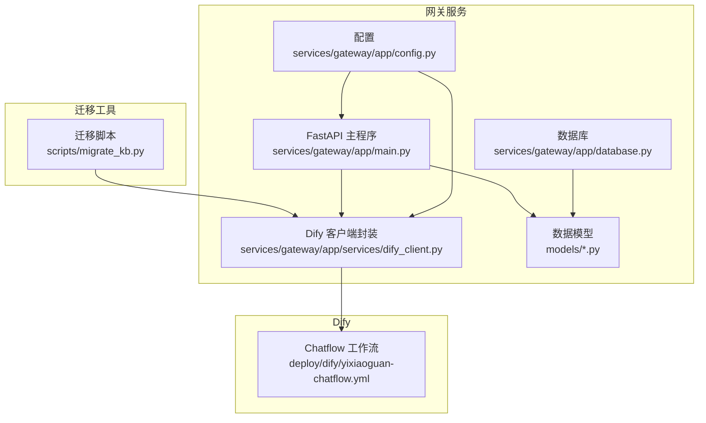
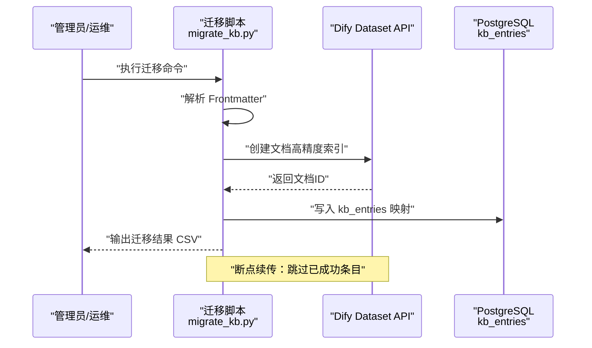
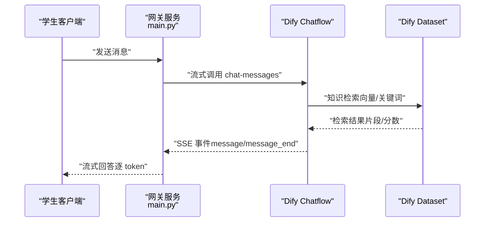
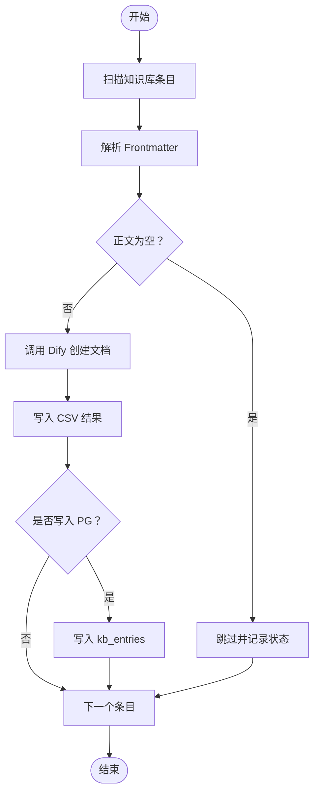
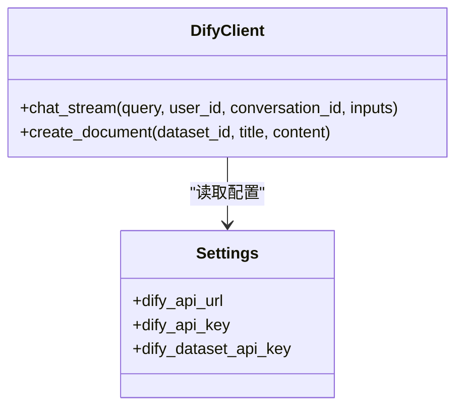
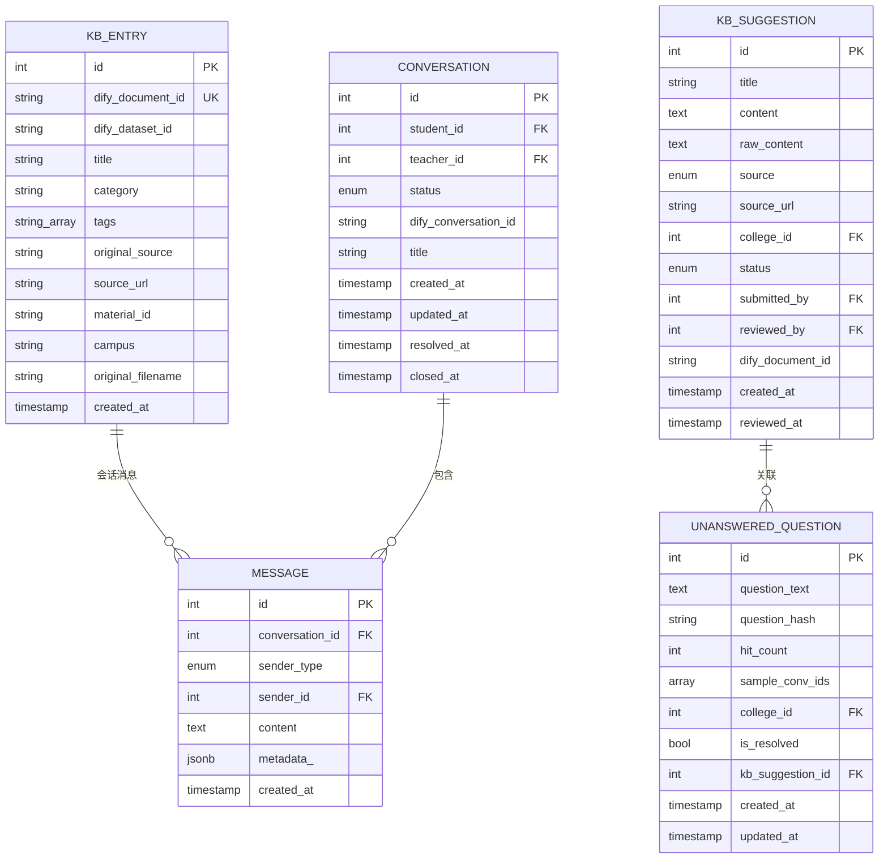
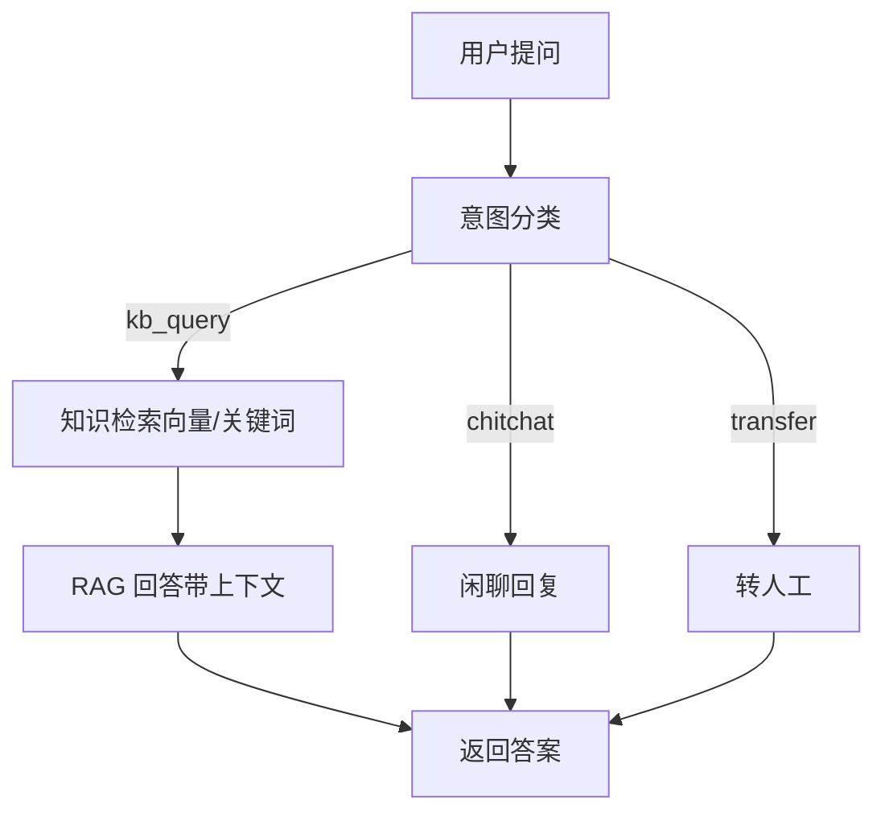
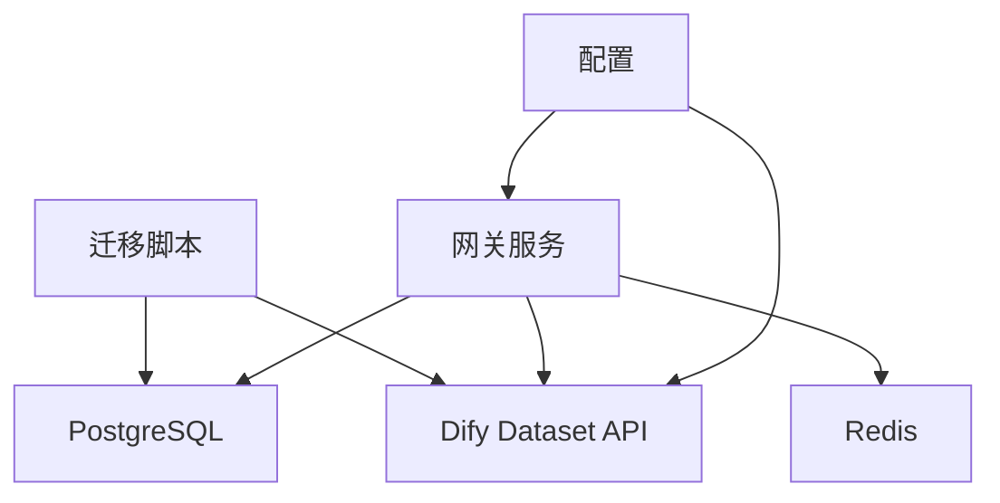

# 知识库集成

<cite>
**本文引用的文件**
- [scripts/migrate_kb.py](file://scripts/migrate_kb.py)
- [services/gateway/app/services/dify_client.py](file://services/gateway/app/services/dify_client.py)
- [services/gateway/app/models/kb_entry.py](file://services/gateway/app/models/kb_entry.py)
- [services/gateway/app/models/knowledge.py](file://services/gateway/app/models/knowledge.py)
- [services/gateway/app/models/conversation.py](file://services/gateway/app/models/conversation.py)
- [services/gateway/app/schemas/chat.py](file://services/gateway/app/schemas/chat.py)
- [services/gateway/app/config.py](file://services/gateway/app/config.py)
- [services/gateway/app/database.py](file://services/gateway/app/database.py)
- [services/gateway/app/main.py](file://services/gateway/app/main.py)
- [deploy/dify/yixiaoguan-chatflow.yml](file://deploy/dify/yixiaoguan-chatflow.yml)
- [docs/requirements/R05-KB-增强需求.md](file://docs/requirements/R05-KB-增强需求.md)
- [s3-kb-migrate.md](file://s3-kb-migrate.md)
</cite>

## 目录
1. [简介](#简介)
2. [项目结构](#项目结构)
3. [核心组件](#核心组件)
4. [架构总览](#架构总览)
5. [详细组件分析](#详细组件分析)
6. [依赖分析](#依赖分析)
7. [性能考虑](#性能考虑)
8. [故障排查指南](#故障排查指南)
9. [结论](#结论)
10. [附录](#附录)

## 简介
本文件面向“知识库集成系统”的落地实施，围绕以下目标展开：将既有知识库内容迁移到 Dify 知识库、配置文档创建与索引技术、检索机制（向量检索、关键词匹配、语义相似度）、维护与更新策略（增量导入、批量导入、内容审核）、性能优化与质量评估。文档基于仓库中的迁移脚本、Dify 客户端封装、数据库模型、Dify Chatflow 工作流与需求文档，提供从数据到服务的全链路说明。

## 项目结构
该项目采用前后端分离与微服务化思路，知识库迁移与检索能力主要分布在以下模块：
- 迁移工具：Python 脚本负责扫描 v1 知识库条目、解析 Frontmatter、调用 Dify Dataset API 创建文档，并可选写入 PostgreSQL 的 kb_entries 表。
- 网关服务：FastAPI 提供健康检查、聊天接口、WebSocket 等；内部封装 DifyClient，统一调用 Dify Chatflow 并处理流式事件。
- 数据模型：PostgreSQL 表 kb_entries 映射 Dify 文档与原始来源；knowledge 表支撑建议与未解答问题；conversation 表支撑会话与消息。
- Dify 工作流：Chatflow 包含意图分类、知识检索、RAG 回答等节点，配置了检索模式与提示词模板。

图表来源
- [services/gateway/app/main.py:1-78](file://services/gateway/app/main.py#L1-L78)
- [services/gateway/app/services/dify_client.py:1-105](file://services/gateway/app/services/dify_client.py#L1-L105)
- [services/gateway/app/config.py:1-31](file://services/gateway/app/config.py#L1-L31)
- [services/gateway/app/database.py:1-15](file://services/gateway/app/database.py#L1-L15)
- [scripts/migrate_kb.py:1-201](file://scripts/migrate_kb.py#L1-L201)
- [deploy/dify/yixiaoguan-chatflow.yml:1-387](file://deploy/dify/yixiaoguan-chatflow.yml#L1-L387)

章节来源
- [services/gateway/app/main.py:1-78](file://services/gateway/app/main.py#L1-L78)
- [services/gateway/app/services/dify_client.py:1-105](file://services/gateway/app/services/dify_client.py#L1-L105)
- [services/gateway/app/config.py:1-31](file://services/gateway/app/config.py#L1-L31)
- [services/gateway/app/database.py:1-15](file://services/gateway/app/database.py#L1-L15)
- [scripts/migrate_kb.py:1-201](file://scripts/migrate_kb.py#L1-L201)
- [deploy/dify/yixiaoguan-chatflow.yml:1-387](file://deploy/dify/yixiaoguan-chatflow.yml#L1-L387)

## 核心组件
- 迁移脚本：解析 Markdown Frontmatter，调用 Dify Dataset API 创建文档，支持断点续传与 PG 写入。
- Dify 客户端封装：统一封装 Chatflow 流式对话与文档创建接口，便于网关服务复用。
- 数据模型：kb_entries 映射 Dify 文档与原始来源；knowledge 表支撑建议与未解答问题；conversation 表支撑会话与消息。
- Chatflow：包含意图分类、知识检索、RAG 回答节点，配置检索模式与提示词模板。
- 配置与数据库：集中管理 Dify API 地址与密钥、数据库连接、Redis 连接；提供异步会话工厂。

章节来源
- [scripts/migrate_kb.py:38-86](file://scripts/migrate_kb.py#L38-L86)
- [services/gateway/app/services/dify_client.py:11-105](file://services/gateway/app/services/dify_client.py#L11-L105)
- [services/gateway/app/models/kb_entry.py:9-31](file://services/gateway/app/models/kb_entry.py#L9-L31)
- [services/gateway/app/models/knowledge.py:22-62](file://services/gateway/app/models/knowledge.py#L22-L62)
- [services/gateway/app/models/conversation.py:26-63](file://services/gateway/app/models/conversation.py#L26-L63)
- [deploy/dify/yixiaoguan-chatflow.yml:128-387](file://deploy/dify/yixiaoguan-chatflow.yml#L128-L387)
- [services/gateway/app/config.py:6-29](file://services/gateway/app/config.py#L6-L29)
- [services/gateway/app/database.py:1-15](file://services/gateway/app/database.py#L1-L15)

## 架构总览
下图展示了从“知识库迁移”到“检索与回答”的端到端流程，以及网关服务对 Dify 的调用路径。

图表来源
- [scripts/migrate_kb.py:88-196](file://scripts/migrate_kb.py#L88-L196)
- [services/gateway/app/services/dify_client.py:73-100](file://services/gateway/app/services/dify_client.py#L73-L100)
- [services/gateway/app/models/kb_entry.py:9-31](file://services/gateway/app/models/kb_entry.py#L9-L31)

图表来源
- [services/gateway/app/main.py:30-68](file://services/gateway/app/main.py#L30-L68)
- [services/gateway/app/services/dify_client.py:22-69](file://services/gateway/app/services/dify_client.py#L22-L69)
- [deploy/dify/yixiaoguan-chatflow.yml:270-344](file://deploy/dify/yixiaoguan-chatflow.yml#L270-L344)

## 详细组件分析

### 组件一：知识库迁移（从 v1 到 Dify）
- 功能要点
  - 扫描指定目录下的知识库条目（按命名规则筛选），解析 YAML Frontmatter 获取元数据。
  - 调用 Dify Dataset API 创建文档，设置“高精度索引”与“自动处理规则”，确保高质量向量索引。
  - 断点续传：通过输出 CSV 记录每个条目的状态，重复执行时跳过已成功项。
  - 可选写入 PostgreSQL 的 kb_entries 表，建立 Dify 文档与原始来源的映射关系。
- 处理规则
  - 文档创建参数包含标题、正文、索引技术与处理模式，满足“高精度”与“自动”两类配置。
  - 对空正文进行跳过处理，避免无效文档。
- 错误处理
  - YAML 解析失败、网络异常、DB 写入失败均记录错误并继续处理后续条目。
  - DB 写入失败时尝试回滚，保证迁移脚本健壮性。

图表来源
- [scripts/migrate_kb.py:88-196](file://scripts/migrate_kb.py#L88-L196)
- [scripts/migrate_kb.py:38-86](file://scripts/migrate_kb.py#L38-L86)

章节来源
- [scripts/migrate_kb.py:38-86](file://scripts/migrate_kb.py#L38-L86)
- [scripts/migrate_kb.py:88-196](file://scripts/migrate_kb.py#L88-L196)
- [s3-kb-migrate.md:1-31](file://s3-kb-migrate.md#L1-L31)

### 组件二：Dify 客户端封装与检索机制
- Dify 客户端封装
  - 提供流式聊天接口与文档创建接口，统一鉴权头与超时控制。
  - 流式接口以 SSE 形式返回事件，事件类型包含“消息”“消息结束”“错误”等，便于网关服务进行会话持久化与前端转发。
- 检索机制
  - Chatflow 中包含“知识检索”节点，检索模式为“single”，结合 LLM 的上下文模板，实现 RAG 回答。
  - 检索结果包含片段与分数，可用于后续质量分析与可视化增强（如“Top N 未覆盖问题”）。

图表来源
- [services/gateway/app/services/dify_client.py:11-105](file://services/gateway/app/services/dify_client.py#L11-L105)
- [services/gateway/app/config.py:15-19](file://services/gateway/app/config.py#L15-L19)

章节来源
- [services/gateway/app/services/dify_client.py:11-105](file://services/gateway/app/services/dify_client.py#L11-L105)
- [deploy/dify/yixiaoguan-chatflow.yml:270-344](file://deploy/dify/yixiaoguan-chatflow.yml#L270-L344)

### 组件三：数据模型与映射
- kb_entries：记录 Dify 文档与原始来源的映射，包含标题、分类、标签、来源链接、材料编号、校区、原始文件名等字段，便于溯源与审计。
- knowledge：支撑“建议入库”“未解答问题”等场景，包含来源、URL、学院、状态等字段，便于内容审核与运营分析。
- conversation：支撑会话生命周期与消息存储，便于检索结果与回答的关联分析。

图表来源
- [services/gateway/app/models/kb_entry.py:9-31](file://services/gateway/app/models/kb_entry.py#L9-L31)
- [services/gateway/app/models/knowledge.py:22-62](file://services/gateway/app/models/knowledge.py#L22-L62)
- [services/gateway/app/models/conversation.py:26-63](file://services/gateway/app/models/conversation.py#L26-L63)

章节来源
- [services/gateway/app/models/kb_entry.py:9-31](file://services/gateway/app/models/kb_entry.py#L9-L31)
- [services/gateway/app/models/knowledge.py:22-62](file://services/gateway/app/models/knowledge.py#L22-L62)
- [services/gateway/app/models/conversation.py:26-63](file://services/gateway/app/models/conversation.py#L26-L63)

### 组件四：检索机制与质量评估
- 检索机制
  - Chatflow 中“知识检索”节点配置为“single”模式，结合 LLM 上下文模板，实现基于向量的语义检索与 RAG 回答。
  - 检索结果包含片段与分数，可用于质量评估与可视化增强（如“教程标记”“Top N 未覆盖问题”）。
- 质量评估与增强
  - “Top 10 高频操作图文教程”：在 KB 文字末尾加入标记，前端识别后渲染图文卡片，提升操作指导效果。
  - “高频无答案问题统计”：在 Gateway 层解析 message_end metadata，写入分析表，定期统计未命中/低分问题，形成运营闭环。
  - “学院/班级个性化”：通过 inputs 注入学院/校区/班级信息，引导 LLM 优先返回相关性更高的信息。

图表来源
- [deploy/dify/yixiaoguan-chatflow.yml:128-387](file://deploy/dify/yixiaoguan-chatflow.yml#L128-L387)
- [docs/requirements/R05-KB-增强需求.md:9-106](file://docs/requirements/R05-KB-增强需求.md#L9-L106)

章节来源
- [deploy/dify/yixiaoguan-chatflow.yml:128-387](file://deploy/dify/yixiaoguan-chatflow.yml#L128-L387)
- [docs/requirements/R05-KB-增强需求.md:9-106](file://docs/requirements/R05-KB-增强需求.md#L9-L106)

### 组件五：维护与更新策略
- 增量更新
  - 迁移脚本支持断点续传，重复执行时自动跳过已成功条目，适合增量导入。
- 批量导入
  - 通过命令行参数指定数据集 ID、API Key、API URL 与输出 CSV，便于批量化执行。
- 内容审核
  - knowledge 表提供“建议入库”与“未解答问题”两条路径，配合状态枚举与审核人字段，支撑内容审核流程。
- 运维验证
  - 提供迁移后校验步骤（统计 CSV 中成功/失败数量、检查 PG 表计数、校验字段非空率），并重启服务验证 schema 修复。

章节来源
- [scripts/migrate_kb.py:88-196](file://scripts/migrate_kb.py#L88-L196)
- [s3-kb-migrate.md:1-31](file://s3-kb-migrate.md#L1-L31)
- [services/gateway/app/models/knowledge.py:22-62](file://services/gateway/app/models/knowledge.py#L22-L62)

## 依赖分析
- 组件耦合
  - 迁移脚本依赖 Dify Dataset API 与 PostgreSQL（可选），并通过 CSV 输出结果。
  - 网关服务依赖 Dify Chatflow 与 Redis，通过 SSE 接收流式事件并持久化会话。
- 外部依赖
  - Dify API：用于文档创建与聊天流式调用。
  - PostgreSQL：存储 kb_entries、knowledge、conversation 等业务数据。
  - Redis：提供缓存与会话状态管理。
- 配置契约
  - 配置文件集中管理 Dify API 地址与密钥、数据库连接、JWT 参数等，确保服务启动与调用一致性。

图表来源
- [services/gateway/app/config.py:6-29](file://services/gateway/app/config.py#L6-L29)
- [services/gateway/app/main.py:30-68](file://services/gateway/app/main.py#L30-L68)
- [services/gateway/app/services/dify_client.py:14-17](file://services/gateway/app/services/dify_client.py#L14-L17)

章节来源
- [services/gateway/app/config.py:6-29](file://services/gateway/app/config.py#L6-L29)
- [services/gateway/app/main.py:30-68](file://services/gateway/app/main.py#L30-L68)
- [services/gateway/app/services/dify_client.py:14-17](file://services/gateway/app/services/dify_client.py#L14-L17)

## 性能考虑
- 迁移阶段
  - 使用速率限制与断点续传，避免对 Dify 与数据库造成瞬时压力。
  - 文档创建采用“高精度索引”与“自动处理规则”，提升检索质量与召回率。
- 服务阶段
  - 网关服务使用异步 HTTP 客户端与 SSE，降低阻塞风险。
  - Chatflow 中检索模式为“single”，减少复杂度与延迟。
- 数据库
  - 为常用查询字段建立索引（如会话表索引），提升检索效率。
- 缓存
  - Redis 用于会话状态与临时数据缓存，减轻数据库压力。

## 故障排查指南
- 健康检查
  - 网关服务提供健康检查接口，分别检查 PostgreSQL、Redis 与 Dify 的连通性与可用性。
- 常见问题
  - Dify API 无响应：检查配置中的 API 地址与密钥，确认服务可达。
  - 迁移中断：检查 CSV 输出与 PG 写入日志，利用断点续传特性恢复。
  - 会话未持久化：确认收到“消息结束”事件后再持久化完整回答。
- 运维验证
  - 迁移后通过统计 CSV 成功/失败数量与 PG 表计数核对一致性。
  - 重启服务后验证会话响应中包含 Dify 会话 ID 字段。

章节来源
- [services/gateway/app/main.py:30-68](file://services/gateway/app/main.py#L30-L68)
- [scripts/migrate_kb.py:134-196](file://scripts/migrate_kb.py#L134-L196)
- [s3-kb-migrate.md:15-31](file://s3-kb-migrate.md#L15-L31)

## 结论
本知识库集成方案以“迁移—检索—增强—维护”为主线，通过迁移脚本实现高质量入库，借助 Dify Chatflow 实现向量检索与 RAG 回答，并通过前端增强与运营分析持续优化质量。配套的断点续传、内容审核与性能优化策略，确保系统在生产环境中的稳定性与可演进性。

## 附录
- 快速开始（迁移）
  - 准备：激活虚拟环境，确认 v1 知识库条目存在。
  - 执行：使用迁移脚本，指定数据集 ID、API Key、API URL 与输出 CSV。
  - 校验：统计 CSV 成功/失败数量，检查 PG 表计数与字段非空率。
  - 重启：按需重启服务，验证会话响应完整性。
- 参考文件
  - 迁移脚本与执行步骤：[scripts/migrate_kb.py:1-201](file://scripts/migrate_kb.py#L1-L201)、[s3-kb-migrate.md:1-31](file://s3-kb-migrate.md#L1-L31)
  - Dify 客户端与 Chatflow：[services/gateway/app/services/dify_client.py:1-105](file://services/gateway/app/services/dify_client.py#L1-L105)、[deploy/dify/yixiaoguan-chatflow.yml:1-387](file://deploy/dify/yixiaoguan-chatflow.yml#L1-L387)
  - 数据模型与配置：[services/gateway/app/models/kb_entry.py:1-31](file://services/gateway/app/models/kb_entry.py#L1-L31)、[services/gateway/app/models/knowledge.py:1-62](file://services/gateway/app/models/knowledge.py#L1-L62)、[services/gateway/app/models/conversation.py:1-63](file://services/gateway/app/models/conversation.py#L1-L63)、[services/gateway/app/config.py:1-31](file://services/gateway/app/config.py#L1-L31)