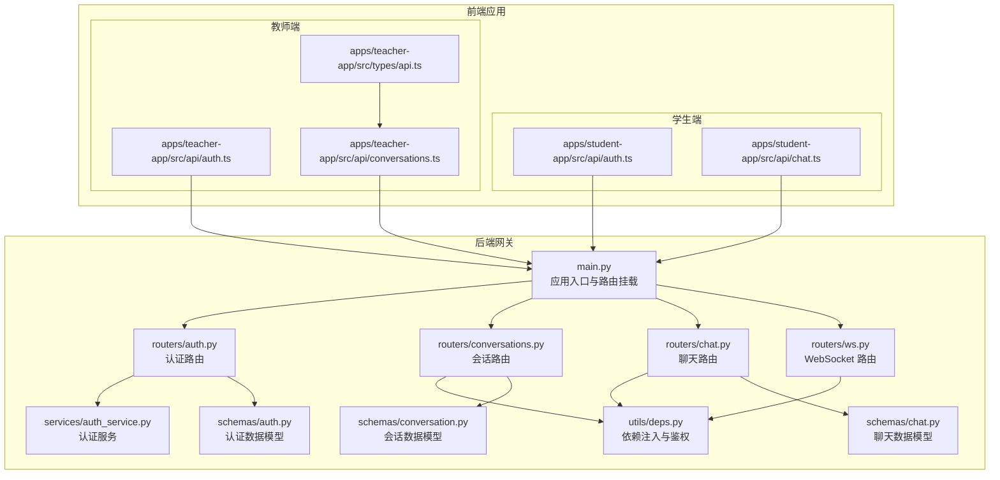
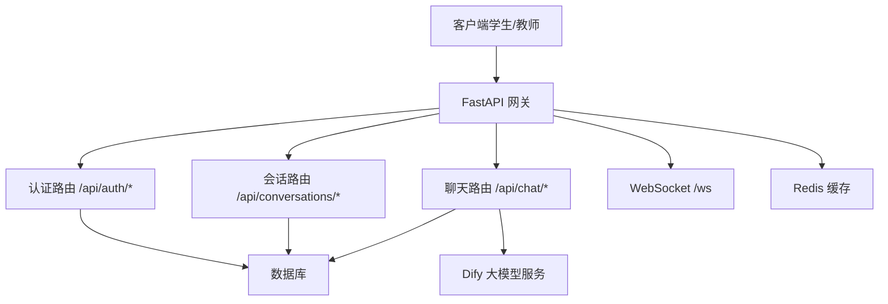
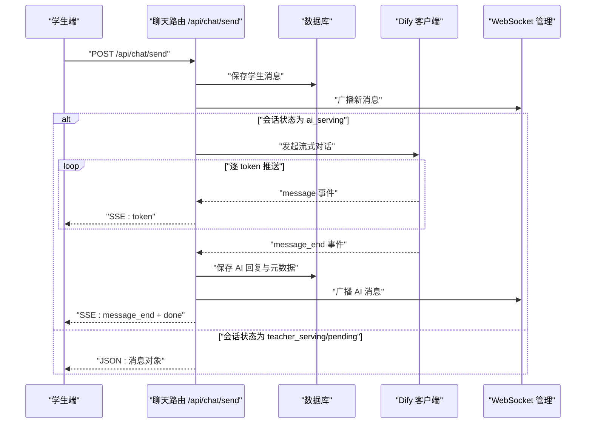
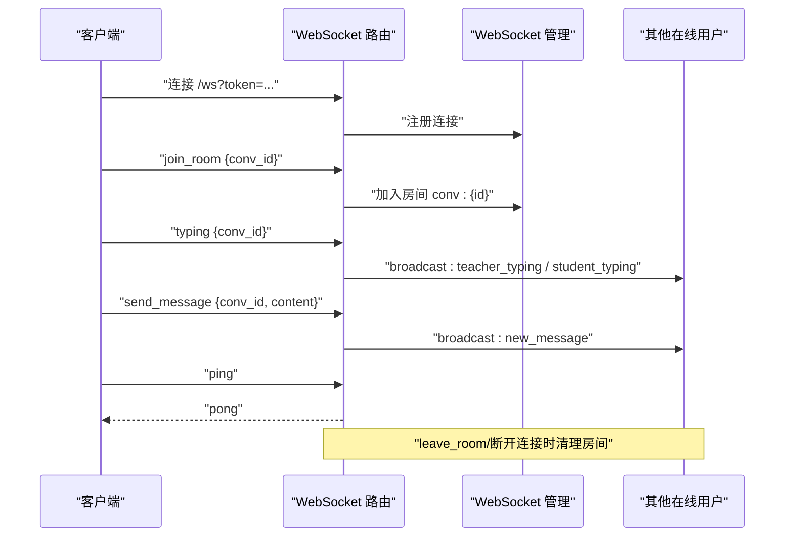
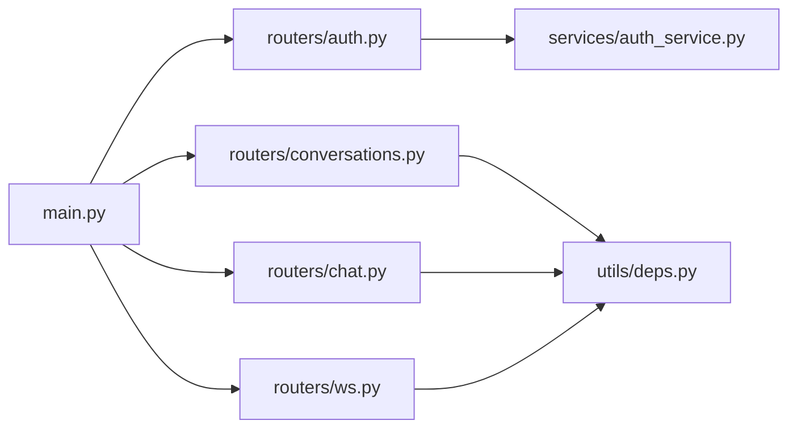

# API 接口文档

<cite>
**本文引用的文件**
- [services/gateway/app/main.py](file://services/gateway/app/main.py)
- [services/gateway/app/routers/auth.py](file://services/gateway/app/routers/auth.py)
- [services/gateway/app/routers/chat.py](file://services/gateway/app/routers/chat.py)
- [services/gateway/app/routers/conversations.py](file://services/gateway/app/routers/conversations.py)
- [services/gateway/app/routers/ws.py](file://services/gateway/app/routers/ws.py)
- [services/gateway/app/schemas/auth.py](file://services/gateway/app/schemas/auth.py)
- [services/gateway/app/schemas/chat.py](file://services/gateway/app/schemas/chat.py)
- [services/gateway/app/schemas/conversation.py](file://services/gateway/app/schemas/conversation.py)
- [services/gateway/app/services/auth_service.py](file://services/gateway/app/services/auth_service.py)
- [services/gateway/app/utils/deps.py](file://services/gateway/app/utils/deps.py)
- [apps/student-app/src/api/auth.ts](file://apps/student-app/src/api/auth.ts)
- [apps/student-app/src/api/chat.ts](file://apps/student-app/src/api/chat.ts)
- [apps/teacher-app/src/api/auth.ts](file://apps/teacher-app/src/api/auth.ts)
- [apps/teacher-app/src/api/conversations.ts](file://apps/teacher-app/src/api/conversations.ts)
- [apps/teacher-app/src/types/api.ts](file://apps/teacher-app/src/types/api.ts)
</cite>

## 目录
1. [简介](#简介)
2. [项目结构](#项目结构)
3. [核心组件](#核心组件)
4. [架构总览](#架构总览)
5. [详细组件分析](#详细组件分析)
6. [依赖分析](#依赖分析)
7. [性能考量](#性能考量)
8. [故障排查指南](#故障排查指南)
9. [结论](#结论)
10. [附录](#附录)

## 简介
本文件为“医小管 v2”后端网关服务的完整 API 接口文档，覆盖认证、会话管理、聊天与实时通信等模块。文档面向前后端开发者与测试人员，提供端点定义、请求/响应模型、状态码、WebSocket 协议、认证与权限控制、错误处理策略、速率限制与安全建议，并给出客户端实现要点与示例。

## 项目结构
后端采用 FastAPI 构建，按功能拆分路由模块；前端分为学生端与教师端应用，分别通过统一的网关 API 进行交互。

图表来源
- [services/gateway/app/main.py:1-78](file://services/gateway/app/main.py#L1-L78)
- [services/gateway/app/routers/auth.py:1-35](file://services/gateway/app/routers/auth.py#L1-L35)
- [services/gateway/app/routers/conversations.py:1-129](file://services/gateway/app/routers/conversations.py#L1-L129)
- [services/gateway/app/routers/chat.py:1-191](file://services/gateway/app/routers/chat.py#L1-L191)
- [services/gateway/app/routers/ws.py:1-119](file://services/gateway/app/routers/ws.py#L1-L119)
- [services/gateway/app/services/auth_service.py:1-35](file://services/gateway/app/services/auth_service.py#L1-L35)
- [services/gateway/app/utils/deps.py:1-40](file://services/gateway/app/utils/deps.py#L1-L40)
- [services/gateway/app/schemas/auth.py:1-23](file://services/gateway/app/schemas/auth.py#L1-L23)
- [services/gateway/app/schemas/chat.py:1-18](file://services/gateway/app/schemas/chat.py#L1-L18)
- [services/gateway/app/schemas/conversation.py:1-50](file://services/gateway/app/schemas/conversation.py#L1-L50)
- [apps/student-app/src/api/auth.ts:1-20](file://apps/student-app/src/api/auth.ts#L1-L20)
- [apps/student-app/src/api/chat.ts:1-36](file://apps/student-app/src/api/chat.ts#L1-L36)
- [apps/teacher-app/src/api/auth.ts:1-43](file://apps/teacher-app/src/api/auth.ts#L1-L43)
- [apps/teacher-app/src/api/conversations.ts:1-44](file://apps/teacher-app/src/api/conversations.ts#L1-L44)
- [apps/teacher-app/src/types/api.ts:1-51](file://apps/teacher-app/src/types/api.ts#L1-L51)

章节来源
- [services/gateway/app/main.py:1-78](file://services/gateway/app/main.py#L1-L78)

## 核心组件
- 应用入口与健康检查：注册路由、Redis 连接、健康检查端点。
- 认证模块：登录、当前用户信息查询。
- 会话模块：创建、列表、详情、消息列表、发送消息。
- 聊天模块：学生发送消息（SSE 流式响应或即时响应）、AI 对话流式输出。
- WebSocket 模块：基于 JWT 的连接、房间加入/离开、消息广播、打字提示、心跳。
- 数据模型：Pydantic 模型定义请求与响应结构。
- 依赖注入：HTTP Bearer 鉴权、当前用户解析、Redis 获取。

章节来源
- [services/gateway/app/main.py:16-78](file://services/gateway/app/main.py#L16-L78)
- [services/gateway/app/routers/auth.py:1-35](file://services/gateway/app/routers/auth.py#L1-L35)
- [services/gateway/app/routers/conversations.py:1-129](file://services/gateway/app/routers/conversations.py#L1-L129)
- [services/gateway/app/routers/chat.py:1-191](file://services/gateway/app/routers/chat.py#L1-L191)
- [services/gateway/app/routers/ws.py:1-119](file://services/gateway/app/routers/ws.py#L1-L119)
- [services/gateway/app/schemas/auth.py:1-23](file://services/gateway/app/schemas/auth.py#L1-L23)
- [services/gateway/app/schemas/chat.py:1-18](file://services/gateway/app/schemas/chat.py#L1-L18)
- [services/gateway/app/schemas/conversation.py:1-50](file://services/gateway/app/schemas/conversation.py#L1-L50)
- [services/gateway/app/utils/deps.py:1-40](file://services/gateway/app/utils/deps.py#L1-L40)

## 架构总览
后端以 FastAPI 为核心，通过路由模块组织业务域；认证与权限控制通过依赖注入完成；聊天模块在不同会话状态下采用不同交互模式（SSE 或即时响应）；WebSocket 负责房间级消息广播与状态变更通知。

图表来源
- [services/gateway/app/main.py:70-78](file://services/gateway/app/main.py#L70-L78)
- [services/gateway/app/routers/chat.py:105-191](file://services/gateway/app/routers/chat.py#L105-L191)
- [services/gateway/app/routers/ws.py:11-119](file://services/gateway/app/routers/ws.py#L11-L119)

## 详细组件分析

### 认证接口
- 登录
  - 方法与路径：POST /api/auth/login
  - 请求体：学号/工号与密码
  - 成功响应：访问令牌与类型
  - 错误：401 未授权（学号或密码错误）
- 当前用户
  - 方法与路径：GET /api/auth/me
  - 鉴权：HTTP Bearer
  - 成功响应：用户信息（含角色、学院/班级等）

章节来源
- [services/gateway/app/routers/auth.py:12-35](file://services/gateway/app/routers/auth.py#L12-L35)
- [services/gateway/app/schemas/auth.py:4-23](file://services/gateway/app/schemas/auth.py#L4-L23)
- [services/gateway/app/services/auth_service.py:8-35](file://services/gateway/app/services/auth_service.py#L8-L35)
- [services/gateway/app/utils/deps.py:14-35](file://services/gateway/app/utils/deps.py#L14-L35)
- [apps/student-app/src/api/auth.ts:9-19](file://apps/student-app/src/api/auth.ts#L9-L19)
- [apps/teacher-app/src/api/auth.ts:30-42](file://apps/teacher-app/src/api/auth.ts#L30-L42)

### 会话管理接口
- 创建会话
  - 方法与路径：POST /api/conversations
  - 角色限制：仅学生
  - 请求体：标题（可选）
  - 成功响应：会话对象
- 列出会话
  - 方法与路径：GET /api/conversations
  - 查询参数：page、size、status
  - 成功响应：分页列表
- 获取会话详情
  - 方法与路径：GET /api/conversations/{conv_id}
  - 成功响应：会话对象
- 获取会话消息列表
  - 方法与路径：GET /api/conversations/{conv_id}/messages
  - 查询参数：page、size
  - 成功响应：消息分页列表
- 发送消息
  - 方法与路径：POST /api/conversations/{conv_id}/messages
  - 角色限制：学生/教师均可
  - 请求体：消息内容
  - 成功响应：消息对象
  - 权限控制：教师仅能回复其正在服务的会话

章节来源
- [services/gateway/app/routers/conversations.py:21-129](file://services/gateway/app/routers/conversations.py#L21-L129)
- [services/gateway/app/schemas/conversation.py:5-50](file://services/gateway/app/schemas/conversation.py#L5-L50)
- [apps/student-app/src/api/chat.ts:9-31](file://apps/student-app/src/api/chat.ts#L9-L31)
- [apps/teacher-app/src/api/conversations.ts:7-43](file://apps/teacher-app/src/api/conversations.ts#L7-L43)
- [apps/teacher-app/src/types/api.ts:17-50](file://apps/teacher-app/src/types/api.ts#L17-L50)

### 聊天接口（SSE 流式）
- 学生发送消息
  - 方法与路径：POST /api/chat/send
  - 角色限制：仅学生
  - 请求体：会话 ID 与消息内容
  - 会话状态：
    - ai_serving：返回 SSE 流（message/token、message_end、done）
    - teacher_serving/pending_teacher：返回即时 JSON
    - resolved：自动重激活并广播状态变更
  - 成功响应：SSE 流或即时 JSON
  - 错误：403 状态不允许、404 会话不存在

图表来源
- [services/gateway/app/routers/chat.py:22-191](file://services/gateway/app/routers/chat.py#L22-L191)
- [services/gateway/app/schemas/chat.py:5-18](file://services/gateway/app/schemas/chat.py#L5-L18)

章节来源
- [services/gateway/app/routers/chat.py:22-103](file://services/gateway/app/routers/chat.py#L22-L103)
- [services/gateway/app/routers/chat.py:105-191](file://services/gateway/app/routers/chat.py#L105-L191)
- [services/gateway/app/schemas/chat.py:5-18](file://services/gateway/app/schemas/chat.py#L5-L18)

### WebSocket 接口
- 连接入口
  - 方法与路径：GET /ws?token={JWT}
  - 认证：查询参数携带 JWT，解码后建立连接
- 上行消息（客户端 → 服务端）
  - join_room：加入房间（conv_id）
  - leave_room：离开房间（conv_id）
  - send_message：发送消息（conv_id, content）
  - typing：发送打字状态（conv_id）
  - ping：心跳
- 下行消息（服务端 → 客户端）
  - new_message：新消息
  - status_changed：会话状态变更
  - escalation_notify：升级通知
  - teacher_typing / student_typing：对方正在输入
  - pong：心跳响应
  - error：错误提示
- 房间管理：按 conv_id 维度广播消息

图表来源
- [services/gateway/app/routers/ws.py:11-119](file://services/gateway/app/routers/ws.py#L11-L119)

章节来源
- [services/gateway/app/routers/ws.py:11-119](file://services/gateway/app/routers/ws.py#L11-L119)

### 数据模型与字段说明
- 认证
  - LoginRequest：staff_id, password
  - TokenResponse：access_token, token_type
  - UserInfo：id, staff_id, name, role, college_id, class_id, avatar_url
- 会话
  - CreateConversationRequest：title
  - ConversationResponse：id, student_id, teacher_id, status, title, 时间戳等
  - MessageResponse：id, conversation_id, sender_type, sender_id, content, metadata_, created_at
  - 分页：ConversationListResponse, MessageListResponse
- 聊天
  - ChatSendRequest：conv_id, content
  - ChatSendResponse：message_id, conv_id, sender_type, content, created_at

章节来源
- [services/gateway/app/schemas/auth.py:4-23](file://services/gateway/app/schemas/auth.py#L4-L23)
- [services/gateway/app/schemas/conversation.py:5-50](file://services/gateway/app/schemas/conversation.py#L5-L50)
- [services/gateway/app/schemas/chat.py:5-18](file://services/gateway/app/schemas/chat.py#L5-L18)

## 依赖分析
- 路由依赖：主程序挂载认证、会话、动作、WebSocket、聊天路由。
- 认证依赖：HTTP Bearer 解析 JWT，数据库查询用户，Redis 用于缓存（应用生命周期中初始化）。
- 业务依赖：聊天模块依赖会话服务、状态机、Dify 客户端与 WebSocket 管理器。

图表来源
- [services/gateway/app/main.py:10-14](file://services/gateway/app/main.py#L10-L14)
- [services/gateway/app/utils/deps.py:14-35](file://services/gateway/app/utils/deps.py#L14-L35)
- [services/gateway/app/services/auth_service.py:8-35](file://services/gateway/app/services/auth_service.py#L8-L35)

章节来源
- [services/gateway/app/main.py:10-14](file://services/gateway/app/main.py#L10-L14)
- [services/gateway/app/utils/deps.py:14-35](file://services/gateway/app/utils/deps.py#L14-L35)

## 性能考量
- SSE 流式输出：使用文本事件流，避免一次性大响应；注意浏览器兼容与网络中断处理。
- WebSocket 广播：房间维度广播，避免全量推送；合理设置心跳与断线重连。
- 数据库与缓存：会话与消息读取支持分页；Redis 用于健康检查与可能的会话状态缓存。
- 大模型调用：流式输出减少等待时间；对上游服务设置超时与重试策略。

## 故障排查指南
- 认证失败
  - 现象：401 未授权
  - 排查：检查 JWT 是否正确传递、是否过期、用户是否存在且启用
- 会话不存在
  - 现象：404
  - 排查：确认 conv_id 是否正确、是否越权访问
- 状态不允许发送消息
  - 现象：403
  - 排查：检查会话状态是否允许发送（ai_serving/pending_teacher/teacher_serving/resolved）
- WebSocket 连接被拒绝
  - 现象：4001 关闭
  - 排查：确认 token 是否有效、格式是否正确
- SSE 流异常
  - 现象：message_end 之前断流
  - 排查：检查 Dify 服务可用性、网络超时、上游错误事件

章节来源
- [services/gateway/app/routers/auth.py:16-21](file://services/gateway/app/routers/auth.py#L16-L21)
- [services/gateway/app/routers/conversations.py:59-62](file://services/gateway/app/routers/conversations.py#L59-L62)
- [services/gateway/app/routers/chat.py:40-60](file://services/gateway/app/routers/chat.py#L40-L60)
- [services/gateway/app/routers/ws.py:40-42](file://services/gateway/app/routers/ws.py#L40-L42)
- [services/gateway/app/routers/chat.py:145-153](file://services/gateway/app/routers/chat.py#L145-L153)

## 结论
本接口文档覆盖了“医小管 v2”的认证、会话与聊天核心能力，并明确了 WebSocket 的交互协议。建议在生产环境中结合速率限制、请求体大小限制、CORS 与 TLS 等安全措施，确保系统稳定与安全。

## 附录

### 客户端实现要点
- 认证
  - 学生端：登录成功后缓存 access_token，在后续请求头 Authorization: Bearer {token}
  - 教师端：同上
- 会话
  - 学生端：创建会话后保存 conv_id；分页加载消息列表
  - 教师端：根据状态筛选会话；接单后方可回复
- 聊天
  - 学生端：ai_serving 时消费 SSE 流；teacher_serving 时等待即时响应
- WebSocket
  - 连接时附带 token；加入房间后接收消息与状态变更；发送打字状态提升交互体验

章节来源
- [apps/student-app/src/api/auth.ts:9-19](file://apps/student-app/src/api/auth.ts#L9-L19)
- [apps/student-app/src/api/chat.ts:9-31](file://apps/student-app/src/api/chat.ts#L9-L31)
- [apps/teacher-app/src/api/auth.ts:30-42](file://apps/teacher-app/src/api/auth.ts#L30-L42)
- [apps/teacher-app/src/api/conversations.ts:7-43](file://apps/teacher-app/src/api/conversations.ts#L7-L43)
- [apps/teacher-app/src/types/api.ts:17-50](file://apps/teacher-app/src/types/api.ts#L17-L50)