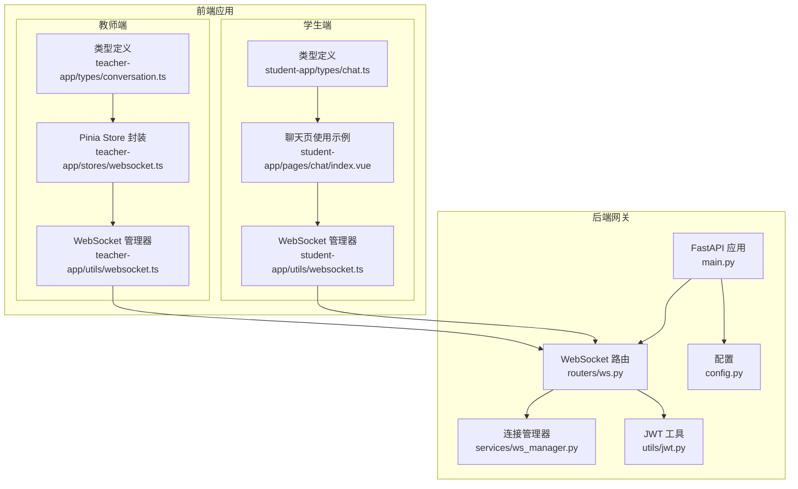
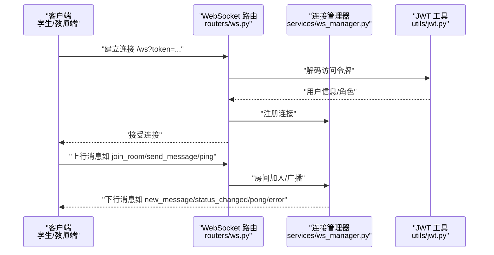
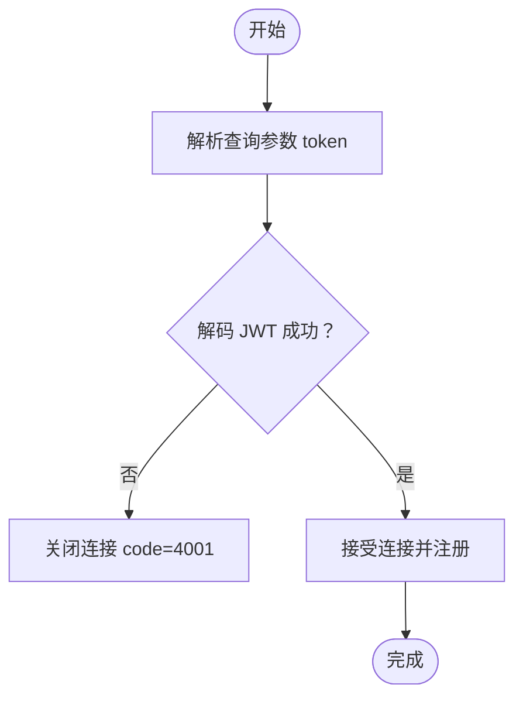
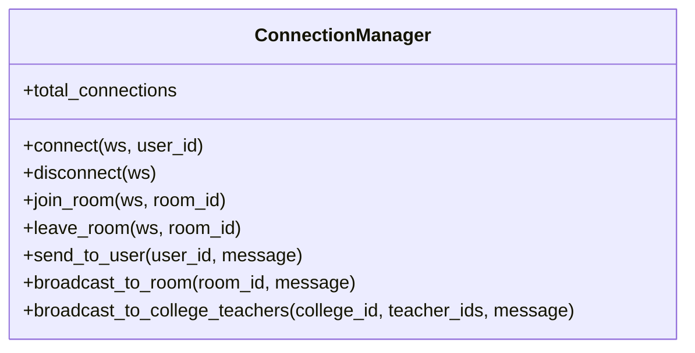
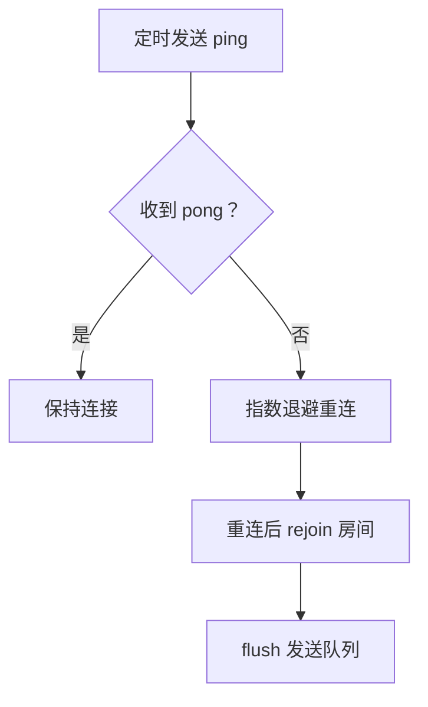
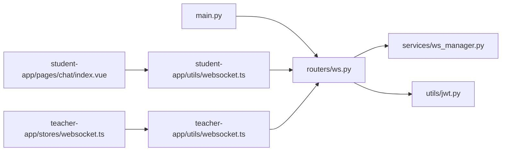

# WebSocket 实时通信接口

<cite>
**本文档引用的文件**
- [ws.py](file://services/gateway/app/routers/ws.py)
- [ws_manager.py](file://services/gateway/app/services/ws_manager.py)
- [jwt.py](file://services/gateway/app/utils/jwt.py)
- [config.py](file://services/gateway/app/config.py)
- [main.py](file://services/gateway/app/main.py)
- [websocket.ts（学生端）](file://apps/student-app/src/utils/websocket.ts)
- [websocket.ts（教师端）](file://apps/teacher-app/src/utils/websocket.ts)
- [websocket.ts（教师端 Pinia Store）](file://apps/teacher-app/src/stores/websocket.ts)
- [chat.ts（学生端类型）](file://apps/student-app/src/types/chat.ts)
- [conversation.ts（教师端类型）](file://apps/teacher-app/src/types/conversation.ts)
- [chat/index.vue（学生端聊天页）](file://apps/student-app/src/pages/chat/index.vue)
- [s2-ws-test.py](file://scripts/s2-ws-test.py)
</cite>

## 目录
1. [简介](#简介)
2. [项目结构](#项目结构)
3. [核心组件](#核心组件)
4. [架构总览](#架构总览)
5. [详细组件分析](#详细组件分析)
6. [依赖关系分析](#依赖关系分析)
7. [性能考虑](#性能考虑)
8. [故障排查指南](#故障排查指南)
9. [结论](#结论)
10. [附录](#附录)

## 简介
本文件面向“医小管 v2”项目的 WebSocket 实时通信接口，提供从连接建立、认证、消息格式、事件类型、房间管理、心跳与重连、错误处理到性能优化与客户端集成的完整说明。目标读者既包括前端开发者，也包括后端与运维人员。

## 项目结构
- 后端网关服务位于 services/gateway，采用 FastAPI 提供 WebSocket 服务与 HTTP API。
- 前端应用分为学生端与教师端，分别在 apps/student-app 与 apps/teacher-app 中，均通过统一的 WebSocket 管理器进行连接与消息分发。
- 关键模块：
  - WebSocket 路由与处理器：services/gateway/app/routers/ws.py
  - 连接与房间管理：services/gateway/app/services/ws_manager.py
  - JWT 认证工具：services/gateway/app/utils/jwt.py
  - 应用配置：services/gateway/app/config.py
  - 应用入口与路由挂载：services/gateway/app/main.py
  - 学生端/教师端 WebSocket 管理器与页面使用示例：apps/student-app/src/utils/websocket.ts 与 apps/teacher-app/src/utils/websocket.ts
  - 教师端 Pinia Store 对 WebSocket 的封装：apps/teacher-app/src/stores/websocket.ts
  - 类型定义：apps/student-app/src/types/chat.ts 与 apps/teacher-app/src/types/conversation.ts
  - WebSocket 单元测试脚本：scripts/s2-ws-test.py

图表来源
- [main.py:1-78](file://services/gateway/app/main.py#L1-L78)
- [ws.py:11-119](file://services/gateway/app/routers/ws.py#L11-L119)
- [ws_manager.py:8-100](file://services/gateway/app/services/ws_manager.py#L8-L100)
- [jwt.py:1-17](file://services/gateway/app/utils/jwt.py#L1-L17)
- [config.py:1-31](file://services/gateway/app/config.py#L1-L31)
- [websocket.ts（学生端）:1-153](file://apps/student-app/src/utils/websocket.ts#L1-L153)
- [websocket.ts（教师端）:1-169](file://apps/teacher-app/src/utils/websocket.ts#L1-L169)
- [websocket.ts（教师端 Pinia Store）:1-32](file://apps/teacher-app/src/stores/websocket.ts#L1-L32)
- [chat/index.vue（学生端聊天页）:249-326](file://apps/student-app/src/pages/chat/index.vue#L249-L326)

章节来源
- [main.py:1-78](file://services/gateway/app/main.py#L1-L78)
- [ws.py:11-119](file://services/gateway/app/routers/ws.py#L11-L119)
- [ws_manager.py:8-100](file://services/gateway/app/services/ws_manager.py#L8-L100)
- [jwt.py:1-17](file://services/gateway/app/utils/jwt.py#L1-L17)
- [config.py:1-31](file://services/gateway/app/config.py#L1-L31)
- [websocket.ts（学生端）:1-153](file://apps/student-app/src/utils/websocket.ts#L1-L153)
- [websocket.ts（教师端）:1-169](file://apps/teacher-app/src/utils/websocket.ts#L1-L169)
- [websocket.ts（教师端 Pinia Store）:1-32](file://apps/teacher-app/src/stores/websocket.ts#L1-L32)
- [chat/index.vue（学生端聊天页）:249-326](file://apps/student-app/src/pages/chat/index.vue#L249-L326)

## 核心组件
- WebSocket 路由与处理器：负责接收连接、基于查询参数携带的 JWT 进行认证、解析上行消息、执行房间加入/离开、广播消息、处理心跳与错误。
- 连接管理器：维护用户连接集合与房间集合，支持向用户或房间广播消息，并清理断开连接。
- JWT 工具：签发与解码访问令牌，用于 WebSocket 认证。
- 前端 WebSocket 管理器：统一封装连接、消息分发、房间加入/离开、心跳、指数退避重连、发送队列与断线重入房间逻辑。
- 页面与 Store 使用示例：展示如何在聊天页监听与派发 WebSocket 事件，以及在教师端 Store 中初始化与销毁连接。

章节来源
- [ws.py:11-119](file://services/gateway/app/routers/ws.py#L11-L119)
- [ws_manager.py:8-100](file://services/gateway/app/services/ws_manager.py#L8-L100)
- [jwt.py:1-17](file://services/gateway/app/utils/jwt.py#L1-L17)
- [websocket.ts（学生端）:1-153](file://apps/student-app/src/utils/websocket.ts#L1-L153)
- [websocket.ts（教师端）:1-169](file://apps/teacher-app/src/utils/websocket.ts#L1-L169)
- [websocket.ts（教师端 Pinia Store）:1-32](file://apps/teacher-app/src/stores/websocket.ts#L1-L32)
- [chat/index.vue（学生端聊天页）:249-326](file://apps/student-app/src/pages/chat/index.vue#L249-L326)

## 架构总览
下图展示了从客户端发起连接到消息广播的端到端流程，包括认证、房间管理与心跳检测。

图表来源
- [ws.py:35-119](file://services/gateway/app/routers/ws.py#L35-L119)
- [ws_manager.py:25-81](file://services/gateway/app/services/ws_manager.py#L25-L81)
- [jwt.py:14-16](file://services/gateway/app/utils/jwt.py#L14-L16)

## 详细组件分析

### WebSocket 连接与认证
- 连接入口：/ws，使用查询参数 token 携带 JWT。
- 认证流程：后端解码 JWT，提取用户标识与角色；失败则以 4001 关闭连接。
- 连接注册：成功后将 WebSocket 加入连接管理器，建立 user_id -> WebSocket 的映射。

图表来源
- [ws.py:35-42](file://services/gateway/app/routers/ws.py#L35-L42)
- [jwt.py:14-16](file://services/gateway/app/utils/jwt.py#L14-L16)

章节来源
- [ws.py:11-42](file://services/gateway/app/routers/ws.py#L11-L42)
- [jwt.py:14-16](file://services/gateway/app/utils/jwt.py#L14-L16)

### 消息格式规范
- 上行消息（客户端 -> 服务端）
  - ping：心跳请求
  - join_room：加入房间，data.conv_id 为会话 ID
  - leave_room：离开房间，data.conv_id 为会话 ID
  - send_message：发送消息，data.conv_id 与 data.content 必填
  - typing：输入状态，data.conv_id 为会话 ID
- 下行消息（服务端 -> 客户端）
  - pong：心跳响应
  - room_joined：加入房间成功，data.conv_id 为会话 ID
  - new_message：新消息，包含 sender_id、sender_type、content、conv_id
  - status_changed：会话状态变更，字段与会话状态枚举一致
  - teacher_typing / student_typing：对方正在输入
  - error：错误，data.message 为错误描述

章节来源
- [ws.py:20-34](file://services/gateway/app/routers/ws.py#L20-L34)

### 事件类型与实时交互模式
- 消息推送：send_message 触发广播 new_message，房间内其他用户收到。
- 状态变更通知：服务端可广播 status_changed，前端页面据此更新 UI。
- 输入提示：typing 触发广播 teacher_typing 或 student_typing，提示对方正在输入。
- 房间管理：join_room/leave_room 控制房间订阅；断线后重连会自动 rejoin。

章节来源
- [ws.py:62-106](file://services/gateway/app/routers/ws.py#L62-L106)
- [chat/index.vue（学生端聊天页）:279-326](file://apps/student-app/src/pages/chat/index.vue#L279-L326)

### 房间管理机制与广播策略
- 房间命名：conv:{conversation_id}
- 广播策略：
  - send_message：向房间内所有连接广播 new_message
  - typing：根据发送者角色广播 teacher_typing 或 student_typing
  - status_changed：可在业务侧触发向房间广播
- 断线清理：断开连接时从所有房间移除，避免悬挂引用。

图表来源
- [ws_manager.py:8-100](file://services/gateway/app/services/ws_manager.py#L8-L100)

章节来源
- [ws_manager.py:8-100](file://services/gateway/app/services/ws_manager.py#L8-L100)

### 心跳检测与断线重连
- 心跳：客户端每 30 秒发送 ping，服务端返回 pong；忽略 pong 消息。
- 重连：客户端在断开时按指数退避重连，最大延迟不超过 30 秒；重连成功后自动重新加入已加入的房间。
- 发送队列：未连接时的消息会被排队，连接恢复后顺序发送。

图表来源
- [websocket.ts（学生端）:137-150](file://apps/student-app/src/utils/websocket.ts#L137-L150)
- [websocket.ts（教师端）:156-166](file://apps/teacher-app/src/utils/websocket.ts#L156-L166)
- [ws.py:59-60](file://services/gateway/app/routers/ws.py#L59-L60)

章节来源
- [websocket.ts（学生端）:1-153](file://apps/student-app/src/utils/websocket.ts#L1-L153)
- [websocket.ts（教师端）:1-169](file://apps/teacher-app/src/utils/websocket.ts#L1-L169)
- [ws.py:59-60](file://services/gateway/app/routers/ws.py#L59-L60)

### 错误处理与健壮性
- 无效 JWT：立即关闭连接（code=4001）
- 非法 JSON：返回 error 消息
- 未知消息类型：返回 error 消息
- 连接异常：捕获异常并断开连接，清理资源
- 发送失败：识别死连接并清理，避免阻塞广播

章节来源
- [ws.py:40-42](file://services/gateway/app/routers/ws.py#L40-L42)
- [ws.py:52-54](file://services/gateway/app/routers/ws.py#L52-L54)
- [ws.py:108-112](file://services/gateway/app/routers/ws.py#L108-L112)
- [ws.py:114-119](file://services/gateway/app/routers/ws.py#L114-L119)
- [ws_manager.py:62-69](file://services/gateway/app/services/ws_manager.py#L62-L69)
- [ws_manager.py:74-81](file://services/gateway/app/services/ws_manager.py#L74-L81)

### 前端集成示例与最佳实践
- 学生端聊天页：在 onShow/onHide 中加入/离开房间；注册 new_message 与 status_changed 监听；发送消息时区分 teacher_serving 与 ai_serving 场景。
- 教师端 Store：初始化时调用 wsManager.connect(token)，监听 '*' 更新连接状态；销毁时断开连接并清空未读数。

章节来源
- [chat/index.vue（学生端聊天页）:249-326](file://apps/student-app/src/pages/chat/index.vue#L249-L326)
- [websocket.ts（教师端 Pinia Store）:1-32](file://apps/teacher-app/src/stores/websocket.ts#L1-L32)

## 依赖关系分析
- 后端依赖链：main.py 挂载路由 -> ws.py 处理 WebSocket -> ws_manager.py 管理连接与房间 -> jwt.py 解码令牌。
- 前端依赖链：各页面/Store 通过 wsManager 统一管理连接；消息分发通过事件名与 data 结构与后端保持一致。

图表来源
- [main.py:70-78](file://services/gateway/app/main.py#L70-L78)
- [ws.py:11-119](file://services/gateway/app/routers/ws.py#L11-L119)
- [ws_manager.py:8-100](file://services/gateway/app/services/ws_manager.py#L8-L100)
- [jwt.py:1-17](file://services/gateway/app/utils/jwt.py#L1-L17)
- [websocket.ts（学生端）:1-153](file://apps/student-app/src/utils/websocket.ts#L1-L153)
- [websocket.ts（教师端）:1-169](file://apps/teacher-app/src/utils/websocket.ts#L1-L169)
- [chat/index.vue（学生端聊天页）:249-326](file://apps/student-app/src/pages/chat/index.vue#L249-L326)
- [websocket.ts（教师端 Pinia Store）:1-32](file://apps/teacher-app/src/stores/websocket.ts#L1-L32)

章节来源
- [main.py:70-78](file://services/gateway/app/main.py#L70-L78)
- [ws.py:11-119](file://services/gateway/app/routers/ws.py#L11-L119)
- [ws_manager.py:8-100](file://services/gateway/app/services/ws_manager.py#L8-L100)
- [jwt.py:1-17](file://services/gateway/app/utils/jwt.py#L1-L17)
- [websocket.ts（学生端）:1-153](file://apps/student-app/src/utils/websocket.ts#L1-L153)
- [websocket.ts（教师端）:1-169](file://apps/teacher-app/src/utils/websocket.ts#L1-L169)
- [chat/index.vue（学生端聊天页）:249-326](file://apps/student-app/src/pages/chat/index.vue#L249-L326)
- [websocket.ts（教师端 Pinia Store）:1-32](file://apps/teacher-app/src/stores/websocket.ts#L1-L32)

## 性能考虑
- 广播成本控制：房间内广播需遍历房间连接集合，建议限制房间规模或采用分片策略。
- 死连接清理：发送失败时及时清理，避免阻塞后续广播。
- 心跳频率：默认 30 秒一次，可根据网络质量调整；过低增加带宽占用，过高影响感知。
- 发送队列：未连接时排队，连接恢复后顺序 flush，避免丢失消息但可能产生重复加入房间的风险，需确保前端幂等处理。
- 重连退避：指数退避上限 30 秒，避免雪崩效应。

## 故障排查指南
- 连接被拒绝（code=4001）：检查 token 是否有效、是否过期、是否正确传递到查询参数。
- 无法收到 pong：确认客户端是否定时发送 ping，服务端是否正常返回。
- 无法加入房间：确认 conv_id 是否正确，是否在 onShow/onHide 中正确调用 join/leave。
- 未知类型错误：检查上行消息 type 字段是否拼写正确。
- 重连频繁：检查网络稳定性与心跳间隔；确认客户端指数退避逻辑是否生效。
- 单元测试参考：使用脚本 s2-ws-test.py 进行冒烟测试，验证 ping/pong、join_room、未知类型与无效 token 的行为。

章节来源
- [ws.py:40-42](file://services/gateway/app/routers/ws.py#L40-L42)
- [ws.py:52-54](file://services/gateway/app/routers/ws.py#L52-L54)
- [ws.py:108-112](file://services/gateway/app/routers/ws.py#L108-L112)
- [s2-ws-test.py:1-51](file://scripts/s2-ws-test.py#L1-L51)

## 结论
本 WebSocket 接口以简洁的消息模型与房间广播为核心，结合心跳与指数退避重连，满足学生与教师之间的实时互动需求。前后端通过统一的事件名与数据结构协作，具备良好的扩展性与可维护性。建议在生产环境中进一步完善消息持久化与更细粒度的权限控制。

## 附录

### 消息类型与字段对照表
- 上行
  - ping：无 data
  - join_room：data.conv_id
  - leave_room：data.conv_id
  - send_message：data.conv_id, data.content
  - typing：data.conv_id
- 下行
  - pong：无 data
  - room_joined：data.conv_id
  - new_message：data.conv_id, data.sender_id, data.sender_type, data.content
  - status_changed：data（字段与会话状态一致）
  - teacher_typing / student_typing：data.conv_id, data.user_id
  - error：data.message

章节来源
- [ws.py:20-34](file://services/gateway/app/routers/ws.py#L20-L34)

### 客户端集成要点
- 学生端：在聊天页生命周期中加入/离开房间；监听 new_message 与 status_changed；根据会话状态决定消息发送路径。
- 教师端：通过 Store 初始化连接；监听 '*' 更新连接状态；断开时清理未读数。

章节来源
- [chat/index.vue（学生端聊天页）:249-326](file://apps/student-app/src/pages/chat/index.vue#L249-L326)
- [websocket.ts（教师端 Pinia Store）:1-32](file://apps/teacher-app/src/stores/websocket.ts#L1-L32)