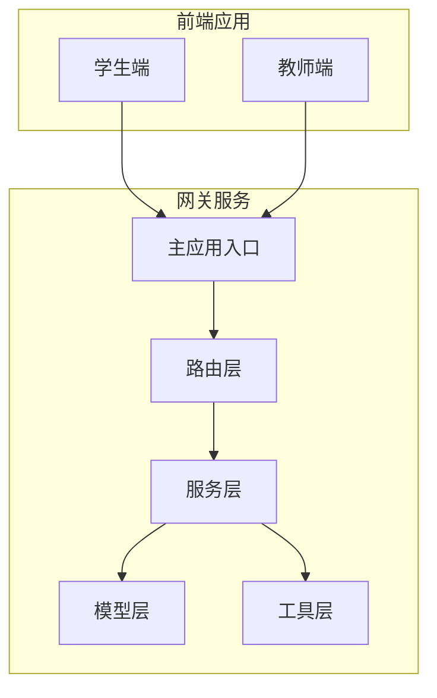
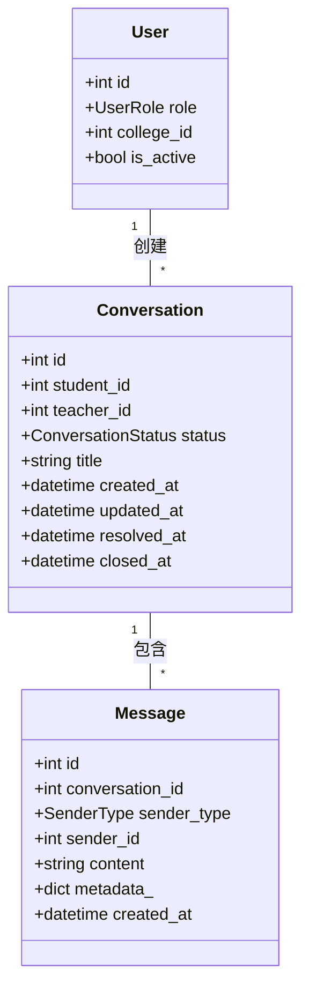
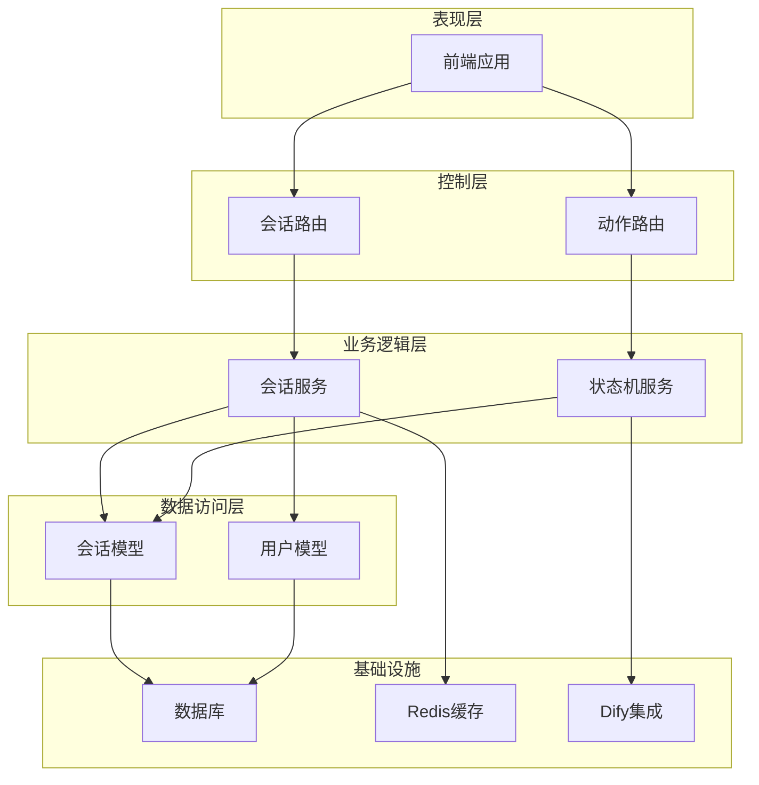
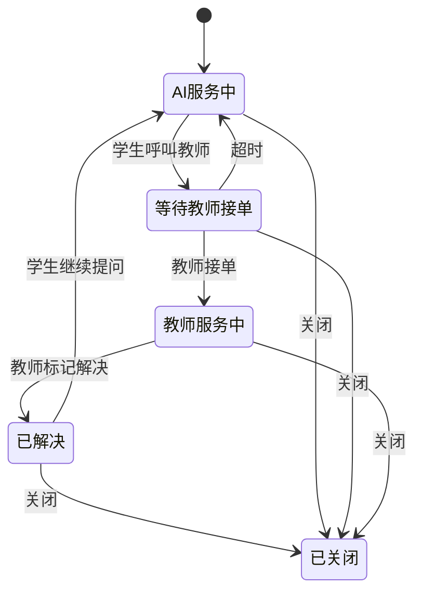
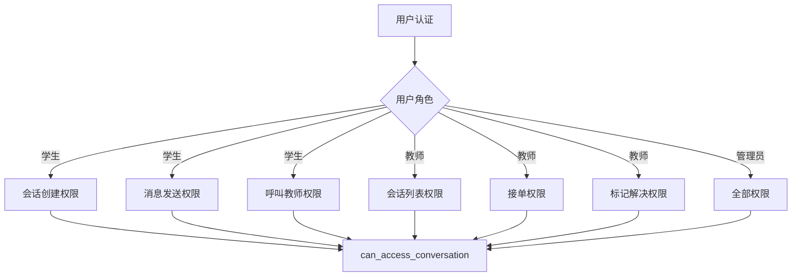
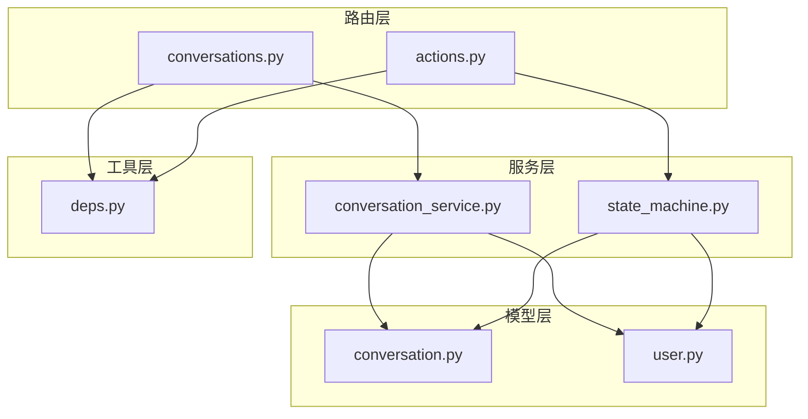
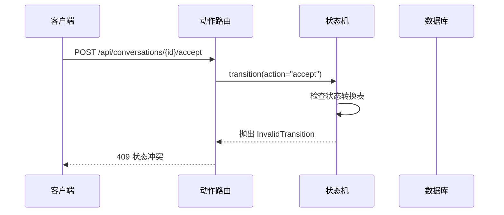
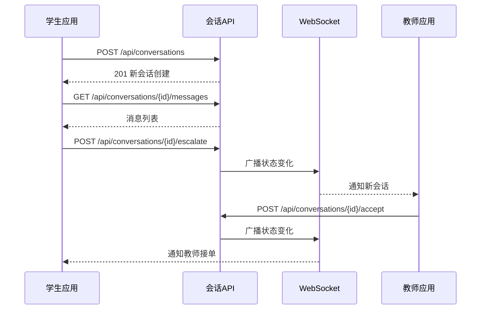

# 会话管理接口

<cite>
**本文引用的文件**
- [services/gateway/app/routers/conversations.py](file://services/gateway/app/routers/conversations.py)
- [services/gateway/app/routers/actions.py](file://services/gateway/app/routers/actions.py)
- [services/gateway/app/schemas/conversation.py](file://services/gateway/app/schemas/conversation.py)
- [services/gateway/app/services/conversation_service.py](file://services/gateway/app/services/conversation_service.py)
- [services/gateway/app/services/state_machine.py](file://services/gateway/app/services/state_machine.py)
- [services/gateway/app/models/conversation.py](file://services/gateway/app/models/conversation.py)
- [services/gateway/app/models/user.py](file://services/gateway/app/models/user.py)
- [services/gateway/app/utils/deps.py](file://services/gateway/app/utils/deps.py)
- [services/gateway/app/main.py](file://services/gateway/app/main.py)
- [apps/teacher-app/src/api/conversations.ts](file://apps/teacher-app/src/api/conversations.ts)
- [apps/student-app/src/api/chat.ts](file://apps/student-app/src/api/chat.ts)
</cite>

## 目录
1. [简介](#简介)
2. [项目结构](#项目结构)
3. [核心组件](#核心组件)
4. [架构概览](#架构概览)
5. [详细组件分析](#详细组件分析)
6. [依赖分析](#依赖分析)
7. [性能考虑](#性能考虑)
8. [故障排除指南](#故障排除指南)
9. [结论](#结论)

## 简介

医小管 v2 的会话管理接口提供了完整的会话生命周期管理功能，包括会话创建、查询、消息管理以及状态机驱动的状态转换。该系统支持三种用户角色：学生、教师和管理员，每种角色在会话管理中具有不同的权限和操作能力。

系统采用基于状态机的设计模式，定义了清晰的会话状态流转规则，确保会话状态的合法性和一致性。同时集成了实时消息推送功能，通过 WebSocket 实现会话状态变化和新消息的通知。

## 项目结构

会话管理功能主要分布在以下模块中：

**图表来源**
- [services/gateway/app/main.py:1-78](file://services/gateway/app/main.py#L1-L78)
- [services/gateway/app/routers/conversations.py:1-129](file://services/gateway/app/routers/conversations.py#L1-L129)

**章节来源**
- [services/gateway/app/main.py:1-78](file://services/gateway/app/main.py#L1-L78)
- [services/gateway/app/routers/conversations.py:1-129](file://services/gateway/app/routers/conversations.py#L1-L129)

## 核心组件

### 会话状态枚举

系统定义了五种核心会话状态：
- `ai_serving`: AI 服务中
- `pending_teacher`: 等待教师接单
- `teacher_serving`: 教师服务中
- `resolved`: 已解决
- `closed`: 已关闭

### 用户角色权限

- **学生**: 可创建会话、查看自己的会话、发送消息、呼叫教师
- **教师**: 可接收学生会话、查看本学院待接单会话、标记解决、发送消息
- **管理员**: 拥有最高权限，可访问所有会话

### 数据模型

**图表来源**
- [services/gateway/app/models/conversation.py:26-63](file://services/gateway/app/models/conversation.py#L26-L63)
- [services/gateway/app/models/user.py:45-76](file://services/gateway/app/models/user.py#L45-L76)

**章节来源**
- [services/gateway/app/models/conversation.py:11-63](file://services/gateway/app/models/conversation.py#L11-L63)
- [services/gateway/app/models/user.py:10-76](file://services/gateway/app/models/user.py#L10-L76)

## 架构概览

系统采用分层架构设计，各层职责明确：

**图表来源**
- [services/gateway/app/main.py:70-78](file://services/gateway/app/main.py#L70-L78)
- [services/gateway/app/routers/conversations.py:18-18](file://services/gateway/app/routers/conversations.py#L18-L18)
- [services/gateway/app/routers/actions.py:13-13](file://services/gateway/app/routers/actions.py#L13-L13)

## 详细组件分析

### 会话管理路由

#### 会话创建接口

**HTTP 方法**: `POST`
**URL 模式**: `/api/conversations`
**请求参数**: 
- `title`: 字符串，可选，会话标题

**响应格式**:
- `id`: 整数，会话标识
- `student_id`: 整数，学生标识
- `teacher_id`: 整数或空，教师标识
- `status`: 字符串，会话状态
- `title`: 字符串，会话标题
- `created_at`: 时间戳，创建时间
- `updated_at`: 时间戳，更新时间

**权限控制**: 仅学生可创建会话

#### 会话列表查询接口

**HTTP 方法**: `GET`
**URL 模式**: `/api/conversations`
**查询参数**:
- `page`: 整数，页码，默认1，最小1
- `size`: 整数，每页数量，默认20，范围1-100
- `status`: 字符串，会话状态过滤器

**响应格式**:
- `items`: 会话数组
- `total`: 总数

**权限控制**: 
- 学生：只能查看自己的所有会话
- 教师：查看本学院的待接单会话 + 自己正在服务的会话
- 管理员：查看所有会话

#### 会话详情获取接口

**HTTP 方法**: `GET`
**URL 模式**: `/api/conversations/{conv_id}`
**路径参数**:
- `conv_id`: 整数，会话标识

**响应格式**: 与会话创建相同

**权限控制**: 基于 `can_access_conversation` 函数的权限检查

#### 消息列表查询接口

**HTTP 方法**: `GET`
**URL 模式**: `/api/conversations/{conv_id}/messages`
**路径参数**:
- `conv_id`: 整数，会话标识
**查询参数**:
- `page`: 整数，默认1，最小1
- `size`: 整数，默认50，范围1-200

**响应格式**:
- `items`: 消息数组
- `total`: 总数

**权限控制**: 先验证会话权限，再查询消息

#### 发送消息接口

**HTTP 方法**: `POST`
**URL 模式**: `/api/conversations/{conv_id}/messages`
**路径参数**:
- `conv_id`: 整数，会话标识

**请求参数**:
- `content`: 字符串，消息内容

**响应格式**:
- `id`: 整数，消息标识
- `conversation_id`: 整数，会话标识
- `sender_type`: 字符串，发送者类型
- `sender_id`: 整数或空，发送者标识
- `content`: 字符串，消息内容
- `created_at`: 时间戳，创建时间

**权限控制**:
- 学生：可随时发送消息
- 教师：仅能回复已接单的会话

**章节来源**
- [services/gateway/app/routers/conversations.py:21-129](file://services/gateway/app/routers/conversations.py#L21-L129)
- [services/gateway/app/schemas/conversation.py:5-50](file://services/gateway/app/schemas/conversation.py#L5-L50)

### 会话状态管理路由

#### 呼叫教师接口

**HTTP 方法**: `POST`
**URL 模式**: `/api/conversations/{conv_id}/escalate`
**路径参数**:
- `conv_id`: 整数，会话标识

**响应格式**: 更新后的会话对象

**权限控制**: 仅学生可操作，且必须是会话创建者

**状态转换**: `ai_serving` → `pending_teacher`

#### 教师接单接口

**HTTP 方法**: `POST`
**URL 模式**: `/api/conversations/{conv_id}/accept`
**路径参数**:
- `conv_id`: 整数，会话标识

**响应格式**: 更新后的会话对象

**权限控制**: 仅教师或管理员可操作

**状态转换**: `pending_teacher` → `teacher_serving`

#### 标记解决接口

**HTTP 方法**: `POST`
**URL 模式**: `/api/conversations/{conv_id}/resolve`
**路径参数**:
- `conv_id`: 整数，会话标识

**响应格式**: 更新后的会话对象

**权限控制**: 仅接单教师或管理员可操作

**状态转换**: `teacher_serving` → `resolved`

#### 关闭会话接口

**HTTP 方法**: `POST`
**URL 模式**: `/api/conversations/{conv_id}/close`
**路径参数**:
- `conv_id`: 整数，会话标识

**响应格式**: 更新后的会话对象

**权限控制**: 任何有权限的用户都可操作

**状态转换**: 任意状态 → `closed`

**章节来源**
- [services/gateway/app/routers/actions.py:68-154](file://services/gateway/app/routers/actions.py#L68-L154)

### 状态机设计

会话状态机定义了完整的状态转换规则：

**图表来源**
- [services/gateway/app/services/state_machine.py:20-31](file://services/gateway/app/services/state_machine.py#L20-L31)

**章节来源**
- [services/gateway/app/services/state_machine.py:16-96](file://services/gateway/app/services/state_machine.py#L16-L96)

### 权限控制系统

系统实现了基于角色的权限控制（RBAC）：

**图表来源**
- [services/gateway/app/services/conversation_service.py:7-27](file://services/gateway/app/services/conversation_service.py#L7-L27)
- [services/gateway/app/utils/deps.py:14-35](file://services/gateway/app/utils/deps.py#L14-L35)

**章节来源**
- [services/gateway/app/services/conversation_service.py:7-27](file://services/gateway/app/services/conversation_service.py#L7-L27)
- [services/gateway/app/utils/deps.py:14-35](file://services/gateway/app/utils/deps.py#L14-L35)

## 依赖分析

### 组件依赖关系

**图表来源**
- [services/gateway/app/routers/conversations.py:12-16](file://services/gateway/app/routers/conversations.py#L12-L16)
- [services/gateway/app/routers/actions.py:7-11](file://services/gateway/app/routers/actions.py#L7-L11)
- [services/gateway/app/services/conversation_service.py:1-5](file://services/gateway/app/services/conversation_service.py#L1-L5)

### 外部依赖

系统依赖以下外部服务：
- **PostgreSQL**: 主要数据存储
- **Redis**: 缓存和会话状态管理
- **Dify**: AI 聊天服务集成

**章节来源**
- [services/gateway/app/main.py:16-22](file://services/gateway/app/main.py#L16-L22)

## 性能考虑

### 查询优化

1. **索引策略**: 会话表对 `student_id` 和 `status` 字段建立了复合索引
2. **分页查询**: 默认每页20条记录，最大100条
3. **排序优化**: 按 `updated_at` 降序排列

### 缓存策略

1. **Redis 缓存**: 使用 Redis 进行会话状态缓存
2. **连接池**: 数据库连接采用异步连接池
3. **批量操作**: 支持批量消息查询和状态更新

### 实时通信

1. **WebSocket 广播**: 使用 WebSocket 实现实时消息推送
2. **房间管理**: 每个会话维护独立的 WebSocket 房间
3. **通知机制**: 状态变化和新消息都会触发通知

## 故障排除指南

### 常见错误及解决方案

| 错误代码 | 错误类型 | 可能原因 | 解决方案 |
|---------|---------|---------|---------|
| 401 | 未认证 | JWT 令牌无效或过期 | 重新登录获取新令牌 |
| 403 | 权限不足 | 用户角色不匹配或无访问权限 | 检查用户角色和会话权限 |
| 404 | 资源不存在 | 会话或用户不存在 | 验证 ID 是否正确 |
| 409 | 状态冲突 | 非法的状态转换 | 检查当前会话状态 |
| 500 | 服务器错误 | 数据库或服务异常 | 查看服务器日志 |

### 状态机错误处理

当尝试执行非法状态转换时，系统会抛出 `InvalidTransition` 异常：

**图表来源**
- [services/gateway/app/services/state_machine.py:34-48](file://services/gateway/app/services/state_machine.py#L34-L48)

### 前端调用示例

#### 学生端调用流程

**图表来源**
- [apps/student-app/src/api/chat.ts:9-35](file://apps/student-app/src/api/chat.ts#L9-L35)
- [apps/teacher-app/src/api/conversations.ts:35-43](file://apps/teacher-app/src/api/conversations.ts#L35-L43)

**章节来源**
- [apps/student-app/src/api/chat.ts:1-36](file://apps/student-app/src/api/chat.ts#L1-L36)
- [apps/teacher-app/src/api/conversations.ts:1-44](file://apps/teacher-app/src/api/conversations.ts#L1-L44)

## 结论

医小管 v2 的会话管理接口设计完整，具有以下特点：

1. **清晰的权限模型**: 基于角色的细粒度权限控制
2. **完整的状态机**: 明确的状态转换规则和约束
3. **实时通信**: 基于 WebSocket 的即时消息推送
4. **RESTful 设计**: 符合 RESTful API 最佳实践
5. **错误处理**: 完善的错误处理和状态码规范

该系统为医小管 v2 提供了稳定可靠的会话管理基础，支持从 AI 辅助到人工教师服务的完整流程。通过合理的架构设计和状态机约束，确保了会话状态的一致性和系统的可靠性。