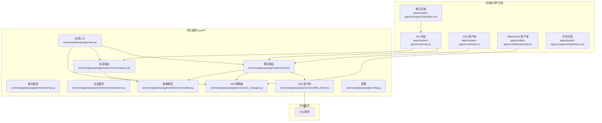
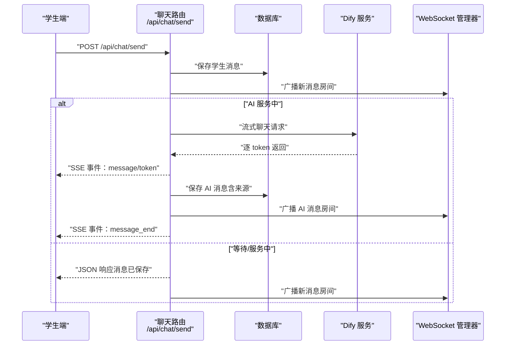
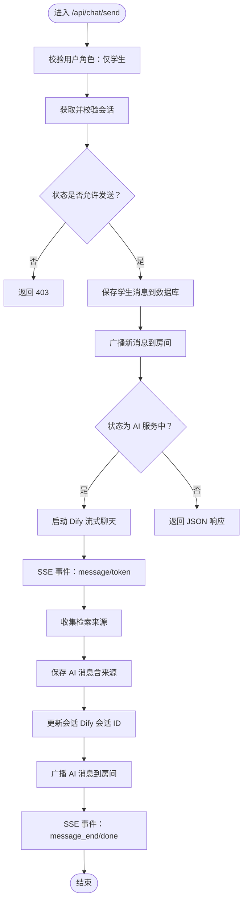
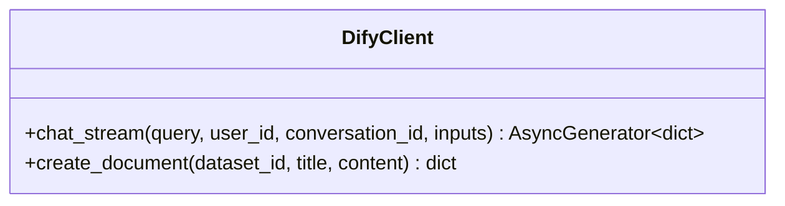
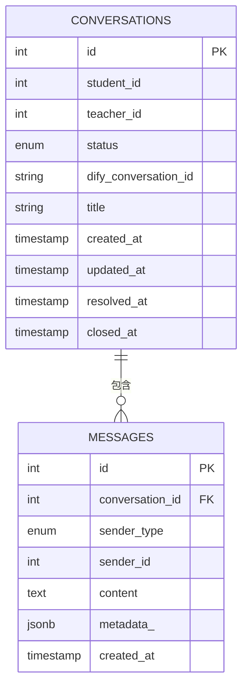
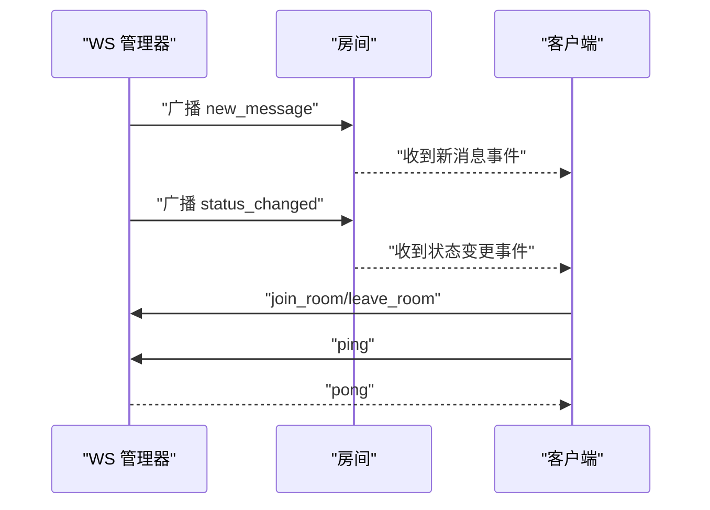
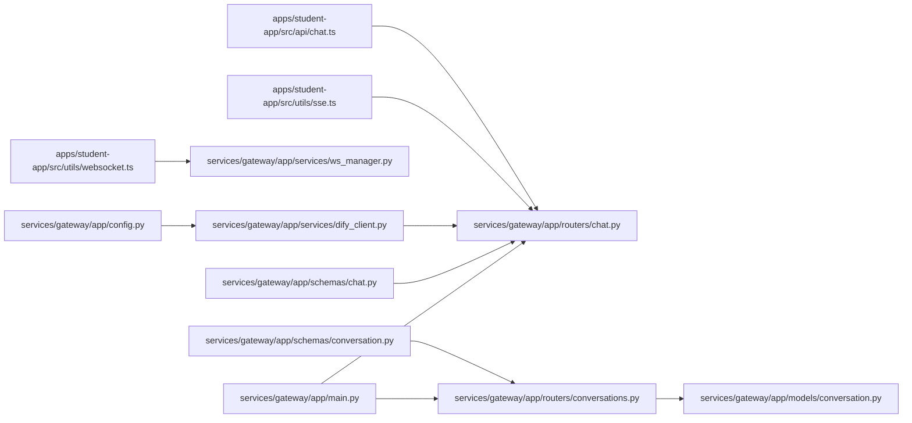

# 聊天通信接口

<cite>
**本文档引用的文件**
- [services/gateway/app/routers/chat.py](file://services/gateway/app/routers/chat.py)
- [services/gateway/app/schemas/chat.py](file://services/gateway/app/schemas/chat.py)
- [services/gateway/app/services/dify_client.py](file://services/gateway/app/services/dify_client.py)
- [services/gateway/app/models/conversation.py](file://services/gateway/app/models/conversation.py)
- [services/gateway/app/services/ws_manager.py](file://services/gateway/app/services/ws_manager.py)
- [services/gateway/app/main.py](file://services/gateway/app/main.py)
- [services/gateway/app/config.py](file://services/gateway/app/config.py)
- [apps/student-app/src/api/chat.ts](file://apps/student-app/src/api/chat.ts)
- [apps/student-app/src/types/chat.ts](file://apps/student-app/src/types/chat.ts)
- [apps/student-app/src/utils/sse.ts](file://apps/student-app/src/utils/sse.ts)
- [apps/student-app/src/utils/websocket.ts](file://apps/student-app/src/utils/websocket.ts)
- [apps/student-app/src/pages/chat/index.vue](file://apps/student-app/src/pages/chat/index.vue)
- [apps/student-app/src/pages/chat/history.vue](file://apps/student-app/src/pages/chat/history.vue)
- [services/gateway/app/routers/conversations.py](file://services/gateway/app/routers/conversations.py)
- [services/gateway/app/schemas/conversation.py](file://services/gateway/app/schemas/conversation.py)
</cite>

## 目录
1. [简介](#简介)
2. [项目结构](#项目结构)
3. [核心组件](#核心组件)
4. [架构总览](#架构总览)
5. [详细组件分析](#详细组件分析)
6. [依赖关系分析](#依赖关系分析)
7. [性能考虑](#性能考虑)
8. [故障排除指南](#故障排除指南)
9. [结论](#结论)
10. [附录](#附录)

## 简介
本文件为“医小管 v2”聊天通信接口的详细 API 文档，覆盖以下能力：
- 聊天消息发送、接收与状态更新
- 与 Dify AI 服务的集成：流式响应处理、意图识别与知识库检索
- 聊天消息数据结构、消息类型分类（文本、系统消息等）与消息状态管理
- 聊天上下文维护、消息历史查询与实时状态同步机制
- 聊天接口使用示例与集成指南

## 项目结构
聊天系统由三部分组成：
- 前端应用（学生端）：负责消息渲染、SSE/WS 接收、UI 交互与状态展示
- 网关服务（FastAPI）：负责路由、鉴权、状态机、数据库持久化、Dify 流式转发与 WebSocket 广播
- Dify 服务：提供流式聊天与知识库检索能力

**图表来源**
- [services/gateway/app/main.py:1-78](file://services/gateway/app/main.py#L1-L78)
- [services/gateway/app/routers/chat.py:1-191](file://services/gateway/app/routers/chat.py#L1-L191)
- [services/gateway/app/routers/conversations.py:1-129](file://services/gateway/app/routers/conversations.py#L1-L129)
- [services/gateway/app/services/dify_client.py:1-105](file://services/gateway/app/services/dify_client.py#L1-L105)
- [services/gateway/app/services/ws_manager.py:1-100](file://services/gateway/app/services/ws_manager.py#L1-L100)
- [apps/student-app/src/api/chat.ts:1-36](file://apps/student-app/src/api/chat.ts#L1-L36)
- [apps/student-app/src/utils/sse.ts:1-69](file://apps/student-app/src/utils/sse.ts#L1-L69)
- [apps/student-app/src/utils/websocket.ts:1-153](file://apps/student-app/src/utils/websocket.ts#L1-L153)

**章节来源**
- [services/gateway/app/main.py:1-78](file://services/gateway/app/main.py#L1-L78)
- [apps/student-app/src/pages/chat/index.vue:1-649](file://apps/student-app/src/pages/chat/index.vue#L1-L649)

## 核心组件
- 聊天路由与流式处理：负责学生消息发送、状态判断、消息持久化、Dify 流式转发与 WebSocket 广播
- Dify 客户端：封装 Dify 流式聊天接口，逐 token 下发并收集检索来源
- 会话与消息模型：定义会话状态枚举、发送者类型与消息表结构
- WebSocket 管理器：维护用户连接、房间广播与心跳保活
- 前端 API 封装与工具：统一的聊天 API、SSE 解析器、WebSocket 管理器
- 前端页面：聊天页负责渲染消息、处理流式输出与状态同步；历史页负责分页查看会话

**章节来源**
- [services/gateway/app/routers/chat.py:22-191](file://services/gateway/app/routers/chat.py#L22-L191)
- [services/gateway/app/services/dify_client.py:22-69](file://services/gateway/app/services/dify_client.py#L22-L69)
- [services/gateway/app/models/conversation.py:11-63](file://services/gateway/app/models/conversation.py#L11-L63)
- [services/gateway/app/services/ws_manager.py:8-100](file://services/gateway/app/services/ws_manager.py#L8-L100)
- [apps/student-app/src/api/chat.ts:1-36](file://apps/student-app/src/api/chat.ts#L1-L36)
- [apps/student-app/src/utils/sse.ts:13-69](file://apps/student-app/src/utils/sse.ts#L13-L69)
- [apps/student-app/src/utils/websocket.ts:3-153](file://apps/student-app/src/utils/websocket.ts#L3-L153)

## 架构总览
聊天通信采用“请求-流式响应-实时广播”的组合模式：
- 学生在“AI 服务中”状态下发送消息，后端通过 Dify 流式返回 token，前端以 SSE 实时渲染
- 当状态切换至“等待老师”或“老师服务中”，消息以 JSON 形式写入数据库并通过 WebSocket 广播
- 会话状态机驱动状态流转，配合 WebSocket 向前端推送状态变更事件

**图表来源**
- [services/gateway/app/routers/chat.py:22-191](file://services/gateway/app/routers/chat.py#L22-L191)
- [services/gateway/app/services/dify_client.py:22-69](file://services/gateway/app/services/dify_client.py#L22-L69)
- [services/gateway/app/services/ws_manager.py:71-82](file://services/gateway/app/services/ws_manager.py#L71-L82)

## 详细组件分析

### 聊天发送接口（/api/chat/send）
- 角色限制：仅学生可调用
- 会话校验：根据当前用户获取会话，若已解决则触发“重新激活”并广播状态变更
- 状态检查：仅允许在“AI 服务中”、“等待老师”、“老师服务中”状态发送消息
- 处理流程：
  - 保存学生消息到数据库
  - 广播“新消息”事件到房间
  - 若状态为“AI 服务中”，返回 SSE 流；否则返回 JSON 响应
- SSE 流式处理：
  - 调用 Dify 客户端进行流式聊天
  - 逐 token 通过 SSE 事件“message”下发
  - 结束时发送“message_end”事件，随后“done”
  - 保存完整 AI 消息与检索来源，更新会话 Dify 会话 ID，广播 AI 消息

**图表来源**
- [services/gateway/app/routers/chat.py:22-191](file://services/gateway/app/routers/chat.py#L22-L191)
- [services/gateway/app/services/dify_client.py:22-69](file://services/gateway/app/services/dify_client.py#L22-L69)

**章节来源**
- [services/gateway/app/routers/chat.py:22-191](file://services/gateway/app/routers/chat.py#L22-L191)
- [services/gateway/app/schemas/chat.py:5-18](file://services/gateway/app/schemas/chat.py#L5-L18)

### Dify 客户端（流式聊天）
- 功能：封装 Dify 的流式聊天接口，逐事件 yield
- 关键事件：
  - message：包含增量答案 token
  - message_end：包含元数据（如检索来源），以及最终 conversation_id
  - error：错误信息
- 使用场景：在聊天路由中逐事件转发给前端，保存完整答案与来源

**图表来源**
- [services/gateway/app/services/dify_client.py:11-105](file://services/gateway/app/services/dify_client.py#L11-L105)

**章节来源**
- [services/gateway/app/services/dify_client.py:22-69](file://services/gateway/app/services/dify_client.py#L22-L69)

### 会话与消息模型
- 会话状态枚举：ai_serving、pending_teacher、teacher_serving、resolved、closed
- 发送者类型：student、ai、teacher、system
- 表结构要点：
  - conversations：存储会话基本信息、状态与 Dify 会话 ID
  - messages：存储消息内容、发送者类型与元数据（如来源）

**图表来源**
- [services/gateway/app/models/conversation.py:26-63](file://services/gateway/app/models/conversation.py#L26-L63)

**章节来源**
- [services/gateway/app/models/conversation.py:11-63](file://services/gateway/app/models/conversation.py#L11-L63)

### WebSocket 实时广播
- 房间广播：每个会话对应一个房间（格式：conv:{conversation_id}）
- 事件类型：
  - new_message：新消息到达（含发送者类型、内容、时间等）
  - status_changed：会话状态变更（含新状态与前一状态）
- 心跳保活：每 30 秒发送 ping，断线自动重连并重新加入房间

**图表来源**
- [services/gateway/app/services/ws_manager.py:8-100](file://services/gateway/app/services/ws_manager.py#L8-L100)
- [apps/student-app/src/utils/websocket.ts:20-153](file://apps/student-app/src/utils/websocket.ts#L20-L153)

**章节来源**
- [services/gateway/app/services/ws_manager.py:71-82](file://services/gateway/app/services/ws_manager.py#L71-L82)
- [apps/student-app/src/utils/websocket.ts:84-127](file://apps/student-app/src/utils/websocket.ts#L84-L127)

### 前端集成与使用

#### API 封装（学生端）
- 会话相关：创建会话、列出会话、获取会话详情、获取消息列表、转人工
- 会话状态：支持分页与筛选

**章节来源**
- [apps/student-app/src/api/chat.ts:9-36](file://apps/student-app/src/api/chat.ts#L9-L36)
- [apps/student-app/src/types/chat.ts:16-37](file://apps/student-app/src/types/chat.ts#L16-L37)

#### SSE 流式处理（前端）
- 事件解析：message（增量 token）、message_end（完整内容与来源）、error（错误提示）
- 与聊天路由配合，实现“AI 服务中”状态下的实时渲染

**章节来源**
- [apps/student-app/src/utils/sse.ts:13-69](file://apps/student-app/src/utils/sse.ts#L13-L69)
- [services/gateway/app/routers/chat.py:105-191](file://services/gateway/app/routers/chat.py#L105-L191)

#### WebSocket 管理（前端）
- 连接与重连：指数退避重连，最大次数限制
- 房间管理：加入/离开房间，自动重连后 re-join
- 事件监听：注册 new_message 与 status_changed 回调

**章节来源**
- [apps/student-app/src/utils/websocket.ts:3-153](file://apps/student-app/src/utils/websocket.ts#L3-L153)

#### 聊天页面（渲染与交互）
- 渲染逻辑：区分用户消息、AI 消息、教师消息与系统消息
- 流式渲染：AI 消息支持增量 token 渲染与“正在思考”动画
- 来源展示：message_end 事件后展示检索来源卡片
- 转人工：当 AI 拒答关键词命中时，提供内联“转人工服务”按钮

**章节来源**
- [apps/student-app/src/pages/chat/index.vue:279-326](file://apps/student-app/src/pages/chat/index.vue#L279-L326)
- [apps/student-app/src/pages/chat/index.vue:423-481](file://apps/student-app/src/pages/chat/index.vue#L423-L481)
- [apps/student-app/src/pages/chat/index.vue:490-502](file://apps/student-app/src/pages/chat/index.vue#L490-L502)

#### 历史页面（分页查询）
- 分页加载：支持下拉刷新与触底加载
- 状态标签：将状态码映射为可读文案

**章节来源**
- [apps/student-app/src/pages/chat/history.vue:54-83](file://apps/student-app/src/pages/chat/history.vue#L54-L83)

## 依赖关系分析

**图表来源**
- [apps/student-app/src/api/chat.ts:1-36](file://apps/student-app/src/api/chat.ts#L1-L36)
- [services/gateway/app/routers/chat.py:1-191](file://services/gateway/app/routers/chat.py#L1-L191)
- [services/gateway/app/services/dify_client.py:1-105](file://services/gateway/app/services/dify_client.py#L1-L105)
- [services/gateway/app/services/ws_manager.py:1-100](file://services/gateway/app/services/ws_manager.py#L1-L100)
- [services/gateway/app/routers/conversations.py:1-129](file://services/gateway/app/routers/conversations.py#L1-L129)
- [services/gateway/app/models/conversation.py:1-63](file://services/gateway/app/models/conversation.py#L1-L63)
- [services/gateway/app/schemas/chat.py:1-18](file://services/gateway/app/schemas/chat.py#L1-L18)
- [services/gateway/app/schemas/conversation.py:1-50](file://services/gateway/app/schemas/conversation.py#L1-L50)
- [services/gateway/app/main.py:1-78](file://services/gateway/app/main.py#L1-L78)
- [services/gateway/app/config.py:1-31](file://services/gateway/app/config.py#L1-L31)

**章节来源**
- [services/gateway/app/main.py:70-78](file://services/gateway/app/main.py#L70-L78)

## 性能考虑
- SSE 流式传输：前端逐 token 渲染，降低首屏延迟
- WebSocket 广播：房间级广播，避免全量推送
- Dify 流式直传：后端不做额外缓存，减少中间层开销
- 重连策略：指数退避与最大重连次数，避免雪崩
- 数据库索引：会话与消息表建立必要索引，优化查询性能

## 故障排除指南
- Dify 服务不可用
  - 现象：SSE 返回 error 事件或后端抛出异常
  - 处理：前端显示错误提示；后端记录日志并返回标准错误
- 会话状态异常
  - 现象：在不允许的状态发送消息返回 403
  - 处理：确保状态机正确流转；前端根据状态禁用发送按钮
- WebSocket 断线
  - 现象：消息不同步、状态不更新
  - 处理：检查心跳与重连逻辑；确认房间加入/离开流程
- 消息来源缺失
  - 现象：AI 消息无来源卡片
  - 处理：确认 Dify message_end 事件是否携带检索来源；后端保存时校验字段

**章节来源**
- [services/gateway/app/routers/chat.py:145-153](file://services/gateway/app/routers/chat.py#L145-L153)
- [apps/student-app/src/utils/sse.ts:60-63](file://apps/student-app/src/utils/sse.ts#L60-L63)
- [apps/student-app/src/utils/websocket.ts:129-135](file://apps/student-app/src/utils/websocket.ts#L129-L135)

## 结论
本聊天通信接口通过“SSE 流式响应 + WebSocket 实时广播”的组合，实现了从学生端到 Dify 的低延迟、高可用聊天体验。结合明确的消息类型与状态机，系统能够灵活适配“AI 服务中”和“等待/服务中”两种模式，并在转人工场景下无缝衔接。前端通过统一的 API 封装与工具类，简化了集成复杂度。

## 附录

### API 定义概览
- 会话相关
  - POST /api/conversations：创建会话
  - GET /api/conversations：分页列出会话
  - GET /api/conversations/{id}：获取会话详情
  - GET /api/conversations/{id}/messages：分页获取消息列表
  - POST /api/conversations/{id}/escalate：转人工
- 聊天相关
  - POST /api/chat/send：发送消息（SSE 或 JSON 响应）

**章节来源**
- [apps/student-app/src/api/chat.ts:9-36](file://apps/student-app/src/api/chat.ts#L9-L36)
- [services/gateway/app/routers/conversations.py:21-129](file://services/gateway/app/routers/conversations.py#L21-L129)
- [services/gateway/app/routers/chat.py:22-103](file://services/gateway/app/routers/chat.py#L22-L103)

### 数据模型与类型
- 会话状态：ai_serving、pending_teacher、teacher_serving、resolved、closed
- 发送者类型：student、ai、teacher、system
- 消息结构：包含 id、sender_type、content、metadata_、created_at 等

**章节来源**
- [services/gateway/app/models/conversation.py:11-63](file://services/gateway/app/models/conversation.py#L11-L63)
- [apps/student-app/src/types/chat.ts:7-45](file://apps/student-app/src/types/chat.ts#L7-L45)