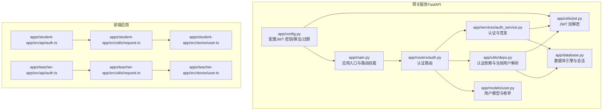
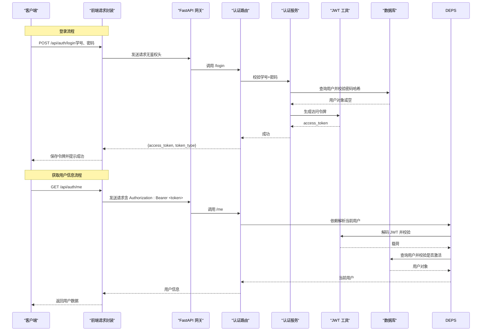
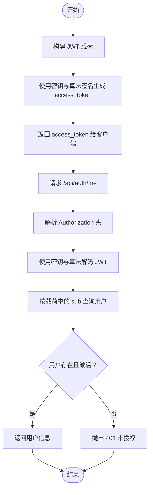
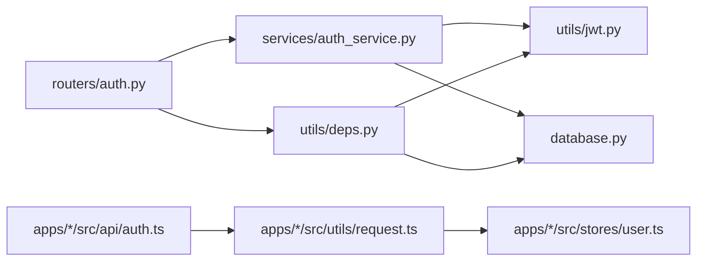

# 认证接口

<cite>
**本文引用的文件**
- [services/gateway/app/routers/auth.py](file://services/gateway/app/routers/auth.py)
- [services/gateway/app/schemas/auth.py](file://services/gateway/app/schemas/auth.py)
- [services/gateway/app/services/auth_service.py](file://services/gateway/app/services/auth_service.py)
- [services/gateway/app/utils/jwt.py](file://services/gateway/app/utils/jwt.py)
- [services/gateway/app/utils/deps.py](file://services/gateway/app/utils/deps.py)
- [services/gateway/app/models/user.py](file://services/gateway/app/models/user.py)
- [services/gateway/app/config.py](file://services/gateway/app/config.py)
- [services/gateway/app/main.py](file://services/gateway/app/main.py)
- [services/gateway/app/database.py](file://services/gateway/app/database.py)
- [apps/student-app/src/api/auth.ts](file://apps/student-app/src/api/auth.ts)
- [apps/teacher-app/src/api/auth.ts](file://apps/teacher-app/src/api/auth.ts)
- [apps/student-app/src/stores/user.ts](file://apps/student-app/src/stores/user.ts)
- [apps/teacher-app/src/stores/user.ts](file://apps/teacher-app/src/stores/user.ts)
- [apps/student-app/src/utils/request.ts](file://apps/student-app/src/utils/request.ts)
- [apps/teacher-app/src/utils/request.ts](file://apps/teacher-app/src/utils/request.ts)
</cite>

## 目录
1. [简介](#简介)
2. [项目结构](#项目结构)
3. [核心组件](#核心组件)
4. [架构总览](#架构总览)
5. [详细组件分析](#详细组件分析)
6. [依赖关系分析](#依赖关系分析)
7. [性能与安全考虑](#性能与安全考虑)
8. [故障排查指南](#故障排查指南)
9. [结论](#结论)
10. [附录：接口规范与示例](#附录接口规范与示例)

## 简介
本文件为“医小管 v2”认证接口的权威文档，覆盖以下内容：
- /api/auth/login 登录接口：HTTP POST、请求参数（学号、密码）、响应格式（访问令牌）、状态码与错误处理
- /api/auth/me 用户信息接口：HTTP GET、认证要求、响应数据结构
- JWT 令牌生成与验证流程、认证中间件与依赖注入机制
- 前端调用示例、鉴权头设置、401 未授权处理策略
- 安全最佳实践与常见问题排查

## 项目结构
后端采用 FastAPI，路由位于 app/routers/auth.py；认证服务与 JWT 工具位于 app/services 与 app/utils；用户模型与数据库会话在 app/models 与 app/database 中定义；配置在 app/config.py。前端学生端与教师端分别在 apps/student-app 与 apps/teacher-app 下，提供统一的请求封装与用户状态管理。

图表来源
- [services/gateway/app/main.py:1-78](file://services/gateway/app/main.py#L1-L78)
- [services/gateway/app/routers/auth.py:1-35](file://services/gateway/app/routers/auth.py#L1-L35)
- [services/gateway/app/services/auth_service.py:1-35](file://services/gateway/app/services/auth_service.py#L1-L35)
- [services/gateway/app/utils/jwt.py:1-17](file://services/gateway/app/utils/jwt.py#L1-L17)
- [services/gateway/app/utils/deps.py:1-40](file://services/gateway/app/utils/deps.py#L1-L40)
- [services/gateway/app/config.py:1-31](file://services/gateway/app/config.py#L1-L31)
- [services/gateway/app/database.py:1-15](file://services/gateway/app/database.py#L1-L15)
- [services/gateway/app/models/user.py:1-76](file://services/gateway/app/models/user.py#L1-L76)
- [apps/student-app/src/api/auth.ts:1-20](file://apps/student-app/src/api/auth.ts#L1-L20)
- [apps/teacher-app/src/api/auth.ts:1-43](file://apps/teacher-app/src/api/auth.ts#L1-L43)
- [apps/student-app/src/utils/request.ts:1-44](file://apps/student-app/src/utils/request.ts#L1-L44)
- [apps/teacher-app/src/utils/request.ts:1-108](file://apps/teacher-app/src/utils/request.ts#L1-L108)
- [apps/student-app/src/stores/user.ts:1-56](file://apps/student-app/src/stores/user.ts#L1-L56)
- [apps/teacher-app/src/stores/user.ts:1-63](file://apps/teacher-app/src/stores/user.ts#L1-L63)

章节来源
- [services/gateway/app/main.py:1-78](file://services/gateway/app/main.py#L1-L78)
- [services/gateway/app/routers/auth.py:1-35](file://services/gateway/app/routers/auth.py#L1-L35)

## 核心组件
- 认证路由与控制器：提供 /api/auth/login（POST）与 /api/auth/me（GET）
- 认证服务：校验学号+密码、生成 JWT
- JWT 工具：编码/解码、签名算法与过期时间
- 认证依赖：从 Authorization 头解析 JWT，解析出用户并校验有效性
- 用户模型：角色枚举、激活状态等
- 前端请求封装：自动注入 Authorization 头、401 自动登出

章节来源
- [services/gateway/app/routers/auth.py:12-35](file://services/gateway/app/routers/auth.py#L12-L35)
- [services/gateway/app/services/auth_service.py:8-35](file://services/gateway/app/services/auth_service.py#L8-L35)
- [services/gateway/app/utils/jwt.py:6-17](file://services/gateway/app/utils/jwt.py#L6-L17)
- [services/gateway/app/utils/deps.py:14-35](file://services/gateway/app/utils/deps.py#L14-L35)
- [services/gateway/app/models/user.py:45-58](file://services/gateway/app/models/user.py#L45-L58)
- [apps/student-app/src/utils/request.ts:17-29](file://apps/student-app/src/utils/request.ts#L17-L29)
- [apps/teacher-app/src/utils/request.ts:67-73](file://apps/teacher-app/src/utils/request.ts#L67-L73)

## 架构总览
下图展示了认证接口从请求到响应的关键交互路径，包括登录签发令牌与获取用户信息时的鉴权流程。

图表来源
- [services/gateway/app/routers/auth.py:12-35](file://services/gateway/app/routers/auth.py#L12-L35)
- [services/gateway/app/services/auth_service.py:8-35](file://services/gateway/app/services/auth_service.py#L8-L35)
- [services/gateway/app/utils/jwt.py:6-17](file://services/gateway/app/utils/jwt.py#L6-L17)
- [services/gateway/app/utils/deps.py:14-35](file://services/gateway/app/utils/deps.py#L14-L35)
- [services/gateway/app/database.py:12-15](file://services/gateway/app/database.py#L12-L15)

## 详细组件分析

### 登录接口 /api/auth/login
- 方法与路径：POST /api/auth/login
- 请求体：JSON 对象，字段如下
  - staff_id（学号/工号）：字符串
  - password（密码）：字符串
- 成功响应：JSON 对象，字段如下
  - access_token：字符串（JWT）
  - token_type：字符串，默认为 "bearer"
- 状态码
  - 200 成功
  - 401 未授权：学号或密码错误
- 错误处理
  - 认证失败时抛出 401，前端收到 401 后自动清除本地令牌并跳转登录页

章节来源
- [services/gateway/app/routers/auth.py:12-21](file://services/gateway/app/routers/auth.py#L12-L21)
- [services/gateway/app/schemas/auth.py:4-12](file://services/gateway/app/schemas/auth.py#L4-L12)
- [services/gateway/app/services/auth_service.py:8-17](file://services/gateway/app/services/auth_service.py#L8-L17)
- [apps/student-app/src/api/auth.ts:9-15](file://apps/student-app/src/api/auth.ts#L9-L15)
- [apps/teacher-app/src/api/auth.ts:30-35](file://apps/teacher-app/src/api/auth.ts#L30-L35)

### 用户信息接口 /api/auth/me
- 方法与路径：GET /api/auth/me
- 认证要求：请求头必须包含 Authorization: Bearer <access_token>
- 成功响应：JSON 对象，字段如下
  - id：整数
  - staff_id：字符串
  - name：字符串
  - role：字符串，取值范围："student" | "teacher" | "admin"
  - college_id：整数或 null
  - class_id：整数或 null
  - avatar_url：字符串或 null
- 状态码
  - 200 成功
  - 401 未授权：无效或过期的令牌、用户不存在或未激活

章节来源
- [services/gateway/app/routers/auth.py:24-34](file://services/gateway/app/routers/auth.py#L24-L34)
- [services/gateway/app/schemas/auth.py:14-23](file://services/gateway/app/schemas/auth.py#L14-L23)
- [services/gateway/app/utils/deps.py:14-35](file://services/gateway/app/utils/deps.py#L14-L35)
- [services/gateway/app/models/user.py:45-58](file://services/gateway/app/models/user.py#L45-L58)
- [apps/student-app/src/api/auth.ts:17-19](file://apps/student-app/src/api/auth.ts#L17-L19)
- [apps/teacher-app/src/api/auth.ts:40-42](file://apps/teacher-app/src/api/auth.ts#L40-L42)

### JWT 令牌生成与验证流程
- 生成
  - 认证服务根据用户构建载荷（包含 sub、staff_id、role、college_id、class_id、name），调用 JWT 工具生成 access_token
  - 过期时间由配置项控制（小时）
- 验证
  - 依赖注入从 Authorization 头中提取 Bearer 令牌
  - 使用相同密钥与算法对令牌进行解码，解析出用户标识
  - 再次查询数据库确认用户存在且处于激活状态

图表来源
- [services/gateway/app/services/auth_service.py:20-35](file://services/gateway/app/services/auth_service.py#L20-L35)
- [services/gateway/app/utils/jwt.py:6-17](file://services/gateway/app/utils/jwt.py#L6-L17)
- [services/gateway/app/utils/deps.py:14-35](file://services/gateway/app/utils/deps.py#L14-L35)
- [services/gateway/app/config.py:10-13](file://services/gateway/app/config.py#L10-L13)

章节来源
- [services/gateway/app/services/auth_service.py:20-35](file://services/gateway/app/services/auth_service.py#L20-L35)
- [services/gateway/app/utils/jwt.py:6-17](file://services/gateway/app/utils/jwt.py#L6-L17)
- [services/gateway/app/utils/deps.py:14-35](file://services/gateway/app/utils/deps.py#L14-L35)
- [services/gateway/app/config.py:10-13](file://services/gateway/app/config.py#L10-L13)

### 认证中间件与依赖注入
- HTTP Bearer 认证：通过 HTTPBearer 提取 Authorization 凭据
- get_current_user：解码 JWT、查询用户、校验激活状态，失败返回 401
- get_db：提供异步数据库会话
- 前端自动注入 Authorization 头：若本地存在令牌则在每次请求头中附加 Bearer <token>

章节来源
- [services/gateway/app/utils/deps.py:11-35](file://services/gateway/app/utils/deps.py#L11-L35)
- [services/gateway/app/database.py:12-15](file://services/gateway/app/database.py#L12-L15)
- [apps/student-app/src/utils/request.ts:17-21](file://apps/student-app/src/utils/request.ts#L17-L21)
- [apps/teacher-app/src/utils/request.ts:67-73](file://apps/teacher-app/src/utils/request.ts#L67-L73)

## 依赖关系分析
- 路由依赖服务层：/login 与 /me 分别依赖认证服务与依赖注入
- 服务层依赖 JWT 工具与数据库：签发令牌与校验密码哈希
- 依赖注入依赖 JWT 工具与数据库：解析令牌与查询用户
- 前端依赖用户状态与请求封装：自动携带令牌与处理 401

图表来源
- [services/gateway/app/routers/auth.py:1-7](file://services/gateway/app/routers/auth.py#L1-L7)
- [services/gateway/app/services/auth_service.py:1-6](file://services/gateway/app/services/auth_service.py#L1-L6)
- [services/gateway/app/utils/deps.py:1-9](file://services/gateway/app/utils/deps.py#L1-L9)
- [services/gateway/app/utils/jwt.py:1-3](file://services/gateway/app/utils/jwt.py#L1-L3)
- [services/gateway/app/database.py:1-7](file://services/gateway/app/database.py#L1-L7)
- [apps/student-app/src/api/auth.ts:1-7](file://apps/student-app/src/api/auth.ts#L1-L7)
- [apps/teacher-app/src/api/auth.ts:1-6](file://apps/teacher-app/src/api/auth.ts#L1-L6)
- [apps/student-app/src/utils/request.ts:1-1](file://apps/student-app/src/utils/request.ts#L1-L1)
- [apps/teacher-app/src/utils/request.ts:1](file://apps/teacher-app/src/utils/request.ts#L1-L1)
- [apps/student-app/src/stores/user.ts:15-16](file://apps/student-app/src/stores/user.ts#L15-L16)
- [apps/teacher-app/src/stores/user.ts:5-6](file://apps/teacher-app/src/stores/user.ts#L5-L6)

章节来源
- [services/gateway/app/routers/auth.py:1-7](file://services/gateway/app/routers/auth.py#L1-L7)
- [services/gateway/app/services/auth_service.py:1-6](file://services/gateway/app/services/auth_service.py#L1-L6)
- [services/gateway/app/utils/deps.py:1-9](file://services/gateway/app/utils/deps.py#L1-L9)
- [apps/student-app/src/api/auth.ts:1-7](file://apps/student-app/src/api/auth.ts#L1-L7)
- [apps/teacher-app/src/api/auth.ts:1-6](file://apps/teacher-app/src/api/auth.ts#L1-L6)

## 性能与安全考虑
- 性能
  - 异步数据库会话与连接池：数据库连接池大小默认 10，可按需调整
  - JWT 解码为纯内存操作，开销极低
- 安全
  - 生产环境务必修改 JWT 密钥与算法配置
  - 控制令牌过期时间，建议结合刷新令牌策略
  - 前端仅在内存与安全存储中保存令牌，避免明文日志
  - 严格校验用户激活状态，防止被禁用账户继续使用
  - 建议启用 HTTPS 与安全的 Cookie 属性（如 SameSite、HttpOnly）

[本节为通用指导，不直接分析具体文件]

## 故障排查指南
- 401 未授权
  - 可能原因：令牌无效、过期、用户不存在或未激活
  - 前端行为：收到 401 自动清除本地令牌并跳转登录页
- 密码错误
  - 后端返回 401，并提示“学号或密码错误”
- 参数错误
  - FastAPI 422 参数校验失败时，前端会弹出相应提示
- 网络异常
  - 前端捕获网络错误并提示“网络连接失败”

章节来源
- [services/gateway/app/utils/deps.py:18-35](file://services/gateway/app/utils/deps.py#L18-L35)
- [services/gateway/app/routers/auth.py:15-20](file://services/gateway/app/routers/auth.py#L15-L20)
- [apps/student-app/src/utils/request.ts:25-36](file://apps/student-app/src/utils/request.ts#L25-L36)
- [apps/teacher-app/src/utils/request.ts:42-56](file://apps/teacher-app/src/utils/request.ts#L42-L56)

## 结论
本文档系统性地梳理了“医小管 v2”的认证接口设计与实现，明确了登录与用户信息接口的请求/响应规范、JWT 流程、认证中间件与前端集成方式，并提供了错误处理与安全最佳实践。建议在生产环境中完善密钥管理、令牌过期策略与前端安全存储。

[本节为总结性内容，不直接分析具体文件]

## 附录：接口规范与示例

### 登录接口 /api/auth/login
- 方法：POST
- 路径：/api/auth/login
- 请求体
  - staff_id：字符串（学号/工号）
  - password：字符串（密码）
- 成功响应
  - access_token：字符串（JWT）
  - token_type：字符串，默认 "bearer"
- 状态码
  - 200：成功
  - 401：学号或密码错误

章节来源
- [services/gateway/app/routers/auth.py:12-21](file://services/gateway/app/routers/auth.py#L12-L21)
- [services/gateway/app/schemas/auth.py:4-12](file://services/gateway/app/schemas/auth.py#L4-L12)

### 用户信息接口 /api/auth/me
- 方法：GET
- 路径：/api/auth/me
- 请求头
  - Authorization: Bearer <access_token>
- 成功响应
  - id：整数
  - staff_id：字符串
  - name：字符串
  - role：字符串，取值 "student" | "teacher" | "admin"
  - college_id：整数或 null
  - class_id：整数或 null
  - avatar_url：字符串或 null
- 状态码
  - 200：成功
  - 401：无效或过期的令牌、用户不存在或未激活

章节来源
- [services/gateway/app/routers/auth.py:24-34](file://services/gateway/app/routers/auth.py#L24-L34)
- [services/gateway/app/schemas/auth.py:14-23](file://services/gateway/app/schemas/auth.py#L14-L23)
- [services/gateway/app/utils/deps.py:14-35](file://services/gateway/app/utils/deps.py#L14-L35)

### 前端调用示例
- 学生端
  - 登录：调用登录接口，保存 access_token
  - 获取用户信息：调用 /api/auth/me，自动附加 Authorization 头
- 教师端
  - 登录：调用登录接口，保存 access_token
  - 获取用户信息：调用 /api/auth/me，自动附加 Authorization 头

章节来源
- [apps/student-app/src/api/auth.ts:9-19](file://apps/student-app/src/api/auth.ts#L9-L19)
- [apps/teacher-app/src/api/auth.ts:30-42](file://apps/teacher-app/src/api/auth.ts#L30-L42)
- [apps/student-app/src/utils/request.ts:17-21](file://apps/student-app/src/utils/request.ts#L17-L21)
- [apps/teacher-app/src/utils/request.ts:67-73](file://apps/teacher-app/src/utils/request.ts#L67-L73)

### 认证中间件使用说明
- 在路由处理器中通过依赖注入获取当前用户
  - /api/auth/me 使用 get_current_user 依赖，自动解析 Authorization 头并校验用户
- 前端在每次请求时自动附加 Authorization: Bearer <token>，简化集成

章节来源
- [services/gateway/app/utils/deps.py:14-35](file://services/gateway/app/utils/deps.py#L14-L35)
- [apps/student-app/src/utils/request.ts:17-21](file://apps/student-app/src/utils/request.ts#L17-L21)
- [apps/teacher-app/src/utils/request.ts:67-73](file://apps/teacher-app/src/utils/request.ts#L67-L73)