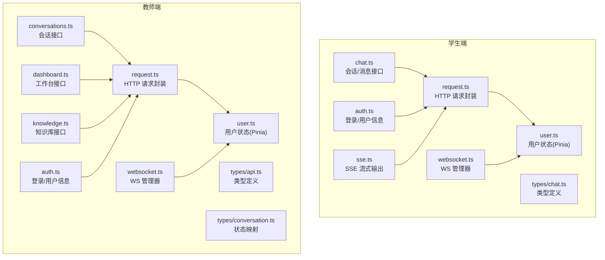
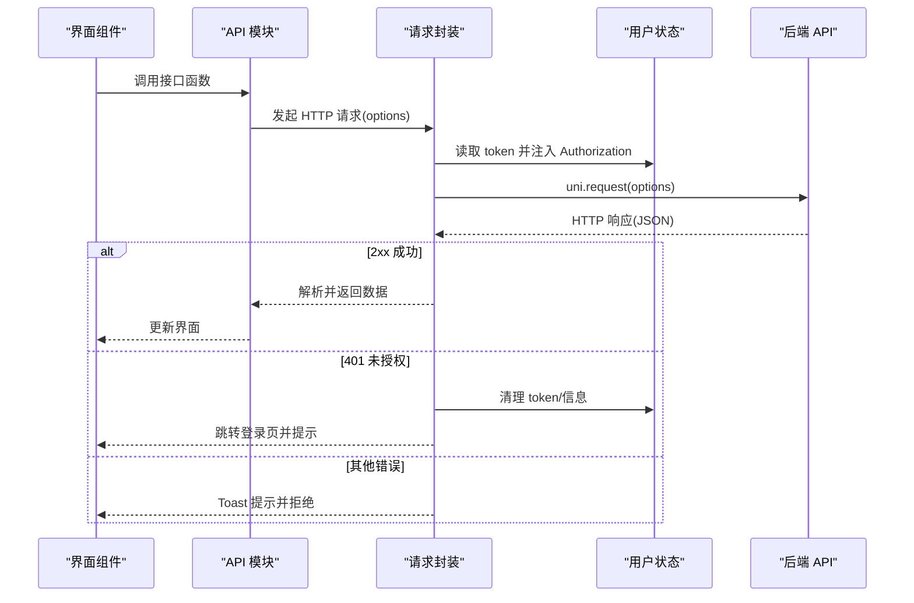
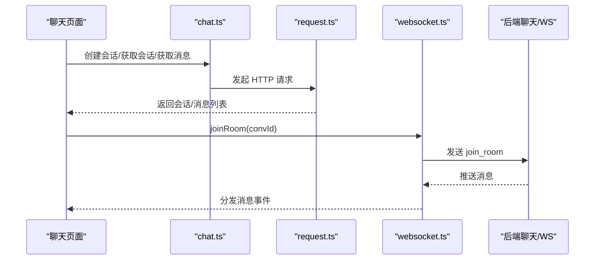
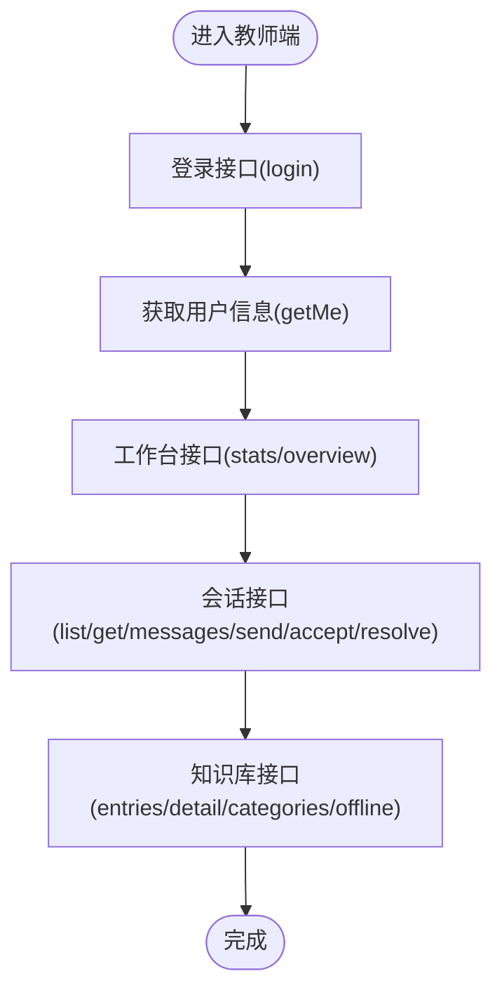
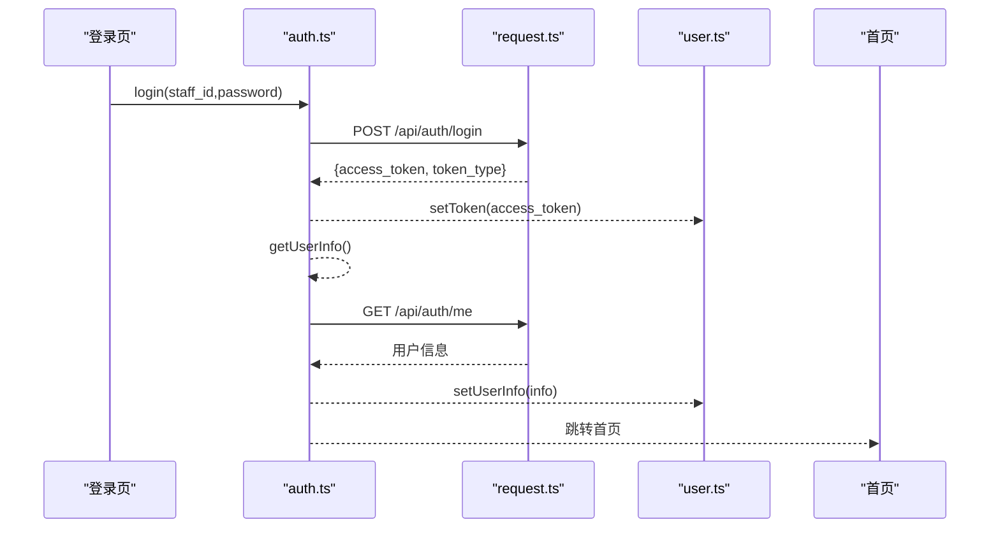
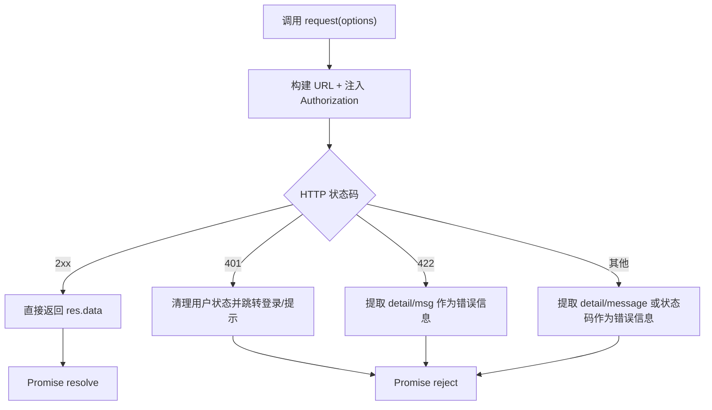
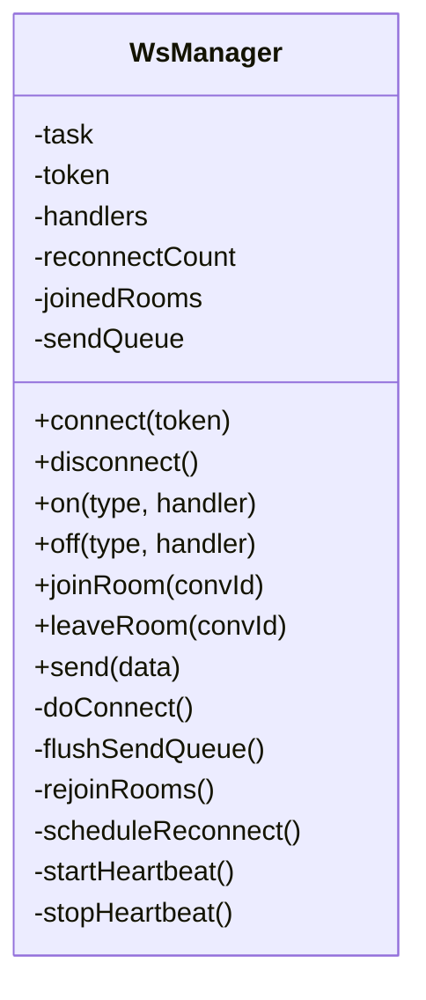
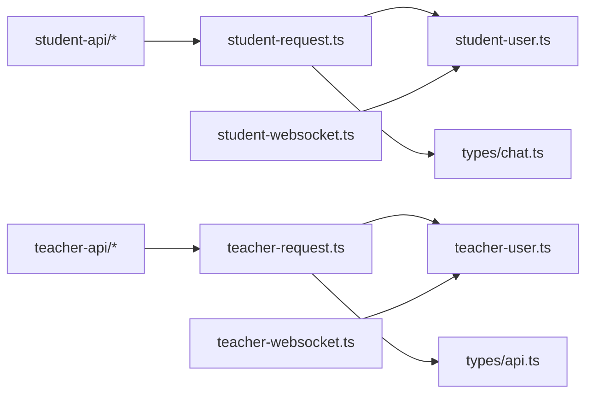

# API 集成

<cite>
**本文引用的文件**
- [apps/student-app/src/api/chat.ts](file://apps/student-app/src/api/chat.ts)
- [apps/student-app/src/api/auth.ts](file://apps/student-app/src/api/auth.ts)
- [apps/student-app/src/utils/request.ts](file://apps/student-app/src/utils/request.ts)
- [apps/student-app/src/utils/sse.ts](file://apps/student-app/src/utils/sse.ts)
- [apps/student-app/src/utils/websocket.ts](file://apps/student-app/src/utils/websocket.ts)
- [apps/student-app/src/stores/user.ts](file://apps/student-app/src/stores/user.ts)
- [apps/student-app/src/types/chat.ts](file://apps/student-app/src/types/chat.ts)
- [apps/teacher-app/src/api/conversations.ts](file://apps/teacher-app/src/api/conversations.ts)
- [apps/teacher-app/src/api/dashboard.ts](file://apps/teacher-app/src/api/dashboard.ts)
- [apps/teacher-app/src/api/knowledge.ts](file://apps/teacher-app/src/api/knowledge.ts)
- [apps/teacher-app/src/api/auth.ts](file://apps/teacher-app/src/api/auth.ts)
- [apps/teacher-app/src/utils/request.ts](file://apps/teacher-app/src/utils/request.ts)
- [apps/teacher-app/src/utils/websocket.ts](file://apps/teacher-app/src/utils/websocket.ts)
- [apps/teacher-app/src/stores/user.ts](file://apps/teacher-app/src/stores/user.ts)
- [apps/teacher-app/src/types/api.ts](file://apps/teacher-app/src/types/api.ts)
- [apps/teacher-app/src/types/conversation.ts](file://apps/teacher-app/src/types/conversation.ts)
</cite>

## 目录
1. [简介](#简介)
2. [项目结构](#项目结构)
3. [核心组件](#核心组件)
4. [架构总览](#架构总览)
5. [详细组件分析](#详细组件分析)
6. [依赖关系分析](#依赖关系分析)
7. [性能考虑](#性能考虑)
8. [故障排查指南](#故障排查指南)
9. [结论](#结论)
10. [附录](#附录)

## 简介
本文件面向“医小管 v2”前后端交互的前端侧 API 集成，系统性梳理学生端与教师端的接口调用方式、认证流程、消息通信（SSE/WebSocket）、状态管理与错误处理机制，并给出调试与测试策略、跨域与安全最佳实践建议。读者无需深入后端即可理解前端如何与后端 API 对接。

## 项目结构
前端采用多应用分层组织：
- 学生端应用：负责聊天对话、历史记录、登录与用户信息获取；通过统一请求工具发起 HTTP 请求，并通过 WebSocket 实时接收消息流。
- 教师端应用：负责会话管理、工作台统计、知识库管理；同样通过统一请求工具访问 REST API，并通过 WebSocket 处理会话消息。

图表来源
- [apps/student-app/src/api/chat.ts:1-36](file://apps/student-app/src/api/chat.ts#L1-L36)
- [apps/student-app/src/api/auth.ts:1-20](file://apps/student-app/src/api/auth.ts#L1-L20)
- [apps/student-app/src/utils/request.ts:1-44](file://apps/student-app/src/utils/request.ts#L1-L44)
- [apps/student-app/src/utils/sse.ts:1-69](file://apps/student-app/src/utils/sse.ts#L1-L69)
- [apps/student-app/src/utils/websocket.ts:1-153](file://apps/student-app/src/utils/websocket.ts#L1-L153)
- [apps/student-app/src/stores/user.ts:1-56](file://apps/student-app/src/stores/user.ts#L1-L56)
- [apps/student-app/src/types/chat.ts:1-45](file://apps/student-app/src/types/chat.ts#L1-L45)
- [apps/teacher-app/src/api/conversations.ts:1-44](file://apps/teacher-app/src/api/conversations.ts#L1-L44)
- [apps/teacher-app/src/api/dashboard.ts:1-18](file://apps/teacher-app/src/api/dashboard.ts#L1-L18)
- [apps/teacher-app/src/api/knowledge.ts:1-45](file://apps/teacher-app/src/api/knowledge.ts#L1-L45)
- [apps/teacher-app/src/api/auth.ts:1-43](file://apps/teacher-app/src/api/auth.ts#L1-L43)
- [apps/teacher-app/src/utils/request.ts:1-108](file://apps/teacher-app/src/utils/request.ts#L1-L108)
- [apps/teacher-app/src/utils/websocket.ts:1-169](file://apps/teacher-app/src/utils/websocket.ts#L1-L169)
- [apps/teacher-app/src/stores/user.ts:1-63](file://apps/teacher-app/src/stores/user.ts#L1-L63)
- [apps/teacher-app/src/types/api.ts:1-51](file://apps/teacher-app/src/types/api.ts#L1-L51)
- [apps/teacher-app/src/types/conversation.ts:1-18](file://apps/teacher-app/src/types/conversation.ts#L1-L18)

章节来源
- [apps/student-app/src/api/chat.ts:1-36](file://apps/student-app/src/api/chat.ts#L1-L36)
- [apps/student-app/src/api/auth.ts:1-20](file://apps/student-app/src/api/auth.ts#L1-L20)
- [apps/student-app/src/utils/request.ts:1-44](file://apps/student-app/src/utils/request.ts#L1-L44)
- [apps/student-app/src/utils/sse.ts:1-69](file://apps/student-app/src/utils/sse.ts#L1-L69)
- [apps/student-app/src/utils/websocket.ts:1-153](file://apps/student-app/src/utils/websocket.ts#L1-L153)
- [apps/student-app/src/stores/user.ts:1-56](file://apps/student-app/src/stores/user.ts#L1-L56)
- [apps/student-app/src/types/chat.ts:1-45](file://apps/student-app/src/types/chat.ts#L1-L45)
- [apps/teacher-app/src/api/conversations.ts:1-44](file://apps/teacher-app/src/api/conversations.ts#L1-L44)
- [apps/teacher-app/src/api/dashboard.ts:1-18](file://apps/teacher-app/src/api/dashboard.ts#L1-L18)
- [apps/teacher-app/src/api/knowledge.ts:1-45](file://apps/teacher-app/src/api/knowledge.ts#L1-L45)
- [apps/teacher-app/src/api/auth.ts:1-43](file://apps/teacher-app/src/api/auth.ts#L1-L43)
- [apps/teacher-app/src/utils/request.ts:1-108](file://apps/teacher-app/src/utils/request.ts#L1-L108)
- [apps/teacher-app/src/utils/websocket.ts:1-169](file://apps/teacher-app/src/utils/websocket.ts#L1-L169)
- [apps/teacher-app/src/stores/user.ts:1-63](file://apps/teacher-app/src/stores/user.ts#L1-L63)
- [apps/teacher-app/src/types/api.ts:1-51](file://apps/teacher-app/src/types/api.ts#L1-L51)
- [apps/teacher-app/src/types/conversation.ts:1-18](file://apps/teacher-app/src/types/conversation.ts#L1-L18)

## 核心组件
- 统一请求封装：学生端与教师端分别提供 request 工具，负责拼接 URL、注入鉴权头、超时控制、错误处理与 Toast 提示。
- 认证与用户状态：Pinia Store 管理 token 与用户信息，支持初始化、设置、清理与登出。
- 实时通信：WebSocket 管理器统一处理连接、心跳、断线重连、房间加入/离开、消息派发。
- 类型系统：为 API 响应与状态枚举提供强类型定义，确保调用方与后端契约一致。
- 学生端特有：SSE 工具用于流式接收 AI 输出片段与结束事件。

章节来源
- [apps/student-app/src/utils/request.ts:1-44](file://apps/student-app/src/utils/request.ts#L1-L44)
- [apps/teacher-app/src/utils/request.ts:1-108](file://apps/teacher-app/src/utils/request.ts#L1-L108)
- [apps/student-app/src/stores/user.ts:1-56](file://apps/student-app/src/stores/user.ts#L1-L56)
- [apps/teacher-app/src/stores/user.ts:1-63](file://apps/teacher-app/src/stores/user.ts#L1-L63)
- [apps/student-app/src/utils/websocket.ts:1-153](file://apps/student-app/src/utils/websocket.ts#L1-L153)
- [apps/teacher-app/src/utils/websocket.ts:1-169](file://apps/teacher-app/src/utils/websocket.ts#L1-L169)
- [apps/student-app/src/utils/sse.ts:1-69](file://apps/student-app/src/utils/sse.ts#L1-L69)
- [apps/student-app/src/types/chat.ts:1-45](file://apps/student-app/src/types/chat.ts#L1-L45)
- [apps/teacher-app/src/types/api.ts:1-51](file://apps/teacher-app/src/types/api.ts#L1-L51)
- [apps/teacher-app/src/types/conversation.ts:1-18](file://apps/teacher-app/src/types/conversation.ts#L1-L18)

## 架构总览
前端通过“API 层 → 请求封装 → 状态管理”的分层设计对接后端：
- API 层：按功能拆分模块（聊天、认证、会话、工作台、知识库），每个模块导出函数，内部调用请求封装。
- 请求封装：注入 Authorization 头、处理 401/422/其他 HTTP 错误码、统一超时与 Toast 提示。
- 状态管理：持久化 token 与用户信息，触发登出与页面跳转。
- 实时通信：WebSocket 连接后自动重连、心跳保活、房间重入、消息分发。

图表来源
- [apps/teacher-app/src/utils/request.ts:10-77](file://apps/teacher-app/src/utils/request.ts#L10-L77)
- [apps/student-app/src/utils/request.ts:5-43](file://apps/student-app/src/utils/request.ts#L5-L43)
- [apps/teacher-app/src/stores/user.ts:40-49](file://apps/teacher-app/src/stores/user.ts#L40-L49)
- [apps/student-app/src/stores/user.ts:46-52](file://apps/student-app/src/stores/user.ts#L46-L52)

## 详细组件分析

### 学生端：聊天 API 与实时通信
- 会话与消息
  - 创建会话、分页列出会话、获取会话详情、分页获取消息、转人工。
  - 使用统一请求封装，自动注入 Bearer Token。
- 实时通信
  - SSE：用于接收 AI 流式输出片段与结束事件，回调处理 token 片段、全文内容与来源。
  - WebSocket：连接后自动心跳、断线重连、房间加入/离开、消息分发。
- 类型定义
  - 消息与会话结构体，会话状态枚举，便于前端渲染与逻辑判断。

图表来源
- [apps/student-app/src/api/chat.ts:9-35](file://apps/student-app/src/api/chat.ts#L9-L35)
- [apps/student-app/src/utils/request.ts:1-44](file://apps/student-app/src/utils/request.ts#L1-L44)
- [apps/student-app/src/utils/websocket.ts:26-104](file://apps/student-app/src/utils/websocket.ts#L26-L104)
- [apps/student-app/src/types/chat.ts:7-27](file://apps/student-app/src/types/chat.ts#L7-L27)

章节来源
- [apps/student-app/src/api/chat.ts:1-36](file://apps/student-app/src/api/chat.ts#L1-L36)
- [apps/student-app/src/utils/sse.ts:13-68](file://apps/student-app/src/utils/sse.ts#L13-L68)
- [apps/student-app/src/utils/websocket.ts:1-153](file://apps/student-app/src/utils/websocket.ts#L1-L153)
- [apps/student-app/src/stores/user.ts:1-56](file://apps/student-app/src/stores/user.ts#L1-L56)
- [apps/student-app/src/types/chat.ts:1-45](file://apps/student-app/src/types/chat.ts#L1-L45)

### 教师端：会话管理、工作台与知识库
- 会话管理
  - 列表、详情、消息列表、教师发送消息、接单、解决。
- 工作台
  - 统计数据与聚合数据接口。
- 知识库
  - 条目分页查询、详情、分类、下线。
- 认证
  - 登录返回 access_token 与用户信息，获取当前用户信息。

图表来源
- [apps/teacher-app/src/api/auth.ts:30-42](file://apps/teacher-app/src/api/auth.ts#L30-L42)
- [apps/teacher-app/src/api/dashboard.ts:4-17](file://apps/teacher-app/src/api/dashboard.ts#L4-L17)
- [apps/teacher-app/src/api/conversations.ts:8-43](file://apps/teacher-app/src/api/conversations.ts#L8-L43)
- [apps/teacher-app/src/api/knowledge.ts:4-44](file://apps/teacher-app/src/api/knowledge.ts#L4-L44)

章节来源
- [apps/teacher-app/src/api/conversations.ts:1-44](file://apps/teacher-app/src/api/conversations.ts#L1-L44)
- [apps/teacher-app/src/api/dashboard.ts:1-18](file://apps/teacher-app/src/api/dashboard.ts#L1-L18)
- [apps/teacher-app/src/api/knowledge.ts:1-45](file://apps/teacher-app/src/api/knowledge.ts#L1-L45)
- [apps/teacher-app/src/api/auth.ts:1-43](file://apps/teacher-app/src/api/auth.ts#L1-L43)

### 认证与令牌管理
- 学生端
  - 登录返回 access_token 与 token_type；获取当前用户信息；401 时自动清理并跳转登录。
- 教师端
  - 登录返回 access_token 与 token_type；获取当前用户信息；401 时提示并跳转登录。
- 用户状态
  - 初始化从本地存储读取 token 与用户信息；登出清理本地存储并断开 WebSocket。

图表来源
- [apps/student-app/src/api/auth.ts:9-19](file://apps/student-app/src/api/auth.ts#L9-L19)
- [apps/teacher-app/src/api/auth.ts:30-42](file://apps/teacher-app/src/api/auth.ts#L30-L42)
- [apps/student-app/src/utils/request.ts:25-28](file://apps/student-app/src/utils/request.ts#L25-L28)
- [apps/teacher-app/src/utils/request.ts:43-48](file://apps/teacher-app/src/utils/request.ts#L43-L48)
- [apps/student-app/src/stores/user.ts:24-34](file://apps/student-app/src/stores/user.ts#L24-L34)
- [apps/teacher-app/src/stores/user.ts:19-28](file://apps/teacher-app/src/stores/user.ts#L19-L28)

章节来源
- [apps/student-app/src/api/auth.ts:1-20](file://apps/student-app/src/api/auth.ts#L1-L20)
- [apps/teacher-app/src/api/auth.ts:1-43](file://apps/teacher-app/src/api/auth.ts#L1-L43)
- [apps/student-app/src/utils/request.ts:1-44](file://apps/student-app/src/utils/request.ts#L1-L44)
- [apps/teacher-app/src/utils/request.ts:1-108](file://apps/teacher-app/src/utils/request.ts#L1-L108)
- [apps/student-app/src/stores/user.ts:1-56](file://apps/student-app/src/stores/user.ts#L1-L56)
- [apps/teacher-app/src/stores/user.ts:1-63](file://apps/teacher-app/src/stores/user.ts#L1-L63)

### 请求封装与中间件式处理
- 学生端
  - 自动注入 Authorization: Bearer token；401 触发登出并跳转登录；422 参数错误提取 detail/msg；其他错误提取 detail/message 或状态码。
- 教师端
  - 支持环境变量 VITE_API_BASE_URL；自动拼接 params 到 query；注入 Authorization；401 弹 Toast 并跳转登录；其他 HTTP 错误弹 Toast 并拒绝。
- 共同点
  - 统一超时、JSON Content-Type、Promise 化、fail 回调统一处理。

图表来源
- [apps/student-app/src/utils/request.ts:10-43](file://apps/student-app/src/utils/request.ts#L10-L43)
- [apps/teacher-app/src/utils/request.ts:10-77](file://apps/teacher-app/src/utils/request.ts#L10-L77)

章节来源
- [apps/student-app/src/utils/request.ts:1-44](file://apps/student-app/src/utils/request.ts#L1-L44)
- [apps/teacher-app/src/utils/request.ts:1-108](file://apps/teacher-app/src/utils/request.ts#L1-L108)

### WebSocket 与消息分发
- 连接与心跳
  - 自动计算重连指数退避，30 秒心跳 ping；连接成功后 flush 发送队列、rejoin 房间。
- 房间管理
  - joinRoom/leaveRoom 自动发送 join_room/leave_room；断线后重连自动 rejoin。
- 消息分发
  - 统一分发 type 对应的处理器集合；支持通配符 *。

图表来源
- [apps/teacher-app/src/utils/websocket.ts:9-166](file://apps/teacher-app/src/utils/websocket.ts#L9-L166)
- [apps/student-app/src/utils/websocket.ts:3-150](file://apps/student-app/src/utils/websocket.ts#L3-L150)

章节来源
- [apps/teacher-app/src/utils/websocket.ts:1-169](file://apps/teacher-app/src/utils/websocket.ts#L1-L169)
- [apps/student-app/src/utils/websocket.ts:1-153](file://apps/student-app/src/utils/websocket.ts#L1-L153)

### 类型系统与状态映射
- 学生端
  - 消息结构、会话结构、会话状态枚举，便于渲染与状态判断。
- 教师端
  - 用户信息、会话、消息、分页结果；会话状态字符串枚举与中文标签映射。

章节来源
- [apps/student-app/src/types/chat.ts:1-45](file://apps/student-app/src/types/chat.ts#L1-L45)
- [apps/teacher-app/src/types/api.ts:1-51](file://apps/teacher-app/src/types/api.ts#L1-L51)
- [apps/teacher-app/src/types/conversation.ts:1-18](file://apps/teacher-app/src/types/conversation.ts#L1-L18)

## 依赖关系分析
- API 层依赖请求封装与类型定义。
- 请求封装依赖用户状态以注入 Authorization。
- WebSocket 管理器依赖用户状态以建立带 token 的连接。
- 教师端与学生端在“请求封装/用户状态/WebSocket”层面存在相似抽象，但具体 API 与类型不同。

图表来源
- [apps/student-app/src/api/chat.ts:1-36](file://apps/student-app/src/api/chat.ts#L1-L36)
- [apps/student-app/src/utils/request.ts:1-44](file://apps/student-app/src/utils/request.ts#L1-L44)
- [apps/student-app/src/stores/user.ts:1-56](file://apps/student-app/src/stores/user.ts#L1-L56)
- [apps/student-app/src/utils/websocket.ts:1-153](file://apps/student-app/src/utils/websocket.ts#L1-L153)
- [apps/student-app/src/types/chat.ts:1-45](file://apps/student-app/src/types/chat.ts#L1-L45)
- [apps/teacher-app/src/api/conversations.ts:1-44](file://apps/teacher-app/src/api/conversations.ts#L1-L44)
- [apps/teacher-app/src/api/dashboard.ts:1-18](file://apps/teacher-app/src/api/dashboard.ts#L1-L18)
- [apps/teacher-app/src/api/knowledge.ts:1-45](file://apps/teacher-app/src/api/knowledge.ts#L1-L45)
- [apps/teacher-app/src/utils/request.ts:1-108](file://apps/teacher-app/src/utils/request.ts#L1-L108)
- [apps/teacher-app/src/stores/user.ts:1-63](file://apps/teacher-app/src/stores/user.ts#L1-L63)
- [apps/teacher-app/src/utils/websocket.ts:1-169](file://apps/teacher-app/src/utils/websocket.ts#L1-L169)
- [apps/teacher-app/src/types/api.ts:1-51](file://apps/teacher-app/src/types/api.ts#L1-L51)

章节来源
- 同上

## 性能考虑
- 请求超时与重试
  - 教师端请求封装内置超时时间，可根据网络状况调整；WebSocket 指数退避重连避免频繁重连。
- 发送队列与房间重入
  - 连接前的消息先入队，连接后批量发送；断线后自动 rejoin 房间，减少重复订阅成本。
- 分页与缓存
  - 列表接口支持分页参数，结合前端缓存策略可降低重复请求。
- 传输格式
  - 统一 JSON Content-Type，减少不必要的编码转换。

## 故障排查指南
- 登录后立即 401
  - 检查请求封装是否正确注入 Authorization；确认 token 是否写入本地存储；查看后端 JWT 有效期与签发者。
- 网络错误或超时
  - 查看请求封装的 fail 回调与 Toast 提示；检查 VITE_API_BASE_URL 与代理配置；确认服务器可达性。
- WebSocket 断线
  - 关注重连日志与心跳；确认断线事件与 onError 回调；检查后端 WS 地址与 token 参数。
- SSE 流异常
  - 确认后端 SSE 端点与事件类型；检查 onToken/onEnd/onError 回调链路；关注 HTTP 状态与响应体。

章节来源
- [apps/student-app/src/utils/request.ts:25-40](file://apps/student-app/src/utils/request.ts#L25-L40)
- [apps/teacher-app/src/utils/request.ts:42-64](file://apps/teacher-app/src/utils/request.ts#L42-L64)
- [apps/teacher-app/src/utils/websocket.ts:148-154](file://apps/teacher-app/src/utils/websocket.ts#L148-L154)
- [apps/student-app/src/utils/sse.ts:28-31](file://apps/student-app/src/utils/sse.ts#L28-L31)

## 结论
本前端 API 集成方案通过清晰的分层与统一的中间件式处理，实现了认证、REST API、SSE 与 WebSocket 的一体化接入。学生端侧重流式 AI 输出与实时消息，教师端侧重会话与工作台能力。通过类型系统与状态管理，前端在复杂交互场景下仍保持可维护性与可扩展性。

## 附录
- 跨域与代理
  - 学生端通过 Vite 代理将 /api 转发至后端服务，避免跨域问题；教师端通过环境变量配置 API 基础地址。
- 安全策略
  - 所有受保护接口均需携带 Bearer Token；401 自动登出并跳转登录；建议后端启用 HTTPS 与 CSRF 防护。
- 测试策略
  - 单元测试：对请求封装与 WebSocket 管理器进行行为测试；集成测试：覆盖登录、会话列表、消息收发、知识库查询等主流程。
- 调试工具
  - 使用浏览器/小程序开发者工具 Network 面板观察请求与响应；在控制台打印 WS 事件与重连日志；在页面显示 Toast 辅助定位错误。