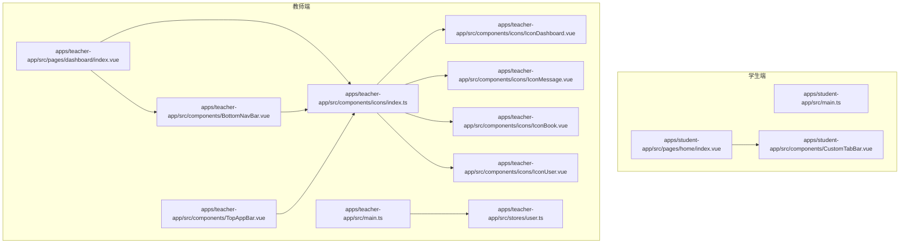
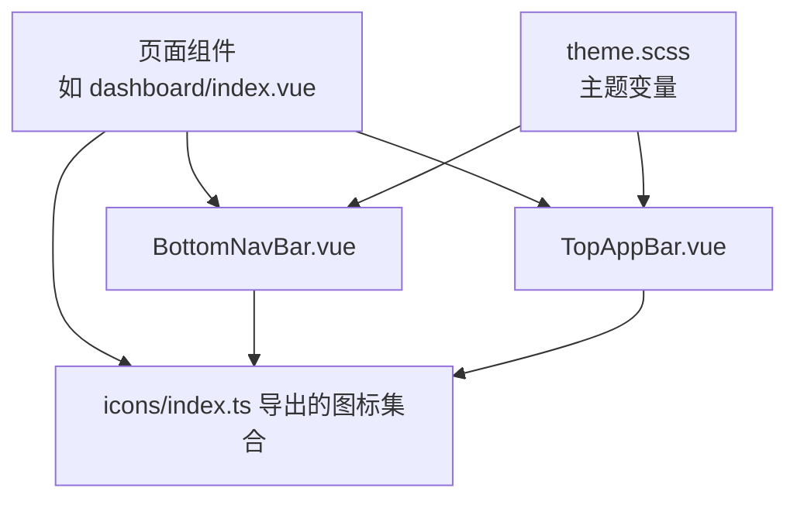
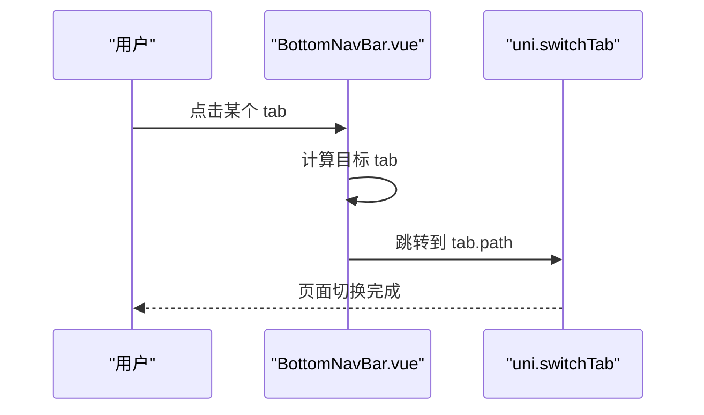
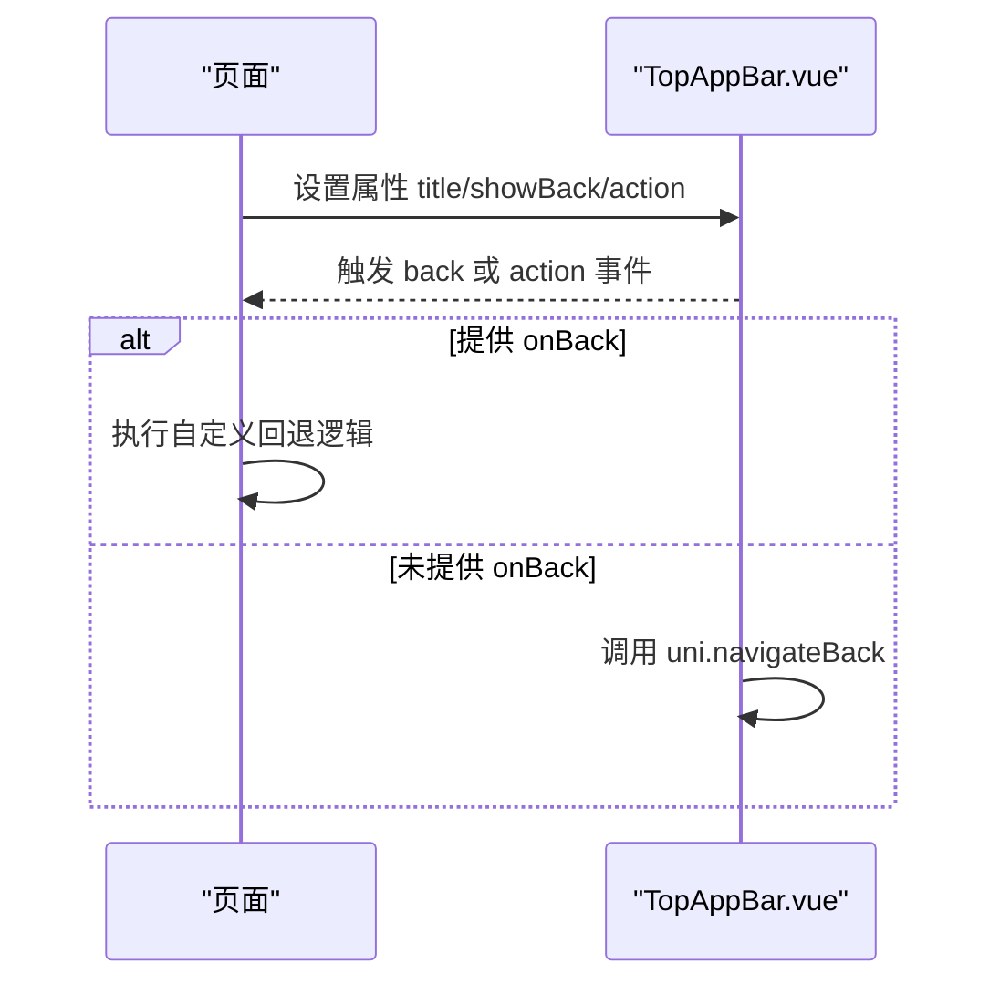
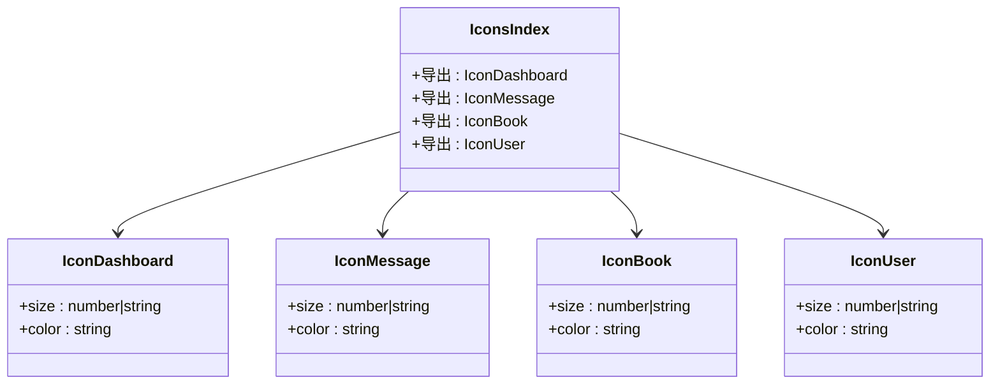
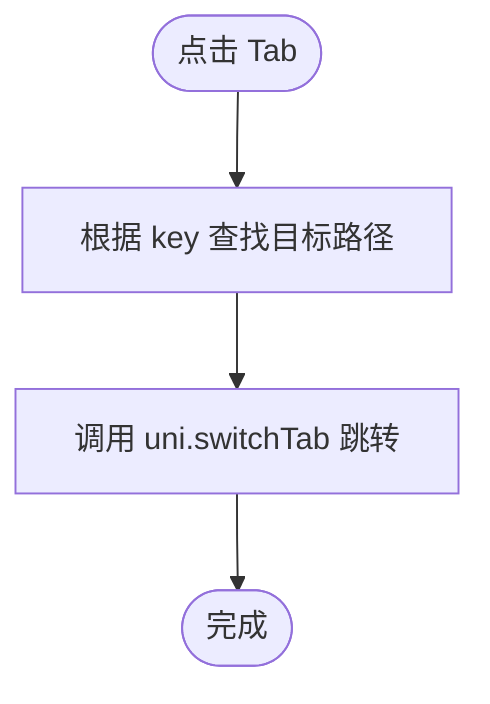
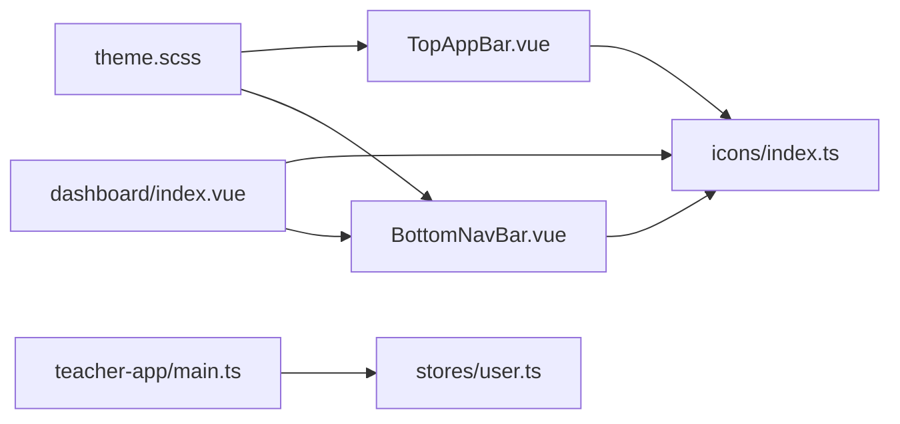

# 共享组件库

<cite>
**本文引用的文件**
- [apps/student-app/src/components/CustomTabBar.vue](file://apps/student-app/src/components/CustomTabBar.vue)
- [apps/student-app/src/pages/home/index.vue](file://apps/student-app/src/pages/home/index.vue)
- [apps/teacher-app/src/components/BottomNavBar.vue](file://apps/teacher-app/src/components/BottomNavBar.vue)
- [apps/teacher-app/src/components/TopAppBar.vue](file://apps/teacher-app/src/components/TopAppBar.vue)
- [apps/teacher-app/src/components/icons/index.ts](file://apps/teacher-app/src/components/icons/index.ts)
- [apps/teacher-app/src/components/icons/IconDashboard.vue](file://apps/teacher-app/src/components/icons/IconDashboard.vue)
- [apps/teacher-app/src/components/icons/IconMessage.vue](file://apps/teacher-app/src/components/icons/IconMessage.vue)
- [apps/teacher-app/src/components/icons/IconBook.vue](file://apps/teacher-app/src/components/icons/IconBook.vue)
- [apps/teacher-app/src/components/icons/IconUser.vue](file://apps/teacher-app/src/components/icons/IconUser.vue)
- [apps/teacher-app/src/styles/theme.scss](file://apps/teacher-app/src/styles/theme.scss)
- [apps/teacher-app/src/stores/user.ts](file://apps/teacher-app/src/stores/user.ts)
- [apps/teacher-app/src/main.ts](file://apps/teacher-app/src/main.ts)
- [apps/student-app/src/main.ts](file://apps/student-app/src/main.ts)
- [apps/teacher-app/src/pages/dashboard/index.vue](file://apps/teacher-app/src/pages/dashboard/index.vue)
</cite>

## 目录
1. [简介](#简介)
2. [项目结构](#项目结构)
3. [核心组件](#核心组件)
4. [架构总览](#架构总览)
5. [组件详解](#组件详解)
6. [依赖关系分析](#依赖关系分析)
7. [性能与可维护性](#性能与可维护性)
8. [故障排查指南](#故障排查指南)
9. [结论](#结论)
10. [附录](#附录)

## 简介
本文件为“医小管 v2”前端共享组件库的权威文档，聚焦于学生端与教师端应用中复用的通用组件设计与实现。内容涵盖：
- 图标组件库的组织结构与使用方法（导入导出规范、命名约定）
- 底部导航栏、顶部应用栏等布局组件的设计理念与实现细节
- 组件开发规范与最佳实践（属性设计、事件处理、样式定制）
- 组件测试策略与维护指南
- 组件复用的最佳实践与性能优化建议

## 项目结构
共享组件库主要分布在教师端应用的 components 目录下，同时学生端应用也包含一个自定义 TabBar 组件用于演示复用模式。图标系统通过统一的 index.ts 导出，便于按需引入。

图表来源
- [apps/student-app/src/main.ts:1-11](file://apps/student-app/src/main.ts#L1-L11)
- [apps/student-app/src/pages/home/index.vue:1-129](file://apps/student-app/src/pages/home/index.vue#L1-L129)
- [apps/student-app/src/components/CustomTabBar.vue:1-75](file://apps/student-app/src/components/CustomTabBar.vue#L1-L75)
- [apps/teacher-app/src/main.ts:1-25](file://apps/teacher-app/src/main.ts#L1-L25)
- [apps/teacher-app/src/stores/user.ts:1-63](file://apps/teacher-app/src/stores/user.ts#L1-L63)
- [apps/teacher-app/src/pages/dashboard/index.vue:1-669](file://apps/teacher-app/src/pages/dashboard/index.vue#L1-L669)
- [apps/teacher-app/src/components/BottomNavBar.vue:1-147](file://apps/teacher-app/src/components/BottomNavBar.vue#L1-L147)
- [apps/teacher-app/src/components/TopAppBar.vue:1-160](file://apps/teacher-app/src/components/TopAppBar.vue#L1-L160)
- [apps/teacher-app/src/components/icons/index.ts:1-28](file://apps/teacher-app/src/components/icons/index.ts#L1-L28)

章节来源
- [apps/student-app/src/main.ts:1-11](file://apps/student-app/src/main.ts#L1-L11)
- [apps/teacher-app/src/main.ts:1-25](file://apps/teacher-app/src/main.ts#L1-L25)

## 核心组件
- 底部导航栏 BottomNavBar：支持徽标提示、当前项高亮、点击跳转至指定页面。
- 顶部应用栏 TopAppBar：支持返回按钮、右侧动作区（搜索/设置/添加/编辑）以及事件发射。
- 图标库 icons：统一导出所有 SVG 图标，支持 size/color/stroke-width 等参数传递。
- 自定义 TabBar（学生端）：演示底部导航的简化实现与 uni-app 页面切换。

章节来源
- [apps/teacher-app/src/components/BottomNavBar.vue:1-147](file://apps/teacher-app/src/components/BottomNavBar.vue#L1-L147)
- [apps/teacher-app/src/components/TopAppBar.vue:1-160](file://apps/teacher-app/src/components/TopAppBar.vue#L1-L160)
- [apps/teacher-app/src/components/icons/index.ts:1-28](file://apps/teacher-app/src/components/icons/index.ts#L1-L28)
- [apps/student-app/src/components/CustomTabBar.vue:1-75](file://apps/student-app/src/components/CustomTabBar.vue#L1-L75)

## 架构总览
组件库采用“图标集中导出 + 布局组件复用”的架构。页面通过 import 引入组件与图标，布局组件负责交互与导航，图标组件负责视觉表达。主题变量由 SCSS 提供，确保跨页面一致的视觉风格。

图表来源
- [apps/teacher-app/src/pages/dashboard/index.vue:1-669](file://apps/teacher-app/src/pages/dashboard/index.vue#L1-L669)
- [apps/teacher-app/src/components/BottomNavBar.vue:1-147](file://apps/teacher-app/src/components/BottomNavBar.vue#L1-L147)
- [apps/teacher-app/src/components/TopAppBar.vue:1-160](file://apps/teacher-app/src/components/TopAppBar.vue#L1-L160)
- [apps/teacher-app/src/components/icons/index.ts:1-28](file://apps/teacher-app/src/components/icons/index.ts#L1-L28)
- [apps/teacher-app/src/styles/theme.scss:1-88](file://apps/teacher-app/src/styles/theme.scss#L1-L88)

## 组件详解

### 底部导航栏 BottomNavBar
- 设计理念
  - 固定定位，适配安全区域；支持徽标显示未读数；当前项高亮与标签强调。
  - 使用动态组件渲染图标，支持传入 size、color、stroke-width 等参数。
- 关键实现要点
  - 属性：current（number）、badge（可选 number，默认 0）
  - 数据源：tabs 数组，包含 label/icon/path
  - 交互：点击 tab 调用 uni.switchTab 跳转到对应页面
  - 样式：SCSS 变量驱动颜色与阴影，圆角与模糊背景提升质感
- 复用方式
  - 在页面中直接引入并传入 current 与 badge 即可

图表来源
- [apps/teacher-app/src/components/BottomNavBar.vue:57-60](file://apps/teacher-app/src/components/BottomNavBar.vue#L57-L60)

章节来源
- [apps/teacher-app/src/components/BottomNavBar.vue:1-147](file://apps/teacher-app/src/components/BottomNavBar.vue#L1-L147)

### 顶部应用栏 TopAppBar
- 设计理念
  - 固定顶部，左中右三段布局；支持返回按钮与多种右侧动作按钮。
  - 通过 emits 发射 back/action 事件，若未提供 onBack 则回退至上一页。
- 关键实现要点
  - 属性：title（string）、showBack（boolean，默认 false）、action（枚举，默认 none）
  - 事件：back、action
  - 图标：通过 icons/index.ts 导出的图标组件渲染
- 复用方式
  - 在页面中引入 TopAppBar，绑定 title、showBack、action 并监听 back/action 事件

图表来源
- [apps/teacher-app/src/components/TopAppBar.vue:69-84](file://apps/teacher-app/src/components/TopAppBar.vue#L69-L84)

章节来源
- [apps/teacher-app/src/components/TopAppBar.vue:1-160](file://apps/teacher-app/src/components/TopAppBar.vue#L1-L160)

### 图标组件库（icons）
- 组织结构
  - 每个图标为独立的 SVG 组件，统一通过 index.ts 导出，便于集中管理与按需引入。
- 命名约定
  - 文件名与导出别名均采用 PascalCase，前缀为 Icon，例如 IconDashboard、IconMessage。
- 参数规范
  - 支持 size（默认 24）、color（默认 currentColor）等参数，满足不同场景尺寸与色彩需求。
- 使用方法
  - 在页面或组件中 import 对应图标组件，或通过 icons/index.ts 统一导入后使用。

图表来源
- [apps/teacher-app/src/components/icons/index.ts:1-28](file://apps/teacher-app/src/components/icons/index.ts#L1-L28)
- [apps/teacher-app/src/components/icons/IconDashboard.vue:1-17](file://apps/teacher-app/src/components/icons/IconDashboard.vue#L1-L17)
- [apps/teacher-app/src/components/icons/IconMessage.vue:1-17](file://apps/teacher-app/src/components/icons/IconMessage.vue#L1-L17)
- [apps/teacher-app/src/components/icons/IconBook.vue:1-17](file://apps/teacher-app/src/components/icons/IconBook.vue#L1-L17)
- [apps/teacher-app/src/components/icons/IconUser.vue:1-17](file://apps/teacher-app/src/components/icons/IconUser.vue#L1-L17)

章节来源
- [apps/teacher-app/src/components/icons/index.ts:1-28](file://apps/teacher-app/src/components/icons/index.ts#L1-L28)
- [apps/teacher-app/src/components/icons/IconDashboard.vue:1-17](file://apps/teacher-app/src/components/icons/IconDashboard.vue#L1-L17)
- [apps/teacher-app/src/components/icons/IconMessage.vue:1-17](file://apps/teacher-app/src/components/icons/IconMessage.vue#L1-L17)
- [apps/teacher-app/src/components/icons/IconBook.vue:1-17](file://apps/teacher-app/src/components/icons/IconBook.vue#L1-L17)
- [apps/teacher-app/src/components/icons/IconUser.vue:1-17](file://apps/teacher-app/src/components/icons/IconUser.vue#L1-L17)

### 自定义 TabBar（学生端）
- 设计理念
  - 简化版底部导航，固定在页面底部，支持点击切换页面。
- 关键实现要点
  - 通过 uni.switchTab 实现页面跳转
  - 使用 Material Symbols 字体图标与文本标签
- 复用方式
  - 在页面中直接引入并传入 current 即可

图表来源
- [apps/student-app/src/components/CustomTabBar.vue:24-26](file://apps/student-app/src/components/CustomTabBar.vue#L24-L26)

章节来源
- [apps/student-app/src/components/CustomTabBar.vue:1-75](file://apps/student-app/src/components/CustomTabBar.vue#L1-L75)
- [apps/student-app/src/pages/home/index.vue:41-41](file://apps/student-app/src/pages/home/index.vue#L41-L41)

## 依赖关系分析
- 页面对组件的依赖
  - 教师端仪表盘页引入 BottomNavBar 与图标集合；TopAppBar 在需要时被引入。
- 组件对图标的依赖
  - BottomNavBar 与 TopAppBar 通过 icons/index.ts 统一引入图标组件。
- 主题与全局初始化
  - 教师端 main.ts 中初始化 Pinia 与用户状态；主题变量由 theme.scss 提供。

图表来源
- [apps/teacher-app/src/pages/dashboard/index.vue:1-669](file://apps/teacher-app/src/pages/dashboard/index.vue#L1-L669)
- [apps/teacher-app/src/components/BottomNavBar.vue:1-147](file://apps/teacher-app/src/components/BottomNavBar.vue#L1-L147)
- [apps/teacher-app/src/components/TopAppBar.vue:1-160](file://apps/teacher-app/src/components/TopAppBar.vue#L1-L160)
- [apps/teacher-app/src/components/icons/index.ts:1-28](file://apps/teacher-app/src/components/icons/index.ts#L1-L28)
- [apps/teacher-app/src/styles/theme.scss:1-88](file://apps/teacher-app/src/styles/theme.scss#L1-L88)
- [apps/teacher-app/src/main.ts:1-25](file://apps/teacher-app/src/main.ts#L1-L25)
- [apps/teacher-app/src/stores/user.ts:1-63](file://apps/teacher-app/src/stores/user.ts#L1-L63)

章节来源
- [apps/teacher-app/src/main.ts:1-25](file://apps/teacher-app/src/main.ts#L1-L25)
- [apps/teacher-app/src/stores/user.ts:1-63](file://apps/teacher-app/src/stores/user.ts#L1-L63)

## 性能与可维护性

### 组件开发规范与最佳实践
- 属性设计
  - 使用 withDefaults 为 props 提供合理默认值，避免运行时空值判断。
  - 对枚举类型（如 TopAppBar 的 action）进行类型约束，减少错误输入。
- 事件处理
  - 使用 emits 明确声明事件签名，保证父子通信契约清晰。
  - 在无自定义回退逻辑时，提供统一回退行为（如 TopAppBar 的 navigateBack）。
- 样式定制
  - 使用 SCSS 变量（如 $primary、$surface）统一主题色，避免硬编码。
  - 通过类名组合与作用域样式（scoped）控制样式范围，防止污染。
- 图标使用
  - 通过 index.ts 集中导出图标，便于按需引入与 Tree Shaking。
  - 图标组件统一接收 size/color/stroke-width，保持视觉一致性。
- 页面集成
  - 底部导航栏与图标组件在页面中以组合方式引入，减少重复代码。

### 测试策略
- 单元测试（建议）
  - 对图标组件的 props 默认值与渲染结果进行断言。
  - 对 TopAppBar 的事件发射进行快照测试。
- 集成测试（建议）
  - 在页面中集成 BottomNavBar，验证点击跳转与徽标显示。
- 可访问性测试（建议）
  - 确保图标具备语义化替代文本或通过 aria-label 描述。
- 性能测试（建议）
  - 监测页面切换时的首屏渲染与滚动性能，避免过度重绘。

### 维护指南
- 版本演进
  - 新增图标时同步更新 icons/index.ts 导出列表。
  - 修改主题变量时，统一在 theme.scss 中调整，避免散落修改。
- 文档与规范
  - 为每个组件编写简要说明与使用示例，形成内部组件库文档。
- 兼容性
  - 保持图标组件的 API 稳定，避免破坏性变更。

## 故障排查指南
- 图标不显示或颜色异常
  - 检查是否正确引入 icons/index.ts 导出的图标组件。
  - 确认 size/color 参数传入是否正确，必要时使用默认值。
- 底部导航点击无响应
  - 检查 tab.path 是否存在且可访问。
  - 确认 uni.switchTab 调用是否执行。
- 返回按钮无效
  - 若页面未提供 onBack，则 TopAppBar 将回退至上一页；检查路由栈状态。
- 主题色不生效
  - 确认 theme.scss 已被页面或全局样式正确引入。
  - 检查 SCSS 变量名拼写与作用域。

章节来源
- [apps/teacher-app/src/components/TopAppBar.vue:69-84](file://apps/teacher-app/src/components/TopAppBar.vue#L69-L84)
- [apps/teacher-app/src/components/BottomNavBar.vue:57-60](file://apps/teacher-app/src/components/BottomNavBar.vue#L57-L60)
- [apps/teacher-app/src/styles/theme.scss:1-88](file://apps/teacher-app/src/styles/theme.scss#L1-L88)

## 结论
本共享组件库通过统一的图标导出与布局组件复用，有效提升了学生端与教师端的一致性与开发效率。建议在后续迭代中持续完善测试体系、文档与主题规范，确保组件库的长期可维护性与扩展性。

## 附录

### 图标命名与导入导出规范
- 命名约定
  - 文件名与导出别名：PascalCase，前缀为 Icon，如 IconDashboard、IconMessage。
- 导入导出
  - 通过 icons/index.ts 统一导出，页面按需 import 使用。
- 参数约定
  - size（默认 24）、color（默认 currentColor），确保在不同背景下的可读性。

章节来源
- [apps/teacher-app/src/components/icons/index.ts:1-28](file://apps/teacher-app/src/components/icons/index.ts#L1-L28)
- [apps/teacher-app/src/components/icons/IconDashboard.vue:9-15](file://apps/teacher-app/src/components/icons/IconDashboard.vue#L9-L15)

### 页面集成示例（教师端仪表盘）
- 引入 BottomNavBar 并传入 current 与 badge
- 引入图标组件用于头部与卡片内展示
- 通过 uni.switchTab 实现页面跳转

章节来源
- [apps/teacher-app/src/pages/dashboard/index.vue:134-152](file://apps/teacher-app/src/pages/dashboard/index.vue#L134-L152)