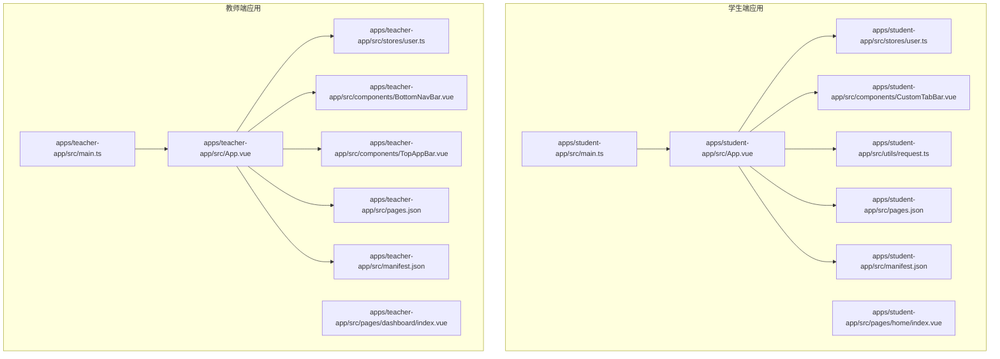
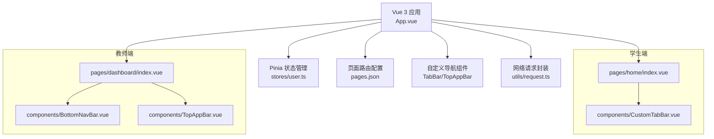
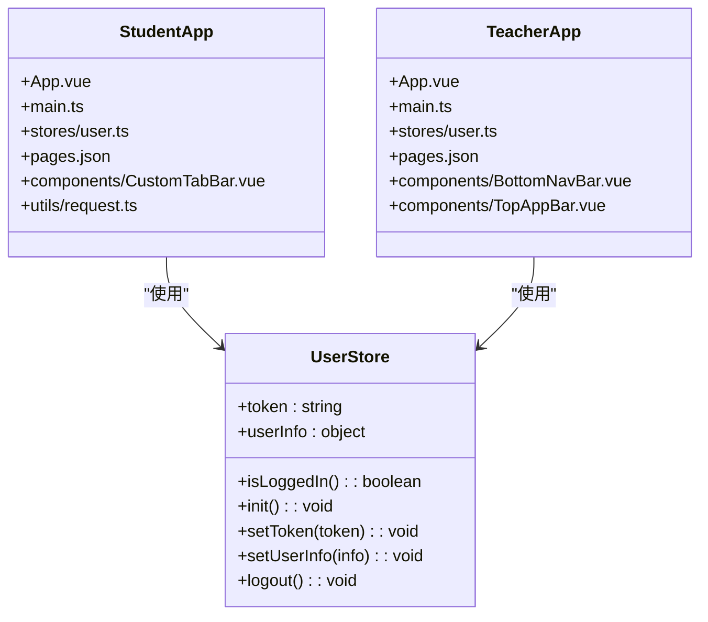
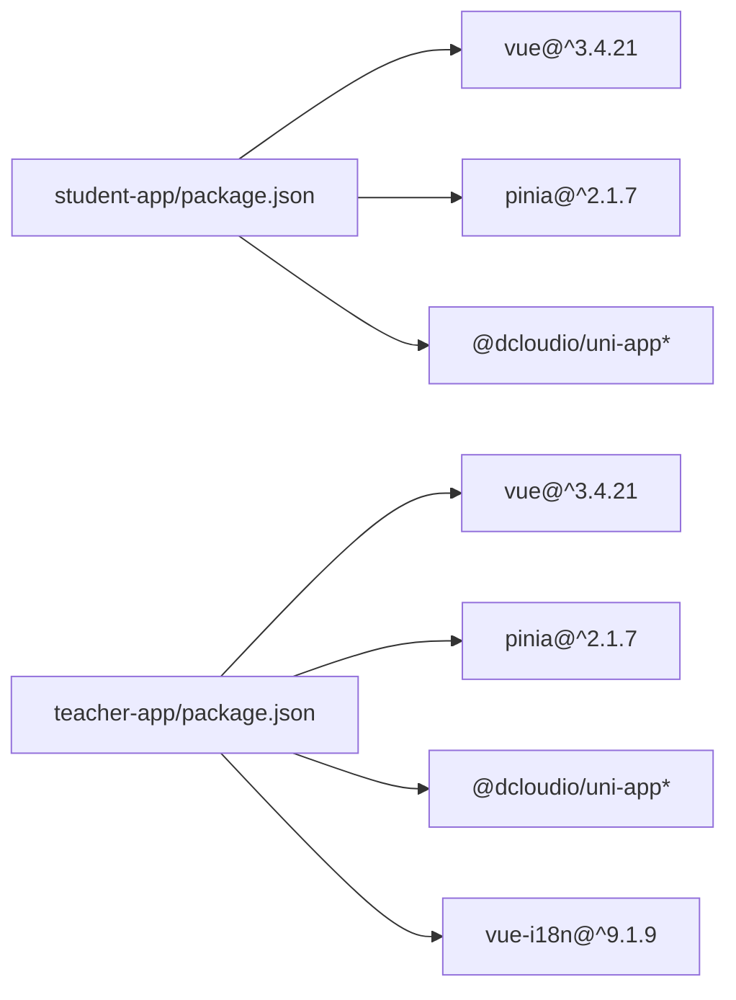

# 医小管 v2 前端应用文档

<cite>
**本文档引用的文件**
- [apps/student-app/src/main.ts](file://apps/student-app/src/main.ts)
- [apps/teacher-app/src/main.ts](file://apps/teacher-app/src/main.ts)
- [apps/student-app/src/App.vue](file://apps/student-app/src/App.vue)
- [apps/teacher-app/src/App.vue](file://apps/teacher-app/src/App.vue)
- [apps/student-app/package.json](file://apps/student-app/package.json)
- [apps/teacher-app/package.json](file://apps/teacher-app/package.json)
- [apps/student-app/src/stores/user.ts](file://apps/student-app/src/stores/user.ts)
- [apps/teacher-app/src/stores/user.ts](file://apps/teacher-app/src/stores/user.ts)
- [apps/student-app/src/pages.json](file://apps/student-app/src/pages.json)
- [apps/teacher-app/src/pages.json](file://apps/teacher-app/src/pages.json)
- [apps/student-app/src/manifest.json](file://apps/student-app/src/manifest.json)
- [apps/teacher-app/src/manifest.json](file://apps/teacher-app/src/manifest.json)
- [apps/student-app/src/pages/home/index.vue](file://apps/student-app/src/pages/home/index.vue)
- [apps/teacher-app/src/pages/dashboard/index.vue](file://apps/teacher-app/src/pages/dashboard/index.vue)
- [apps/student-app/src/components/CustomTabBar.vue](file://apps/student-app/src/components/CustomTabBar.vue)
- [apps/teacher-app/src/components/BottomNavBar.vue](file://apps/teacher-app/src/components/BottomNavBar.vue)
- [apps/teacher-app/src/components/TopAppBar.vue](file://apps/teacher-app/src/components/TopAppBar.vue)
- [apps/student-app/src/utils/request.ts](file://apps/student-app/src/utils/request.ts)
</cite>

## 目录
1. [简介](#简介)
2. [项目结构](#项目结构)
3. [核心组件](#核心组件)
4. [架构总览](#架构总览)
5. [详细组件分析](#详细组件分析)
6. [依赖关系分析](#依赖关系分析)
7. [性能考虑](#性能考虑)
8. [故障排除指南](#故障排除指南)
9. [结论](#结论)
10. [附录](#附录)

## 简介
本文件为“医小管 v2”前端应用的技术文档，覆盖学生端与教师端两套基于 Vue 3 + UniApp 的跨平台应用。文档重点阐述：
- 技术栈与构建体系：Vue 3、Pinia 状态管理、UniApp 跨端框架、Vite 构建工具
- 应用架构与组件设计模式：页面路由、状态管理、主题与样式、图标组件、底部/顶部导航
- 差异化设计：学生端以“智能问答”为核心，教师端以“工作台+知识库+提问管理”为核心
- 跨平台适配策略：H5 与小程序多端统一开发与差异化配置
- 性能优化与开发调试：热重载、远程调试、网络请求封装与错误处理

## 项目结构
项目采用“多应用”组织方式，每个端独立拥有 src、pages、stores、components、utils 等目录，共享统一的构建与运行脚本。

**图表来源**
- [apps/student-app/src/main.ts:1-11](file://apps/student-app/src/main.ts#L1-L11)
- [apps/teacher-app/src/main.ts:1-25](file://apps/teacher-app/src/main.ts#L1-L25)
- [apps/student-app/src/App.vue:1-36](file://apps/student-app/src/App.vue#L1-L36)
- [apps/teacher-app/src/App.vue:1-56](file://apps/teacher-app/src/App.vue#L1-L56)
- [apps/student-app/src/pages.json:1-65](file://apps/student-app/src/pages.json#L1-L65)
- [apps/teacher-app/src/pages.json:1-84](file://apps/teacher-app/src/pages.json#L1-L84)
- [apps/student-app/src/manifest.json:1-22](file://apps/student-app/src/manifest.json#L1-L22)
- [apps/teacher-app/src/manifest.json:1-26](file://apps/teacher-app/src/manifest.json#L1-L26)
- [apps/student-app/src/stores/user.ts:1-56](file://apps/student-app/src/stores/user.ts#L1-L56)
- [apps/teacher-app/src/stores/user.ts:1-63](file://apps/teacher-app/src/stores/user.ts#L1-L63)
- [apps/student-app/src/pages/home/index.vue:1-129](file://apps/student-app/src/pages/home/index.vue#L1-L129)
- [apps/teacher-app/src/pages/dashboard/index.vue:1-669](file://apps/teacher-app/src/pages/dashboard/index.vue#L1-L669)
- [apps/student-app/src/components/CustomTabBar.vue:1-75](file://apps/student-app/src/components/CustomTabBar.vue#L1-L75)
- [apps/teacher-app/src/components/BottomNavBar.vue:1-147](file://apps/teacher-app/src/components/BottomNavBar.vue#L1-L147)
- [apps/teacher-app/src/components/TopAppBar.vue:1-160](file://apps/teacher-app/src/components/TopAppBar.vue#L1-L160)
- [apps/student-app/src/utils/request.ts:1-44](file://apps/student-app/src/utils/request.ts#L1-L44)

**章节来源**
- [apps/student-app/src/main.ts:1-11](file://apps/student-app/src/main.ts#L1-L11)
- [apps/teacher-app/src/main.ts:1-25](file://apps/teacher-app/src/main.ts#L1-L25)
- [apps/student-app/src/App.vue:1-36](file://apps/student-app/src/App.vue#L1-L36)
- [apps/teacher-app/src/App.vue:1-56](file://apps/teacher-app/src/App.vue#L1-L56)
- [apps/student-app/src/pages.json:1-65](file://apps/student-app/src/pages.json#L1-L65)
- [apps/teacher-app/src/pages.json:1-84](file://apps/teacher-app/src/pages.json#L1-L84)
- [apps/student-app/src/manifest.json:1-22](file://apps/student-app/src/manifest.json#L1-L22)
- [apps/teacher-app/src/manifest.json:1-26](file://apps/teacher-app/src/manifest.json#L1-L26)

## 核心组件
- 应用入口与初始化
  - 学生端：在应用启动时初始化用户状态，建立 WebSocket 连接
  - 教师端：在应用启动时初始化用户状态；若存在 token，则自动建立 WebSocket 连接
- 状态管理
  - 使用 Pinia 定义用户 Store，持久化存储 token 与用户信息，提供登录/登出与初始化方法
- 页面路由与 TabBar
  - 学生端：自定义 TabBar，包含首页、智能问答、我的三个标签页
  - 教师端：自定义 BottomNavBar，包含工作台、学生提问、知识库、我的四个标签页
- 导航栏
  - 教师端提供 TopAppBar，支持返回按钮与多种右侧动作按钮
- 请求封装
  - 统一的网络请求函数，自动注入 Authorization 头，处理 401、422 等状态码并进行登出与跳转

**章节来源**
- [apps/student-app/src/stores/user.ts:1-56](file://apps/student-app/src/stores/user.ts#L1-L56)
- [apps/teacher-app/src/stores/user.ts:1-63](file://apps/teacher-app/src/stores/user.ts#L1-L63)
- [apps/student-app/src/components/CustomTabBar.vue:1-75](file://apps/student-app/src/components/CustomTabBar.vue#L1-L75)
- [apps/teacher-app/src/components/BottomNavBar.vue:1-147](file://apps/teacher-app/src/components/BottomNavBar.vue#L1-L147)
- [apps/teacher-app/src/components/TopAppBar.vue:1-160](file://apps/teacher-app/src/components/TopAppBar.vue#L1-L160)
- [apps/student-app/src/utils/request.ts:1-44](file://apps/student-app/src/utils/request.ts#L1-L44)

## 架构总览
下图展示学生端与教师端的共同架构：Vue 3 应用通过 UniApp 提供的生命周期钩子初始化 Pinia 状态，按需建立 WebSocket 连接；页面通过 pages.json 配置路由与 TabBar；组件层包含自定义导航与图标组件；请求层统一封装网络调用。

**图表来源**
- [apps/student-app/src/App.vue:1-36](file://apps/student-app/src/App.vue#L1-L36)
- [apps/teacher-app/src/App.vue:1-56](file://apps/teacher-app/src/App.vue#L1-L56)
- [apps/student-app/src/stores/user.ts:1-56](file://apps/student-app/src/stores/user.ts#L1-L56)
- [apps/teacher-app/src/stores/user.ts:1-63](file://apps/teacher-app/src/stores/user.ts#L1-L63)
- [apps/student-app/src/pages.json:1-65](file://apps/student-app/src/pages.json#L1-L65)
- [apps/teacher-app/src/pages.json:1-84](file://apps/teacher-app/src/pages.json#L1-L84)
- [apps/student-app/src/pages/home/index.vue:1-129](file://apps/student-app/src/pages/home/index.vue#L1-L129)
- [apps/teacher-app/src/pages/dashboard/index.vue:1-669](file://apps/teacher-app/src/pages/dashboard/index.vue#L1-L669)
- [apps/student-app/src/components/CustomTabBar.vue:1-75](file://apps/student-app/src/components/CustomTabBar.vue#L1-L75)
- [apps/teacher-app/src/components/BottomNavBar.vue:1-147](file://apps/teacher-app/src/components/BottomNavBar.vue#L1-L147)
- [apps/teacher-app/src/components/TopAppBar.vue:1-160](file://apps/teacher-app/src/components/TopAppBar.vue#L1-L160)
- [apps/student-app/src/utils/request.ts:1-44](file://apps/student-app/src/utils/request.ts#L1-L44)

## 详细组件分析

### 学生端应用

#### 应用入口与初始化
- 在应用启动时初始化用户状态，读取本地存储的 token 与用户信息，必要时建立 WebSocket 连接
- 全局样式引入主题变量，设置页面基础字体与背景色

**章节来源**
- [apps/student-app/src/App.vue:1-36](file://apps/student-app/src/App.vue#L1-L36)
- [apps/student-app/src/stores/user.ts:1-56](file://apps/student-app/src/stores/user.ts#L1-L56)

#### 首页（Home）
- 展示欢迎语、快捷提问卡片、最近对话列表
- 支持点击进入智能问答或打开指定对话
- 使用自定义 TabBar 实现底部导航

**章节来源**
- [apps/student-app/src/pages/home/index.vue:1-129](file://apps/student-app/src/pages/home/index.vue#L1-L129)
- [apps/student-app/src/components/CustomTabBar.vue:1-75](file://apps/student-app/src/components/CustomTabBar.vue#L1-L75)

#### 自定义 TabBar
- 固定在底部，支持当前项高亮与点击切换
- 与 pages.json 中的 tabBar 配置配合使用

**章节来源**
- [apps/student-app/src/components/CustomTabBar.vue:1-75](file://apps/student-app/src/components/CustomTabBar.vue#L1-L75)
- [apps/student-app/src/pages.json:45-63](file://apps/student-app/src/pages.json#L45-L63)

#### 网络请求封装
- 自动注入 Authorization 头
- 统一处理 401 未授权（登出并跳转登录）、422 参数错误、其他错误码与网络异常

**章节来源**
- [apps/student-app/src/utils/request.ts:1-44](file://apps/student-app/src/utils/request.ts#L1-L44)

### 教师端应用

#### 应用入口与初始化
- 在应用启动时初始化用户状态
- 若检测到 token，自动初始化 WebSocket 连接

**章节来源**
- [apps/teacher-app/src/App.vue:1-56](file://apps/teacher-app/src/App.vue#L1-L56)
- [apps/teacher-app/src/main.ts:5-24](file://apps/teacher-app/src/main.ts#L5-L24)

#### 工作台（Dashboard）
- 自定义顶栏与底部导航
- 展示欢迎横幅、快捷操作、统计卡片、待处理提问列表
- 支持查看全部提问与跳转详情

**章节来源**
- [apps/teacher-app/src/pages/dashboard/index.vue:1-669](file://apps/teacher-app/src/pages/dashboard/index.vue#L1-L669)
- [apps/teacher-app/src/components/BottomNavBar.vue:1-147](file://apps/teacher-app/src/components/BottomNavBar.vue#L1-L147)
- [apps/teacher-app/src/components/TopAppBar.vue:1-160](file://apps/teacher-app/src/components/TopAppBar.vue#L1-L160)

#### 底部导航（BottomNavBar）
- 支持徽标提醒（如待处理数量）
- 图标组件动态渲染，支持激活态样式

**章节来源**
- [apps/teacher-app/src/components/BottomNavBar.vue:1-147](file://apps/teacher-app/src/components/BottomNavBar.vue#L1-L147)
- [apps/teacher-app/src/pages.json:59-82](file://apps/teacher-app/src/pages.json#L59-L82)

#### 顶部导航（TopAppBar）
- 支持返回按钮与多种右侧动作按钮（搜索、设置、添加、编辑）
- 支持回退事件与动作事件发射

**章节来源**
- [apps/teacher-app/src/components/TopAppBar.vue:1-160](file://apps/teacher-app/src/components/TopAppBar.vue#L1-L160)

### 组件类图（代码级）

**图表来源**
- [apps/student-app/src/App.vue:1-36](file://apps/student-app/src/App.vue#L1-L36)
- [apps/teacher-app/src/App.vue:1-56](file://apps/teacher-app/src/App.vue#L1-L56)
- [apps/student-app/src/stores/user.ts:1-56](file://apps/student-app/src/stores/user.ts#L1-L56)
- [apps/teacher-app/src/stores/user.ts:1-63](file://apps/teacher-app/src/stores/user.ts#L1-L63)

## 依赖关系分析
- 通用依赖
  - Vue 3、Pinia、@dcloudio/uni-app 及其各平台扩展包
  - Vite、TypeScript、Sass
- 学生端
  - 仅微信小程序与 H5 平台打包脚本
- 教师端
  - 更广泛的多端平台支持（含支付宝、百度、字节、快手、飞书、QQ、抖音、小红书、快应用等）

**图表来源**
- [apps/student-app/package.json:1-37](file://apps/student-app/package.json#L1-L37)
- [apps/teacher-app/package.json:1-46](file://apps/teacher-app/package.json#L1-L46)

**章节来源**
- [apps/student-app/package.json:1-37](file://apps/student-app/package.json#L1-L37)
- [apps/teacher-app/package.json:1-46](file://apps/teacher-app/package.json#L1-L46)

## 性能考虑
- 组件懒加载与按需导入：教师端在应用启动后按需导入用户与 WebSocket Store，减少首屏负担
- 状态持久化：用户 token 与用户信息通过本地存储持久化，避免重复登录
- 网络层优化：统一请求封装，集中处理 401 登出与错误提示，降低页面逻辑复杂度
- 样式与动画：使用 SCSS 变量与过渡动画，提升视觉体验同时保持性能稳定
- 跨平台适配：通过 pages.json 与 manifest.json 的差异化配置，确保 H5 与小程序的路由与外观一致

[本节为通用性能建议，不直接分析具体文件]

## 故障排除指南
- 登录态失效
  - 现象：接口返回 401
  - 处理：自动清除本地 token 与用户信息，跳转登录页
  - 参考路径：[apps/student-app/src/utils/request.ts:25-28](file://apps/student-app/src/utils/request.ts#L25-L28)
- 参数校验失败
  - 现象：接口返回 422
  - 处理：解析 detail 中的错误消息并提示
  - 参考路径：[apps/student-app/src/utils/request.ts:29-32](file://apps/student-app/src/utils/request.ts#L29-L32)
- 网络异常
  - 现象：fail 回调触发
  - 处理：提示“网络连接失败”
  - 参考路径：[apps/student-app/src/utils/request.ts:38-40](file://apps/student-app/src/utils/request.ts#L38-L40)
- 登录后自动连接 WebSocket
  - 学生端：初始化用户状态时建立连接
  - 教师端：初始化用户状态后，若存在 token 则建立连接
  - 参考路径：
    - [apps/student-app/src/stores/user.ts:32](file://apps/student-app/src/stores/user.ts#L32)
    - [apps/teacher-app/src/main.ts:13-18](file://apps/teacher-app/src/main.ts#L13-L18)

**章节来源**
- [apps/student-app/src/utils/request.ts:1-44](file://apps/student-app/src/utils/request.ts#L1-L44)
- [apps/student-app/src/stores/user.ts:1-56](file://apps/student-app/src/stores/user.ts#L1-L56)
- [apps/teacher-app/src/main.ts:5-24](file://apps/teacher-app/src/main.ts#L5-L24)

## 结论
医小管 v2 前端应用采用 Vue 3 + UniApp 的现代化跨平台方案，通过 Pinia 实现轻量状态管理，结合自定义导航组件与统一网络封装，实现了学生端“智能问答”与教师端“工作台”的差异化功能。项目具备良好的可维护性与扩展性，适合在多端环境下持续迭代。

[本节为总结性内容，不直接分析具体文件]

## 附录

### 开发与调试指南
- 启动与构建
  - 学生端：支持 H5 与微信小程序开发/构建脚本
  - 教师端：支持 H5 与多端小程序开发/构建脚本
  - 参考路径：
    - [apps/student-app/package.json:4-9](file://apps/student-app/package.json#L4-L9)
    - [apps/teacher-app/package.json:4-9](file://apps/teacher-app/package.json#L4-L9)
- 热重载与远程调试
  - 使用 Vite 提供的热重载能力
  - 小程序端可通过开发者工具进行真机调试
- 路由与页面
  - 通过 pages.json 配置页面与 TabBar
  - 参考路径：
    - [apps/student-app/src/pages.json:1-65](file://apps/student-app/src/pages.json#L1-L65)
    - [apps/teacher-app/src/pages.json:1-84](file://apps/teacher-app/src/pages.json#L1-L84)
- 清单与多端配置
  - 通过 manifest.json 配置 H5 路由模式与小程序相关设置
  - 参考路径：
    - [apps/student-app/src/manifest.json:1-22](file://apps/student-app/src/manifest.json#L1-L22)
    - [apps/teacher-app/src/manifest.json:1-26](file://apps/teacher-app/src/manifest.json#L1-L26)

**章节来源**
- [apps/student-app/package.json:1-37](file://apps/student-app/package.json#L1-L37)
- [apps/teacher-app/package.json:1-46](file://apps/teacher-app/package.json#L1-L46)
- [apps/student-app/src/pages.json:1-65](file://apps/student-app/src/pages.json#L1-L65)
- [apps/teacher-app/src/pages.json:1-84](file://apps/teacher-app/src/pages.json#L1-L84)
- [apps/student-app/src/manifest.json:1-22](file://apps/student-app/src/manifest.json#L1-L22)
- [apps/teacher-app/src/manifest.json:1-26](file://apps/teacher-app/src/manifest.json#L1-L26)