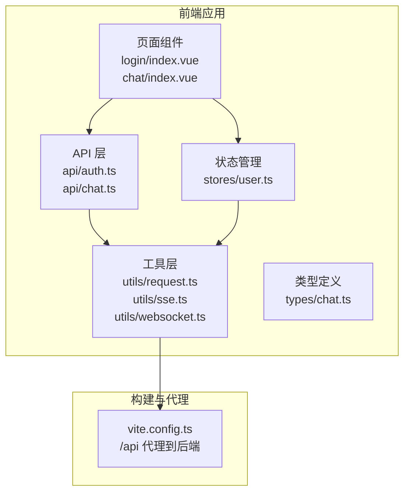
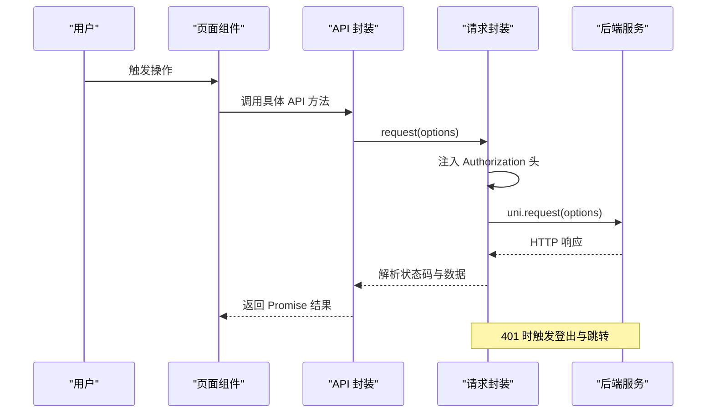
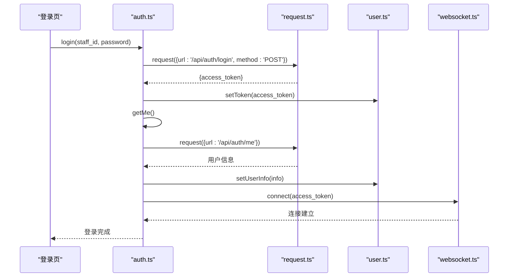
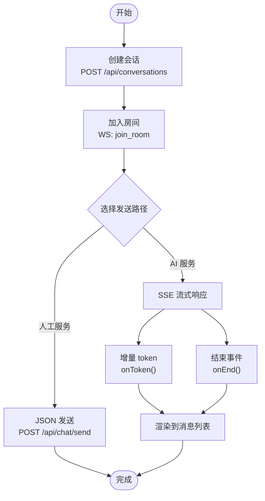
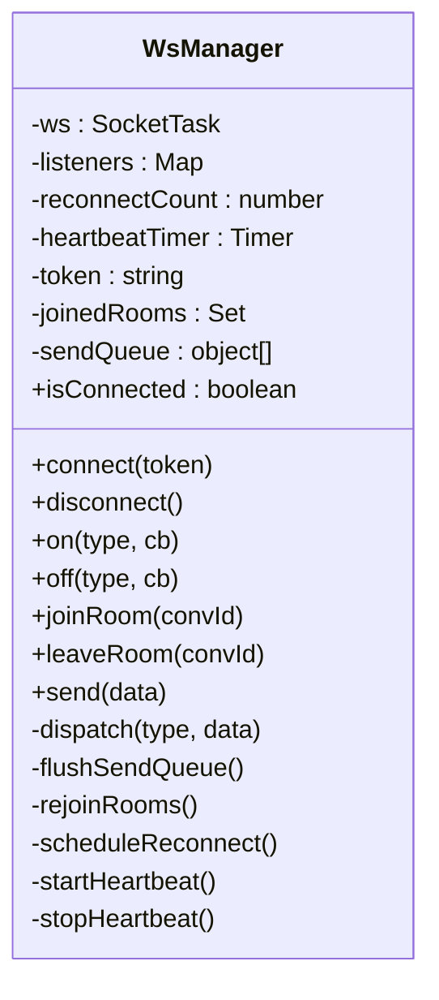
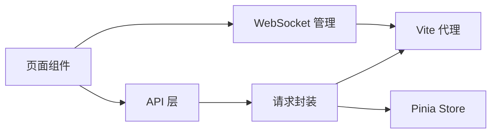

# API 接口集成

<cite>
**本文档引用的文件**
- [apps/student-app/src/api/auth.ts](file://apps/student-app/src/api/auth.ts)
- [apps/student-app/src/api/chat.ts](file://apps/student-app/src/api/chat.ts)
- [apps/student-app/src/utils/request.ts](file://apps/student-app/src/utils/request.ts)
- [apps/student-app/src/utils/sse.ts](file://apps/student-app/src/utils/sse.ts)
- [apps/student-app/src/utils/websocket.ts](file://apps/student-app/src/utils/websocket.ts)
- [apps/student-app/src/stores/user.ts](file://apps/student-app/src/stores/user.ts)
- [apps/student-app/src/tabs/chat/index.vue](file://apps/student-app/src/pages/chat/index.vue)
- [apps/student-app/src/pages/login/index.vue](file://apps/student-app/src/pages/login/index.vue)
- [apps/student-app/src/types/chat.ts](file://apps/student-app/src/types/chat.ts)
- [apps/student-app/vite.config.ts](file://apps/student-app/vite.config.ts)
- [apps/student-app/src/main.ts](file://apps/student-app/src/main.ts)
- [apps/student-app/package.json](file://apps/student-app/package.json)
</cite>

## 目录
1. [简介](#简介)
2. [项目结构](#项目结构)
3. [核心组件](#核心组件)
4. [架构总览](#架构总览)
5. [详细组件分析](#详细组件分析)
6. [依赖关系分析](#依赖关系分析)
7. [性能考虑](#性能考虑)
8. [故障排查指南](#故障排查指南)
9. [结论](#结论)
10. [附录](#附录)

## 简介
本文件面向学生端应用的 API 接口集成，系统性梳理前后端数据交互实现，涵盖 HTTP 请求封装、响应数据处理、错误处理机制；深入解析认证 API 的实现（登录请求、token 管理、登出清理）；详细阐述聊天 API 的集成（消息发送、接收、状态更新等实时数据交互）；提供请求拦截器与响应拦截器的配置思路（token 注入、错误统一处理、加载状态管理）；并给出 API 调试技巧、网络异常处理、离线数据缓存等实用方案。

## 项目结构
学生端采用基于 Vue 3 + Pinia + uni-app 的前端架构，API 层通过统一的请求封装模块完成 HTTP 通信，聊天模块结合 SSE 与 WebSocket 实现流式响应与实时消息推送，用户状态通过 Pinia store 进行持久化管理。

**图表来源**
- [apps/student-app/src/pages/login/index.vue](file://apps/student-app/src/pages/login/index.vue)
- [apps/student-app/src/pages/chat/index.vue](file://apps/student-app/src/pages/chat/index.vue)
- [apps/student-app/src/api/auth.ts](file://apps/student-app/src/api/auth.ts)
- [apps/student-app/src/api/chat.ts](file://apps/student-app/src/api/chat.ts)
- [apps/student-app/src/utils/request.ts](file://apps/student-app/src/utils/request.ts)
- [apps/student-app/src/utils/sse.ts](file://apps/student-app/src/utils/sse.ts)
- [apps/student-app/src/utils/websocket.ts](file://apps/student-app/src/utils/websocket.ts)
- [apps/student-app/src/stores/user.ts](file://apps/student-app/src/stores/user.ts)
- [apps/student-app/src/types/chat.ts](file://apps/student-app/src/types/chat.ts)
- [apps/student-app/vite.config.ts](file://apps/student-app/vite.config.ts)

**章节来源**
- [apps/student-app/src/main.ts](file://apps/student-app/src/main.ts)
- [apps/student-app/package.json](file://apps/student-app/package.json)
- [apps/student-app/vite.config.ts](file://apps/student-app/vite.config.ts)

## 核心组件
- 统一请求封装：负责 HTTP 请求的发起、统一 header 注入（含 Authorization）、响应状态码处理与错误抛出。
- 认证 API：提供登录与获取当前用户信息的接口封装。
- 聊天 API：提供会话创建、历史查询、消息查询与升级为人工服务等接口封装。
- SSE 工具：用于处理后端流式事件，支持分段增量输出与结束事件。
- WebSocket 管理：封装连接、心跳、重连、房间加入/离开、消息派发等逻辑。
- 用户状态管理：负责 token 与用户信息的存储、初始化与登出清理。
- 页面组件：登录页与聊天页作为调用方，编排业务流程。

**章节来源**
- [apps/student-app/src/utils/request.ts](file://apps/student-app/src/utils/request.ts)
- [apps/student-app/src/api/auth.ts](file://apps/student-app/src/api/auth.ts)
- [apps/student-app/src/api/chat.ts](file://apps/student-app/src/api/chat.ts)
- [apps/student-app/src/utils/sse.ts](file://apps/student-app/src/utils/sse.ts)
- [apps/student-app/src/utils/websocket.ts](file://apps/student-app/src/utils/websocket.ts)
- [apps/student-app/src/stores/user.ts](file://apps/student-app/src/stores/user.ts)

## 架构总览
前端通过 Vite 开发服务器进行本地代理，将 /api 前缀请求转发至后端服务，WebSocket 使用 /ws 前缀。统一请求封装在发起请求时自动注入 Authorization 头（若存在 token），并在 401 时触发登出与跳转。

**图表来源**
- [apps/student-app/src/utils/request.ts](file://apps/student-app/src/utils/request.ts)
- [apps/student-app/src/api/auth.ts](file://apps/student-app/src/api/auth.ts)
- [apps/student-app/src/api/chat.ts](file://apps/student-app/src/api/chat.ts)

## 详细组件分析

### 统一请求封装（request）
- 功能要点
  - 自动注入 Authorization 头（Bearer token），若 store 中存在 token。
  - 统一处理 2xx 成功响应，非 2xx 响应根据状态码进行错误处理。
  - 401 时清除用户状态并跳转到登录页。
  - 422 参数校验错误提取 detail 并提示。
  - 其他错误提取 message/detail 或回退为 HTTP 状态描述。
  - 网络失败统一转换为“网络连接失败”错误。
- 设计优势
  - 单点错误处理，避免各处重复判断。
  - 与 Pinia store 解耦，仅读取 token，不负责存储。
- 可扩展点
  - 可增加 loading 状态管理（如全局遮罩）。
  - 可增加请求/响应拦截器（见“依赖关系分析”中的拦截器设计）。

**章节来源**
- [apps/student-app/src/utils/request.ts](file://apps/student-app/src/utils/request.ts)

### 认证 API（auth）
- 登录接口
  - 调用 /api/auth/login，返回 access_token。
  - 登录成功后保存 token，并拉取当前用户信息。
- 获取当前用户
  - 调用 /api/auth/me，返回用户信息。
- 与 WebSocket 的协作
  - 登录成功后建立 WebSocket 连接，确保后续实时消息可用。

**图表来源**
- [apps/student-app/src/api/auth.ts](file://apps/student-app/src/api/auth.ts)
- [apps/student-app/src/utils/request.ts](file://apps/student-app/src/utils/request.ts)
- [apps/student-app/src/stores/user.ts](file://apps/student-app/src/stores/user.ts)
- [apps/student-app/src/utils/websocket.ts](file://apps/student-app/src/utils/websocket.ts)
- [apps/student-app/src/pages/login/index.vue](file://apps/student-app/src/pages/login/index.vue)

**章节来源**
- [apps/student-app/src/api/auth.ts](file://apps/student-app/src/api/auth.ts)
- [apps/student-app/src/pages/login/index.vue](file://apps/student-app/src/pages/login/index.vue)

### 聊天 API（chat）
- 会话管理
  - 创建会话：POST /api/conversations
  - 列表分页：GET /api/conversations?page=&size=
  - 获取单个会话详情：GET /api/conversations/{id}
  - 获取消息列表：GET /api/conversations/{convId}/messages?page=&size=
  - 升级为人工服务：POST /api/conversations/{convId}/escalate
- 数据模型
  - 会话与消息的数据结构由 types/chat.ts 定义，便于组件使用强类型。

**图表来源**
- [apps/student-app/src/api/chat.ts](file://apps/student-app/src/api/chat.ts)
- [apps/student-app/src/utils/sse.ts](file://apps/student-app/src/utils/sse.ts)
- [apps/student-app/src/utils/websocket.ts](file://apps/student-app/src/utils/websocket.ts)
- [apps/student-app/src/tabs/chat/index.vue](file://apps/student-app/src/pages/chat/index.vue)

**章节来源**
- [apps/student-app/src/api/chat.ts](file://apps/student-app/src/api/chat.ts)
- [apps/student-app/src/tabs/chat/index.vue](file://apps/student-app/src/pages/chat/index.vue)
- [apps/student-app/src/types/chat.ts](file://apps/student-app/src/types/chat.ts)

### SSE 流式响应（fetchSSE）
- 功能要点
  - 以 POST 方式向 /api/chat/send 推送消息，接收服务端事件。
  - 解析事件类型：message（增量 token）、message_end（最终内容与来源）、error（错误信息）。
  - 使用 TextDecoder 逐行解析，保证增量渲染体验。
- 适用场景
  - AI 服务的流式回答，支持边到边渲染与光标闪烁效果。

**章节来源**
- [apps/student-app/src/utils/sse.ts](file://apps/student-app/src/utils/sse.ts)
- [apps/student-app/src/tabs/chat/index.vue](file://apps/student-app/src/pages/chat/index.vue)

### WebSocket 实时通信（wsManager）
- 连接与心跳
  - 自动拼接 ws/wss 地址，携带 token 查询参数。
  - 心跳：每 30 秒发送 ping，收到 pong 不做处理。
- 重连机制
  - 指数退避重连，最多重连 N 次，断线后自动恢复。
- 房间管理
  - join_room/leave_room，重连后自动 re-join。
- 消息派发
  - 统一分发 new_message/status_changed 等事件，供页面监听。
- 发送队列
  - 未连接时将消息入队，连上后 flush 发送。

**图表来源**
- [apps/student-app/src/utils/websocket.ts](file://apps/student-app/src/utils/websocket.ts)

**章节来源**
- [apps/student-app/src/utils/websocket.ts](file://apps/student-app/src/utils/websocket.ts)
- [apps/student-app/src/tabs/chat/index.vue](file://apps/student-app/src/pages/chat/index.vue)

### 用户状态管理（Pinia Store）
- 存储键
  - v2-token：存储 access_token
  - v2-user-info：存储用户信息 JSON
- 初始化
  - 启动时从本地存储读取 token 与用户信息，若存在则自动连接 WebSocket。
- 登出
  - 清除 token 与用户信息，断开 WebSocket 连接。

**章节来源**
- [apps/student-app/src/stores/user.ts](file://apps/student-app/src/stores/user.ts)

## 依赖关系分析
- 构建与代理
  - Vite 将 /api 代理到 http://192.168.100.165:8100，/ws 代理到 ws://192.168.100.165:8100，便于开发环境跨域与本地联调。
- 组件耦合
  - 页面组件仅依赖 API 层方法，API 层依赖请求封装，请求封装依赖 Pinia store。
  - WebSocket 与聊天页面通过事件订阅解耦，便于扩展与测试。
- 拦截器设计（可扩展）
  - 请求拦截器：在 request 内统一注入 Authorization 头，未来可扩展 loading 状态、重试策略、埋点上报。
  - 响应拦截器：集中处理 401、422、网络错误，统一 toast 提示，未来可扩展统一错误码映射。

**图表来源**
- [apps/student-app/src/utils/request.ts](file://apps/student-app/src/utils/request.ts)
- [apps/student-app/src/api/auth.ts](file://apps/student-app/src/api/auth.ts)
- [apps/student-app/src/api/chat.ts](file://apps/student-app/src/api/chat.ts)
- [apps/student-app/src/utils/websocket.ts](file://apps/student-app/src/utils/websocket.ts)
- [apps/student-app/vite.config.ts](file://apps/student-app/vite.config.ts)

**章节来源**
- [apps/student-app/vite.config.ts](file://apps/student-app/vite.config.ts)

## 性能考虑
- 请求合并与去抖
  - 对频繁触发的查询（如分页加载）可引入去抖策略，减少无效请求。
- 缓存策略
  - 对只读数据（如会话列表）可引入内存缓存，结合时间戳控制过期。
- 渲染优化
  - 聊天消息列表使用虚拟滚动（scroll-view）提升长列表性能。
- 网络优化
  - 合理设置超时与重试，避免长时间阻塞 UI。
- WebSocket
  - 心跳间隔与重连指数退避需平衡实时性与资源消耗。

## 故障排查指南
- 登录失败
  - 检查 /api/auth/login 是否返回 access_token；确认网络代理是否正确指向后端。
  - 若出现 422，查看返回 detail 中的具体字段错误。
- 401 未授权
  - request.ts 在 401 时会触发登出与跳转，检查 token 是否过期或被撤销。
- 网络异常
  - request.ts 将失败转换为“网络连接失败”，检查设备网络与代理配置。
- SSE 流式异常
  - 检查 /api/chat/send 是否返回正确的事件格式；关注 onEnd 与 onError 回调。
- WebSocket 断线
  - 查看重连日志与心跳定时器；确认 token 与地址拼接是否正确。
- 调试技巧
  - 在 request.ts 中打印 options.url 与 header，定位请求头缺失问题。
  - 在 wsManager 中开启更详细的日志，观察连接、重连与房间 re-join 行为。
  - 使用浏览器开发者工具 Network 面板查看 /api 与 /ws 的实际请求与响应。

**章节来源**
- [apps/student-app/src/utils/request.ts](file://apps/student-app/src/utils/request.ts)
- [apps/student-app/src/utils/sse.ts](file://apps/student-app/src/utils/sse.ts)
- [apps/student-app/src/utils/websocket.ts](file://apps/student-app/src/utils/websocket.ts)
- [apps/student-app/src/pages/login/index.vue](file://apps/student-app/src/pages/login/index.vue)
- [apps/student-app/src/tabs/chat/index.vue](file://apps/student-app/src/pages/chat/index.vue)

## 结论
该学生端 API 集成方案通过统一请求封装与清晰的模块职责划分，实现了认证、聊天、实时通信的完整闭环。借助 Vite 代理简化了开发环境跨域问题，SSE 与 WebSocket 分别满足了流式响应与实时推送的需求。建议在现有基础上进一步完善拦截器与缓存策略，持续优化用户体验与稳定性。

## 附录
- 关键文件清单
  - 请求封装：apps/student-app/src/utils/request.ts
  - 认证 API：apps/student-app/src/api/auth.ts
  - 聊天 API：apps/student-app/src/api/chat.ts
  - SSE 工具：apps/student-app/src/utils/sse.ts
  - WebSocket 管理：apps/student-app/src/utils/websocket.ts
  - 用户状态：apps/student-app/src/stores/user.ts
  - 类型定义：apps/student-app/src/types/chat.ts
  - 构建配置：apps/student-app/vite.config.ts
  - 应用入口：apps/student-app/src/main.ts
  - 依赖声明：apps/student-app/package.json
- 页面组件
  - 登录页：apps/student-app/src/pages/login/index.vue
  - 聊天页：apps/student-app/src/pages/chat/index.vue