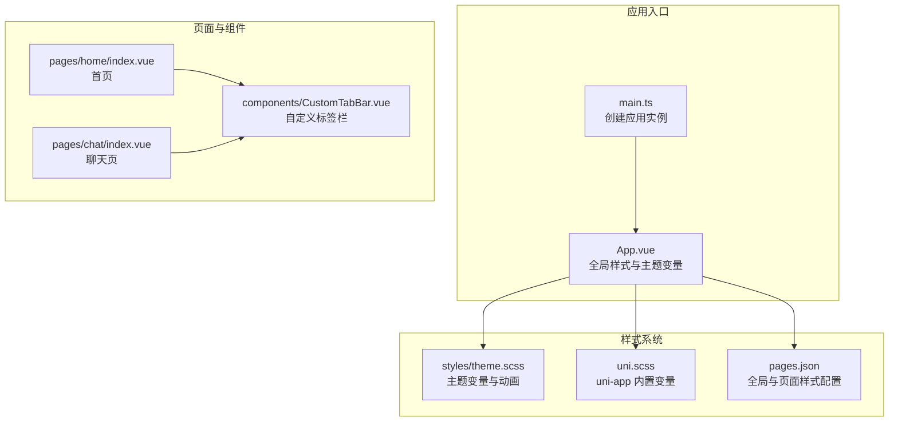
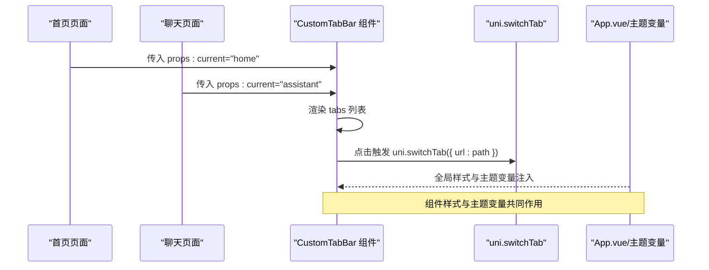
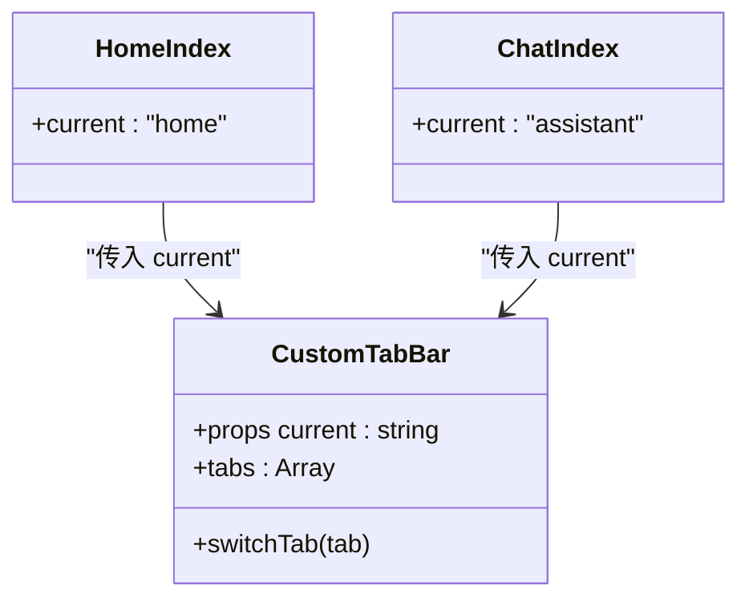
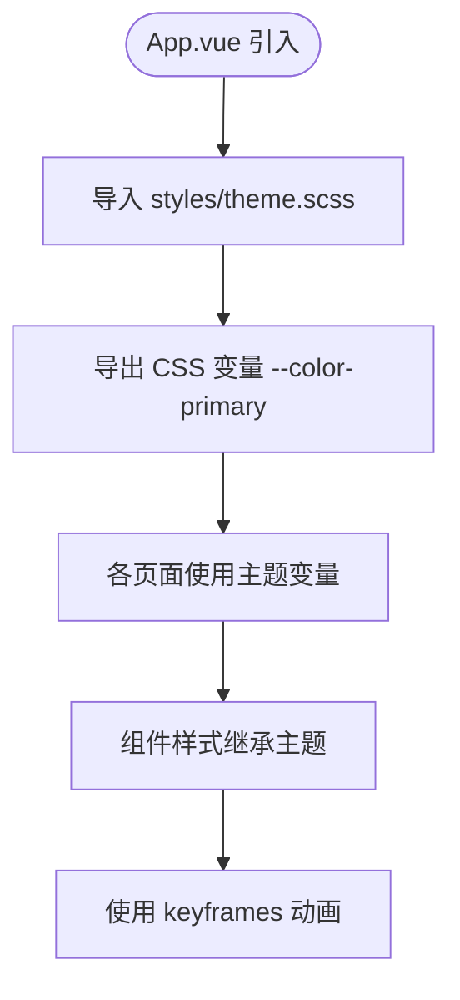
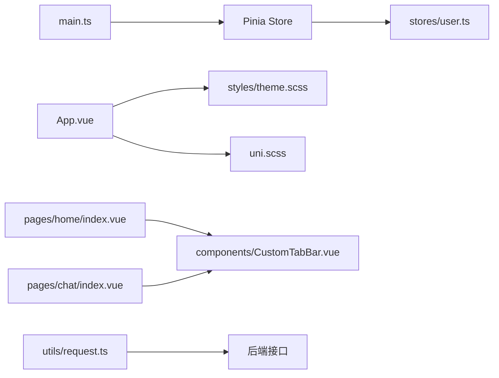

# UI 组件与样式

<cite>
**本文档引用的文件**
- [apps/student-app/src/components/CustomTabBar.vue](file://apps/student-app/src/components/CustomTabBar.vue)
- [apps/student-app/src/styles/theme.scss](file://apps/student-app/src/styles/theme.scss)
- [apps/student-app/src/uni.scss](file://apps/student-app/src/uni.scss)
- [apps/student-app/src/App.vue](file://apps/student-app/src/App.vue)
- [apps/student-app/src/pages.json](file://apps/student-app/src/pages.json)
- [apps/student-app/src/main.ts](file://apps/student-app/src/main.ts)
- [apps/student-app/src/pages/home/index.vue](file://apps/student-app/src/pages/home/index.vue)
- [apps/student-app/src/pages/chat/index.vue](file://apps/student-app/src/pages/chat/index.vue)
- [apps/student-app/src/stores/user.ts](file://apps/student-app/src/stores/user.ts)
- [apps/student-app/src/utils/request.ts](file://apps/student-app/src/utils/request.ts)
- [apps/student-app/vite.config.ts](file://apps/student-app/vite.config.ts)
</cite>

## 目录
1. [引言](#引言)
2. [项目结构](#项目结构)
3. [核心组件](#核心组件)
4. [架构总览](#架构总览)
5. [详细组件分析](#详细组件分析)
6. [依赖关系分析](#依赖关系分析)
7. [性能考量](#性能考量)
8. [故障排查指南](#故障排查指南)
9. [结论](#结论)
10. [附录](#附录)

## 引言
本文件聚焦于学生端应用的 UI 组件与样式体系，系统性梳理自定义标签栏组件 CustomTabBar 的设计与实现，深入解析 SCSS 主题变量、uni-app 内置样式变量、响应式与安全区域适配策略，并总结跨平台样式适配与性能优化方法。同时提供组件开发规范、调试技巧与兼容性处理建议，帮助开发者在多端（H5、小程序）环境中保持一致的视觉与交互体验。

## 项目结构
学生端应用采用 uni-app 多端统一框架，页面通过 pages.json 进行全局与页面级配置，主题样式通过 SCSS 变量集中管理并在入口 App.vue 中引入。自定义组件 CustomTabBar 在多个页面中复用，配合内置 tabBar 自定义模式实现统一底部导航体验。

图表来源
- [apps/student-app/src/main.ts:1-11](file://apps/student-app/src/main.ts#L1-L11)
- [apps/student-app/src/App.vue:1-36](file://apps/student-app/src/App.vue#L1-L36)
- [apps/student-app/src/styles/theme.scss:1-39](file://apps/student-app/src/styles/theme.scss#L1-L39)
- [apps/student-app/src/uni.scss:1-24](file://apps/student-app/src/uni.scss#L1-L24)
- [apps/student-app/src/pages.json:1-65](file://apps/student-app/src/pages.json#L1-L65)
- [apps/student-app/src/pages/home/index.vue:1-129](file://apps/student-app/src/pages/home/index.vue#L1-L129)
- [apps/student-app/src/pages/chat/index.vue:1-649](file://apps/student-app/src/pages/chat/index.vue#L1-L649)
- [apps/student-app/src/components/CustomTabBar.vue:1-75](file://apps/student-app/src/components/CustomTabBar.vue#L1-L75)

章节来源
- [apps/student-app/src/main.ts:1-11](file://apps/student-app/src/main.ts#L1-L11)
- [apps/student-app/src/App.vue:1-36](file://apps/student-app/src/App.vue#L1-L36)
- [apps/student-app/src/styles/theme.scss:1-39](file://apps/student-app/src/styles/theme.scss#L1-L39)
- [apps/student-app/src/uni.scss:1-24](file://apps/student-app/src/uni.scss#L1-L24)
- [apps/student-app/src/pages.json:1-65](file://apps/student-app/src/pages.json#L1-L65)

## 核心组件
本节聚焦 CustomTabBar 标签栏组件，从功能特性、props 参数、事件处理与样式实现角度进行拆解。

- 功能特性
  - 固定定位：底部固定，支持安全区域适配，避免刘海屏/圆角遮挡。
  - 动态高亮：根据当前激活项动态切换图标与文字颜色。
  - 交互反馈：点击切换至对应页面路径，使用 uni.switchTab 完成页面跳转。
  - 毛玻璃背景：半透明背景与模糊滤镜提升视觉层次。
  - 响应式布局：flex 布局均分空间，列式排列图标与文字，间距与过渡动画优化交互体验。

- Props 参数
  - current: string 类型，表示当前激活的 tab 键值，用于高亮匹配。

- 事件处理
  - 点击事件：绑定在每个 tab 项上，调用 switchTab 方法，内部通过 uni.switchTab 跳转到对应路径。
  - 数据源：tabs 数组定义了三个默认 tab，包含键值、图标、标签文本与目标路径。

- 样式要点
  - 定位与层级：fixed 定位，z-index 提升，确保覆盖内容区域。
  - 边框与背景：顶部细边框与半透明背景，结合 backdrop-filter 实现毛玻璃效果。
  - 活跃态：.active 类控制图标与文字颜色，过渡色值来自主题变量。
  - 安全区域：底部内边距使用 env(safe-area-inset-bottom) 兼容异形屏。

章节来源
- [apps/student-app/src/components/CustomTabBar.vue:1-75](file://apps/student-app/src/components/CustomTabBar.vue#L1-L75)

## 架构总览
下图展示了自定义标签栏在页面中的调用关系与样式注入链路，体现组件化与主题变量的协同工作方式。

图表来源
- [apps/student-app/src/pages/home/index.vue:40-41](file://apps/student-app/src/pages/home/index.vue#L40-L41)
- [apps/student-app/src/pages/chat/index.vue:181-181](file://apps/student-app/src/pages/chat/index.vue#L181-L181)
- [apps/student-app/src/components/CustomTabBar.vue:18-26](file://apps/student-app/src/components/CustomTabBar.vue#L18-L26)
- [apps/student-app/src/App.vue:11-36](file://apps/student-app/src/App.vue#L11-L36)

## 详细组件分析

### CustomTabBar 组件分析
- 设计模式
  - 无状态展示组件：仅负责渲染与交互转发，不维护内部状态。
  - 受控组件：current 由父页面传递，保证高亮与路由同步。
  - 组合式 API：使用 Vue 3 Composition API 与 TypeScript，便于类型约束与逻辑复用。

- 数据结构
  - tabs: 数组，元素包含键值、图标符号、标签文本与页面路径。
  - current: 字符串，与 tabs.key 对应，决定活跃态。

- 交互流程
  - 点击任一 tab 项，执行 switchTab，内部调用 uni.switchTab 跳转到对应页面路径。
  - 页面生命周期中，父页面根据当前路由设置 current 值，驱动组件高亮。

- 样式组织
  - 作用域样式：scoped，避免污染其他页面。
  - 主题变量：颜色、字体、过渡时间等通过 SCSS 变量统一管理。
  - 安全区域：env(safe-area-inset-bottom) 适配异形屏底部安全区。

图表来源
- [apps/student-app/src/components/CustomTabBar.vue:15-26](file://apps/student-app/src/components/CustomTabBar.vue#L15-L26)
- [apps/student-app/src/pages/home/index.vue:40-41](file://apps/student-app/src/pages/home/index.vue#L40-L41)
- [apps/student-app/src/pages/chat/index.vue:181-181](file://apps/student-app/src/pages/chat/index.vue#L181-L181)

章节来源
- [apps/student-app/src/components/CustomTabBar.vue:1-75](file://apps/student-app/src/components/CustomTabBar.vue#L1-L75)
- [apps/student-app/src/pages/home/index.vue:40-41](file://apps/student-app/src/pages/home/index.vue#L40-L41)
- [apps/student-app/src/pages/chat/index.vue:181-181](file://apps/student-app/src/pages/chat/index.vue#L181-L181)

### 样式系统与主题变量
- 主题变量定义
  - primary 系列：从深紫到浅紫的渐变色板，作为主色系。
  - secondary/tertiary/error/warning/success：辅助与语义色。
  - 背景与边框：页面背景、卡片背景、二级背景与边框色。
  - 文本色：主/次/三级文本与反色。
  - 字体族与过渡：统一字体家族与基础过渡动画。
  - 关键帧：fadeInUp、typing、blink 等动画。

- uni-app 内置变量
  - 颜色：主色、成功、警告、错误；文本色与占位符色；背景色与边框色。
  - 字号与圆角：提供基础字号与圆角尺寸，便于组件一致性。

- 全局样式注入
  - App.vue 中引入主题 SCSS 并暴露 CSS 变量 --color-primary，供页面与组件使用。
  - page 与 button 样式统一基础排版与交互基线。

图表来源
- [apps/student-app/src/App.vue:11-36](file://apps/student-app/src/App.vue#L11-L36)
- [apps/student-app/src/styles/theme.scss:1-39](file://apps/student-app/src/styles/theme.scss#L1-L39)
- [apps/student-app/src/uni.scss:1-24](file://apps/student-app/src/uni.scss#L1-L24)

章节来源
- [apps/student-app/src/styles/theme.scss:1-39](file://apps/student-app/src/styles/theme.scss#L1-L39)
- [apps/student-app/src/uni.scss:1-24](file://apps/student-app/src/uni.scss#L1-L24)
- [apps/student-app/src/App.vue:11-36](file://apps/student-app/src/App.vue#L11-L36)

### 响应式与安全区域适配
- 安全区域
  - 使用 env(safe-area-inset-bottom) 为底部导航增加内边距，避免被系统控件遮挡。
  - 在页面容器与输入区同样应用安全区域变量，确保内容不被遮挡。

- 响应式布局
  - Flex 均分空间：tab-bar 使用 space-around 均匀分布，适配不同屏幕宽度。
  - 字体与间距：使用相对单位与紧凑的间距，保证在小屏设备上的可读性与可触达性。

- 页面配置
  - pages.json 中全局设置导航栏与背景色，tabBar 设置 custom 为 true，启用自定义标签栏。
  - 各页面 navigationStyle 为 custom，避免平台默认导航栏影响布局。

章节来源
- [apps/student-app/src/components/CustomTabBar.vue:42-43](file://apps/student-app/src/components/CustomTabBar.vue#L42-L43)
- [apps/student-app/src/pages/home/index.vue:101-101](file://apps/student-app/src/pages/home/index.vue#L101-L101)
- [apps/student-app/src/pages/chat/index.vue:609-609](file://apps/student-app/src/pages/chat/index.vue#L609-L609)
- [apps/student-app/src/pages.json:39-63](file://apps/student-app/src/pages.json#L39-L63)

### 跨平台样式适配策略
- 平台差异处理
  - 使用 uni-app 统一样式 API，避免直接写平台特定选择器。
  - 通过 pages.json 的 custom 导航与自定义 tabBar，统一底部导航体验。
  - 在组件中优先使用 CSS 变量与 SCSS 变量，减少平台差异带来的视觉偏差。

- 性能优化
  - 毛玻璃效果：backdrop-filter 在部分低端机可能造成性能压力，建议在低端设备降级或禁用。
  - 动画：合理使用 transform 与 opacity，避免频繁触发重排。
  - 图标：Material Symbols 作为内联字体，体积小、渲染快，适合移动端。

- 开发建议
  - 将主题变量集中管理，避免散落的硬编码颜色与尺寸。
  - 组件样式尽量使用 scoped，必要时通过深度选择器与 CSS 变量进行可控穿透。

章节来源
- [apps/student-app/src/components/CustomTabBar.vue:37-37](file://apps/student-app/src/components/CustomTabBar.vue#L37-L37)
- [apps/student-app/src/styles/theme.scss:35-38](file://apps/student-app/src/styles/theme.scss#L35-L38)

### 组件开发规范
- 命名约定
  - 组件文件：PascalCase，如 CustomTabBar.vue。
  - 样式类名：BEM 或语义化命名，如 tab-bar、tab-item、tab-icon、tab-label。
  - SCSS 变量：$prefix-...，如 $primary-40、$bg-page。

- 代码结构
  - 组合式 API：使用 <script setup> 与 TypeScript，明确 props 类型与返回值。
  - 数据与逻辑分离：tabs 列表与 switchTab 逻辑清晰，便于测试与复用。
  - 事件处理：统一通过方法转发，避免在模板中直接调用平台 API。

- 可复用性设计
  - 受控组件：current 由父组件传递，组件只负责渲染与事件转发。
  - 抽象数据源：tabs 可以从外部注入，便于扩展更多 tab 或动态配置。
  - 样式模块化：通过 SCSS 变量与全局样式注入，保证多处使用的一致性。

章节来源
- [apps/student-app/src/components/CustomTabBar.vue:15-26](file://apps/student-app/src/components/CustomTabBar.vue#L15-L26)

### 样式调试工具与技巧
- 调试工具
  - 浏量/微信开发者工具：检查元素盒模型、伪类状态与安全区域。
  - 样式面板：观察 scoped 样式是否生效，确认 CSS 变量覆盖顺序。
  - 动画调试：使用浏览器动画面板观察 transform 与 opacity 动画曲线。

- 兼容性处理
  - env(safe-area-inset-*)：在非支持平台自动回退为 0，无需额外判断。
  - backdrop-filter：在部分 Android 机型上回退到普通背景或阴影模拟。
  - 字体图标：确保 Material Symbols 字体资源可用，必要时提供降级方案。

- 动画效果实现
  - 使用 SCSS keyframes 定义基础动画，如 typing、blink。
  - 在组件中通过类名切换触发动画，避免在 JS 中频繁操作 DOM。

章节来源
- [apps/student-app/src/styles/theme.scss:35-38](file://apps/student-app/src/styles/theme.scss#L35-L38)
- [apps/student-app/src/pages/chat/index.vue:599-605](file://apps/student-app/src/pages/chat/index.vue#L599-L605)

## 依赖关系分析
- 组件依赖
  - CustomTabBar 依赖 uni-app 的页面跳转能力与全局主题变量。
  - 页面通过 props 传入 current，实现与路由状态的联动。

- 样式依赖
  - App.vue 引入主题 SCSS，为所有页面与组件提供统一变量。
  - uni.scss 提供 uni-app 内置变量，便于与平台组件风格对齐。

- 运行时依赖
  - main.ts 创建应用实例并挂载 Pinia，用户状态在 stores/user.ts 中管理。
  - 请求封装在 utils/request.ts，统一处理鉴权与错误码。

图表来源
- [apps/student-app/src/main.ts:1-11](file://apps/student-app/src/main.ts#L1-L11)
- [apps/student-app/src/stores/user.ts:1-56](file://apps/student-app/src/stores/user.ts#L1-L56)
- [apps/student-app/src/App.vue:11-36](file://apps/student-app/src/App.vue#L11-L36)
- [apps/student-app/src/styles/theme.scss:1-39](file://apps/student-app/src/styles/theme.scss#L1-L39)
- [apps/student-app/src/uni.scss:1-24](file://apps/student-app/src/uni.scss#L1-L24)
- [apps/student-app/src/pages/home/index.vue:40-41](file://apps/student-app/src/pages/home/index.vue#L40-L41)
- [apps/student-app/src/pages/chat/index.vue:181-181](file://apps/student-app/src/pages/chat/index.vue#L181-L181)
- [apps/student-app/src/utils/request.ts:1-44](file://apps/student-app/src/utils/request.ts#L1-L44)

章节来源
- [apps/student-app/src/main.ts:1-11](file://apps/student-app/src/main.ts#L1-L11)
- [apps/student-app/src/stores/user.ts:1-56](file://apps/student-app/src/stores/user.ts#L1-L56)
- [apps/student-app/src/App.vue:11-36](file://apps/student-app/src/App.vue#L11-L36)
- [apps/student-app/src/utils/request.ts:1-44](file://apps/student-app/src/utils/request.ts#L1-L44)

## 性能考量
- 渲染性能
  - 减少不必要的 reflow/repaint：优先使用 transform 与 opacity 触发动画。
  - 控制组件复杂度：tab-bar 结构简单，避免在循环中做重型计算。

- 资源与网络
  - 字体图标：Material Symbols 体积小，利于首屏渲染。
  - 接口代理：vite.config.ts 配置 /api 与 /ws 代理，降低跨域与网络抖动影响。

- 存储与状态
  - 用户信息与令牌持久化：stores/user.ts 使用本地存储，减少重复登录开销。
  - 请求封装：utils/request.ts 统一处理 401 重定向与错误提示，避免页面异常。

章节来源
- [apps/student-app/vite.config.ts:1-22](file://apps/student-app/vite.config.ts#L1-L22)
- [apps/student-app/src/stores/user.ts:18-56](file://apps/student-app/src/stores/user.ts#L18-L56)
- [apps/student-app/src/utils/request.ts:1-44](file://apps/student-app/src/utils/request.ts#L1-L44)

## 故障排查指南
- 自定义标签栏不生效
  - 检查 pages.json 中 tabBar.custom 是否为 true。
  - 确认父页面传入的 current 与 tabs.key 匹配。

- 安全区域遮挡
  - 确认底部容器使用 env(safe-area-inset-bottom)。
  - 在页面与组件中统一应用该变量，避免遗漏。

- 动画卡顿
  - 检查 backdrop-filter 使用情况，必要时在低端设备禁用。
  - 简化动画关键帧，避免过度使用复杂 transform。

- 请求失败或未授权
  - 查看 utils/request.ts 的错误分支，确认 401 重定向逻辑。
  - 检查 stores/user.ts 的令牌与用户信息存储状态。

章节来源
- [apps/student-app/src/pages.json:45-63](file://apps/student-app/src/pages.json#L45-L63)
- [apps/student-app/src/components/CustomTabBar.vue:42-43](file://apps/student-app/src/components/CustomTabBar.vue#L42-L43)
- [apps/student-app/src/utils/request.ts:25-36](file://apps/student-app/src/utils/request.ts#L25-L36)
- [apps/student-app/src/stores/user.ts:24-34](file://apps/student-app/src/stores/user.ts#L24-L34)

## 结论
本项目通过统一的主题变量体系与自定义标签栏组件，实现了跨平台一致的视觉与交互体验。CustomTabBar 以受控组件形式与页面路由状态解耦，结合 SCSS 变量与安全区域适配，满足多端需求。建议在后续迭代中进一步完善动画性能与错误兜底，持续优化用户体验。

## 附录
- 开发与构建
  - 开发命令：dev:h5、dev:mp-weixin；构建命令：build:h5、build:mp-weixin。
  - 代理配置：/api 与 /ws 指向网关服务地址，便于本地联调。

- 相关文件索引
  - 组件：CustomTabBar.vue
  - 主题：theme.scss、uni.scss
  - 页面：home/index.vue、chat/index.vue
  - 入口：main.ts、App.vue
  - 配置：pages.json、vite.config.ts

章节来源
- [apps/student-app/package.json:4-9](file://apps/student-app/package.json#L4-L9)
- [apps/student-app/vite.config.ts:1-22](file://apps/student-app/vite.config.ts#L1-L22)
- [apps/student-app/src/pages.json:1-65](file://apps/student-app/src/pages.json#L1-L65)