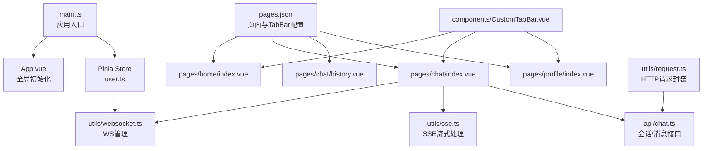
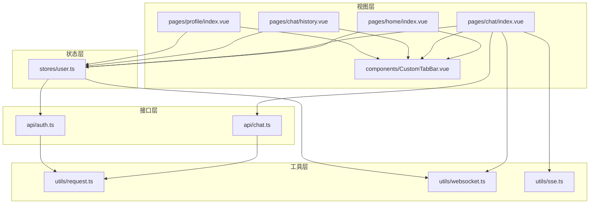
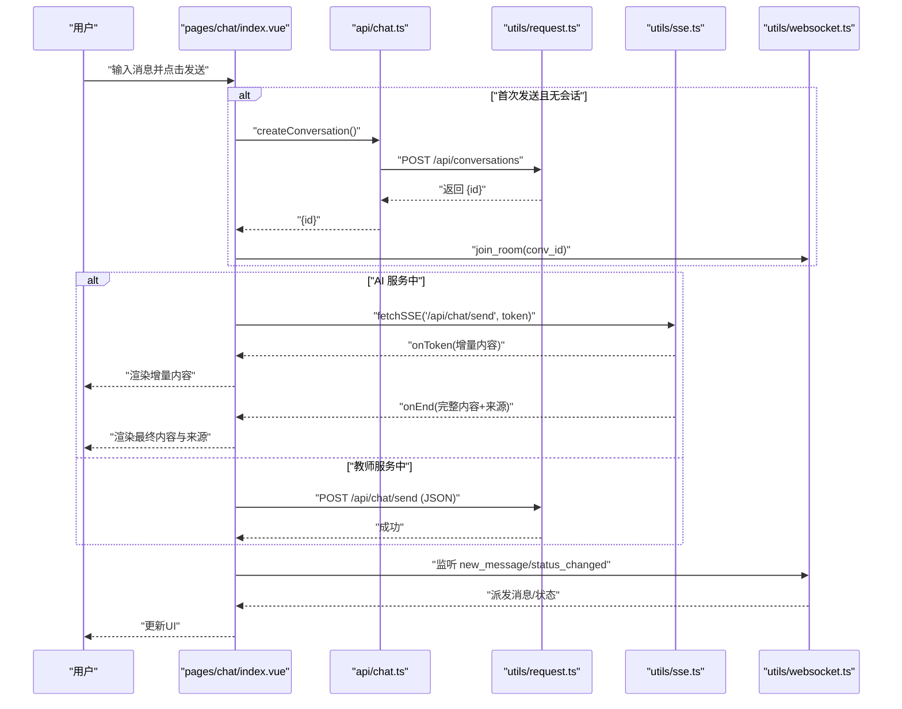
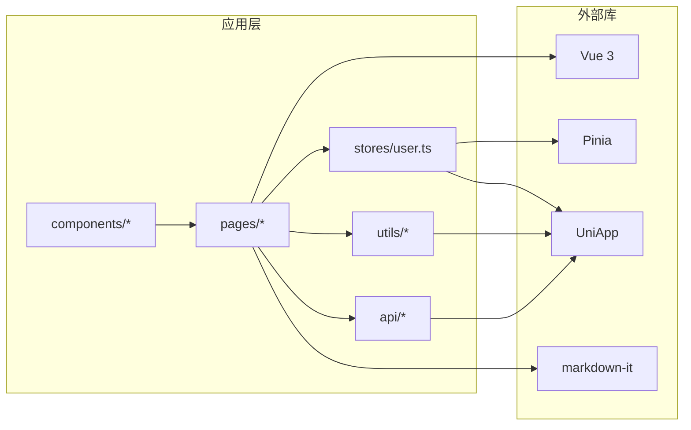

# 学生端应用

<cite>
**本文档引用的文件**
- [apps/student-app/src/main.ts](file://apps/student-app/src/main.ts)
- [apps/student-app/src/App.vue](file://apps/student-app/src/App.vue)
- [apps/student-app/src/pages.json](file://apps/student-app/src/pages.json)
- [apps/student-app/package.json](file://apps/student-app/package.json)
- [apps/student-app/vite.config.ts](file://apps/student-app/vite.config.ts)
- [apps/student-app/src/stores/user.ts](file://apps/student-app/src/stores/user.ts)
- [apps/student-app/src/api/auth.ts](file://apps/student-app/src/api/auth.ts)
- [apps/student-app/src/api/chat.ts](file://apps/student-app/src/api/chat.ts)
- [apps/student-app/src/utils/request.ts](file://apps/student-app/src/utils/request.ts)
- [apps/student-app/src/utils/websocket.ts](file://apps/student-app/src/utils/websocket.ts)
- [apps/student-app/src/utils/sse.ts](file://apps/student-app/src/utils/sse.ts)
- [apps/student-app/src/pages/home/index.vue](file://apps/student-app/src/pages/home/index.vue)
- [apps/student-app/src/pages/chat/index.vue](file://apps/student-app/src/pages/chat/index.vue)
- [apps/student-app/src/pages/chat/history.vue](file://apps/student-app/src/pages/chat/history.vue)
- [apps/student-app/src/pages/profile/index.vue](file://apps/student-app/src/pages/profile/index.vue)
- [apps/student-app/src/components/CustomTabBar.vue](file://apps/student-app/src/components/CustomTabBar.vue)
</cite>

## 目录
1. [简介](#简介)
2. [项目结构](#项目结构)
3. [核心组件](#核心组件)
4. [架构总览](#架构总览)
5. [详细组件分析](#详细组件分析)
6. [依赖关系分析](#依赖关系分析)
7. [性能考虑](#性能考虑)
8. [故障排查指南](#故障排查指南)
9. [结论](#结论)
10. [附录](#附录)

## 简介
本文件为“医小管 v2”学生端应用的技术文档，基于 Vue 3 + UniApp 构建，覆盖应用入口配置、Pinia 状态管理、页面路由设计、实时聊天系统、组件开发规范、跨平台适配策略、性能优化与调试技巧，以及完整的开发与部署指南。目标是帮助开发者快速理解并高效迭代该应用。

## 项目结构
学生端应用位于 apps/student-app 目录，采用典型的多页面单页应用（MPA）结构，结合 UniApp 的多端编译能力，支持 H5 与小程序（如微信小程序）等平台。核心目录与职责如下：
- src/main.ts：应用入口，初始化 Vue 实例与 Pinia。
- src/App.vue：全局生命周期与主题样式注入。
- src/pages.json：页面与 TabBar 配置。
- src/stores/user.ts：用户态与 Token 管理，集成 WebSocket 连接。
- src/api/*：业务接口封装（认证、聊天、会话等）。
- src/utils/*：通用工具（HTTP 请求、SSE、WebSocket 管理）。
- src/pages/*：页面级组件（首页、聊天、历史、个人资料）。
- src/components/*：通用组件（自定义 TabBar）。
- vite.config.ts：Vite 插件与本地代理配置。
- package.json：脚本与依赖声明。

图表来源
- [apps/student-app/src/main.ts:1-11](file://apps/student-app/src/main.ts#L1-L11)
- [apps/student-app/src/App.vue:1-36](file://apps/student-app/src/App.vue#L1-L36)
- [apps/student-app/src/pages.json:1-65](file://apps/student-app/src/pages.json#L1-L65)
- [apps/student-app/src/stores/user.ts:1-56](file://apps/student-app/src/stores/user.ts#L1-L56)
- [apps/student-app/src/utils/websocket.ts:1-153](file://apps/student-app/src/utils/websocket.ts#L1-L153)
- [apps/student-app/src/utils/sse.ts](file://apps/student-app/src/utils/sse.ts)
- [apps/student-app/src/api/chat.ts:1-36](file://apps/student-app/src/api/chat.ts#L1-L36)
- [apps/student-app/src/utils/request.ts:1-44](file://apps/student-app/src/utils/request.ts#L1-L44)
- [apps/student-app/src/components/CustomTabBar.vue:1-75](file://apps/student-app/src/components/CustomTabBar.vue#L1-L75)

章节来源
- [apps/student-app/src/main.ts:1-11](file://apps/student-app/src/main.ts#L1-L11)
- [apps/student-app/src/App.vue:1-36](file://apps/student-app/src/App.vue#L1-L36)
- [apps/student-app/src/pages.json:1-65](file://apps/student-app/src/pages.json#L1-L65)
- [apps/student-app/package.json:1-37](file://apps/student-app/package.json#L1-L37)
- [apps/student-app/vite.config.ts:1-22](file://apps/student-app/vite.config.ts#L1-L22)

## 核心组件
- 应用入口与初始化
  - 在入口文件中创建 SSR App 实例并挂载 Pinia，确保全局状态可用。
  - 全局 App.vue 在启动时调用用户 Store 初始化逻辑，读取本地存储的 Token 与用户信息，并建立 WebSocket 连接。
- 页面路由与 TabBar
  - pages.json 定义了登录、首页、智能问答、历史对话、我的五个页面，并配置了自定义 TabBar。
- 状态管理（Pinia）
  - user store 提供 token、userInfo、登录状态、初始化、设置、登出等方法；登出时断开 WebSocket 并清理缓存。
- HTTP 与 WebSocket
  - request 封装统一的请求流程，自动注入 Authorization 头并在 401 时触发登出与跳转。
  - wsManager 提供连接、心跳、重连、房间加入/离开、消息派发与发送队列等功能。

章节来源
- [apps/student-app/src/main.ts:1-11](file://apps/student-app/src/main.ts#L1-L11)
- [apps/student-app/src/App.vue:1-36](file://apps/student-app/src/App.vue#L1-L36)
- [apps/student-app/src/pages.json:1-65](file://apps/student-app/src/pages.json#L1-L65)
- [apps/student-app/src/stores/user.ts:1-56](file://apps/student-app/src/stores/user.ts#L1-L56)
- [apps/student-app/src/utils/request.ts:1-44](file://apps/student-app/src/utils/request.ts#L1-L44)
- [apps/student-app/src/utils/websocket.ts:1-153](file://apps/student-app/src/utils/websocket.ts#L1-L153)

## 架构总览
应用采用“页面组件 + Pinia Store + 工具层 + API 层”的分层架构，页面通过 Store 与工具层交互，Store 再调用工具层完成网络请求与 WebSocket 管理。聊天页面同时集成 SSE 与 WebSocket，以满足不同场景的消息流与状态同步需求。

图表来源
- [apps/student-app/src/pages/home/index.vue:1-129](file://apps/student-app/src/pages/home/index.vue#L1-L129)
- [apps/student-app/src/pages/chat/index.vue:1-649](file://apps/student-app/src/pages/chat/index.vue#L1-L649)
- [apps/student-app/src/pages/chat/history.vue:1-145](file://apps/student-app/src/pages/chat/history.vue#L1-L145)
- [apps/student-app/src/pages/profile/index.vue:1-87](file://apps/student-app/src/pages/profile/index.vue#L1-L87)
- [apps/student-app/src/components/CustomTabBar.vue:1-75](file://apps/student-app/src/components/CustomTabBar.vue#L1-L75)
- [apps/student-app/src/stores/user.ts:1-56](file://apps/student-app/src/stores/user.ts#L1-L56)
- [apps/student-app/src/utils/request.ts:1-44](file://apps/student-app/src/utils/request.ts#L1-L44)
- [apps/student-app/src/utils/websocket.ts:1-153](file://apps/student-app/src/utils/websocket.ts#L1-L153)
- [apps/student-app/src/utils/sse.ts](file://apps/student-app/src/utils/sse.ts)
- [apps/student-app/src/api/auth.ts:1-20](file://apps/student-app/src/api/auth.ts#L1-L20)
- [apps/student-app/src/api/chat.ts:1-36](file://apps/student-app/src/api/chat.ts#L1-L36)

## 详细组件分析

### 应用入口与全局初始化
- 创建 SSR App 实例并注册 Pinia。
- App.vue 启动时调用用户 Store 的 init 方法，从本地缓存恢复登录态并建立 WebSocket 连接。

章节来源
- [apps/student-app/src/main.ts:1-11](file://apps/student-app/src/main.ts#L1-L11)
- [apps/student-app/src/App.vue:1-36](file://apps/student-app/src/App.vue#L1-L36)

### 页面路由与 TabBar 设计
- pages.json 定义了各页面标题、导航样式与 TabBar 列表，使用自定义 TabBar 组件统一底部导航体验。
- 自定义 TabBar 通过 key-path 映射实现 Tab 切换。

章节来源
- [apps/student-app/src/pages.json:1-65](file://apps/student-app/src/pages.json#L1-L65)
- [apps/student-app/src/components/CustomTabBar.vue:1-75](file://apps/student-app/src/components/CustomTabBar.vue#L1-L75)

### Pinia 用户状态管理
- 数据模型：token、userInfo、computed 登录态。
- 关键行为：init（读取本地缓存并连接 WS）、setToken/setUserInfo、logout（清理缓存并断开 WS）。
- 与 WebSocket 的耦合：登录成功后建立连接，登出时断开。

章节来源
- [apps/student-app/src/stores/user.ts:1-56](file://apps/student-app/src/stores/user.ts#L1-L56)

### HTTP 请求封装与鉴权
- request 封装 uni.request，统一注入 Content-Type 与 Authorization（若存在 token），并对 401、422 等状态进行分支处理（登出并跳转、参数错误提示、网络失败提示）。
- API 基础路径由 Vite 代理统一转发至后端网关。

章节来源
- [apps/student-app/src/utils/request.ts:1-44](file://apps/student-app/src/utils/request.ts#L1-L44)
- [apps/student-app/vite.config.ts:1-22](file://apps/student-app/vite.config.ts#L1-L22)

### 实时聊天系统（WebSocket + SSE）
- WebSocket 管理（wsManager）
  - 连接/断开/心跳/重连/房间加入/离开/消息派发/发送队列。
  - on/off 注册监听类型，dispatch 统一分发消息；断线时自动重连并 re-join 房间。
- SSE 流式响应（SSE）
  - 聊天页面在 AI 服务模式下使用 fetchSSE 获取流式增量，动态更新消息内容与光标闪烁。
- 聊天页面工作流
  - 首次进入：读取 pendingConversationId 或 chat_init_query，加载会话与历史，加入房间。
  - 发送消息：若无会话则先创建；根据会话状态决定走 SSE（AI）或 JSON（教师）。
  - 状态变更：监听 status_changed，推送系统提示消息。
  - 拒答检测：识别关键词与无来源拒答，提供“转人工”入口。

图表来源
- [apps/student-app/src/pages/chat/index.vue:198-649](file://apps/student-app/src/pages/chat/index.vue#L198-L649)
- [apps/student-app/src/api/chat.ts:1-36](file://apps/student-app/src/api/chat.ts#L1-L36)
- [apps/student-app/src/utils/request.ts:1-44](file://apps/student-app/src/utils/request.ts#L1-L44)
- [apps/student-app/src/utils/sse.ts](file://apps/student-app/src/utils/sse.ts)
- [apps/student-app/src/utils/websocket.ts:1-153](file://apps/student-app/src/utils/websocket.ts#L1-L153)

章节来源
- [apps/student-app/src/utils/websocket.ts:1-153](file://apps/student-app/src/utils/websocket.ts#L1-L153)
- [apps/student-app/src/pages/chat/index.vue:198-649](file://apps/student-app/src/pages/chat/index.vue#L198-L649)

### 首页导航（Home）
- 展示欢迎语、快捷提问、最近对话列表。
- 点击快捷提问或最近对话可跳转到聊天页并携带初始查询或会话 ID。
- 使用自定义 TabBar 保持底部导航一致性。

章节来源
- [apps/student-app/src/pages/home/index.vue:1-129](file://apps/student-app/src/pages/home/index.vue#L1-L129)
- [apps/student-app/src/components/CustomTabBar.vue:1-75](file://apps/student-app/src/components/CustomTabBar.vue#L1-L75)

### 历史记录（Chat History）
- 分页加载对话列表，支持下拉刷新与触底加载。
- 点击某条会话将 ID 写入存储并跳转到聊天页。
- 展示会话状态标签与更新时间。

章节来源
- [apps/student-app/src/pages/chat/history.vue:1-145](file://apps/student-app/src/pages/chat/history.vue#L1-L145)

### 个人资料（Profile）
- 展示头像占位、姓名、学号、角色。
- 提供退出登录按钮，确认后清空用户信息并跳转登录页。

章节来源
- [apps/student-app/src/pages/profile/index.vue:1-87](file://apps/student-app/src/pages/profile/index.vue#L1-L87)

### 组件开发规范与自定义组件使用
- 自定义 TabBar
  - 通过 props current 控制当前激活项，内部维护 tabs 映射，点击触发 uni.switchTab 切换页面。
  - 样式采用固定定位与毛玻璃效果，适配安全区域。
- 页面内组件复用
  - 所有页面均引入并使用 CustomTabBar，保证一致的导航体验。
- 开发建议
  - 统一使用 uni.request 与工具层封装，避免重复逻辑。
  - 聊天页面对 SSE 与 WS 的使用需注意生命周期绑定与解绑，防止内存泄漏。

章节来源
- [apps/student-app/src/components/CustomTabBar.vue:1-75](file://apps/student-app/src/components/CustomTabBar.vue#L1-L75)
- [apps/student-app/src/pages/chat/index.vue:198-649](file://apps/student-app/src/pages/chat/index.vue#L198-L649)

## 依赖关系分析
- 应用层依赖
  - pages/* 依赖 stores/user.ts、utils/request.ts、utils/websocket.ts、utils/sse.ts、api/*。
  - components/* 作为通用组件被页面复用。
- 外部依赖
  - Vue 3、Pinia、UniApp 生态、markdown-it（用于 Markdown 渲染）。
- 本地开发依赖
  - Vite 插件、Sass、TypeScript、vue-tsc。

图表来源
- [apps/student-app/package.json:1-37](file://apps/student-app/package.json#L1-L37)
- [apps/student-app/src/pages/chat/index.vue:198-649](file://apps/student-app/src/pages/chat/index.vue#L198-L649)
- [apps/student-app/src/stores/user.ts:1-56](file://apps/student-app/src/stores/user.ts#L1-L56)
- [apps/student-app/src/utils/request.ts:1-44](file://apps/student-app/src/utils/request.ts#L1-L44)
- [apps/student-app/src/utils/websocket.ts:1-153](file://apps/student-app/src/utils/websocket.ts#L1-L153)
- [apps/student-app/src/utils/sse.ts](file://apps/student-app/src/utils/sse.ts)
- [apps/student-app/src/api/chat.ts:1-36](file://apps/student-app/src/api/chat.ts#L1-L36)

章节来源
- [apps/student-app/package.json:1-37](file://apps/student-app/package.json#L1-L37)

## 性能考虑
- 渲染优化
  - 聊天页面使用虚拟滚动容器（scroll-view）承载消息列表，避免长列表全量渲染。
  - Markdown 渲染仅在内容变化时触发，避免重复解析。
- 网络优化
  - 使用 Vite 代理统一转发 /api 与 /ws，减少跨域与域名切换成本。
  - request 封装统一错误处理，避免重复判断。
- 状态与资源释放
  - 页面 onHide/onUnmounted 主动移除 WebSocket 监听与房间，防止后台仍占用资源。
  - 登出时断开 WS 并清理本地缓存。
- UI 体验
  - 输入框禁用与发送按钮状态联动，减少无效请求。
  - 滚动到底部使用 nextTick 与随机偏移，提升滚动稳定性。

章节来源
- [apps/student-app/src/pages/chat/index.vue:198-649](file://apps/student-app/src/pages/chat/index.vue#L198-L649)
- [apps/student-app/src/utils/websocket.ts:1-153](file://apps/student-app/src/utils/websocket.ts#L1-L153)
- [apps/student-app/vite.config.ts:1-22](file://apps/student-app/vite.config.ts#L1-L22)

## 故障排查指南
- 登录态异常
  - 现象：401 被拦截并跳转登录。
  - 处理：检查 request 中的 Authorization 注入与用户 Store 的 token 缓存是否一致。
- WebSocket 断线重连
  - 现象：断线后自动重连，但消息丢失。
  - 处理：确认房间 re-join 逻辑与发送队列 flush 是否执行；检查心跳定时器是否正常。
- 聊天消息不显示
  - 现象：SSE 流式内容不更新或状态不变化。
  - 处理：确认 fetchSSE 回调链路、onEnd 与 onError 的数据结构；检查 WS 监听是否在 onShow/onHide 正确注册与注销。
- 页面跳转与数据传递
  - 现象：从首页快捷提问或历史页打开会话未生效。
  - 处理：确认 pendingConversationId/chat_init_query 的写入与读取时机，以及 switchTab 的路径正确性。

章节来源
- [apps/student-app/src/utils/request.ts:1-44](file://apps/student-app/src/utils/request.ts#L1-L44)
- [apps/student-app/src/utils/websocket.ts:1-153](file://apps/student-app/src/utils/websocket.ts#L1-L153)
- [apps/student-app/src/pages/chat/index.vue:198-649](file://apps/student-app/src/pages/chat/index.vue#L198-L649)
- [apps/student-app/src/pages/home/index.vue:1-129](file://apps/student-app/src/pages/home/index.vue#L1-L129)
- [apps/student-app/src/pages/chat/history.vue:1-145](file://apps/student-app/src/pages/chat/history.vue#L1-L145)

## 结论
该学生端应用以清晰的分层架构与完善的工具层封装，实现了登录态、聊天消息、状态同步与历史管理等核心功能。通过 Pinia 管理用户状态、request 统一封装网络请求、wsManager 与 SSE 协同处理实时通信，配合自定义 TabBar 与页面路由配置，提供了良好的跨平台体验。后续可在消息持久化、离线缓存与性能监控方面进一步完善。

## 附录

### 开发环境配置
- 依赖安装
  - 使用包管理器安装依赖，确保 Node 版本与包锁一致。
- 本地运行
  - H5：执行开发脚本启动本地服务，访问浏览器预览。
  - 微信小程序：执行对应平台脚本，使用开发者工具预览。
- 代理与后端对接
  - Vite 代理将 /api 转发至后端地址，/ws 转发至 WebSocket 地址，确保前后端联调顺畅。

章节来源
- [apps/student-app/package.json:1-37](file://apps/student-app/package.json#L1-L37)
- [apps/student-app/vite.config.ts:1-22](file://apps/student-app/vite.config.ts#L1-L22)

### 部署指南
- 构建产物
  - H5：执行构建脚本生成静态资源，部署至 Nginx 或静态托管。
  - 小程序：执行对应平台构建脚本，上传至平台审核。
- 网关与服务
  - 后端网关提供认证、聊天、会话与 WebSocket 管理，前端通过代理访问。
- 容器化与编排
  - 可参考部署目录中的 compose 文件与 Nginx 配置进行容器化部署。

章节来源
- [apps/student-app/package.json:1-37](file://apps/student-app/package.json#L1-L37)
- [apps/student-app/vite.config.ts:1-22](file://apps/student-app/vite.config.ts#L1-L22)