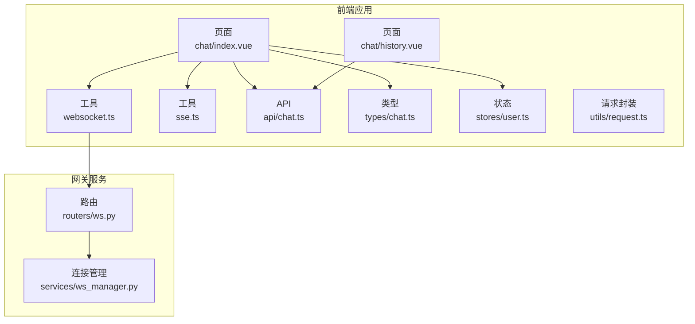
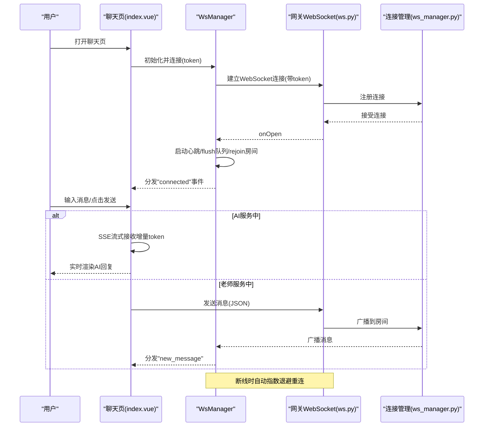
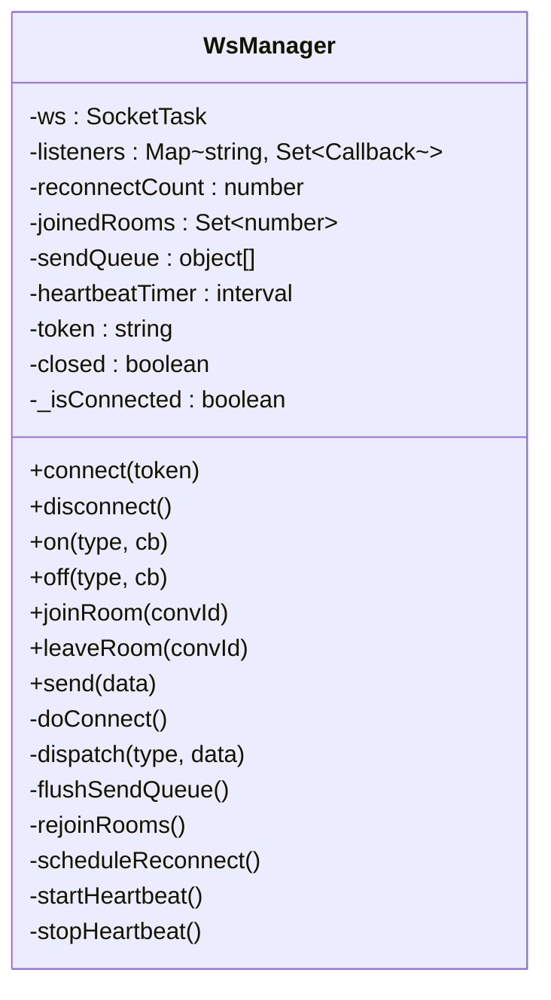
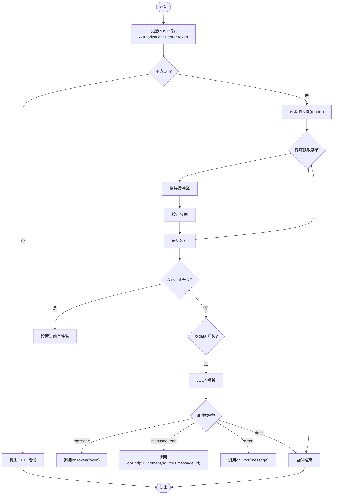
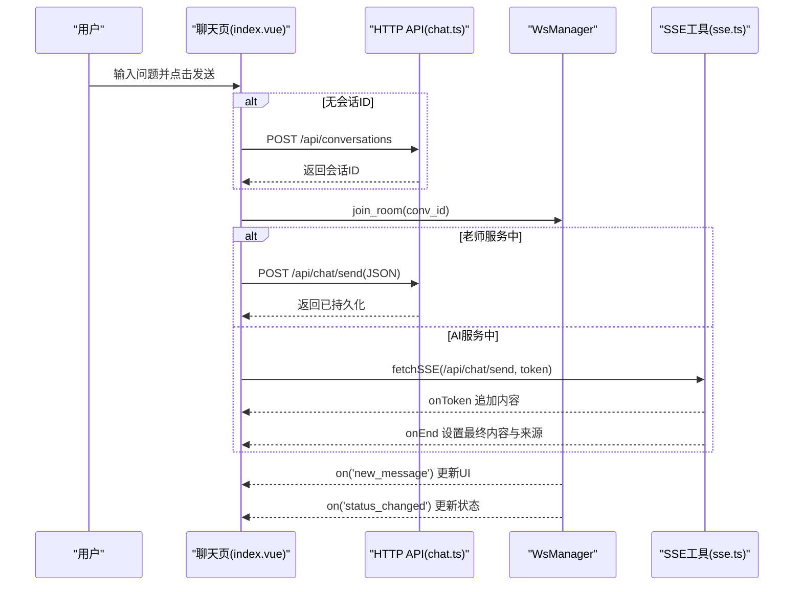
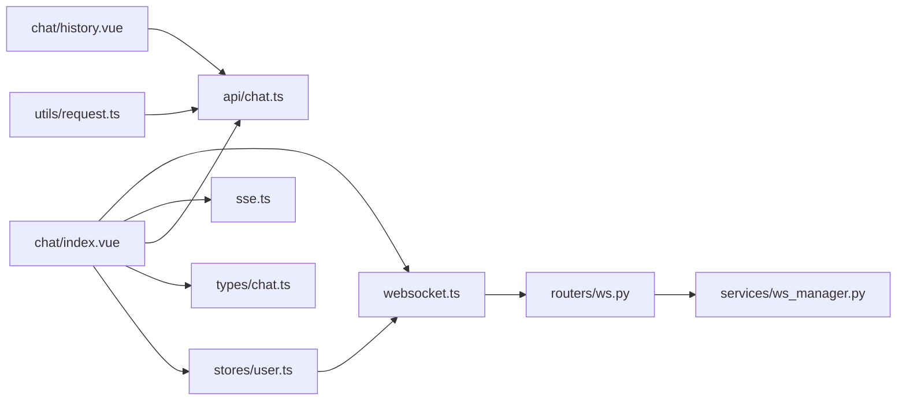

# 实时聊天系统

<cite>
**本文档引用的文件**
- [apps/student-app/src/utils/websocket.ts](file://apps/student-app/src/utils/websocket.ts)
- [apps/student-app/src/utils/sse.ts](file://apps/student-app/src/utils/sse.ts)
- [apps/student-app/src/api/chat.ts](file://apps/student-app/src/api/chat.ts)
- [apps/student-app/src/types/chat.ts](file://apps/student-app/src/types/chat.ts)
- [apps/student-app/src/pages/chat/index.vue](file://apps/student-app/src/pages/chat/index.vue)
- [apps/student-app/src/stores/user.ts](file://apps/student-app/src/stores/user.ts)
- [apps/student-app/src/utils/request.ts](file://apps/student-app/src/utils/request.ts)
- [apps/student-app/src/pages/chat/history.vue](file://apps/student-app/src/pages/chat/history.vue)
- [apps/student-app/src/main.ts](file://apps/student-app/src/main.ts)
- [services/gateway/app/routers/ws.py](file://services/gateway/app/routers/ws.py)
- [services/gateway/app/services/ws_manager.py](file://services/gateway/app/services/ws_manager.py)
</cite>

## 目录
1. [简介](#简介)
2. [项目结构](#项目结构)
3. [核心组件](#核心组件)
4. [架构总览](#架构总览)
5. [详细组件分析](#详细组件分析)
6. [依赖关系分析](#依赖关系分析)
7. [性能考虑](#性能考虑)
8. [故障排查指南](#故障排查指南)
9. [结论](#结论)
10. [附录](#附录)

## 简介
本系统为学生端实时聊天应用，采用双通道实时通信：WebSocket 用于会话房间内的即时消息与状态通知；SSE（Server-Sent Events）用于 AI 流式回复的增量输出。系统支持会话创建、历史查看、AI 流式回答、人工转接、断线重连、心跳保活、消息去重与界面渲染等完整功能链路。

## 项目结构
前端采用 Vue 3 + UniApp 架构，后端基于 FastAPI。前端主要模块包括：
- 页面层：聊天页、历史页、登录页等
- 组件层：自定义 TabBar 等
- 工具层：WebSocket 管理器、SSE 工具、HTTP 请求封装
- 类型层：消息与会话数据模型
- 服务层：聊天 API 封装
- 状态层：用户 Pinia Store
- 网关层：FastAPI WebSocket 路由与连接管理

图表来源
- [apps/student-app/src/pages/chat/index.vue:1-649](file://apps/student-app/src/pages/chat/index.vue#L1-L649)
- [apps/student-app/src/pages/chat/history.vue:1-145](file://apps/student-app/src/pages/chat/history.vue#L1-L145)
- [apps/student-app/src/utils/websocket.ts:1-153](file://apps/student-app/src/utils/websocket.ts#L1-L153)
- [apps/student-app/src/utils/sse.ts:1-69](file://apps/student-app/src/utils/sse.ts#L1-L69)
- [apps/student-app/src/api/chat.ts:1-36](file://apps/student-app/src/api/chat.ts#L1-L36)
- [apps/student-app/src/types/chat.ts:1-45](file://apps/student-app/src/types/chat.ts#L1-L45)
- [apps/student-app/src/stores/user.ts:1-56](file://apps/student-app/src/stores/user.ts#L1-L56)
- [apps/student-app/src/utils/request.ts:1-44](file://apps/student-app/src/utils/request.ts#L1-L44)
- [services/gateway/app/routers/ws.py:1-119](file://services/gateway/app/routers/ws.py#L1-L119)
- [services/gateway/app/services/ws_manager.py:1-100](file://services/gateway/app/services/ws_manager.py#L1-L100)

章节来源
- [apps/student-app/src/main.ts:1-11](file://apps/student-app/src/main.ts#L1-L11)
- [apps/student-app/src/pages/chat/index.vue:1-649](file://apps/student-app/src/pages/chat/index.vue#L1-L649)
- [apps/student-app/src/pages/chat/history.vue:1-145](file://apps/student-app/src/pages/chat/history.vue#L1-L145)
- [apps/student-app/src/utils/websocket.ts:1-153](file://apps/student-app/src/utils/websocket.ts#L1-L153)
- [apps/student-app/src/utils/sse.ts:1-69](file://apps/student-app/src/utils/sse.ts#L1-L69)
- [apps/student-app/src/api/chat.ts:1-36](file://apps/student-app/src/api/chat.ts#L1-L36)
- [apps/student-app/src/types/chat.ts:1-45](file://apps/student-app/src/types/chat.ts#L1-L45)
- [apps/student-app/src/stores/user.ts:1-56](file://apps/student-app/src/stores/user.ts#L1-L56)
- [apps/student-app/src/utils/request.ts:1-44](file://apps/student-app/src/utils/request.ts#L1-L44)
- [services/gateway/app/routers/ws.py:1-119](file://services/gateway/app/routers/ws.py#L1-L119)
- [services/gateway/app/services/ws_manager.py:1-100](file://services/gateway/app/services/ws_manager.py#L1-L100)

## 核心组件
- WebSocket 管理器（WsManager）：负责连接生命周期、消息分发、房间重入、发送队列、心跳保活、断线重连
- SSE 工具（fetchSSE）：封装流式事件解析，支持 message/message_end/error 事件回调
- 聊天页面（chat/index.vue）：消息渲染、输入控制、状态切换、AI 流式显示、人工转接
- 历史页面（chat/history.vue）：会话列表、状态标签、时间格式化
- 用户 Store（stores/user.ts）：登录初始化、Token 存储、登出断开连接
- 请求封装（utils/request.ts）：统一 HTTP 错误处理、鉴权头注入
- 网关 WebSocket 路由（routers/ws.py）：JWT 认证、消息类型处理、房间广播
- 连接管理（services/ws_manager.py）：用户连接、房间广播、清理逻辑

章节来源
- [apps/student-app/src/utils/websocket.ts:1-153](file://apps/student-app/src/utils/websocket.ts#L1-L153)
- [apps/student-app/src/utils/sse.ts:1-69](file://apps/student-app/src/utils/sse.ts#L1-L69)
- [apps/student-app/src/pages/chat/index.vue:1-649](file://apps/student-app/src/pages/chat/index.vue#L1-L649)
- [apps/student-app/src/pages/chat/history.vue:1-145](file://apps/student-app/src/pages/chat/history.vue#L1-L145)
- [apps/student-app/src/stores/user.ts:1-56](file://apps/student-app/src/stores/user.ts#L1-L56)
- [apps/student-app/src/utils/request.ts:1-44](file://apps/student-app/src/utils/request.ts#L1-L44)
- [services/gateway/app/routers/ws.py:1-119](file://services/gateway/app/routers/ws.py#L1-L119)
- [services/gateway/app/services/ws_manager.py:1-100](file://services/gateway/app/services/ws_manager.py#L1-L100)

## 架构总览
系统采用“前端页面 + 工具层 + 网关服务”的分层设计。前端通过 WebSocket 与网关建立长连接，实现消息与状态的双向实时推送；通过 SSE 获取 AI 的流式增量输出；通过 HTTP API 创建/查询会话与消息。

图表来源
- [apps/student-app/src/pages/chat/index.vue:249-276](file://apps/student-app/src/pages/chat/index.vue#L249-L276)
- [apps/student-app/src/utils/websocket.ts:20-64](file://apps/student-app/src/utils/websocket.ts#L20-L64)
- [services/gateway/app/routers/ws.py:11-119](file://services/gateway/app/routers/ws.py#L11-L119)
- [services/gateway/app/services/ws_manager.py:25-82](file://services/gateway/app/services/ws_manager.py#L25-L82)

## 详细组件分析

### WebSocket 工具类（WsManager）
- 连接管理
  - 自动识别协议（http/https）与主机，拼接带 token 的连接地址
  - onOpen/onMessage/onClose/onError 回调统一处理
  - 连接成功后启动心跳、清空发送队列、重入房间、触发连接事件
- 消息分发
  - 维护类型到回调集合的映射，dispatch 统一分发
  - 忽略 ping 响应，避免重复处理
- 心跳检测
  - 每 30 秒发送 ping，保持连接活跃
- 断线重连
  - 指数退避（最大 30 秒），最多重连 N 次
  - 重连时自动 rejoin 已加入的房间
- 发送队列
  - 未连接时将消息入队，连接后顺序 flush
- 房间管理
  - joinRoom/leaveRoom 维护房间集合，支持重连后自动 rejoin

图表来源
- [apps/student-app/src/utils/websocket.ts:1-153](file://apps/student-app/src/utils/websocket.ts#L1-L153)

章节来源
- [apps/student-app/src/utils/websocket.ts:1-153](file://apps/student-app/src/utils/websocket.ts#L1-L153)

### SSE 工具（fetchSSE）
- 请求构建：POST /api/chat/send，携带 Authorization 头
- 事件解析：逐行解析 event/data，识别 message/token、message_end/full_content/sources、error
- 错误处理：非 OK 状态抛出错误；JSON 解析失败忽略
- 回调驱动：onToken 追加增量 token；onEnd 设置最终内容与来源；onError 显示错误提示

图表来源
- [apps/student-app/src/utils/sse.ts:13-69](file://apps/student-app/src/utils/sse.ts#L13-L69)

章节来源
- [apps/student-app/src/utils/sse.ts:1-69](file://apps/student-app/src/utils/sse.ts#L1-L69)

### 聊天页面（chat/index.vue）
- 生命周期与状态
  - onShow/onHide 注册/注销 WebSocket 监听，进入/离开房间
  - onMounted 处理外部传入的初始查询，自动发起首次发送
- 消息渲染
  - 用户消息、系统消息、老师消息、AI 消息四种角色
  - Markdown 渲染、流式光标、来源引用卡片
- 交互逻辑
  - 输入校验、发送按钮禁用、滚动到底部
  - AI 流式：先插入占位消息，再增量更新内容
  - 人工转接：escalate 接口，状态切换为 pending_teacher
- 会话加载
  - getConversation 获取当前状态
  - getMessages 加载历史消息并映射为前端消息模型

图表来源
- [apps/student-app/src/pages/chat/index.vue:369-481](file://apps/student-app/src/pages/chat/index.vue#L369-L481)
- [apps/student-app/src/api/chat.ts:1-36](file://apps/student-app/src/api/chat.ts#L1-L36)
- [apps/student-app/src/utils/sse.ts:13-69](file://apps/student-app/src/utils/sse.ts#L13-L69)
- [apps/student-app/src/utils/websocket.ts:76-127](file://apps/student-app/src/utils/websocket.ts#L76-L127)

章节来源
- [apps/student-app/src/pages/chat/index.vue:1-649](file://apps/student-app/src/pages/chat/index.vue#L1-L649)
- [apps/student-app/src/api/chat.ts:1-36](file://apps/student-app/src/api/chat.ts#L1-L36)
- [apps/student-app/src/utils/sse.ts:1-69](file://apps/student-app/src/utils/sse.ts#L1-L69)
- [apps/student-app/src/utils/websocket.ts:1-153](file://apps/student-app/src/utils/websocket.ts#L1-L153)

### 历史页面（chat/history.vue）
- 列表加载：分页加载会话，支持下拉刷新与上滑加载更多
- 状态标签：根据状态映射显示不同颜色徽章
- 时间格式化：今日显示时分，否则显示月日时分
- 打开会话：存储会话ID并跳转到聊天页

章节来源
- [apps/student-app/src/pages/chat/history.vue:1-145](file://apps/student-app/src/pages/chat/history.vue#L1-L145)
- [apps/student-app/src/api/chat.ts:17-21](file://apps/student-app/src/api/chat.ts#L17-L21)

### 用户 Store（stores/user.ts）
- 登录初始化：从本地存储读取 Token 与用户信息，自动连接 WebSocket
- 登出：清除本地存储并断开 WebSocket
- 与 WebSocket 管理器耦合，确保登录态与连接态一致

章节来源
- [apps/student-app/src/stores/user.ts:1-56](file://apps/student-app/src/stores/user.ts#L1-L56)
- [apps/student-app/src/utils/websocket.ts:20-24](file://apps/student-app/src/utils/websocket.ts#L20-L24)

### 请求封装（utils/request.ts）
- 统一 Header：自动注入 Authorization: Bearer token
- 统一错误处理：401 跳转登录；422 参数错误；其他 HTTP 错误
- 失败兜底：网络错误统一提示

章节来源
- [apps/student-app/src/utils/request.ts:1-44](file://apps/student-app/src/utils/request.ts#L1-L44)

### 网关 WebSocket 路由（routers/ws.py）
- 认证：JWT 解码，校验失败返回 4001 关闭
- 连接注册：manager.connect(ws, user_id)
- 消息处理：ping/pong、join_room/leave_room、typing、send_message
- 广播：房间内广播 new_message/status_changed 等

章节来源
- [services/gateway/app/routers/ws.py:1-119](file://services/gateway/app/routers/ws.py#L1-L119)

### 连接管理（services/ws_manager.py）
- 用户连接映射：user_id → WebSocket 集合
- 房间广播：room_id → WebSocket 集合
- 清理：断开连接时从用户与房间映射中移除
- 广播失败处理：收集死连接并清理

章节来源
- [services/gateway/app/services/ws_manager.py:1-100](file://services/gateway/app/services/ws_manager.py#L1-L100)

## 依赖关系分析
- 前端页面依赖 WebSocket 管理器与 SSE 工具进行实时通信
- 页面依赖 API 封装与类型定义进行数据交互
- 用户 Store 依赖 WebSocket 管理器进行连接生命周期管理
- 网关路由依赖连接管理器进行房间广播与用户映射
- 前端请求封装统一处理鉴权与错误

图表来源
- [apps/student-app/src/pages/chat/index.vue:198-207](file://apps/student-app/src/pages/chat/index.vue#L198-L207)
- [apps/student-app/src/utils/websocket.ts:1-153](file://apps/student-app/src/utils/websocket.ts#L1-L153)
- [apps/student-app/src/utils/sse.ts:1-69](file://apps/student-app/src/utils/sse.ts#L1-L69)
- [apps/student-app/src/api/chat.ts:1-36](file://apps/student-app/src/api/chat.ts#L1-L36)
- [apps/student-app/src/types/chat.ts:1-45](file://apps/student-app/src/types/chat.ts#L1-L45)
- [apps/student-app/src/stores/user.ts:1-56](file://apps/student-app/src/stores/user.ts#L1-L56)
- [apps/student-app/src/utils/request.ts:1-44](file://apps/student-app/src/utils/request.ts#L1-L44)
- [services/gateway/app/routers/ws.py:1-119](file://services/gateway/app/routers/ws.py#L1-L119)
- [services/gateway/app/services/ws_manager.py:1-100](file://services/gateway/app/services/ws_manager.py#L1-L100)

## 性能考虑
- 连接池管理
  - 单用户多连接场景：后端通过 user_connections 集合管理，避免重复广播
  - 前端单实例 WsManager，避免重复连接
- 消息去重
  - 前端按消息 ID 去重插入，避免重复渲染
  - 后端广播时对死连接进行清理，减少无效广播
- 批量处理
  - 发送队列 flush：未连接时批量缓存消息，连接后一次性发送，降低握手次数
  - 房间广播：一次广播覆盖房间内所有连接
- 心跳与保活
  - 前端 30 秒心跳，后端收到 ping 立即 pong，维持连接活跃
- 界面渲染优化
  - 流式渲染：先插入占位消息，再增量更新，提升感知速度
  - 滚动优化：nextTick + 随机偏移，确保滚动到底部

[本节为通用性能指导，无需具体文件分析]

## 故障排查指南
- WebSocket 连接失败
  - 检查 Token 是否有效，后端是否返回 4001
  - 查看前端日志中的连接/断开事件
  - 确认 host 与协议匹配（http/https）
- 断线重连
  - 观察指数退避日志，确认最大重连次数
  - 重连后检查房间 rejoin 是否成功
- SSE 流式异常
  - 确认 /api/chat/send 返回 200，事件格式正确
  - onEnd 未触发时检查服务端是否正常结束事件
- 401 未授权
  - 前端会自动登出并跳转登录页，检查本地存储与请求头
- 人工转接无效
  - 检查 escalate 接口返回与状态变更事件

章节来源
- [apps/student-app/src/utils/websocket.ts:53-63](file://apps/student-app/src/utils/websocket.ts#L53-L63)
- [apps/student-app/src/utils/sse.ts:28-31](file://apps/student-app/src/utils/sse.ts#L28-L31)
- [apps/student-app/src/utils/request.ts:25-36](file://apps/student-app/src/utils/request.ts#L25-L36)
- [services/gateway/app/routers/ws.py:40-42](file://services/gateway/app/routers/ws.py#L40-L42)

## 结论
该系统通过 WebSocket 与 SSE 的组合实现了高效稳定的实时通信：WebSocket 负责房间内消息与状态通知，SSE 提供 AI 流式增量输出体验。前后端职责清晰，前端具备完善的连接管理、断线重连与界面渲染能力，后端提供可靠的房间广播与连接清理机制。整体架构简洁、扩展性强，适合在移动端与 H5 场景稳定运行。

[本节为总结性内容，无需具体文件分析]

## 附录
- 数据模型
  - Message：包含 id、role、content、sources、timestamp、isStreaming
  - ConversationResponse：会话基本信息与状态
  - MessageResponse：服务端消息结构，含元数据 sources
- 消息格式
  - WebSocket 上行：join_room、leave_room、send_message、typing、ping
  - WebSocket 下行：new_message、status_changed、escalation_notify、teacher_typing、pong、error
  - SSE 事件：message（token）、message_end（full_content/sources）、error

章节来源
- [apps/student-app/src/types/chat.ts:7-37](file://apps/student-app/src/types/chat.ts#L7-L37)
- [services/gateway/app/routers/ws.py:20-34](file://services/gateway/app/routers/ws.py#L20-L34)