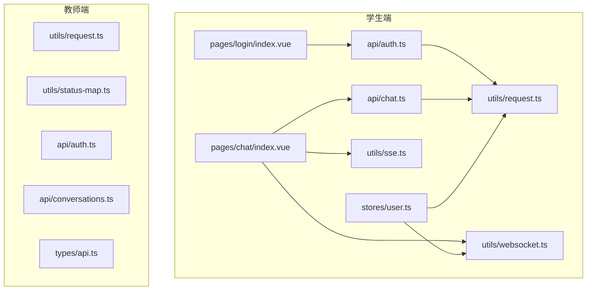
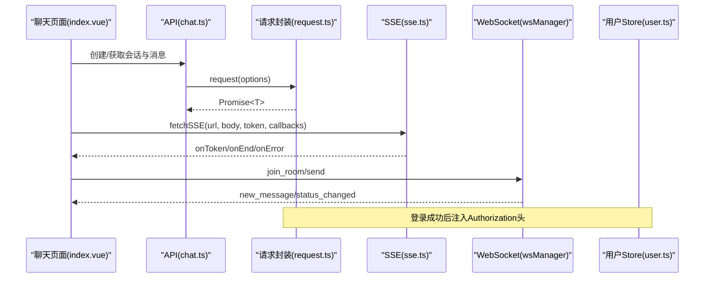
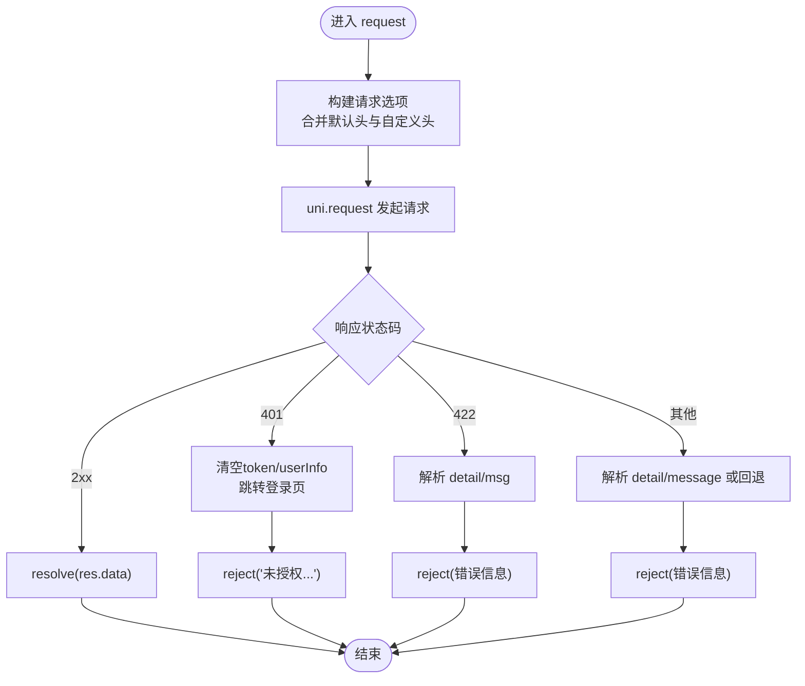
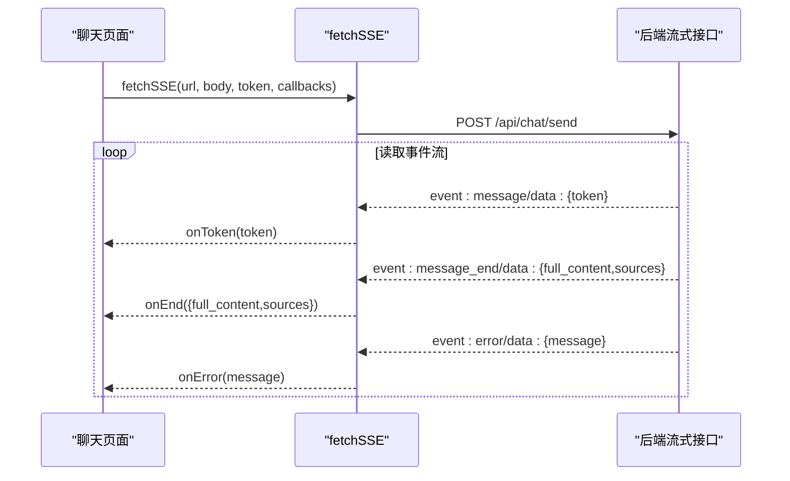
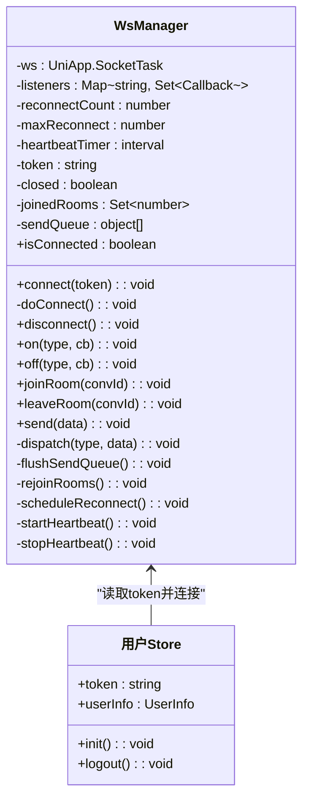
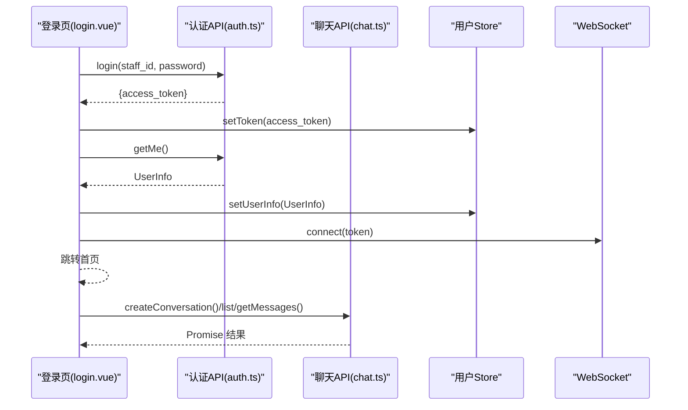
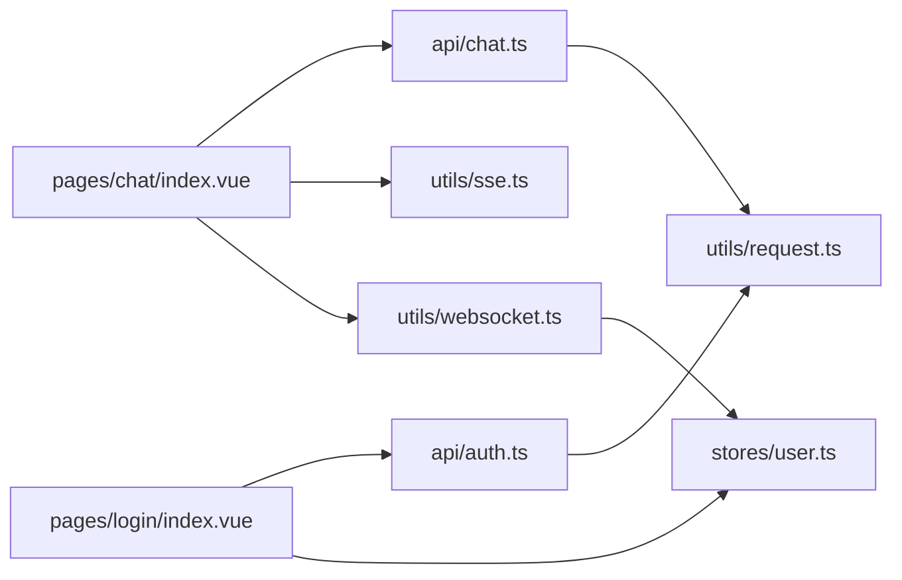

# 工具函数与辅助模块

<cite>
**本文档引用的文件**
- [apps/student-app/src/utils/request.ts](file://apps/student-app/src/utils/request.ts)
- [apps/student-app/src/utils/sse.ts](file://apps/student-app/src/utils/sse.ts)
- [apps/student-app/src/utils/websocket.ts](file://apps/student-app/src/utils/websocket.ts)
- [apps/student-app/src/stores/user.ts](file://apps/student-app/src/stores/user.ts)
- [apps/student-app/src/api/auth.ts](file://apps/student-app/src/api/auth.ts)
- [apps/student-app/src/api/chat.ts](file://apps/student-app/src/api/chat.ts)
- [apps/student-app/src/pages/chat/index.vue](file://apps/student-app/src/pages/chat/index.vue)
- [apps/student-app/src/pages/login/index.vue](file://apps/student-app/src/pages/login/index.vue)
- [apps/student-app/src/types/chat.ts](file://apps/student-app/src/types/chat.ts)
- [apps/teacher-app/src/utils/request.ts](file://apps/teacher-app/src/utils/request.ts)
- [apps/teacher-app/src/utils/status-map.ts](file://apps/teacher-app/src/utils/status-map.ts)
- [apps/teacher-app/src/api/auth.ts](file://apps/teacher-app/src/api/auth.ts)
- [apps/teacher-app/src/api/conversations.ts](file://apps/teacher-app/src/api/conversations.ts)
- [apps/teacher-app/src/types/api.ts](file://apps/teacher-app/src/types/api.ts)
</cite>

## 目录
1. [简介](#简介)
2. [项目结构](#项目结构)
3. [核心组件](#核心组件)
4. [架构总览](#架构总览)
5. [详细组件分析](#详细组件分析)
6. [依赖分析](#依赖分析)
7. [性能考虑](#性能考虑)
8. [故障排查指南](#故障排查指南)
9. [结论](#结论)
10. [附录](#附录)

## 简介
本文件聚焦于学生端工具函数与辅助模块，系统性梳理并解析以下能力：
- HTTP 请求封装与统一错误处理
- SSE 流式响应处理
- WebSocket 连接管理与事件分发
- 登录态与本地存储管理
- 类型定义与 API 使用示例
- 测试策略、性能优化与扩展开发指南
- 与页面、API 层及 Pinia Store 的集成关系

## 项目结构
学生端与教师端均提供独立的工具函数库与 API 封装，二者在架构上保持一致但细节略有差异：
- 学生端：基于 uni.request 的轻量封装，结合 SSE 与 WebSocket 实现聊天体验
- 教师端：基于 uni.request 的增强封装，支持查询参数拼接、超时控制与方法级封装

图表来源
- [apps/student-app/src/utils/request.ts:1-44](file://apps/student-app/src/utils/request.ts#L1-L44)
- [apps/student-app/src/utils/sse.ts:1-69](file://apps/student-app/src/utils/sse.ts#L1-L69)
- [apps/student-app/src/utils/websocket.ts:1-153](file://apps/student-app/src/utils/websocket.ts#L1-L153)
- [apps/student-app/src/stores/user.ts:1-56](file://apps/student-app/src/stores/user.ts#L1-L56)
- [apps/student-app/src/api/auth.ts:1-20](file://apps/student-app/src/api/auth.ts#L1-L20)
- [apps/student-app/src/api/chat.ts:1-36](file://apps/student-app/src/api/chat.ts#L1-L36)
- [apps/student-app/src/pages/login/index.vue:1-148](file://apps/student-app/src/pages/login/index.vue#L1-L148)
- [apps/student-app/src/pages/chat/index.vue:1-649](file://apps/student-app/src/pages/chat/index.vue#L1-L649)
- [apps/teacher-app/src/utils/request.ts:1-108](file://apps/teacher-app/src/utils/request.ts#L1-L108)
- [apps/teacher-app/src/utils/status-map.ts:1-30](file://apps/teacher-app/src/utils/status-map.ts#L1-L30)
- [apps/teacher-app/src/api/auth.ts:1-43](file://apps/teacher-app/src/api/auth.ts#L1-L43)
- [apps/teacher-app/src/api/conversations.ts:1-44](file://apps/teacher-app/src/api/conversations.ts#L1-L44)
- [apps/teacher-app/src/types/api.ts:1-51](file://apps/teacher-app/src/types/api.ts#L1-L51)

章节来源
- [apps/student-app/src/utils/request.ts:1-44](file://apps/student-app/src/utils/request.ts#L1-L44)
- [apps/teacher-app/src/utils/request.ts:1-108](file://apps/teacher-app/src/utils/request.ts#L1-L108)

## 核心组件
- HTTP 请求封装（学生端）
  - 统一封装 uni.request，自动注入 Authorization 头，处理 401、422 及其他错误码，支持 Promise 化调用
  - 关键点：Vite 代理路径由 API_BASE 控制；401 触发登出与跳转
- SSE 流式响应
  - 基于 fetch + ReadableStream 解析服务端事件，回调 onToken/onEnd/onError
  - 用于 AI 流式输出与来源信息聚合
- WebSocket 管理
  - WsManager 提供连接、心跳、断线重连、房间加入/离开、消息派发与发送队列
  - 与 Pinia Store 的 token 同步，初始化即建立连接
- 登录态与本地存储
  - Pinia Store 管理 token 与用户信息，持久化至 uni.storage；登录成功后触发 WebSocket 连接
- 类型定义与 API 使用
  - 学生端提供聊天消息、会话、来源等类型；API 层通过 request.ts 封装具体接口
  - 教师端提供会话、消息、分页结果等类型与对应 API

章节来源
- [apps/student-app/src/utils/request.ts:1-44](file://apps/student-app/src/utils/request.ts#L1-L44)
- [apps/student-app/src/utils/sse.ts:1-69](file://apps/student-app/src/utils/sse.ts#L1-L69)
- [apps/student-app/src/utils/websocket.ts:1-153](file://apps/student-app/src/utils/websocket.ts#L1-L153)
- [apps/student-app/src/stores/user.ts:1-56](file://apps/student-app/src/stores/user.ts#L1-L56)
- [apps/student-app/src/types/chat.ts:1-45](file://apps/student-app/src/types/chat.ts#L1-L45)
- [apps/teacher-app/src/types/api.ts:1-51](file://apps/teacher-app/src/types/api.ts#L1-L51)

## 架构总览
下图展示了“页面 → API → 工具函数 → 服务端”的调用链路，以及 SSE 与 WebSocket 在聊天页面中的协同工作。

图表来源
- [apps/student-app/src/pages/chat/index.vue:198-649](file://apps/student-app/src/pages/chat/index.vue#L198-L649)
- [apps/student-app/src/api/chat.ts:1-36](file://apps/student-app/src/api/chat.ts#L1-L36)
- [apps/student-app/src/utils/request.ts:1-44](file://apps/student-app/src/utils/request.ts#L1-L44)
- [apps/student-app/src/utils/sse.ts:1-69](file://apps/student-app/src/utils/sse.ts#L1-L69)
- [apps/student-app/src/utils/websocket.ts:1-153](file://apps/student-app/src/utils/websocket.ts#L1-L153)
- [apps/student-app/src/stores/user.ts:1-56](file://apps/student-app/src/stores/user.ts#L1-L56)

## 详细组件分析

### 学生端 HTTP 请求封装（request.ts）
- 功能要点
  - 统一入口：接收 { url, method, data, header }，返回 Promise<T>
  - 自动注入 Authorization：从用户 Store 读取 token
  - 状态码处理：2xx 成功；401 触发登出与跳转；422 参数错误提取 detail；其他错误提取 detail/message 或回退 HTTP 状态
  - Vite 代理：API_BASE 为空字符串，由 /api 代理到后端服务
- 错误处理与用户体验
  - 401：清理本地状态并跳转登录页
  - 422：解析字段级错误提示
  - 其他错误：优先使用服务端 detail/message，否则回退为 HTTP 状态描述
- 适用场景
  - 登录、获取用户信息、会话与消息列表、转人工等

图表来源
- [apps/student-app/src/utils/request.ts:1-44](file://apps/student-app/src/utils/request.ts#L1-L44)

章节来源
- [apps/student-app/src/utils/request.ts:1-44](file://apps/student-app/src/utils/request.ts#L1-L44)

### SSE 流式响应（sse.ts）
- 功能要点
  - fetch + ReadableStream 逐行解析服务端事件
  - 事件类型：message（增量 token）、message_end（最终内容与来源）、error（错误）
  - 回调：onToken、onEnd、onError
- 使用场景
  - AI 流式回答与来源聚合展示
- 注意事项
  - 需要服务端正确设置 Content-Type 与事件流格式
  - 客户端需处理非数据行与 JSON 解析异常

图表来源
- [apps/student-app/src/utils/sse.ts:1-69](file://apps/student-app/src/utils/sse.ts#L1-L69)
- [apps/student-app/src/pages/chat/index.vue:423-481](file://apps/student-app/src/pages/chat/index.vue#L423-L481)

章节来源
- [apps/student-app/src/utils/sse.ts:1-69](file://apps/student-app/src/utils/sse.ts#L1-L69)
- [apps/student-app/src/pages/chat/index.vue:423-481](file://apps/student-app/src/pages/chat/index.vue#L423-L481)

### WebSocket 管理（websocket.ts）
- 功能要点
  - 连接与断开：自动注入 token，支持断线重连（指数退避，上限 30 秒）
  - 心跳：每 30 秒发送 ping，维持长连接
  - 房间管理：join_room/leave_room，重连后自动 re-join
  - 发送队列：未连接时缓存，连上后 flush
  - 事件分发：dispatch(type, data)，统一交给注册的监听者
- 与 Store 集成
  - 初始化时读取 token 并连接；登出时断开连接并清空状态
- 使用场景
  - 实时消息推送、状态变更通知

图表来源
- [apps/student-app/src/utils/websocket.ts:1-153](file://apps/student-app/src/utils/websocket.ts#L1-L153)
- [apps/student-app/src/stores/user.ts:1-56](file://apps/student-app/src/stores/user.ts#L1-L56)

章节来源
- [apps/student-app/src/utils/websocket.ts:1-153](file://apps/student-app/src/utils/websocket.ts#L1-L153)
- [apps/student-app/src/stores/user.ts:1-56](file://apps/student-app/src/stores/user.ts#L1-L56)

### 登录与会话 API（学生端）
- 登录流程
  - 输入学号与密码 → 调用登录接口 → 写入 token 与用户信息 → 建立 WebSocket 连接 → 跳转首页
- 会话与消息
  - 创建会话、分页获取会话列表、获取指定会话详情与消息列表
  - 转人工：当 AI 无法回答时，触发 escalate

图表来源
- [apps/student-app/src/pages/login/index.vue:70-97](file://apps/student-app/src/pages/login/index.vue#L70-L97)
- [apps/student-app/src/api/auth.ts:1-20](file://apps/student-app/src/api/auth.ts#L1-L20)
- [apps/student-app/src/api/chat.ts:1-36](file://apps/student-app/src/api/chat.ts#L1-L36)
- [apps/student-app/src/stores/user.ts:1-56](file://apps/student-app/src/stores/user.ts#L1-L56)
- [apps/student-app/src/utils/websocket.ts:1-153](file://apps/student-app/src/utils/websocket.ts#L1-L153)

章节来源
- [apps/student-app/src/pages/login/index.vue:70-97](file://apps/student-app/src/pages/login/index.vue#L70-L97)
- [apps/student-app/src/api/auth.ts:1-20](file://apps/student-app/src/api/auth.ts#L1-L20)
- [apps/student-app/src/api/chat.ts:1-36](file://apps/student-app/src/api/chat.ts#L1-L36)
- [apps/student-app/src/stores/user.ts:1-56](file://apps/student-app/src/stores/user.ts#L1-L56)

### 教师端请求封装与状态映射（对比参考）
- 教师端 request.ts
  - 支持查询参数拼接、超时控制、方法级封装（get/post/put/del）
  - 统一注入 Authorization，401 跳转登录并提示
- 教师端状态映射
  - 提供状态文本与样式类映射工具，便于 UI 展示

章节来源
- [apps/teacher-app/src/utils/request.ts:1-108](file://apps/teacher-app/src/utils/request.ts#L1-L108)
- [apps/teacher-app/src/utils/status-map.ts:1-30](file://apps/teacher-app/src/utils/status-map.ts#L1-L30)

## 依赖分析
- 页面对工具函数的依赖
  - 聊天页依赖 request.ts、sse.ts、websocket.ts 与 user.ts
  - 登录页依赖 auth.ts 与 user.ts
- API 对工具函数的依赖
  - chat.ts、auth.ts 通过 request.ts 封装具体接口
- 类型定义对 API 的依赖
  - student-app/types/chat.ts 与 teacher-app/types/api.ts 为 API 返回值提供类型约束

图表来源
- [apps/student-app/src/pages/chat/index.vue:198-649](file://apps/student-app/src/pages/chat/index.vue#L198-L649)
- [apps/student-app/src/pages/login/index.vue:58-148](file://apps/student-app/src/pages/login/index.vue#L58-L148)
- [apps/student-app/src/api/chat.ts:1-36](file://apps/student-app/src/api/chat.ts#L1-L36)
- [apps/student-app/src/api/auth.ts:1-20](file://apps/student-app/src/api/auth.ts#L1-L20)
- [apps/student-app/src/utils/request.ts:1-44](file://apps/student-app/src/utils/request.ts#L1-L44)
- [apps/student-app/src/utils/sse.ts:1-69](file://apps/student-app/src/utils/sse.ts#L1-L69)
- [apps/student-app/src/utils/websocket.ts:1-153](file://apps/student-app/src/utils/websocket.ts#L1-L153)
- [apps/student-app/src/stores/user.ts:1-56](file://apps/student-app/src/stores/user.ts#L1-L56)

## 性能考虑
- 请求层面
  - 合理设置超时时间，避免长时间阻塞 UI
  - 对高频请求进行去抖/节流（如滚动加载）
- SSE 层面
  - 流式渲染时避免频繁 DOM 更新，采用批量更新策略
  - 控制消息长度与来源数量，减少渲染压力
- WebSocket 层面
  - 心跳间隔与重连策略平衡稳定性与资源消耗
  - 发送队列在内存中缓存对象，注意及时清理
- 存储层面
  - 仅缓存必要信息，避免占用过多本地存储空间

## 故障排查指南
- 登录后立即 401
  - 检查 token 是否正确写入与读取
  - 确认请求头 Authorization 是否随请求发送
- 请求报错“请求参数错误”
  - 查看 422 错误详情，定位字段级校验失败项
- SSE 无法接收事件
  - 确认服务端事件流格式是否符合 message/data/event: 格式
  - 检查网络与跨域配置
- WebSocket 断线频繁
  - 检查心跳与重连逻辑，确认服务端是否正确处理 ping/pong
  - 关注断线后的 re-join 与发送队列 flush
- 页面无消息更新
  - 确认已注册 WebSocket 监听并在 onShow/onHide 中正确加入/离开房间

章节来源
- [apps/student-app/src/utils/request.ts:25-36](file://apps/student-app/src/utils/request.ts#L25-L36)
- [apps/student-app/src/utils/sse.ts:28-31](file://apps/student-app/src/utils/sse.ts#L28-L31)
- [apps/student-app/src/utils/websocket.ts:129-135](file://apps/student-app/src/utils/websocket.ts#L129-L135)

## 结论
学生端工具函数与辅助模块围绕“请求封装、SSE 流式响应、WebSocket 实时通信”三大支柱构建，配合 Pinia Store 实现登录态与本地存储管理。该设计在保证功能完整性的同时，兼顾了错误处理、用户体验与可维护性。教师端提供了更完善的请求封装与状态映射工具，可作为扩展与对齐的参考。

## 附录

### 常用工具函数使用示例与最佳实践
- 登录
  - 步骤：输入学号/密码 → 调用登录接口 → 写入 token 与用户信息 → 建立 WebSocket 连接 → 跳转首页
  - 最佳实践：登录成功后立即初始化 WebSocket，避免消息丢失
- 创建会话与获取消息
  - 步骤：首次发送时创建会话 → 获取会话详情与历史消息 → 加入房间
  - 最佳实践：分页加载消息，避免一次性拉取过多数据
- 流式回答
  - 步骤：调用 SSE 接口 → onToken 累加内容 → onEnd 完善全文与来源 → onError 显示错误
  - 最佳实践：渲染时采用防抖更新，避免频繁重排
- 转人工
  - 步骤：检测拒答关键词 → 触发 escalate → 等待状态变更
  - 最佳实践：在状态变更回调中插入系统提示消息

章节来源
- [apps/student-app/src/pages/login/index.vue:70-97](file://apps/student-app/src/pages/login/index.vue#L70-L97)
- [apps/student-app/src/pages/chat/index.vue:328-481](file://apps/student-app/src/pages/chat/index.vue#L328-L481)
- [apps/student-app/src/api/chat.ts:9-35](file://apps/student-app/src/api/chat.ts#L9-L35)

### 测试策略
- 单元测试
  - request.ts：模拟不同状态码（200/401/422/其他），验证 Promise 结果与错误抛出
  - sse.ts：构造事件流片段，验证 onToken/onEnd/onError 回调触发
  - websocket.ts：模拟连接/断开/重连，验证心跳与 re-join 逻辑
- 集成测试
  - 登录流程：覆盖 token 写入、用户信息获取、WebSocket 连接
  - 聊天流程：覆盖创建会话、历史消息、SSE 流式渲染、WebSocket 推送
- 回归测试
  - 断网/弱网场景：验证重连与发送队列行为
  - 参数错误：验证 422 错误提示与 UI 反馈

### 扩展开发指南
- 新增请求接口
  - 在对应 API 文件中新增函数，复用 request.ts；如需查询参数，参考教师端的 get 封装
- 新增 SSE 场景
  - 确保服务端事件流格式规范；在页面中注册回调并处理渲染
- 新增 WebSocket 事件
  - 在 wsManager 中保持统一派发；在页面中注册监听并在生命周期中正确加入/离开房间
- 类型安全
  - 为新增 API 返回值补充类型定义，确保前后端契约一致