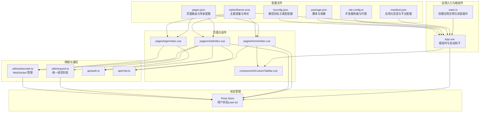
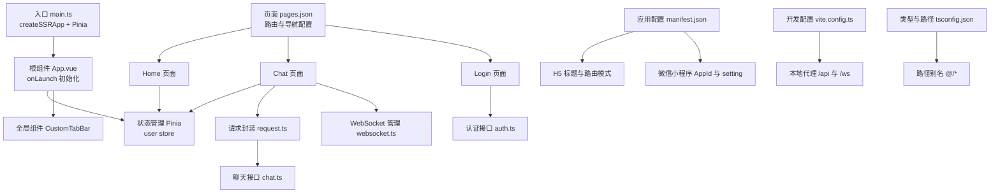
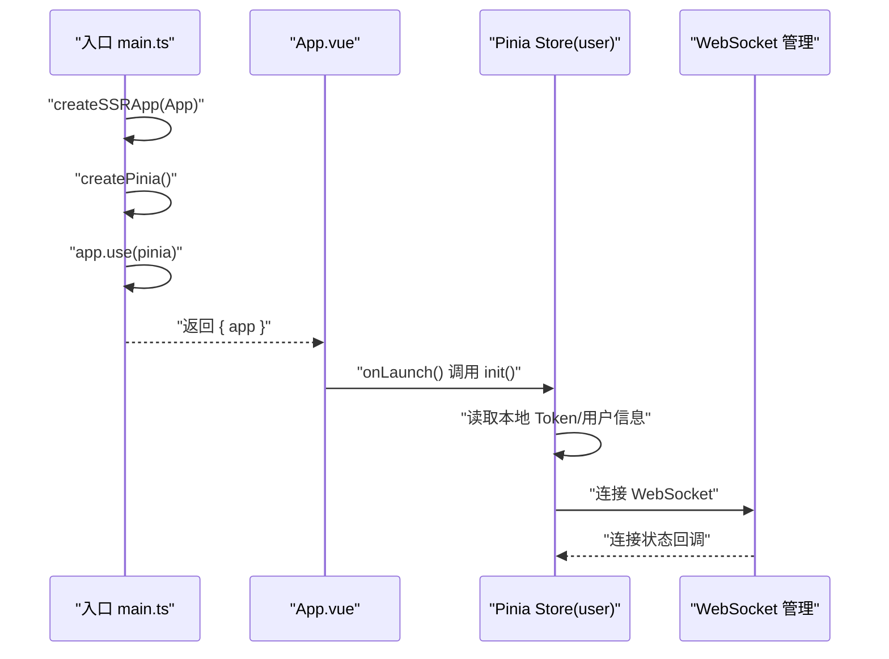
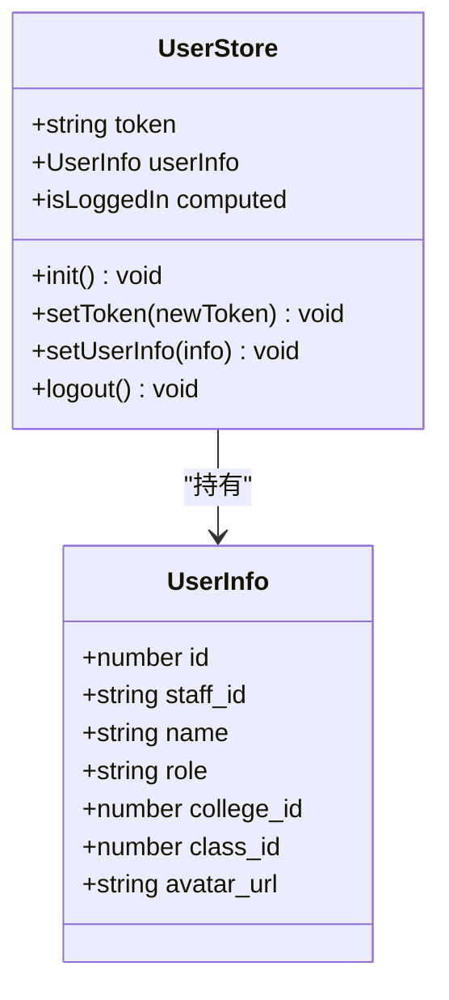
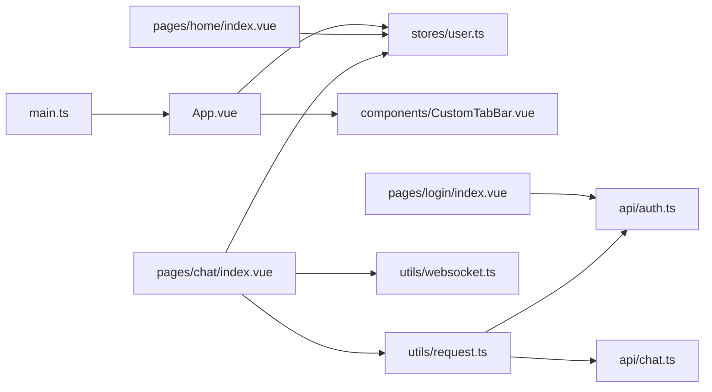

# 应用入口与配置

<cite>
**本文档引用的文件**
- [apps/student-app/src/main.ts](file://apps/student-app/src/main.ts)
- [apps/student-app/src/App.vue](file://apps/student-app/src/App.vue)
- [apps/student-app/src/stores/user.ts](file://apps/student-app/src/stores/user.ts)
- [apps/student-app/src/manifest.json](file://apps/student-app/src/manifest.json)
- [apps/student-app/src/pages.json](file://apps/student-app/src/pages.json)
- [apps/student-app/src/styles/theme.scss](file://apps/student-app/src/styles/theme.scss)
- [apps/student-app/src/components/CustomTabBar.vue](file://apps/student-app/src/components/CustomTabBar.vue)
- [apps/student-app/src/utils/websocket.ts](file://apps/student-app/src/utils/websocket.ts)
- [apps/student-app/src/utils/request.ts](file://apps/student-app/src/utils/request.ts)
- [apps/student-app/src/api/auth.ts](file://apps/student-app/src/api/auth.ts)
- [apps/student-app/src/api/chat.ts](file://apps/student-app/src/api/chat.ts)
- [apps/student-app/src/pages/home/index.vue](file://apps/student-app/src/pages/home/index.vue)
- [apps/student-app/src/pages/chat/index.vue](file://apps/student-app/src/pages/chat/index.vue)
- [apps/student-app/src/pages/login/index.vue](file://apps/student-app/src/pages/login/index.vue)
- [apps/student-app/package.json](file://apps/student-app/package.json)
- [apps/student-app/vite.config.ts](file://apps/student-app/vite.config.ts)
- [apps/student-app/tsconfig.json](file://apps/student-app/tsconfig.json)
</cite>

## 目录
1. [引言](#引言)
2. [项目结构](#项目结构)
3. [核心组件](#核心组件)
4. [架构总览](#架构总览)
5. [详细组件分析](#详细组件分析)
6. [依赖关系分析](#依赖关系分析)
7. [性能考虑](#性能考虑)
8. [故障排查指南](#故障排查指南)
9. [结论](#结论)
10. [附录](#附录)

## 引言
本文件面向学生端应用的开发者与维护者，系统化梳理基于 Vue 3 + UniApp 的应用入口与配置体系。重点覆盖以下方面：
- 应用初始化流程：createSSRApp 创建、Pinia 状态管理器配置、全局组件注册策略
- 根组件设计理念与生命周期管理：App.vue 的启动逻辑与主题样式注入
- UniApp 配置文件：manifest.json 应用配置、pages.json 页面路由与导航栏/TabBar 配置、主题样式设置
- 跨平台兼容性：H5 与微信小程序的差异化配置要点
- 开发环境：Vite 代理、TypeScript 路径别名、构建脚本与调试工具使用

## 项目结构
学生端应用位于 apps/student-app 目录，采用典型的“单包多页面”结构，结合 Vite + UniApp 插件进行跨平台编译与运行。

图表来源
- [apps/student-app/src/main.ts:1-11](file://apps/student-app/src/main.ts#L1-L11)
- [apps/student-app/src/App.vue:1-36](file://apps/student-app/src/App.vue#L1-L36)
- [apps/student-app/src/stores/user.ts:1-56](file://apps/student-app/src/stores/user.ts#L1-L56)
- [apps/student-app/src/components/CustomTabBar.vue:1-75](file://apps/student-app/src/components/CustomTabBar.vue#L1-L75)
- [apps/student-app/src/utils/request.ts:1-44](file://apps/student-app/src/utils/request.ts#L1-L44)
- [apps/student-app/src/utils/websocket.ts:1-153](file://apps/student-app/src/utils/websocket.ts#L1-L153)
- [apps/student-app/src/api/auth.ts:1-20](file://apps/student-app/src/api/auth.ts#L1-L20)
- [apps/student-app/src/api/chat.ts:1-36](file://apps/student-app/src/api/chat.ts#L1-L36)
- [apps/student-app/src/pages/home/index.vue:1-129](file://apps/student-app/src/pages/home/index.vue#L1-L129)
- [apps/student-app/src/pages/chat/index.vue:1-649](file://apps/student-app/src/pages/chat/index.vue#L1-L649)
- [apps/student-app/src/pages/login/index.vue:1-148](file://apps/student-app/src/pages/login/index.vue#L1-L148)
- [apps/student-app/src/manifest.json:1-22](file://apps/student-app/src/manifest.json#L1-L22)
- [apps/student-app/src/pages.json:1-65](file://apps/student-app/src/pages.json#L1-L65)
- [apps/student-app/src/styles/theme.scss:1-39](file://apps/student-app/src/styles/theme.scss#L1-L39)
- [apps/student-app/vite.config.ts:1-22](file://apps/student-app/vite.config.ts#L1-L22)
- [apps/student-app/package.json:1-37](file://apps/student-app/package.json#L1-L37)
- [apps/student-app/tsconfig.json:1-14](file://apps/student-app/tsconfig.json#L1-L14)

章节来源
- [apps/student-app/src/main.ts:1-11](file://apps/student-app/src/main.ts#L1-L11)
- [apps/student-app/src/App.vue:1-36](file://apps/student-app/src/App.vue#L1-L36)
- [apps/student-app/src/manifest.json:1-22](file://apps/student-app/src/manifest.json#L1-L22)
- [apps/student-app/src/pages.json:1-65](file://apps/student-app/src/pages.json#L1-L65)
- [apps/student-app/src/styles/theme.scss:1-39](file://apps/student-app/src/styles/theme.scss#L1-L39)
- [apps/student-app/src/components/CustomTabBar.vue:1-75](file://apps/student-app/src/components/CustomTabBar.vue#L1-L75)
- [apps/student-app/src/utils/websocket.ts:1-153](file://apps/student-app/src/utils/websocket.ts#L1-L153)
- [apps/student-app/src/utils/request.ts:1-44](file://apps/student-app/src/utils/request.ts#L1-L44)
- [apps/student-app/src/api/auth.ts:1-20](file://apps/student-app/src/api/auth.ts#L1-L20)
- [apps/student-app/src/api/chat.ts:1-36](file://apps/student-app/src/api/chat.ts#L1-L36)
- [apps/student-app/src/pages/home/index.vue:1-129](file://apps/student-app/src/pages/home/index.vue#L1-L129)
- [apps/student-app/src/pages/chat/index.vue:1-649](file://apps/student-app/src/pages/chat/index.vue#L1-L649)
- [apps/student-app/src/pages/login/index.vue:1-148](file://apps/student-app/src/pages/login/index.vue#L1-L148)
- [apps/student-app/package.json:1-37](file://apps/student-app/package.json#L1-L37)
- [apps/student-app/vite.config.ts:1-22](file://apps/student-app/vite.config.ts#L1-L22)
- [apps/student-app/tsconfig.json:1-14](file://apps/student-app/tsconfig.json#L1-L14)

## 核心组件
- 应用入口与初始化
  - 使用 createSSRApp 创建应用实例，安装 Pinia 并导出 { app }，便于在不同平台下复用同一入口逻辑。
  - 参考路径：[apps/student-app/src/main.ts:1-11](file://apps/student-app/src/main.ts#L1-L11)

- 根组件与启动钩子
  - 在 App.vue 中通过 onLaunch 注册启动逻辑，调用用户状态初始化，确保应用启动即具备 Token 与用户信息缓存。
  - 主题样式通过 SCSS 变量注入，同时定义基础 page/button 样式，保证跨端一致性。
  - 参考路径：[apps/student-app/src/App.vue:1-36](file://apps/student-app/src/App.vue#L1-L36)，[apps/student-app/src/styles/theme.scss:1-39](file://apps/student-app/src/styles/theme.scss#L1-L39)

- 状态管理与持久化
  - Pinia Store 定义用户 Token、用户信息、登录态计算属性与初始化/设置/登出方法；使用 uni 存储进行本地持久化。
  - 参考路径：[apps/student-app/src/stores/user.ts:1-56](file://apps/student-app/src/stores/user.ts#L1-L56)

- 全局组件与自定义 TabBar
  - 自定义 TabBar 组件提供跨端统一的底部导航体验，支持切换 Tab 与高亮状态。
  - 参考路径：[apps/student-app/src/components/CustomTabBar.vue:1-75](file://apps/student-app/src/components/CustomTabBar.vue#L1-L75)

- 网络与通信
  - request 封装统一处理鉴权头、401 重定向、参数校验与网络异常；聊天页通过 SSE 与 WebSocket 实现流式与实时交互。
  - 参考路径：[apps/student-app/src/utils/request.ts:1-44](file://apps/student-app/src/utils/request.ts#L1-L44)，[apps/student-app/src/utils/websocket.ts:1-153](file://apps/student-app/src/utils/websocket.ts#L1-L153)

章节来源
- [apps/student-app/src/main.ts:1-11](file://apps/student-app/src/main.ts#L1-L11)
- [apps/student-app/src/App.vue:1-36](file://apps/student-app/src/App.vue#L1-L36)
- [apps/student-app/src/stores/user.ts:1-56](file://apps/student-app/src/stores/user.ts#L1-L56)
- [apps/student-app/src/components/CustomTabBar.vue:1-75](file://apps/student-app/src/components/CustomTabBar.vue#L1-L75)
- [apps/student-app/src/utils/request.ts:1-44](file://apps/student-app/src/utils/request.ts#L1-L44)
- [apps/student-app/src/utils/websocket.ts:1-153](file://apps/student-app/src/utils/websocket.ts#L1-L153)

## 架构总览
应用采用“入口初始化 + 根组件启动 + 状态管理 + 页面路由 + 网络通信”的分层架构，配合 UniApp 多端编译能力实现 H5 与微信小程序的统一开发体验。

图表来源
- [apps/student-app/src/main.ts:1-11](file://apps/student-app/src/main.ts#L1-L11)
- [apps/student-app/src/App.vue:1-36](file://apps/student-app/src/App.vue#L1-L36)
- [apps/student-app/src/stores/user.ts:1-56](file://apps/student-app/src/stores/user.ts#L1-L56)
- [apps/student-app/src/components/CustomTabBar.vue:1-75](file://apps/student-app/src/components/CustomTabBar.vue#L1-L75)
- [apps/student-app/src/pages.json:1-65](file://apps/student-app/src/pages.json#L1-L65)
- [apps/student-app/src/pages/home/index.vue:1-129](file://apps/student-app/src/pages/home/index.vue#L1-L129)
- [apps/student-app/src/pages/chat/index.vue:1-649](file://apps/student-app/src/pages/chat/index.vue#L1-L649)
- [apps/student-app/src/pages/login/index.vue:1-148](file://apps/student-app/src/pages/login/index.vue#L1-L148)
- [apps/student-app/src/utils/request.ts:1-44](file://apps/student-app/src/utils/request.ts#L1-L44)
- [apps/student-app/src/utils/websocket.ts:1-153](file://apps/student-app/src/utils/websocket.ts#L1-L153)
- [apps/student-app/src/api/auth.ts:1-20](file://apps/student-app/src/api/auth.ts#L1-L20)
- [apps/student-app/src/api/chat.ts:1-36](file://apps/student-app/src/api/chat.ts#L1-L36)
- [apps/student-app/src/manifest.json:1-22](file://apps/student-app/src/manifest.json#L1-L22)
- [apps/student-app/vite.config.ts:1-22](file://apps/student-app/vite.config.ts#L1-L22)
- [apps/student-app/tsconfig.json:1-14](file://apps/student-app/tsconfig.json#L1-L14)

## 详细组件分析

### 应用入口与初始化流程
- 入口函数 createApp 返回 { app }，确保在不同平台（H5/小程序）均能以相同方式挂载应用。
- 初始化顺序：创建应用实例 → 安装 Pinia → 注入全局样式与组件 → 启动生命周期钩子。
- 关键路径参考：[apps/student-app/src/main.ts:1-11](file://apps/student-app/src/main.ts#L1-L11)

图表来源
- [apps/student-app/src/main.ts:1-11](file://apps/student-app/src/main.ts#L1-L11)
- [apps/student-app/src/App.vue:1-36](file://apps/student-app/src/App.vue#L1-L36)
- [apps/student-app/src/stores/user.ts:1-56](file://apps/student-app/src/stores/user.ts#L1-L56)
- [apps/student-app/src/utils/websocket.ts:1-153](file://apps/student-app/src/utils/websocket.ts#L1-L153)

章节来源
- [apps/student-app/src/main.ts:1-11](file://apps/student-app/src/main.ts#L1-L11)
- [apps/student-app/src/App.vue:1-36](file://apps/student-app/src/App.vue#L1-L36)

### 根组件 App.vue 设计理念与生命周期
- 设计理念
  - 仅承载启动逻辑与全局样式，避免业务耦合，保持根组件轻量化。
  - 通过 SCSS 主题变量集中管理颜色与排版，提升视觉一致性。
- 生命周期管理
  - onLaunch 中执行用户初始化，确保后续页面无需重复初始化。
  - 参考路径：[apps/student-app/src/App.vue:1-36](file://apps/student-app/src/App.vue#L1-L36)，[apps/student-app/src/styles/theme.scss:1-39](file://apps/student-app/src/styles/theme.scss#L1-L39)

章节来源
- [apps/student-app/src/App.vue:1-36](file://apps/student-app/src/App.vue#L1-L36)
- [apps/student-app/src/styles/theme.scss:1-39](file://apps/student-app/src/styles/theme.scss#L1-L39)

### Pinia 状态管理器配置与用户 Store
- 用户 Store 提供：
  - 状态：token、userInfo
  - 计算属性：isLoggedIn
  - 方法：init、setToken、setUserInfo、logout
- 本地持久化：使用 uni 存储进行 Token 与用户信息的读写，保障重启后自动登录。
- 参考路径：[apps/student-app/src/stores/user.ts:1-56](file://apps/student-app/src/stores/user.ts#L1-L56)

图表来源
- [apps/student-app/src/stores/user.ts:1-56](file://apps/student-app/src/stores/user.ts#L1-L56)

章节来源
- [apps/student-app/src/stores/user.ts:1-56](file://apps/student-app/src/stores/user.ts#L1-L56)

### UniApp 配置文件详解
- manifest.json
  - 应用元信息：名称、版本、描述
  - H5 平台：标题与路由模式（hash）
  - 微信小程序：AppId、安全设置（域名检查）、原生组件开关
  - 参考路径：[apps/student-app/src/manifest.json:1-22](file://apps/student-app/src/manifest.json#L1-L22)

- pages.json
  - 页面列表与导航样式：登录、首页、AI 助手、历史对话、我的
  - 全局导航栏：文字颜色、标题、背景色
  - TabBar：自定义样式、图标与文案、选中态颜色
  - 参考路径：[apps/student-app/src/pages.json:1-65](file://apps/student-app/src/pages.json#L1-L65)

- 主题样式设置
  - SCSS 变量集中定义主色、辅助色、文本与背景色、过渡动画与字体族
  - App.vue 中引入主题变量，为全局提供设计令牌
  - 参考路径：[apps/student-app/src/styles/theme.scss:1-39](file://apps/student-app/src/styles/theme.scss#L1-L39)，[apps/student-app/src/App.vue:1-36](file://apps/student-app/src/App.vue#L1-L36)

章节来源
- [apps/student-app/src/manifest.json:1-22](file://apps/student-app/src/manifest.json#L1-L22)
- [apps/student-app/src/pages.json:1-65](file://apps/student-app/src/pages.json#L1-L65)
- [apps/student-app/src/styles/theme.scss:1-39](file://apps/student-app/src/styles/theme.scss#L1-L39)
- [apps/student-app/src/App.vue:1-36](file://apps/student-app/src/App.vue#L1-L36)

### 跨平台兼容性配置指南
- H5 平台
  - 路由模式：hash，避免历史模式对静态部署的额外要求
  - 代理：开发时通过 Vite 代理 /api 与 /ws 到后端服务
  - 参考路径：[apps/student-app/src/manifest.json:8-13](file://apps/student-app/src/manifest.json#L8-L13)，[apps/student-app/vite.config.ts:1-22](file://apps/student-app/vite.config.ts#L1-L22)

- 微信小程序
  - AppId：在 mp-weixin 节点配置
  - 域名检查：urlCheck 关闭以适配开发阶段
  - 原生组件：usingComponents 打开以支持更丰富的原生能力
  - 参考路径：[apps/student-app/src/manifest.json:14-20](file://apps/student-app/src/manifest.json#L14-L20)

- 通用建议
  - 使用 @/* 路径别名，避免相对路径导致的迁移成本
  - 在 pages.json 中统一配置 TabBar 与导航栏，减少页面重复代码
  - 参考路径：[apps/student-app/tsconfig.json:1-14](file://apps/student-app/tsconfig.json#L1-L14)，[apps/student-app/src/pages.json:45-63](file://apps/student-app/src/pages.json#L45-L63)

章节来源
- [apps/student-app/src/manifest.json:1-22](file://apps/student-app/src/manifest.json#L1-L22)
- [apps/student-app/vite.config.ts:1-22](file://apps/student-app/vite.config.ts#L1-L22)
- [apps/student-app/tsconfig.json:1-14](file://apps/student-app/tsconfig.json#L1-L14)

### 开发环境配置、构建优化与调试
- 开发服务器与代理
  - Vite 插件：@dcloudio/vite-plugin-uni
  - 本地代理：/api → http://192.168.100.165:8100，/ws → ws://192.168.100.165:8100
  - 参考路径：[apps/student-app/vite.config.ts:1-22](file://apps/student-app/vite.config.ts#L1-L22)

- 构建脚本
  - H5：dev:h5、build:h5
  - 微信小程序：dev:mp-weixin、build:mp-weixin
  - 类型检查：type-check
  - 参考路径：[apps/student-app/package.json:1-37](file://apps/student-app/package.json#L1-L37)

- 调试工具
  - 使用 uni-app 提供的开发者工具与浏览器控制台
  - 在 Chat 页面中利用 WebSocket 事件监听与 SSE 回调定位问题
  - 参考路径：[apps/student-app/src/pages/chat/index.vue:279-326](file://apps/student-app/src/pages/chat/index.vue#L279-L326)

章节来源
- [apps/student-app/vite.config.ts:1-22](file://apps/student-app/vite.config.ts#L1-L22)
- [apps/student-app/package.json:1-37](file://apps/student-app/package.json#L1-L37)
- [apps/student-app/src/pages/chat/index.vue:279-326](file://apps/student-app/src/pages/chat/index.vue#L279-L326)

## 依赖关系分析
- 组件耦合
  - App.vue 仅依赖 Pinia 与全局组件，降低页面耦合度
  - 页面通过 Store 与 API 模块间接访问网络层，形成清晰的分层
- 外部依赖
  - @dcloudio/uni-app 生态（Vue 3 + UniApp）
  - Pinia 状态管理
  - Vite + @dcloudio/vite-plugin-uni
- 可能的循环依赖
  - 当前结构以入口与根组件为中心向外辐射，未见明显循环依赖

图表来源
- [apps/student-app/src/main.ts:1-11](file://apps/student-app/src/main.ts#L1-L11)
- [apps/student-app/src/App.vue:1-36](file://apps/student-app/src/App.vue#L1-L36)
- [apps/student-app/src/stores/user.ts:1-56](file://apps/student-app/src/stores/user.ts#L1-L56)
- [apps/student-app/src/components/CustomTabBar.vue:1-75](file://apps/student-app/src/components/CustomTabBar.vue#L1-L75)
- [apps/student-app/src/pages/home/index.vue:1-129](file://apps/student-app/src/pages/home/index.vue#L1-L129)
- [apps/student-app/src/pages/chat/index.vue:1-649](file://apps/student-app/src/pages/chat/index.vue#L1-L649)
- [apps/student-app/src/pages/login/index.vue:1-148](file://apps/student-app/src/pages/login/index.vue#L1-L148)
- [apps/student-app/src/utils/request.ts:1-44](file://apps/student-app/src/utils/request.ts#L1-L44)
- [apps/student-app/src/utils/websocket.ts:1-153](file://apps/student-app/src/utils/websocket.ts#L1-L153)
- [apps/student-app/src/api/auth.ts:1-20](file://apps/student-app/src/api/auth.ts#L1-L20)
- [apps/student-app/src/api/chat.ts:1-36](file://apps/student-app/src/api/chat.ts#L1-L36)

章节来源
- [apps/student-app/src/main.ts:1-11](file://apps/student-app/src/main.ts#L1-L11)
- [apps/student-app/src/App.vue:1-36](file://apps/student-app/src/App.vue#L1-L36)
- [apps/student-app/src/stores/user.ts:1-56](file://apps/student-app/src/stores/user.ts#L1-L56)
- [apps/student-app/src/components/CustomTabBar.vue:1-75](file://apps/student-app/src/components/CustomTabBar.vue#L1-L75)
- [apps/student-app/src/pages/home/index.vue:1-129](file://apps/student-app/src/pages/home/index.vue#L1-L129)
- [apps/student-app/src/pages/chat/index.vue:1-649](file://apps/student-app/src/pages/chat/index.vue#L1-L649)
- [apps/student-app/src/pages/login/index.vue:1-148](file://apps/student-app/src/pages/login/index.vue#L1-L148)
- [apps/student-app/src/utils/request.ts:1-44](file://apps/student-app/src/utils/request.ts#L1-L44)
- [apps/student-app/src/utils/websocket.ts:1-153](file://apps/student-app/src/utils/websocket.ts#L1-L153)
- [apps/student-app/src/api/auth.ts:1-20](file://apps/student-app/src/api/auth.ts#L1-L20)
- [apps/student-app/src/api/chat.ts:1-36](file://apps/student-app/src/api/chat.ts#L1-L36)

## 性能考虑
- 状态持久化
  - 使用 uni 存储缓存 Token 与用户信息，减少重复登录与网络请求
- 请求与流式渲染
  - Chat 页面采用 SSE 流式接收与 WebSocket 实时消息，结合滚动优化与懒渲染
- 样式与资源
  - 主题变量集中管理，减少重复计算；图片与图标使用矢量符号，降低体积
- 构建与代理
  - Vite 代理减少跨域与本地联调复杂度，生产构建按平台优化输出

## 故障排查指南
- 登录失败
  - 检查 /api/auth/login 接口是否可达，确认代理配置与后端地址一致
  - 参考路径：[apps/student-app/src/api/auth.ts:1-20](file://apps/student-app/src/api/auth.ts#L1-L20)，[apps/student-app/vite.config.ts:1-22](file://apps/student-app/vite.config.ts#L1-L22)
- 未授权跳转
  - request.ts 对 401 进行拦截并触发用户登出与重定向，检查 Token 是否正确传递
  - 参考路径：[apps/student-app/src/utils/request.ts:25-28](file://apps/student-app/src/utils/request.ts#L25-L28)
- WebSocket 断线重连
  - wsManager 具备指数退避重连与心跳保活，观察控制台日志定位网络问题
  - 参考路径：[apps/student-app/src/utils/websocket.ts:129-142](file://apps/student-app/src/utils/websocket.ts#L129-L142)
- 页面路由与 TabBar
  - 确认 pages.json 中页面路径与 tabBar 配置一致，避免切换异常
  - 参考路径：[apps/student-app/src/pages.json:1-65](file://apps/student-app/src/pages.json#L1-L65)

章节来源
- [apps/student-app/src/api/auth.ts:1-20](file://apps/student-app/src/api/auth.ts#L1-L20)
- [apps/student-app/vite.config.ts:1-22](file://apps/student-app/vite.config.ts#L1-L22)
- [apps/student-app/src/utils/request.ts:25-28](file://apps/student-app/src/utils/request.ts#L25-L28)
- [apps/student-app/src/utils/websocket.ts:129-142](file://apps/student-app/src/utils/websocket.ts#L129-L142)
- [apps/student-app/src/pages.json:1-65](file://apps/student-app/src/pages.json#L1-L65)

## 结论
该学生端应用以简洁的入口初始化、清晰的根组件职责与完善的 Pinia 状态管理为基础，结合 UniApp 的多端编译能力与统一的页面路由配置，实现了 H5 与微信小程序的高效开发与维护。通过主题样式集中管理与网络层抽象，进一步提升了可扩展性与可维护性。建议在后续迭代中持续关注跨端差异、性能优化与可观测性建设。

## 附录
- 快速命令
  - H5 开发：npm run dev:h5
  - 小程序开发：npm run dev:mp-weixin
  - H5 构建：npm run build:h5
  - 小程序构建：npm run build:mp-weixin
  - 类型检查：npm run type-check
- TypeScript 路径别名：@/*
- Vite 代理：/api → http://192.168.100.165:8100，/ws → ws://192.168.100.165:8100

章节来源
- [apps/student-app/package.json:1-37](file://apps/student-app/package.json#L1-L37)
- [apps/student-app/tsconfig.json:1-14](file://apps/student-app/tsconfig.json#L1-L14)
- [apps/student-app/vite.config.ts:1-22](file://apps/student-app/vite.config.ts#L1-L22)