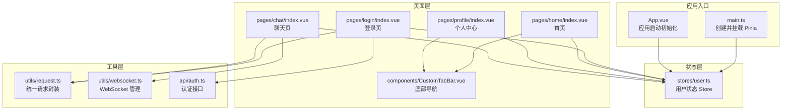
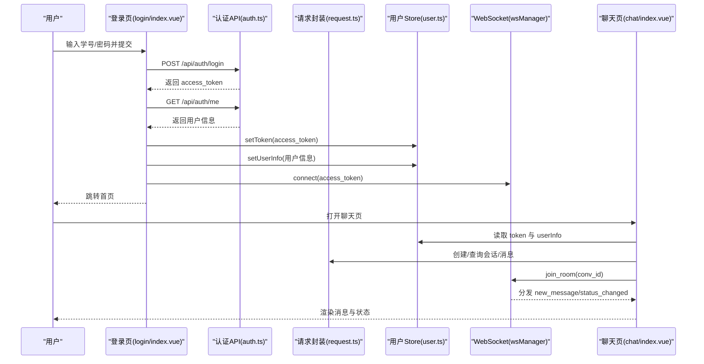
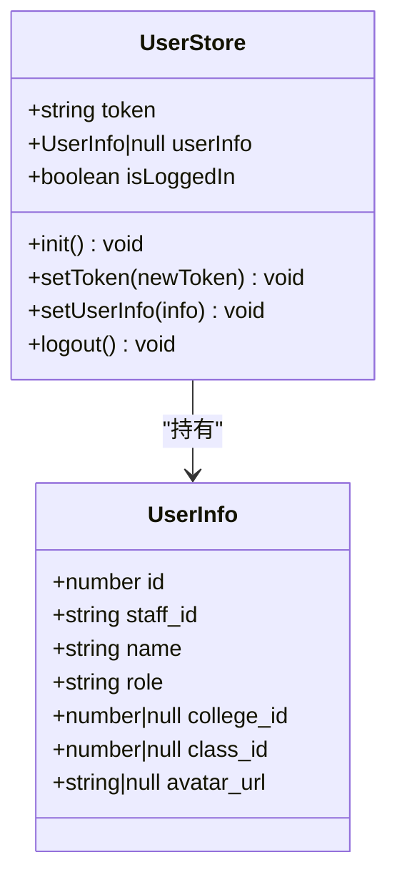
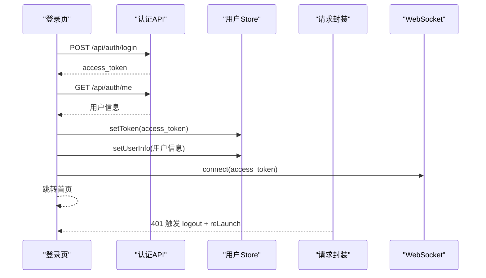
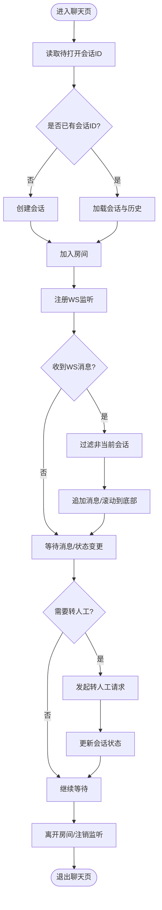
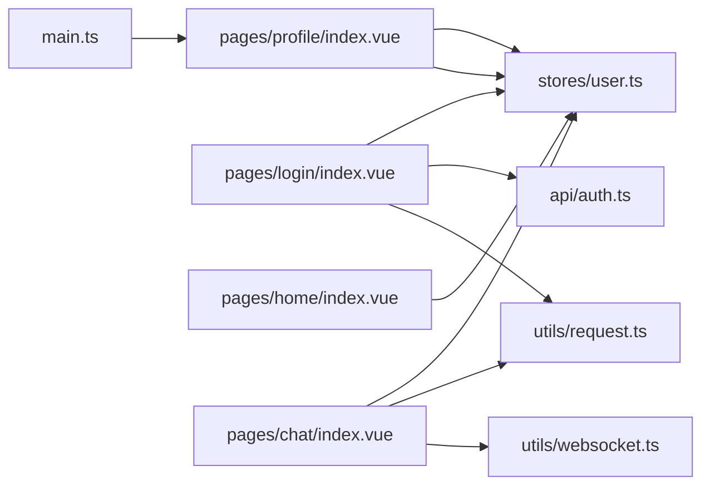

# 状态管理

<cite>
**本文档引用的文件**   
- [apps/student-app/src/stores/user.ts](file://apps/student-app/src/stores/user.ts)
- [apps/student-app/src/main.ts](file://apps/student-app/src/main.ts)
- [apps/student-app/src/api/auth.ts](file://apps/student-app/src/api/auth.ts)
- [apps/student-app/src/utils/request.ts](file://apps/student-app/src/utils/request.ts)
- [apps/student-app/src/utils/websocket.ts](file://apps/student-app/src/utils/websocket.ts)
- [apps/student-app/src/pages/login/index.vue](file://apps/student-app/src/pages/login/index.vue)
- [apps/student-app/src/App.vue](file://apps/student-app/src/App.vue)
- [apps/student-app/src/pages/home/index.vue](file://apps/student-app/src/pages/home/index.vue)
- [apps/student-app/src/pages/profile/index.vue](file://apps/student-app/src/pages/profile/index.vue)
- [apps/student-app/src/pages/chat/index.vue](file://apps/student-app/src/pages/chat/index.vue)
- [apps/student-app/src/components/CustomTabBar.vue](file://apps/student-app/src/components/CustomTabBar.vue)
- [apps/student-app/src/times/chat.ts](file://apps/student-app/src/types/chat.ts)
- [apps/student-app/package.json](file://apps/student-app/package.json)
</cite>

## 目录
1. [简介](#简介)
2. [项目结构](#项目结构)
3. [核心组件](#核心组件)
4. [架构总览](#架构总览)
5. [详细组件分析](#详细组件分析)
6. [依赖关系分析](#依赖关系分析)
7. [性能考量](#性能考量)
8. [故障排查指南](#故障排查指南)
9. [结论](#结论)
10. [附录](#附录)

## 简介
本文件系统性梳理学生端应用中基于 Pinia 的状态管理实践，重点覆盖以下方面：
- Store 定义与状态声明、getter 计算属性与 action 方法
- 用户状态管理模块：登录状态维护、用户信息持久化、权限控制
- 最佳实践：状态设计原则、数据流向、异步操作处理、状态持久化策略
- 调试与性能：状态调试工具使用、性能优化技巧、常见问题与解决方案
- 共享机制与跨页面同步：组件间状态共享、WebSocket 事件驱动的状态同步

## 项目结构
学生端应用采用 uni-app + Vue 3 + Pinia 架构，状态管理集中在 stores/user.ts 中，通过全局 Pinia 实例注入到应用生命周期中，并在各页面组件中按需使用。

图表来源
- [apps/student-app/src/main.ts:1-11](file://apps/student-app/src/main.ts#L1-L11)
- [apps/student-app/src/App.vue:1-36](file://apps/student-app/src/App.vue#L1-L36)
- [apps/student-app/src/stores/user.ts:1-56](file://apps/student-app/src/stores/user.ts#L1-L56)
- [apps/student-app/src/pages/login/index.vue:1-148](file://apps/student-app/src/pages/login/index.vue#L1-L148)
- [apps/student-app/src/pages/home/index.vue:1-129](file://apps/student-app/src/pages/home/index.vue#L1-L129)
- [apps/student-app/src/pages/profile/index.vue:1-87](file://apps/student-app/src/pages/profile/index.vue#L1-L87)
- [apps/student-app/src/pages/chat/index.vue:1-649](file://apps/student-app/src/pages/chat/index.vue#L1-L649)
- [apps/student-app/src/components/CustomTabBar.vue:1-75](file://apps/student-app/src/components/CustomTabBar.vue#L1-L75)
- [apps/student-app/src/utils/request.ts:1-44](file://apps/student-app/src/utils/request.ts#L1-L44)
- [apps/student-app/src/utils/websocket.ts:1-153](file://apps/student-app/src/utils/websocket.ts#L1-L153)
- [apps/student-app/src/api/auth.ts:1-20](file://apps/student-app/src/api/auth.ts#L1-L20)

章节来源
- [apps/student-app/src/main.ts:1-11](file://apps/student-app/src/main.ts#L1-L11)
- [apps/student-app/src/App.vue:1-36](file://apps/student-app/src/App.vue#L1-L36)
- [apps/student-app/src/stores/user.ts:1-56](file://apps/student-app/src/stores/user.ts#L1-L56)

## 核心组件
- Pinia 根实例与注入：在应用入口创建并挂载 Pinia，确保全局可用。
- 用户状态 Store：集中管理 token、用户信息、登录态、持久化与登出逻辑。
- 登录流程：调用认证接口获取访问令牌，拉取用户信息，建立 WebSocket 连接。
- 请求封装：统一添加 Authorization 头，处理 401 自动登出与错误提示。
- WebSocket 管理：连接、心跳、断线重连、房间加入/离开、消息分发。
- 页面使用：登录页设置 token 与用户信息；首页与个人中心读取用户信息；聊天页结合 WebSocket 与 SSE 实现消息流式交互。

章节来源
- [apps/student-app/src/main.ts:1-11](file://apps/student-app/src/main.ts#L1-L11)
- [apps/student-app/src/stores/user.ts:1-56](file://apps/student-app/src/stores/user.ts#L1-L56)
- [apps/student-app/src/api/auth.ts:1-20](file://apps/student-app/src/api/auth.ts#L1-L20)
- [apps/student-app/src/utils/request.ts:1-44](file://apps/student-app/src/utils/request.ts#L1-L44)
- [apps/student-app/src/utils/websocket.ts:1-153](file://apps/student-app/src/utils/websocket.ts#L1-L153)
- [apps/student-app/src/pages/login/index.vue:1-148](file://apps/student-app/src/pages/login/index.vue#L1-L148)
- [apps/student-app/src/pages/home/index.vue:1-129](file://apps/student-app/src/pages/home/index.vue#L1-L129)
- [apps/student-app/src/pages/profile/index.vue:1-87](file://apps/student-app/src/pages/profile/index.vue#L1-L87)
- [apps/student-app/src/pages/chat/index.vue:1-649](file://apps/student-app/src/pages/chat/index.vue#L1-L649)

## 架构总览
下图展示从登录到聊天的消息流，体现状态在 Store、页面与 WebSocket 之间的流转。

图表来源
- [apps/student-app/src/pages/login/index.vue:70-97](file://apps/student-app/src/pages/login/index.vue#L70-L97)
- [apps/student-app/src/api/auth.ts:9-19](file://apps/student-app/src/api/auth.ts#L9-L19)
- [apps/student-app/src/utils/request.ts:10-43](file://apps/student-app/src/utils/request.ts#L10-L43)
- [apps/student-app/src/stores/user.ts:36-52](file://apps/student-app/src/stores/user.ts#L36-L52)
- [apps/student-app/src/utils/websocket.ts:20-64](file://apps/student-app/src/utils/websocket.ts#L20-L64)
- [apps/student-app/src/pages/chat/index.vue:249-276](file://apps/student-app/src/pages/chat/index.vue#L249-L276)

## 详细组件分析

### 用户状态 Store（Pinia）
- 状态声明
  - token：字符串，用于鉴权
  - userInfo：用户信息对象或空
- 计算属性
  - isLoggedIn：基于 token 是否存在判断登录态
- 行为（Actions）
  - init：从本地存储恢复 token 与 userInfo，并建立 WebSocket 连接
  - setToken：更新 token 并持久化
  - setUserInfo：更新 userInfo 并持久化
  - logout：清空 token 与 userInfo，移除本地存储并断开 WebSocket

图表来源
- [apps/student-app/src/stores/user.ts:5-13](file://apps/student-app/src/stores/user.ts#L5-L13)
- [apps/student-app/src/stores/user.ts:18-55](file://apps/student-app/src/stores/user.ts#L18-L55)

章节来源
- [apps/student-app/src/stores/user.ts:1-56](file://apps/student-app/src/stores/user.ts#L1-L56)

### 登录流程与状态联动
- 登录页负责：
  - 校验表单
  - 调用登录接口获取 access_token
  - 调用“获取当前用户”接口获取用户信息
  - 将 token 与 userInfo 写入 Store，并建立 WebSocket 连接
  - 成功后跳转首页
- 请求封装在 401 时自动触发登出并跳转登录页

图表来源
- [apps/student-app/src/pages/login/index.vue:70-97](file://apps/student-app/src/pages/login/index.vue#L70-L97)
- [apps/student-app/src/api/auth.ts:9-19](file://apps/student-app/src/api/auth.ts#L9-L19)
- [apps/student-app/src/utils/request.ts:25-28](file://apps/student-app/src/utils/request.ts#L25-L28)
- [apps/student-app/src/stores/user.ts:36-52](file://apps/student-app/src/stores/user.ts#L36-L52)
- [apps/student-app/src/utils/websocket.ts:20-42](file://apps/student-app/src/utils/websocket.ts#L20-L42)

章节来源
- [apps/student-app/src/pages/login/index.vue:1-148](file://apps/student-app/src/pages/login/index.vue#L1-L148)
- [apps/student-app/src/api/auth.ts:1-20](file://apps/student-app/src/api/auth.ts#L1-L20)
- [apps/student-app/src/utils/request.ts:1-44](file://apps/student-app/src/utils/request.ts#L1-L44)
- [apps/student-app/src/stores/user.ts:1-56](file://apps/student-app/src/stores/user.ts#L1-L56)
- [apps/student-app/src/utils/websocket.ts:1-153](file://apps/student-app/src/utils/websocket.ts#L1-L153)

### 聊天页状态与 WebSocket 同步
- 生命周期与状态
  - onShow：从本地存储恢复待打开的会话 ID，加载会话与历史消息，加入房间
  - onHide/onUnmounted：离开房间并注销监听
- WebSocket 监听
  - 新消息：过滤非当前会话消息，追加到消息列表
  - 状态变更：根据新状态推送系统提示消息
- 数据映射与渲染
  - 将服务端消息映射为前端消息模型，支持 Markdown 渲染与流式光标
  - 支持“转人工”状态切换与来源引用展示

图表来源
- [apps/student-app/src/pages/chat/index.vue:249-276](file://apps/student-app/src/pages/chat/index.vue#L249-L276)
- [apps/student-app/src/pages/chat/index.vue:329-350](file://apps/student-app/src/pages/chat/index.vue#L329-L350)
- [apps/student-app/src/pages/chat/index.vue:279-326](file://apps/student-app/src/pages/chat/index.vue#L279-L326)
- [apps/student-app/src/utils/websocket.ts:76-83](file://apps/student-app/src/utils/websocket.ts#L76-L83)

章节来源
- [apps/student-app/src/pages/chat/index.vue:1-649](file://apps/student-app/src/pages/chat/index.vue#L1-L649)
- [apps/student-app/src/utils/websocket.ts:1-153](file://apps/student-app/src/utils/websocket.ts#L1-L153)

### 首页与个人中心的状态使用
- 首页：读取用户信息显示昵称与快捷提问，最近对话列表通过 API 获取
- 个人中心：展示用户信息与角色标签，提供退出登录入口

章节来源
- [apps/student-app/src/pages/home/index.vue:1-129](file://apps/student-app/src/pages/home/index.vue#L1-L129)
- [apps/student-app/src/pages/profile/index.vue:1-87](file://apps/student-app/src/pages/profile/index.vue#L1-L87)

### 类型与数据模型
- 用户信息类型：包含基础字段与可空字段
- 聊天消息与会话类型：涵盖消息角色、时间戳、来源引用与会话状态枚举

章节来源
- [apps/student-app/src/stores/user.ts:5-13](file://apps/student-app/src/stores/user.ts#L5-L13)
- [apps/student-app/src/times/chat.ts:1-45](file://apps/student-app/src/times/chat.ts#L1-L45)

## 依赖关系分析
- 应用入口依赖 Pinia，Pinia 注入后全局可用
- 页面组件依赖 Store 以读写状态
- 请求封装依赖 Store 提供的 token
- WebSocket 管理依赖 Store 的 token 与连接状态
- 登录页同时依赖认证 API 与 Store

图表来源
- [apps/student-app/src/main.ts:1-11](file://apps/student-app/src/main.ts#L1-L11)
- [apps/student-app/src/stores/user.ts:1-56](file://apps/student-app/src/stores/user.ts#L1-L56)
- [apps/student-app/src/pages/login/index.vue:1-148](file://apps/student-app/src/pages/login/index.vue#L1-L148)
- [apps/student-app/src/pages/home/index.vue:1-129](file://apps/student-app/src/pages/home/index.vue#L1-L129)
- [apps/student-app/src/pages/profile/index.vue:1-87](file://apps/student-app/src/pages/profile/index.vue#L1-L87)
- [apps/student-app/src/pages/chat/index.vue:1-649](file://apps/student-app/src/pages/chat/index.vue#L1-L649)
- [apps/student-app/src/api/auth.ts:1-20](file://apps/student-app/src/api/auth.ts#L1-L20)
- [apps/student-app/src/utils/request.ts:1-44](file://apps/student-app/src/utils/request.ts#L1-L44)
- [apps/student-app/src/utils/websocket.ts:1-153](file://apps/student-app/src/utils/websocket.ts#L1-L153)

章节来源
- [apps/student-app/src/main.ts:1-11](file://apps/student-app/src/main.ts#L1-L11)
- [apps/student-app/src/stores/user.ts:1-56](file://apps/student-app/src/stores/user.ts#L1-L56)
- [apps/student-app/src/utils/request.ts:1-44](file://apps/student-app/src/utils/request.ts#L1-L44)
- [apps/student-app/src/utils/websocket.ts:1-153](file://apps/student-app/src/utils/websocket.ts#L1-L153)

## 性能考量
- 状态持久化
  - 使用本地存储缓存 token 与用户信息，减少重复登录成本
  - Store 初始化时一次性恢复，避免多次 IO
- 请求与鉴权
  - 统一在请求封装中注入 Authorization，避免页面分散处理
  - 401 自动登出与跳转，避免无效重试
- WebSocket
  - 心跳保活与指数退避重连，降低网络波动影响
  - 发送队列与房间重连自动 re-join，保证消息连续性
- 渲染与滚动
  - 消息列表按需滚动到底部，避免不必要的重排
  - Markdown 渲染与流式输出配合，提升交互体验

## 故障排查指南
- 登录后立即 401
  - 检查请求封装是否正确携带 Authorization
  - 确认 Store 中 token 已写入且未被覆盖
- 无法接收 WebSocket 消息
  - 确认已加入房间（join_room）
  - 检查 WS 连接状态与心跳
- 退出登录后仍显示登录态
  - 确认 Store 的 logout 是否执行
  - 检查本地存储是否清理
- 聊天页不显示最近对话
  - 确认 onShow 生命周期中是否加载了会话与历史
  - 检查 pendingConversationId 本地存储是否正确传递

章节来源
- [apps/student-app/src/utils/request.ts:10-43](file://apps/student-app/src/utils/request.ts#L10-L43)
- [apps/student-app/src/stores/user.ts:46-52](file://apps/student-app/src/stores/user.ts#L46-L52)
- [apps/student-app/src/utils/websocket.ts:85-93](file://apps/student-app/src/utils/websocket.ts#L85-L93)
- [apps/student-app/src/pages/chat/index.vue:249-276](file://apps/student-app/src/pages/chat/index.vue#L249-L276)

## 结论
该学生端应用以 Pinia 为核心构建状态管理，结合本地存储与 WebSocket，实现了登录态、用户信息与实时消息的协同管理。通过统一的请求封装与 Store 的集中式行为，提升了可维护性与一致性。建议在后续迭代中进一步完善：
- Store 的模块化拆分（如拆分聊天状态）
- 调试工具链（如 Pinia Devtools）集成
- 更细粒度的错误边界与重试策略
- 状态快照与回放能力，便于问题复现与测试

## 附录
- 版本与依赖
  - Vue 3、Pinia、uni-app 生态
  - 本地存储键名：token 与用户信息键
  - WebSocket 地址由运行时协议与主机拼接

章节来源
- [apps/student-app/package.json:11-21](file://apps/student-app/package.json#L11-L21)
- [apps/student-app/src/stores/user.ts:15-16](file://apps/student-app/src/stores/user.ts#L15-L16)
- [apps/student-app/src/utils/websocket.ts:28-30](file://apps/student-app/src/utils/websocket.ts#L28-L30)