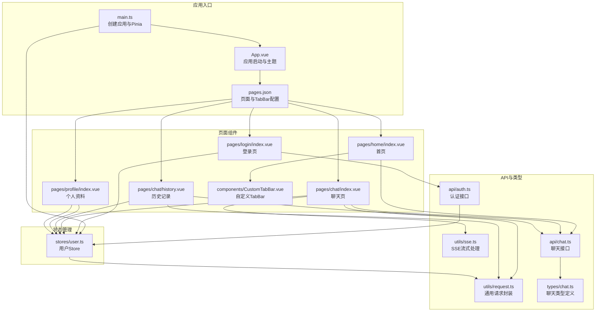
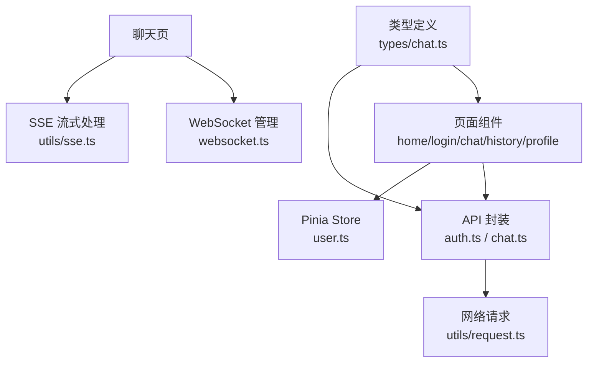
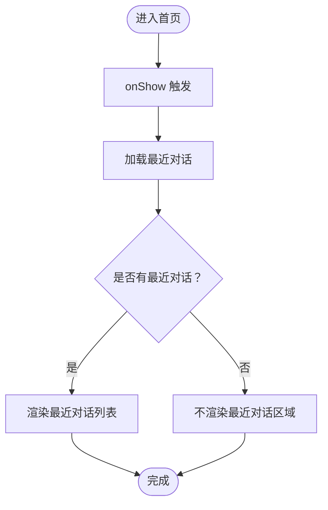
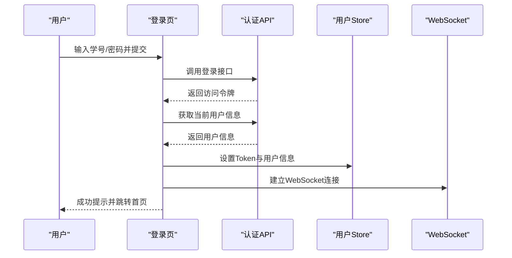
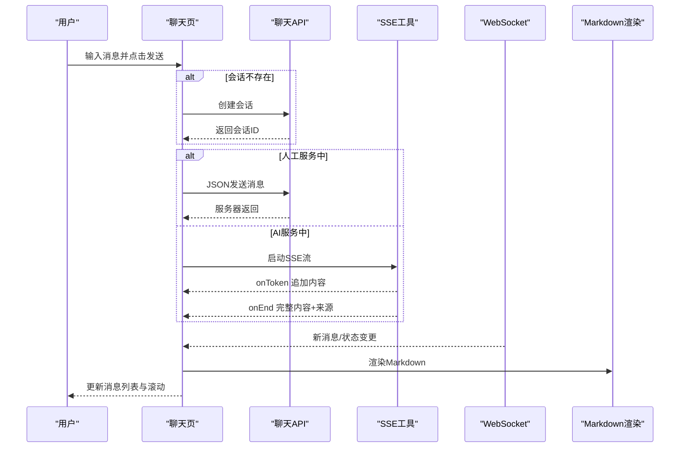
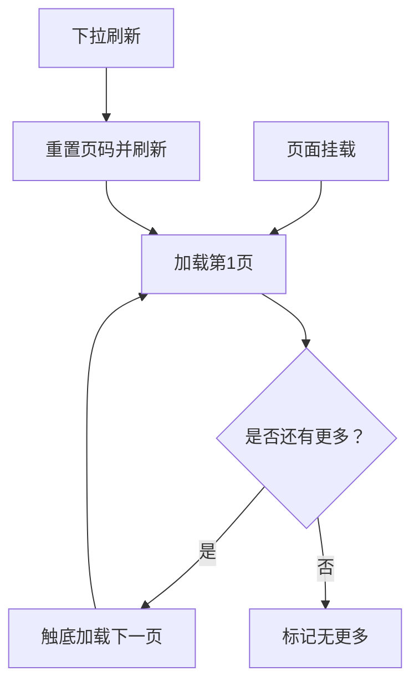
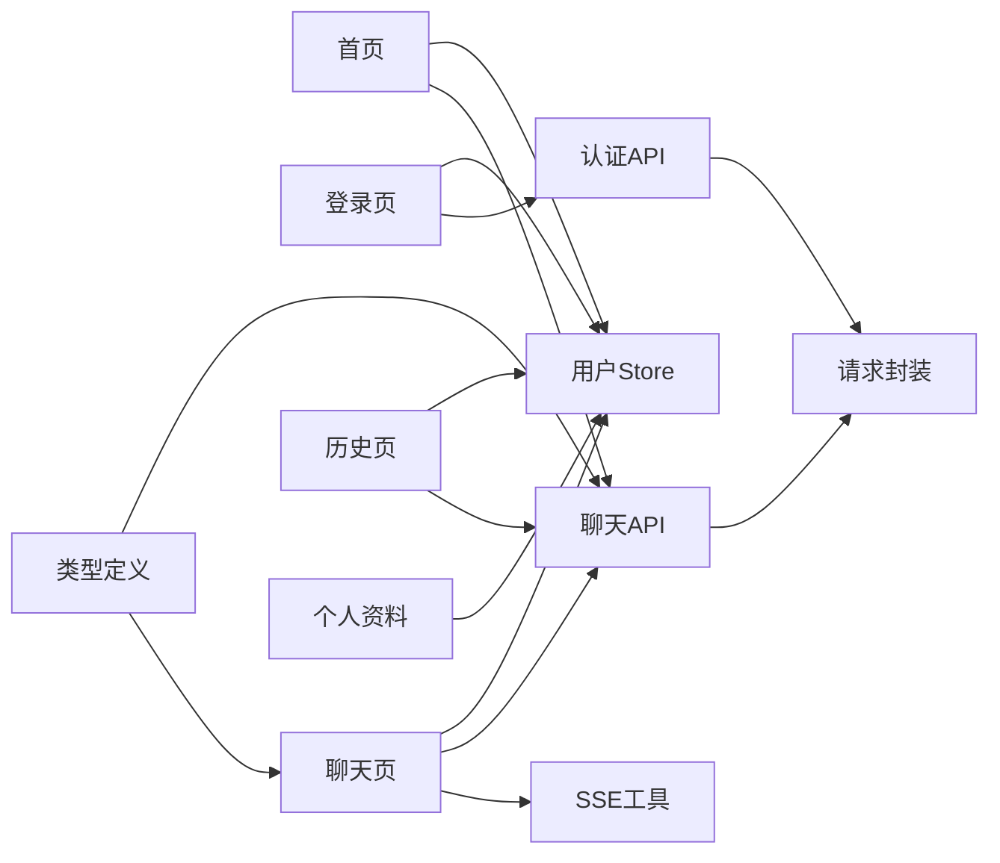

# 页面组件架构

<cite>
**本文引用的文件**
- [apps/student-app/src/App.vue](file://apps/student-app/src/App.vue)
- [apps/student-app/src/main.ts](file://apps/student-app/src/main.ts)
- [apps/student-app/src/pages.json](file://apps/student-app/src/pages.json)
- [apps/student-app/src/stores/user.ts](file://apps/student-app/src/stores/user.ts)
- [apps/student-app/src/components/CustomTabBar.vue](file://apps/student-app/src/components/CustomTabBar.vue)
- [apps/student-app/src/pages/home/index.vue](file://apps/student-app/src/pages/home/index.vue)
- [apps/student-app/src/pages/login/index.vue](file://apps/student-app/src/pages/login/index.vue)
- [apps/student-app/src/pages/chat/index.vue](file://apps/student-app/src/pages/chat/index.vue)
- [apps/student-app/src/pages/chat/history.vue](file://apps/student-app/src/pages/chat/history.vue)
- [apps/student-app/src/pages/profile/index.vue](file://apps/student-app/src/pages/profile/index.vue)
- [apps/student-app/src/api/auth.ts](file://apps/student-app/src/api/auth.ts)
- [apps/student-app/src/api/chat.ts](file://apps/student-app/src/api/chat.ts)
- [apps/student-app/src/types/chat.ts](file://apps/student-app/src/types/chat.ts)
- [apps/student-app/src/utils/request.ts](file://apps/student-app/src/utils/request.ts)
- [apps/student-app/src/utils/sse.ts](file://apps/student-app/src/utils/sse.ts)
</cite>

## 目录
1. [引言](#引言)
2. [项目结构](#项目结构)
3. [核心组件](#核心组件)
4. [架构总览](#架构总览)
5. [详细组件分析](#详细组件分析)
6. [依赖关系分析](#依赖关系分析)
7. [性能考虑](#性能考虑)
8. [故障排查指南](#故障排查指南)
9. [结论](#结论)
10. [附录](#附录)

## 引言
本文件系统性梳理学生端页面组件架构，围绕 Vue 3 Composition API 的页面组件设计模式展开，重点覆盖页面生命周期管理、响应式数据绑定、计算属性与侦听器的使用；并深入解析首页导航、聊天页面、登录页、个人资料页、历史记录页的功能实现与交互逻辑。同时提供页面间路由跳转、参数传递与状态保持的最佳实践，并总结性能优化、懒加载策略与用户体验提升技巧。

## 项目结构
学生端应用采用多页面架构（基于 uni-app），页面通过 pages.json 进行统一声明与 TabBar 配置，全局样式与主题在 App.vue 中集中定义。状态管理采用 Pinia，用户信息与认证状态由用户 Store 统一维护。页面组件通过 API 层访问后端服务，工具层封装通用能力（如请求、SSE、WebSocket）。

图表来源
- [apps/student-app/src/main.ts:1-11](file://apps/student-app/src/main.ts#L1-L11)
- [apps/student-app/src/App.vue:1-36](file://apps/student-app/src/App.vue#L1-L36)
- [apps/student-app/src/pages.json:1-65](file://apps/student-app/src/pages.json#L1-L65)
- [apps/student-app/src/stores/user.ts:1-56](file://apps/student-app/src/stores/user.ts#L1-L56)
- [apps/student-app/src/components/CustomTabBar.vue:1-75](file://apps/student-app/src/components/CustomTabBar.vue#L1-L75)
- [apps/student-app/src/pages/home/index.vue:1-129](file://apps/student-app/src/pages/home/index.vue#L1-L129)
- [apps/student-app/src/pages/login/index.vue:1-148](file://apps/student-app/src/pages/login/index.vue#L1-L148)
- [apps/student-app/src/pages/chat/index.vue:1-649](file://apps/student-app/src/pages/chat/index.vue#L1-L649)
- [apps/student-app/src/pages/chat/history.vue:1-145](file://apps/student-app/src/pages/chat/history.vue#L1-L145)
- [apps/student-app/src/pages/profile/index.vue:1-87](file://apps/student-app/src/pages/profile/index.vue#L1-L87)
- [apps/student-app/src/api/chat.ts:1-36](file://apps/student-app/src/api/chat.ts#L1-L36)
- [apps/student-app/src/api/auth.ts:1-20](file://apps/student-app/src/api/auth.ts#L1-L20)
- [apps/student-app/src/types/chat.ts:1-45](file://apps/student-app/src/types/chat.ts#L1-L45)
- [apps/student-app/src/utils/request.ts:1-44](file://apps/student-app/src/utils/request.ts#L1-L44)
- [apps/student-app/src/utils/sse.ts:1-69](file://apps/student-app/src/utils/sse.ts#L1-L69)

章节来源
- [apps/student-app/src/pages.json:1-65](file://apps/student-app/src/pages.json#L1-L65)
- [apps/student-app/src/App.vue:1-36](file://apps/student-app/src/App.vue#L1-L36)
- [apps/student-app/src/main.ts:1-11](file://apps/student-app/src/main.ts#L1-L11)

## 核心组件
- 应用入口与初始化
  - 在入口文件中创建应用实例与 Pinia，并在应用启动时初始化用户 Store，确保全局状态可用。
- 用户 Store（Pinia）
  - 维护 token、用户信息、登录态计算属性，并提供初始化、设置 Token/用户信息、登出等方法。
- 自定义 TabBar
  - 提供底部导航栏，支持切换页面路径与高亮当前页。
- 页面组件
  - 登录页：表单校验、调用认证接口、设置用户信息与 WebSocket 连接、跳转首页。
  - 首页：展示欢迎语、快捷提问、最近对话列表，支持跳转聊天页或打开指定会话。
  - 聊天页：消息渲染、Markdown 渲染、SSE 流式接收、WebSocket 实时消息、人工转接、来源引用弹层。
  - 历史记录页：分页加载、下拉刷新、状态标签、打开会话。
  - 个人资料页：展示用户信息、角色映射、退出登录。
- API 与工具
  - 请求封装：统一封装 uni.request，自动注入 Authorization 头，处理 401、422 与通用错误。
  - SSE：封装服务端事件流，回调 onToken、onEnd、onError。
  - 类型定义：消息、会话、来源等类型，保证前后端数据契约一致。

章节来源
- [apps/student-app/src/main.ts:1-11](file://apps/student-app/src/main.ts#L1-L11)
- [apps/student-app/src/App.vue:1-36](file://apps/student-app/src/App.vue#L1-L36)
- [apps/student-app/src/stores/user.ts:1-56](file://apps/student-app/src/stores/user.ts#L1-L56)
- [apps/student-app/src/components/CustomTabBar.vue:1-75](file://apps/student-app/src/components/CustomTabBar.vue#L1-L75)
- [apps/student-app/src/api/auth.ts:1-20](file://apps/student-app/src/api/auth.ts#L1-L20)
- [apps/student-app/src/api/chat.ts:1-36](file://apps/student-app/src/api/chat.ts#L1-L36)
- [apps/student-app/src/types/chat.ts:1-45](file://apps/student-app/src/types/chat.ts#L1-L45)
- [apps/student-app/src/utils/request.ts:1-44](file://apps/student-app/src/utils/request.ts#L1-L44)
- [apps/student-app/src/utils/sse.ts:1-69](file://apps/student-app/src/utils/sse.ts#L1-L69)

## 架构总览
系统采用“页面组件 + Store + API 工具”的分层架构。页面组件负责视图与交互，Store 负责状态与持久化，API 工具负责网络请求与流式处理，类型定义贯穿全链路保障一致性。

图表来源
- [apps/student-app/src/stores/user.ts:1-56](file://apps/student-app/src/stores/user.ts#L1-L56)
- [apps/student-app/src/api/auth.ts:1-20](file://apps/student-app/src/api/auth.ts#L1-L20)
- [apps/student-app/src/api/chat.ts:1-36](file://apps/student-app/src/api/chat.ts#L1-L36)
- [apps/student-app/src/utils/request.ts:1-44](file://apps/student-app/src/utils/request.ts#L1-L44)
- [apps/student-app/src/utils/sse.ts:1-69](file://apps/student-app/src/utils/sse.ts#L1-L69)
- [apps/student-app/src/types/chat.ts:1-45](file://apps/student-app/src/types/chat.ts#L1-L45)

## 详细组件分析

### 首页导航（pages/home/index.vue）
- 设计要点
  - 响应式布局：头部问候、英雄卡片引导、快捷提问列表、最近对话区域。
  - 交互行为：点击快捷提问或最近对话触发跳转；最近对话时间格式化。
- 生命周期与数据绑定
  - 使用 onShow 触发最近对话加载；使用 ref/computed 管理状态与显示逻辑。
- 关键实现路径
  - 最近对话加载：[apps/student-app/src/pages/home/index.vue:66-73](file://apps/student-app/src/pages/home/index.vue#L66-L73)
  - 快捷提问与最近对话跳转：[apps/student-app/src/pages/home/index.vue:75-85](file://apps/student-app/src/pages/home/index.vue#L75-L85)
  - 时间格式化：[apps/student-app/src/pages/home/index.vue:87-95](file://apps/student-app/src/pages/home/index.vue#L87-L95)

图表来源
- [apps/student-app/src/pages/home/index.vue:66-95](file://apps/student-app/src/pages/home/index.vue#L66-L95)

章节来源
- [apps/student-app/src/pages/home/index.vue:1-129](file://apps/student-app/src/pages/home/index.vue#L1-L129)

### 登录页面（pages/login/index.vue）
- 设计要点
  - 表单输入、密码可见性切换、提交按钮禁用状态、提示文案与渐变背景。
- 身份验证流程
  - 输入校验、调用登录接口、保存 Token 与用户信息、建立 WebSocket 连接、跳转首页。
- 关键实现路径
  - 登录流程与跳转：[apps/student-app/src/pages/login/index.vue:70-97](file://apps/student-app/src/pages/login/index.vue#L70-L97)
  - 认证接口封装：[apps/student-app/src/api/auth.ts:1-20](file://apps/student-app/src/api/auth.ts#L1-L20)
  - 用户信息持久化与 WebSocket：[apps/student-app/src/stores/user.ts:36-52](file://apps/student-app/src/stores/user.ts#L36-L52)

图表来源
- [apps/student-app/src/pages/login/index.vue:70-97](file://apps/student-app/src/pages/login/index.vue#L70-L97)
- [apps/student-app/src/api/auth.ts:1-20](file://apps/student-app/src/api/auth.ts#L1-L20)
- [apps/student-app/src/stores/user.ts:36-52](file://apps/student-app/src/stores/user.ts#L36-L52)

章节来源
- [apps/student-app/src/pages/login/index.vue:1-148](file://apps/student-app/src/pages/login/index.vue#L1-L148)
- [apps/student-app/src/api/auth.ts:1-20](file://apps/student-app/src/api/auth.ts#L1-L20)
- [apps/student-app/src/stores/user.ts:1-56](file://apps/student-app/src/stores/user.ts#L1-L56)

### 聊天页面（pages/chat/index.vue）
- 设计要点
  - 欢迎空状态与消息列表双态显示；Markdown 渲染、流式光标、来源引用弹层；底部输入区与长按菜单。
- 核心功能
  - 会话创建与历史加载、消息发送（AI 服务中走 SSE，人工服务中走 JSON）、状态变更监听、人工转接、滚动定位。
- 生命周期与状态
  - onMounted：读取初始化查询并自动发送；onShow/onHide：加入/离开房间；onUnmounted：清理监听。
- 关键实现路径
  - 初始化与参数传递：[apps/student-app/src/pages/chat/index.vue:240-247](file://apps/student-app/src/pages/chat/index.vue#L240-L247)
  - WebSocket 监听注册与注销：[apps/student-app/src/pages/chat/index.vue:319-326](file://apps/student-app/src/pages/chat/index.vue#L319-L326)
  - 加载会话与历史：[apps/student-app/src/pages/chat/index.vue:329-350](file://apps/student-app/src/pages/chat/index.vue#L329-L350)
  - 发送消息（SSE/JSON 分支）：[apps/student-app/src/pages/chat/index.vue:370-421](file://apps/student-app/src/pages/chat/index.vue#L370-L421)
  - 流式响应处理：[apps/student-app/src/pages/chat/index.vue:424-481](file://apps/student-app/src/pages/chat/index.vue#L424-L481)
  - 人工转接：[apps/student-app/src/pages/chat/index.vue:511-534](file://apps/student-app/src/pages/chat/index.vue#L511-L534)
  - Markdown 渲染：[apps/student-app/src/pages/chat/index.vue:212-216](file://apps/student-app/src/pages/chat/index.vue#L212-L216)
  - 滚动到底部：[apps/student-app/src/pages/chat/index.vue:550-552](file://apps/student-app/src/pages/chat/index.vue#L550-L552)

图表来源
- [apps/student-app/src/pages/chat/index.vue:370-481](file://apps/student-app/src/pages/chat/index.vue#L370-L481)
- [apps/student-app/src/utils/sse.ts:13-69](file://apps/student-app/src/utils/sse.ts#L13-L69)
- [apps/student-app/src/api/chat.ts:1-36](file://apps/student-app/src/api/chat.ts#L1-L36)

章节来源
- [apps/student-app/src/pages/chat/index.vue:1-649](file://apps/student-app/src/pages/chat/index.vue#L1-L649)
- [apps/student-app/src/utils/sse.ts:1-69](file://apps/student-app/src/utils/sse.ts#L1-L69)
- [apps/student-app/src/api/chat.ts:1-36](file://apps/student-app/src/api/chat.ts#L1-L36)

### 历史记录页面（pages/chat/history.vue）
- 设计要点
  - 列表分页加载、下拉刷新、状态标签、空状态提示。
- 数据与交互
  - 分页加载与“没有更多”判断；打开会话时通过本地存储传递会话 ID。
- 关键实现路径
  - 分页加载与刷新：[apps/student-app/src/pages/chat/history.vue:54-83](file://apps/student-app/src/pages/chat/history.vue#L54-L83)
  - 打开会话并跳转：[apps/student-app/src/pages/chat/history.vue:85-88](file://apps/student-app/src/pages/chat/history.vue#L85-L88)

图表来源
- [apps/student-app/src/pages/chat/history.vue:54-83](file://apps/student-app/src/pages/chat/history.vue#L54-L83)

章节来源
- [apps/student-app/src/pages/chat/history.vue:1-145](file://apps/student-app/src/pages/chat/history.vue#L1-L145)

### 个人资料页面（pages/profile/index.vue）
- 设计要点
  - 头像与基本信息展示、角色映射、退出登录确认。
- 关键实现路径
  - 角色标签映射：[apps/student-app/src/pages/profile/index.vue:46-49](file://apps/student-app/src/pages/profile/index.vue#L46-L49)
  - 退出登录流程：[apps/student-app/src/pages/profile/index.vue:51-62](file://apps/student-app/src/pages/profile/index.vue#L51-L62)

章节来源
- [apps/student-app/src/pages/profile/index.vue:1-87](file://apps/student-app/src/pages/profile/index.vue#L1-L87)

### 自定义 TabBar（components/CustomTabBar.vue）
- 设计要点
  - 固定底部、高亮态切换、图标与文字组合。
- 关键实现路径
  - 切换 Tab：[apps/student-app/src/components/CustomTabBar.vue:24-26](file://apps/student-app/src/components/CustomTabBar.vue#L24-L26)

章节来源
- [apps/student-app/src/components/CustomTabBar.vue:1-75](file://apps/student-app/src/components/CustomTabBar.vue#L1-L75)

## 依赖关系分析
- 页面到 Store：所有页面均通过 useUserStore 访问用户状态与方法。
- 页面到 API：聊天页与历史页依赖聊天 API，登录页依赖认证 API。
- 工具到页面：SSE 工具被聊天页用于流式接收；请求封装被各 API 使用。
- 类型到页面与 API：类型定义贯穿聊天页与 API，确保数据结构一致。

图表来源
- [apps/student-app/src/stores/user.ts:1-56](file://apps/student-app/src/stores/user.ts#L1-L56)
- [apps/student-app/src/api/chat.ts:1-36](file://apps/student-app/src/api/chat.ts#L1-L36)
- [apps/student-app/src/api/auth.ts:1-20](file://apps/student-app/src/api/auth.ts#L1-L20)
- [apps/student-app/src/utils/request.ts:1-44](file://apps/student-app/src/utils/request.ts#L1-L44)
- [apps/student-app/src/utils/sse.ts:1-69](file://apps/student-app/src/utils/sse.ts#L1-L69)
- [apps/student-app/src/types/chat.ts:1-45](file://apps/student-app/src/types/chat.ts#L1-L45)

章节来源
- [apps/student-app/src/stores/user.ts:1-56](file://apps/student-app/src/stores/user.ts#L1-L56)
- [apps/student-app/src/api/chat.ts:1-36](file://apps/student-app/src/api/chat.ts#L1-L36)
- [apps/student-app/src/api/auth.ts:1-20](file://apps/student-app/src/api/auth.ts#L1-L20)
- [apps/student-app/src/utils/request.ts:1-44](file://apps/student-app/src/utils/request.ts#L1-L44)
- [apps/student-app/src/utils/sse.ts:1-69](file://apps/student-app/src/utils/sse.ts#L1-L69)
- [apps/student-app/src/types/chat.ts:1-45](file://apps/student-app/src/types/chat.ts#L1-L45)

## 性能考虑
- 列表渲染优化
  - 使用虚拟滚动或分页加载（历史页已实现分页与“没有更多”控制）。
  - 对长列表进行节流/防抖滚动事件，避免频繁重排。
- 图片与富文本
  - Markdown 渲染仅在需要时触发；对图片懒加载与尺寸控制。
- 网络与流式
  - SSE 流式接收按 token 追加，避免一次性大对象渲染；必要时进行内容截断与增量更新。
- 状态与内存
  - 及时清理 WebSocket 监听（onHide/onUnmounted），防止内存泄漏。
- 缓存与持久化
  - 使用本地存储缓存 Token 与用户信息，减少重复登录成本。
- 首屏与交互
  - 首页懒加载“最近对话”列表，空状态占位，提升感知速度。

## 故障排查指南
- 401 未授权
  - 请求封装在 401 时自动登出并跳转登录页，检查 Token 是否过期或被清除。
- 参数校验错误（422）
  - 错误消息来自 detail，前端可直接展示第一条字段错误。
- 网络异常
  - 统一捕获 fail 并提示“网络连接失败”，检查代理与域名配置。
- SSE 错误
  - onEnd 前的错误通过 onError 回调，前端需兜底显示默认提示并停止流。
- WebSocket 断连
  - 在 onHide/onUnmounted 注销监听，重新进入页面重新注册；确保加入/离开房间消息成对出现。

章节来源
- [apps/student-app/src/utils/request.ts:25-42](file://apps/student-app/src/utils/request.ts#L25-L42)
- [apps/student-app/src/utils/sse.ts:52-67](file://apps/student-app/src/utils/sse.ts#L52-L67)
- [apps/student-app/src/pages/chat/index.vue:267-276](file://apps/student-app/src/pages/chat/index.vue#L267-L276)

## 结论
该学生端页面组件架构以 Vue 3 Composition API 为核心，结合 Pinia 状态管理与统一 API/工具层，实现了清晰的职责分离与良好的扩展性。页面间通过本地存储与路由进行参数传递与状态保持，聊天场景采用 SSE 与 WebSocket 实现高效实时交互。建议在后续迭代中进一步完善懒加载、虚拟滚动与错误兜底策略，持续优化首屏性能与弱网体验。

## 附录
- 页面间路由与参数传递最佳实践
  - 首页快捷提问与最近对话：通过本地存储传递查询或会话 ID，再跳转至聊天页。
  - 历史页打开会话：同上，确保 onShow 中读取并清理临时存储。
  - 登录成功后跳转：登录页完成后统一跳转首页，避免重复登录。
- 状态保持与生命周期
  - onShow/onHide/onMounted/onUnmounted 合理搭配，确保资源正确分配与回收。
- 用户体验提升
  - 提示文案统一、加载状态明确、空状态友好、错误信息可读。
- 性能优化清单
  - 列表分页/虚拟滚动、SSE 增量渲染、WebSocket 监听清理、本地缓存与鉴权降级。