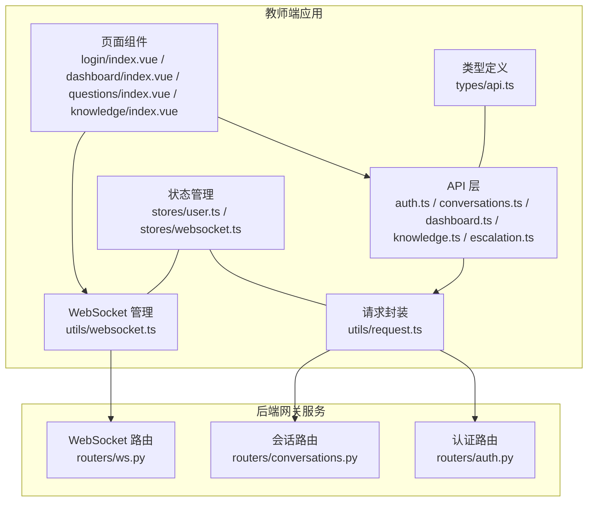
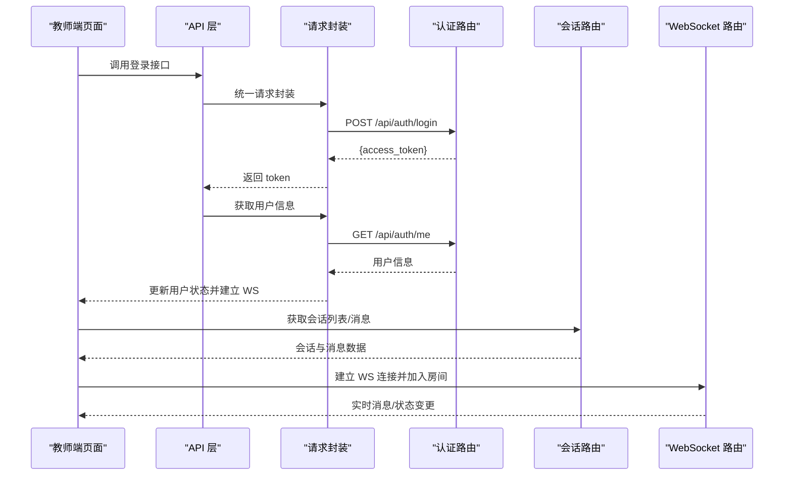
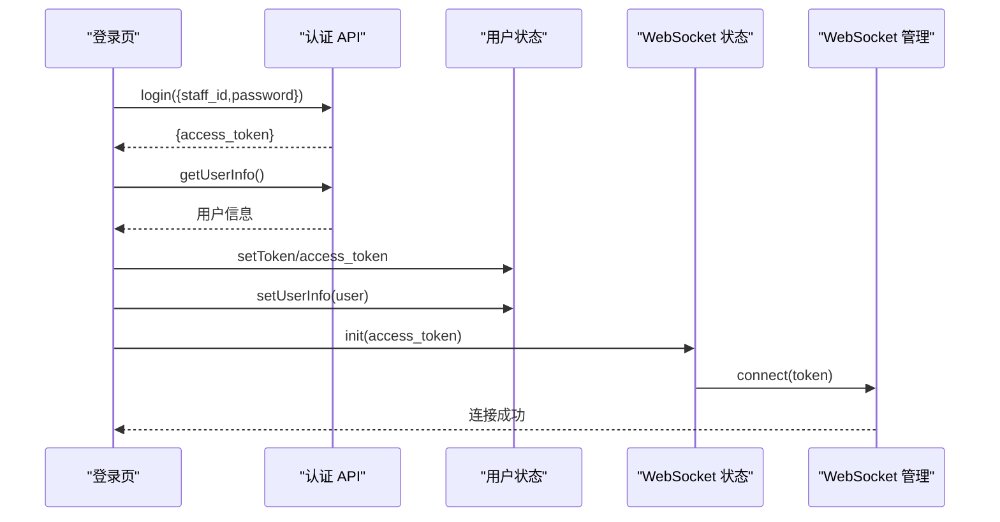
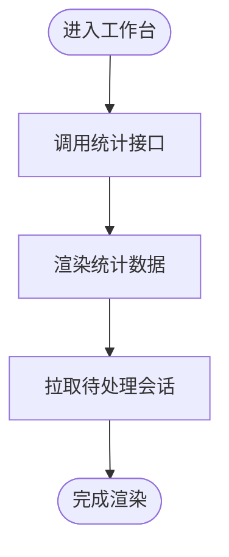
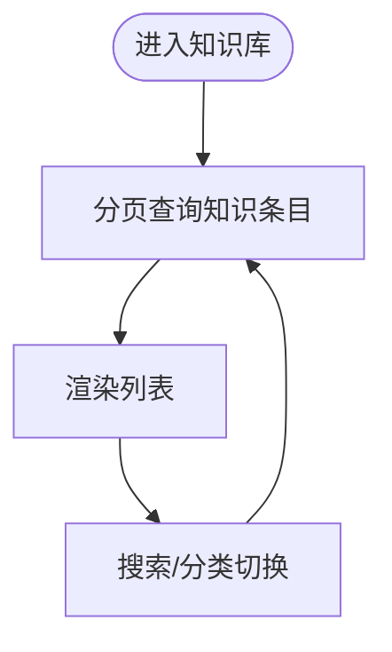
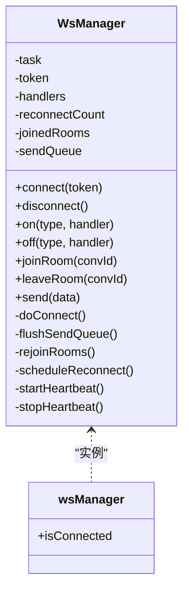
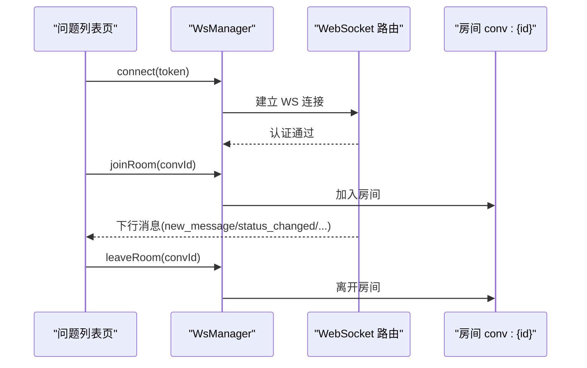
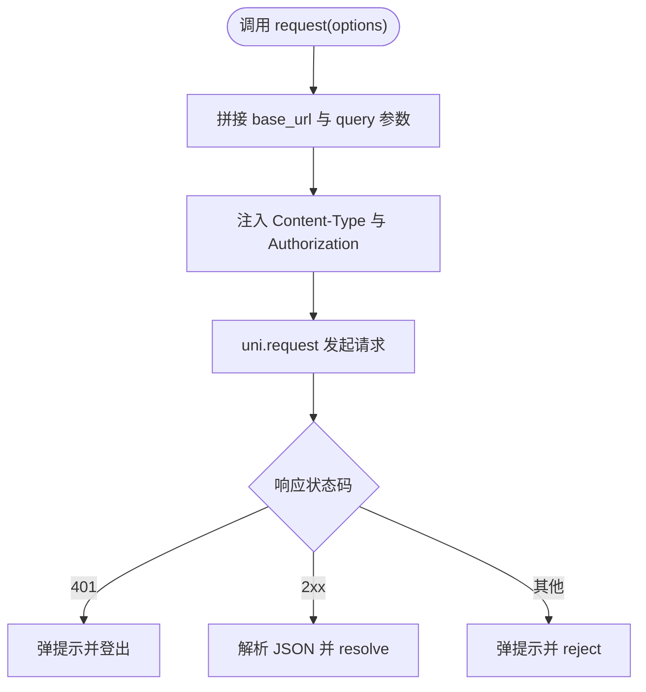
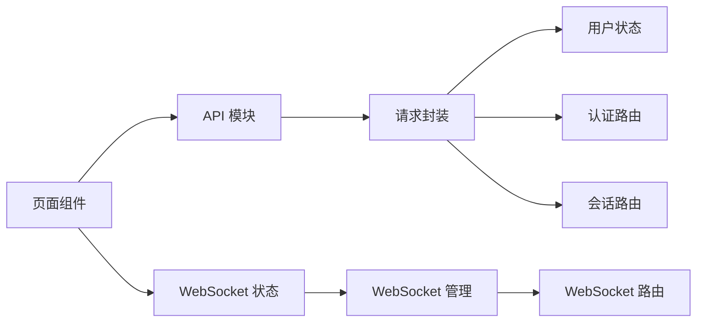

# API 集成

<cite>
**本文引用的文件**   
- [apps/teacher-app/src/api/auth.ts](file://apps/teacher-app/src/api/auth.ts)
- [apps/teacher-app/src/api/conversations.ts](file://apps/teacher-app/src/api/conversations.ts)
- [apps/teacher-app/src/api/dashboard.ts](file://apps/teacher-app/src/api/dashboard.ts)
- [apps/teacher-app/src/api/knowledge.ts](file://apps/teacher-app/src/api/knowledge.ts)
- [apps/teacher-app/src/api/escalation.ts](file://apps/teacher-app/src/api/escalation.ts)
- [apps/teacher-app/src/utils/request.ts](file://apps/teacher-app/src/utils/request.ts)
- [apps/teacher-app/src/stores/user.ts](file://apps/teacher-app/src/stores/user.ts)
- [apps/teacher-app/src/stores/websocket.ts](file://apps/teacher-app/src/stores/websocket.ts)
- [apps/teacher-app/src/utils/websocket.ts](file://apps/teacher-app/src/utils/websocket.ts)
- [apps/teacher-app/src/types/api.ts](file://apps/teacher-app/src/types/api.ts)
- [apps/teacher-app/src/pages/login/index.vue](file://apps/teacher-app/src/pages/login/index.vue)
- [apps/teacher-app/src/pages/dashboard/index.vue](file://apps/teacher-app/src/pages/dashboard/index.vue)
- [apps/teacher-app/src/pages/questions/index.vue](file://apps/teacher-app/src/pages/questions/index.vue)
- [apps/teacher-app/src/pages/knowledge/index.vue](file://apps/teacher-app/src/pages/knowledge/index.vue)
- [services/gateway/app/routers/auth.py](file://services/gateway/app/routers/auth.py)
- [services/gateway/app/routers/conversations.py](file://services/gateway/app/routers/conversations.py)
- [services/gateway/app/routers/ws.py](file://services/gateway/app/routers/ws.py)
</cite>

## 目录
1. [简介](#简介)
2. [项目结构](#项目结构)
3. [核心组件](#核心组件)
4. [架构总览](#架构总览)
5. [详细组件分析](#详细组件分析)
6. [依赖关系分析](#依赖关系分析)
7. [性能考量](#性能考量)
8. [故障排查指南](#故障排查指南)
9. [结论](#结论)
10. [附录](#附录)

## 简介
本文件面向“医小管 v2 教师端”应用，系统性梳理前端与后端服务之间的 API 集成实现，覆盖认证与会话管理、仪表板数据、知识库管理、工单与升级流程等模块。重点说明请求封装与拦截、响应处理与错误码管理、WebSocket 连接与消息分发机制，并给出最佳实践与性能优化建议。

## 项目结构
教师端采用基于 Vue 3 + Pinia + uni-app 的跨平台前端工程，API 层以统一请求封装为核心，配合 Pinia Store 管理认证状态与 WebSocket 连接；后端网关服务基于 FastAPI 提供 REST 与 WebSocket 接口。

**图表来源**
- [apps/teacher-app/src/pages/login/index.vue:124-207](file://apps/teacher-app/src/pages/login/index.vue#L124-L207)
- [apps/teacher-app/src/pages/dashboard/index.vue:138-252](file://apps/teacher-app/src/pages/dashboard/index.vue#L138-L252)
- [apps/teacher-app/src/pages/questions/index.vue:85-189](file://apps/teacher-app/src/pages/questions/index.vue#L85-L189)
- [apps/teacher-app/src/pages/knowledge/index.vue:84-227](file://apps/teacher-app/src/pages/knowledge/index.vue#L84-L227)
- [apps/teacher-app/src/api/auth.ts:1-43](file://apps/teacher-app/src/api/auth.ts#L1-L43)
- [apps/teacher-app/src/api/conversations.ts:1-44](file://apps/teacher-app/src/api/conversations.ts#L1-L44)
- [apps/teacher-app/src/api/dashboard.ts:1-18](file://apps/teacher-app/src/api/dashboard.ts#L1-L18)
- [apps/teacher-app/src/api/knowledge.ts:1-45](file://apps/teacher-app/src/api/knowledge.ts#L1-L45)
- [apps/teacher-app/src/api/escalation.ts:1-62](file://apps/teacher-app/src/api/escalation.ts#L1-L62)
- [apps/teacher-app/src/utils/request.ts:1-108](file://apps/teacher-app/src/utils/request.ts#L1-L108)
- [apps/teacher-app/src/stores/user.ts:1-63](file://apps/teacher-app/src/stores/user.ts#L1-L63)
- [apps/teacher-app/src/stores/websocket.ts:1-32](file://apps/teacher-app/src/stores/websocket.ts#L1-L32)
- [apps/teacher-app/src/utils/websocket.ts:1-169](file://apps/teacher-app/src/utils/websocket.ts#L1-L169)
- [apps/teacher-app/src/types/api.ts:1-51](file://apps/teacher-app/src/types/api.ts#L1-L51)
- [services/gateway/app/routers/auth.py:1-35](file://services/gateway/app/routers/auth.py#L1-L35)
- [services/gateway/app/routers/conversations.py:1-129](file://services/gateway/app/routers/conversations.py#L1-L129)
- [services/gateway/app/routers/ws.py:1-119](file://services/gateway/app/routers/ws.py#L1-L119)

**章节来源**
- [apps/teacher-app/src/utils/request.ts:1-108](file://apps/teacher-app/src/utils/request.ts#L1-L108)
- [apps/teacher-app/src/stores/user.ts:1-63](file://apps/teacher-app/src/stores/user.ts#L1-L63)
- [apps/teacher-app/src/utils/websocket.ts:1-169](file://apps/teacher-app/src/utils/websocket.ts#L1-L169)
- [services/gateway/app/routers/auth.py:1-35](file://services/gateway/app/routers/auth.py#L1-L35)
- [services/gateway/app/routers/conversations.py:1-129](file://services/gateway/app/routers/conversations.py#L1-L129)
- [services/gateway/app/routers/ws.py:1-119](file://services/gateway/app/routers/ws.py#L1-L119)

## 核心组件
- 统一请求封装：负责构建 URL、拼接查询参数、注入 Authorization 头、处理 401 与通用 HTTP 错误、透传 JSON 响应。
- 认证与用户状态：登录成功后持久化 token 与用户信息，页面在 401 时自动跳转登录。
- WebSocket 管理：单连接 + 房间模式，支持心跳、断线重连、重入房间、消息分发与兜底轮询。
- API 模块：按功能拆分，如认证、会话、仪表板、知识库、工单等，均通过统一请求封装发起。

**章节来源**
- [apps/teacher-app/src/utils/request.ts:10-77](file://apps/teacher-app/src/utils/request.ts#L10-L77)
- [apps/teacher-app/src/stores/user.ts:19-47](file://apps/teacher-app/src/stores/user.ts#L19-L47)
- [apps/teacher-app/src/stores/websocket.ts:9-20](file://apps/teacher-app/src/stores/websocket.ts#L9-L20)
- [apps/teacher-app/src/utils/websocket.ts:26-114](file://apps/teacher-app/src/utils/websocket.ts#L26-L114)

## 架构总览
教师端通过 HTTP REST 与 WebSocket 与后端交互。HTTP 路由由 FastAPI 提供，WebSocket 路由负责实时消息与状态变更通知。

**图表来源**
- [apps/teacher-app/src/pages/login/index.vue:165-191](file://apps/teacher-app/src/pages/login/index.vue#L165-L191)
- [apps/teacher-app/src/api/auth.ts:27-42](file://apps/teacher-app/src/api/auth.ts#L27-L42)
- [apps/teacher-app/src/api/conversations.ts:8-43](file://apps/teacher-app/src/api/conversations.ts#L8-L43)
- [apps/teacher-app/src/utils/request.ts:10-77](file://apps/teacher-app/src/utils/request.ts#L10-L77)
- [services/gateway/app/routers/auth.py:12-34](file://services/gateway/app/routers/auth.py#L12-L34)
- [services/gateway/app/routers/conversations.py:34-78](file://services/gateway/app/routers/conversations.py#L34-L78)
- [services/gateway/app/routers/ws.py:11-119](file://services/gateway/app/routers/ws.py#L11-L119)

## 详细组件分析

### 认证与会话管理 API
- 登录接口：提交工号与密码，返回 access_token。
- 获取当前用户：携带 Bearer Token 获取用户信息。
- 会话列表/详情/消息：支持分页与状态过滤；教师可接单与解决。
- 工单相关：待处理/已接工单列表、详情、接单/回复/解决。

**图表来源**
- [apps/teacher-app/src/pages/login/index.vue:165-191](file://apps/teacher-app/src/pages/login/index.vue#L165-L191)
- [apps/teacher-app/src/api/auth.ts:27-42](file://apps/teacher-app/src/api/auth.ts#L27-L42)
- [apps/teacher-app/src/stores/user.ts:30-38](file://apps/teacher-app/src/stores/user.ts#L30-L38)
- [apps/teacher-app/src/stores/websocket.ts:9-14](file://apps/teacher-app/src/stores/websocket.ts#L9-L14)
- [apps/teacher-app/src/utils/websocket.ts:26-35](file://apps/teacher-app/src/utils/websocket.ts#L26-L35)

**章节来源**
- [apps/teacher-app/src/api/auth.ts:1-43](file://apps/teacher-app/src/api/auth.ts#L1-L43)
- [apps/teacher-app/src/api/conversations.ts:1-44](file://apps/teacher-app/src/api/conversations.ts#L1-L44)
- [apps/teacher-app/src/api/escalation.ts:1-62](file://apps/teacher-app/src/api/escalation.ts#L1-L62)
- [apps/teacher-app/src/pages/login/index.vue:165-191](file://apps/teacher-app/src/pages/login/index.vue#L165-L191)

### 仪表板数据 API
- 统计数据接口：一次性获取工作台统计。
- 概览接口：聚合多维指标，减少多次请求。

**图表来源**
- [apps/teacher-app/src/api/dashboard.ts:4-17](file://apps/teacher-app/src/api/dashboard.ts#L4-L17)
- [apps/teacher-app/src/pages/dashboard/index.vue:234-251](file://apps/teacher-app/src/pages/dashboard/index.vue#L234-L251)

**章节来源**
- [apps/teacher-app/src/api/dashboard.ts:1-18](file://apps/teacher-app/src/api/dashboard.ts#L1-L18)
- [apps/teacher-app/src/pages/dashboard/index.vue:200-251](file://apps/teacher-app/src/pages/dashboard/index.vue#L200-L251)

### 知识库管理 API
- 分页查询知识条目：支持分类、状态、标题筛选。
- 获取详情与分类列表。
- 下线条目（上线/下线）。

**图表来源**
- [apps/teacher-app/src/api/knowledge.ts:4-44](file://apps/teacher-app/src/api/knowledge.ts#L4-L44)
- [apps/teacher-app/src/pages/knowledge/index.vue:102-133](file://apps/teacher-app/src/pages/knowledge/index.vue#L102-L133)

**章节来源**
- [apps/teacher-app/src/api/knowledge.ts:1-45](file://apps/teacher-app/src/api/knowledge.ts#L1-L45)
- [apps/teacher-app/src/pages/knowledge/index.vue:84-227](file://apps/teacher-app/src/pages/knowledge/index.vue#L84-L227)

### WebSocket 连接与消息处理
- 单连接 + 房间模式：加入/离开房间、心跳保活、指数退避重连。
- 消息分发：按 type 分发至订阅者，支持通配符事件。
- 兜底轮询：页面层设置定时轮询，降低 WS 事件丢失风险。

**图表来源**
- [apps/teacher-app/src/utils/websocket.ts:9-168](file://apps/teacher-app/src/utils/websocket.ts#L9-L168)

**图表来源**
- [apps/teacher-app/src/pages/questions/index.vue:172-188](file://apps/teacher-app/src/pages/questions/index.vue#L172-L188)
- [apps/teacher-app/src/utils/websocket.ts:46-54](file://apps/teacher-app/src/utils/websocket.ts#L46-L54)
- [services/gateway/app/routers/ws.py:11-119](file://services/gateway/app/routers/ws.py#L11-L119)

**章节来源**
- [apps/teacher-app/src/utils/websocket.ts:1-169](file://apps/teacher-app/src/utils/websocket.ts#L1-L169)
- [apps/teacher-app/src/stores/websocket.ts:1-32](file://apps/teacher-app/src/stores/websocket.ts#L1-L32)
- [apps/teacher-app/src/pages/questions/index.vue:170-188](file://apps/teacher-app/src/pages/questions/index.vue#L170-L188)
- [services/gateway/app/routers/ws.py:35-112](file://services/gateway/app/routers/ws.py#L35-L112)

### 请求封装与拦截器
- 统一入口：request(options) 返回 Promise。
- 参数拼接：自动过滤空值并拼接到 URL 查询串。
- 头部注入：自动附加 Content-Type 与 Authorization。
- 错误处理：401 自动登出并跳转登录；HTTP 错误弹 toast；网络失败统一提示。
- 方法封装：get/post/put/del 基于 request 实现。

**图表来源**
- [apps/teacher-app/src/utils/request.ts:10-77](file://apps/teacher-app/src/utils/request.ts#L10-L77)

**章节来源**
- [apps/teacher-app/src/utils/request.ts:1-108](file://apps/teacher-app/src/utils/request.ts#L1-L108)
- [apps/teacher-app/src/stores/user.ts:40-47](file://apps/teacher-app/src/stores/user.ts#L40-L47)

### 类型模型
- 用户信息、会话、消息、分页结果等类型定义，确保前后端契约一致。

**章节来源**
- [apps/teacher-app/src/types/api.ts:1-51](file://apps/teacher-app/src/types/api.ts#L1-L51)

## 依赖关系分析
- 页面组件依赖 API 模块，API 模块依赖请求封装。
- 请求封装依赖用户状态存储以注入 token。
- WebSocket 管理依赖用户状态与页面 store。
- 后端路由提供 REST 与 WebSocket 接口，分别对应前端不同场景。

**图表来源**
- [apps/teacher-app/src/pages/login/index.vue:124-207](file://apps/teacher-app/src/pages/login/index.vue#L124-L207)
- [apps/teacher-app/src/pages/dashboard/index.vue:138-252](file://apps/teacher-app/src/pages/dashboard/index.vue#L138-L252)
- [apps/teacher-app/src/pages/questions/index.vue:85-189](file://apps/teacher-app/src/pages/questions/index.vue#L85-L189)
- [apps/teacher-app/src/pages/knowledge/index.vue:84-227](file://apps/teacher-app/src/pages/knowledge/index.vue#L84-L227)
- [apps/teacher-app/src/api/auth.ts:1-43](file://apps/teacher-app/src/api/auth.ts#L1-L43)
- [apps/teacher-app/src/api/conversations.ts:1-44](file://apps/teacher-app/src/api/conversations.ts#L1-L44)
- [apps/teacher-app/src/api/dashboard.ts:1-18](file://apps/teacher-app/src/api/dashboard.ts#L1-L18)
- [apps/teacher-app/src/api/knowledge.ts:1-45](file://apps/teacher-app/src/api/knowledge.ts#L1-L45)
- [apps/teacher-app/src/api/escalation.ts:1-62](file://apps/teacher-app/src/api/escalation.ts#L1-L62)
- [apps/teacher-app/src/utils/request.ts:1-108](file://apps/teacher-app/src/utils/request.ts#L1-L108)
- [apps/teacher-app/src/stores/user.ts:1-63](file://apps/teacher-app/src/stores/user.ts#L1-L63)
- [apps/teacher-app/src/stores/websocket.ts:1-32](file://apps/teacher-app/src/stores/websocket.ts#L1-L32)
- [apps/teacher-app/src/utils/websocket.ts:1-169](file://apps/teacher-app/src/utils/websocket.ts#L1-L169)
- [services/gateway/app/routers/auth.py:1-35](file://services/gateway/app/routers/auth.py#L1-L35)
- [services/gateway/app/routers/conversations.py:1-129](file://services/gateway/app/routers/conversations.py#L1-L129)
- [services/gateway/app/routers/ws.py:1-119](file://services/gateway/app/routers/ws.py#L1-L119)

**章节来源**
- [apps/teacher-app/src/utils/request.ts:1-108](file://apps/teacher-app/src/utils/request.ts#L1-L108)
- [apps/teacher-app/src/stores/user.ts:1-63](file://apps/teacher-app/src/stores/user.ts#L1-L63)
- [apps/teacher-app/src/utils/websocket.ts:1-169](file://apps/teacher-app/src/utils/websocket.ts#L1-L169)
- [services/gateway/app/routers/auth.py:1-35](file://services/gateway/app/routers/auth.py#L1-L35)
- [services/gateway/app/routers/conversations.py:1-129](file://services/gateway/app/routers/conversations.py#L1-L129)
- [services/gateway/app/routers/ws.py:1-119](file://services/gateway/app/routers/ws.py#L1-L119)

## 性能考量
- 减少重复请求：页面进入时优先使用缓存数据，必要时再触发刷新。
- 分页与懒加载：知识库与问题列表使用分页，避免一次性加载大量数据。
- WebSocket 兜底轮询：在弱网络环境下通过定时轮询保障体验。
- 请求超时与重试：合理设置超时时间，避免阻塞 UI；对非幂等请求谨慎重试。
- 图标与资源：复用图标组件，避免重复渲染与内存占用。

[本节为通用指导，无需特定文件来源]

## 故障排查指南
- 登录后 401：检查 token 是否正确注入与持久化；确认后端 JWT 解析是否正常。
- 网络失败：查看请求封装中的 fail 回调与 toast 提示，确认网络状态。
- WebSocket 不在线：检查连接状态与心跳；关注断线重连日志与最大重连次数。
- 会话权限：教师仅能回复已接单会话，注意状态判断逻辑。
- 事件丢失：启用页面层轮询兜底，观察 WS 事件订阅与分发。

**章节来源**
- [apps/teacher-app/src/utils/request.ts:40-64](file://apps/teacher-app/src/utils/request.ts#L40-L64)
- [apps/teacher-app/src/utils/websocket.ts:148-154](file://apps/teacher-app/src/utils/websocket.ts#L148-L154)
- [apps/teacher-app/src/api/conversations.ts:94-100](file://apps/teacher-app/src/api/conversations.ts#L94-L100)
- [apps/teacher-app/src/pages/questions/index.vue:170-178](file://apps/teacher-app/src/pages/questions/index.vue#L170-L178)

## 结论
教师端通过统一请求封装与 WebSocket 管理，实现了认证、会话、知识库与工单等核心业务的稳定集成。建议在现有基础上进一步完善 token 自动刷新策略与错误恢复机制，持续优化首屏与分页加载性能，并加强接口契约与类型约束的一致性。

[本节为总结性内容，无需特定文件来源]

## 附录

### API 调用最佳实践
- 所有请求统一走 request 封装，避免直接使用 uni.request。
- 在页面生命周期中进行数据预取与缓存，减少重复请求。
- 对于实时场景，优先使用 WebSocket；同时保留轮询兜底。
- 对敏感操作（接单/解决/上下线）进行二次确认与状态校验。

**章节来源**
- [apps/teacher-app/src/utils/request.ts:1-108](file://apps/teacher-app/src/utils/request.ts#L1-L108)
- [apps/teacher-app/src/pages/questions/index.vue:170-178](file://apps/teacher-app/src/pages/questions/index.vue#L170-L178)

### 认证 token 管理与自动刷新
- 当前实现：登录成功后持久化 token，请求时自动注入 Authorization；401 时登出并跳转登录。
- 建议：引入 token 刷新流程（如 refresh token 或短 token + 前端续签），在即将过期时提前刷新，减少中断。

**章节来源**
- [apps/teacher-app/src/stores/user.ts:30-47](file://apps/teacher-app/src/stores/user.ts#L30-L47)
- [apps/teacher-app/src/utils/request.ts:67-73](file://apps/teacher-app/src/utils/request.ts#L67-L73)