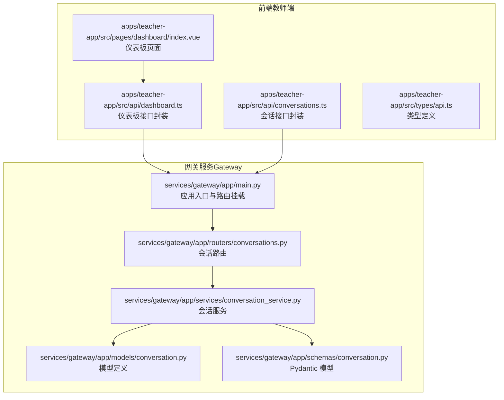
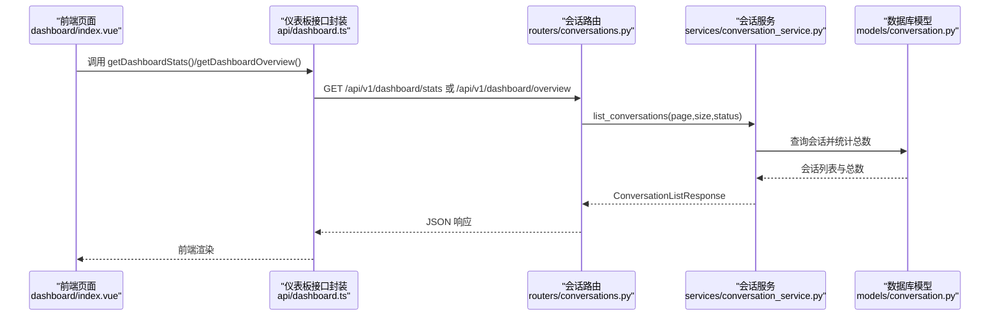
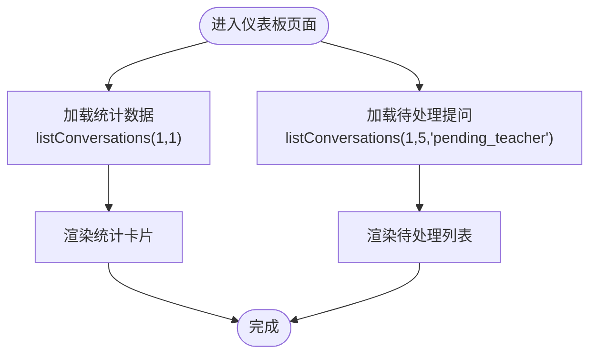
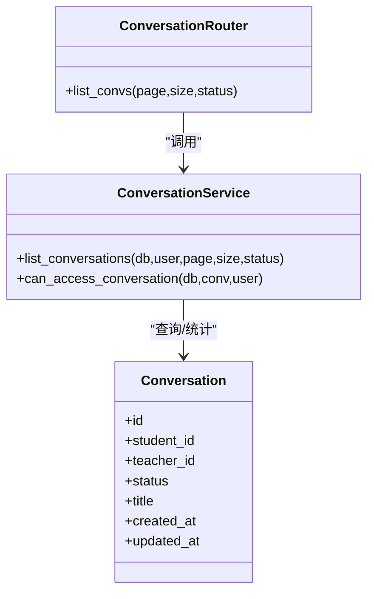
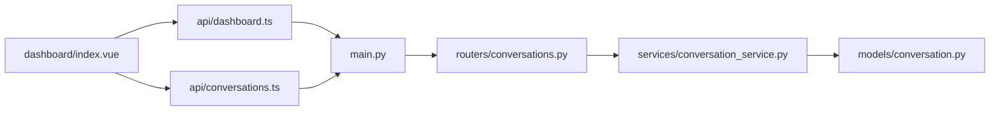

# 仪表板数据 API

<cite>
**本文档引用的文件**
- [apps/teacher-app/src/api/dashboard.ts](file://apps/teacher-app/src/api/dashboard.ts)
- [apps/teacher-app/src/pages/dashboard/index.vue](file://apps/teacher-app/src/pages/dashboard/index.vue)
- [apps/teacher-app/src/api/conversations.ts](file://apps/teacher-app/src/api/conversations.ts)
- [apps/teacher-app/src/types/api.ts](file://apps/teacher-app/src/types/api.ts)
- [services/gateway/app/main.py](file://services/gateway/app/main.py)
- [services/gateway/app/routers/conversations.py](file://services/gateway/app/routers/conversations.py)
- [services/gateway/app/services/conversation_service.py](file://services/gateway/app/services/conversation_service.py)
- [services/gateway/app/models/conversation.py](file://services/gateway/app/models/conversation.py)
- [services/gateway/app/schemas/conversation.py](file://services/gateway/app/schemas/conversation.py)
</cite>

## 目录
1. [简介](#简介)
2. [项目结构](#项目结构)
3. [核心组件](#核心组件)
4. [架构总览](#架构总览)
5. [详细组件分析](#详细组件分析)
6. [依赖分析](#依赖分析)
7. [性能考虑](#性能考虑)
8. [故障排查指南](#故障排查指南)
9. [结论](#结论)

## 简介
本文件聚焦于“医小管 v2 教师端仪表板数据 API”的设计与实现，围绕教师工作台所需的关键指标（如待处理会话数量、今日处理量、平均响应时间、用户满意度等）进行系统性梳理。当前前端已具备基础的仪表板页面与统计数据接口调用入口，后端会话模块提供了会话列表与状态管理能力，但尚未实现专门的仪表板聚合接口。本文将基于现有代码，给出数据聚合逻辑、时间范围筛选、数据格式化、图表转换与前端展示的最佳实践，并提出实时更新与缓存策略的实现建议。

## 项目结构
教师端仪表板涉及前后端协作：前端通过统一的请求封装发起 API 请求，后端通过 FastAPI 路由暴露接口，数据库层使用 SQLAlchemy 定义会话与消息模型，服务层负责业务逻辑与权限控制。

**图示来源**
- [apps/teacher-app/src/api/dashboard.ts:1-18](file://apps/teacher-app/src/api/dashboard.ts#L1-L18)
- [apps/teacher-app/src/pages/dashboard/index.vue:1-669](file://apps/teacher-app/src/pages/dashboard/index.vue#L1-L669)
- [apps/teacher-app/src/api/conversations.ts:1-44](file://apps/teacher-app/src/api/conversations.ts#L1-L44)
- [apps/teacher-app/src/types/api.ts:1-51](file://apps/teacher-app/src/types/api.ts#L1-L51)
- [services/gateway/app/main.py:1-78](file://services/gateway/app/main.py#L1-L78)
- [services/gateway/app/routers/conversations.py:1-129](file://services/gateway/app/routers/conversations.py#L1-L129)
- [services/gateway/app/services/conversation_service.py:1-179](file://services/gateway/app/services/conversation_service.py#L1-L179)
- [services/gateway/app/models/conversation.py:1-63](file://services/gateway/app/models/conversation.py#L1-L63)
- [services/gateway/app/schemas/conversation.py:1-50](file://services/gateway/app/schemas/conversation.py#L1-L50)

**章节来源**
- [apps/teacher-app/src/api/dashboard.ts:1-18](file://apps/teacher-app/src/api/dashboard.ts#L1-L18)
- [apps/teacher-app/src/pages/dashboard/index.vue:1-669](file://apps/teacher-app/src/pages/dashboard/index.vue#L1-L669)
- [apps/teacher-app/src/api/conversations.ts:1-44](file://apps/teacher-app/src/api/conversations.ts#L1-L44)
- [apps/teacher-app/src/types/api.ts:1-51](file://apps/teacher-app/src/types/api.ts#L1-L51)
- [services/gateway/app/main.py:1-78](file://services/gateway/app/main.py#L1-L78)
- [services/gateway/app/routers/conversations.py:1-129](file://services/gateway/app/routers/conversations.py#L1-L129)
- [services/gateway/app/services/conversation_service.py:1-179](file://services/gateway/app/services/conversation_service.py#L1-L179)
- [services/gateway/app/models/conversation.py:1-63](file://services/gateway/app/models/conversation.py#L1-L63)
- [services/gateway/app/schemas/conversation.py:1-50](file://services/gateway/app/schemas/conversation.py#L1-L50)

## 核心组件
- 前端仪表板接口封装：提供工作台统计数据与聚合数据的 GET 接口封装，便于页面直接调用。
- 前端仪表板页面：负责渲染欢迎横幅、快捷操作、统计卡片与待处理提问列表；当前对“今日提问”采用会话总数近似统计。
- 会话接口封装：支持按状态分页查询会话列表，用于待处理提问与今日处理量的统计。
- 后端会话路由与服务：实现会话列表查询、状态过滤、分页与权限控制；为仪表板聚合接口提供数据基础。
- 数据模型与序列化：定义会话状态枚举、消息发送者类型、数据库表结构与 Pydantic 响应模型。

**章节来源**
- [apps/teacher-app/src/api/dashboard.ts:1-18](file://apps/teacher-app/src/api/dashboard.ts#L1-L18)
- [apps/teacher-app/src/pages/dashboard/index.vue:168-251](file://apps/teacher-app/src/pages/dashboard/index.vue#L168-L251)
- [apps/teacher-app/src/api/conversations.ts:7-28](file://apps/teacher-app/src/api/conversations.ts#L7-L28)
- [services/gateway/app/routers/conversations.py:34-50](file://services/gateway/app/routers/conversations.py#L34-L50)
- [services/gateway/app/services/conversation_service.py:54-110](file://services/gateway/app/services/conversation_service.py#L54-L110)
- [services/gateway/app/models/conversation.py:11-42](file://services/gateway/app/models/conversation.py#L11-L42)
- [services/gateway/app/schemas/conversation.py:9-44](file://services/gateway/app/schemas/conversation.py#L9-L44)

## 架构总览
教师端仪表板数据流从前端页面发起请求，经由网关服务路由到会话服务层，最终读取数据库中的会话与消息数据。当前实现以会话列表为基础进行统计，未来可扩展为独立的仪表板聚合接口。

**图示来源**
- [apps/teacher-app/src/pages/dashboard/index.vue:233-241](file://apps/teacher-app/src/pages/dashboard/index.vue#L233-L241)
- [apps/teacher-app/src/api/dashboard.ts:4-17](file://apps/teacher-app/src/api/dashboard.ts#L4-L17)
- [services/gateway/app/routers/conversations.py:34-50](file://services/gateway/app/routers/conversations.py#L34-L50)
- [services/gateway/app/services/conversation_service.py:54-110](file://services/gateway/app/services/conversation_service.py#L54-L110)
- [services/gateway/app/models/conversation.py:26-42](file://services/gateway/app/models/conversation.py#L26-L42)

## 详细组件分析

### 前端仪表板页面与接口调用
- 统计数据加载：当前通过会话列表接口近似统计“今日提问”，使用分页参数 page=1、size=1 以获取 total。
- 待处理提问列表：使用状态过滤 pending_teacher，限制返回数量为 5。
- 时间格式化：提供本地时间格式化函数，用于显示提问更新时间。
- 页面生命周期：在 mounted 与 onShow 时均触发数据刷新，保证页面可见时的最新数据。

**图示来源**
- [apps/teacher-app/src/pages/dashboard/index.vue:233-241](file://apps/teacher-app/src/pages/dashboard/index.vue#L233-L241)
- [apps/teacher-app/src/pages/dashboard/index.vue:200-211](file://apps/teacher-app/src/pages/dashboard/index.vue#L200-L211)
- [apps/teacher-app/src/pages/dashboard/index.vue:180-198](file://apps/teacher-app/src/pages/dashboard/index.vue#L180-L198)
- [apps/teacher-app/src/pages/dashboard/index.vue:243-251](file://apps/teacher-app/src/pages/dashboard/index.vue#L243-L251)

**章节来源**
- [apps/teacher-app/src/pages/dashboard/index.vue:168-251](file://apps/teacher-app/src/pages/dashboard/index.vue#L168-L251)

### 仪表板接口封装
- 工作台统计数据：getDashboardStats() 对应 /api/v1/dashboard/stats。
- 工作台聚合数据：getDashboardOverview() 对应 /api/v1/dashboard/overview。
- 当前前端已预留这两个接口，但后端尚未实现对应路由。

**章节来源**
- [apps/teacher-app/src/api/dashboard.ts:1-18](file://apps/teacher-app/src/api/dashboard.ts#L1-L18)

### 会话路由与服务层
- 列表查询：支持分页与状态过滤，教师端可按学院与状态筛选可见会话。
- 权限控制：根据用户角色与会话状态决定可见范围。
- 分页与总数：先统计总数，再按偏移与限制返回分页结果。

**图示来源**
- [services/gateway/app/routers/conversations.py:34-50](file://services/gateway/app/routers/conversations.py#L34-L50)
- [services/gateway/app/services/conversation_service.py:54-110](file://services/gateway/app/services/conversation_service.py#L54-L110)
- [services/gateway/app/models/conversation.py:26-42](file://services/gateway/app/models/conversation.py#L26-L42)

**章节来源**
- [services/gateway/app/routers/conversations.py:34-50](file://services/gateway/app/routers/conversations.py#L34-L50)
- [services/gateway/app/services/conversation_service.py:54-110](file://services/gateway/app/services/conversation_service.py#L54-L110)
- [services/gateway/app/models/conversation.py:26-42](file://services/gateway/app/models/conversation.py#L26-L42)

### 数据模型与类型定义
- 会话状态枚举：ai_serving、pending_teacher、teacher_serving、resolved、closed。
- 发送者类型枚举：student、ai、teacher、system。
- Pydantic 响应模型：ConversationResponse、MessageResponse、ConversationListResponse。

**章节来源**
- [services/gateway/app/models/conversation.py:11-24](file://services/gateway/app/models/conversation.py#L11-L24)
- [services/gateway/app/schemas/conversation.py:9-44](file://services/gateway/app/schemas/conversation.py#L9-L44)
- [apps/teacher-app/src/types/api.ts:14-30](file://apps/teacher-app/src/types/api.ts#L14-L30)

## 依赖分析
- 前端依赖关系：页面依赖接口封装，接口封装依赖统一请求工具；类型定义被接口与页面共享。
- 后端依赖关系：路由依赖服务层；服务层依赖模型与数据库；应用入口挂载路由并注入 Redis 连接。

**图示来源**
- [apps/teacher-app/src/pages/dashboard/index.vue:1-669](file://apps/teacher-app/src/pages/dashboard/index.vue#L1-L669)
- [apps/teacher-app/src/api/dashboard.ts:1-18](file://apps/teacher-app/src/api/dashboard.ts#L1-L18)
- [apps/teacher-app/src/api/conversations.ts:1-44](file://apps/teacher-app/src/api/conversations.ts#L1-L44)
- [services/gateway/app/main.py:1-78](file://services/gateway/app/main.py#L1-L78)
- [services/gateway/app/routers/conversations.py:1-129](file://services/gateway/app/routers/conversations.py#L1-L129)
- [services/gateway/app/services/conversation_service.py:1-179](file://services/gateway/app/services/conversation_service.py#L1-L179)
- [services/gateway/app/models/conversation.py:1-63](file://services/gateway/app/models/conversation.py#L1-L63)

**章节来源**
- [services/gateway/app/main.py:70-77](file://services/gateway/app/main.py#L70-L77)

## 性能考虑
- 分页与总数分离：服务层先统计总数，再分页查询，避免一次性加载全量数据。
- 索引优化：会话表对 student_id 与 status 建有索引，有助于教师端按状态与学院筛选。
- 缓存策略建议：
  - Redis 缓存：对高频统计（如今日提问、待处理数）设置短期缓存，结合页面生命周期刷新。
  - 一致性：缓存失效与数据库更新解耦，必要时采用延迟双删或写后读策略。
- 实时更新建议：
  - WebSocket 广播：利用现有 WS 广播机制推送会话状态变更，前端收到事件后主动刷新统计。
  - SSE/轮询：若无 WS，可采用短周期轮询，降低实时性成本。

[本节为通用性能建议，不直接分析具体文件]

## 故障排查指南
- 健康检查：后端提供 /health 接口，检查 PostgreSQL、Redis 与 Dify 服务连通性。
- 权限问题：教师端仅能看到本学院的 pending_teacher 与自己正在服务的会话，若为空需确认用户归属与状态。
- 接口可用性：前端仪表板预留的 /api/v1/dashboard/* 尚未实现，需在后端新增路由与服务逻辑。

**章节来源**
- [services/gateway/app/main.py:30-68](file://services/gateway/app/main.py#L30-L68)
- [services/gateway/app/services/conversation_service.py:7-27](file://services/gateway/app/services/conversation_service.py#L7-L27)

## 结论
- 当前实现以会话列表为基础进行统计，满足“今日提问”与“待处理”等基础指标展示。
- 仪表板聚合接口（/api/v1/dashboard/stats 与 /api/v1/dashboard/overview）在前端已预留，后端需尽快实现。
- 建议引入缓存与实时推送机制，提升用户体验与数据新鲜度。
- 后续可扩展“平均响应时间”“用户满意度”等指标，结合消息交互记录与评分数据进行计算。