# 会话管理 API

<cite>
**本文档引用的文件**
- [apps/teacher-app/src/api/conversations.ts](file://apps/teacher-app/src/api/conversations.ts)
- [apps/teacher-app/src/types/conversation.ts](file://apps/teacher-app/src/types/conversation.ts)
- [apps/teacher-app/src/types/api.ts](file://apps/teacher-app/src/types/api.ts)
- [services/gateway/app/routers/conversations.py](file://services/gateway/app/routers/conversations.py)
- [services/gateway/app/routers/actions.py](file://services/gateway/app/routers/actions.py)
- [services/gateway/app/schemas/conversation.py](file://services/gateway/app/schemas/conversation.py)
- [services/gateway/app/services/conversation_service.py](file://services/gateway/app/services/conversation_service.py)
- [services/gateway/app/services/state_machine.py](file://services/gateway/app/services/state_machine.py)
- [services/gateway/app/models/conversation.py](file://services/gateway/app/models/conversation.py)
- [services/gateway/app/models/user.py](file://services/gateway/app/models/user.py)
- [services/gateway/app/utils/deps.py](file://services/gateway/app/utils/deps.py)
</cite>

## 目录
1. [简介](#简介)
2. [项目结构](#项目结构)
3. [核心组件](#核心组件)
4. [架构概览](#架构概览)
5. [详细组件分析](#详细组件分析)
6. [依赖分析](#依赖分析)
7. [性能考虑](#性能考虑)
8. [故障排除指南](#故障排除指南)
9. [结论](#结论)
10. [附录](#附录)

## 简介

医小管 v2 教师端会话管理 API 是一个基于 FastAPI 构建的实时会话管理系统，专为教师端设计。该系统实现了完整的会话生命周期管理，包括会话创建、状态流转、消息传递等功能。系统支持多角色用户（学生、教师、管理员），并提供了丰富的权限控制和状态管理机制。

## 项目结构

系统采用前后端分离架构，主要分为三个部分：

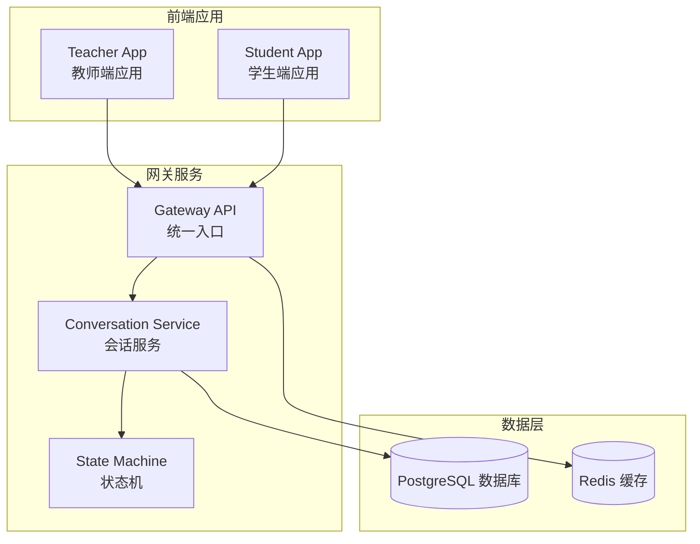

**图表来源**
- [services/gateway/app/main.py](file://services/gateway/app/main.py)
- [apps/teacher-app/src/main.ts](file://apps/teacher-app/src/main.ts)

**章节来源**
- [services/gateway/app/main.py](file://services/gateway/app/main.py)
- [apps/teacher-app/src/main.ts](file://apps/teacher-app/src/main.ts)

## 核心组件

### 会话状态模型

系统定义了五种核心会话状态，支持完整的状态流转：

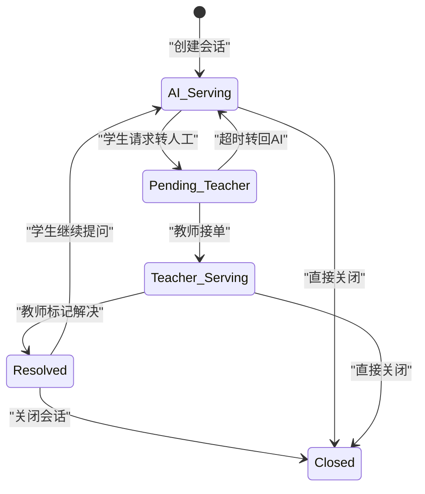

**图表来源**
- [services/gateway/app/models/conversation.py](file://services/gateway/app/models/conversation.py)
- [services/gateway/app/services/state_machine.py](file://services/gateway/app/services/state_machine.py)

### 角色权限模型

系统支持三种用户角色，每种角色具有不同的权限范围：

| 角色 | 权限范围 | 可访问的会话 |
|------|----------|-------------|
| 学生 | 仅自己创建的会话 | 个人所有会话 |
| 教师 | 本学院待处理 + 自己正在服务的 | 待处理 + 已接单 |
| 管理员 | 所有会话 | 全部会话 |

**章节来源**
- [services/gateway/app/models/user.py](file://services/gateway/app/models/user.py)
- [services/gateway/app/services/conversation_service.py](file://services/gateway/app/services/conversation_service.py)

## 架构概览

系统采用分层架构设计，确保职责分离和可维护性：

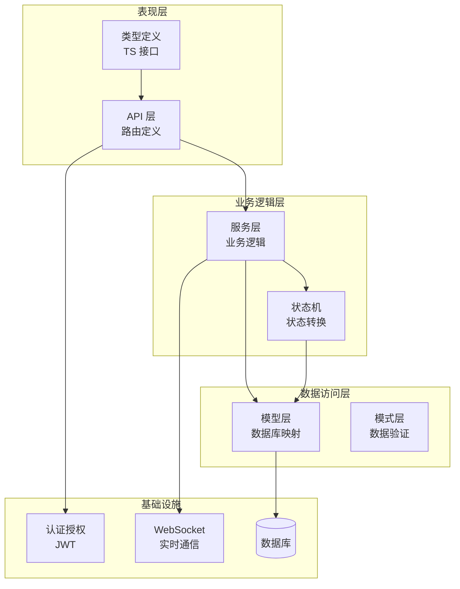

**图表来源**
- [services/gateway/app/routers/conversations.py](file://services/gateway/app/routers/conversations.py)
- [services/gateway/app/services/conversation_service.py](file://services/gateway/app/services/conversation_service.py)
- [services/gateway/app/models/conversation.py](file://services/gateway/app/models/conversation.py)

## 详细组件分析

### 会话列表 API

#### 接口定义

会话列表接口支持分页查询和状态过滤：

**请求参数**
- `page`: 当前页码，默认值：1
- `size`: 每页条数，默认值：20，最大值：100
- `status`: 会话状态过滤器（可选）

**响应结构**
- `items`: 会话列表数组
- `total`: 总记录数

**章节来源**
- [apps/teacher-app/src/api/conversations.ts:8-14](file://apps/teacher-app/src/api/conversations.ts#L8-L14)
- [services/gateway/app/routers/conversations.py:34-51](file://services/gateway/app/routers/conversations.py#L34-L51)

#### 权限控制逻辑

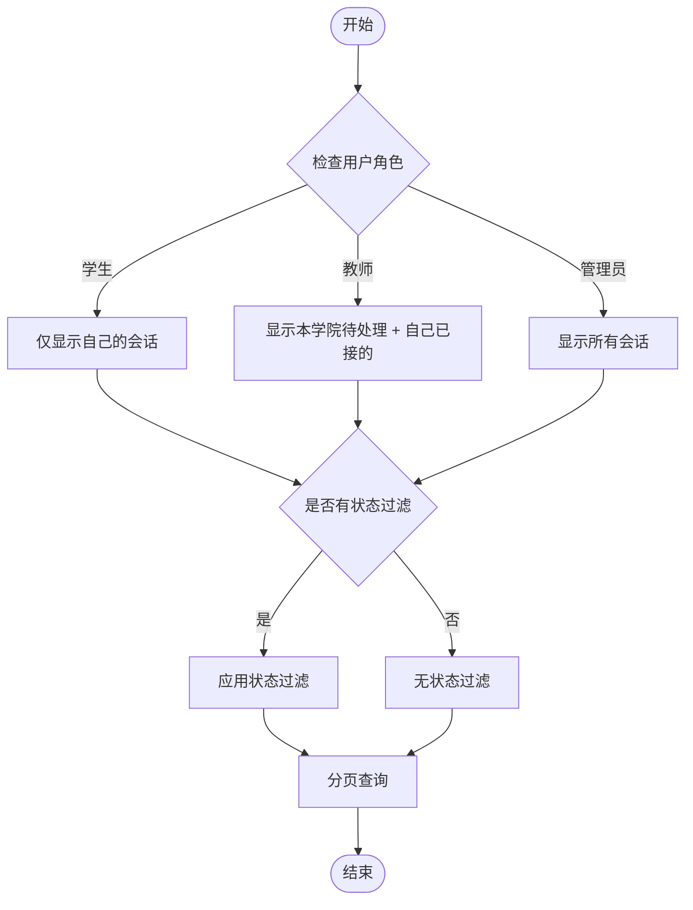

**图表来源**
- [services/gateway/app/services/conversation_service.py:54-111](file://services/gateway/app/services/conversation_service.py#L54-L111)

**章节来源**
- [services/gateway/app/services/conversation_service.py:54-111](file://services/gateway/app/services/conversation_service.py#L54-L111)

### 会话详情 API

#### 接口定义

会话详情接口提供完整的会话信息：

**请求参数**
- `convId`: 会话ID（路径参数）

**响应字段**
- `id`: 会话ID
- `student_id`: 学生ID
- `teacher_id`: 教师ID（可能为空）
- `status`: 会话状态
- `title`: 会话标题
- `created_at`: 创建时间
- `updated_at`: 更新时间
- `resolved_at`: 解决时间（可能为空）
- `closed_at`: 关闭时间（可能为空）

**章节来源**
- [apps/teacher-app/src/api/conversations.ts:16-19](file://apps/teacher-app/src/api/conversations.ts#L16-L19)
- [services/gateway/app/routers/conversations.py:53-62](file://services/gateway/app/routers/conversations.py#L53-L62)

#### 权限验证流程

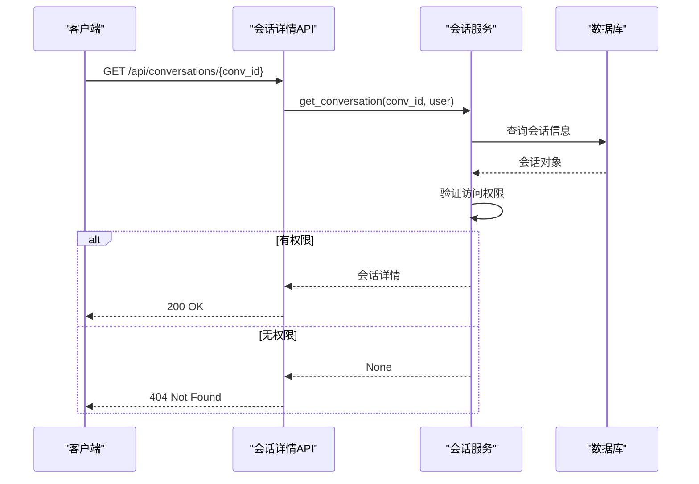

**图表来源**
- [services/gateway/app/services/conversation_service.py:113-127](file://services/gateway/app/services/conversation_service.py#L113-L127)

**章节来源**
- [services/gateway/app/services/conversation_service.py:113-127](file://services/gateway/app/services/conversation_service.py#L113-L127)

### 消息列表 API

#### 接口定义

消息列表接口支持分页查询消息历史：

**请求参数**
- `convId`: 会话ID（路径参数）
- `page`: 当前页码，默认值：1
- `size`: 每页条数，默认值：50，最大值：200

**响应结构**
- `items`: 消息列表数组（按时间升序排列）
- `total`: 总记录数

**章节来源**
- [apps/teacher-app/src/api/conversations.ts:21-28](file://apps/teacher-app/src/api/conversations.ts#L21-L28)
- [services/gateway/app/routers/conversations.py:65-78](file://services/gateway/app/routers/conversations.py#L65-L78)

#### 消息排序规则

系统采用时间升序排列消息，便于展示完整的消息历史：

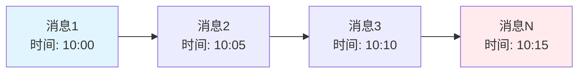

**图表来源**
- [services/gateway/app/services/conversation_service.py:129-146](file://services/gateway/app/services/conversation_service.py#L129-L146)

**章节来源**
- [services/gateway/app/services/conversation_service.py:129-146](file://services/gateway/app/services/conversation_service.py#L129-L146)

### 消息发送 API

#### 接口定义

消息发送接口支持学生和教师发送消息：

**请求参数**
- `convId`: 会话ID（路径参数）
- `content`: 消息内容

**响应字段**
- `id`: 消息ID
- `conversation_id`: 会话ID
- `sender_type`: 发送者类型（student | ai | teacher | system）
- `sender_id`: 发送者ID
- `content`: 消息内容
- `created_at`: 创建时间

**章节来源**
- [apps/teacher-app/src/api/conversations.ts:30-33](file://apps/teacher-app/src/api/conversations.ts#L30-L33)
- [services/gateway/app/routers/conversations.py:81-129](file://services/gateway/app/routers/conversations.py#L81-L129)

#### 发送权限控制

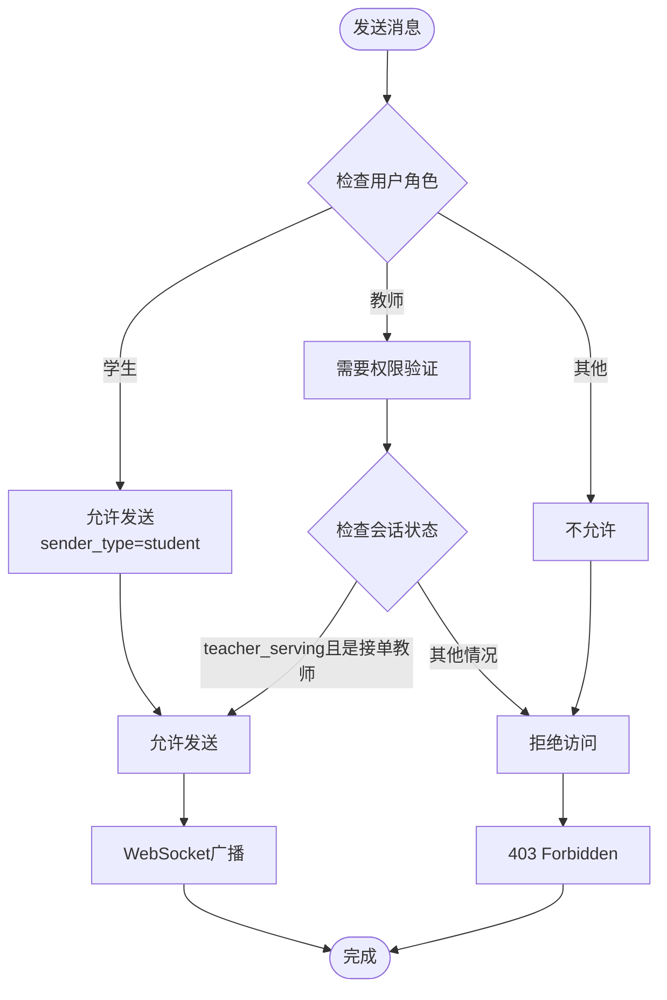

**图表来源**
- [services/gateway/app/routers/conversations.py:98-100](file://services/gateway/app/routers/conversations.py#L98-L100)

**章节来源**
- [services/gateway/app/routers/conversations.py:98-100](file://services/gateway/app/routers/conversations.py#L98-L100)

### 会话接单 API

#### 接口定义

会话接单接口用于教师接取待处理会话：

**请求参数**
- `convId`: 会话ID（路径参数）

**响应结果**
- 返回更新后的会话状态（pending_teacher → teacher_serving）

**章节来源**
- [apps/teacher-app/src/api/conversations.ts:35-38](file://apps/teacher-app/src/api/conversations.ts#L35-L38)
- [services/gateway/app/routers/actions.py:92-112](file://services/gateway/app/routers/actions.py#L92-L112)

#### 状态转换流程

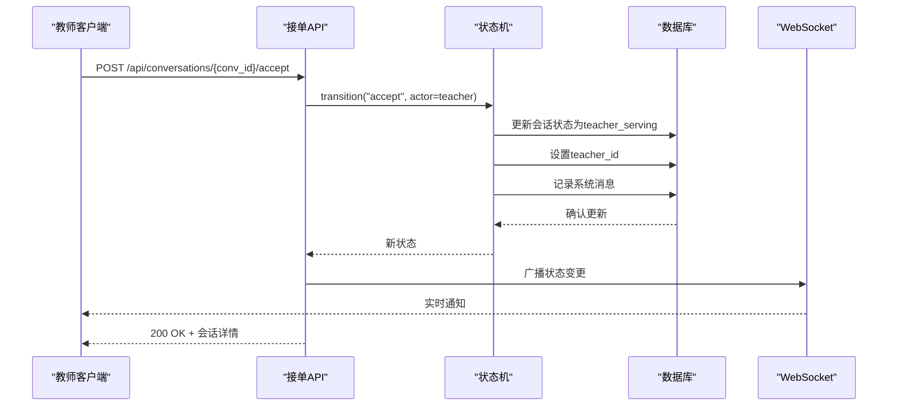

**图表来源**
- [services/gateway/app/routers/actions.py:92-112](file://services/gateway/app/routers/actions.py#L92-L112)
- [services/gateway/app/services/state_machine.py:34-96](file://services/gateway/app/services/state_machine.py#L34-L96)

**章节来源**
- [services/gateway/app/routers/actions.py:92-112](file://services/gateway/app/routers/actions.py#L92-L112)
- [services/gateway/app/services/state_machine.py:34-96](file://services/gateway/app/services/state_machine.py#L34-L96)

### 会话解决 API

#### 接口定义

会话解决接口用于教师标记问题已解决：

**请求参数**
- `convId`: 会话ID（路径参数）

**响应结果**
- 返回更新后的会话状态（teacher_serving → resolved）

**章节来源**
- [apps/teacher-app/src/api/conversations.ts:40-43](file://apps/teacher-app/src/api/conversations.ts#L40-L43)
- [services/gateway/app/routers/actions.py:114-134](file://services/gateway/app/routers/actions.py#L114-L134)

#### 解决权限验证

系统严格验证解决权限，确保只有接单教师可以标记解决：

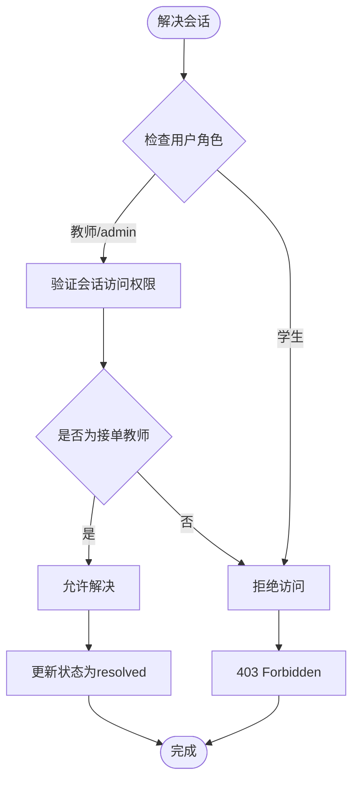

**图表来源**
- [services/gateway/app/routers/actions.py:114-126](file://services/gateway/app/routers/actions.py#L114-L126)

**章节来源**
- [services/gateway/app/routers/actions.py:114-126](file://services/gateway/app/routers/actions.py#L114-L126)

## 依赖分析

### 组件依赖关系

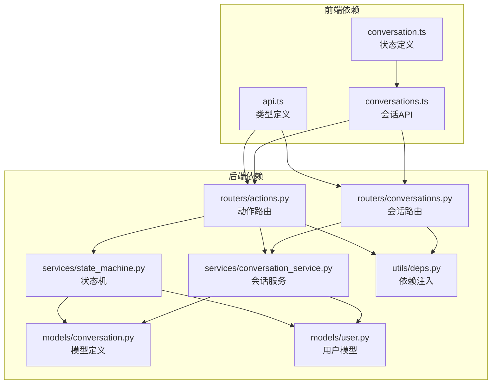

**图表来源**
- [apps/teacher-app/src/api/conversations.ts](file://apps/teacher-app/src/api/conversations.ts)
- [services/gateway/app/routers/conversations.py](file://services/gateway/app/routers/conversations.py)
- [services/gateway/app/routers/actions.py](file://services/gateway/app/routers/actions.py)

### 数据模型关系

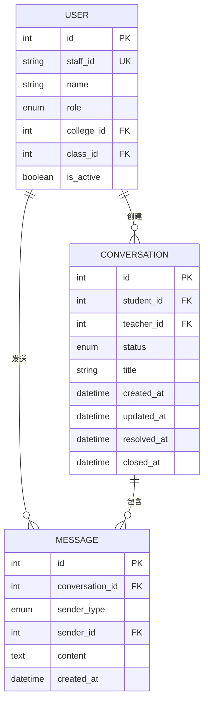

**图表来源**
- [services/gateway/app/models/conversation.py](file://services/gateway/app/models/conversation.py)
- [services/gateway/app/models/user.py](file://services/gateway/app/models/user.py)

**章节来源**
- [services/gateway/app/models/conversation.py](file://services/gateway/app/models/conversation.py)
- [services/gateway/app/models/user.py](file://services/gateway/app/models/user.py)

## 性能考虑

### 查询优化策略

1. **索引优化**
   - 会话表：`student_id`、`status` 索引
   - 消息表：`conversation_id`、`(conversation_id, created_at)` 复合索引

2. **分页查询**
   - 默认每页20条记录，最大100条
   - 使用 `OFFSET/LIMIT` 进行分页，避免全表扫描

3. **状态过滤**
   - 教师端默认只查询待处理和已接单会话
   - 减少不必要的数据传输

### 缓存策略

系统采用多级缓存机制：
- Redis 缓存热点数据
- 前端本地缓存最近会话
- WebSocket 实时推送增量更新

## 故障排除指南

### 常见错误及解决方案

| 错误类型 | HTTP状态码 | 错误原因 | 解决方案 |
|---------|-----------|---------|---------|
| 未认证 | 401 | JWT令牌无效或过期 | 重新登录获取新令牌 |
| 权限不足 | 403 | 无权访问该会话 | 检查用户角色和会话归属 |
| 会话不存在 | 404 | 会话ID错误或已被删除 | 验证会话ID有效性 |
| 状态冲突 | 409 | 非法状态转换 | 检查当前会话状态 |

### 状态机异常处理

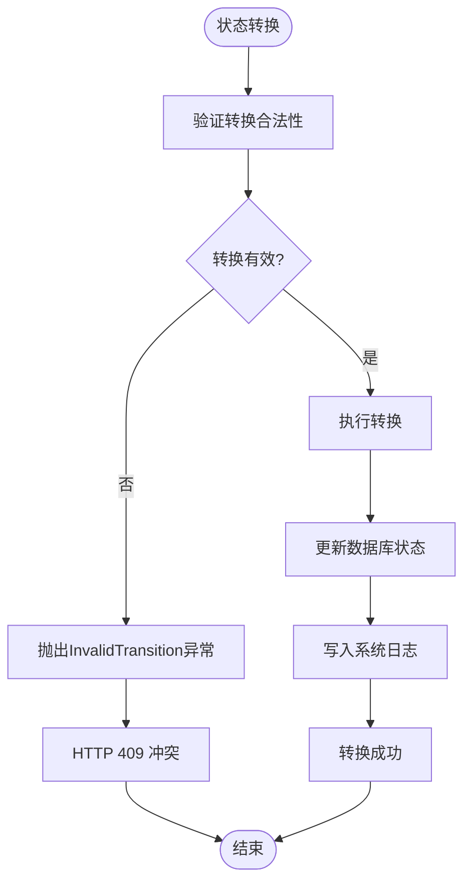

**图表来源**
- [services/gateway/app/services/state_machine.py:34-48](file://services/gateway/app/services/state_machine.py#L34-L48)

**章节来源**
- [services/gateway/app/services/state_machine.py:8-14](file://services/gateway/app/services/state_machine.py#L8-L14)

## 结论

医小管 v2 教师端会话管理 API 提供了一个完整、健壮的会话管理系统。系统通过清晰的分层架构、严格的权限控制和完善的错误处理机制，确保了会话管理的安全性和可靠性。

关键特性包括：
- 支持多角色用户和灵活的权限控制
- 完整的状态流转管理
- 实时消息推送和分页查询
- 严格的权限验证和错误处理
- 可扩展的架构设计

该系统为教师提供了高效的会话管理工具，为学生提供了便捷的咨询通道，为管理员提供了全面的监控能力。

## 附录

### TypeScript 类型定义

#### 会话接口
```typescript
interface Conversation {
  id: number;
  student_id: number;
  teacher_id?: number | null;
  status: string;
  title?: string;
  dify_conversation_id?: string | null;
  created_at: string;
  updated_at: string;
  student_name?: string;
  student_class?: string;
}
```

#### 消息接口
```typescript
interface Message {
  id: number;
  conversation_id: number;
  sender_type: string;
  sender_id?: number | null;
  content: string;
  created_at: string;
  metadata_?: any;
}
```

#### 分页响应接口
```typescript
interface PageResult<T> {
  items: T[];
  total: number;
}
```

#### 会话状态枚举
```typescript
type ConversationStatus =
  | 'ai_serving'
  | 'pending_teacher'
  | 'teacher_serving'
  | 'resolved'
  | 'closed';
```

### 使用示例

#### 获取会话列表
```typescript
// 获取第1页，每页20条，状态为待处理
const result = await listConversations(1, 20, 'pending_teacher');
console.log(result.items); // 会话列表
console.log(result.total); // 总数
```

#### 发送消息
```typescript
const message = await sendMessage(123, '您好，请问有什么可以帮助您的？');
console.log(message.id); // 新消息ID
console.log(message.sender_type); // 'teacher'
```

#### 接单会话
```typescript
const conversation = await acceptConversation(123);
console.log(conversation.status); // 'teacher_serving'
```