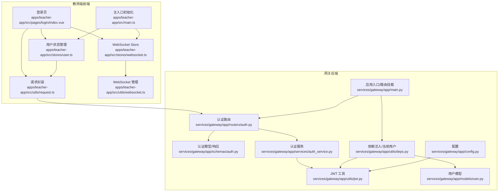
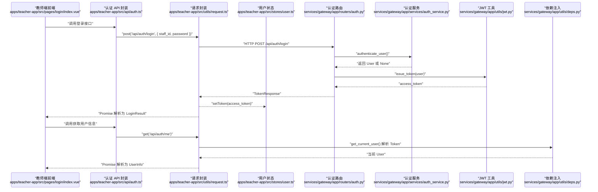
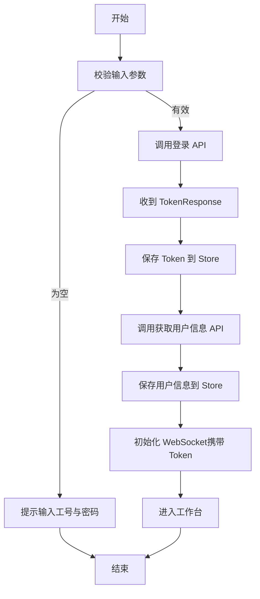
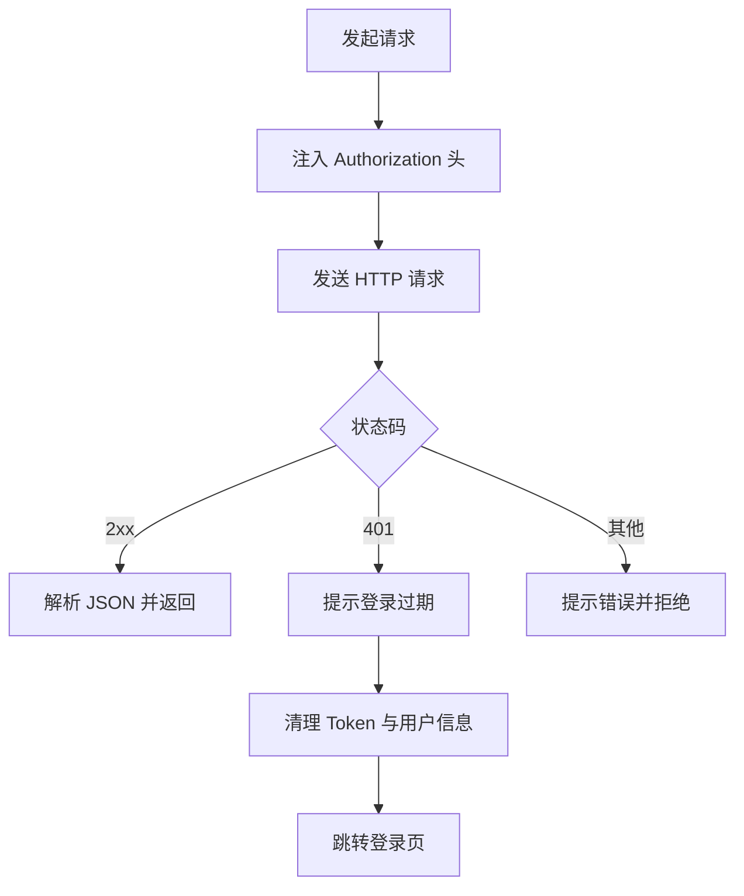
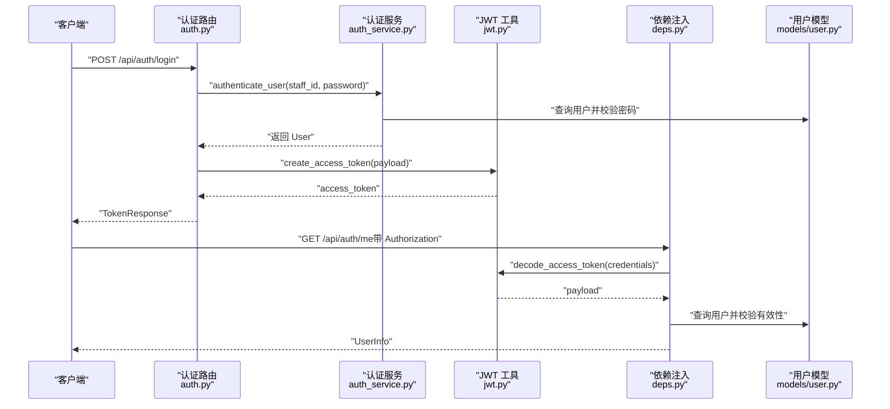
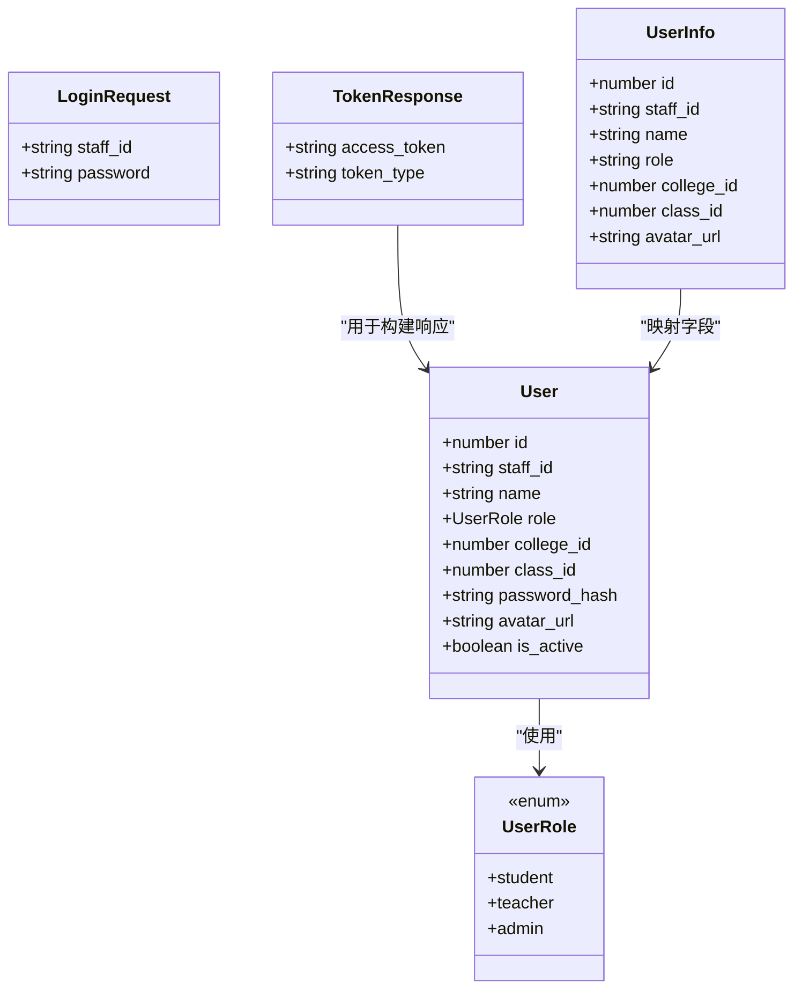
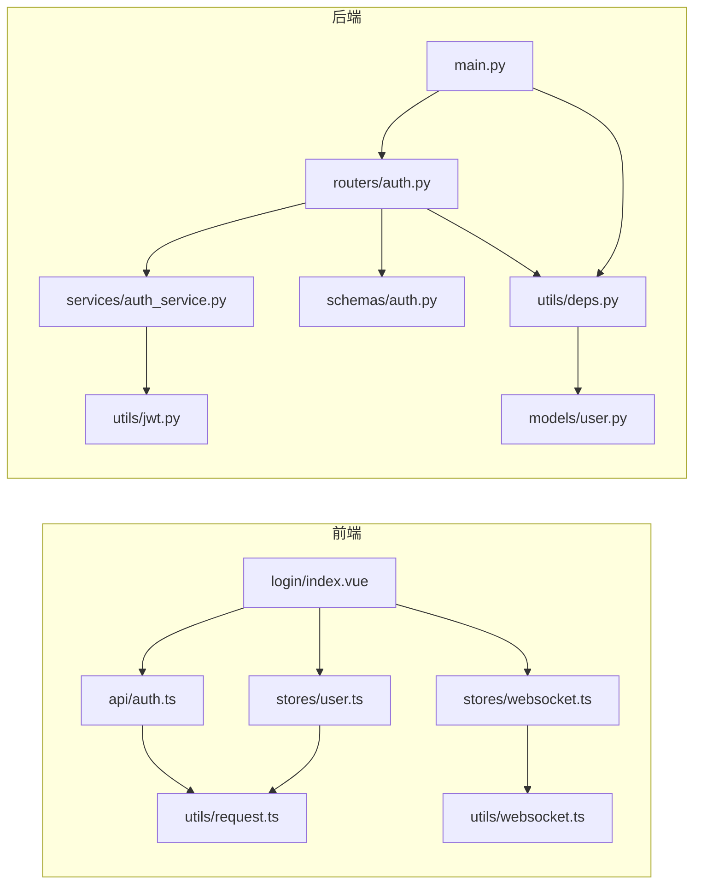

# 用户认证 API

<cite>
**本文引用的文件**
- [apps/teacher-app/src/api/auth.ts](file://apps/teacher-app/src/api/auth.ts)
- [apps/teacher-app/src/utils/request.ts](file://apps/teacher-app/src/utils/request.ts)
- [apps/teacher-app/src/stores/user.ts](file://apps/teacher-app/src/stores/user.ts)
- [apps/teacher-app/src/pages/login/index.vue](file://apps/teacher-app/src/pages/login/index.vue)
- [apps/teacher-app/src/main.ts](file://apps/teacher-app/src/main.ts)
- [apps/teacher-app/src/stores/websocket.ts](file://apps/teacher-app/src/stores/websocket.ts)
- [apps/teacher-app/src/utils/websocket.ts](file://apps/teacher-app/src/utils/websocket.ts)
- [apps/teacher-app/src/types/api.ts](file://apps/teacher-app/src/types/api.ts)
- [services/gateway/app/routers/auth.py](file://services/gateway/app/routers/auth.py)
- [services/gateway/app/schemas/auth.py](file://services/gateway/app/schemas/auth.py)
- [services/gateway/app/services/auth_service.py](file://services/gateway/app/services/auth_service.py)
- [services/gateway/app/utils/jwt.py](file://services/gateway/app/utils/jwt.py)
- [services/gateway/app/utils/deps.py](file://services/gateway/app/utils/deps.py)
- [services/gateway/app/models/user.py](file://services/gateway/app/models/user.py)
- [services/gateway/app/config.py](file://services/gateway/app/config.py)
- [services/gateway/app/main.py](file://services/gateway/app/main.py)
</cite>

## 目录
1. [简介](#简介)
2. [项目结构](#项目结构)
3. [核心组件](#核心组件)
4. [架构总览](#架构总览)
5. [详细组件分析](#详细组件分析)
6. [依赖关系分析](#依赖关系分析)
7. [性能考虑](#性能考虑)
8. [故障排查指南](#故障排查指南)
9. [结论](#结论)
10. [附录](#附录)

## 简介
本文件面向“医小管 v2 教师端”的用户认证 API，系统性梳理教师登录、登出、Token 管理、权限验证与拦截器使用等关键能力。重点覆盖以下方面：
- 登录与登出流程：登录成功后获取 JWT，前端持久化并随请求携带；登出清理本地状态与存储。
- Token 管理：前端基于 Pinia Store 管理 Token 与用户信息；后端基于 HS256 签发与校验。
- 权限验证：通过依赖注入解析 Authorization 头中的 Bearer Token，校验用户有效性与激活状态。
- 安全策略与最佳实践：Token 过期处理、自动登出、请求拦截与错误提示。

## 项目结构
教师端采用前后端分离架构：
- 前端（Vue + UniApp）：负责登录表单、请求封装、Token 存储、自动登出与 WebSocket 连接。
- 后端（FastAPI）：提供认证接口、用户信息查询、JWT 签发与校验、依赖注入解析当前用户。

图表来源
- [apps/teacher-app/src/pages/login/index.vue:164-191](file://apps/teacher-app/src/pages/login/index.vue#L164-L191)
- [apps/teacher-app/src/utils/request.ts:10-77](file://apps/teacher-app/src/utils/request.ts#L10-L77)
- [apps/teacher-app/src/stores/user.ts:19-47](file://apps/teacher-app/src/stores/user.ts#L19-L47)
- [apps/teacher-app/src/main.ts:9-19](file://apps/teacher-app/src/main.ts#L9-L19)
- [apps/teacher-app/src/utils/websocket.ts:26-30](file://apps/teacher-app/src/utils/websocket.ts#L26-L30)
- [apps/teacher-app/src/stores/websocket.ts:9-14](file://apps/teacher-app/src/stores/websocket.ts#L9-L14)
- [services/gateway/app/routers/auth.py:12-34](file://services/gateway/app/routers/auth.py#L12-L34)
- [services/gateway/app/schemas/auth.py:4-23](file://services/gateway/app/schemas/auth.py#L4-L23)
- [services/gateway/app/services/auth_service.py:8-35](file://services/gateway/app/services/auth_service.py#L8-L35)
- [services/gateway/app/utils/jwt.py:6-16](file://services/gateway/app/utils/jwt.py#L6-L16)
- [services/gateway/app/utils/deps.py:14-35](file://services/gateway/app/utils/deps.py#L14-L35)
- [services/gateway/app/models/user.py:45-58](file://services/gateway/app/models/user.py#L45-L58)
- [services/gateway/app/config.py:10-13](file://services/gateway/app/config.py#L10-L13)
- [services/gateway/app/main.py:70-78](file://services/gateway/app/main.py#L70-L78)

章节来源
- [apps/teacher-app/src/pages/login/index.vue:164-191](file://apps/teacher-app/src/pages/login/index.vue#L164-L191)
- [apps/teacher-app/src/utils/request.ts:10-77](file://apps/teacher-app/src/utils/request.ts#L10-L77)
- [apps/teacher-app/src/stores/user.ts:19-47](file://apps/teacher-app/src/stores/user.ts#L19-L47)
- [apps/teacher-app/src/main.ts:9-19](file://apps/teacher-app/src/main.ts#L9-L19)
- [apps/teacher-app/src/utils/websocket.ts:26-30](file://apps/teacher-app/src/utils/websocket.ts#L26-L30)
- [apps/teacher-app/src/stores/websocket.ts:9-14](file://apps/teacher-app/src/stores/websocket.ts#L9-L14)
- [services/gateway/app/routers/auth.py:12-34](file://services/gateway/app/routers/auth.py#L12-L34)
- [services/gateway/app/schemas/auth.py:4-23](file://services/gateway/app/schemas/auth.py#L4-L23)
- [services/gateway/app/services/auth_service.py:8-35](file://services/gateway/app/services/auth_service.py#L8-L35)
- [services/gateway/app/utils/jwt.py:6-16](file://services/gateway/app/utils/jwt.py#L6-L16)
- [services/gateway/app/utils/deps.py:14-35](file://services/gateway/app/utils/deps.py#L14-L35)
- [services/gateway/app/models/user.py:45-58](file://services/gateway/app/models/user.py#L45-L58)
- [services/gateway/app/config.py:10-13](file://services/gateway/app/config.py#L10-L13)
- [services/gateway/app/main.py:70-78](file://services/gateway/app/main.py#L70-L78)

## 核心组件
- 教师端认证 API 封装：定义登录与获取当前用户信息两个接口，返回类型与参数模型清晰。
- 请求拦截与自动登出：统一请求封装在成功回调中处理 401，触发登出并跳转登录页。
- Token 存储与携带：Pinia Store 持久化 Token 与用户信息；请求发起前自动注入 Authorization 头。
- 后端认证路由：提供 POST /api/auth/login 与 GET /api/auth/me；登录签发 JWT，查询当前用户。
- JWT 工具：签发与解码，使用配置项中的密钥、算法与过期时间。
- 依赖注入解析当前用户：从 Authorization 头中提取 Bearer Token，解码后查询数据库并校验用户有效性。

章节来源
- [apps/teacher-app/src/api/auth.ts:10-42](file://apps/teacher-app/src/api/auth.ts#L10-L42)
- [apps/teacher-app/src/utils/request.ts:42-48](file://apps/teacher-app/src/utils/request.ts#L42-L48)
- [apps/teacher-app/src/stores/user.ts:30-47](file://apps/teacher-app/src/stores/user.ts#L30-L47)
- [services/gateway/app/routers/auth.py:12-34](file://services/gateway/app/routers/auth.py#L12-L34)
- [services/gateway/app/utils/jwt.py:6-16](file://services/gateway/app/utils/jwt.py#L6-L16)
- [services/gateway/app/utils/deps.py:14-35](file://services/gateway/app/utils/deps.py#L14-L35)

## 架构总览
下图展示教师端登录到后端认证、Token 管理与权限验证的整体流程。

图表来源
- [apps/teacher-app/src/pages/login/index.vue:172-180](file://apps/teacher-app/src/pages/login/index.vue#L172-L180)
- [apps/teacher-app/src/api/auth.ts:30-42](file://apps/teacher-app/src/api/auth.ts#L30-L42)
- [apps/teacher-app/src/utils/request.ts:10-77](file://apps/teacher-app/src/utils/request.ts#L10-L77)
- [apps/teacher-app/src/stores/user.ts:30-33](file://apps/teacher-app/src/stores/user.ts#L30-L33)
- [services/gateway/app/routers/auth.py:12-34](file://services/gateway/app/routers/auth.py#L12-L34)
- [services/gateway/app/services/auth_service.py:32-34](file://services/gateway/app/services/auth_service.py#L32-L34)
- [services/gateway/app/utils/jwt.py:6-11](file://services/gateway/app/utils/jwt.py#L6-L11)
- [services/gateway/app/utils/deps.py:14-35](file://services/gateway/app/utils/deps.py#L14-L35)

## 详细组件分析

### 教师端登录流程
- 登录页收集工号与密码，调用登录 API。
- 登录成功后，前端保存 access_token，并拉取当前用户信息填充用户状态。
- 建立 WebSocket 连接，携带 Token 参数。
- 若已登录，应用启动时自动恢复 Token 并重建 WebSocket。

图表来源
- [apps/teacher-app/src/pages/login/index.vue:164-191](file://apps/teacher-app/src/pages/login/index.vue#L164-L191)
- [apps/teacher-app/src/api/auth.ts:30-42](file://apps/teacher-app/src/api/auth.ts#L30-L42)
- [apps/teacher-app/src/stores/user.ts:30-38](file://apps/teacher-app/src/stores/user.ts#L30-L38)
- [apps/teacher-app/src/stores/websocket.ts:9-14](file://apps/teacher-app/src/stores/websocket.ts#L9-L14)
- [apps/teacher-app/src/utils/websocket.ts:66-76](file://apps/teacher-app/src/utils/websocket.ts#L66-L76)

章节来源
- [apps/teacher-app/src/pages/login/index.vue:164-191](file://apps/teacher-app/src/pages/login/index.vue#L164-L191)
- [apps/teacher-app/src/stores/user.ts:30-38](file://apps/teacher-app/src/stores/user.ts#L30-L38)
- [apps/teacher-app/src/stores/websocket.ts:9-14](file://apps/teacher-app/src/stores/websocket.ts#L9-L14)
- [apps/teacher-app/src/utils/websocket.ts:66-76](file://apps/teacher-app/src/utils/websocket.ts#L66-L76)

### 请求拦截与自动登出
- 统一请求封装在成功回调中检测 401，弹出提示、清理本地状态并跳转登录页。
- 自动注入 Authorization: Bearer <token> 请求头，确保受保护接口可用。

图表来源
- [apps/teacher-app/src/utils/request.ts:42-48](file://apps/teacher-app/src/utils/request.ts#L42-L48)
- [apps/teacher-app/src/utils/request.ts:67-73](file://apps/teacher-app/src/utils/request.ts#L67-L73)
- [apps/teacher-app/src/stores/user.ts:40-47](file://apps/teacher-app/src/stores/user.ts#L40-L47)

章节来源
- [apps/teacher-app/src/utils/request.ts:42-48](file://apps/teacher-app/src/utils/request.ts#L42-L48)
- [apps/teacher-app/src/utils/request.ts:67-73](file://apps/teacher-app/src/utils/request.ts#L67-L73)
- [apps/teacher-app/src/stores/user.ts:40-47](file://apps/teacher-app/src/stores/user.ts#L40-L47)

### 后端认证与权限验证
- 登录接口：接收工号与密码，验证用户存在且密码正确，签发 JWT。
- 当前用户接口：依赖注入解析 Token，查询用户并校验有效性。
- JWT 配置：密钥、算法、过期时间来自配置；默认过期 72 小时。

图表来源
- [services/gateway/app/routers/auth.py:12-34](file://services/gateway/app/routers/auth.py#L12-L34)
- [services/gateway/app/services/auth_service.py:8-17](file://services/gateway/app/services/auth_service.py#L8-L17)
- [services/gateway/app/services/auth_service.py:32-34](file://services/gateway/app/services/auth_service.py#L32-L34)
- [services/gateway/app/utils/jwt.py:6-16](file://services/gateway/app/utils/jwt.py#L6-L16)
- [services/gateway/app/utils/deps.py:14-35](file://services/gateway/app/utils/deps.py#L14-L35)
- [services/gateway/app/models/user.py:45-58](file://services/gateway/app/models/user.py#L45-L58)

章节来源
- [services/gateway/app/routers/auth.py:12-34](file://services/gateway/app/routers/auth.py#L12-L34)
- [services/gateway/app/services/auth_service.py:8-17](file://services/gateway/app/services/auth_service.py#L8-L17)
- [services/gateway/app/services/auth_service.py:32-34](file://services/gateway/app/services/auth_service.py#L32-L34)
- [services/gateway/app/utils/jwt.py:6-16](file://services/gateway/app/utils/jwt.py#L6-L16)
- [services/gateway/app/utils/deps.py:14-35](file://services/gateway/app/utils/deps.py#L14-L35)
- [services/gateway/app/models/user.py:45-58](file://services/gateway/app/models/user.py#L45-L58)

### 数据模型与类型定义
- 登录请求与 Token 响应：包含 access_token 与 token_type。
- 用户信息：包含基础字段与角色标识。
- 用户模型：角色枚举、激活状态、关联学院/班级等。

图表来源
- [services/gateway/app/schemas/auth.py:4-23](file://services/gateway/app/schemas/auth.py#L4-L23)
- [services/gateway/app/models/user.py:10-13](file://services/gateway/app/models/user.py#L10-L13)
- [services/gateway/app/models/user.py:45-58](file://services/gateway/app/models/user.py#L45-L58)
- [apps/teacher-app/src/types/api.ts:4-12](file://apps/teacher-app/src/types/api.ts#L4-L12)

章节来源
- [services/gateway/app/schemas/auth.py:4-23](file://services/gateway/app/schemas/auth.py#L4-L23)
- [services/gateway/app/models/user.py:10-13](file://services/gateway/app/models/user.py#L10-L13)
- [services/gateway/app/models/user.py:45-58](file://services/gateway/app/models/user.py#L45-L58)
- [apps/teacher-app/src/types/api.ts:4-12](file://apps/teacher-app/src/types/api.ts#L4-L12)

## 依赖关系分析
- 前端依赖：
  - 登录页依赖认证 API 与用户 Store。
  - 请求封装依赖用户 Store 注入 Token。
  - WebSocket 管理依赖 Token 进行连接。
- 后端依赖：
  - 认证路由依赖认证服务与 JWT 工具。
  - 依赖注入解析当前用户依赖 JWT 工具与用户模型。
  - 应用入口挂载认证路由并注入 Redis。

图表来源
- [apps/teacher-app/src/pages/login/index.vue:126-128](file://apps/teacher-app/src/pages/login/index.vue#L126-L128)
- [apps/teacher-app/src/api/auth.ts:30-42](file://apps/teacher-app/src/api/auth.ts#L30-L42)
- [apps/teacher-app/src/stores/user.ts:30-33](file://apps/teacher-app/src/stores/user.ts#L30-L33)
- [apps/teacher-app/src/utils/request.ts:67-73](file://apps/teacher-app/src/utils/request.ts#L67-L73)
- [apps/teacher-app/src/stores/websocket.ts:9-14](file://apps/teacher-app/src/stores/websocket.ts#L9-L14)
- [apps/teacher-app/src/utils/websocket.ts:66-76](file://apps/teacher-app/src/utils/websocket.ts#L66-L76)
- [services/gateway/app/routers/auth.py:12-34](file://services/gateway/app/routers/auth.py#L12-L34)
- [services/gateway/app/services/auth_service.py:32-34](file://services/gateway/app/services/auth_service.py#L32-L34)
- [services/gateway/app/utils/jwt.py:6-11](file://services/gateway/app/utils/jwt.py#L6-L11)
- [services/gateway/app/utils/deps.py:14-35](file://services/gateway/app/utils/deps.py#L14-L35)
- [services/gateway/app/models/user.py:45-58](file://services/gateway/app/models/user.py#L45-L58)
- [services/gateway/app/main.py:70-78](file://services/gateway/app/main.py#L70-L78)

章节来源
- [apps/teacher-app/src/pages/login/index.vue:126-128](file://apps/teacher-app/src/pages/login/index.vue#L126-L128)
- [apps/teacher-app/src/api/auth.ts:30-42](file://apps/teacher-app/src/api/auth.ts#L30-L42)
- [apps/teacher-app/src/stores/user.ts:30-33](file://apps/teacher-app/src/stores/user.ts#L30-L33)
- [apps/teacher-app/src/utils/request.ts:67-73](file://apps/teacher-app/src/utils/request.ts#L67-L73)
- [apps/teacher-app/src/stores/websocket.ts:9-14](file://apps/teacher-app/src/stores/websocket.ts#L9-L14)
- [apps/teacher-app/src/utils/websocket.ts:66-76](file://apps/teacher-app/src/utils/websocket.ts#L66-L76)
- [services/gateway/app/routers/auth.py:12-34](file://services/gateway/app/routers/auth.py#L12-L34)
- [services/gateway/app/services/auth_service.py:32-34](file://services/gateway/app/services/auth_service.py#L32-L34)
- [services/gateway/app/utils/jwt.py:6-11](file://services/gateway/app/utils/jwt.py#L6-L11)
- [services/gateway/app/utils/deps.py:14-35](file://services/gateway/app/utils/deps.py#L14-L35)
- [services/gateway/app/models/user.py:45-58](file://services/gateway/app/models/user.py#L45-L58)
- [services/gateway/app/main.py:70-78](file://services/gateway/app/main.py#L70-L78)

## 性能考虑
- Token 过期时间：默认 72 小时，建议结合业务场景评估是否缩短以提升安全性。
- 请求拦截：统一处理 401，避免重复逻辑，减少前端分支复杂度。
- WebSocket 连接：断线重连指数退避，最大重连次数限制，降低风暴效应。
- 数据库与缓存：后端健康检查包含 PostgreSQL 与 Redis，确保依赖可用。

## 故障排查指南
- 登录失败
  - 检查工号与密码是否正确，确认用户处于激活状态。
  - 查看后端日志与认证服务返回值。
- 401 未授权
  - 前端会自动清理 Token 并跳转登录页；检查请求头是否正确注入 Authorization。
  - 确认 Token 未过期或被撤销。
- 用户信息获取失败
  - 确认 Token 对应用户存在且有效；检查依赖注入解析流程。
- WebSocket 连接异常
  - 检查 Token 是否随查询参数传递；确认服务端 WebSocket 路由可访问。
  - 关注心跳与重连逻辑，观察控制台输出。

章节来源
- [apps/teacher-app/src/utils/request.ts:42-48](file://apps/teacher-app/src/utils/request.ts#L42-L48)
- [apps/teacher-app/src/utils/request.ts:67-73](file://apps/teacher-app/src/utils/request.ts#L67-L73)
- [services/gateway/app/utils/deps.py:14-35](file://services/gateway/app/utils/deps.py#L14-L35)
- [apps/teacher-app/src/utils/websocket.ts:148-154](file://apps/teacher-app/src/utils/websocket.ts#L148-L154)

## 结论
本认证体系以 JWT 为核心，前后端职责清晰：前端负责登录、Token 存储与请求拦截，后端负责认证与权限解析。通过统一的请求封装与依赖注入，实现了简洁可靠的认证流程。建议在生产环境强化密钥管理、缩短 Token 过期时间并完善审计日志。

## 附录
- 配置项（JWT 相关）
  - 密钥：用于签名与验证
  - 算法：HS256
  - 过期时间：小时单位，默认 72 小时
- 路由前缀
  - 认证：/api/auth
  - 会话与聊天：/api/conversations、/api/chat
  - WebSocket：/ws

章节来源
- [services/gateway/app/config.py:10-13](file://services/gateway/app/config.py#L10-L13)
- [services/gateway/app/main.py:70-78](file://services/gateway/app/main.py#L70-L78)