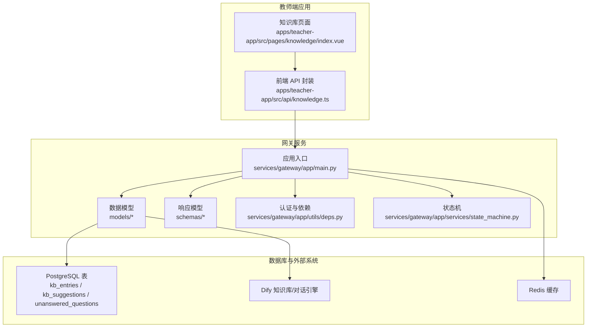
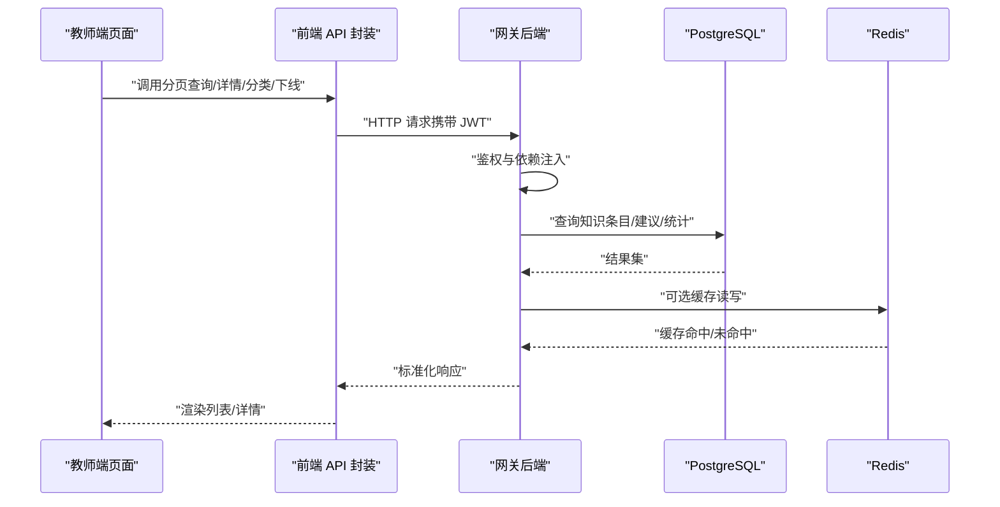
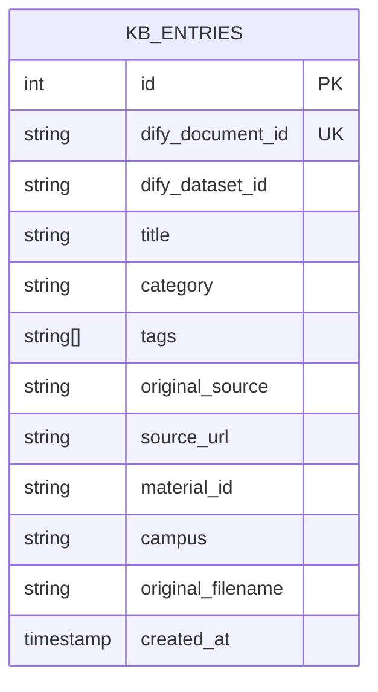
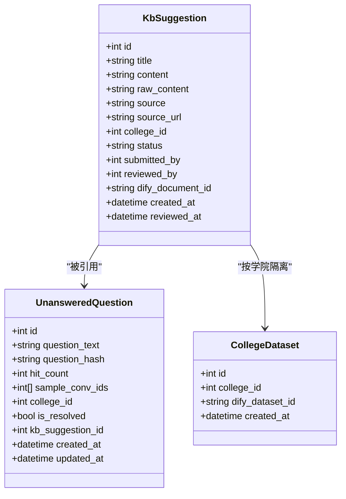
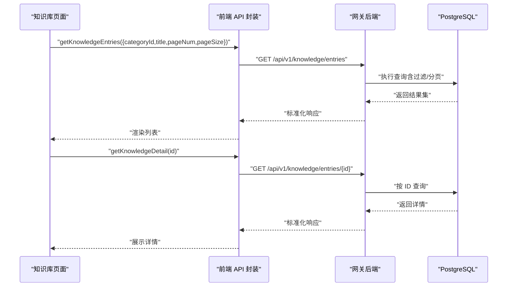
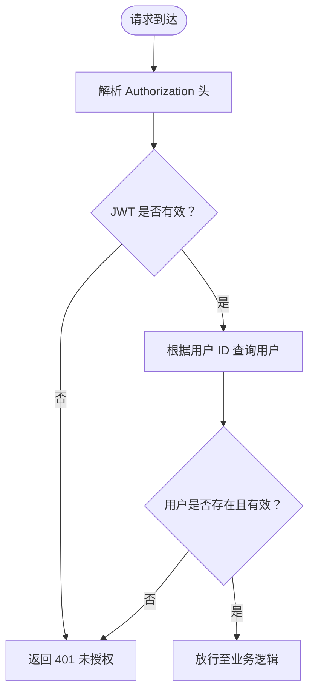
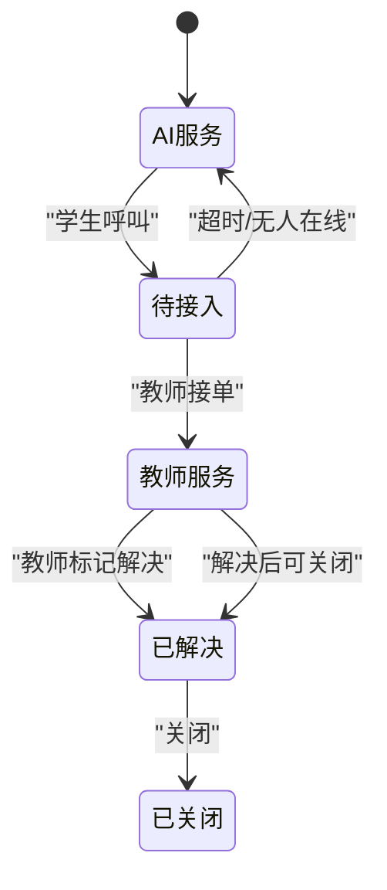
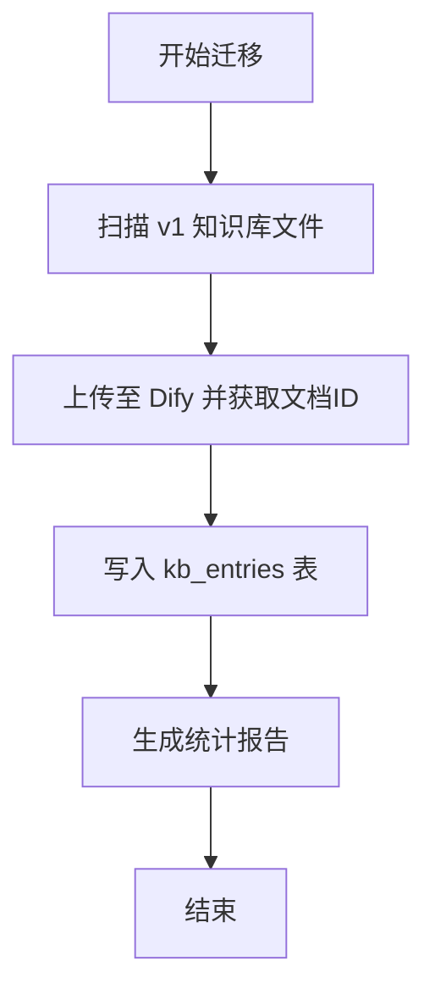
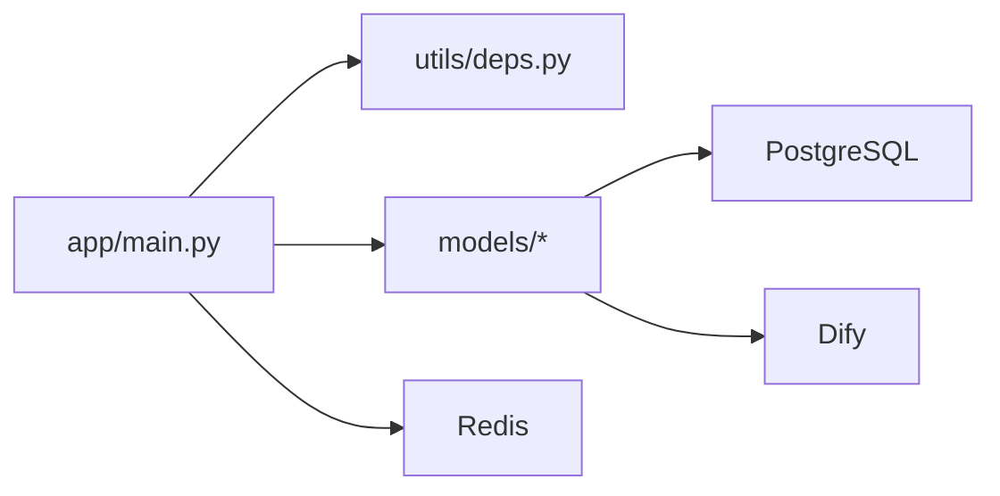

# 知识库管理 API

<cite>
**本文引用的文件**
- [apps/teacher-app/src/api/knowledge.ts](file://apps/teacher-app/src/api/knowledge.ts)
- [apps/teacher-app/src/pages/knowledge/index.vue](file://apps/teacher-app/src/pages/knowledge/index.vue)
- [services/gateway/app/main.py](file://services/gateway/app/main.py)
- [services/gateway/app/models/kb_entry.py](file://services/gateway/app/models/kb_entry.py)
- [services/gateway/app/models/knowledge.py](file://services/gateway/app/models/knowledge.py)
- [services/gateway/app/models/conversation.py](file://services/gateway/app/models/conversation.py)
- [services/gateway/app/schemas/conversation.py](file://services/gateway/app/schemas/conversation.py)
- [services/gateway/app/services/state_machine.py](file://services/gateway/app/services/state_machine.py)
- [services/gateway/app/utils/deps.py](file://services/gateway/app/utils/deps.py)
- [services/gateway/app/models/user.py](file://services/gateway/app/models/user.py)
- [services/gateway/alembic/versions/ff1f0ab0c5f8_add_kb_entries_table.py](file://services/gateway/alembic/versions/ff1f0ab0c5f8_add_kb_entries_table.py)
- [s3-kb-migrate.md](file://s3-kb-migrate.md)
</cite>

## 目录
1. [简介](#简介)
2. [项目结构](#项目结构)
3. [核心组件](#核心组件)
4. [架构总览](#架构总览)
5. [详细组件分析](#详细组件分析)
6. [依赖分析](#依赖分析)
7. [性能考虑](#性能考虑)
8. [故障排查指南](#故障排查指南)
9. [结论](#结论)
10. [附录](#附录)

## 简介
本文件面向“医小管 v2 教师端知识库管理 API”的使用与维护，系统性梳理知识条目的增删改查、分类管理、搜索检索、权限控制、版本与迁移、以及与会话系统的关联机制。文档以教师端前端调用与网关后端实现为主线，结合数据库模型与状态机，给出清晰的 API 工作流、错误处理与最佳实践建议。

## 项目结构
- 前端教师端位于 apps/teacher-app，包含知识库页面与 API 封装。
- 网关后端位于 services/gateway，采用 FastAPI + SQLAlchemy + PostgreSQL + Redis 架构。
- 数据库迁移脚本与知识库迁移流程在 scripts 与 alembic 中定义。
- 会话系统与知识库通过 Dify 集成，知识条目与会话状态流转存在间接关联。

图表来源
- [services/gateway/app/main.py:1-78](file://services/gateway/app/main.py#L1-L78)
- [apps/teacher-app/src/api/knowledge.ts:1-45](file://apps/teacher-app/src/api/knowledge.ts#L1-L45)
- [apps/teacher-app/src/pages/knowledge/index.vue:84-164](file://apps/teacher-app/src/pages/knowledge/index.vue#L84-L164)

章节来源
- [services/gateway/app/main.py:1-78](file://services/gateway/app/main.py#L1-L78)
- [apps/teacher-app/src/api/knowledge.ts:1-45](file://apps/teacher-app/src/api/knowledge.ts#L1-L45)
- [apps/teacher-app/src/pages/knowledge/index.vue:84-164](file://apps/teacher-app/src/pages/knowledge/index.vue#L84-L164)

## 核心组件
- 知识库条目模型：定义知识条目在数据库中的字段与索引，支持标题、分类、标签、来源信息与时间戳。
- 知识建议与未解答问题模型：支撑知识条目的建议与问题聚合，便于知识治理与质量控制。
- 知识库 API 封装：提供分页查询、详情获取、分类列表、下线接口等前端调用方法。
- 认证与依赖注入：基于 JWT 的用户解析与活跃状态校验。
- 状态机与会话：会话状态流转与广播通知，体现知识库与会话系统的间接关联。

章节来源
- [services/gateway/app/models/kb_entry.py:9-31](file://services/gateway/app/models/kb_entry.py#L9-L31)
- [services/gateway/app/models/knowledge.py:22-62](file://services/gateway/app/models/knowledge.py#L22-L62)
- [apps/teacher-app/src/api/knowledge.ts:3-44](file://apps/teacher-app/src/api/knowledge.ts#L3-L44)
- [services/gateway/app/utils/deps.py:14-35](file://services/gateway/app/utils/deps.py#L14-L35)

## 架构总览
- 前端通过封装好的 API 方法访问网关后端。
- 网关后端负责鉴权、参数校验、数据库访问与外部系统交互（如 Dify）。
- 数据层采用 PostgreSQL 存储知识条目与建议，Redis 提供缓存能力。
- 会话系统通过状态机驱动状态变化，并在知识库场景中与知识条目检索/命中产生关联。

图表来源
- [apps/teacher-app/src/api/knowledge.ts:3-44](file://apps/teacher-app/src/api/knowledge.ts#L3-L44)
- [services/gateway/app/main.py:70-77](file://services/gateway/app/main.py#L70-L77)
- [services/gateway/app/utils/deps.py:14-35](file://services/gateway/app/utils/deps.py#L14-L35)

## 详细组件分析

### 知识库条目模型与字段约束
- 关键字段
  - 标题：字符串，最大长度限制，建立非唯一索引，用于检索与展示。
  - 分类：字符串，可空，用于前端分类筛选。
  - 标签：数组，可空，支持多维标签。
  - 原始来源与来源链接：记录原始文件与定位信息，便于溯源。
  - 物料编号与校区：辅助归档与分发。
  - Dify 文档/数据集标识：与外部知识库系统对接。
  - 创建时间：自动记录。
- 约束与索引
  - Dify 文档 ID 唯一，避免重复导入。
  - 标题建立索引，提升搜索效率。
- 迁移与初始化
  - 通过 Alembic 迁移脚本创建表结构与索引。

图表来源
- [services/gateway/app/models/kb_entry.py:9-31](file://services/gateway/app/models/kb_entry.py#L9-L31)
- [services/gateway/alembic/versions/ff1f0ab0c5f8_add_kb_entries_table.py:24-40](file://services/gateway/alembic/versions/ff1f0ab0c5f8_add_kb_entries_table.py#L24-L40)

章节来源
- [services/gateway/app/models/kb_entry.py:9-31](file://services/gateway/app/models/kb_entry.py#L9-L31)
- [services/gateway/alembic/versions/ff1f0ab0c5f8_add_kb_entries_table.py:21-49](file://services/gateway/alembic/versions/ff1f0ab0c5f8_add_kb_entries_table.py#L21-L49)

### 知识建议与未解答问题模型
- 知识建议（KbSuggestion）
  - 字段：标题、内容、来源类型（手动/自动抓取）、来源链接、归属学院、提交人、审核人、状态、Dify 文档 ID、时间戳。
  - 状态枚举：待审、通过、拒绝。
  - 来源枚举：教师输入、自动抓取网页、自动抓取微信公众号。
- 未解答问题（UnansweredQuestion）
  - 字段：问题文本、哈希、命中次数、示例会话 ID 列表、归属学院、是否已解决、关联知识建议 ID、时间戳。
- 学院数据集（CollegeDataset）
  - 记录学院与 Dify 数据集的映射关系，支撑按学院隔离的知识域。

图表来源
- [services/gateway/app/models/knowledge.py:22-62](file://services/gateway/app/models/knowledge.py#L22-L62)

章节来源
- [services/gateway/app/models/knowledge.py:10-62](file://services/gateway/app/models/knowledge.py#L10-L62)

### 知识库 API 封装与前端工作流
- 接口清单
  - 分页查询知识条目：支持分类、状态、标题关键字、分页参数。
  - 获取知识条目详情：按条目 ID 查询。
  - 获取分类列表：用于前端筛选。
  - 下线条目：将指定条目下线（对外暴露）。
- 前端页面行为
  - 初始化加载：默认分页参数，触发查询。
  - 分类切换：更新分类参数并重新加载。
  - 搜索：输入标题关键字并刷新列表。
  - 跳转详情：点击卡片进入详情页。

图表来源
- [apps/teacher-app/src/api/knowledge.ts:3-44](file://apps/teacher-app/src/api/knowledge.ts#L3-L44)
- [apps/teacher-app/src/pages/knowledge/index.vue:102-133](file://apps/teacher-app/src/pages/knowledge/index.vue#L102-L133)

章节来源
- [apps/teacher-app/src/api/knowledge.ts:3-44](file://apps/teacher-app/src/api/knowledge.ts#L3-L44)
- [apps/teacher-app/src/pages/knowledge/index.vue:84-164](file://apps/teacher-app/src/pages/knowledge/index.vue#L84-L164)

### 权限控制与认证
- 认证方式：基于 HTTP Bearer Token 的 JWT。
- 当前用户解析：从令牌中提取用户 ID，查询数据库并校验用户是否有效。
- 角色与可见性：用户模型包含角色枚举，不同角色具备不同操作权限；知识库条目当前未直接绑定角色级权限，但可通过上游会话与学院维度进行访问控制。

图表来源
- [services/gateway/app/utils/deps.py:14-35](file://services/gateway/app/utils/deps.py#L14-L35)
- [services/gateway/app/models/user.py:45-58](file://services/gateway/app/models/user.py#L45-L58)

章节来源
- [services/gateway/app/utils/deps.py:14-35](file://services/gateway/app/utils/deps.py#L14-L35)
- [services/gateway/app/models/user.py:10-14](file://services/gateway/app/models/user.py#L10-L14)

### 与会话系统的关联机制
- 会话状态机：定义了从 AI 服务到教师接入再到解决/关闭的合法状态转换，异常状态转换会抛出错误。
- 广播通知：状态变更时向房间与教师群体广播消息，确保实时联动。
- 间接关联：知识库条目可作为会话中 AI 回答的来源；当问题命中知识条目时，可提升回答准确率与一致性。

图表来源
- [services/gateway/app/services/state_machine.py:20-31](file://services/gateway/app/services/state_machine.py#L20-L31)
- [services/gateway/app/services/state_machine.py:34-95](file://services/gateway/app/services/state_machine.py#L34-L95)

章节来源
- [services/gateway/app/models/conversation.py:11-44](file://services/gateway/app/models/conversation.py#L11-L44)
- [services/gateway/app/schemas/conversation.py:9-22](file://services/gateway/app/schemas/conversation.py#L9-L22)
- [services/gateway/app/services/state_machine.py:8-95](file://services/gateway/app/services/state_machine.py#L8-L95)

### 知识库迁移与版本管理
- 迁移脚本：支持将 v1 知识库条目批量导入到 Dify 与 PostgreSQL 的 kb_entries 表，同时输出统计报告。
- 数据库迁移：通过 Alembic 迁移脚本创建/回滚 kb_entries 表及索引。
- 版本与健康检查：网关提供健康检查接口，验证数据库、Redis 与 Dify 的连通性。

图表来源
- [s3-kb-migrate.md:1-31](file://s3-kb-migrate.md#L1-L31)
- [services/gateway/alembic/versions/ff1f0ab0c5f8_add_kb_entries_table.py:21-49](file://services/gateway/alembic/versions/ff1f0ab0c5f8_add_kb_entries_table.py#L21-L49)

章节来源
- [s3-kb-migrate.md:1-31](file://s3-kb-migrate.md#L1-L31)
- [services/gateway/alembic/versions/ff1f0ab0c5f8_add_kb_entries_table.py:21-49](file://services/gateway/alembic/versions/ff1f0ab0c5f8_add_kb_entries_table.py#L21-L49)

## 依赖分析
- 组件耦合
  - 网关主程序集中注册路由，知识库相关路由预留挂载点。
  - 认证依赖贯穿所有受保护接口。
  - 知识库模型与会话模型通过 Dify 与外部系统间接耦合。
- 外部依赖
  - PostgreSQL：持久化知识条目与建议。
  - Redis：缓存与会话广播。
  - Dify：知识库与对话引擎。

图表来源
- [services/gateway/app/main.py:70-77](file://services/gateway/app/main.py#L70-L77)
- [services/gateway/app/utils/deps.py:14-35](file://services/gateway/app/utils/deps.py#L14-L35)

章节来源
- [services/gateway/app/main.py:70-77](file://services/gateway/app/main.py#L70-L77)
- [services/gateway/app/utils/deps.py:14-35](file://services/gateway/app/utils/deps.py#L14-L35)

## 性能考虑
- 数据库层面
  - 为标题建立索引，优化搜索与分页查询。
  - 使用数组类型存储标签，便于灵活扩展但需注意查询成本。
- 缓存策略
  - 对高频查询（如分类列表、热门条目）引入 Redis 缓存，降低数据库压力。
- 外部系统
  - Dify 导入与查询需关注网络延迟，建议增加重试与超时配置。
- 分页与排序
  - 前端固定分页参数，建议后端支持更灵活的排序字段（如创建时间、命中次数）。

## 故障排查指南
- 401 未授权
  - 检查 Authorization 头是否正确传递，令牌是否过期或格式错误。
- 403 禁止访问
  - 用户角色不满足要求，或无权访问目标资源（如会话）。
- 404 资源不存在
  - 知识条目或会话 ID 错误，或已被删除。
- 409 状态冲突
  - 会话状态转换非法，检查当前状态与允许的动作集合。
- 健康检查失败
  - 数据库、Redis 或 Dify 不可用，查看网关健康检查返回的具体错误。

章节来源
- [services/gateway/app/utils/deps.py:22-34](file://services/gateway/app/utils/deps.py#L22-L34)
- [services/gateway/app/services/state_machine.py:8-14](file://services/gateway/app/services/state_machine.py#L8-L14)
- [services/gateway/app/main.py:30-68](file://services/gateway/app/main.py#L30-L68)

## 结论
知识库管理 API 在教师端提供了完整的知识条目浏览与操作能力，结合 Dify 与 PostgreSQL 的技术栈，实现了从迁移导入到日常运营的闭环。通过明确的字段约束、状态机与权限控制，系统在保证稳定性的同时兼顾了可扩展性。建议后续完善知识条目的审核流程与版本管理，并强化前端的错误提示与重试机制。

## 附录
- API 定义概览（基于现有实现）
  - 分页查询知识条目：GET /api/v1/knowledge/entries（支持分类、状态、标题关键字、分页）
  - 获取知识条目详情：GET /api/v1/knowledge/entries/{id}
  - 获取分类列表：GET /api/v1/knowledge/categories
  - 下线条目：POST /api/v1/knowledge/entries/{id}/offline
- 会话动作（与知识库间接关联）
  - 学生呼叫教师：POST /api/conversations/{conv_id}/escalate
  - 教师接单：POST /api/conversations/{conv_id}/accept
  - 标记解决：POST /api/conversations/{conv_id}/resolve
  - 关闭会话：POST /api/conversations/{conv_id}/close

章节来源
- [apps/teacher-app/src/api/knowledge.ts:3-44](file://apps/teacher-app/src/api/knowledge.ts#L3-L44)
- [services/gateway/app/main.py:70-77](file://services/gateway/app/main.py#L70-L77)
- [services/gateway/app/routers/actions.py:68-134](file://services/gateway/app/routers/actions.py#L68-L134)