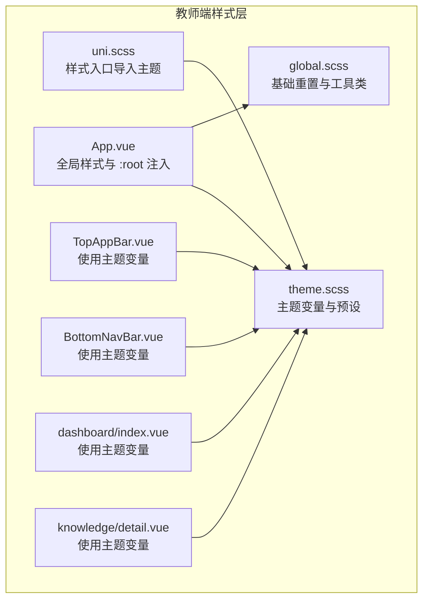
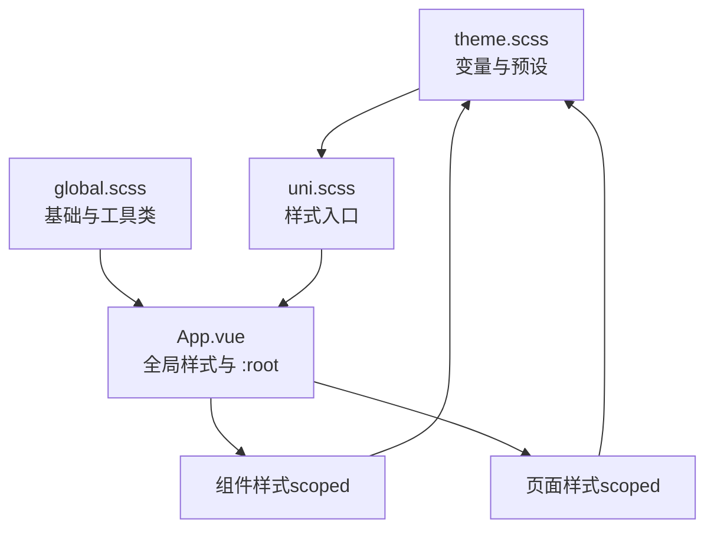
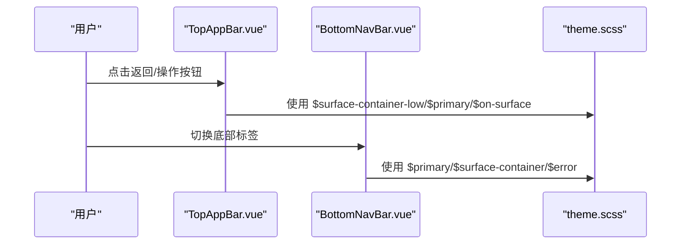
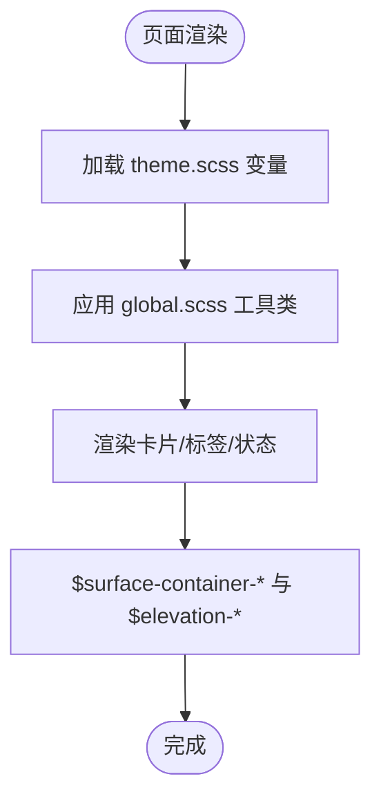
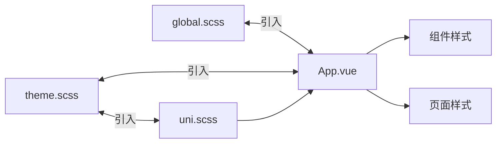

# 主题与样式

<cite>
**本文引用的文件**
- [apps/teacher-app/src/styles/theme.scss](file://apps/teacher-app/src/styles/theme.scss)
- [apps/teacher-app/src/styles/global.scss](file://apps/teacher-app/src/styles/global.scss)
- [apps/teacher-app/src/uni.scss](file://apps/teacher-app/src/uni.scss)
- [apps/teacher-app/src/App.vue](file://apps/teacher-app/src/App.vue)
- [apps/teacher-app/src/components/TopAppBar.vue](file://apps/teacher-app/src/components/TopAppBar.vue)
- [apps/teacher-app/src/components/BottomNavBar.vue](file://apps/teacher-app/src/components/BottomNavBar.vue)
- [apps/teacher-app/src/pages/dashboard/index.vue](file://apps/teacher-app/src/pages/dashboard/index.vue)
- [apps/teacher-app/src/pages/knowledge/detail.vue](file://apps/teacher-app/src/pages/knowledge/detail.vue)
- [apps/teacher-app/src/main.ts](file://apps/teacher-app/src/main.ts)
- [apps/teacher-app/vite.config.ts](file://apps/teacher-app/vite.config.ts)
- [apps/student-app/src/styles/theme.scss](file://apps/student-app/src/styles/theme.scss)
- [apps/student-app/src/uni.scss](file://apps/student-app/src/uni.scss)
</cite>

## 目录
1. [简介](#简介)
2. [项目结构](#项目结构)
3. [核心组件](#核心组件)
4. [架构总览](#架构总览)
5. [详细组件分析](#详细组件分析)
6. [依赖关系分析](#依赖关系分析)
7. [性能考量](#性能考量)
8. [故障排查指南](#故障排查指南)
9. [结论](#结论)
10. [附录](#附录)

## 简介
本文件面向“医小管 v2 教师端”的主题与样式系统，系统性梳理其 SCSS 变量体系、颜色与字体规范、全局样式组织、命名约定、响应式与安全区域适配、样式覆盖与性能优化、主题切换与动态更新机制，以及样式与组件的集成与隔离策略。同时对比学生端主题差异，帮助读者全面理解两套主题系统的取舍与演进。

## 项目结构
教师端样式相关的关键位置如下：
- 主题变量：apps/teacher-app/src/styles/theme.scss
- 全局样式：apps/teacher-app/src/styles/global.scss
- 样式入口：apps/teacher-app/src/uni.scss（引入主题）
- 应用根样式：apps/teacher-app/src/App.vue（全局样式与 :root 变量注入）
- 组件样式：TopAppBar.vue、BottomNavBar.vue 等（使用主题变量）
- 页面样式：dashboard/index.vue、knowledge/detail.vue 等（使用主题变量）
- 应用启动：apps/teacher-app/src/main.ts（应用初始化）
- 构建配置：apps/teacher-app/vite.config.ts（Vite + @dcloudio/vite-plugin-uni）

图表来源
- [apps/teacher-app/src/styles/theme.scss:1-88](file://apps/teacher-app/src/styles/theme.scss#L1-L88)
- [apps/teacher-app/src/styles/global.scss:1-63](file://apps/teacher-app/src/styles/global.scss#L1-L63)
- [apps/teacher-app/src/uni.scss:1-2](file://apps/teacher-app/src/uni.scss#L1-L2)
- [apps/teacher-app/src/App.vue:15-56](file://apps/teacher-app/src/App.vue#L15-L56)
- [apps/teacher-app/src/components/TopAppBar.vue:87-160](file://apps/teacher-app/src/components/TopAppBar.vue#L87-L160)
- [apps/teacher-app/src/components/BottomNavBar.vue:63-147](file://apps/teacher-app/src/components/BottomNavBar.vue#L63-L147)
- [apps/teacher-app/src/pages/dashboard/index.vue:446-591](file://apps/teacher-app/src/pages/dashboard/index.vue#L446-L591)
- [apps/teacher-app/src/pages/knowledge/detail.vue:174-258](file://apps/teacher-app/src/pages/knowledge/detail.vue#L174-L258)

章节来源
- [apps/teacher-app/src/styles/theme.scss:1-88](file://apps/teacher-app/src/styles/theme.scss#L1-L88)
- [apps/teacher-app/src/styles/global.scss:1-63](file://apps/teacher-app/src/styles/global.scss#L1-L63)
- [apps/teacher-app/src/uni.scss:1-2](file://apps/teacher-app/src/uni.scss#L1-L2)
- [apps/teacher-app/src/App.vue:15-56](file://apps/teacher-app/src/App.vue#L15-L56)

## 核心组件
- 主题变量层（theme.scss）
  - 颜色体系：Primary/Secondary/Tertiary/Error/Surface/Outline/Background 等完整色板与变体
  - 阴影与渐变：多级 elevation 预设与 gradient 预设
  - 字体：headline/body/label 三档字族统一为 Manrope 与本地中文字体栈
  - 背景模糊：backdrop-bar 预设用于毛玻璃效果
- 全局样式层（global.scss）
  - 基础 reset、动画 keyframes、阶梯延迟动画、滚动条隐藏、安全区域底部内边距、多行省略等工具类
- 样式入口（uni.scss）
  - 仅负责引入主题变量，确保所有页面与组件可直接使用主题变量
- 应用根样式（App.vue）
  - 引入全局样式与主题变量，注入 :root CSS 变量，设置 page 字体与背景色
- 组件与页面样式
  - TopAppBar、BottomNavBar 使用主题变量控制背景、文字、图标与阴影
  - dashboard 与 knowledge 页面广泛使用主题变量进行卡片、标签、状态等视觉元素的统一

章节来源
- [apps/teacher-app/src/styles/theme.scss:6-88](file://apps/teacher-app/src/styles/theme.scss#L6-L88)
- [apps/teacher-app/src/styles/global.scss:1-63](file://apps/teacher-app/src/styles/global.scss#L1-L63)
- [apps/teacher-app/src/uni.scss:1-2](file://apps/teacher-app/src/uni.scss#L1-L2)
- [apps/teacher-app/src/App.vue:15-56](file://apps/teacher-app/src/App.vue#L15-L56)
- [apps/teacher-app/src/components/TopAppBar.vue:87-160](file://apps/teacher-app/src/components/TopAppBar.vue#L87-L160)
- [apps/teacher-app/src/components/BottomNavBar.vue:63-147](file://apps/teacher-app/src/components/BottomNavBar.vue#L63-L147)
- [apps/teacher-app/src/pages/dashboard/index.vue:446-591](file://apps/teacher-app/src/pages/dashboard/index.vue#L446-L591)
- [apps/teacher-app/src/pages/knowledge/detail.vue:174-258](file://apps/teacher-app/src/pages/knowledge/detail.vue#L174-L258)

## 架构总览
教师端采用“主题变量 → 全局样式 → 组件/页面样式”的分层架构。uni.scss 作为样式入口统一引入主题变量；App.vue 注入全局样式与 :root 变量；组件与页面通过 scoped 样式直接消费主题变量，形成一致的视觉语言与交互反馈。

图表来源
- [apps/teacher-app/src/styles/theme.scss:1-88](file://apps/teacher-app/src/styles/theme.scss#L1-L88)
- [apps/teacher-app/src/styles/global.scss:1-63](file://apps/teacher-app/src/styles/global.scss#L1-L63)
- [apps/teacher-app/src/uni.scss:1-2](file://apps/teacher-app/src/uni.scss#L1-L2)
- [apps/teacher-app/src/App.vue:15-56](file://apps/teacher-app/src/App.vue#L15-L56)

## 详细组件分析

### 主题变量与颜色体系（theme.scss）
- 设计来源：以 Material Design 3 色彩系统为基础，结合教师端品牌色“紫”，构建主色、容器、反色与表面层级
- 关键类别
  - Primary 系列：主色、弱化、容器、固定色与反色，配合 on-primary/on-primary-container 实现高对比文本
  - Secondary/Tertiary：辅助与强调色，用于次要操作与强调信息
  - Error：错误状态专用色板
  - Surface：表面层级（含容器各级别），配合 on-surface 与 inverse-* 实现明暗场景
  - Outline/OutlineVariant：边框与弱化描边
  - Background/OnBackground：页面背景与文本
- 视觉预设
  - 多级 elevation 阴影：elevation-1/2/3，模拟层级感
  - 渐变预设：gradient-primary/hero/btn，统一按钮与头部视觉
  - backdrop-bar：毛玻璃滤镜参数，用于导航栏与底部栏

章节来源
- [apps/teacher-app/src/styles/theme.scss:6-88](file://apps/teacher-app/src/styles/theme.scss#L6-L88)

### 全局样式与命名规范（global.scss）
- 命名规范
  - 动画：.animate-fade-up；阶梯延迟：.delay-1 ~ .delay-10
  - 工具类：.no-scrollbar、.pb-safe、.line-clamp-1/2/3
- 行为特性
  - 基础 reset：统一 box-sizing、margin/padding
  - 安全区域：env(safe-area-inset-bottom) 自动适配刘海屏
  - WebKit 滚动条隐藏：兼容不同浏览器
  - 多行省略：基于 -webkit-line-clamp 的简洁实现

章节来源
- [apps/teacher-app/src/styles/global.scss:1-63](file://apps/teacher-app/src/styles/global.scss#L1-L63)

### 样式入口与根样式（uni.scss、App.vue）
- uni.scss：仅引入主题变量，保证组件与页面可直接使用 $primary/$surface 等变量
- App.vue：
  - 引入 global.scss 与 theme.scss
  - 注入 :root --color-primary，便于原生或第三方组件读取
  - 设置 page 字体族、背景与文本色，统一全局观感
  - 重置 button 的伪元素边框，避免默认样式干扰

章节来源
- [apps/teacher-app/src/uni.scss:1-2](file://apps/teacher-app/src/uni.scss#L1-L2)
- [apps/teacher-app/src/App.vue:15-56](file://apps/teacher-app/src/App.vue#L15-L56)

### 导航组件与主题集成（TopAppBar.vue、BottomNavBar.vue）
- TopAppBar
  - 固定顶部，半透明背景 + backdrop-filter 使用 $backdrop-bar
  - 标题字体使用 $font-headline，文字色使用 $on-surface
  - 悬浮与按下态使用 $surface-container-low 等表面容器色
  - 主要操作按钮使用 $primary 的低透明度背景与按下态加深
- BottomNavBar
  - 固定底部，带安全区域内边距与圆角、阴影
  - 活跃态图标与标签使用 $primary，未激活使用 $on-surface-variant
  - 徽标使用 $error，突出待处理数量

图表来源
- [apps/teacher-app/src/components/TopAppBar.vue:87-160](file://apps/teacher-app/src/components/TopAppBar.vue#L87-L160)
- [apps/teacher-app/src/components/BottomNavBar.vue:63-147](file://apps/teacher-app/src/components/BottomNavBar.vue#L63-L147)
- [apps/teacher-app/src/styles/theme.scss:47-88](file://apps/teacher-app/src/styles/theme.scss#L47-L88)

章节来源
- [apps/teacher-app/src/components/TopAppBar.vue:87-160](file://apps/teacher-app/src/components/TopAppBar.vue#L87-L160)
- [apps/teacher-app/src/components/BottomNavBar.vue:63-147](file://apps/teacher-app/src/components/BottomNavBar.vue#L63-L147)

### 页面样式与主题集成（dashboard/index.vue、knowledge/detail.vue）
- dashboard/index.vue
  - 统一使用 $font-headline/$font-body/$on-surface/$on-surface-variant 控制标题、标签与文本
  - 卡片背景使用 $surface-container-low 等，按交互状态切换到 $surface-container
  - 阴影使用 $elevation-1/$elevation-2，营造层级感
- knowledge/detail.vue
  - 分类标签使用 $primary-container 与 $on-primary-container
  - 状态标签使用 $surface-container 与 $on-surface-variant
  - 标题使用 $font-headline，正文使用 $font-body

图表来源
- [apps/teacher-app/src/pages/dashboard/index.vue:446-591](file://apps/teacher-app/src/pages/dashboard/index.vue#L446-L591)
- [apps/teacher-app/src/pages/knowledge/detail.vue:174-258](file://apps/teacher-app/src/pages/knowledge/detail.vue#L174-L258)
- [apps/teacher-app/src/styles/theme.scss:47-88](file://apps/teacher-app/src/styles/theme.scss#L47-L88)

章节来源
- [apps/teacher-app/src/pages/dashboard/index.vue:446-591](file://apps/teacher-app/src/pages/dashboard/index.vue#L446-L591)
- [apps/teacher-app/src/pages/knowledge/detail.vue:174-258](file://apps/teacher-app/src/pages/knowledge/detail.vue#L174-L258)

### 响应式与跨平台适配策略
- 安全区域适配：全局工具类 .pb-safe 与底部导航栏的 env(safe-area-inset-bottom) 计算高度，确保刘海屏与圆角屏正确留白
- 字体栈：Manrope 优先，回退至 PingFang SC 与 Microsoft YaHei，兼顾中英文显示
- 毛玻璃效果：$backdrop-bar 在导航与底部栏中统一使用，提升现代感与可读性
- 页面背景与文本：App.vue 中 page 背景与文本色由 $surface/$on-surface 控制，保证明暗一致性

章节来源
- [apps/teacher-app/src/styles/global.scss:40-42](file://apps/teacher-app/src/styles/global.scss#L40-L42)
- [apps/teacher-app/src/components/BottomNavBar.vue:70-71](file://apps/teacher-app/src/components/BottomNavBar.vue#L70-L71)
- [apps/teacher-app/src/App.vue:31-36](file://apps/teacher-app/src/App.vue#L31-L36)

### 主题切换与动态样式更新
- 当前实现：主题变量集中于 theme.scss，通过 uni.scss 与 App.vue 注入，组件与页面在编译期消费变量
- 切换建议（最佳实践）
  - 运行时切换：在 App.vue 的 :root 注入阶段，将 --color-primary 等变量改为动态绑定；组件样式中优先使用 CSS 变量而非 SCSS 变量
  - 深浅模式：新增深色模式变量集，通过切换 class 或 CSS 变量值实现整体切换
  - 渐变与阴影：保持 $gradient-* 与 $elevation-* 不变，仅替换颜色变量
- 注意事项
  - 避免在组件内硬编码颜色值，统一走主题变量或 CSS 变量
  - 毛玻璃与滤镜需在运行时评估性能，必要时提供降级方案

章节来源
- [apps/teacher-app/src/App.vue:27-29](file://apps/teacher-app/src/App.vue#L27-L29)
- [apps/teacher-app/src/styles/theme.scss:76-82](file://apps/teacher-app/src/styles/theme.scss#L76-L82)

### 样式覆盖与样式隔离策略
- 样式隔离
  - 组件使用 scoped 样式，避免污染全局
  - 通过 .no-scrollbar、.line-clamp-* 等工具类减少重复定义
- 样式覆盖
  - 全局样式优先于组件样式，但不建议覆盖主题变量
  - 新增页面样式时，优先复用 $surface-container-* 与 $elevation-*，减少视觉漂移
- 性能优化
  - 合理拆分样式文件，避免单文件过大
  - 减少深层嵌套与复杂选择器，提升编译与渲染效率

章节来源
- [apps/teacher-app/src/styles/global.scss:31-62](file://apps/teacher-app/src/styles/global.scss#L31-L62)
- [apps/teacher-app/src/components/TopAppBar.vue:87-160](file://apps/teacher-app/src/components/TopAppBar.vue#L87-L160)
- [apps/teacher-app/src/components/BottomNavBar.vue:63-147](file://apps/teacher-app/src/components/BottomNavBar.vue#L63-L147)

### 与学生端主题的对比
- 教师端
  - 采用完整的 MD3 色板与容器层级，提供 $elevation-* 与 $gradient-* 预设
  - 字体统一为 Manrope + 中文字体栈，强调现代与可读性
- 学生端
  - 提供 uni-app 内置变量（如 $uni-color-primary），并有过渡动画与字体字号半径等基础变量
  - 主题变量更偏向渐变与语义色（success/warning/error），适合更活泼的界面风格

章节来源
- [apps/student-app/src/styles/theme.scss:1-39](file://apps/student-app/src/styles/theme.scss#L1-L39)
- [apps/student-app/src/uni.scss:1-24](file://apps/student-app/src/uni.scss#L1-L24)

## 依赖关系分析
- 样式依赖链
  - uni.scss → theme.scss（变量）
  - App.vue → global.scss（基础样式）+ theme.scss（变量）
  - 组件与页面 → theme.scss（变量）
- 构建与运行
  - Vite + @dcloudio/vite-plugin-uni 负责编译与热更新
  - main.ts 初始化应用与用户状态，间接影响样式加载时机

图表来源
- [apps/teacher-app/src/uni.scss:1-2](file://apps/teacher-app/src/uni.scss#L1-L2)
- [apps/teacher-app/src/App.vue:15-56](file://apps/teacher-app/src/App.vue#L15-L56)
- [apps/teacher-app/src/styles/theme.scss:1-88](file://apps/teacher-app/src/styles/theme.scss#L1-L88)
- [apps/teacher-app/src/styles/global.scss:1-63](file://apps/teacher-app/src/styles/global.scss#L1-L63)

章节来源
- [apps/teacher-app/vite.config.ts:1-22](file://apps/teacher-app/vite.config.ts#L1-L22)
- [apps/teacher-app/src/main.ts:1-25](file://apps/teacher-app/src/main.ts#L1-L25)

## 性能考量
- 编译期优化
  - 将常用颜色与阴影预设为变量，减少重复计算
  - 使用工具类（如 .line-clamp-*）替代复杂 JS 逻辑
- 运行时优化
  - 毛玻璃滤镜（backdrop-filter）在低端设备可能造成掉帧，建议在运行时提供关闭选项或降级方案
  - 避免在动画中频繁修改布局属性（如 width/height），优先使用 transform 与 opacity
- 文件体积
  - 将全局样式与主题变量拆分，按需引入，避免重复打包

## 故障排查指南
- 字体显示异常
  - 检查 App.vue 中 @font-face 是否成功加载，确认网络可达与格式支持
- 安全区域留白不生效
  - 确认页面是否使用 .pb-safe 或底部导航栏的 env(safe-area-inset-bottom) 计算
- 毛玻璃效果不明显
  - 检查 $backdrop-bar 是否被覆盖，确认父容器背景透明度与对比度
- 动画卡顿
  - 检查是否使用过多 backdrop-filter 或复杂阴影；必要时在低端设备禁用或简化
- 主题变量未生效
  - 确认 uni.scss 是否正确引入 theme.scss，组件是否使用 scoped 样式且未被 !important 覆盖

章节来源
- [apps/teacher-app/src/App.vue:18-25](file://apps/teacher-app/src/App.vue#L18-L25)
- [apps/teacher-app/src/styles/global.scss:40-42](file://apps/teacher-app/src/styles/global.scss#L40-L42)
- [apps/teacher-app/src/styles/theme.scss:81-82](file://apps/teacher-app/src/styles/theme.scss#L81-L82)

## 结论
教师端主题与样式系统以 MD3 色彩体系为核心，通过集中式主题变量、全局工具类与组件级 scoped 样式，实现了统一的视觉语言与良好的跨平台适配。建议在保持现有结构的基础上，逐步引入运行时主题切换与 CSS 变量驱动的动态更新，以进一步提升可维护性与用户体验。

## 附录
- 关键变量速览
  - 颜色：$primary/$secondary/$tertiary/$error/$surface/$background/$outline
  - 层级：$surface-container-*、$elevation-1/2/3
  - 字体：$font-headline/$font-body/$font-label
  - 预设：$gradient-*、$backdrop-bar
- 推荐命名
  - 组件样式：.组件名__子元素（如 .top-app-bar__title）
  - 工具类：.状态-描述（如 .pb-safe、.line-clamp-2）