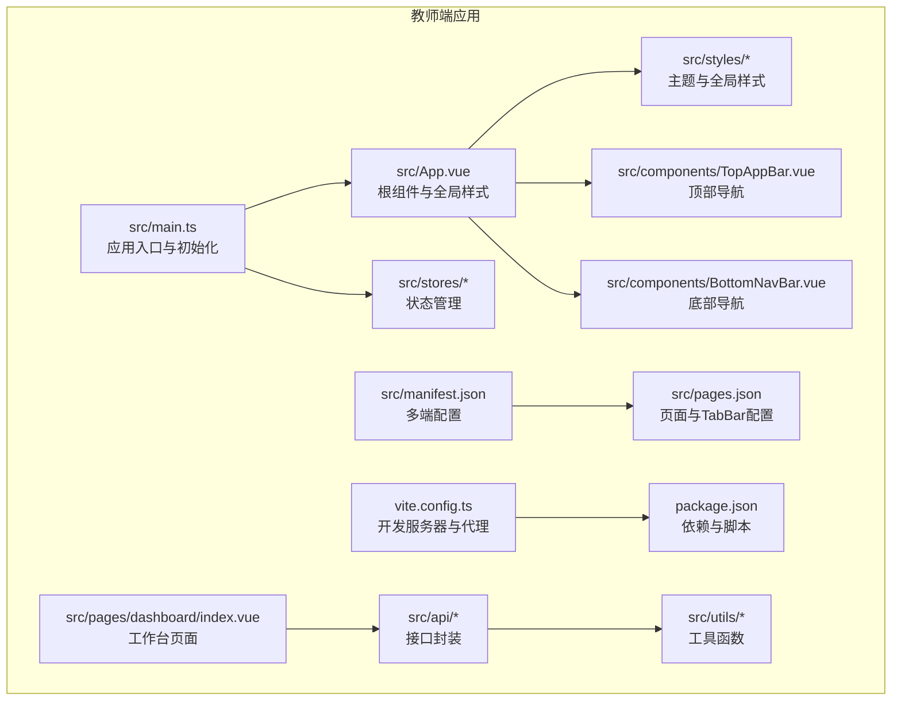
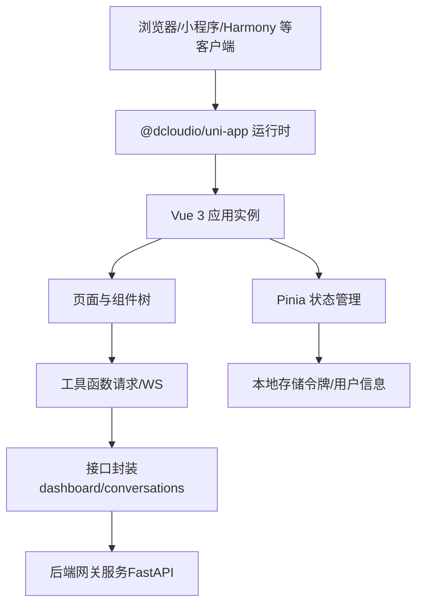
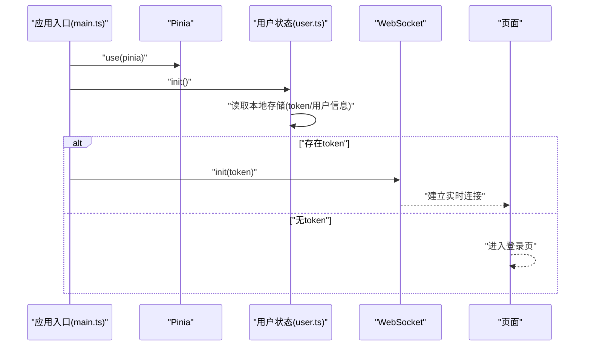
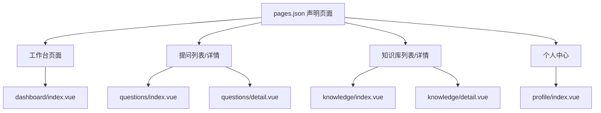
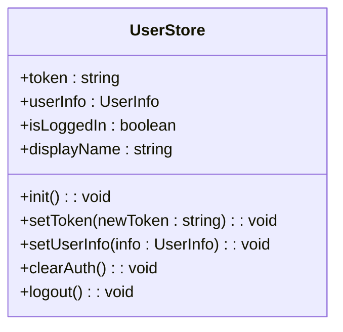
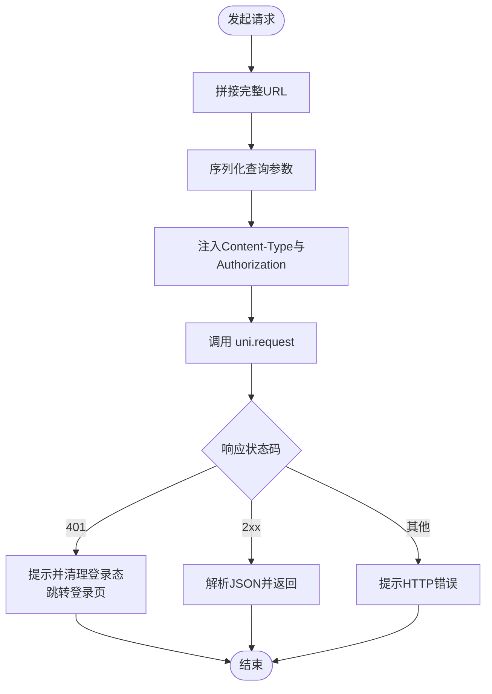
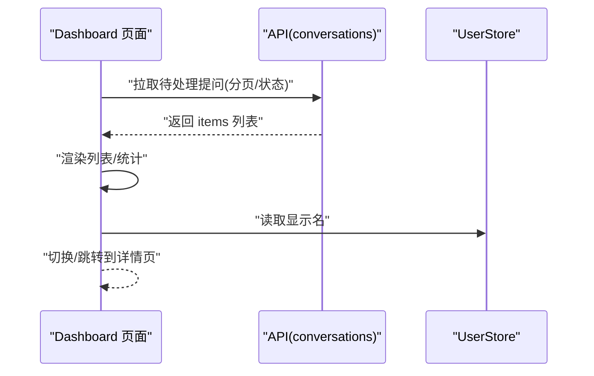
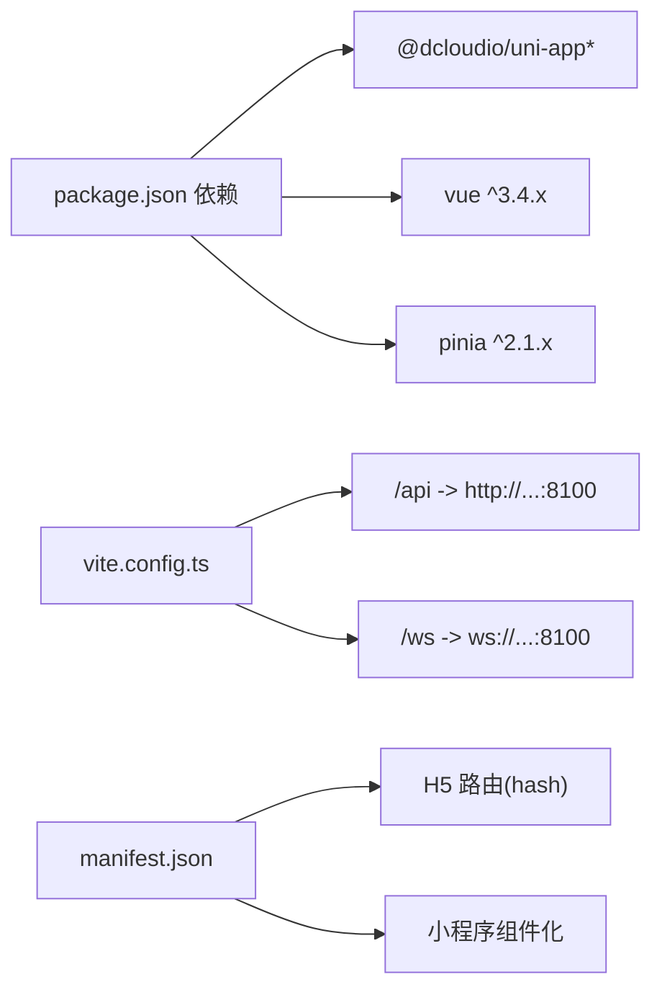

# 应用概述

<cite>
**本文引用的文件**
- [apps/teacher-app/src/main.ts](file://apps/teacher-app/src/main.ts)
- [apps/teacher-app/src/App.vue](file://apps/teacher-app/src/App.vue)
- [apps/teacher-app/src/manifest.json](file://apps/teacher-app/src/manifest.json)
- [apps/teacher-app/package.json](file://apps/teacher-app/package.json)
- [apps/teacher-app/vite.config.ts](file://apps/teacher-app/vite.config.ts)
- [apps/teacher-app/src/stores/index.ts](file://apps/teacher-app/src/stores/index.ts)
- [apps/teacher-app/src/stores/user.ts](file://apps/teacher-app/src/stores/user.ts)
- [apps/teacher-app/src/pages.json](file://apps/teacher-app/src/pages.json)
- [apps/teacher-app/src/styles/theme.scss](file://apps/teacher-app/src/styles/theme.scss)
- [apps/teacher-app/src/utils/request.ts](file://apps/teacher-app/src/utils/request.ts)
- [apps/teacher-app/src/pages/dashboard/index.vue](file://apps/teacher-app/src/pages/dashboard/index.vue)
- [apps/teacher-app/src/api/dashboard.ts](file://apps/teacher-app/src/api/dashboard.ts)
- [apps/teacher-app/src/components/TopAppBar.vue](file://apps/teacher-app/src/components/TopAppBar.vue)
- [apps/teacher-app/src/components/BottomNavBar.vue](file://apps/teacher-app/src/components/BottomNavBar.vue)
- [apps/student-app/src/main.ts](file://apps/student-app/src/main.ts)
</cite>

## 目录
1. [引言](#引言)
2. [项目结构](#项目结构)
3. [核心组件](#核心组件)
4. [架构总览](#架构总览)
5. [详细组件分析](#详细组件分析)
6. [依赖关系分析](#依赖关系分析)
7. [性能考量](#性能考量)
8. [故障排查指南](#故障排查指南)
9. [结论](#结论)
10. [附录](#附录)

## 引言
本文件为“医小管 v2 教师端应用”的应用概述文档，面向开发者与产品人员，系统性介绍教师端应用的整体架构设计、启动流程、初始化过程、基础配置、跨平台适配策略以及性能优化建议。教师端应用基于 Vue 3 + UniApp 技术栈构建，采用 Pinia 状态管理，统一的请求封装与主题样式体系，支持多端（H5、小程序、快应用等）部署。

## 项目结构
教师端应用位于 apps/teacher-app 目录，采用按功能域划分的目录组织方式：页面 pages、通用组件 components、状态 stores、类型定义 types、工具 utils、样式 styles、API 接口 api 等。应用通过 manifest.json 和 pages.json 进行多端配置与页面路由声明；通过 vite.config.ts 配置开发服务器与代理；通过 package.json 管理依赖与脚本命令。

图表来源
- [apps/teacher-app/src/main.ts:1-25](file://apps/teacher-app/src/main.ts#L1-L25)
- [apps/teacher-app/src/App.vue:1-56](file://apps/teacher-app/src/App.vue#L1-L56)
- [apps/teacher-app/src/manifest.json:1-26](file://apps/teacher-app/src/manifest.json#L1-L26)
- [apps/teacher-app/src/pages.json:1-84](file://apps/teacher-app/src/pages.json#L1-L84)
- [apps/teacher-app/vite.config.ts:1-22](file://apps/teacher-app/vite.config.ts#L1-L22)
- [apps/teacher-app/src/stores/index.ts:1-7](file://apps/teacher-app/src/stores/index.ts#L1-L7)
- [apps/teacher-app/src/stores/user.ts:1-63](file://apps/teacher-app/src/stores/user.ts#L1-L63)
- [apps/teacher-app/src/styles/theme.scss:1-88](file://apps/teacher-app/src/styles/theme.scss#L1-L88)
- [apps/teacher-app/src/utils/request.ts:1-108](file://apps/teacher-app/src/utils/request.ts#L1-L108)
- [apps/teacher-app/src/api/dashboard.ts:1-18](file://apps/teacher-app/src/api/dashboard.ts#L1-L18)
- [apps/teacher-app/src/pages/dashboard/index.vue:1-669](file://apps/teacher-app/src/pages/dashboard/index.vue#L1-L669)
- [apps/teacher-app/src/components/TopAppBar.vue:1-160](file://apps/teacher-app/src/components/TopAppBar.vue#L1-L160)
- [apps/teacher-app/src/components/BottomNavBar.vue:1-147](file://apps/teacher-app/src/components/BottomNavBar.vue#L1-L147)

章节来源
- [apps/teacher-app/src/main.ts:1-25](file://apps/teacher-app/src/main.ts#L1-L25)
- [apps/teacher-app/src/App.vue:1-56](file://apps/teacher-app/src/App.vue#L1-L56)
- [apps/teacher-app/src/manifest.json:1-26](file://apps/teacher-app/src/manifest.json#L1-L26)
- [apps/teacher-app/src/pages.json:1-84](file://apps/teacher-app/src/pages.json#L1-L84)
- [apps/teacher-app/vite.config.ts:1-22](file://apps/teacher-app/vite.config.ts#L1-L22)
- [apps/teacher-app/package.json:1-46](file://apps/teacher-app/package.json#L1-L46)

## 核心组件
- 应用入口与初始化：在入口文件中创建 Vue 应用实例，注册 Pinia，并在运行时异步初始化用户状态与 WebSocket 连接（若已登录）。
- 全局样式与主题：通过全局样式与主题变量文件集中管理色彩、字体、阴影与背景，确保视觉一致性。
- 页面与导航：通过 pages.json 声明页面与 TabBar；自定义顶部与底部导航组件提升交互体验。
- 状态管理：基于 Pinia 的用户状态 Store，持久化存储令牌与用户信息，提供初始化、登录态判断与登出清理能力。
- 请求封装：统一的请求工具对 URL 拼接、参数序列化、超时控制、鉴权头注入、错误处理与 401 登录态失效跳转进行标准化处理。
- API 层：针对工作台场景提供统计与概览接口封装，便于页面直接调用。

章节来源
- [apps/teacher-app/src/main.ts:1-25](file://apps/teacher-app/src/main.ts#L1-L25)
- [apps/teacher-app/src/App.vue:1-56](file://apps/teacher-app/src/App.vue#L1-L56)
- [apps/teacher-app/src/styles/theme.scss:1-88](file://apps/teacher-app/src/styles/theme.scss#L1-L88)
- [apps/teacher-app/src/pages.json:1-84](file://apps/teacher-app/src/pages.json#L1-L84)
- [apps/teacher-app/src/stores/index.ts:1-7](file://apps/teacher-app/src/stores/index.ts#L1-L7)
- [apps/teacher-app/src/stores/user.ts:1-63](file://apps/teacher-app/src/stores/user.ts#L1-L63)
- [apps/teacher-app/src/utils/request.ts:1-108](file://apps/teacher-app/src/utils/request.ts#L1-L108)
- [apps/teacher-app/src/api/dashboard.ts:1-18](file://apps/teacher-app/src/api/dashboard.ts#L1-L18)

## 架构总览
教师端应用采用“页面-组件-状态-工具-接口”分层架构，结合多端编译与运行时生命周期钩子，实现一致的用户体验与高效的开发流程。

图表来源
- [apps/teacher-app/src/main.ts:1-25](file://apps/teacher-app/src/main.ts#L1-L25)
- [apps/teacher-app/src/stores/user.ts:1-63](file://apps/teacher-app/src/stores/user.ts#L1-L63)
- [apps/teacher-app/src/utils/request.ts:1-108](file://apps/teacher-app/src/utils/request.ts#L1-L108)
- [apps/teacher-app/src/api/dashboard.ts:1-18](file://apps/teacher-app/src/api/dashboard.ts#L1-L18)

## 详细组件分析

### 启动流程与初始化
教师端应用在启动时执行以下关键步骤：
- 创建 SSR 应用实例并挂载根组件。
- 注册 Pinia 并导出应用实例。
- 异步初始化用户状态：从本地存储读取令牌与用户信息，若存在则保持登录态。
- 若存在有效令牌，自动初始化 WebSocket 连接以支持实时消息。

图表来源
- [apps/teacher-app/src/main.ts:1-25](file://apps/teacher-app/src/main.ts#L1-L25)
- [apps/teacher-app/src/stores/user.ts:1-63](file://apps/teacher-app/src/stores/user.ts#L1-L63)

章节来源
- [apps/teacher-app/src/main.ts:1-25](file://apps/teacher-app/src/main.ts#L1-L25)
- [apps/teacher-app/src/stores/user.ts:1-63](file://apps/teacher-app/src/stores/user.ts#L1-L63)

### 页面与导航
- 页面声明：通过 pages.json 统一声明登录、工作台、提问、知识库、我的等页面及其导航样式。
- TabBar：自定义 BottomNavBar 提供固定四格导航，支持徽标提醒与当前项高亮。
- 顶部导航：TopAppBar 支持返回按钮、标题与右侧动作按钮（搜索/设置/新增/编辑），满足不同页面的交互需求。

图表来源
- [apps/teacher-app/src/pages.json:1-84](file://apps/teacher-app/src/pages.json#L1-L84)
- [apps/teacher-app/src/components/BottomNavBar.vue:1-147](file://apps/teacher-app/src/components/BottomNavBar.vue#L1-L147)
- [apps/teacher-app/src/components/TopAppBar.vue:1-160](file://apps/teacher-app/src/components/TopAppBar.vue#L1-L160)

章节来源
- [apps/teacher-app/src/pages.json:1-84](file://apps/teacher-app/src/pages.json#L1-L84)
- [apps/teacher-app/src/components/BottomNavBar.vue:1-147](file://apps/teacher-app/src/components/BottomNavBar.vue#L1-L147)
- [apps/teacher-app/src/components/TopAppBar.vue:1-160](file://apps/teacher-app/src/components/TopAppBar.vue#L1-L160)

### 状态管理（用户）
用户状态 Store 负责：
- 存储与读取令牌与用户信息（本地持久化）。
- 计算属性：登录态判断、显示名称。
- 行为：初始化、设置令牌、设置用户信息、清理与登出。

图表来源
- [apps/teacher-app/src/stores/user.ts:1-63](file://apps/teacher-app/src/stores/user.ts#L1-L63)

章节来源
- [apps/teacher-app/src/stores/user.ts:1-63](file://apps/teacher-app/src/stores/user.ts#L1-L63)

### 请求封装与错误处理
请求工具提供：
- 基础 URL 与超时配置。
- 参数序列化与查询串拼接。
- 自动注入 Authorization 头（若存在 token）。
- 统一的成功/失败回调与 401 自动登出与跳转。

图表来源
- [apps/teacher-app/src/utils/request.ts:1-108](file://apps/teacher-app/src/utils/request.ts#L1-L108)

章节来源
- [apps/teacher-app/src/utils/request.ts:1-108](file://apps/teacher-app/src/utils/request.ts#L1-L108)

### 工作台页面（Dashboard）
工作台页面展示：
- 自定义顶栏与通知徽标。
- 欢迎横幅与快捷操作。
- 统计卡片（今日提问、待处理、知识条目、今日审批）。
- 待处理提问列表，支持查看全部与查看详情。
- 底部导航栏联动徽标数量。

图表来源
- [apps/teacher-app/src/pages/dashboard/index.vue:1-669](file://apps/teacher-app/src/pages/dashboard/index.vue#L1-L669)
- [apps/teacher-app/src/api/dashboard.ts:1-18](file://apps/teacher-app/src/api/dashboard.ts#L1-L18)
- [apps/teacher-app/src/stores/user.ts:1-63](file://apps/teacher-app/src/stores/user.ts#L1-L63)

章节来源
- [apps/teacher-app/src/pages/dashboard/index.vue:1-669](file://apps/teacher-app/src/pages/dashboard/index.vue#L1-L669)
- [apps/teacher-app/src/api/dashboard.ts:1-18](file://apps/teacher-app/src/api/dashboard.ts#L1-L18)

### 教师端与学生端差异与特色
- 技术栈与运行时：两者均基于 Vue 3 + UniApp，但教师端引入 Pinia、自定义导航组件与主题样式体系，学生端入口更精简。
- 角色职责：教师端聚焦“工作台、提问处理、知识库、个人中心”，强调管理与运营视角；学生端聚焦“聊天、历史记录、个人资料”，强调交互与服务视角。
- 导航与页面：教师端提供自定义顶部与底部导航，TabBar 四格布局；学生端提供自定义 TabBar 组件示例，页面结构以聊天与个人资料为主。
- 实时通信：教师端在登录后自动建立 WebSocket 连接，便于实时消息推送；学生端未见相关初始化逻辑。

章节来源
- [apps/teacher-app/src/main.ts:1-25](file://apps/teacher-app/src/main.ts#L1-L25)
- [apps/teacher-app/src/components/TopAppBar.vue:1-160](file://apps/teacher-app/src/components/TopAppBar.vue#L1-L160)
- [apps/teacher-app/src/components/BottomNavBar.vue:1-147](file://apps/teacher-app/src/components/BottomNavBar.vue#L1-L147)
- [apps/student-app/src/main.ts:1-11](file://apps/student-app/src/main.ts#L1-L11)

## 依赖关系分析
- 应用依赖：@dcloudio/uni-app 及各端运行时、pinia、vue、vue-i18n 等。
- 开发依赖：Vite 插件、TypeScript、Sass、vue-tsc 等。
- 多端配置：manifest.json 中声明 H5 路由模式、微信小程序 AppID 占位、组件化开关与 Vue 版本。
- 开发服务器：vite.config.ts 配置端口、host 与 /api 与 /ws 代理，指向后端网关地址。

图表来源
- [apps/teacher-app/package.json:1-46](file://apps/teacher-app/package.json#L1-L46)
- [apps/teacher-app/vite.config.ts:1-22](file://apps/teacher-app/vite.config.ts#L1-L22)
- [apps/teacher-app/src/manifest.json:1-26](file://apps/teacher-app/src/manifest.json#L1-L26)

章节来源
- [apps/teacher-app/package.json:1-46](file://apps/teacher-app/package.json#L1-L46)
- [apps/teacher-app/vite.config.ts:1-22](file://apps/teacher-app/vite.config.ts#L1-L22)
- [apps/teacher-app/src/manifest.json:1-26](file://apps/teacher-app/src/manifest.json#L1-L26)

## 性能考量
- 本地存储与懒初始化：用户状态在应用启动时懒加载，避免阻塞首屏渲染。
- 统一请求与鉴权：减少重复逻辑，降低网络层开销；401 自动登出避免无效重试。
- 样式与主题：集中式主题变量与全局样式减少重复计算，提升渲染效率。
- 多端编译：通过 Vite 插件与多端运行时，按需打包，减小包体。
- 代理与联调：开发阶段通过代理直连后端，减少中间层损耗。

## 故障排查指南
- 登录态异常
  - 现象：频繁提示登录已过期或无法访问受保护资源。
  - 排查：检查本地存储中的令牌键值是否存在；确认请求头是否正确注入 Authorization；观察 401 分支是否触发自动登出与跳转。
- 网络请求失败
  - 现象：Toast 提示网络连接失败或请求失败。
  - 排查：确认 VITE_API_BASE_URL 是否正确；检查代理配置与后端可达性；查看请求超时与参数序列化逻辑。
- 实时消息未到达
  - 现象：登录后无消息推送。
  - 排查：确认用户已登录且 token 存在；检查 WebSocket 初始化流程；验证后端 WS 地址与协议。

章节来源
- [apps/teacher-app/src/utils/request.ts:1-108](file://apps/teacher-app/src/utils/request.ts#L1-L108)
- [apps/teacher-app/src/stores/user.ts:1-63](file://apps/teacher-app/src/stores/user.ts#L1-L63)
- [apps/teacher-app/vite.config.ts:1-22](file://apps/teacher-app/vite.config.ts#L1-L22)

## 结论
教师端应用以 Vue 3 + UniApp 为基础，结合 Pinia、统一请求与主题体系，实现了跨平台的一致体验与可维护的代码结构。其启动流程清晰、状态管理明确、导航组件可复用、接口封装标准化，适合在多端环境下快速迭代与扩展。建议后续持续完善工作台数据聚合与实时消息能力，进一步优化首屏性能与离线体验。

## 附录
- 开发环境配置要点
  - 安装依赖：使用包管理器安装依赖。
  - 启动开发：根据目标平台选择脚本（如 H5 或小程序）。
  - 代理配置：确保 /api 与 /ws 代理指向正确的后端地址。
- 多端适配建议
  - 使用 @dcloudio/uni-app 的条件编译与运行时特性，按平台差异进行样式与行为微调。
  - 在 manifest.json 中按需开启各端能力与组件化开关。
- 常用命令
  - H5 开发：npm run dev:h5
  - H5 构建：npm run build:h5
  - 小程序开发：npm run dev:mp-weixin
  - 小程序构建：npm run build:mp-weixin
  - 类型检查：npm run type-check

章节来源
- [apps/teacher-app/package.json:1-46](file://apps/teacher-app/package.json#L1-L46)
- [apps/teacher-app/vite.config.ts:1-22](file://apps/teacher-app/vite.config.ts#L1-L22)
- [apps/teacher-app/src/manifest.json:1-26](file://apps/teacher-app/src/manifest.json#L1-L26)