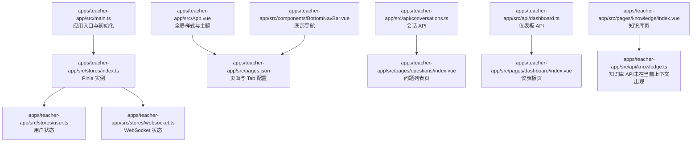
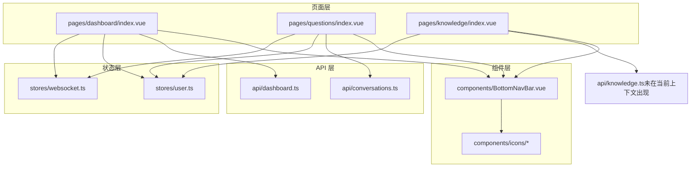
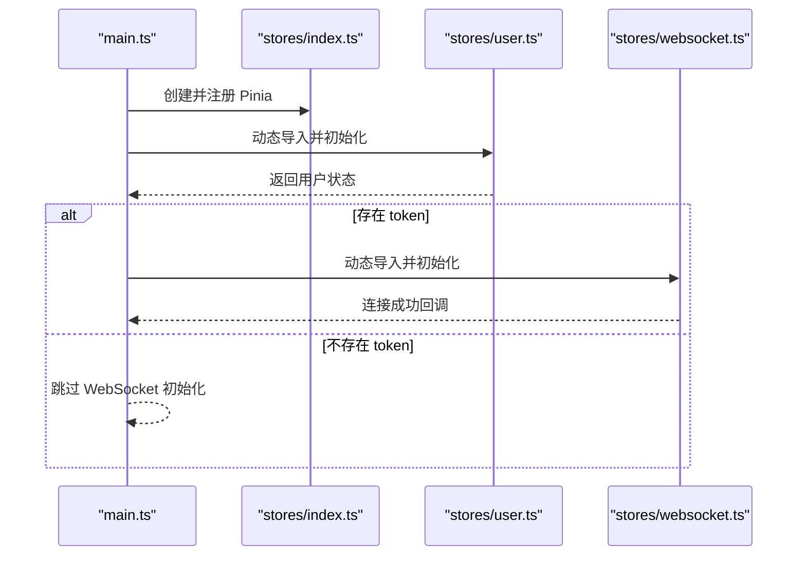
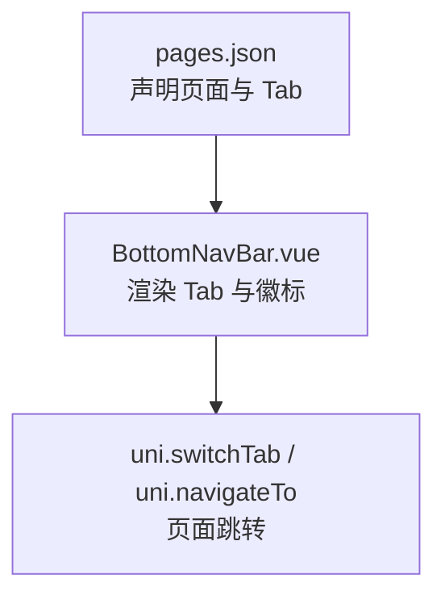
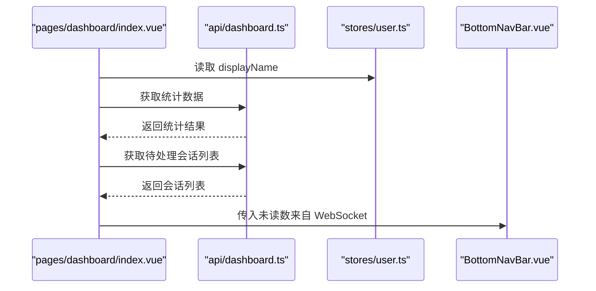
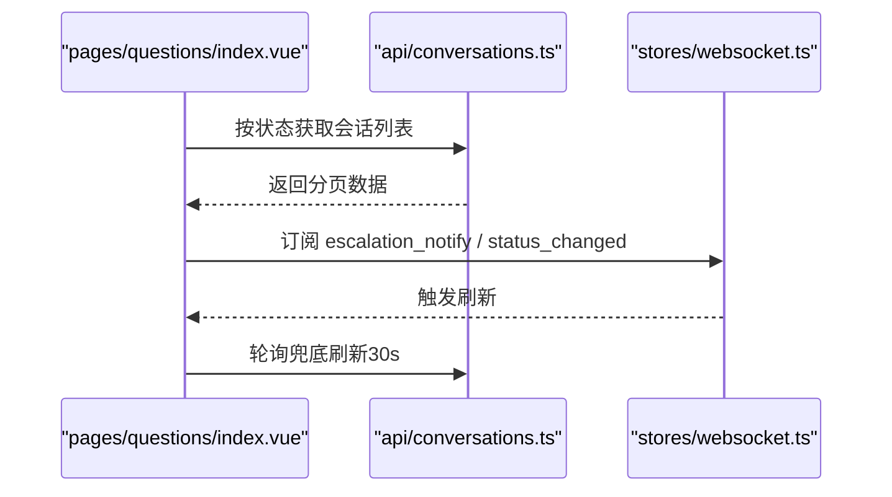
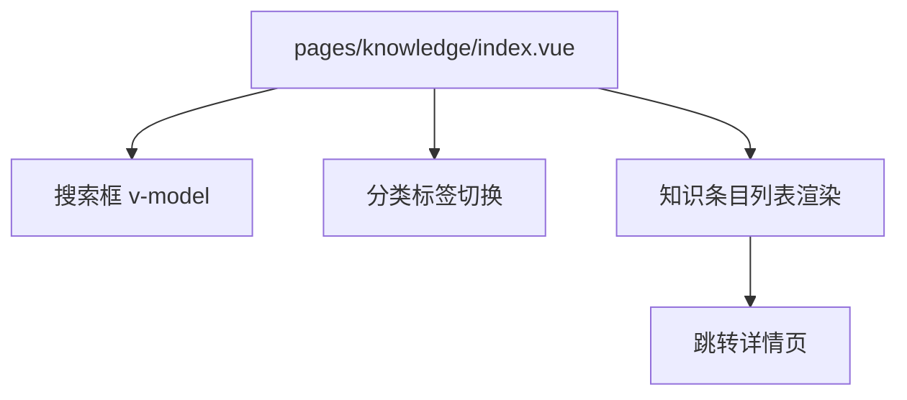
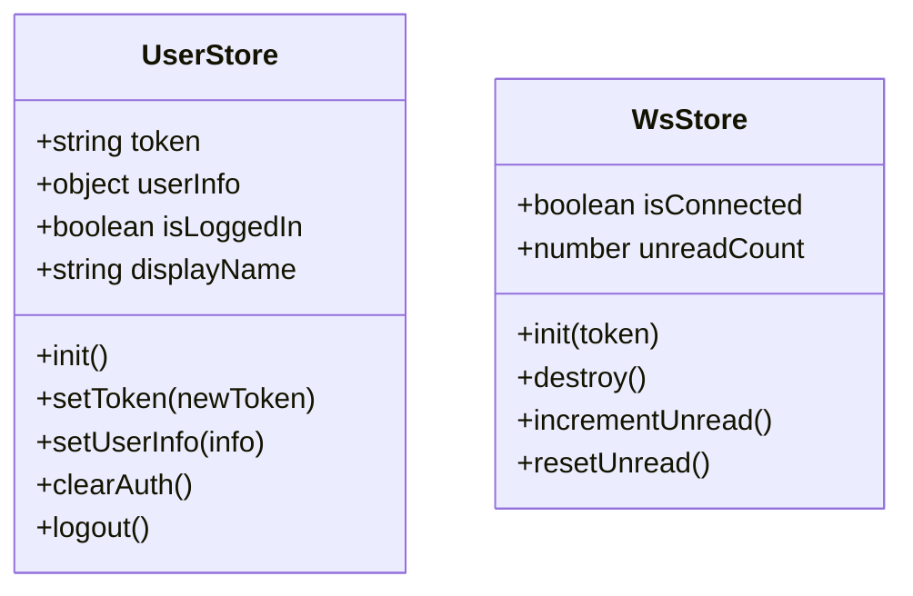
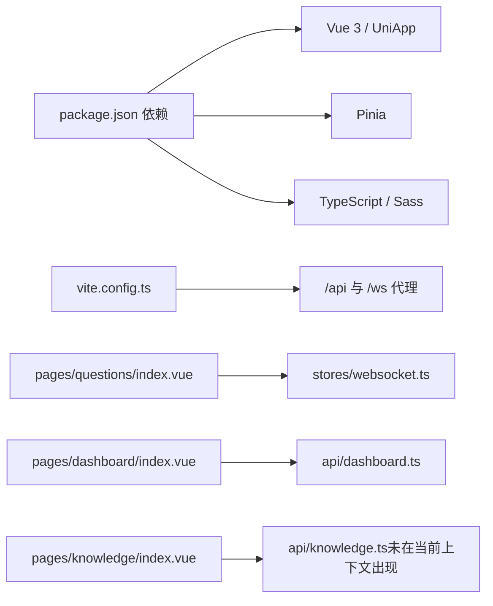

# 教师端应用

<cite>
**本文引用的文件**
- [apps/teacher-app/src/main.ts](file://apps/teacher-app/src/main.ts)
- [apps/teacher-app/src/App.vue](file://apps/teacher-app/src/App.vue)
- [apps/teacher-app/src/pages.json](file://apps/teacher-app/src/pages.json)
- [apps/teacher-app/package.json](file://apps/teacher-app/package.json)
- [apps/teacher-app/vite.config.ts](file://apps/teacher-app/vite.config.ts)
- [apps/teacher-app/src/stores/index.ts](file://apps/teacher-app/src/stores/index.ts)
- [apps/teacher-app/src/stores/user.ts](file://apps/teacher-app/src/stores/user.ts)
- [apps/teacher-app/src/stores/websocket.ts](file://apps/teacher-app/src/stores/websocket.ts)
- [apps/teacher-app/src/components/icons/index.ts](file://apps/teacher-app/src/components/icons/index.ts)
- [apps/teacher-app/src/components/BottomNavBar.vue](file://apps/teacher-app/src/components/BottomNavBar.vue)
- [apps/teacher-app/src/pages/dashboard/index.vue](file://apps/teacher-app/src/pages/dashboard/index.vue)
- [apps/teacher-app/src/pages/questions/index.vue](file://apps/teacher-app/src/pages/questions/index.vue)
- [apps/teacher-app/src/pages/knowledge/index.vue](file://apps/teacher-app/src/pages/knowledge/index.vue)
- [apps/teacher-app/src/api/dashboard.ts](file://apps/teacher-app/src/api/dashboard.ts)
- [apps/teacher-app/src/api/conversations.ts](file://apps/teacher-app/src/api/conversations.ts)
</cite>

## 目录
1. [引言](#引言)
2. [项目结构](#项目结构)
3. [核心组件](#核心组件)
4. [架构总览](#架构总览)
5. [详细组件分析](#详细组件分析)
6. [依赖关系分析](#依赖关系分析)
7. [性能考虑](#性能考虑)
8. [故障排查指南](#故障排查指南)
9. [结论](#结论)
10. [附录](#附录)

## 引言
本文件面向“医小管 v2 教师端”应用，基于 Vue 3 + UniApp 技术栈，系统性梳理应用入口配置、Pinia 状态管理、页面路由与导航、核心功能模块（仪表板、问题管理、知识库管理、工单处理）的实现细节，并补充组件库使用与自定义组件开发规范、跨平台适配策略、性能优化与调试技巧，以及完整的开发与部署指引。目标是帮助开发者快速理解并高效迭代教师端应用。

## 项目结构
教师端应用采用多端统一框架 UniApp，以 Vue 3 Composition API 为核心，通过 Vite 插件构建，支持 H5 与微信小程序等多平台运行。应用目录按功能域划分，包含页面、组件、状态管理、API 封装、工具与类型定义等。

- 应用入口与全局样式
  - 入口文件负责创建应用实例、挂载 Pinia、初始化用户态与 WebSocket 连接。
  - App.vue 定义全局样式、主题变量与字体资源。
- 页面与路由
  - pages.json 声明页面路径、导航样式与底部 Tab 配置。
- 状态管理
  - stores 目录集中管理用户态与 WebSocket 状态，使用 Pinia 管理响应式状态与持久化。
- 组件库与图标
  - components 提供通用组件（如底部导航、顶部栏）与图标集合导出。
- API 层
  - api 目录封装后端接口调用，统一通过 utils/request 发起请求。
- 构建与代理
  - vite.config.ts 提供本地开发服务器与代理规则，便于联调后端。

图表来源
- [apps/teacher-app/src/main.ts:1-25](file://apps/teacher-app/src/main.ts#L1-L25)
- [apps/teacher-app/src/stores/index.ts:1-7](file://apps/teacher-app/src/stores/index.ts#L1-L7)
- [apps/teacher-app/src/stores/user.ts:1-63](file://apps/teacher-app/src/stores/user.ts#L1-L63)
- [apps/teacher-app/src/stores/websocket.ts:1-32](file://apps/teacher-app/src/stores/websocket.ts#L1-L32)
- [apps/teacher-app/src/App.vue:1-56](file://apps/teacher-app/src/App.vue#L1-L56)
- [apps/teacher-app/src/pages.json:1-84](file://apps/teacher-app/src/pages.json#L1-L84)
- [apps/teacher-app/src/components/BottomNavBar.vue:1-147](file://apps/teacher-app/src/components/BottomNavBar.vue#L1-L147)
- [apps/teacher-app/src/api/conversations.ts:1-44](file://apps/teacher-app/src/api/conversations.ts#L1-L44)
- [apps/teacher-app/src/api/dashboard.ts:1-18](file://apps/teacher-app/src/api/dashboard.ts#L1-L18)
- [apps/teacher-app/src/pages/dashboard/index.vue:1-669](file://apps/teacher-app/src/pages/dashboard/index.vue#L1-L669)
- [apps/teacher-app/src/pages/questions/index.vue:1-462](file://apps/teacher-app/src/pages/questions/index.vue#L1-L462)
- [apps/teacher-app/src/pages/knowledge/index.vue:1-493](file://apps/teacher-app/src/pages/knowledge/index.vue#L1-L493)

章节来源
- [apps/teacher-app/src/main.ts:1-25](file://apps/teacher-app/src/main.ts#L1-L25)
- [apps/teacher-app/src/App.vue:1-56](file://apps/teacher-app/src/App.vue#L1-L56)
- [apps/teacher-app/src/pages.json:1-84](file://apps/teacher-app/src/pages.json#L1-L84)
- [apps/teacher-app/package.json:1-46](file://apps/teacher-app/package.json#L1-L46)
- [apps/teacher-app/vite.config.ts:1-22](file://apps/teacher-app/vite.config.ts#L1-L22)

## 核心组件
- 应用入口与初始化
  - 创建 SSR 应用实例，注册 Pinia；异步初始化用户状态；若存在 token，则自动建立 WebSocket 连接。
- 全局样式与主题
  - 定义主题变量、字体与基础样式，统一页面背景与文本颜色。
- 页面与 Tab 导航
  - pages.json 声明页面与 Tab 列表，支持自定义导航样式与标题。
- 底部导航组件
  - 支持高亮态、徽标提示与点击跳转，复用图标组件集。
- 状态管理（Pinia）
  - 用户状态：token、用户信息、登录态计算属性与持久化存储。
  - WebSocket 状态：连接状态、未读数与生命周期管理。
- 图标组件集
  - 统一导出常用图标，便于页面按需引入与复用。

章节来源
- [apps/teacher-app/src/main.ts:1-25](file://apps/teacher-app/src/main.ts#L1-L25)
- [apps/teacher-app/src/App.vue:1-56](file://apps/teacher-app/src/App.vue#L1-L56)
- [apps/teacher-app/src/pages.json:1-84](file://apps/teacher-app/src/pages.json#L1-L84)
- [apps/teacher-app/src/components/BottomNavBar.vue:1-147](file://apps/teacher-app/src/components/BottomNavBar.vue#L1-L147)
- [apps/teacher-app/src/stores/user.ts:1-63](file://apps/teacher-app/src/stores/user.ts#L1-L63)
- [apps/teacher-app/src/stores/websocket.ts:1-32](file://apps/teacher-app/src/stores/websocket.ts#L1-L32)
- [apps/teacher-app/src/components/icons/index.ts:1-28](file://apps/teacher-app/src/components/icons/index.ts#L1-L28)

## 架构总览
教师端采用“页面-组件-状态-API”的分层架构：
- 页面层：各功能页负责渲染与交互，调用 API 获取数据，订阅 WebSocket 事件。
- 组件层：通用 UI 组件（如底部导航、图标）在多页面复用。
- 状态层：Pinia Store 管理用户态与 WebSocket 状态，实现跨页面共享。
- API 层：对后端接口进行薄封装，统一错误处理与参数传递。
- 构建与代理：Vite 插件与代理配置，支撑本地开发联调。

图表来源
- [apps/teacher-app/src/pages/dashboard/index.vue:1-669](file://apps/teacher-app/src/pages/dashboard/index.vue#L1-L669)
- [apps/teacher-app/src/pages/questions/index.vue:1-462](file://apps/teacher-app/src/pages/questions/index.vue#L1-L462)
- [apps/teacher-app/src/pages/knowledge/index.vue:1-493](file://apps/teacher-app/src/pages/knowledge/index.vue#L1-L493)
- [apps/teacher-app/src/components/BottomNavBar.vue:1-147](file://apps/teacher-app/src/components/BottomNavBar.vue#L1-L147)
- [apps/teacher-app/src/stores/user.ts:1-63](file://apps/teacher-app/src/stores/user.ts#L1-L63)
- [apps/teacher-app/src/stores/websocket.ts:1-32](file://apps/teacher-app/src/stores/websocket.ts#L1-L32)
- [apps/teacher-app/src/api/conversations.ts:1-44](file://apps/teacher-app/src/api/conversations.ts#L1-L44)
- [apps/teacher-app/src/api/dashboard.ts:1-18](file://apps/teacher-app/src/api/dashboard.ts#L1-L18)

## 详细组件分析

### 应用入口与初始化流程
- 创建应用实例与 Pinia 注册。
- 异步加载用户 Store 并执行初始化，恢复 token 与用户信息。
- 若存在 token，延迟加载 WebSocket Store 并建立连接，监听连接状态变化。

图表来源
- [apps/teacher-app/src/main.ts:1-25](file://apps/teacher-app/src/main.ts#L1-L25)
- [apps/teacher-app/src/stores/index.ts:1-7](file://apps/teacher-app/src/stores/index.ts#L1-L7)
- [apps/teacher-app/src/stores/user.ts:1-63](file://apps/teacher-app/src/stores/user.ts#L1-L63)
- [apps/teacher-app/src/stores/websocket.ts:1-32](file://apps/teacher-app/src/stores/websocket.ts#L1-L32)

章节来源
- [apps/teacher-app/src/main.ts:1-25](file://apps/teacher-app/src/main.ts#L1-L25)

### 页面路由与导航
- pages.json 声明页面路径与导航样式，定义底部 Tab 列表与标题文案。
- 底部导航组件 BottomNavBar 通过动态组件渲染图标，支持徽标显示与点击切换。

图表来源
- [apps/teacher-app/src/pages.json:1-84](file://apps/teacher-app/src/pages.json#L1-L84)
- [apps/teacher-app/src/components/BottomNavBar.vue:1-147](file://apps/teacher-app/src/components/BottomNavBar.vue#L1-L147)

章节来源
- [apps/teacher-app/src/pages.json:1-84](file://apps/teacher-app/src/pages.json#L1-L84)
- [apps/teacher-app/src/components/BottomNavBar.vue:1-147](file://apps/teacher-app/src/components/BottomNavBar.vue#L1-L147)

### 仪表板（Dashboard）
- 功能要点
  - 自定义顶栏、欢迎横幅、快捷操作、统计卡片、待处理提问列表。
  - 通过 API 获取统计数据与待处理会话，格式化时间与状态展示。
  - 与 WebSocket 状态联动，底部 Tab 显示未读数。
- 关键交互
  - 查看全部提问、跳转提问详情、通知与快捷操作占位。

图表来源
- [apps/teacher-app/src/pages/dashboard/index.vue:1-669](file://apps/teacher-app/src/pages/dashboard/index.vue#L1-L669)
- [apps/teacher-app/src/api/dashboard.ts:1-18](file://apps/teacher-app/src/api/dashboard.ts#L1-L18)
- [apps/teacher-app/src/stores/user.ts:1-63](file://apps/teacher-app/src/stores/user.ts#L1-L63)
- [apps/teacher-app/src/stores/websocket.ts:1-32](file://apps/teacher-app/src/stores/websocket.ts#L1-L32)
- [apps/teacher-app/src/components/BottomNavBar.vue:1-147](file://apps/teacher-app/src/components/BottomNavBar.vue#L1-L147)

章节来源
- [apps/teacher-app/src/pages/dashboard/index.vue:1-669](file://apps/teacher-app/src/pages/dashboard/index.vue#L1-L669)
- [apps/teacher-app/src/api/dashboard.ts:1-18](file://apps/teacher-app/src/api/dashboard.ts#L1-L18)

### 问题管理（Questions）
- 功能要点
  - 分类筛选（全部/待处理/处理中/已解决），轮播式标签页。
  - 列表卡片展示学生信息、状态标签、AI 匹配度与进度条。
  - 支持 WebSocket 事件订阅（升级提醒、状态变更），并提供轮询兜底。
- 关键交互
  - 切换标签、进入详情、刷新数据。

图表来源
- [apps/teacher-app/src/pages/questions/index.vue:1-462](file://apps/teacher-app/src/pages/questions/index.vue#L1-L462)
- [apps/teacher-app/src/api/conversations.ts:1-44](file://apps/teacher-app/src/api/conversations.ts#L1-L44)
- [apps/teacher-app/src/stores/websocket.ts:1-32](file://apps/teacher-app/src/stores/websocket.ts#L1-L32)

章节来源
- [apps/teacher-app/src/pages/questions/index.vue:1-462](file://apps/teacher-app/src/pages/questions/index.vue#L1-L462)
- [apps/teacher-app/src/api/conversations.ts:1-44](file://apps/teacher-app/src/api/conversations.ts#L1-L44)

### 知识库管理（Knowledge）
- 功能要点
  - 搜索输入、分类标签、知识条目列表。
  - 卡片展示分类标签、状态点与文字、摘要、作者与时间。
- 关键交互
  - 切换分类、搜索、进入详情。

图表来源
- [apps/teacher-app/src/pages/knowledge/index.vue:1-493](file://apps/teacher-app/src/pages/knowledge/index.vue#L1-L493)

章节来源
- [apps/teacher-app/src/pages/knowledge/index.vue:1-493](file://apps/teacher-app/src/pages/knowledge/index.vue#L1-L493)

### 状态管理（Pinia）
- 用户状态（useUserStore）
  - 状态：token、userInfo。
  - 计算属性：isLoggedIn、displayName。
  - 行为：init（从本地存储恢复）、setToken、setUserInfo、clearAuth、logout。
- WebSocket 状态（useWsStore）
  - 状态：isConnected、unreadCount。
  - 行为：init（建立连接并监听事件）、destroy（断开连接并重置）、incrementUnread、resetUnread。

图表来源
- [apps/teacher-app/src/stores/user.ts:1-63](file://apps/teacher-app/src/stores/user.ts#L1-L63)
- [apps/teacher-app/src/stores/websocket.ts:1-32](file://apps/teacher-app/src/stores/websocket.ts#L1-L32)

章节来源
- [apps/teacher-app/src/stores/user.ts:1-63](file://apps/teacher-app/src/stores/user.ts#L1-L63)
- [apps/teacher-app/src/stores/websocket.ts:1-32](file://apps/teacher-app/src/stores/websocket.ts#L1-L32)

### 组件库与图标
- 图标导出
  - 通过 index.ts 统一导出常用图标，便于页面按需引入。
- 底部导航
  - 支持动态图标渲染、选中态高亮、徽标显示与点击跳转。

章节来源
- [apps/teacher-app/src/components/icons/index.ts:1-28](file://apps/teacher-app/src/components/icons/index.ts#L1-L28)
- [apps/teacher-app/src/components/BottomNavBar.vue:1-147](file://apps/teacher-app/src/components/BottomNavBar.vue#L1-L147)

## 依赖关系分析
- 开发与运行时依赖
  - Vue 3、UniApp、Pinia、Sass、TypeScript、Vite 及 @dcloudio 生态插件。
- 构建与代理
  - Vite 插件启用，本地开发服务器端口与代理规则指向后端网关地址。
- 页面与状态耦合
  - 问题页与 WebSocket 状态强耦合，通过事件驱动与轮询兜底保证实时性。
  - 仪表板与知识库页分别依赖对应 API 与用户状态。

图表来源
- [apps/teacher-app/package.json:1-46](file://apps/teacher-app/package.json#L1-L46)
- [apps/teacher-app/vite.config.ts:1-22](file://apps/teacher-app/vite.config.ts#L1-L22)
- [apps/teacher-app/src/pages/questions/index.vue:1-462](file://apps/teacher-app/src/pages/questions/index.vue#L1-L462)
- [apps/teacher-app/src/stores/websocket.ts:1-32](file://apps/teacher-app/src/stores/websocket.ts#L1-L32)
- [apps/teacher-app/src/pages/dashboard/index.vue:1-669](file://apps/teacher-app/src/pages/dashboard/index.vue#L1-L669)
- [apps/teacher-app/src/api/dashboard.ts:1-18](file://apps/teacher-app/src/api/dashboard.ts#L1-L18)

章节来源
- [apps/teacher-app/package.json:1-46](file://apps/teacher-app/package.json#L1-L46)
- [apps/teacher-app/vite.config.ts:1-22](file://apps/teacher-app/vite.config.ts#L1-L22)

## 性能考虑
- 组件渲染优化
  - 列表项使用动画延迟，避免一次性渲染造成卡顿。
  - 卡片在按下态缩放与阴影提升，减少无效重绘。
- 数据加载策略
  - 问题页采用轮询兜底，确保网络波动下的稳定性。
  - 仪表板与知识库页在 onShow 生命周期刷新，保证页面可见时数据最新。
- 网络与代理
  - 本地开发通过代理直连后端，减少跨域与中间层损耗。
- 存储与状态
  - 用户认证信息本地持久化，避免重复登录与频繁请求。

## 故障排查指南
- 登录态异常
  - 检查用户 Store 的 init 是否正确从本地存储恢复 token 与用户信息。
  - 清理本地存储后重试，确认 clearAuth 流程是否生效。
- WebSocket 不可用
  - 确认 init(token) 是否被调用且连接成功回调触发。
  - 检查 ws 代理配置与后端连接状态。
- 页面空白或样式异常
  - 检查全局样式与主题变量是否正确引入。
  - 确认 pages.json 中页面路径与 Tab 配置无误。
- 问题列表不更新
  - 确认 WebSocket 事件订阅与轮询定时器是否正确注册与清理。
  - 检查后端接口返回的数据结构与分页参数。

章节来源
- [apps/teacher-app/src/stores/user.ts:1-63](file://apps/teacher-app/src/stores/user.ts#L1-L63)
- [apps/teacher-app/src/stores/websocket.ts:1-32](file://apps/teacher-app/src/stores/websocket.ts#L1-L32)
- [apps/teacher-app/src/pages/questions/index.vue:1-462](file://apps/teacher-app/src/pages/questions/index.vue#L1-L462)
- [apps/teacher-app/src/App.vue:1-56](file://apps/teacher-app/src/App.vue#L1-L56)
- [apps/teacher-app/src/pages.json:1-84](file://apps/teacher-app/src/pages.json#L1-L84)

## 结论
教师端应用以 Vue 3 + UniApp 为基础，结合 Pinia 状态管理与统一 API 封装，实现了跨平台的一致体验。通过底部导航、问题与知识库两大核心业务页，配合 WebSocket 实时事件与轮询兜底，满足教师日常工单处理与知识维护需求。建议在后续迭代中完善各页面的功能占位、统一错误处理与埋点上报，并持续优化首屏与列表渲染性能。

## 附录
- 开发环境配置
  - 安装依赖：使用包管理器安装项目依赖。
  - 启动命令：H5 开发、小程序开发与构建脚本见 package.json。
  - 本地代理：根据 vite.config.ts 配置访问后端网关。
- 部署指南
  - 构建产物：使用 uni build 生成多端产物。
  - 环境变量：根据实际网关地址调整代理与 API 基础路径。
  - 静态资源：确保字体与静态资源可被正确加载。

章节来源
- [apps/teacher-app/package.json:1-46](file://apps/teacher-app/package.json#L1-L46)
- [apps/teacher-app/vite.config.ts:1-22](file://apps/teacher-app/vite.config.ts#L1-L22)