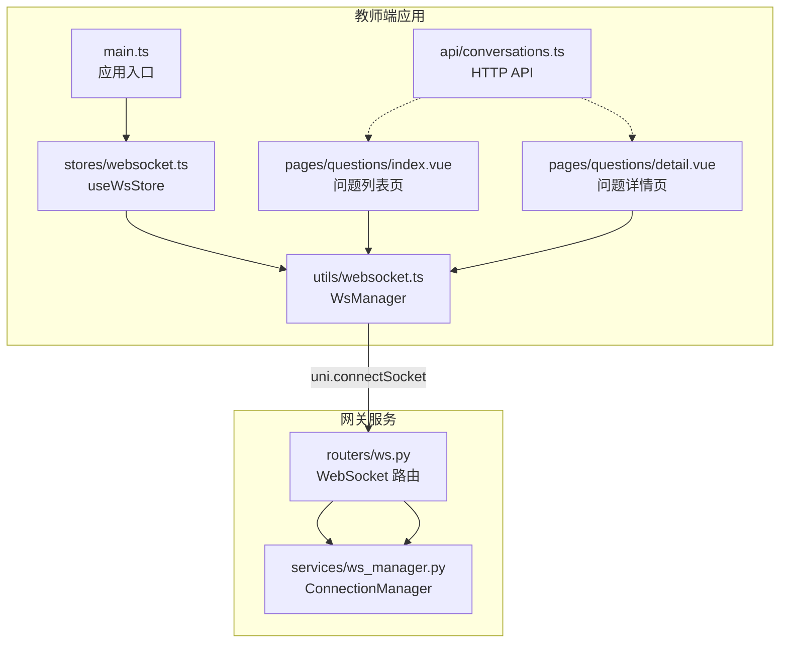
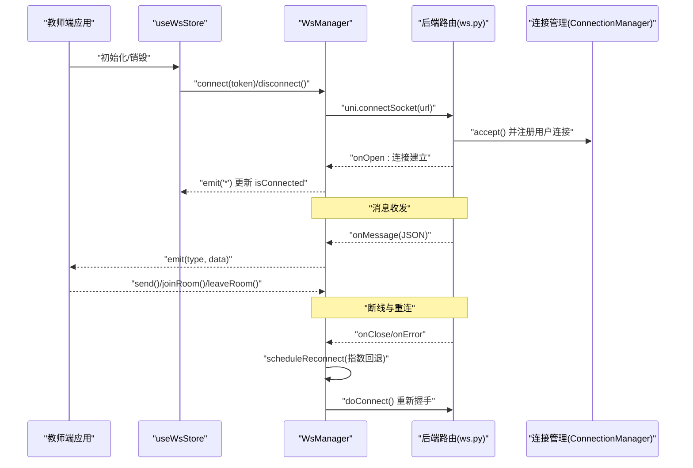
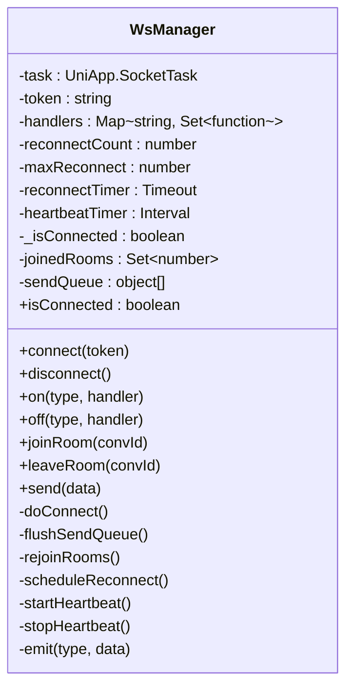
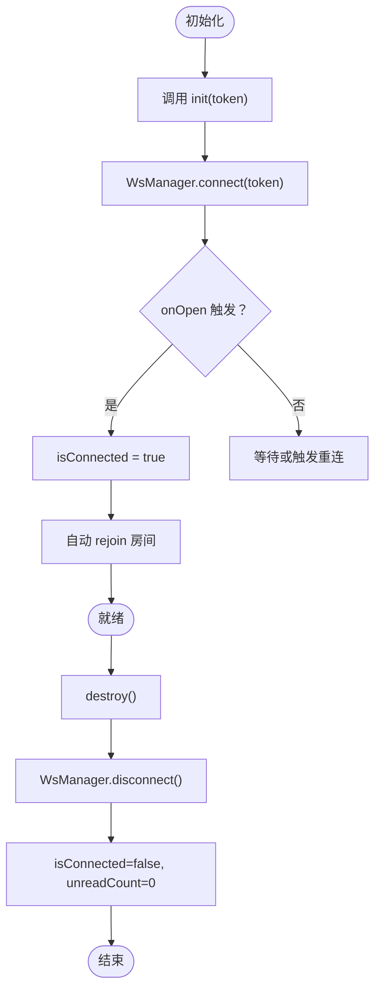
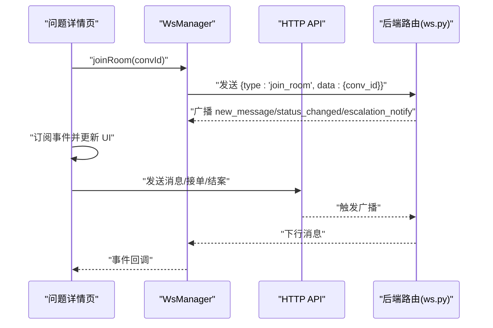
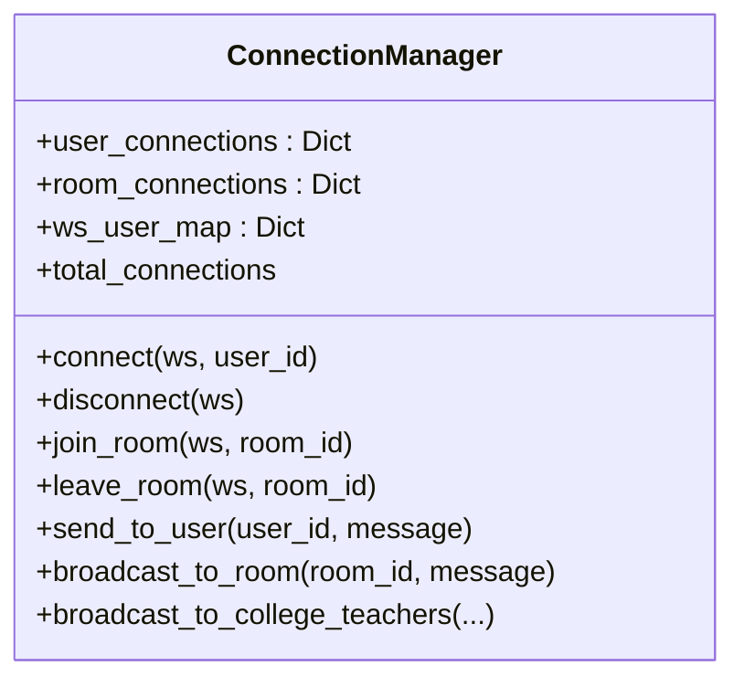
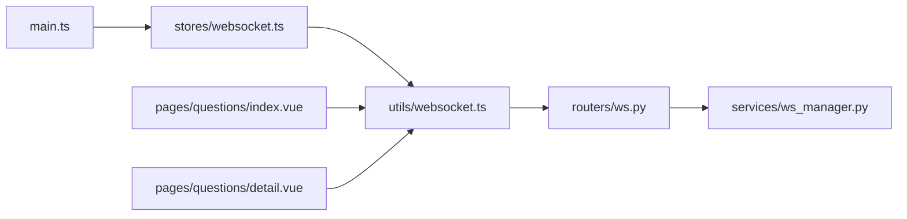

# WebSocket 状态管理

<cite>
**本文引用的文件**
- [apps/teacher-app/src/stores/websocket.ts](file://apps/teacher-app/src/stores/websocket.ts)
- [apps/teacher-app/src/utils/websocket.ts](file://apps/teacher-app/src/utils/websocket.ts)
- [apps/teacher-app/src/main.ts](file://apps/teacher-app/src/main.ts)
- [apps/teacher-app/src/pages/questions/index.vue](file://apps/teacher-app/src/pages/questions/index.vue)
- [apps/teacher-app/src/pages/questions/detail.vue](file://apps/teacher-app/src/pages/questions/detail.vue)
- [apps/teacher-app/src/api/conversations.ts](file://apps/teacher-app/src/api/conversations.ts)
- [services/gateway/app/routers/ws.py](file://services/gateway/app/routers/ws.py)
- [services/gateway/app/services/ws_manager.py](file://services/gateway/app/services/ws_manager.py)
</cite>

## 目录
1. [简介](#简介)
2. [项目结构](#项目结构)
3. [核心组件](#核心组件)
4. [架构总览](#架构总览)
5. [详细组件分析](#详细组件分析)
6. [依赖分析](#依赖分析)
7. [性能考虑](#性能考虑)
8. [故障排查指南](#故障排查指南)
9. [结论](#结论)
10. [附录](#附录)

## 简介
本文件面向“医小管 v2 教师端”的 WebSocket 状态管理，系统性解析前端 WebSocket store 的设计与实现，涵盖连接状态管理、消息队列处理、重连机制、心跳保活、房间订阅等能力，并结合后端路由与连接管理服务，完整说明从连接建立、维护到断开的全流程。同时提供在实时通信中的使用示例、异常处理策略与性能优化建议。

## 项目结构
教师端采用 Pinia Store + 自研 WsManager 的组合：
- 前端 store 层负责暴露连接状态与未读数等 UI 关键状态，并桥接 WsManager。
- WsManager 负责底层连接生命周期、消息分发、重连与心跳。
- 页面组件通过 WsManager 订阅消息类型，实现“实时”更新。
- 后端提供 WebSocket 路由与连接管理，支持按房间广播与用户级推送。

图表来源
- [apps/teacher-app/src/main.ts:1-25](file://apps/teacher-app/src/main.ts#L1-L25)
- [apps/teacher-app/src/stores/websocket.ts:1-32](file://apps/teacher-app/src/stores/websocket.ts#L1-L32)
- [apps/teacher-app/src/utils/websocket.ts:1-169](file://apps/teacher-app/src/utils/websocket.ts#L1-L169)
- [apps/teacher-app/src/pages/questions/index.vue:1-462](file://apps/teacher-app/src/pages/questions/index.vue#L1-L462)
- [apps/teacher-app/src/pages/questions/detail.vue:1-694](file://apps/teacher-app/src/pages/questions/detail.vue#L1-L694)
- [apps/teacher-app/src/api/conversations.ts:1-44](file://apps/teacher-app/src/api/conversations.ts#L1-L44)
- [services/gateway/app/routers/ws.py:1-119](file://services/gateway/app/routers/ws.py#L1-L119)
- [services/gateway/app/services/ws_manager.py:1-100](file://services/gateway/app/services/ws_manager.py#L1-L100)

章节来源
- [apps/teacher-app/src/main.ts:1-25](file://apps/teacher-app/src/main.ts#L1-L25)
- [apps/teacher-app/src/stores/websocket.ts:1-32](file://apps/teacher-app/src/stores/websocket.ts#L1-L32)
- [apps/teacher-app/src/utils/websocket.ts:1-169](file://apps/teacher-app/src/utils/websocket.ts#L1-L169)
- [apps/teacher-app/src/pages/questions/index.vue:1-462](file://apps/teacher-app/src/pages/questions/index.vue#L1-L462)
- [apps/teacher-app/src/pages/questions/detail.vue:1-694](file://apps/teacher-app/src/pages/questions/detail.vue#L1-L694)
- [apps/teacher-app/src/api/conversations.ts:1-44](file://apps/teacher-app/src/api/conversations.ts#L1-L44)
- [services/gateway/app/routers/ws.py:1-119](file://services/gateway/app/routers/ws.py#L1-L119)
- [services/gateway/app/services/ws_manager.py:1-100](file://services/gateway/app/services/ws_manager.py#L1-L100)

## 核心组件
- useWsStore（Pinia Store）
  - 提供 isConnected、unreadCount 等状态。
  - 初始化时调用 WsManager.connect 并监听连接状态变化。
  - 销毁时断开连接并清空状态。
- WsManager（自研 WebSocket 管理器）
  - 单连接 + 房间模式，支持 joinRoom/leaveRoom。
  - 内置发送队列：未连接时缓存消息，连接恢复后 flush。
  - 自动重连：指数回退，最大重试次数限制。
  - 心跳保活：周期性发送 ping，维持长连稳定。
  - 事件分发：统一 on/off，支持通配符 '*'。
  - 断线清理：关闭定时器、清理队列、停止心跳。

章节来源
- [apps/teacher-app/src/stores/websocket.ts:1-32](file://apps/teacher-app/src/stores/websocket.ts#L1-L32)
- [apps/teacher-app/src/utils/websocket.ts:1-169](file://apps/teacher-app/src/utils/websocket.ts#L1-L169)

## 架构总览
教师端与后端的 WebSocket 交互链路如下：

图表来源
- [apps/teacher-app/src/stores/websocket.ts:1-32](file://apps/teacher-app/src/stores/websocket.ts#L1-L32)
- [apps/teacher-app/src/utils/websocket.ts:1-169](file://apps/teacher-app/src/utils/websocket.ts#L1-L169)
- [services/gateway/app/routers/ws.py:1-119](file://services/gateway/app/routers/ws.py#L1-L119)
- [services/gateway/app/services/ws_manager.py:1-100](file://services/gateway/app/services/ws_manager.py#L1-L100)

## 详细组件分析

### WsManager 类设计与实现
- 数据结构
  - 任务句柄：UniApp.SocketTask
  - 连接状态：_isConnected
  - 事件处理器表：Map<string, Set<Function>>
  - 房间集合：Set<number>（conv_id）
  - 发送队列：object[]
  - 定时器：心跳、重连
- 关键方法
  - connect/disconnect：建立/断开连接，触发清理
  - on/off：事件订阅与取消
  - joinRoom/leaveRoom：加入/离开房间并发送指令
  - send：连接可用时立即发送；否则入队
  - doConnect：构造 URL、发起 uni.connectSocket、绑定回调
  - flushSendQueue：连接恢复后批量发送队列消息
  - rejoinRooms：重连后自动 re-join
  - scheduleReconnect：指数回退 + 最大次数限制
  - startHeartbeat/stopHeartbeat：每 30 秒 ping 保活
  - emit：遍历处理器执行
- 异常与边界
  - onMessage 中对非 JSON 忽略
  - onError 输出错误日志并触发重连
  - cleanup 清理定时器、关闭 socket、清空队列

图表来源
- [apps/teacher-app/src/utils/websocket.ts:1-169](file://apps/teacher-app/src/utils/websocket.ts#L1-L169)

章节来源
- [apps/teacher-app/src/utils/websocket.ts:1-169](file://apps/teacher-app/src/utils/websocket.ts#L1-L169)

### useWsStore 状态与生命周期
- 状态
  - isConnected：是否已连接
  - unreadCount：未读数（可扩展为不同类型未读）
- 行为
  - init(token)：建立连接并监听连接状态变化
  - destroy()：断开连接并重置状态
  - incrementUnread/resetUnread：未读计数管理（可配合业务使用）

图表来源
- [apps/teacher-app/src/stores/websocket.ts:1-32](file://apps/teacher-app/src/stores/websocket.ts#L1-L32)
- [apps/teacher-app/src/utils/websocket.ts:1-169](file://apps/teacher-app/src/utils/websocket.ts#L1-L169)

章节来源
- [apps/teacher-app/src/stores/websocket.ts:1-32](file://apps/teacher-app/src/stores/websocket.ts#L1-L32)

### 页面组件中的实时通信使用
- 问题列表页
  - 订阅 escalation_notify、status_changed 事件，触发轮询兜底（30s）
  - 生命周期内注册/注销事件监听
- 问题详情页
  - 打开会话时 joinRoom(convId)，离开时 leaveRoom
  - 订阅 new_message、status_changed、escalation_notify
  - 实时渲染新增消息与状态变更

图表来源
- [apps/teacher-app/src/pages/questions/detail.vue:1-694](file://apps/teacher-app/src/pages/questions/detail.vue#L1-L694)
- [apps/teacher-app/src/pages/questions/index.vue:1-462](file://apps/teacher-app/src/pages/questions/index.vue#L1-L462)
- [apps/teacher-app/src/api/conversations.ts:1-44](file://apps/teacher-app/src/api/conversations.ts#L1-L44)
- [services/gateway/app/routers/ws.py:1-119](file://services/gateway/app/routers/ws.py#L1-L119)

章节来源
- [apps/teacher-app/src/pages/questions/detail.vue:1-694](file://apps/teacher-app/src/pages/questions/detail.vue#L1-L694)
- [apps/teacher-app/src/pages/questions/index.vue:1-462](file://apps/teacher-app/src/pages/questions/index.vue#L1-L462)
- [apps/teacher-app/src/api/conversations.ts:1-44](file://apps/teacher-app/src/api/conversations.ts#L1-L44)
- [services/gateway/app/routers/ws.py:1-119](file://services/gateway/app/routers/ws.py#L1-L119)

### 后端 WebSocket 路由与连接管理
- 路由
  - /ws：接收 token 进行认证，接入 ConnectionManager
  - 支持消息类型：join_room、leave_room、send_message、typing、ping
  - 下行消息：new_message、status_changed、escalation_notify、teacher_typing、pong、error
- 连接管理
  - user_connections：用户到连接集合
  - room_connections：房间到连接集合（conv:{id}）
  - 提供广播与用户推送能力，自动清理断开连接

图表来源
- [services/gateway/app/services/ws_manager.py:1-100](file://services/gateway/app/services/ws_manager.py#L1-L100)
- [services/gateway/app/routers/ws.py:1-119](file://services/gateway/app/routers/ws.py#L1-L119)

章节来源
- [services/gateway/app/services/ws_manager.py:1-100](file://services/gateway/app/services/ws_manager.py#L1-L100)
- [services/gateway/app/routers/ws.py:1-119](file://services/gateway/app/routers/ws.py#L1-L119)

## 依赖分析
- 前端依赖
  - main.ts 在应用启动时按需加载用户与 WebSocket store，若已登录则自动初始化连接
  - 页面组件通过 WsManager 与后端进行双向通信
- 后端依赖
  - ws.py 依赖 jwt 解码校验 token
  - ws.py 依赖 ConnectionManager 管理连接与房间

图表来源
- [apps/teacher-app/src/main.ts:1-25](file://apps/teacher-app/src/main.ts#L1-L25)
- [apps/teacher-app/src/stores/websocket.ts:1-32](file://apps/teacher-app/src/stores/websocket.ts#L1-L32)
- [apps/teacher-app/src/utils/websocket.ts:1-169](file://apps/teacher-app/src/utils/websocket.ts#L1-L169)
- [apps/teacher-app/src/pages/questions/index.vue:1-462](file://apps/teacher-app/src/pages/questions/index.vue#L1-L462)
- [apps/teacher-app/src/pages/questions/detail.vue:1-694](file://apps/teacher-app/src/pages/questions/detail.vue#L1-L694)
- [services/gateway/app/routers/ws.py:1-119](file://services/gateway/app/routers/ws.py#L1-L119)
- [services/gateway/app/services/ws_manager.py:1-100](file://services/gateway/app/services/ws_manager.py#L1-L100)

章节来源
- [apps/teacher-app/src/main.ts:1-25](file://apps/teacher-app/src/main.ts#L1-L25)
- [apps/teacher-app/src/stores/websocket.ts:1-32](file://apps/teacher-app/src/stores/websocket.ts#L1-L32)
- [apps/teacher-app/src/utils/websocket.ts:1-169](file://apps/teacher-app/src/utils/websocket.ts#L1-L169)
- [apps/teacher-app/src/pages/questions/index.vue:1-462](file://apps/teacher-app/src/pages/questions/index.vue#L1-L462)
- [apps/teacher-app/src/pages/questions/detail.vue:1-694](file://apps/teacher-app/src/pages/questions/detail.vue#L1-L694)
- [services/gateway/app/routers/ws.py:1-119](file://services/gateway/app/routers/ws.py#L1-L119)
- [services/gateway/app/services/ws_manager.py:1-100](file://services/gateway/app/services/ws_manager.py#L1-L100)

## 性能考虑
- 发送队列与批量 flush
  - 未连接时将消息入队，连接恢复后一次性 flush，减少网络抖动与重复握手成本
- 指数回退重连
  - 避免频繁重连导致服务器压力，上限控制在固定毫秒级
- 心跳保活
  - 固定周期 ping，降低因中间设备/代理超时导致的误断
- 房间自动 rejoin
  - 断线重连后自动 rejoin，避免手动干预
- 轮询兜底
  - 页面组件在 onMounted/onShow 中注册 WS 事件并设置轮询兜底，确保弱网/丢包场景下的最终一致性

章节来源
- [apps/teacher-app/src/utils/websocket.ts:1-169](file://apps/teacher-app/src/utils/websocket.ts#L1-L169)
- [apps/teacher-app/src/pages/questions/index.vue:1-462](file://apps/teacher-app/src/pages/questions/index.vue#L1-L462)
- [apps/teacher-app/src/pages/questions/detail.vue:1-694](file://apps/teacher-app/src/pages/questions/detail.vue#L1-L694)

## 故障排查指南
- 常见问题
  - 连接失败：检查 token 是否有效、URL 协议（http/https）与 host 是否正确
  - 事件未触发：确认页面生命周期内已注册监听并在卸载时注销
  - 重连无效：确认 scheduleReconnect 的指数回退与最大次数配置
  - 心跳失效：检查 startHeartbeat/stopHeartbeat 的调用时机
- 日志定位
  - 前端：连接、断开、错误、重连日志
  - 后端：accept、广播、异常与断开清理日志
- 建议
  - 在弱网场景下优先依赖 WS 实时推送，辅以短周期轮询兜底
  - 对于高频发送的消息，可在前端做去抖/合并策略

章节来源
- [apps/teacher-app/src/utils/websocket.ts:1-169](file://apps/teacher-app/src/utils/websocket.ts#L1-L169)
- [services/gateway/app/routers/ws.py:1-119](file://services/gateway/app/routers/ws.py#L1-L119)
- [services/gateway/app/services/ws_manager.py:1-100](file://services/gateway/app/services/ws_manager.py#L1-L100)

## 结论
该实现以 WsManager 为核心，构建了稳定可靠的单连接 + 房间订阅模型，结合 Pinia store 与页面组件，实现了从连接建立、消息分发到断线重连的全链路闭环。通过发送队列、指数回退与心跳保活，兼顾了实时性与健壮性；通过房间 rejoin 与轮询兜底，进一步提升了弱网环境下的用户体验。

## 附录
- 使用示例（路径参考）
  - 初始化连接：[apps/teacher-app/src/main.ts:13-17](file://apps/teacher-app/src/main.ts#L13-L17)
  - 订阅事件（问题列表）：[apps/teacher-app/src/pages/questions/index.vue:172-188](file://apps/teacher-app/src/pages/questions/index.vue#L172-L188)
  - 订阅事件（问题详情）：[apps/teacher-app/src/pages/questions/detail.vue:293-311](file://apps/teacher-app/src/pages/questions/detail.vue#L293-L311)
  - 发送消息（HTTP API）：[apps/teacher-app/src/api/conversations.ts:30-43](file://apps/teacher-app/src/api/conversations.ts#L30-L43)
  - 后端路由与消息类型：[services/gateway/app/routers/ws.py:16-34](file://services/gateway/app/routers/ws.py#L16-L34)
  - 连接管理与广播：[services/gateway/app/services/ws_manager.py:25-91](file://services/gateway/app/services/ws_manager.py#L25-L91)