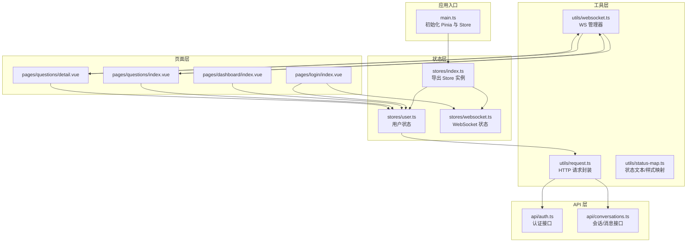
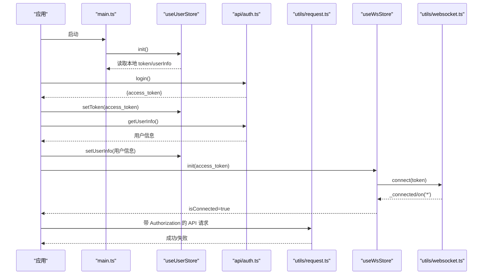
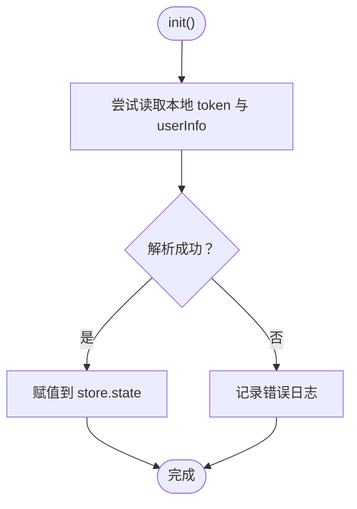
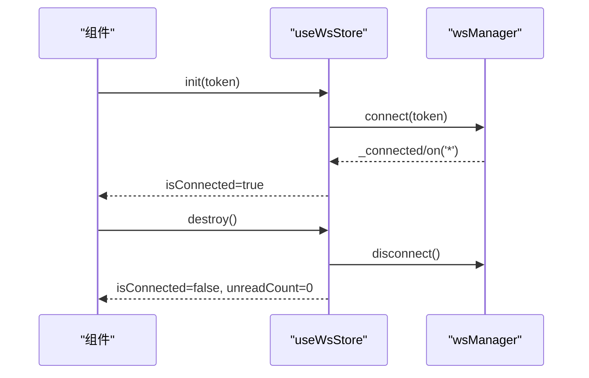
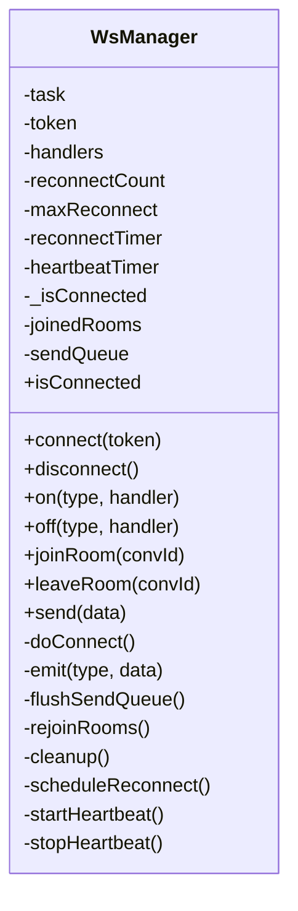
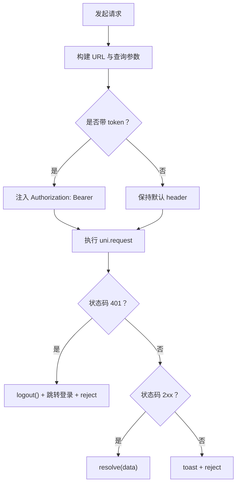
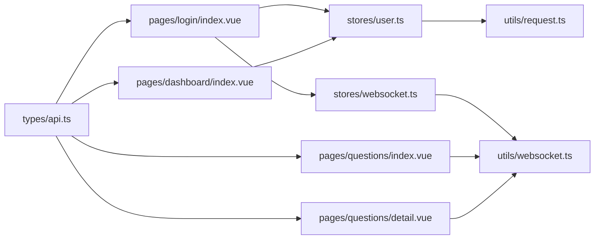

# 状态管理

<cite>
**本文引用的文件**
- [apps/teacher-app/src/stores/index.ts](file://apps/teacher-app/src/stores/index.ts)
- [apps/teacher-app/src/stores/user.ts](file://apps/teacher-app/src/stores/user.ts)
- [apps/teacher-app/src/stores/websocket.ts](file://apps/teacher-app/src/stores/websocket.ts)
- [apps/teacher-app/src/main.ts](file://apps/teacher-app/src/main.ts)
- [apps/teacher-app/src/utils/websocket.ts](file://apps/teacher-app/src/utils/websocket.ts)
- [apps/teacher-app/src/utils/request.ts](file://apps/teacher-app/src/utils/request.ts)
- [apps/teacher-app/src/api/auth.ts](file://apps/teacher-app/src/api/auth.ts)
- [apps/teacher-app/src/types/api.ts](file://apps/teacher-app/src/types/api.ts)
- [apps/teacher-app/src/pages/login/index.vue](file://apps/teacher-app/src/pages/login/index.vue)
- [apps/teacher-app/src/pages/dashboard/index.vue](file://apps/teacher-app/src/pages/dashboard/index.vue)
- [apps/teacher-app/src/pages/questions/index.vue](file://apps/teacher-app/src/pages/questions/index.vue)
- [apps/teacher-app/src/pages/questions/detail.vue](file://apps/teacher-app/src/pages/questions/detail.vue)
- [apps/teacher-app/src/utils/status-map.ts](file://apps/teacher-app/src/utils/status-map.ts)
</cite>

## 目录
1. [简介](#简介)
2. [项目结构](#项目结构)
3. [核心组件](#核心组件)
4. [架构总览](#架构总览)
5. [详细组件分析](#详细组件分析)
6. [依赖关系分析](#依赖关系分析)
7. [性能考量](#性能考量)
8. [故障排查指南](#故障排查指南)
9. [结论](#结论)
10. [附录](#附录)

## 简介
本文件面向“医小管 v2 教师端”的状态管理子系统，系统采用 Pinia 作为状态容器，结合自研 WebSocket 管理器，实现用户认证状态、WebSocket 连接状态与业务数据的统一管理。本文将从架构、组件、数据流、持久化策略、同步方案、最佳实践与性能优化等方面进行深入解析，并给出与 API 集成及错误处理的实操建议。

## 项目结构
教师端应用采用“按功能域分层 + Pinia Store”的组织方式：
- stores：集中定义全局状态（用户、WebSocket）
- utils：通用工具（网络请求、WebSocket 管理器、状态映射）
- api：与后端交互的接口封装
- pages：页面组件，消费 store 并触发 action
- types：类型定义（用户、会话、消息等）

图表来源
- [apps/teacher-app/src/main.ts:1-25](file://apps/teacher-app/src/main.ts#L1-L25)
- [apps/teacher-app/src/stores/index.ts:1-7](file://apps/teacher-app/src/stores/index.ts#L1-L7)
- [apps/teacher-app/src/stores/user.ts:1-63](file://apps/teacher-app/src/stores/user.ts#L1-L63)
- [apps/teacher-app/src/stores/websocket.ts:1-32](file://apps/teacher-app/src/stores/websocket.ts#L1-L32)
- [apps/teacher-app/src/utils/request.ts:1-108](file://apps/teacher-app/src/utils/request.ts#L1-L108)
- [apps/teacher-app/src/utils/websocket.ts:1-169](file://apps/teacher-app/src/utils/websocket.ts#L1-L169)
- [apps/teacher-app/src/api/auth.ts:1-43](file://apps/teacher-app/src/api/auth.ts#L1-L43)
- [apps/teacher-app/src/pages/login/index.vue:124-207](file://apps/teacher-app/src/pages/login/index.vue#L124-L207)
- [apps/teacher-app/src/pages/questions/index.vue:85-189](file://apps/teacher-app/src/pages/questions/index.vue#L85-L189)
- [apps/teacher-app/src/pages/questions/detail.vue:145-312](file://apps/teacher-app/src/pages/questions/detail.vue#L145-L312)

章节来源
- [apps/teacher-app/src/main.ts:1-25](file://apps/teacher-app/src/main.ts#L1-L25)
- [apps/teacher-app/src/stores/index.ts:1-7](file://apps/teacher-app/src/stores/index.ts#L1-L7)

## 核心组件
- 用户状态 Store（useUserStore）
  - 状态：token、userInfo
  - Getter：isLoggedIn、displayName
  - Action：init、setToken、setUserInfo、clearAuth、logout
  - 持久化：通过 uni 存储键持久化 token 与用户信息
- WebSocket 状态 Store（useWsStore）
  - 状态：isConnected、unreadCount
  - Action：init、destroy、incrementUnread、resetUnread
  - 与 wsManager 协同，负责连接生命周期与未读数管理
- WebSocket 管理器（wsManager）
  - 单连接 + 房间模式，支持重连、心跳、房间重加入、消息队列
  - 提供 on/off、joinRoom/leaveRoom、send 等能力
- 请求封装（request）
  - 统一注入 Authorization、超时控制、401 自动登出
  - 与 useUserStore 解耦，通过闭包获取 token

章节来源
- [apps/teacher-app/src/stores/user.ts:1-63](file://apps/teacher-app/src/stores/user.ts#L1-L63)
- [apps/teacher-app/src/stores/websocket.ts:1-32](file://apps/teacher-app/src/stores/websocket.ts#L1-L32)
- [apps/teacher-app/src/utils/websocket.ts:1-169](file://apps/teacher-app/src/utils/websocket.ts#L1-L169)
- [apps/teacher-app/src/utils/request.ts:1-108](file://apps/teacher-app/src/utils/request.ts#L1-L108)

## 架构总览
整体流程：应用启动时初始化 Pinia 与 Store；登录成功后写入 token 与用户信息，并建立 WebSocket 连接；页面组件通过 Store 的 getter 与 action 读取/更新状态；请求封装自动携带 token 并处理 401；WebSocket 管理器负责消息分发与房间订阅。

图表来源
- [apps/teacher-app/src/main.ts:9-19](file://apps/teacher-app/src/main.ts#L9-L19)
- [apps/teacher-app/src/stores/user.ts:19-49](file://apps/teacher-app/src/stores/user.ts#L19-L49)
- [apps/teacher-app/src/api/auth.ts:27-42](file://apps/teacher-app/src/api/auth.ts#L27-L42)
- [apps/teacher-app/src/utils/request.ts:67-73](file://apps/teacher-app/src/utils/request.ts#L67-L73)
- [apps/teacher-app/src/stores/websocket.ts:9-14](file://apps/teacher-app/src/stores/websocket.ts#L9-L14)
- [apps/teacher-app/src/utils/websocket.ts:66-114](file://apps/teacher-app/src/utils/websocket.ts#L66-L114)

## 详细组件分析

### 用户状态 Store（useUserStore）
- 状态定义
  - token：字符串，存储 JWT
  - userInfo：用户信息对象或空
- Getter
  - isLoggedIn：基于 token 是否存在判断
  - displayName：优先使用 userInfo.name，否则默认“老师”
- Action
  - init：从本地存储恢复 token 与 userInfo，异常安全处理
  - setToken：写入 token 并持久化
  - setUserInfo：写入 userInfo 并持久化
  - clearAuth/logout：清空 token 与 userInfo，并移除本地存储
- 数据持久化
  - 使用 uni 存储键分别保存 token 与 userInfo，异常捕获避免阻断初始化

图表来源
- [apps/teacher-app/src/stores/user.ts:19-28](file://apps/teacher-app/src/stores/user.ts#L19-L28)

章节来源
- [apps/teacher-app/src/stores/user.ts:1-63](file://apps/teacher-app/src/stores/user.ts#L1-L63)

### WebSocket 状态 Store（useWsStore）
- 状态定义
  - isConnected：布尔，表示连接状态
  - unreadCount：数字，未读消息计数
- Action
  - init(token)：委托 wsManager.connect，并监听连接事件以更新 isConnected
  - destroy()：断开连接并重置状态
  - incrementUnread/resetUnread：维护未读计数
- 与 wsManager 的协作
  - 通过 wsManager.on('*') 监听连接状态变化，保持 store 与底层连接一致

图表来源
- [apps/teacher-app/src/stores/websocket.ts:9-20](file://apps/teacher-app/src/stores/websocket.ts#L9-L20)
- [apps/teacher-app/src/utils/websocket.ts:66-114](file://apps/teacher-app/src/utils/websocket.ts#L66-L114)

章节来源
- [apps/teacher-app/src/stores/websocket.ts:1-32](file://apps/teacher-app/src/stores/websocket.ts#L1-L32)

### WebSocket 管理器（wsManager）
- 连接与生命周期
  - connect(token)/disconnect()：建立/关闭连接
  - 自动心跳（每 30s ping）、断线重连（指数退避，最多 N 次）
- 房间与消息
  - joinRoom/leaveRoom：加入/离开会话房间
  - send：未连接时入队，连上后 flush
- 事件分发
  - on/off：注册/注销事件处理器
  - 重连后自动 rejoinRooms，确保消息订阅连续
- 错误与清理
  - onClose/onError：记录日志并调度重连
  - cleanup：停止心跳、清理定时器、关闭 socket

图表来源
- [apps/teacher-app/src/utils/websocket.ts:9-168](file://apps/teacher-app/src/utils/websocket.ts#L9-L168)

章节来源
- [apps/teacher-app/src/utils/websocket.ts:1-169](file://apps/teacher-app/src/utils/websocket.ts#L1-L169)

### 请求封装（request）
- 统一注入 Authorization：若存在 token，则在 header 中添加 Bearer
- 超时与参数拼接：支持超时配置与 query 参数拼接
- 401 自动登出：收到 401 时调用 useUserStore.logout 并跳转登录页
- 错误提示：对非 2xx 场景统一 toast 提示

图表来源
- [apps/teacher-app/src/utils/request.ts:10-77](file://apps/teacher-app/src/utils/request.ts#L10-L77)
- [apps/teacher-app/src/stores/user.ts:40-49](file://apps/teacher-app/src/stores/user.ts#L40-L49)

章节来源
- [apps/teacher-app/src/utils/request.ts:1-108](file://apps/teacher-app/src/utils/request.ts#L1-L108)

### 页面与 Store 的交互
- 登录页（pages/login/index.vue）
  - 调用登录 API 获取 access_token
  - 写入 useUserStore.setToken 与 setUserInfo
  - 调用 useWsStore.init 建立 WS 连接
- 工作台（pages/dashboard/index.vue）
  - 读取 useUserStore.displayName 渲染欢迎语
  - 通过 API 获取统计数据与待处理问题列表
- 问题列表（pages/questions/index.vue）
  - 使用 wsManager.on 订阅 escalation_notify 与 status_changed
  - 轮询兜底：每 30s 刷新一次，避免 WS 事件丢失
- 问题详情（pages/questions/detail.vue）
  - 加载会话详情与消息列表
  - joinRoom/leaveRoom 管理房间订阅
  - 监听 new_message/status_changed/escalation_notify 更新 UI

章节来源
- [apps/teacher-app/src/pages/login/index.vue:164-191](file://apps/teacher-app/src/pages/login/index.vue#L164-L191)
- [apps/teacher-app/src/pages/dashboard/index.vue:156-158](file://apps/teacher-app/src/pages/dashboard/index.vue#L156-L158)
- [apps/teacher-app/src/pages/questions/index.vue:170-188](file://apps/teacher-app/src/pages/questions/index.vue#L170-L188)
- [apps/teacher-app/src/pages/questions/detail.vue:174-189](file://apps/teacher-app/src/pages/questions/detail.vue#L174-L189)
- [apps/teacher-app/src/pages/questions/detail.vue:293-311](file://apps/teacher-app/src/pages/questions/detail.vue#L293-L311)

## 依赖关系分析
- store 与工具
  - useUserStore 依赖 uni 存储进行持久化
  - useWsStore 依赖 wsManager 管理连接与房间
  - request 依赖 useUserStore 获取 token
- 页面与 store
  - 登录页：useUserStore + useWsStore
  - 问答页：useUserStore + wsManager（直接导入）
- 类型与 API
  - types/api.ts 定义 UserInfo、Conversation、Message 等类型
  - api/auth.ts 定义登录与获取用户信息接口

图表来源
- [apps/teacher-app/src/stores/user.ts:1-63](file://apps/teacher-app/src/stores/user.ts#L1-L63)
- [apps/teacher-app/src/stores/websocket.ts:1-32](file://apps/teacher-app/src/stores/websocket.ts#L1-L32)
- [apps/teacher-app/src/utils/websocket.ts:1-169](file://apps/teacher-app/src/utils/websocket.ts#L1-L169)
- [apps/teacher-app/src/utils/request.ts:1-108](file://apps/teacher-app/src/utils/request.ts#L1-L108)
- [apps/teacher-app/src/types/api.ts:1-51](file://apps/teacher-app/src/types/api.ts#L1-L51)
- [apps/teacher-app/src/pages/login/index.vue:124-207](file://apps/teacher-app/src/pages/login/index.vue#L124-L207)
- [apps/teacher-app/src/pages/questions/index.vue:85-189](file://apps/teacher-app/src/pages/questions/index.vue#L85-L189)
- [apps/teacher-app/src/pages/questions/detail.vue:145-312](file://apps/teacher-app/src/pages/questions/detail.vue#L145-L312)

章节来源
- [apps/teacher-app/src/types/api.ts:1-51](file://apps/teacher-app/src/types/api.ts#L1-L51)

## 性能考量
- 连接与心跳
  - 心跳周期 30s，减少网络压力；断线重连采用指数退避，上限可控
- 消息队列
  - 发送队列在未连接时缓存，连上后一次性 flush，降低丢包风险
- 房间重加入
  - 重连后自动 rejoinRooms，保证订阅连续性
- 轮询兜底
  - 问答列表页面每 30s 轮询一次，作为 WS 事件丢失的兜底策略
- 请求超时与参数拼接
  - 统一超时时间与 query 拼接，避免重复构造
- UI 响应
  - 通过 computed 与 ref 精准响应，避免不必要的重渲染

[本节为通用性能讨论，无需特定文件来源]

## 故障排查指南
- 登录后无法进入工作台
  - 检查 useUserStore.setToken 与 setUserInfo 是否被调用
  - 确认 useWsStore.init 是否在 token 存在时被调用
- WebSocket 不在线
  - 查看 wsManager.on('*') 是否正确监听连接事件
  - 检查断线重连日志与心跳是否正常
- 401 自动登出频繁
  - 检查 request 是否正确注入 Authorization
  - 确认后端 token 有效期与刷新策略
- 问答列表不更新
  - 确认 WS 事件 new_message/status_changed 是否注册
  - 检查轮询定时器是否被清理或重复创建
- 会话详情消息不显示
  - 确认 joinRoom 是否在加载详情后调用
  - 检查 onNewMessage 的过滤逻辑是否匹配 conv_id

章节来源
- [apps/teacher-app/src/pages/login/index.vue:164-191](file://apps/teacher-app/src/pages/login/index.vue#L164-L191)
- [apps/teacher-app/src/pages/questions/index.vue:170-188](file://apps/teacher-app/src/pages/questions/index.vue#L170-L188)
- [apps/teacher-app/src/pages/questions/detail.vue:174-189](file://apps/teacher-app/src/pages/questions/detail.vue#L174-L189)
- [apps/teacher-app/src/utils/request.ts:42-48](file://apps/teacher-app/src/utils/request.ts#L42-L48)

## 结论
该状态管理方案以 Pinia 为核心，结合自研 wsManager，实现了用户认证、连接状态与业务数据的统一治理。通过持久化、事件驱动与轮询兜底，系统在多端环境下具备良好的稳定性与可维护性。建议后续在大型会话场景下引入更细粒度的模块化 store 与更完善的错误边界处理。

[本节为总结性内容，无需特定文件来源]

## 附录

### 状态定义与类型
- 用户信息类型（UserInfo）
  - 字段：id、staff_id、name、role、college_id、class_id、avatar_url
- 会话类型（Conversation）
  - 字段：id、student_id、teacher_id、status、title、dify_conversation_id、created_at、updated_at 及关联字段
- 消息类型（Message）
  - 字段：id、conversation_id、sender_type、sender_id、content、created_at、metadata_

章节来源
- [apps/teacher-app/src/types/api.ts:4-42](file://apps/teacher-app/src/types/api.ts#L4-L42)

### 状态持久化策略
- 用户状态
  - token 与 userInfo 分别持久化，异常安全处理，避免初始化失败
- WebSocket 状态
  - isConnected 由 wsManager 决定，unreadCount 在组件侧维护，退出房间时重置

章节来源
- [apps/teacher-app/src/stores/user.ts:19-49](file://apps/teacher-app/src/stores/user.ts#L19-L49)
- [apps/teacher-app/src/stores/websocket.ts:6-28](file://apps/teacher-app/src/stores/websocket.ts#L6-L28)

### 状态同步方案
- 登录流程
  - 登录成功后写入 token 与 userInfo，并建立 WS 连接
- 问答流程
  - 列表页订阅 WS 事件并轮询兜底
  - 详情页 joinRoom 并监听消息与状态变更
- 状态映射
  - 使用 status-map 工具将状态码映射为文案与样式类名

章节来源
- [apps/teacher-app/src/pages/login/index.vue:164-191](file://apps/teacher-app/src/pages/login/index.vue#L164-L191)
- [apps/teacher-app/src/pages/questions/index.vue:170-188](file://apps/teacher-app/src/pages/questions/index.vue#L170-L188)
- [apps/teacher-app/src/pages/questions/detail.vue:174-189](file://apps/teacher-app/src/pages/questions/detail.vue#L174-L189)
- [apps/teacher-app/src/utils/status-map.ts:1-30](file://apps/teacher-app/src/utils/status-map.ts#L1-L30)

### 最佳实践与建议
- 将 store 的初始化放在应用启动阶段，确保全局可用
- 对于需要跨页面共享的数据，优先放入 Pinia；仅在组件内临时状态使用 ref
- 对关键事件（如 WS 连接、状态变更）采用 on/off 成对注册与注销
- 对长连接场景，保留轮询兜底，提升健壮性
- 对请求错误进行统一处理，避免重复弹窗与死循环

[本节为通用最佳实践，无需特定文件来源]