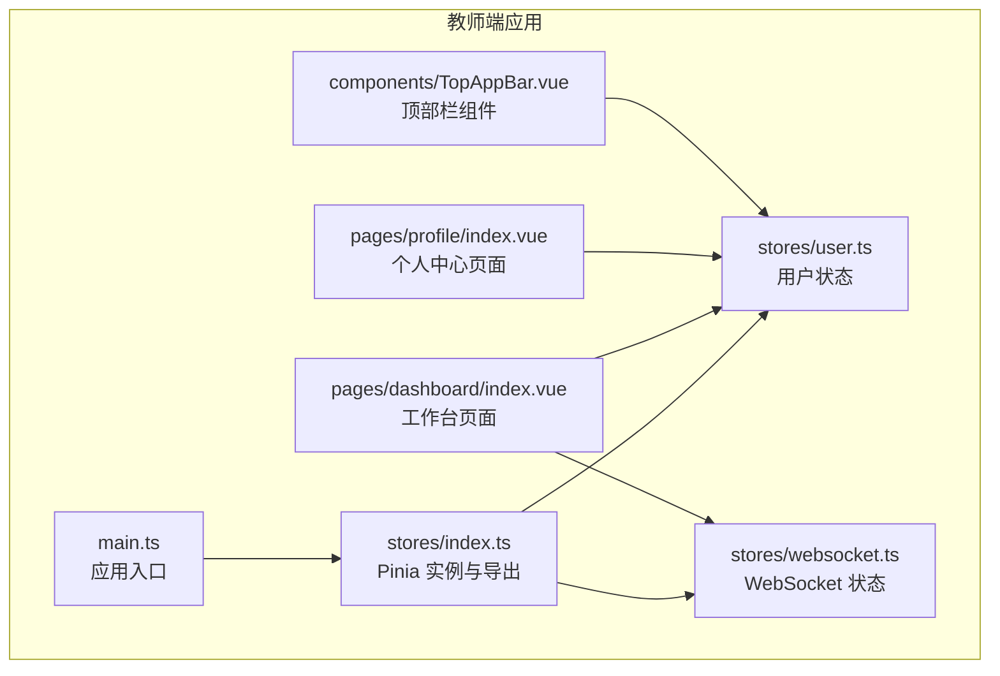
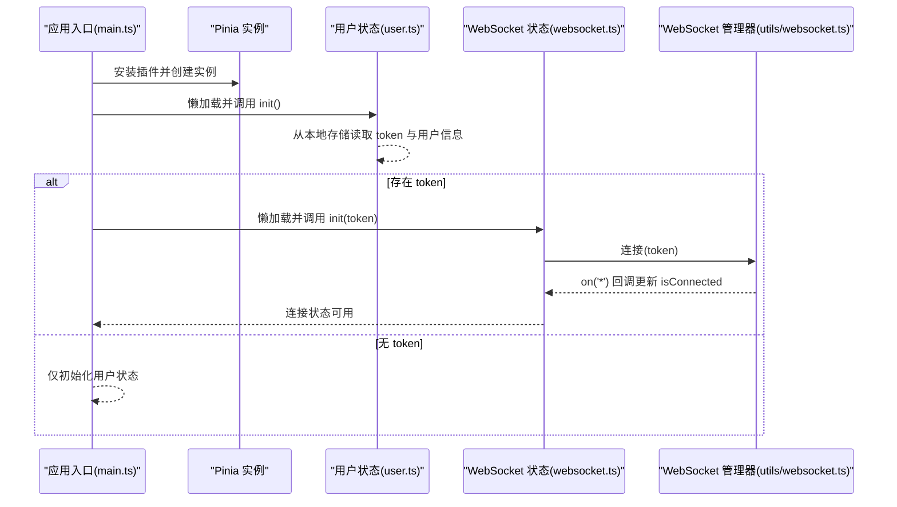
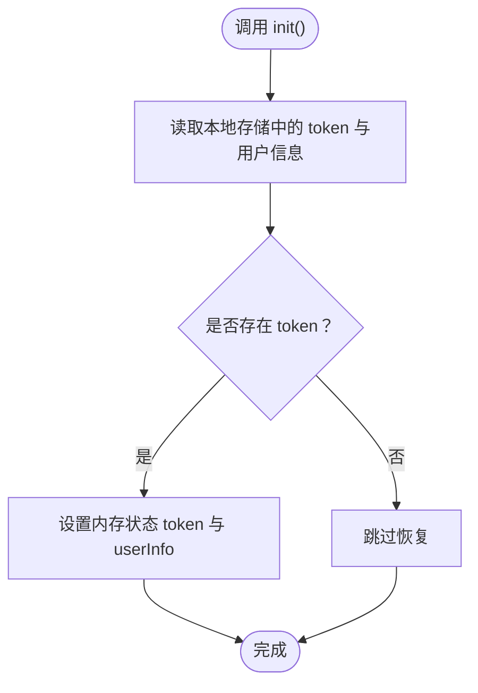
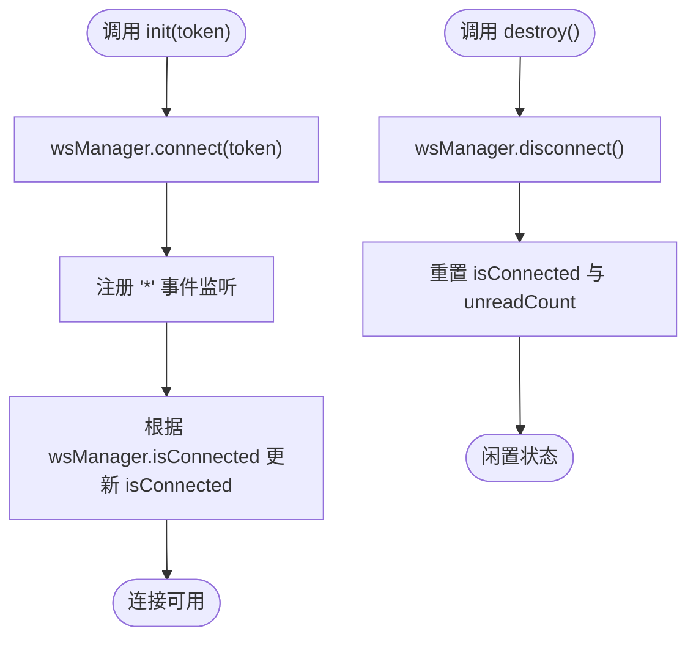
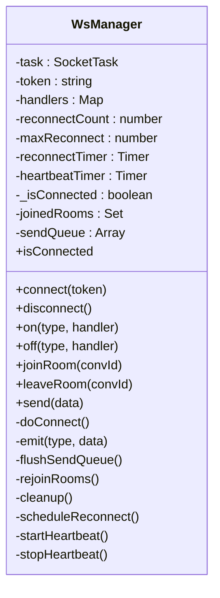
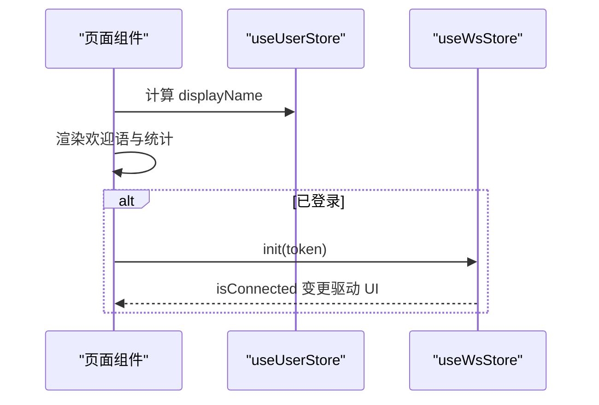
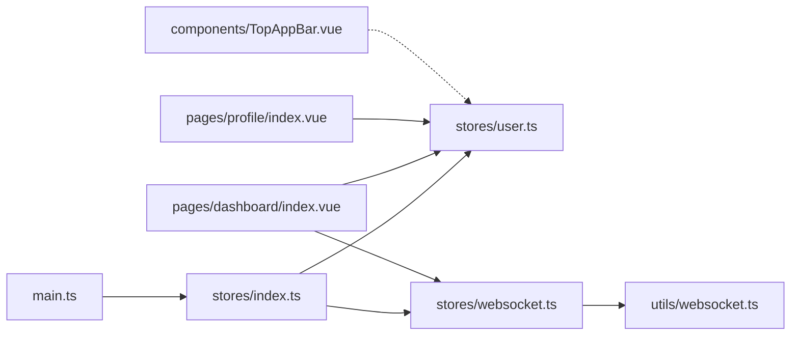

# 状态管理索引

<cite>
**本文引用的文件**
- [apps/teacher-app/src/stores/index.ts](file://apps/teacher-app/src/stores/index.ts)
- [apps/teacher-app/src/stores/user.ts](file://apps/teacher-app/src/stores/user.ts)
- [apps/teacher-app/src/stores/websocket.ts](file://apps/teacher-app/src/stores/websocket.ts)
- [apps/teacher-app/src/main.ts](file://apps/teacher-app/src/main.ts)
- [apps/teacher-app/src/utils/websocket.ts](file://apps/teacher-app/src/utils/websocket.ts)
- [apps/teacher-app/src/pages/dashboard/index.vue](file://apps/teacher-app/src/pages/dashboard/index.vue)
- [apps/teacher-app/src/pages/profile/index.vue](file://apps/teacher-app/src/pages/profile/index.vue)
- [apps/teacher-app/src/components/TopAppBar.vue](file://apps/teacher-app/src/components/TopAppBar.vue)
- [apps/teacher-app/src/types/api.ts](file://apps/teacher-app/src/types/api.ts)
- [apps/teacher-app/src/utils/status-map.ts](file://apps/teacher-app/src/utils/status-map.ts)
</cite>

## 目录
1. [简介](#简介)
2. [项目结构](#项目结构)
3. [核心组件](#核心组件)
4. [架构总览](#架构总览)
5. [详细组件分析](#详细组件分析)
6. [依赖关系分析](#依赖关系分析)
7. [性能考量](#性能考量)
8. [故障排查指南](#故障排查指南)
9. [结论](#结论)
10. [附录](#附录)

## 简介
本文件面向“医小管 v2 教师端”的全局状态管理，系统性梳理 Pinia 状态仓库的组织结构、模块化设计与注册方式；详解各 store 的职责边界、数据流向与依赖关系；并给出最佳实践与性能优化建议，帮助开发者在多页面、多状态场景下高效构建稳定的状态体系。

## 项目结构
教师端采用“按功能域分层 + 模块化导出”的组织方式：
- stores 目录集中存放全局状态仓库，通过统一入口导出，便于在应用启动时集中挂载
- main.ts 在应用初始化阶段完成 Pinia 安装，并按需懒加载用户与 WebSocket 状态，实现轻量启动
- 页面组件通过组合式 API 使用 store，保持视图层与状态层解耦

图表来源
- [apps/teacher-app/src/main.ts:1-25](file://apps/teacher-app/src/main.ts#L1-L25)
- [apps/teacher-app/src/stores/index.ts:1-7](file://apps/teacher-app/src/stores/index.ts#L1-L7)
- [apps/teacher-app/src/stores/user.ts:1-63](file://apps/teacher-app/src/stores/user.ts#L1-L63)
- [apps/teacher-app/src/stores/websocket.ts:1-32](file://apps/teacher-app/src/stores/websocket.ts#L1-L32)
- [apps/teacher-app/src/pages/dashboard/index.vue:138-252](file://apps/teacher-app/src/pages/dashboard/index.vue#L138-L252)
- [apps/teacher-app/src/pages/profile/index.vue:144-169](file://apps/teacher-app/src/pages/profile/index.vue#L144-L169)
- [apps/teacher-app/src/components/TopAppBar.vue:48-85](file://apps/teacher-app/src/components/TopAppBar.vue#L48-L85)

章节来源
- [apps/teacher-app/src/main.ts:1-25](file://apps/teacher-app/src/main.ts#L1-L25)
- [apps/teacher-app/src/stores/index.ts:1-7](file://apps/teacher-app/src/stores/index.ts#L1-L7)

## 核心组件
- Pinia 实例与导出
  - 在 stores/index.ts 中创建 Pinia 实例，并统一导出 user 与 websocket 两个 store，便于集中挂载与按需引入
- 用户状态仓库（user）
  - 负责教师身份令牌与用户信息的持久化存储、读取与清理
  - 提供登录态判断、显示名计算等派生状态
- WebSocket 状态仓库（websocket）
  - 负责连接生命周期管理、未读计数与连接状态同步
  - 通过 wsManager 实现底层连接与消息分发

章节来源
- [apps/teacher-app/src/stores/index.ts:1-7](file://apps/teacher-app/src/stores/index.ts#L1-L7)
- [apps/teacher-app/src/stores/user.ts:1-63](file://apps/teacher-app/src/stores/user.ts#L1-L63)
- [apps/teacher-app/src/stores/websocket.ts:1-32](file://apps/teacher-app/src/stores/websocket.ts#L1-L32)

## 架构总览
整体架构围绕“应用启动 → 状态挂载 → 懒加载初始化 → 页面消费状态”的流程展开。用户状态先被初始化，若存在有效 token，则自动建立 WebSocket 连接并同步连接状态。

图表来源
- [apps/teacher-app/src/main.ts:9-19](file://apps/teacher-app/src/main.ts#L9-L19)
- [apps/teacher-app/src/stores/user.ts:19-28](file://apps/teacher-app/src/stores/user.ts#L19-L28)
- [apps/teacher-app/src/stores/websocket.ts:9-14](file://apps/teacher-app/src/stores/websocket.ts#L9-L14)
- [apps/teacher-app/src/utils/websocket.ts:26-114](file://apps/teacher-app/src/utils/websocket.ts#L26-L114)

## 详细组件分析

### 用户状态仓库（user）
- 状态
  - token：当前教师登录态标识
  - userInfo：教师用户信息对象
- 派生状态
  - isLoggedIn：基于 token 的登录态
  - displayName：优先使用真实姓名，否则回退为默认名称
- 行为
  - init：从本地存储恢复 token 与 userInfo
  - setToken/setUserInfo：写入本地存储并更新内存状态
  - clearAuth/logout：清空 token 与 userInfo 并移除本地存储

图表来源
- [apps/teacher-app/src/stores/user.ts:19-28](file://apps/teacher-app/src/stores/user.ts#L19-L28)

章节来源
- [apps/teacher-app/src/stores/user.ts:1-63](file://apps/teacher-app/src/stores/user.ts#L1-L63)

### WebSocket 状态仓库（websocket）
- 状态
  - isConnected：连接是否就绪
  - unreadCount：未读消息计数
- 行为
  - init：委托 wsManager 建立连接，并订阅所有消息以更新 isConnected
  - destroy：断开连接并重置计数
  - incrementUnread/resetUnread：未读计数维护

图表来源
- [apps/teacher-app/src/stores/websocket.ts:9-20](file://apps/teacher-app/src/stores/websocket.ts#L9-L20)
- [apps/teacher-app/src/utils/websocket.ts:78-104](file://apps/teacher-app/src/utils/websocket.ts#L78-L104)

章节来源
- [apps/teacher-app/src/stores/websocket.ts:1-32](file://apps/teacher-app/src/stores/websocket.ts#L1-L32)

### WebSocket 管理器（utils/websocket）
- 职责
  - 单连接模型，支持房间加入/离开、发送队列、心跳保活、指数退避重连
  - 统一消息分发，按类型路由至对应处理器
- 关键机制
  - 连接生命周期：open/message/close/error
  - 房间重连恢复：断线后自动 re-join
  - 发送队列：未连接时缓存，连上后 flush

图表来源
- [apps/teacher-app/src/utils/websocket.ts:9-168](file://apps/teacher-app/src/utils/websocket.ts#L9-L168)

章节来源
- [apps/teacher-app/src/utils/websocket.ts:1-169](file://apps/teacher-app/src/utils/websocket.ts#L1-L169)

### 页面与组件中的状态使用
- 工作台页面（dashboard）
  - 使用 userStore.displayName 渲染欢迎语
  - 通过 API 获取待处理会话列表并渲染
- 个人中心页面（profile）
  - 读取 userStore.userInfo 展示教师信息
  - 触发 userStore.clearAuth() 后跳转登录页
- 顶部栏组件（TopAppBar）
  - 作为通用 UI 组件，不直接依赖 store，但可由父级页面注入或通过 props/emit 与状态交互

图表来源
- [apps/teacher-app/src/pages/dashboard/index.vue:157-158](file://apps/teacher-app/src/pages/dashboard/index.vue#L157-L158)
- [apps/teacher-app/src/pages/profile/index.vue:152-157](file://apps/teacher-app/src/pages/profile/index.vue#L152-L157)
- [apps/teacher-app/src/stores/websocket.ts:9-14](file://apps/teacher-app/src/stores/websocket.ts#L9-L14)

章节来源
- [apps/teacher-app/src/pages/dashboard/index.vue:138-252](file://apps/teacher-app/src/pages/dashboard/index.vue#L138-L252)
- [apps/teacher-app/src/pages/profile/index.vue:144-169](file://apps/teacher-app/src/pages/profile/index.vue#L144-L169)
- [apps/teacher-app/src/components/TopAppBar.vue:48-85](file://apps/teacher-app/src/components/TopAppBar.vue#L48-L85)

## 依赖关系分析
- 入口依赖
  - main.ts 依赖 stores/index.ts 导出的 pinia 实例
  - stores/index.ts 统一导出 user 与 websocket
- 运行时依赖
  - user.ts 依赖本地存储接口进行持久化
  - websocket.ts 依赖 wsManager 进行连接与消息分发
  - wsManager 依赖 uni.connectSocket 与原生 WebSocket
- 视图依赖
  - 页面组件通过组合式 API 使用 user 与 websocket
  - 顶部栏组件不直接依赖 store，保持通用性

图表来源
- [apps/teacher-app/src/main.ts:2](file://apps/teacher-app/src/main.ts#L2)
- [apps/teacher-app/src/stores/index.ts:5-6](file://apps/teacher-app/src/stores/index.ts#L5-L6)
- [apps/teacher-app/src/stores/user.ts:1](file://apps/teacher-app/src/stores/user.ts#L1)
- [apps/teacher-app/src/stores/websocket.ts:1](file://apps/teacher-app/src/stores/websocket.ts#L1)
- [apps/teacher-app/src/utils/websocket.ts:1](file://apps/teacher-app/src/utils/websocket.ts#L1)
- [apps/teacher-app/src/pages/dashboard/index.vue:141](file://apps/teacher-app/src/pages/dashboard/index.vue#L141)
- [apps/teacher-app/src/pages/profile/index.vue:146](file://apps/teacher-app/src/pages/profile/index.vue#L146)
- [apps/teacher-app/src/components/TopAppBar.vue:49](file://apps/teacher-app/src/components/TopAppBar.vue#L49)

章节来源
- [apps/teacher-app/src/main.ts:1-25](file://apps/teacher-app/src/main.ts#L1-L25)
- [apps/teacher-app/src/stores/index.ts:1-7](file://apps/teacher-app/src/stores/index.ts#L1-L7)

## 性能考量
- 启动阶段懒加载
  - main.ts 采用动态 import 按需加载 user 与 websocket，避免首屏阻塞
- 状态粒度与计算属性
  - 将派生状态（如 displayName）置于 store 内部，减少重复计算与模板逻辑复杂度
- WebSocket 队列与保活
  - 发送队列与心跳保活降低网络抖动对体验的影响，提升稳定性
- 本地存储访问
  - 仅在必要时读写本地存储，避免频繁 IO 影响主线程

## 故障排查指南
- 登录后未建立 WebSocket 连接
  - 检查 main.ts 中是否在 userStore.token 存在时调用 wsStore.init()
  - 确认 wsManager.on('*') 是否正确更新 isConnected
- 连接断开未自动重连
  - 检查 wsManager.scheduleReconnect 的指数退避与最大重试次数
  - 确认 on('close') 是否触发重连调度
- 未读计数异常
  - 确认 incrementUnread/resetUnread 的调用时机与作用域
  - 检查页面是否正确订阅 isConnected 与未读变化
- 本地存储读写失败
  - 捕获异常并降级处理，确保不会阻断初始化流程

章节来源
- [apps/teacher-app/src/main.ts:9-19](file://apps/teacher-app/src/main.ts#L9-L19)
- [apps/teacher-app/src/stores/websocket.ts:9-28](file://apps/teacher-app/src/stores/websocket.ts#L9-L28)
- [apps/teacher-app/src/utils/websocket.ts:148-154](file://apps/teacher-app/src/utils/websocket.ts#L148-L154)

## 结论
教师端状态管理采用 Pinia + 组合式 Store 的现代化方案，通过统一入口导出与懒加载初始化，实现了清晰的模块边界与良好的启动性能。用户与 WebSocket 状态相互独立又协同工作，配合 wsManager 的稳健连接策略，满足教学场景下的实时交互需求。建议在后续迭代中进一步完善跨页面共享状态的规范化与测试覆盖，持续优化性能与可观测性。

## 附录
- 类型定义参考
  - 用户信息与会话、消息等类型定义位于 types/api.ts
  - 会话状态文本与样式映射位于 utils/status-map.ts

章节来源
- [apps/teacher-app/src/types/api.ts:1-51](file://apps/teacher-app/src/types/api.ts#L1-L51)
- [apps/teacher-app/src/utils/status-map.ts:1-29](file://apps/teacher-app/src/utils/status-map.ts#L1-L29)