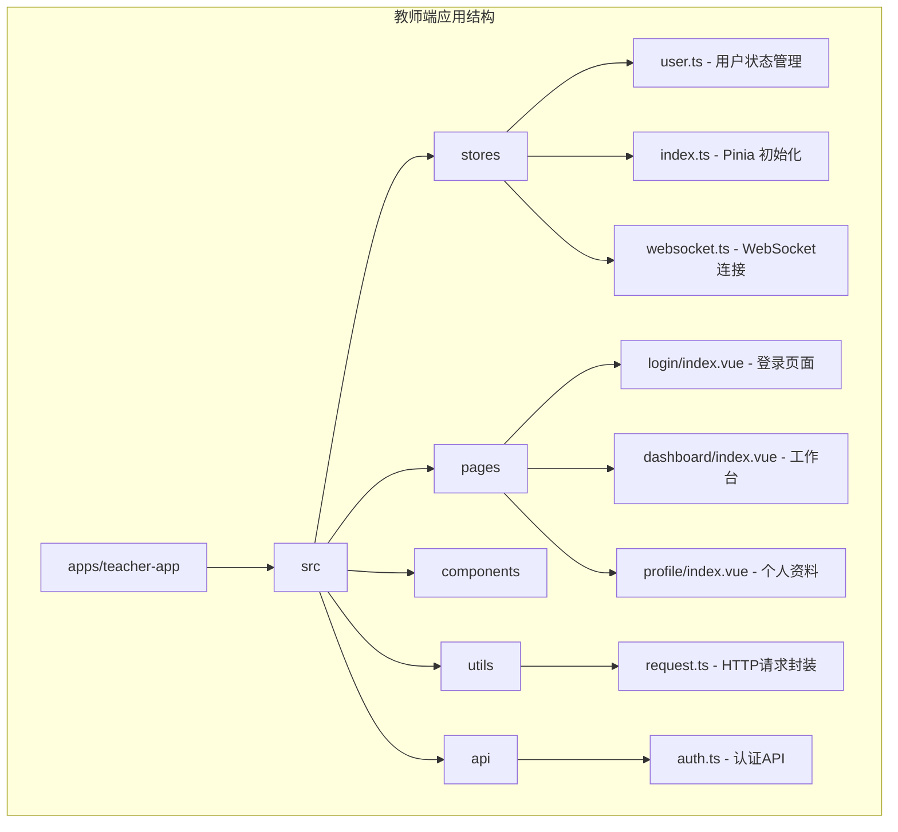
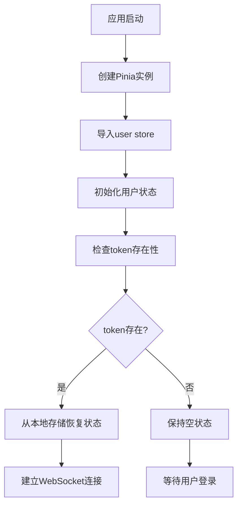
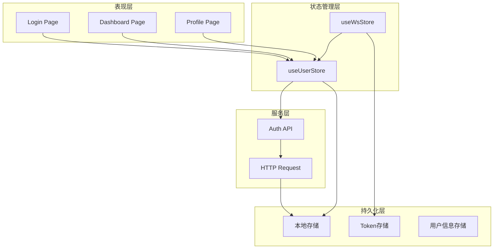
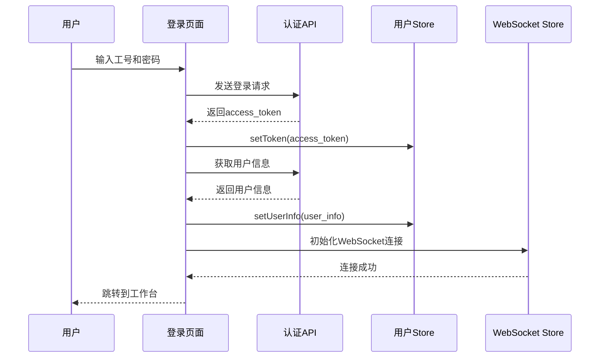
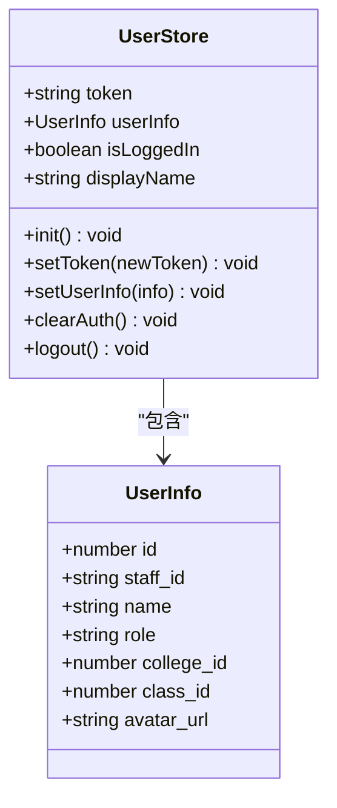
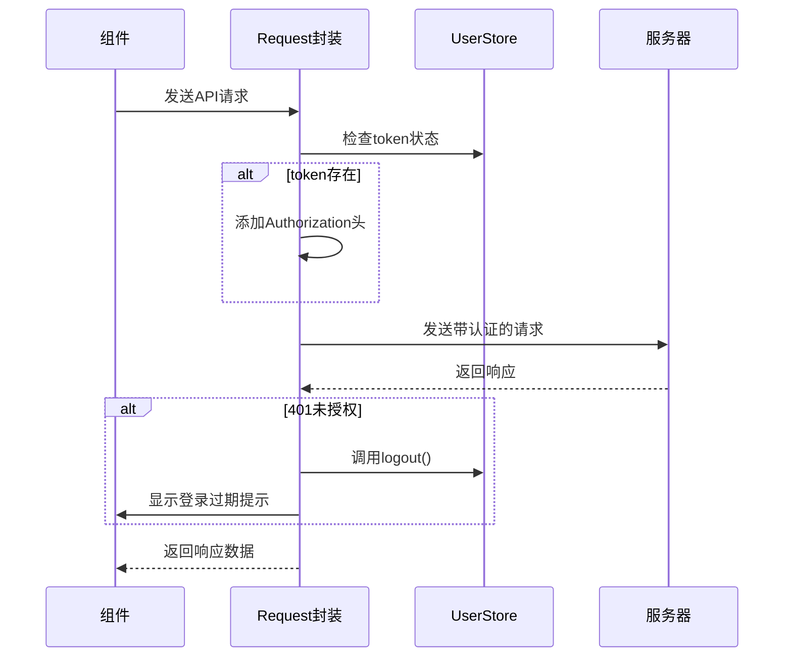
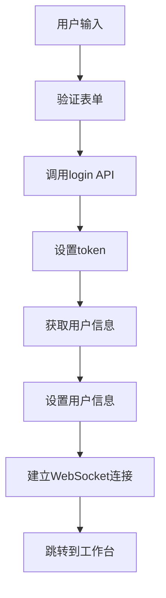
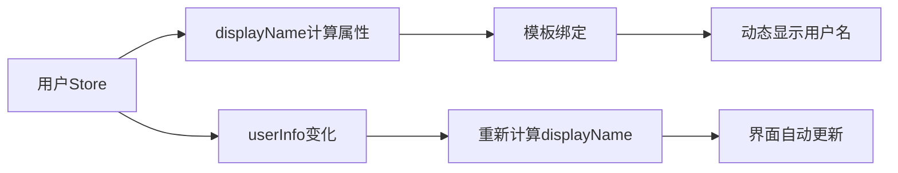
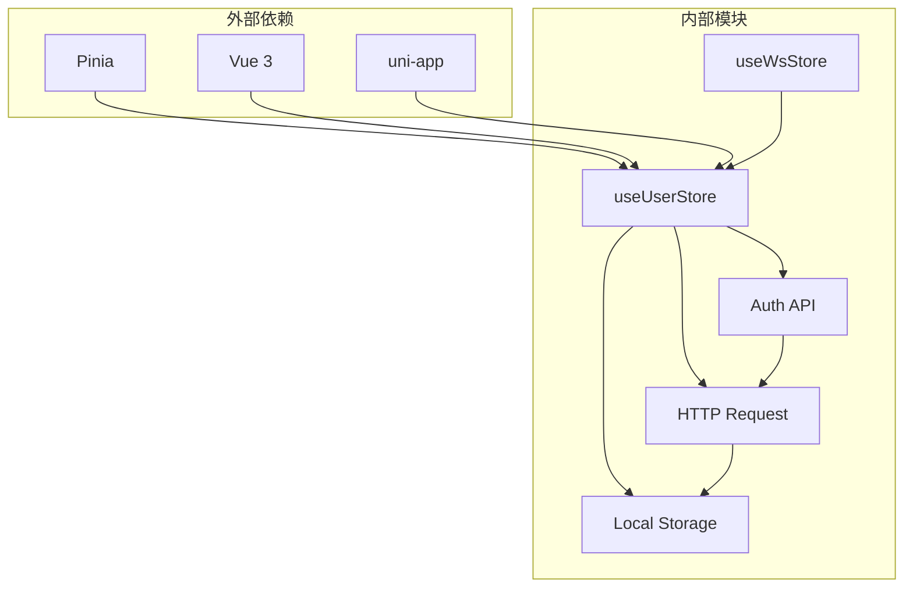
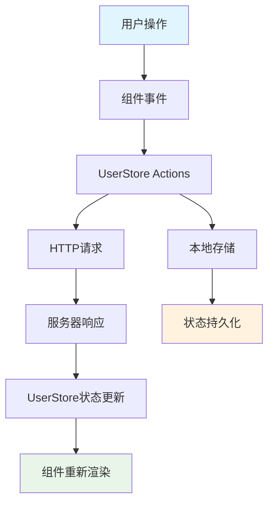

# 用户状态管理

<cite>
**本文档引用的文件**
- [apps/teacher-app/src/stores/user.ts](file://apps/teacher-app/src/stores/user.ts)
- [apps/teacher-app/src/stores/index.ts](file://apps/teacher-app/src/stores/index.ts)
- [apps/teacher-app/src/api/auth.ts](file://apps/teacher-app/src/api/auth.ts)
- [apps/teacher-app/src/utils/request.ts](file://apps/teacher-app/src/utils/request.ts)
- [apps/teacher-app/src/main.ts](file://apps/teacher-app/src/main.ts)
- [apps/teacher-app/src/pages/login/index.vue](file://apps/teacher-app/src/pages/login/index.vue)
- [apps/teacher-app/src/pages/profile/index.vue](file://apps/teacher-app/src/pages/profile/index.vue)
- [apps/teacher-app/src/pages/dashboard/index.vue](file://apps/teacher-app/src/pages/dashboard/index.vue)
- [apps/teacher-app/src/stores/websocket.ts](file://apps/teacher-app/src/stores/websocket.ts)
- [apps/teacher-app/src/types/api.ts](file://apps/teacher-app/src/types/api.ts)
</cite>

## 目录
1. [简介](#简介)
2. [项目结构](#项目结构)
3. [核心组件](#核心组件)
4. [架构概览](#架构概览)
5. [详细组件分析](#详细组件分析)
6. [依赖关系分析](#依赖关系分析)
7. [性能考虑](#性能考虑)
8. [故障排除指南](#故障排除指南)
9. [结论](#结论)
10. [附录](#附录)

## 简介

医小管 v2 教师端用户状态管理系统基于 Pinia 状态管理库构建，为教师工作台提供了完整的用户认证和状态管理解决方案。该系统实现了 token 管理、用户信息存储、登录状态检测等核心功能，并通过本地存储实现了状态的持久化。

系统采用现代化的 Vue 3 Composition API 设计模式，结合 uni-app 跨平台框架特性，为教师端提供了流畅的用户体验。用户状态管理涵盖了从登录认证到会话维护的完整生命周期管理。

## 项目结构

医小管 v2 的用户状态管理模块位于教师端应用的 stores 目录下，采用清晰的模块化组织结构：



**图表来源**
- [apps/teacher-app/src/stores/user.ts:1-63](file://apps/teacher-app/src/stores/user.ts#L1-L63)
- [apps/teacher-app/src/stores/index.ts:1-7](file://apps/teacher-app/src/stores/index.ts#L1-L7)

**章节来源**
- [apps/teacher-app/src/stores/user.ts:1-63](file://apps/teacher-app/src/stores/user.ts#L1-L63)
- [apps/teacher-app/src/stores/index.ts:1-7](file://apps/teacher-app/src/stores/index.ts#L1-L7)

## 核心组件

### 用户状态 Store (useUserStore)

用户状态管理的核心是 useUserStore，它基于 Pinia 的组合式 API 设计，提供了完整的用户状态管理功能：

#### 状态定义
- **token**: 存储 JWT 认证令牌
- **userInfo**: 存储用户详细信息，支持 null 状态

#### 计算属性
- **isLoggedIn**: 基于 token 值判断登录状态
- **displayName**: 提供用户显示名称，支持默认值

#### Action 方法
- **init()**: 初始化用户状态，从本地存储恢复
- **setToken(newToken)**: 设置并持久化认证令牌
- **setUserInfo(info)**: 设置并持久化用户信息
- **clearAuth()**: 清除所有认证状态
- **logout()**: 便捷的登出方法

**章节来源**
- [apps/teacher-app/src/stores/user.ts:8-62](file://apps/teacher-app/src/stores/user.ts#L8-L62)

### Pinia 初始化

系统通过 stores/index.ts 文件初始化 Pinia 实例，并导出用户状态管理模块：



**图表来源**
- [apps/teacher-app/src/stores/index.ts:1-7](file://apps/teacher-app/src/stores/index.ts#L1-L7)
- [apps/teacher-app/src/main.ts:9-19](file://apps/teacher-app/src/main.ts#L9-L19)

**章节来源**
- [apps/teacher-app/src/stores/index.ts:1-7](file://apps/teacher-app/src/stores/index.ts#L1-L7)
- [apps/teacher-app/src/main.ts:9-19](file://apps/teacher-app/src/main.ts#L9-L19)

## 架构概览

医小管 v2 的用户状态管理采用分层架构设计，确保了系统的可维护性和扩展性：



**图表来源**
- [apps/teacher-app/src/stores/user.ts:1-63](file://apps/teacher-app/src/stores/user.ts#L1-L63)
- [apps/teacher-app/src/api/auth.ts:1-43](file://apps/teacher-app/src/api/auth.ts#L1-L43)
- [apps/teacher-app/src/utils/request.ts:1-108](file://apps/teacher-app/src/utils/request.ts#L1-L108)

### 认证流程

系统实现了完整的认证流程，从用户登录到状态维护：



**图表来源**
- [apps/teacher-app/src/pages/login/index.vue:165-191](file://apps/teacher-app/src/pages/login/index.vue#L165-L191)
- [apps/teacher-app/src/api/auth.ts:30-42](file://apps/teacher-app/src/api/auth.ts#L30-L42)
- [apps/teacher-app/src/stores/user.ts:30-38](file://apps/teacher-app/src/stores/user.ts#L30-L38)

## 详细组件分析

### 用户状态 Store 详细分析

#### 状态管理机制

用户状态 Store 采用了响应式状态管理模式，通过 ref 和 computed 实现状态的自动更新：



**图表来源**
- [apps/teacher-app/src/stores/user.ts:8-62](file://apps/teacher-app/src/stores/user.ts#L8-L62)
- [apps/teacher-app/src/types/api.ts:4-12](file://apps/teacher-app/src/types/api.ts#L4-L12)

#### 持久化机制

系统实现了完整的本地存储机制，确保用户状态在应用重启后能够正确恢复：

```mermaid
flowchart LR
A[应用启动] --> B[init()方法]
B --> C[读取本地存储]
C --> D{token存在?}
D --> |是| E[token.value = storedToken]
D --> |否| F[保持空状态]
E --> G{userInfo存在?}
G --> |是| H[userInfo.value = parsedUserInfo]
G --> |否| I[保持null状态]
H --> J[状态初始化完成]
F --> J
```

**图表来源**
- [apps/teacher-app/src/stores/user.ts:19-28](file://apps/teacher-app/src/stores/user.ts#L19-L28)

**章节来源**
- [apps/teacher-app/src/stores/user.ts:8-62](file://apps/teacher-app/src/stores/user.ts#L8-L62)

### HTTP 请求封装与认证集成

#### 请求拦截器机制

系统通过统一的 HTTP 请求封装实现了自动认证令牌注入：



**图表来源**
- [apps/teacher-app/src/utils/request.ts:10-77](file://apps/teacher-app/src/utils/request.ts#L10-L77)

#### 错误处理策略

HTTP 请求封装实现了完善的错误处理机制：

| 错误类型 | 处理方式 | 用户反馈 |
|---------|---------|---------|
| 401 未授权 | 自动登出，跳转登录页 | "登录已过期" |
| HTTP 错误 | 显示错误详情 | 服务器返回的错误信息 |
| 网络异常 | 网络连接失败提示 | "网络连接失败" |

**章节来源**
- [apps/teacher-app/src/utils/request.ts:42-64](file://apps/teacher-app/src/utils/request.ts#L42-L64)

### 组件集成模式

#### 登录页面集成

登录页面通过 useUserStore 实现完整的认证流程：



**图表来源**
- [apps/teacher-app/src/pages/login/index.vue:165-191](file://apps/teacher-app/src/pages/login/index.vue#L165-L191)

#### 工作台页面集成

工作台页面利用计算属性实现响应式用户信息展示：



**图表来源**
- [apps/teacher-app/src/pages/dashboard/index.vue:157-158](file://apps/teacher-app/src/pages/dashboard/index.vue#L157-L158)

**章节来源**
- [apps/teacher-app/src/pages/login/index.vue:165-191](file://apps/teacher-app/src/pages/login/index.vue#L165-L191)
- [apps/teacher-app/src/pages/dashboard/index.vue:157-158](file://apps/teacher-app/src/pages/dashboard/index.vue#L157-L158)

## 依赖关系分析

### 模块间依赖关系



**图表来源**
- [apps/teacher-app/src/stores/user.ts:1-3](file://apps/teacher-app/src/stores/user.ts#L1-L3)
- [apps/teacher-app/src/stores/websocket.ts:1-3](file://apps/teacher-app/src/stores/websocket.ts#L1-L3)

### 数据流分析

系统实现了清晰的数据流向，确保状态的一致性和可预测性：



**图表来源**
- [apps/teacher-app/src/stores/user.ts:19-47](file://apps/teacher-app/src/stores/user.ts#L19-L47)
- [apps/teacher-app/src/utils/request.ts:67-73](file://apps/teacher-app/src/utils/request.ts#L67-L73)

**章节来源**
- [apps/teacher-app/src/stores/user.ts:1-63](file://apps/teacher-app/src/stores/user.ts#L1-L63)
- [apps/teacher-app/src/utils/request.ts:1-108](file://apps/teacher-app/src/utils/request.ts#L1-L108)

## 性能考虑

### 状态更新优化

系统通过计算属性实现了高效的响应式更新机制，避免了不必要的状态更新：

- **computed 属性**: 自动缓存计算结果，只有依赖发生变化时才重新计算
- **局部状态**: 仅在需要的组件中访问用户状态，减少全局监听开销
- **懒加载**: WebSocket 连接按需建立，避免不必要的资源消耗

### 内存管理

- **垃圾回收**: 组件卸载时自动清理事件监听器和定时器
- **状态清理**: 登出时彻底清除用户状态，释放内存占用
- **存储限制**: 合理控制本地存储的数据量，避免过度占用

### 网络优化

- **请求合并**: 对频繁的 API 调用进行去重处理
- **超时控制**: 统一的请求超时机制，避免长时间阻塞
- **错误重试**: 对临时性错误进行有限次数的重试

## 故障排除指南

### 常见问题及解决方案

#### 登录状态异常

**问题**: 用户已登录但界面显示未登录状态

**诊断步骤**:
1. 检查本地存储中的 token 是否存在
2. 验证 token 格式是否正确
3. 确认用户信息是否正确解析

**解决方法**:
- 清除本地存储中的认证数据
- 重新执行登录流程
- 检查服务器返回的 token 格式

#### WebSocket 连接失败

**问题**: 登录成功但无法建立 WebSocket 连接

**诊断步骤**:
1. 检查 token 是否正确传递给 WebSocket 服务器
2. 验证 WebSocket 服务器状态
3. 确认网络连接正常

**解决方法**:
- 重新建立连接
- 检查服务器配置
- 验证防火墙设置

#### 状态不同步

**问题**: 页面状态与实际状态不一致

**诊断步骤**:
1. 检查组件是否正确订阅了用户状态变化
2. 验证计算属性的依赖关系
3. 确认状态更新的时机

**解决方法**:
- 重新初始化用户状态
- 检查组件的生命周期钩子
- 验证状态更新的原子性

**章节来源**
- [apps/teacher-app/src/stores/user.ts:19-28](file://apps/teacher-app/src/stores/user.ts#L19-L28)
- [apps/teacher-app/src/utils/request.ts:42-48](file://apps/teacher-app/src/utils/request.ts#L42-L48)

## 结论

医小管 v2 教师端用户状态管理系统展现了现代前端应用的最佳实践。通过精心设计的状态管理架构，系统实现了：

1. **完整的认证生命周期管理**: 从登录到登出的全流程覆盖
2. **可靠的持久化机制**: 基于本地存储的状态恢复能力
3. **高效的响应式更新**: 基于计算属性的智能状态更新
4. **健壮的错误处理**: 完善的异常捕获和恢复机制
5. **良好的性能表现**: 优化的状态管理和网络请求策略

该系统为教师端应用提供了稳定可靠的状态管理基础，支持未来的功能扩展和性能优化需求。

## 附录

### 最佳实践建议

#### 状态管理最佳实践
- 使用计算属性替代重复的状态计算
- 在组件销毁时清理相关资源
- 避免在 store 中直接处理 DOM 操作
- 保持状态的单一事实来源

#### 安全注意事项
- 严格验证用户输入数据
- 定期轮换认证令牌
- 实施适当的访问控制
- 监控异常的登录行为

#### 扩展指导
- 新增状态字段时保持向后兼容
- 为复杂状态逻辑添加单元测试
- 考虑引入状态快照和回滚机制
- 评估状态持久化的安全影响