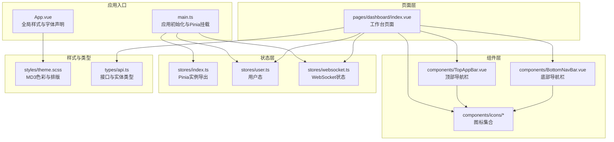
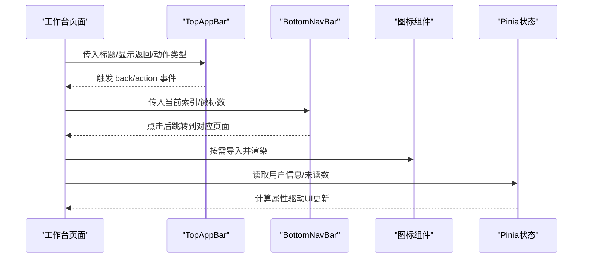
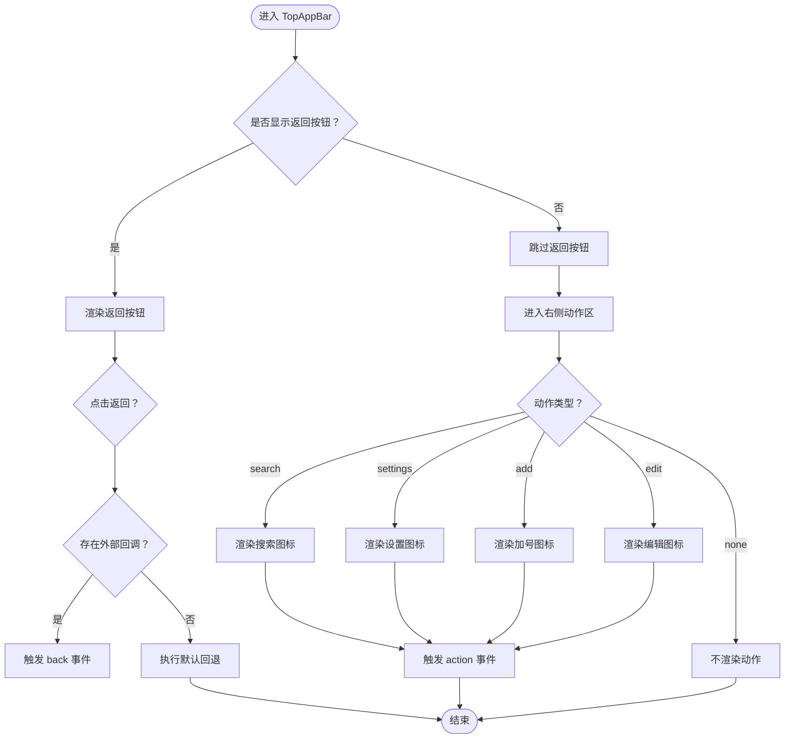
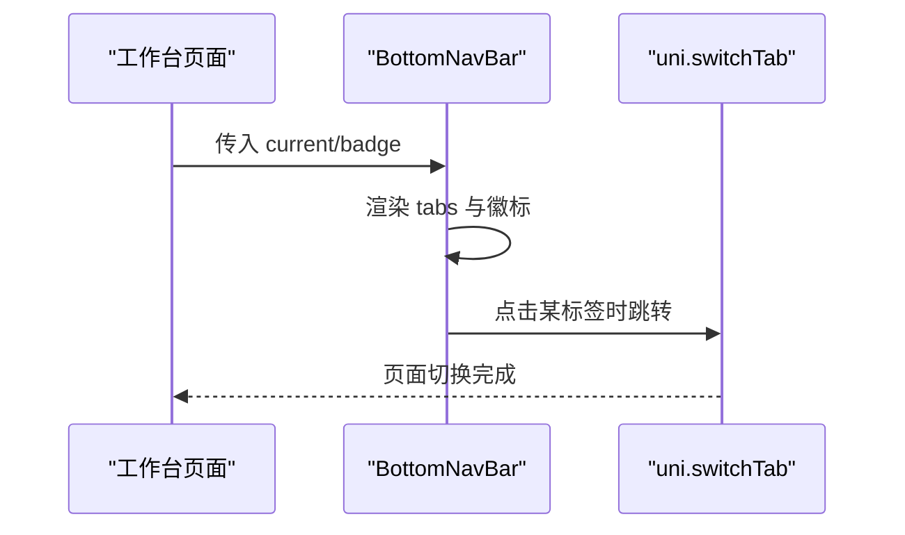
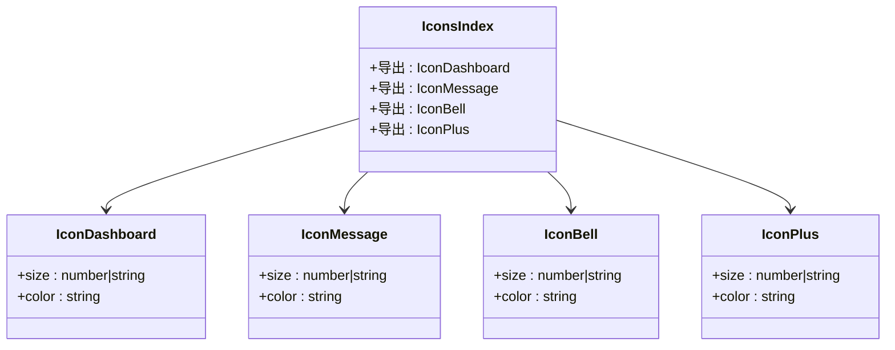
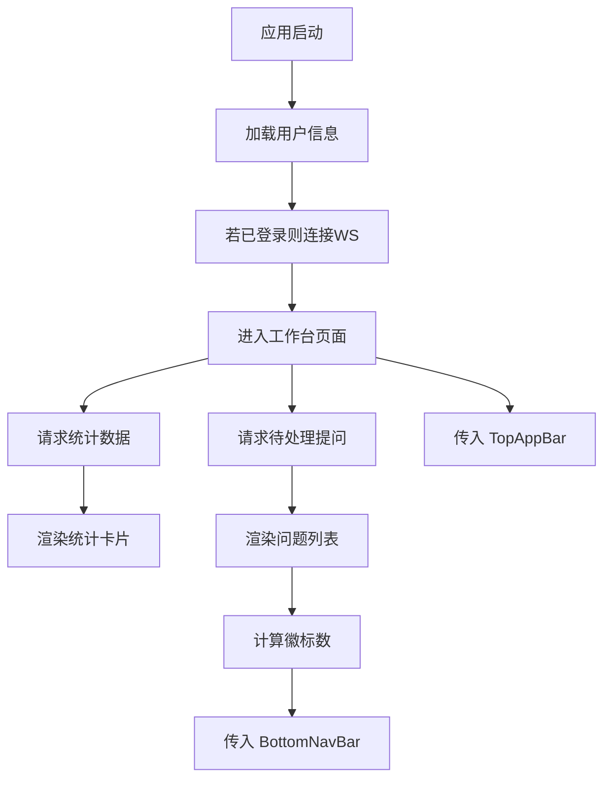
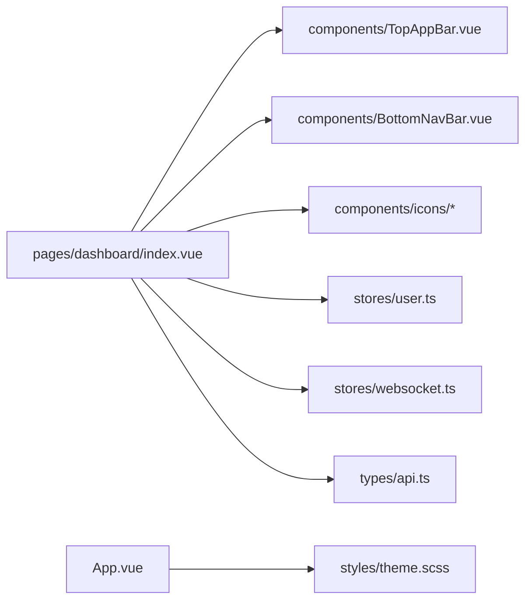

# 组件库与自定义组件

<cite>
**本文引用的文件**
- [apps/teacher-app/src/components/TopAppBar.vue](file://apps/teacher-app/src/components/TopAppBar.vue)
- [apps/teacher-app/src/components/BottomNavBar.vue](file://apps/teacher-app/src/components/BottomNavBar.vue)
- [apps/teacher-app/src/components/icons/index.ts](file://apps/teacher-app/src/components/icons/index.ts)
- [apps/teacher-app/src/components/icons/IconDashboard.vue](file://apps/teacher-app/src/components/icons/IconDashboard.vue)
- [apps/teacher-app/src/components/icons/IconMessage.vue](file://apps/teacher-app/src/components/icons/IconMessage.vue)
- [apps/teacher-app/src/components/icons/IconBell.vue](file://apps/teacher-app/src/components/icons/IconBell.vue)
- [apps/teacher-app/src/components/icons/IconPlus.vue](file://apps/teacher-app/src/components/icons/IconPlus.vue)
- [apps/teacher-app/src/App.vue](file://apps/teacher-app/src/App.vue)
- [apps/teacher-app/src/pages/dashboard/index.vue](file://apps/teacher-app/src/pages/dashboard/index.vue)
- [apps/teacher-app/src/stores/index.ts](file://apps/teacher-app/src/stores/index.ts)
- [apps/teacher-app/src/stores/user.ts](file://apps/teacher-app/src/stores/user.ts)
- [apps/teacher-app/src/stores/websocket.ts](file://apps/teacher-app/src/stores/websocket.ts)
- [apps/teacher-app/src/styles/theme.scss](file://apps/teacher-app/src/styles/theme.scss)
- [apps/teacher-app/src/types/api.ts](file://apps/teacher-app/src/types/api.ts)
- [apps/teacher-app/src/main.ts](file://apps/teacher-app/src/main.ts)
</cite>

## 目录
1. [引言](#引言)
2. [项目结构](#项目结构)
3. [核心组件](#核心组件)
4. [架构总览](#架构总览)
5. [组件详解](#组件详解)
6. [依赖关系分析](#依赖关系分析)
7. [性能考量](#性能考量)
8. [故障排查指南](#故障排查指南)
9. [结论](#结论)
10. [附录](#附录)

## 引言
本文件面向“医小管 v2 教师端”的前端组件体系，系统性梳理并说明顶部导航栏、底部导航栏及图标组件库的设计与实现；阐述组件属性、事件、插槽与样式定制方式；给出组件复用与性能优化建议；明确组件与状态管理的集成路径与数据传递机制；并提供测试策略与文档规范建议。

## 项目结构
教师端采用基于 Vue 3 + Pinia 的小程序框架（UniApp）工程组织方式，页面级组件位于 pages 目录，通用业务组件位于 components 目录，全局样式与主题变量位于 styles 目录，状态管理位于 stores 目录，类型定义位于 types 目录。

图表来源
- [apps/teacher-app/src/main.ts:1-25](file://apps/teacher-app/src/main.ts#L1-L25)
- [apps/teacher-app/src/App.vue:1-56](file://apps/teacher-app/src/App.vue#L1-L56)
- [apps/teacher-app/src/pages/dashboard/index.vue:1-669](file://apps/teacher-app/src/pages/dashboard/index.vue#L1-L669)
- [apps/teacher-app/src/components/TopAppBar.vue:1-160](file://apps/teacher-app/src/components/TopAppBar.vue#L1-L160)
- [apps/teacher-app/src/components/BottomNavBar.vue:1-147](file://apps/teacher-app/src/components/BottomNavBar.vue#L1-L147)
- [apps/teacher-app/src/components/icons/index.ts:1-28](file://apps/teacher-app/src/components/icons/index.ts#L1-L28)
- [apps/teacher-app/src/stores/index.ts:1-7](file://apps/teacher-app/src/stores/index.ts#L1-L7)
- [apps/teacher-app/src/stores/user.ts:1-63](file://apps/teacher-app/src/stores/user.ts#L1-L63)
- [apps/teacher-app/src/stores/websocket.ts:1-32](file://apps/teacher-app/src/stores/websocket.ts#L1-L32)
- [apps/teacher-app/src/styles/theme.scss:1-88](file://apps/teacher-app/src/styles/theme.scss#L1-L88)
- [apps/teacher-app/src/types/api.ts:1-51](file://apps/teacher-app/src/types/api.ts#L1-L51)

章节来源
- [apps/teacher-app/src/main.ts:1-25](file://apps/teacher-app/src/main.ts#L1-L25)
- [apps/teacher-app/src/App.vue:1-56](file://apps/teacher-app/src/App.vue#L1-L56)

## 核心组件
- 顶部导航栏 TopAppBar：支持标题、返回按钮、右侧动作区（搜索、设置、加号、编辑），统一的视觉与交互风格。
- 底部导航栏 BottomNavBar：固定在底部，包含四个标签页，支持徽标提醒与当前项高亮。
- 图标组件库：通过集中导出的 index 文件统一引入，所有图标为轻量 SVG 组件，支持 size 与 color 透传。

章节来源
- [apps/teacher-app/src/components/TopAppBar.vue:48-85](file://apps/teacher-app/src/components/TopAppBar.vue#L48-L85)
- [apps/teacher-app/src/components/BottomNavBar.vue:33-61](file://apps/teacher-app/src/components/BottomNavBar.vue#L33-L61)
- [apps/teacher-app/src/components/icons/index.ts:1-28](file://apps/teacher-app/src/components/icons/index.ts#L1-L28)

## 架构总览
组件与页面通过 props 与 emits 进行数据与事件传递；页面通过 Pinia 获取用户态与 WebSocket 状态；图标组件以组合式导入的方式在页面与组件内复用；全局样式通过 SCSS 变量与主题文件统一管理。

图表来源
- [apps/teacher-app/src/pages/dashboard/index.vue:138-252](file://apps/teacher-app/src/pages/dashboard/index.vue#L138-L252)
- [apps/teacher-app/src/components/TopAppBar.vue:48-85](file://apps/teacher-app/src/components/TopAppBar.vue#L48-L85)
- [apps/teacher-app/src/components/BottomNavBar.vue:33-61](file://apps/teacher-app/src/components/BottomNavBar.vue#L33-L61)
- [apps/teacher-app/src/stores/user.ts:8-62](file://apps/teacher-app/src/stores/user.ts#L8-L62)
- [apps/teacher-app/src/stores/websocket.ts:5-31](file://apps/teacher-app/src/stores/websocket.ts#L5-L31)

## 组件详解

### 顶部导航栏 TopAppBar
- 设计要点
  - 固定定位，前后左右留白，标题居中，右侧动作区可选。
  - 支持显示返回按钮，优先触发外部回调，否则回退到默认导航行为。
  - 动作区支持多种类型，分别映射不同图标与语义。
- 属性定义
  - title: string，标题文本
  - showBack?: boolean，默认 false，是否显示返回按钮
  - action?: 'search' | 'settings' | 'add' | 'edit' | 'none'，右侧动作类型
- 事件
  - back: 返回按钮点击时触发
  - action: 右侧动作按钮点击时触发
- 插槽
  - 未提供具名/作用域插槽，通过 action 类型与 attrs 控制行为
- 样式定制
  - 通过 SCSS 变量控制背景、模糊、文字与图标颜色
  - 按压态使用容器低色阶背景提升反馈
- 使用示例（路径）
  - [apps/teacher-app/src/pages/dashboard/index.vue:4-15](file://apps/teacher-app/src/pages/dashboard/index.vue#L4-L15)

图表来源
- [apps/teacher-app/src/components/TopAppBar.vue:1-160](file://apps/teacher-app/src/components/TopAppBar.vue#L1-L160)

章节来源
- [apps/teacher-app/src/components/TopAppBar.vue:48-85](file://apps/teacher-app/src/components/TopAppBar.vue#L48-L85)
- [apps/teacher-app/src/pages/dashboard/index.vue:4-15](file://apps/teacher-app/src/pages/dashboard/index.vue#L4-L15)

### 底部导航栏 BottomNavBar
- 设计要点
  - 固定在底部，四标签页，当前项高亮与下划点提示
  - 中间标签支持徽标数字（上限展示“99+”）
  - 通过 uni.switchTab 切换页面
- 属性定义
  - current: number，默认 0，当前激活索引
  - badge?: number，默认 0，中间标签徽标数
- 事件
  - 通过内部点击处理直接触发页面切换，未向外抛出事件
- 插槽
  - 未提供插槽
- 样式定制
  - 通过 SCSS 变量控制背景、模糊、阴影、文字与图标颜色
  - 当前项强调主色，非当前项弱化透明度
- 使用示例（路径）
  - [apps/teacher-app/src/pages/dashboard/index.vue:134](file://apps/teacher-app/src/pages/dashboard/index.vue#L134)

图表来源
- [apps/teacher-app/src/components/BottomNavBar.vue:33-61](file://apps/teacher-app/src/components/BottomNavBar.vue#L33-L61)
- [apps/teacher-app/src/pages/dashboard/index.vue:134](file://apps/teacher-app/src/pages/dashboard/index.vue#L134)

章节来源
- [apps/teacher-app/src/components/BottomNavBar.vue:33-61](file://apps/teacher-app/src/components/BottomNavBar.vue#L33-L61)
- [apps/teacher-app/src/pages/dashboard/index.vue:134](file://apps/teacher-app/src/pages/dashboard/index.vue#L134)

### 图标组件库
- 导出方式
  - 通过集中导出文件统一暴露各图标组件，便于按需导入与批量维护
- 单个图标设计
  - 采用 SVG，支持 size 与 color 透传，默认使用当前文本色
- 扩展方式
  - 新增图标：新增 SVG 组件 → 在 index.ts 中注册导出
  - 使用方式：在页面或组件中按需导入并传入 size/color
- 典型图标示例（路径）
  - [apps/teacher-app/src/components/icons/IconDashboard.vue:1-17](file://apps/teacher-app/src/components/icons/IconDashboard.vue#L1-L17)
  - [apps/teacher-app/src/components/icons/IconMessage.vue:1-17](file://apps/teacher-app/src/components/icons/IconMessage.vue#L1-L17)
  - [apps/teacher-app/src/components/icons/IconBell.vue:1-17](file://apps/teacher-app/src/components/icons/IconBell.vue#L1-L17)
  - [apps/teacher-app/src/components/icons/IconPlus.vue:1-17](file://apps/teacher-app/src/components/icons/IconPlus.vue#L1-L17)

图表来源
- [apps/teacher-app/src/components/icons/index.ts:1-28](file://apps/teacher-app/src/components/icons/index.ts#L1-L28)
- [apps/teacher-app/src/components/icons/IconDashboard.vue:8-16](file://apps/teacher-app/src/components/icons/IconDashboard.vue#L8-L16)
- [apps/teacher-app/src/components/icons/IconMessage.vue:8-16](file://apps/teacher-app/src/components/icons/IconMessage.vue#L8-L16)
- [apps/teacher-app/src/components/icons/IconBell.vue:8-16](file://apps/teacher-app/src/components/icons/IconBell.vue#L8-L16)
- [apps/teacher-app/src/components/icons/IconPlus.vue:8-16](file://apps/teacher-app/src/components/icons/IconPlus.vue#L8-L16)

章节来源
- [apps/teacher-app/src/components/icons/index.ts:1-28](file://apps/teacher-app/src/components/icons/index.ts#L1-L28)
- [apps/teacher-app/src/components/icons/IconDashboard.vue:1-17](file://apps/teacher-app/src/components/icons/IconDashboard.vue#L1-L17)
- [apps/teacher-app/src/components/icons/IconMessage.vue:1-17](file://apps/teacher-app/src/components/icons/IconMessage.vue#L1-L17)
- [apps/teacher-app/src/components/icons/IconBell.vue:1-17](file://apps/teacher-app/src/components/icons/IconBell.vue#L1-L17)
- [apps/teacher-app/src/components/icons/IconPlus.vue:1-17](file://apps/teacher-app/src/components/icons/IconPlus.vue#L1-L17)

### 页面与组件的数据流
- 工作台页面负责：
  - 读取用户显示名与状态计算属性
  - 请求统计数据与待处理提问列表
  - 将待处理数量作为徽标传给底部导航栏
  - 在顶部导航栏右侧渲染通知与徽标
- 数据来源与状态：
  - 用户信息来自 Pinia 用户存储
  - 未读数来自 WebSocket 存储
  - 主题色与排版来自全局样式变量

图表来源
- [apps/teacher-app/src/main.ts:9-19](file://apps/teacher-app/src/main.ts#L9-L19)
- [apps/teacher-app/src/pages/dashboard/index.vue:138-252](file://apps/teacher-app/src/pages/dashboard/index.vue#L138-L252)
- [apps/teacher-app/src/stores/user.ts:19-28](file://apps/teacher-app/src/stores/user.ts#L19-L28)
- [apps/teacher-app/src/stores/websocket.ts:9-14](file://apps/teacher-app/src/stores/websocket.ts#L9-L14)

章节来源
- [apps/teacher-app/src/pages/dashboard/index.vue:138-252](file://apps/teacher-app/src/pages/dashboard/index.vue#L138-L252)
- [apps/teacher-app/src/stores/user.ts:8-62](file://apps/teacher-app/src/stores/user.ts#L8-L62)
- [apps/teacher-app/src/stores/websocket.ts:5-31](file://apps/teacher-app/src/stores/websocket.ts#L5-L31)
- [apps/teacher-app/src/main.ts:9-19](file://apps/teacher-app/src/main.ts#L9-L19)

## 依赖关系分析
- 组件依赖
  - TopAppBar 依赖图标子组件，通过 props 透传尺寸与颜色
  - BottomNavBar 内置图标组件并根据当前项动态切换颜色与描边宽度
- 页面依赖
  - 工作台页面同时依赖 TopAppBar、BottomNavBar 与多个图标组件
  - 页面依赖 Pinia 用户与 WebSocket 存储进行状态读取
- 样式依赖
  - 全局样式通过 App.vue 引入，主题变量在 theme.scss 中集中定义
- 类型依赖
  - 接口类型用于 API 请求与状态字段约束

图表来源
- [apps/teacher-app/src/pages/dashboard/index.vue:138-252](file://apps/teacher-app/src/pages/dashboard/index.vue#L138-L252)
- [apps/teacher-app/src/components/TopAppBar.vue:48-85](file://apps/teacher-app/src/components/TopAppBar.vue#L48-L85)
- [apps/teacher-app/src/components/BottomNavBar.vue:33-61](file://apps/teacher-app/src/components/BottomNavBar.vue#L33-L61)
- [apps/teacher-app/src/App.vue:15-56](file://apps/teacher-app/src/App.vue#L15-L56)
- [apps/teacher-app/src/styles/theme.scss:1-88](file://apps/teacher-app/src/styles/theme.scss#L1-L88)
- [apps/teacher-app/src/types/api.ts:1-51](file://apps/teacher-app/src/types/api.ts#L1-L51)

章节来源
- [apps/teacher-app/src/pages/dashboard/index.vue:138-252](file://apps/teacher-app/src/pages/dashboard/index.vue#L138-L252)
- [apps/teacher-app/src/App.vue:15-56](file://apps/teacher-app/src/App.vue#L15-L56)
- [apps/teacher-app/src/styles/theme.scss:1-88](file://apps/teacher-app/src/styles/theme.scss#L1-L88)
- [apps/teacher-app/src/types/api.ts:1-51](file://apps/teacher-app/src/types/api.ts#L1-L51)

## 性能考量
- 组件渲染
  - 图标组件为纯 SVG，避免额外资源请求；通过 props 透传尺寸与颜色，减少重复样式定义
  - BottomNavBar 使用固定布局与 backdrop-filter，注意在低端设备上的性能影响
- 状态更新
  - 用户与 WebSocket 状态通过 Pinia 计算属性驱动，避免不必要的重渲染
- 页面生命周期
  - 工作台页面在 onShow 时刷新数据，减少后台切换带来的数据陈旧
- 优化建议
  - 对频繁更新的徽标与列表采用浅比较与稳定 key
  - 图标尺寸与颜色尽量复用主题变量，减少运行时计算
  - 避免在渲染循环中进行复杂计算，将逻辑前置到 store 或工具函数

## 故障排查指南
- 顶部导航栏点击无效
  - 检查是否正确绑定事件与回调；若未传入外部回调，将走默认回退逻辑
  - 参考路径：[apps/teacher-app/src/components/TopAppBar.vue:74-84](file://apps/teacher-app/src/components/TopAppBar.vue#L74-L84)
- 底部导航无法切换页面
  - 检查 tab.path 是否正确；确认 uni.switchTab 调用时机
  - 参考路径：[apps/teacher-app/src/components/BottomNavBar.vue:57-60](file://apps/teacher-app/src/components/BottomNavBar.vue#L57-L60)
- 图标颜色/尺寸异常
  - 确认传入的 size 与 color 合法；检查主题变量覆盖情况
  - 参考路径：[apps/teacher-app/src/components/icons/IconDashboard.vue:8-16](file://apps/teacher-app/src/components/icons/IconDashboard.vue#L8-L16)
- 登录后未自动连接 WebSocket
  - 检查用户 token 是否持久化成功；确认 main.ts 中初始化流程
  - 参考路径：[apps/teacher-app/src/main.ts:9-19](file://apps/teacher-app/src/main.ts#L9-L19)
- 页面主题色不生效
  - 检查 App.vue 是否正确引入全局样式；确认 theme.scss 变量定义
  - 参考路径：[apps/teacher-app/src/App.vue:15-56](file://apps/teacher-app/src/App.vue#L15-L56), [apps/teacher-app/src/styles/theme.scss:1-88](file://apps/teacher-app/src/styles/theme.scss#L1-L88)

章节来源
- [apps/teacher-app/src/components/TopAppBar.vue:74-84](file://apps/teacher-app/src/components/TopAppBar.vue#L74-L84)
- [apps/teacher-app/src/components/BottomNavBar.vue:57-60](file://apps/teacher-app/src/components/BottomNavBar.vue#L57-L60)
- [apps/teacher-app/src/components/icons/IconDashboard.vue:8-16](file://apps/teacher-app/src/components/icons/IconDashboard.vue#L8-L16)
- [apps/teacher-app/src/main.ts:9-19](file://apps/teacher-app/src/main.ts#L9-L19)
- [apps/teacher-app/src/App.vue:15-56](file://apps/teacher-app/src/App.vue#L15-L56)
- [apps/teacher-app/src/styles/theme.scss:1-88](file://apps/teacher-app/src/styles/theme.scss#L1-L88)

## 结论
教师端组件库以简洁的 TopAppBar 与 BottomNavBar 为核心，配合统一的图标库与主题系统，实现了高复用与一致性的 UI 体验。通过 Pinia 管理用户与 WebSocket 状态，页面以组合式 API 驱动数据流。遵循本文的属性/事件/样式与性能建议，可进一步提升组件稳定性与可维护性。

## 附录

### 组件属性与事件速查
- TopAppBar
  - 属性：title, showBack?, action?
  - 事件：back, action
- BottomNavBar
  - 属性：current, badge?
  - 行为：点击后切换页面

章节来源
- [apps/teacher-app/src/components/TopAppBar.vue:56-72](file://apps/teacher-app/src/components/TopAppBar.vue#L56-L72)
- [apps/teacher-app/src/components/BottomNavBar.vue:40-60](file://apps/teacher-app/src/components/BottomNavBar.vue#L40-L60)

### 组件复用最佳实践
- 将通用 UI 抽象为独立组件，避免页面内重复逻辑
- 通过 props 明确输入，通过 emits 明确输出，保持组件边界清晰
- 使用集中导出的图标库，统一管理图标的尺寸与颜色

### 测试策略与文档规范
- 单元测试
  - 对组件 props 校验与事件发射进行断言
  - 对 store 的 getter 与 action 进行隔离测试
- 端到端测试
  - 覆盖页面生命周期与导航切换流程
- 文档规范
  - 组件 README 包含：用途、属性、事件、插槽、样式变量、示例与注意事项
  - 类型定义与 API 文档保持同步