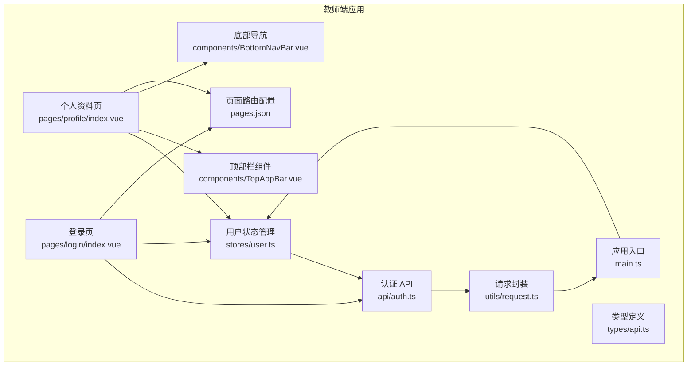
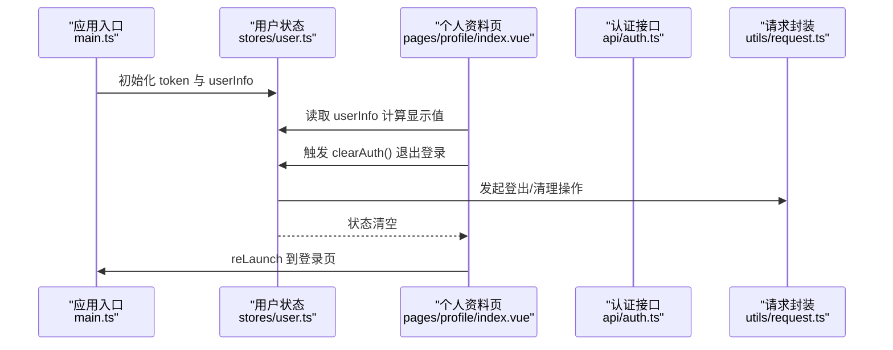
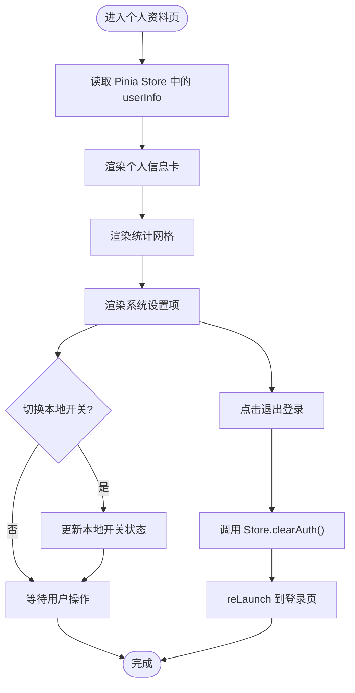
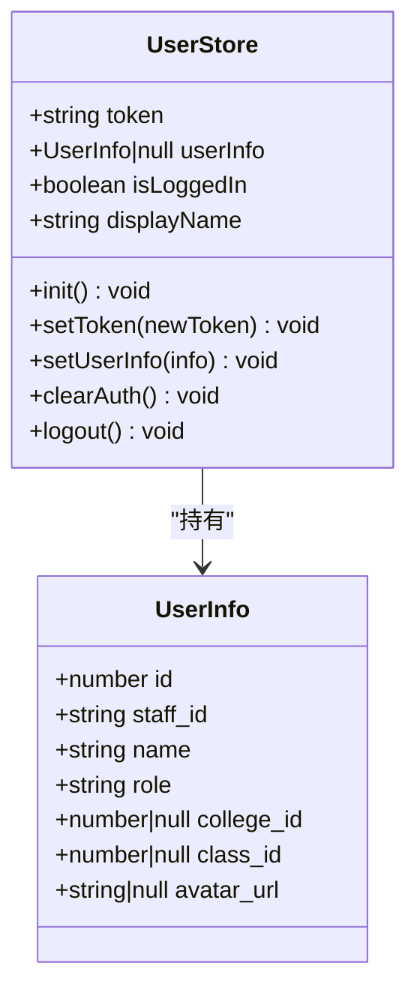
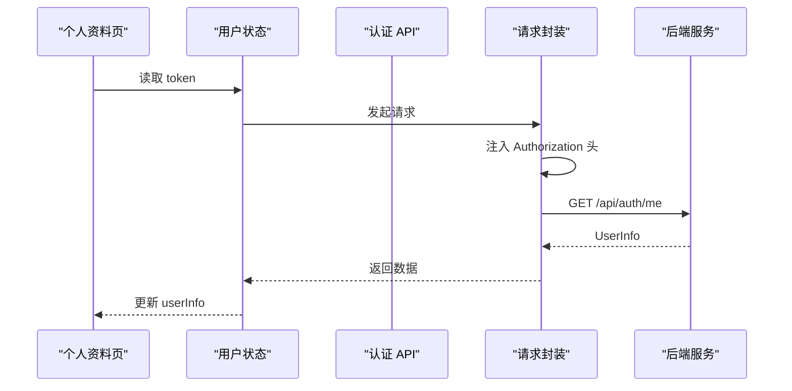
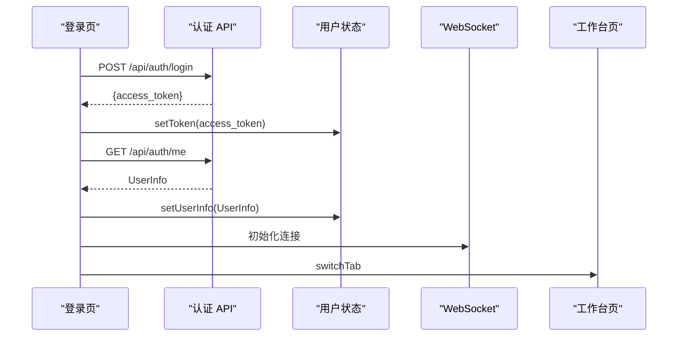
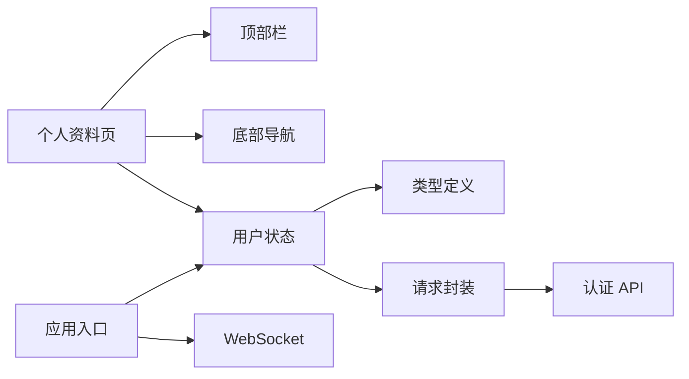

# 个人资料页面

<cite>
**本文引用的文件**
- [apps/teacher-app/src/pages/profile/index.vue](file://apps/teacher-app/src/pages/profile/index.vue)
- [apps/teacher-app/src/stores/user.ts](file://apps/teacher-app/src/stores/user.ts)
- [apps/teacher-app/src/api/auth.ts](file://apps/teacher-app/src/api/auth.ts)
- [apps/teacher-app/src/utils/request.ts](file://apps/teacher-app/src/utils/request.ts)
- [apps/teacher-app/src/types/api.ts](file://apps/teacher-app/src/types/api.ts)
- [apps/teacher-app/src/components/TopAppBar.vue](file://apps/teacher-app/src/components/TopAppBar.vue)
- [apps/teacher-app/src/components/BottomNavBar.vue](file://apps/teacher-app/src/components/BottomNavBar.vue)
- [apps/teacher-app/src/components/icons/IconUser.vue](file://apps/teacher-app/src/components/icons/IconUser.vue)
- [apps/teacher-app/src/pages/login/index.vue](file://apps/teacher-app/src/pages/login/index.vue)
- [apps/teacher-app/src/pages.json](file://apps/teacher-app/src/pages.json)
- [apps/teacher-app/src/main.ts](file://apps/teacher-app/src/main.ts)
</cite>

## 目录
1. [简介](#简介)
2. [项目结构](#项目结构)
3. [核心组件](#核心组件)
4. [架构总览](#架构总览)
5. [详细组件分析](#详细组件分析)
6. [依赖关系分析](#依赖关系分析)
7. [性能考虑](#性能考虑)
8. [故障排查指南](#故障排查指南)
9. [结论](#结论)
10. [附录](#附录)

## 简介
本文件针对“医小管 v2 教师端个人资料页面”进行系统化技术文档梳理，重点覆盖以下方面：
- 个人信息查看与展示：基于 Pinia 状态管理的用户信息读取与显示逻辑
- 头像上传与修改：当前页面未实现头像上传功能，但可结合后端接口与存储策略扩展
- 密码修改：当前页面未提供密码修改入口，可在现有认证体系基础上扩展
- 账号设置：包含通知提醒、声音提示、AI 自动回复等系统设置项
- 数据绑定机制：使用 Vue 3 的组合式 API 与 Pinia 计算属性实现双向数据绑定
- 表单验证规则：登录页提供基础输入校验，可迁移至个人资料编辑场景
- 数据提交流程与错误处理：统一请求封装与 401 自动登出机制
- 安全保护与隐私设置：基于 JWT Token 的鉴权与本地持久化策略
- 界面设计规范与用户体验：顶部栏、底部导航、动画与交互反馈
- 数据一致性保证：Pinia Store 同步到本地缓存，应用启动时初始化

## 项目结构
教师端采用多页面架构，个人资料页面位于 pages/profile/index.vue，配合全局状态管理、API 封装与主题样式。

图表来源
- [apps/teacher-app/src/pages/profile/index.vue:1-142](file://apps/teacher-app/src/pages/profile/index.vue#L1-L142)
- [apps/teacher-app/src/stores/user.ts:1-63](file://apps/teacher-app/src/stores/user.ts#L1-L63)
- [apps/teacher-app/src/api/auth.ts:1-43](file://apps/teacher-app/src/api/auth.ts#L1-L43)
- [apps/teacher-app/src/utils/request.ts:1-108](file://apps/teacher-app/src/utils/request.ts#L1-L108)
- [apps/teacher-app/src/types/api.ts:1-51](file://apps/teacher-app/src/types/api.ts#L1-L51)
- [apps/teacher-app/src/components/TopAppBar.vue:1-160](file://apps/teacher-app/src/components/TopAppBar.vue#L1-L160)
- [apps/teacher-app/src/components/BottomNavBar.vue:1-147](file://apps/teacher-app/src/components/BottomNavBar.vue#L1-L147)
- [apps/teacher-app/src/pages/login/index.vue:1-200](file://apps/teacher-app/src/pages/login/index.vue#L1-L200)
- [apps/teacher-app/src/pages.json:1-84](file://apps/teacher-app/src/pages.json#L1-L84)
- [apps/teacher-app/src/main.ts:1-25](file://apps/teacher-app/src/main.ts#L1-L25)

章节来源
- [apps/teacher-app/src/pages/profile/index.vue:1-142](file://apps/teacher-app/src/pages/profile/index.vue#L1-L142)
- [apps/teacher-app/src/pages.json:1-84](file://apps/teacher-app/src/pages.json#L1-L84)

## 核心组件
- 个人资料页：负责展示用户基本信息、统计卡片与系统设置项；当前版本未实现头像上传与密码修改入口
- 用户状态管理（Pinia）：提供 token、userInfo 的持久化与清理能力；支持初始化与登出
- 认证 API：提供登录与获取当前用户信息的接口定义
- 请求封装：统一注入 Authorization 头、处理 401 自动登出、Toast 错误提示
- 类型定义：UserInfo 接口描述后端返回字段
- 顶部栏与底部导航：提供一致的导航体验与图标组件

章节来源
- [apps/teacher-app/src/pages/profile/index.vue:144-169](file://apps/teacher-app/src/pages/profile/index.vue#L144-L169)
- [apps/teacher-app/src/stores/user.ts:1-63](file://apps/teacher-app/src/stores/user.ts#L1-L63)
- [apps/teacher-app/src/api/auth.ts:1-43](file://apps/teacher-app/src/api/auth.ts#L1-L43)
- [apps/teacher-app/src/utils/request.ts:1-108](file://apps/teacher-app/src/utils/request.ts#L1-L108)
- [apps/teacher-app/src/types/api.ts:1-51](file://apps/teacher-app/src/types/api.ts#L1-L51)
- [apps/teacher-app/src/components/TopAppBar.vue:1-160](file://apps/teacher-app/src/components/TopAppBar.vue#L1-L160)
- [apps/teacher-app/src/components/BottomNavBar.vue:1-147](file://apps/teacher-app/src/components/BottomNavBar.vue#L1-L147)

## 架构总览
个人资料页面的数据流从 Pinia Store 读取用户信息，通过计算属性在模板中渲染；系统设置项为本地状态，退出登录时调用 Store 清理逻辑并跳转登录页。

图表来源
- [apps/teacher-app/src/main.ts:1-25](file://apps/teacher-app/src/main.ts#L1-L25)
- [apps/teacher-app/src/stores/user.ts:40-47](file://apps/teacher-app/src/stores/user.ts#L40-L47)
- [apps/teacher-app/src/pages/profile/index.vue:164-168](file://apps/teacher-app/src/pages/profile/index.vue#L164-L168)
- [apps/teacher-app/src/api/auth.ts:37-42](file://apps/teacher-app/src/api/auth.ts#L37-L42)
- [apps/teacher-app/src/utils/request.ts:42-48](file://apps/teacher-app/src/utils/request.ts#L42-L48)

## 详细组件分析

### 个人资料页（Profile）
- 个人信息卡：姓名、职称/院系、工号标签，均来自 userInfo 的计算属性
- 统计网格：展示累计处理、本月审批、知识入库等统计项（静态示例）
- 系统设置：
  - 通知提醒、声音提示、AI 自动回复：本地开关状态，未与后端同步
  - 修改密码：当前页面未提供入口
  - 关于我们：当前页面未提供入口
  - 退出登录：调用 Store.clearAuth() 并跳转登录页
- 顶部栏与底部导航：提供一致的标题与导航体验

图表来源
- [apps/teacher-app/src/pages/profile/index.vue:144-169](file://apps/teacher-app/src/pages/profile/index.vue#L144-L169)
- [apps/teacher-app/src/stores/user.ts:40-47](file://apps/teacher-app/src/stores/user.ts#L40-L47)

章节来源
- [apps/teacher-app/src/pages/profile/index.vue:1-142](file://apps/teacher-app/src/pages/profile/index.vue#L1-L142)
- [apps/teacher-app/src/components/TopAppBar.vue:1-160](file://apps/teacher-app/src/components/TopAppBar.vue#L1-L160)
- [apps/teacher-app/src/components/BottomNavBar.vue:1-147](file://apps/teacher-app/src/components/BottomNavBar.vue#L1-L147)

### 用户状态管理（Pinia）
- 状态：token、userInfo
- 计算属性：isLoggedIn、displayName
- 动作：init（从本地缓存恢复）、setToken、setUserInfo、clearAuth/logout
- 本地持久化：使用 uni.setStorageSync 存储 token 与 userInfo

图表来源
- [apps/teacher-app/src/stores/user.ts:1-63](file://apps/teacher-app/src/stores/user.ts#L1-L63)
- [apps/teacher-app/src/types/api.ts:4-12](file://apps/teacher-app/src/types/api.ts#L4-L12)

章节来源
- [apps/teacher-app/src/stores/user.ts:1-63](file://apps/teacher-app/src/stores/user.ts#L1-L63)
- [apps/teacher-app/src/types/api.ts:1-51](file://apps/teacher-app/src/types/api.ts#L1-L51)

### 认证 API 与请求封装
- 认证 API：login、getUserInfo 的接口定义与响应类型
- 请求封装：统一注入 Authorization 头、处理 401 自动登出、HTTP 错误提示
- 类型定义：UserInfo 接口与分页结果类型

图表来源
- [apps/teacher-app/src/api/auth.ts:37-42](file://apps/teacher-app/src/api/auth.ts#L37-L42)
- [apps/teacher-app/src/utils/request.ts:67-73](file://apps/teacher-app/src/utils/request.ts#L67-L73)
- [apps/teacher-app/src/stores/user.ts:35-38](file://apps/teacher-app/src/stores/user.ts#L35-L38)

章节来源
- [apps/teacher-app/src/api/auth.ts:1-43](file://apps/teacher-app/src/api/auth.ts#L1-L43)
- [apps/teacher-app/src/utils/request.ts:1-108](file://apps/teacher-app/src/utils/request.ts#L1-L108)
- [apps/teacher-app/src/types/api.ts:1-51](file://apps/teacher-app/src/types/api.ts#L1-L51)

### 登录流程（参考）
虽然个人资料页不负责登录，但登录流程与用户信息获取对个人资料页至关重要。登录成功后写入 token 与 userInfo，并建立 WebSocket 连接。

图表来源
- [apps/teacher-app/src/pages/login/index.vue:164-191](file://apps/teacher-app/src/pages/login/index.vue#L164-L191)
- [apps/teacher-app/src/api/auth.ts:27-42](file://apps/teacher-app/src/api/auth.ts#L27-L42)
- [apps/teacher-app/src/stores/user.ts:30-38](file://apps/teacher-app/src/stores/user.ts#L30-L38)

章节来源
- [apps/teacher-app/src/pages/login/index.vue:1-200](file://apps/teacher-app/src/pages/login/index.vue#L1-L200)
- [apps/teacher-app/src/api/auth.ts:1-43](file://apps/teacher-app/src/api/auth.ts#L1-L43)
- [apps/teacher-app/src/stores/user.ts:1-63](file://apps/teacher-app/src/stores/user.ts#L1-L63)

## 依赖关系分析
- 页面依赖：个人资料页依赖顶部栏、底部导航、用户状态管理
- 状态依赖：用户状态管理依赖类型定义与本地存储
- 网络依赖：认证 API 依赖请求封装与后端服务
- 应用生命周期：应用入口在启动时初始化用户状态与 WebSocket

图表来源
- [apps/teacher-app/src/pages/profile/index.vue:144-169](file://apps/teacher-app/src/pages/profile/index.vue#L144-L169)
- [apps/teacher-app/src/stores/user.ts:1-63](file://apps/teacher-app/src/stores/user.ts#L1-L63)
- [apps/teacher-app/src/utils/request.ts:1-108](file://apps/teacher-app/src/utils/request.ts#L1-L108)
- [apps/teacher-app/src/api/auth.ts:1-43](file://apps/teacher-app/src/api/auth.ts#L1-L43)
- [apps/teacher-app/src/main.ts:1-25](file://apps/teacher-app/src/main.ts#L1-L25)

章节来源
- [apps/teacher-app/src/pages/profile/index.vue:1-142](file://apps/teacher-app/src/pages/profile/index.vue#L1-L142)
- [apps/teacher-app/src/stores/user.ts:1-63](file://apps/teacher-app/src/stores/user.ts#L1-L63)
- [apps/teacher-app/src/utils/request.ts:1-108](file://apps/teacher-app/src/utils/request.ts#L1-L108)
- [apps/teacher-app/src/api/auth.ts:1-43](file://apps/teacher-app/src/api/auth.ts#L1-L43)
- [apps/teacher-app/src/main.ts:1-25](file://apps/teacher-app/src/main.ts#L1-L25)

## 性能考虑
- 数据绑定：使用 computed 与 ref 减少不必要的重渲染
- 本地持久化：通过 uni.setStorageSync 缓存 token 与 userInfo，减少重复登录
- 请求复用：统一请求封装避免重复代码与错误处理遗漏
- 动画与布局：使用 SCSS 变量与固定布局提升渲染性能

## 故障排查指南
- 登录过期自动登出：当后端返回 401 时，统一请求封装会清理用户状态并跳转登录页
- 网络异常：请求封装统一 Toast 提示“网络连接失败”，便于快速定位问题
- 本地缓存异常：用户状态初始化 try/catch 包裹，避免异常阻断应用启动
- 退出登录：确认 clearAuth 是否正确移除本地存储并触发页面跳转

章节来源
- [apps/teacher-app/src/utils/request.ts:42-48](file://apps/teacher-app/src/utils/request.ts#L42-L48)
- [apps/teacher-app/src/stores/user.ts:19-28](file://apps/teacher-app/src/stores/user.ts#L19-L28)
- [apps/teacher-app/src/stores/user.ts:40-47](file://apps/teacher-app/src/stores/user.ts#L40-L47)
- [apps/teacher-app/src/pages/profile/index.vue:164-168](file://apps/teacher-app/src/pages/profile/index.vue#L164-L168)

## 结论
个人资料页面当前聚焦于信息展示与系统设置入口，具备良好的数据绑定与状态管理基础。后续可在现有架构上扩展头像上传与密码修改功能，同时完善设置项的后端同步与权限控制，以满足更完整的教师端个人资料管理需求。

## 附录
- 页面路由配置：确认个人资料页路径与标题
- 图标组件：如需头像占位图标，可参考 IconUser 组件

章节来源
- [apps/teacher-app/src/pages.json:31-37](file://apps/teacher-app/src/pages.json#L31-L37)
- [apps/teacher-app/src/components/icons/IconUser.vue:1-17](file://apps/teacher-app/src/components/icons/IconUser.vue#L1-L17)