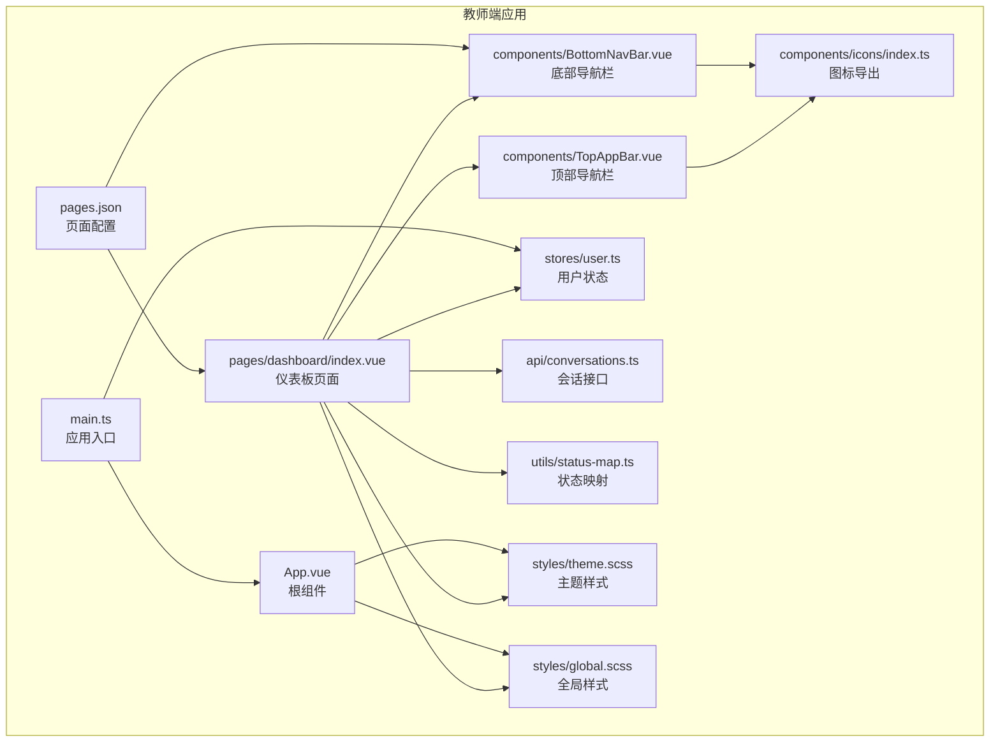
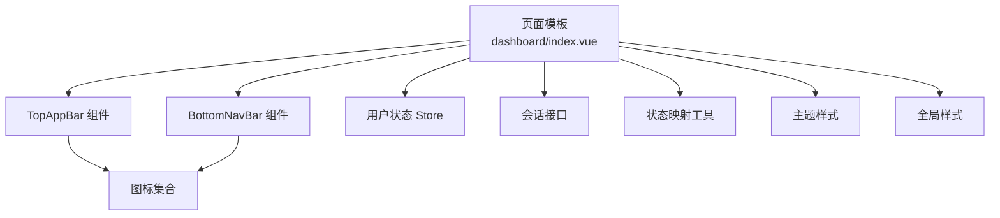
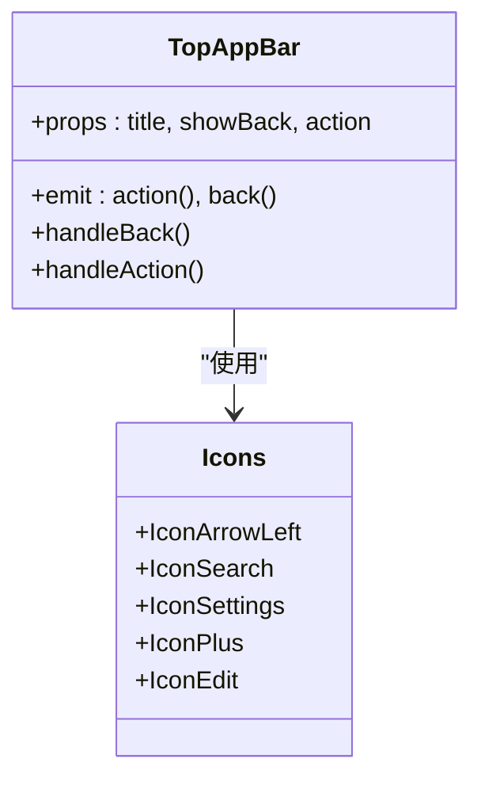
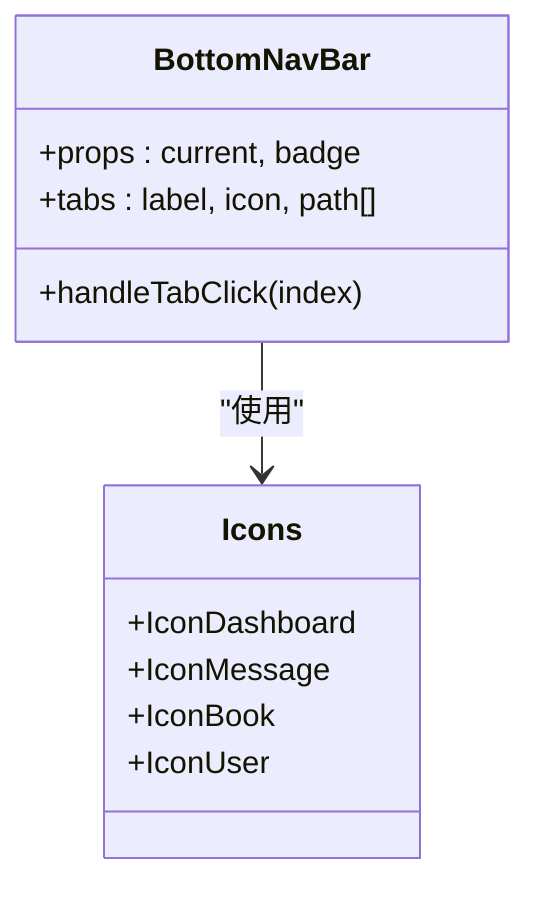
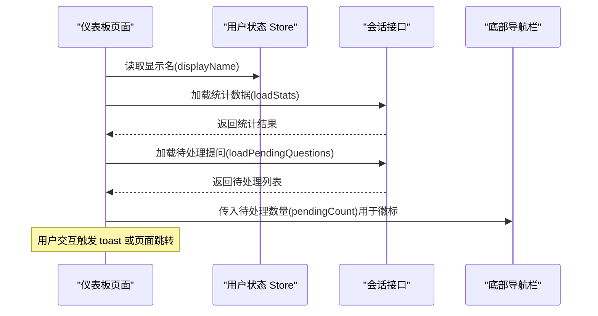
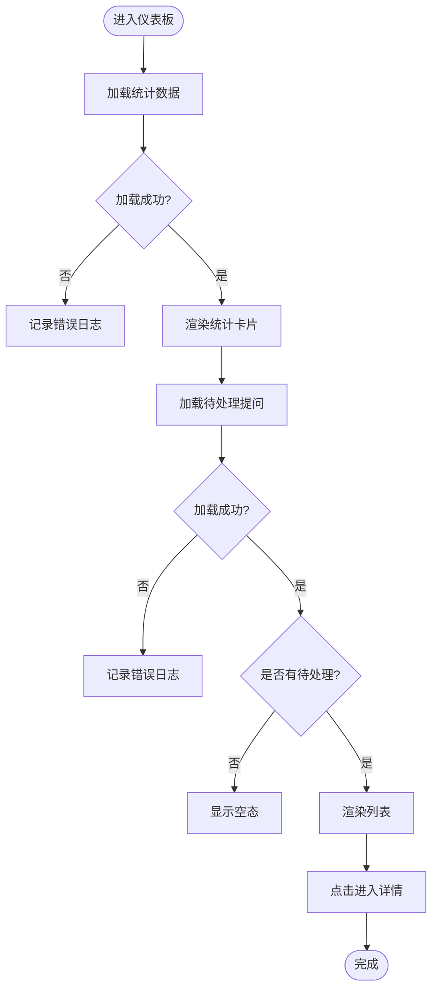
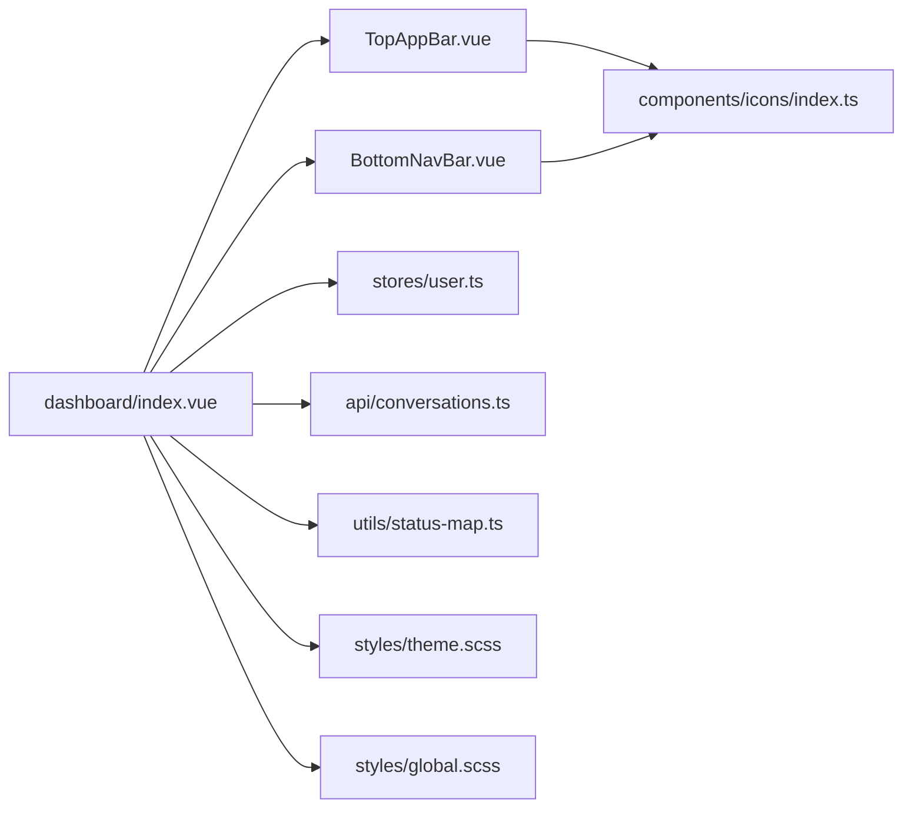

# 仪表板页面

<cite>
**本文引用的文件**
- [apps/teacher-app/src/pages/dashboard/index.vue](file://apps/teacher-app/src/pages/dashboard/index.vue)
- [apps/teacher-app/src/components/TopAppBar.vue](file://apps/teacher-app/src/components/TopAppBar.vue)
- [apps/teacher-app/src/components/BottomNavBar.vue](file://apps/teacher-app/src/components/BottomNavBar.vue)
- [apps/teacher-app/src/stores/user.ts](file://apps/teacher-app/src/stores/user.ts)
- [apps/teacher-app/src/api/conversations.ts](file://apps/teacher-app/src/api/conversations.ts)
- [apps/teacher-app/src/utils/status-map.ts](file://apps/teacher-app/src/utils/status-map.ts)
- [apps/teacher-app/src/styles/theme.scss](file://apps/teacher-app/src/styles/theme.scss)
- [apps/teacher-app/src/styles/global.scss](file://apps/teacher-app/src/styles/global.scss)
- [apps/teacher-app/src/main.ts](file://apps/teacher-app/src/main.ts)
- [apps/teacher-app/src/App.vue](file://apps/teacher-app/src/App.vue)
- [apps/teacher-app/src/pages.json](file://apps/teacher-app/src/pages.json)
- [apps/teacher-app/src/components/icons/index.ts](file://apps/teacher-app/src/components/icons/index.ts)
</cite>

## 目录
1. [简介](#简介)
2. [项目结构](#项目结构)
3. [核心组件](#核心组件)
4. [架构总览](#架构总览)
5. [详细组件分析](#详细组件分析)
6. [依赖关系分析](#依赖关系分析)
7. [性能考虑](#性能考虑)
8. [故障排查指南](#故障排查指南)
9. [结论](#结论)
10. [附录](#附录)

## 简介
本文件针对“医小管 v2 教师端仪表板页面”进行系统性技术文档整理，覆盖页面整体架构、功能实现、数据绑定与状态管理、事件处理流程、组件通信方式、布局设计与响应式适配、主题色彩系统、动画效果以及性能优化策略。目标是帮助开发者与产品人员快速理解并高效维护该页面。

## 项目结构
教师端采用基于 Vue 3 + UniApp 的跨端应用架构，页面位于 teacher-app 中，使用 Pinia 进行状态管理，通过自定义图标组件与统一主题样式实现一致的视觉语言。仪表板页面作为入口页，结合顶部自定义导航栏、底部导航栏与模块化组件，形成完整的教学辅助工作台。

图表来源
- [apps/teacher-app/src/pages/dashboard/index.vue:1-669](file://apps/teacher-app/src/pages/dashboard/index.vue#L1-L669)
- [apps/teacher-app/src/components/TopAppBar.vue:1-160](file://apps/teacher-app/src/components/TopAppBar.vue#L1-L160)
- [apps/teacher-app/src/components/BottomNavBar.vue:1-147](file://apps/teacher-app/src/components/BottomNavBar.vue#L1-L147)
- [apps/teacher-app/src/stores/user.ts:1-63](file://apps/teacher-app/src/stores/user.ts#L1-L63)
- [apps/teacher-app/src/api/conversations.ts:1-44](file://apps/teacher-app/src/api/conversations.ts#L1-L44)
- [apps/teacher-app/src/utils/status-map.ts:1-30](file://apps/teacher-app/src/utils/status-map.ts#L1-L30)
- [apps/teacher-app/src/styles/theme.scss:1-88](file://apps/teacher-app/src/styles/theme.scss#L1-L88)
- [apps/teacher-app/src/styles/global.scss:1-63](file://apps/teacher-app/src/styles/global.scss#L1-L63)
- [apps/teacher-app/src/pages.json:1-84](file://apps/teacher-app/src/pages.json#L1-L84)
- [apps/teacher-app/src/main.ts:1-25](file://apps/teacher-app/src/main.ts#L1-L25)
- [apps/teacher-app/src/App.vue:1-56](file://apps/teacher-app/src/App.vue#L1-L56)
- [apps/teacher-app/src/components/icons/index.ts:1-28](file://apps/teacher-app/src/components/icons/index.ts#L1-L28)

章节来源
- [apps/teacher-app/src/pages/dashboard/index.vue:1-669](file://apps/teacher-app/src/pages/dashboard/index.vue#L1-L669)
- [apps/teacher-app/src/pages.json:1-84](file://apps/teacher-app/src/pages.json#L1-L84)

## 核心组件
- 仪表板页面：负责顶部自定义导航栏、欢迎横幅、快捷操作、统计卡片、待处理提问列表等模块的渲染与交互。
- 顶部导航栏：提供返回、标题与右侧动作按钮，支持多种动作类型。
- 底部导航栏：提供工作台、提问、知识库、我的四个 Tab，支持徽标提示。
- 用户状态管理：通过 Pinia Store 管理登录态与显示名。
- 会话接口：封装会话列表、详情、消息、接单与解决等 API。
- 状态映射：将后端状态字符串映射为可读文本与样式类。
- 主题样式：定义主色、表面色、阴影、渐变与字体族等设计令牌。
- 全局样式：提供基础重置、动画与工具类。

章节来源
- [apps/teacher-app/src/pages/dashboard/index.vue:1-669](file://apps/teacher-app/src/pages/dashboard/index.vue#L1-L669)
- [apps/teacher-app/src/components/TopAppBar.vue:1-160](file://apps/teacher-app/src/components/TopAppBar.vue#L1-L160)
- [apps/teacher-app/src/components/BottomNavBar.vue:1-147](file://apps/teacher-app/src/components/BottomNavBar.vue#L1-L147)
- [apps/teacher-app/src/stores/user.ts:1-63](file://apps/teacher-app/src/stores/user.ts#L1-L63)
- [apps/teacher-app/src/api/conversations.ts:1-44](file://apps/teacher-app/src/api/conversations.ts#L1-L44)
- [apps/teacher-app/src/utils/status-map.ts:1-30](file://apps/teacher-app/src/utils/status-map.ts#L1-L30)
- [apps/teacher-app/src/styles/theme.scss:1-88](file://apps/teacher-app/src/styles/theme.scss#L1-L88)
- [apps/teacher-app/src/styles/global.scss:1-63](file://apps/teacher-app/src/styles/global.scss#L1-L63)

## 架构总览
仪表板页面采用“页面 + 组件 + 状态 + 接口”的分层架构：
- 页面层：负责布局与业务编排，调用接口与状态。
- 组件层：TopAppBar、BottomNavBar 等复用组件，提供一致的交互体验。
- 状态层：Pinia Store 管理用户信息与登录态。
- 接口层：封装与后端的网络请求，提供会话列表等能力。
- 样式层：主题样式与全局样式统一视觉规范与动画。

图表来源
- [apps/teacher-app/src/pages/dashboard/index.vue:1-669](file://apps/teacher-app/src/pages/dashboard/index.vue#L1-L669)
- [apps/teacher-app/src/components/TopAppBar.vue:1-160](file://apps/teacher-app/src/components/TopAppBar.vue#L1-L160)
- [apps/teacher-app/src/components/BottomNavBar.vue:1-147](file://apps/teacher-app/src/components/BottomNavBar.vue#L1-L147)
- [apps/teacher-app/src/stores/user.ts:1-63](file://apps/teacher-app/src/stores/user.ts#L1-L63)
- [apps/teacher-app/src/api/conversations.ts:1-44](file://apps/teacher-app/src/api/conversations.ts#L1-L44)
- [apps/teacher-app/src/utils/status-map.ts:1-30](file://apps/teacher-app/src/utils/status-map.ts#L1-L30)
- [apps/teacher-app/src/styles/theme.scss:1-88](file://apps/teacher-app/src/styles/theme.scss#L1-L88)
- [apps/teacher-app/src/styles/global.scss:1-63](file://apps/teacher-app/src/styles/global.scss#L1-L63)
- [apps/teacher-app/src/components/icons/index.ts:1-28](file://apps/teacher-app/src/components/icons/index.ts#L1-L28)

## 详细组件分析

### 顶部自定义导航栏（TopAppBar）
- 设计要点：固定定位、毛玻璃背景、左右区域布局；支持返回按钮与多种右侧动作（搜索、设置、添加、编辑）。
- 交互逻辑：根据属性决定是否显示返回按钮；点击右侧动作触发自定义事件，父组件可监听并处理。
- 样式特点：圆角、悬停反馈、主色强调；与全局主题保持一致。

图表来源
- [apps/teacher-app/src/components/TopAppBar.vue:1-160](file://apps/teacher-app/src/components/TopAppBar.vue#L1-L160)
- [apps/teacher-app/src/components/icons/index.ts:1-28](file://apps/teacher-app/src/components/icons/index.ts#L1-L28)

章节来源
- [apps/teacher-app/src/components/TopAppBar.vue:1-160](file://apps/teacher-app/src/components/TopAppBar.vue#L1-L160)
- [apps/teacher-app/src/components/icons/index.ts:1-28](file://apps/teacher-app/src/components/icons/index.ts#L1-L28)

### 底部导航栏（BottomNavBar）
- 设计要点：固定在底部，四个 Tab 对应不同页面路径；当前 Tab 显示高亮与徽标。
- 交互逻辑：点击 Tab 触发 uni.switchTab 切换页面；支持 badge 数值显示。
- 样式特点：毛玻璃背景、圆角、阴影、活跃点指示器。

图表来源
- [apps/teacher-app/src/components/BottomNavBar.vue:1-147](file://apps/teacher-app/src/components/BottomNavBar.vue#L1-L147)
- [apps/teacher-app/src/components/icons/index.ts:1-28](file://apps/teacher-app/src/components/icons/index.ts#L1-L28)

章节来源
- [apps/teacher-app/src/components/BottomNavBar.vue:1-147](file://apps/teacher-app/src/components/BottomNavBar.vue#L1-L147)
- [apps/teacher-app/src/components/icons/index.ts:1-28](file://apps/teacher-app/src/components/icons/index.ts#L1-L28)

### 仪表板页面（Dashboard）
- 页面结构：顶部自定义导航栏、欢迎横幅、快捷操作滚动区、统计网格、待处理提问列表、底部导航栏。
- 数据绑定与状态管理：
  - 使用 computed 计算显示名与待处理数量。
  - 使用 ref 管理统计数据与待处理列表，配合 loading 状态控制加载与空态。
  - 主题色通过常量注入，保证视觉一致性。
- 事件处理流程：
  - 通知点击：toast 提示“功能开发中”。
  - 快捷操作：toast 提示“功能开发中”，预留扩展点。
  - 查看全部提问：跳转至提问列表页。
  - 查看单个提问：跳转至提问详情页。
- 生命周期：
  - onMounted：初始化统计数据与待处理列表。
  - onShow：每次页面显示时刷新数据，确保实时性。

图表来源
- [apps/teacher-app/src/pages/dashboard/index.vue:138-252](file://apps/teacher-app/src/pages/dashboard/index.vue#L138-L252)
- [apps/teacher-app/src/stores/user.ts:1-63](file://apps/teacher-app/src/stores/user.ts#L1-L63)
- [apps/teacher-app/src/api/conversations.ts:1-44](file://apps/teacher-app/src/api/conversations.ts#L1-L44)
- [apps/teacher-app/src/components/BottomNavBar.vue:1-147](file://apps/teacher-app/src/components/BottomNavBar.vue#L1-L147)

章节来源
- [apps/teacher-app/src/pages/dashboard/index.vue:1-669](file://apps/teacher-app/src/pages/dashboard/index.vue#L1-L669)

### 统计卡片与待处理列表
- 统计卡片：展示今日提问、待处理、知识条目、今日审批等指标，使用主题色与渐变背景提升可读性。
- 待处理列表：支持加载中、空态与列表态；每项包含作者、时间、内容与状态徽章；点击进入详情。
- 时间格式化：根据更新时间计算相对时间，如“刚刚”、“X分钟前”、“X小时前”、“X天前”。

图表来源
- [apps/teacher-app/src/pages/dashboard/index.vue:180-251](file://apps/teacher-app/src/pages/dashboard/index.vue#L180-L251)
- [apps/teacher-app/src/api/conversations.ts:7-14](file://apps/teacher-app/src/api/conversations.ts#L7-L14)
- [apps/teacher-app/src/utils/status-map.ts:23-29](file://apps/teacher-app/src/utils/status-map.ts#L23-L29)

章节来源
- [apps/teacher-app/src/pages/dashboard/index.vue:168-251](file://apps/teacher-app/src/pages/dashboard/index.vue#L168-L251)
- [apps/teacher-app/src/api/conversations.ts:1-44](file://apps/teacher-app/src/api/conversations.ts#L1-L44)
- [apps/teacher-app/src/utils/status-map.ts:1-30](file://apps/teacher-app/src/utils/status-map.ts#L1-L30)

## 依赖关系分析
- 页面依赖：TopAppBar、BottomNavBar、用户 Store、会话 API、状态映射工具、主题与全局样式。
- 组件耦合：TopAppBar 与 BottomNavBar 通过图标集合解耦；页面通过 props 与事件与组件通信。
- 外部依赖：UniApp 生命周期钩子、Toast 与页面跳转 API、Pinia 状态管理、SCSS 主题变量。

图表来源
- [apps/teacher-app/src/pages/dashboard/index.vue:1-669](file://apps/teacher-app/src/pages/dashboard/index.vue#L1-L669)
- [apps/teacher-app/src/components/TopAppBar.vue:1-160](file://apps/teacher-app/src/components/TopAppBar.vue#L1-L160)
- [apps/teacher-app/src/components/BottomNavBar.vue:1-147](file://apps/teacher-app/src/components/BottomNavBar.vue#L1-L147)
- [apps/teacher-app/src/stores/user.ts:1-63](file://apps/teacher-app/src/stores/user.ts#L1-L63)
- [apps/teacher-app/src/api/conversations.ts:1-44](file://apps/teacher-app/src/api/conversations.ts#L1-L44)
- [apps/teacher-app/src/utils/status-map.ts:1-30](file://apps/teacher-app/src/utils/status-map.ts#L1-L30)
- [apps/teacher-app/src/styles/theme.scss:1-88](file://apps/teacher-app/src/styles/theme.scss#L1-L88)
- [apps/teacher-app/src/styles/global.scss:1-63](file://apps/teacher-app/src/styles/global.scss#L1-L63)
- [apps/teacher-app/src/components/icons/index.ts:1-28](file://apps/teacher-app/src/components/icons/index.ts#L1-L28)

章节来源
- [apps/teacher-app/src/pages/dashboard/index.vue:1-669](file://apps/teacher-app/src/pages/dashboard/index.vue#L1-L669)
- [apps/teacher-app/src/components/TopAppBar.vue:1-160](file://apps/teacher-app/src/components/TopAppBar.vue#L1-L160)
- [apps/teacher-app/src/components/BottomNavBar.vue:1-147](file://apps/teacher-app/src/components/BottomNavBar.vue#L1-L147)
- [apps/teacher-app/src/stores/user.ts:1-63](file://apps/teacher-app/src/stores/user.ts#L1-L63)
- [apps/teacher-app/src/api/conversations.ts:1-44](file://apps/teacher-app/src/api/conversations.ts#L1-L44)
- [apps/teacher-app/src/utils/status-map.ts:1-30](file://apps/teacher-app/src/utils/status-map.ts#L1-L30)
- [apps/teacher-app/src/styles/theme.scss:1-88](file://apps/teacher-app/src/styles/theme.scss#L1-L88)
- [apps/teacher-app/src/styles/global.scss:1-63](file://apps/teacher-app/src/styles/global.scss#L1-L63)
- [apps/teacher-app/src/components/icons/index.ts:1-28](file://apps/teacher-app/src/components/icons/index.ts#L1-L28)

## 性能考虑
- 渲染优化：使用 computed 缓存派生数据（如显示名、待处理数量），减少重复计算。
- 列表优化：待处理列表使用 key 标识唯一项，避免不必要的 DOM 更新；内容溢出使用单行省略，降低重排成本。
- 动画优化：统一使用全局动画类与阶梯延迟，避免复杂关键帧导致掉帧。
- 网络优化：在 onShow 生命周期刷新数据，兼顾实时性与性能；对异常情况捕获并降级为空态或错误提示。
- 样式优化：主题变量集中管理，避免重复计算颜色与阴影；毛玻璃背景在低端设备上可能影响性能，建议按需启用。

## 故障排查指南
- 页面不显示数据：检查 onMounted/onShow 是否正确调用加载函数；确认网络请求是否抛出异常并被 try/catch 捕获。
- 通知与快捷操作无效：当前实现为 toast 提示“功能开发中”，确认事件绑定是否正确。
- 底部徽标不更新：确认 pendingCount 的计算是否基于 pendingQuestions 的长度，且 BottomNavBar 正确接收 badge。
- 状态文本不匹配：核对状态映射工具与后端状态枚举是否一致，必要时扩展映射表。
- 主题色不生效：检查主题样式文件是否正确引入，页面是否使用正确的颜色变量。

章节来源
- [apps/teacher-app/src/pages/dashboard/index.vue:200-251](file://apps/teacher-app/src/pages/dashboard/index.vue#L200-L251)
- [apps/teacher-app/src/utils/status-map.ts:1-30](file://apps/teacher-app/src/utils/status-map.ts#L1-L30)
- [apps/teacher-app/src/styles/theme.scss:1-88](file://apps/teacher-app/src/styles/theme.scss#L1-L88)
- [apps/teacher-app/src/components/BottomNavBar.vue:17-22](file://apps/teacher-app/src/components/BottomNavBar.vue#L17-L22)

## 结论
仪表板页面以清晰的模块划分与统一的主题风格，实现了教师工作台的核心功能：欢迎横幅、快捷操作、统计卡片与待处理提问列表。通过 Pinia 管理用户状态、通过 API 封装网络请求、通过组件化实现交互复用，整体具备良好的可维护性与扩展性。后续可在通知与快捷操作功能上补齐具体业务逻辑，并持续优化动画与网络请求的性能表现。

## 附录
- 页面配置：pages.json 中定义了仪表板页面的自定义导航样式与标题。
- 应用入口：main.ts 在启动时初始化用户状态与 WebSocket 连接（若已登录）。
- 根组件：App.vue 引入全局样式与字体资源，设置页面基础样式。

章节来源
- [apps/teacher-app/src/pages.json:1-84](file://apps/teacher-app/src/pages.json#L1-L84)
- [apps/teacher-app/src/main.ts:1-25](file://apps/teacher-app/src/main.ts#L1-L25)
- [apps/teacher-app/src/App.vue:1-56](file://apps/teacher-app/src/App.vue#L1-L56)