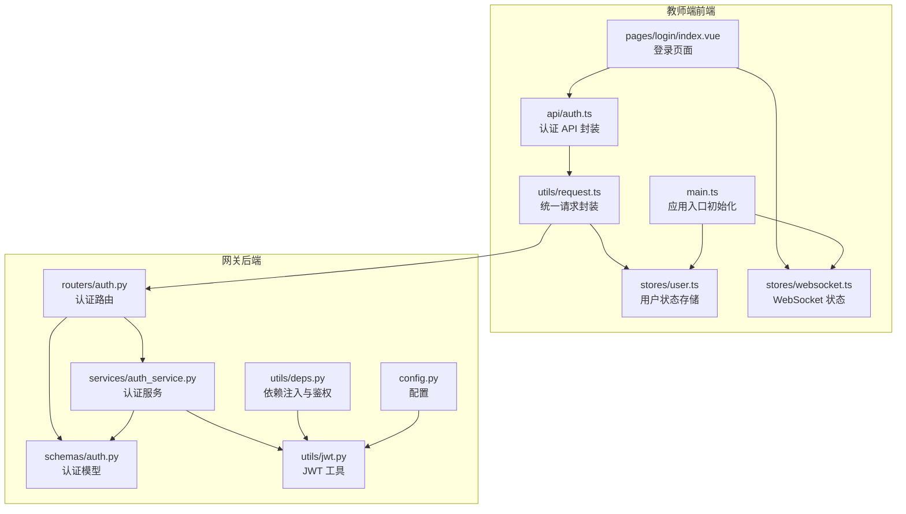
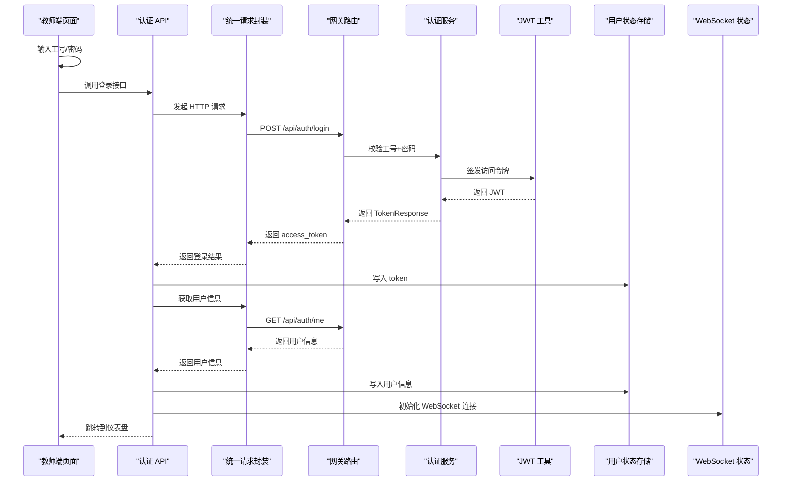
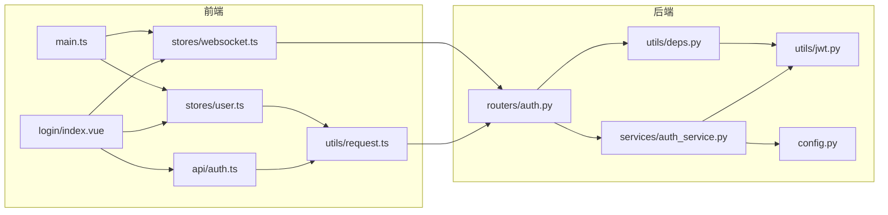
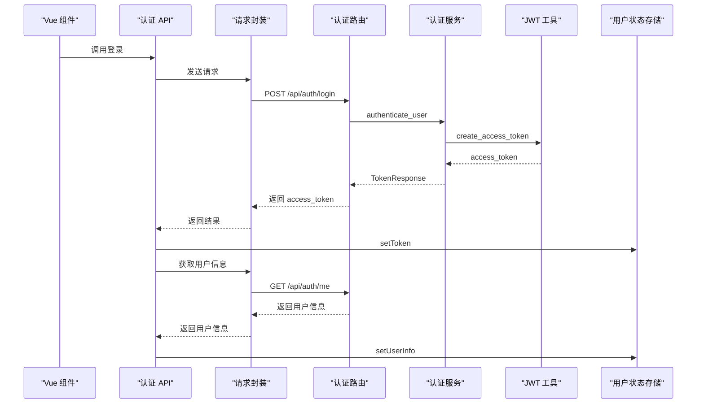

# 登录页面

<cite>
**本文引用的文件**
- [apps/teacher-app/src/pages/login/index.vue](file://apps/teacher-app/src/pages/login/index.vue)
- [apps/teacher-app/src/api/auth.ts](file://apps/teacher-app/src/api/auth.ts)
- [apps/teacher-app/src/stores/user.ts](file://apps/teacher-app/src/stores/user.ts)
- [apps/teacher-app/src/utils/request.ts](file://apps/teacher-app/src/utils/request.ts)
- [apps/teacher-app/src/main.ts](file://apps/teacher-app/src/main.ts)
- [apps/teacher-app/src/stores/websocket.ts](file://apps/teacher-app/src/stores/websocket.ts)
- [services/gateway/app/routers/auth.py](file://services/gateway/app/routers/auth.py)
- [services/gateway/app/services/auth_service.py](file://services/gateway/app/services/auth_service.py)
- [services/gateway/app/schemas/auth.py](file://services/gateway/app/schemas/auth.py)
- [services/gateway/app/utils/jwt.py](file://services/gateway/app/utils/jwt.py)
- [services/gateway/app/utils/deps.py](file://services/gateway/app/utils/deps.py)
- [services/gateway/app/config.py](file://services/gateway/app/config.py)
- [apps/teacher-app/vite.config.ts](file://apps/teacher-app/vite.config.ts)
</cite>

## 目录
1. [简介](#简介)
2. [项目结构](#项目结构)
3. [核心组件](#核心组件)
4. [架构总览](#架构总览)
5. [详细组件分析](#详细组件分析)
6. [依赖分析](#依赖分析)
7. [性能考虑](#性能考虑)
8. [故障排除指南](#故障排除指南)
9. [结论](#结论)
10. [附录](#附录)

## 简介
本文件面向“医小管 v2 教师端登录页面”的技术与产品文档，聚焦于身份认证流程、表单验证、错误处理、登录状态管理、界面设计与交互、安全防护、状态持久化与自动登录、忘记密码处理以及多设备登录管理等主题。文档以代码为依据，结合架构图与流程图，帮助开发者与测试人员快速理解与维护登录模块。

## 项目结构
教师端登录页面位于前端应用中，采用 Vue 3 + Pinia 的架构；后端网关服务基于 FastAPI 提供认证接口，并通过 JWT 实现会话令牌签发与校验。登录流程涉及前端表单、API 调用、状态存储、WebSocket 连接初始化以及后端数据库与密码哈希验证。

图表来源
- [apps/teacher-app/src/pages/login/index.vue:1-567](file://apps/teacher-app/src/pages/login/index.vue#L1-L567)
- [apps/teacher-app/src/api/auth.ts:1-43](file://apps/teacher-app/src/api/auth.ts#L1-L43)
- [apps/teacher-app/src/stores/user.ts:1-63](file://apps/teacher-app/src/stores/user.ts#L1-L63)
- [apps/teacher-app/src/utils/request.ts:1-108](file://apps/teacher-app/src/utils/request.ts#L1-L108)
- [apps/teacher-app/src/stores/websocket.ts:1-32](file://apps/teacher-app/src/stores/websocket.ts#L1-L32)
- [apps/teacher-app/src/main.ts:1-25](file://apps/teacher-app/src/main.ts#L1-L25)
- [services/gateway/app/routers/auth.py:1-35](file://services/gateway/app/routers/auth.py#L1-L35)
- [services/gateway/app/services/auth_service.py:1-35](file://services/gateway/app/services/auth_service.py#L1-L35)
- [services/gateway/app/schemas/auth.py:1-23](file://services/gateway/app/schemas/auth.py#L1-L23)
- [services/gateway/app/utils/jwt.py:1-17](file://services/gateway/app/utils/jwt.py#L1-L17)
- [services/gateway/app/utils/deps.py:1-40](file://services/gateway/app/utils/deps.py#L1-L40)
- [services/gateway/app/config.py:1-31](file://services/gateway/app/config.py#L1-L31)

章节来源
- [apps/teacher-app/src/pages/login/index.vue:1-567](file://apps/teacher-app/src/pages/login/index.vue#L1-L567)
- [apps/teacher-app/src/api/auth.ts:1-43](file://apps/teacher-app/src/api/auth.ts#L1-L43)
- [apps/teacher-app/src/stores/user.ts:1-63](file://apps/teacher-app/src/stores/user.ts#L1-L63)
- [apps/teacher-app/src/utils/request.ts:1-108](file://apps/teacher-app/src/utils/request.ts#L1-L108)
- [apps/teacher-app/src/stores/websocket.ts:1-32](file://apps/teacher-app/src/stores/websocket.ts#L1-L32)
- [apps/teacher-app/src/main.ts:1-25](file://apps/teacher-app/src/main.ts#L1-L25)
- [services/gateway/app/routers/auth.py:1-35](file://services/gateway/app/routers/auth.py#L1-L35)
- [services/gateway/app/services/auth_service.py:1-35](file://services/gateway/app/services/auth_service.py#L1-L35)
- [services/gateway/app/schemas/auth.py:1-23](file://services/gateway/app/schemas/auth.py#L1-L23)
- [services/gateway/app/utils/jwt.py:1-17](file://services/gateway/app/utils/jwt.py#L1-L17)
- [services/gateway/app/utils/deps.py:1-40](file://services/gateway/app/utils/deps.py#L1-L40)
- [services/gateway/app/config.py:1-31](file://services/gateway/app/config.py#L1-L31)

## 核心组件
- 登录页面组件：负责渲染登录表单、输入验证、触发登录流程、展示错误提示、调用其他登录方式。
- 认证 API 封装：定义登录与获取用户信息的接口类型与调用方法。
- 用户状态存储：负责令牌与用户信息的读取、写入、清理与初始化。
- 统一请求封装：负责注入 Authorization 头、处理 401 重定向、错误提示与超时控制。
- WebSocket 状态：在登录成功后初始化连接，维护连接状态与未读计数。
- 应用入口初始化：启动时尝试从本地存储恢复登录状态并自动建立 WebSocket 连接。
- 后端认证路由与服务：处理登录请求、校验密码、签发 JWT 并提供用户信息查询。
- JWT 工具与依赖注入：签发与解码 JWT，校验令牌有效性并解析当前用户。
- 网关配置：定义数据库、Redis、JWT 密钥、算法与过期时间等运行参数。

章节来源
- [apps/teacher-app/src/pages/login/index.vue:124-207](file://apps/teacher-app/src/pages/login/index.vue#L124-L207)
- [apps/teacher-app/src/api/auth.ts:10-42](file://apps/teacher-app/src/api/auth.ts#L10-L42)
- [apps/teacher-app/src/stores/user.ts:5-61](file://apps/teacher-app/src/stores/user.ts#L5-L61)
- [apps/teacher-app/src/utils/request.ts:10-77](file://apps/teacher-app/src/utils/request.ts#L10-L77)
- [apps/teacher-app/src/stores/websocket.ts:5-31](file://apps/teacher-app/src/stores/websocket.ts#L5-L31)
- [apps/teacher-app/src/main.ts:9-19](file://apps/teacher-app/src/main.ts#L9-L19)
- [services/gateway/app/routers/auth.py:12-34](file://services/gateway/app/routers/auth.py#L12-L34)
- [services/gateway/app/services/auth_service.py:8-34](file://services/gateway/app/services/auth_service.py#L8-L34)
- [services/gateway/app/utils/jwt.py:6-16](file://services/gateway/app/utils/jwt.py#L6-L16)
- [services/gateway/app/utils/deps.py:14-35](file://services/gateway/app/utils/deps.py#L14-L35)
- [services/gateway/app/config.py:3-13](file://services/gateway/app/config.py#L3-L13)

## 架构总览
登录流程从教师端页面发起，经由前端 API 层调用后端认证接口，后端完成用户校验与令牌签发，前端将令牌存入本地存储并初始化 WebSocket 连接，随后跳转到仪表盘页面。

图表来源
- [apps/teacher-app/src/pages/login/index.vue:164-191](file://apps/teacher-app/src/pages/login/index.vue#L164-L191)
- [apps/teacher-app/src/api/auth.ts:30-42](file://apps/teacher-app/src/api/auth.ts#L30-L42)
- [apps/teacher-app/src/utils/request.ts:10-77](file://apps/teacher-app/src/utils/request.ts#L10-L77)
- [services/gateway/app/routers/auth.py:12-34](file://services/gateway/app/routers/auth.py#L12-L34)
- [services/gateway/app/services/auth_service.py:8-34](file://services/gateway/app/services/auth_service.py#L8-L34)
- [services/gateway/app/utils/jwt.py:6-16](file://services/gateway/app/utils/jwt.py#L6-L16)
- [apps/teacher-app/src/stores/user.ts:30-38](file://apps/teacher-app/src/stores/user.ts#L30-L38)
- [apps/teacher-app/src/stores/websocket.ts:9-14](file://apps/teacher-app/src/stores/websocket.ts#L9-L14)

## 详细组件分析

### 登录页面组件（pages/login/index.vue）
- 界面设计与交互
  - 使用渐变背景与装饰光晕圆营造科技感。
  - 登录卡片采用毛玻璃效果与阴影，提升层次感。
  - 表单包含工号输入、密码输入（支持显示/隐藏）、可选验证码区域（v2 默认关闭）、记住我复选框、忘记密码链接、登录按钮与其他登录方式（二维码、指纹）入口。
  - 主题色与文本颜色通过 SCSS 变量统一管理，确保视觉一致性。
- 输入验证与错误处理
  - 登录按钮点击时进行非空校验，若为空则弹出提示并阻断后续流程。
  - 加载态防止重复提交，异常捕获统一提示。
- 登录流程
  - 调用认证 API 完成登录，成功后写入 token，再拉取用户信息并写入用户状态存储。
  - 初始化 WebSocket 连接，最后跳转至仪表盘页面。
- 其他登录方式
  - 二维码登录与指纹登录目前为占位提示，后续可扩展扫码与生物识别能力。

章节来源
- [apps/teacher-app/src/pages/login/index.vue:1-567](file://apps/teacher-app/src/pages/login/index.vue#L1-L567)

### 认证 API 封装（api/auth.ts）
- 类型定义
  - 登录响应包含 access_token 与 token_type。
  - 用户信息响应包含 id、工号、姓名、角色、学院/班级 ID 与头像地址。
- 接口函数
  - 登录接口：接收工号与密码，返回访问令牌。
  - 获取用户信息接口：返回当前登录用户信息。

章节来源
- [apps/teacher-app/src/api/auth.ts:10-42](file://apps/teacher-app/src/api/auth.ts#L10-L42)

### 用户状态存储（stores/user.ts）
- 状态与计算属性
  - token：当前访问令牌。
  - userInfo：当前用户信息。
  - isLoggedIn：根据 token 是否存在判断登录状态。
  - displayName：根据用户信息生成显示名称。
- 行为方法
  - init：从本地存储恢复 token 与用户信息。
  - setToken：更新 token 并持久化到本地存储。
  - setUserInfo：更新用户信息并持久化。
  - clearAuth/logout：清空 token 与用户信息并移除本地存储。

章节来源
- [apps/teacher-app/src/stores/user.ts:5-61](file://apps/teacher-app/src/stores/user.ts#L5-L61)

### 统一请求封装（utils/request.ts）
- 基础配置
  - 支持环境变量配置基础 URL 与请求超时。
  - 自动拼接 query 参数，统一 Content-Type。
- 认证与错误处理
  - 自动注入 Authorization 头（Bearer token）。
  - 对 401 未授权进行拦截：提示“登录已过期”，清理用户状态并跳转登录页。
  - 对 HTTP 错误码进行统一提示与拒绝。
  - 网络失败统一提示与拒绝。
- 便捷方法
  - 提供 get/post/put/del 方法，内部复用统一逻辑。

章节来源
- [apps/teacher-app/src/utils/request.ts:3-77](file://apps/teacher-app/src/utils/request.ts#L3-L77)

### 应用入口初始化（main.ts）
- 在应用启动时尝试从本地存储恢复登录状态。
- 若检测到已登录，则自动初始化 WebSocket 连接，保证即时消息通道可用。

章节来源
- [apps/teacher-app/src/main.ts:9-19](file://apps/teacher-app/src/main.ts#L9-L19)

### WebSocket 状态（stores/websocket.ts）
- 维护连接状态 isConnected 与未读消息计数 unreadCount。
- 提供 init/destroy/incrementUnread/resetUnread 方法，便于在登录成功后建立连接并在登出时断开。

章节来源
- [apps/teacher-app/src/stores/websocket.ts:5-31](file://apps/teacher-app/src/stores/websocket.ts#L5-L31)

### 后端认证路由与服务（routers/auth.py, services/auth_service.py）
- 路由层
  - POST /api/auth/login：接收工号与密码，调用认证服务，签发 JWT 并返回 access_token。
  - GET /api/auth/me：依赖鉴权中间件，返回当前用户信息。
- 认证服务
  - authenticate_user：按工号查询激活用户并使用 bcrypt 校验密码。
  - issue_token：基于用户信息构建 JWT 负载并签发访问令牌。
- JWT 工具
  - create_access_token：设置过期时间并编码。
  - decode_access_token：解码并校验签名。
- 依赖注入
  - get_current_user：从 Authorization 头解析 JWT，查询用户并校验是否激活。

章节来源
- [services/gateway/app/routers/auth.py:12-34](file://services/gateway/app/routers/auth.py#L12-L34)
- [services/gateway/app/services/auth_service.py:8-34](file://services/gateway/app/services/auth_service.py#L8-L34)
- [services/gateway/app/utils/jwt.py:6-16](file://services/gateway/app/utils/jwt.py#L6-L16)
- [services/gateway/app/utils/deps.py:14-35](file://services/gateway/app/utils/deps.py#L14-L35)

### 配置与环境（config.py, vite.config.ts）
- 网关配置
  - 数据库与 Redis 连接字符串。
  - JWT 密钥、算法与过期小时数。
- 前端代理
  - 开发环境下将 /api 与 /ws 代理到网关服务地址，便于本地联调。

章节来源
- [services/gateway/app/config.py:3-13](file://services/gateway/app/config.py#L3-L13)
- [apps/teacher-app/vite.config.ts:6-20](file://apps/teacher-app/vite.config.ts#L6-L20)

## 依赖分析
- 前端依赖
  - 登录页面依赖认证 API、用户状态存储与 WebSocket 状态。
  - 认证 API 依赖统一请求封装。
  - 应用入口依赖用户状态存储与 WebSocket 状态。
- 后端依赖
  - 认证路由依赖认证服务与依赖注入工具。
  - 认证服务依赖数据库会话、bcrypt 密码校验与 JWT 工具。
  - 依赖注入工具依赖 JWT 工具与数据库会话。

图表来源
- [apps/teacher-app/src/pages/login/index.vue:124-207](file://apps/teacher-app/src/pages/login/index.vue#L124-L207)
- [apps/teacher-app/src/api/auth.ts:1-43](file://apps/teacher-app/src/api/auth.ts#L1-L43)
- [apps/teacher-app/src/utils/request.ts:1-108](file://apps/teacher-app/src/utils/request.ts#L1-L108)
- [apps/teacher-app/src/stores/user.ts:1-63](file://apps/teacher-app/src/stores/user.ts#L1-L63)
- [apps/teacher-app/src/stores/websocket.ts:1-32](file://apps/teacher-app/src/stores/websocket.ts#L1-L32)
- [apps/teacher-app/src/main.ts:1-25](file://apps/teacher-app/src/main.ts#L1-L25)
- [services/gateway/app/routers/auth.py:1-35](file://services/gateway/app/routers/auth.py#L1-L35)
- [services/gateway/app/services/auth_service.py:1-35](file://services/gateway/app/services/auth_service.py#L1-L35)
- [services/gateway/app/utils/deps.py:1-40](file://services/gateway/app/utils/deps.py#L1-L40)
- [services/gateway/app/utils/jwt.py:1-17](file://services/gateway/app/utils/jwt.py#L1-L17)
- [services/gateway/app/config.py:1-31](file://services/gateway/app/config.py#L1-L31)

## 性能考虑
- 请求超时与并发
  - 统一请求封装设置了默认超时，避免长时间阻塞影响用户体验。
- 本地存储与初始化
  - 应用启动时一次性从本地存储恢复状态，减少不必要的网络请求。
- WebSocket 连接
  - 登录成功后建立连接，避免在未登录状态下占用资源。
- 前端渲染
  - 登录页面采用轻量级布局与渐变动画，保证在低端设备上也能流畅运行。

## 故障排除指南
- 登录失败
  - 现象：输入工号与密码后提示失败。
  - 排查：检查后端认证服务是否正确校验密码；确认数据库中是否存在该工号且用户处于激活状态。
- 401 未授权
  - 现象：页面出现“登录已过期”提示并自动跳转登录页。
  - 排查：确认 JWT 是否过期；检查前端是否正确注入 Authorization 头；核对后端 JWT 密钥与算法配置。
- 网络连接失败
  - 现象：提示网络连接失败。
  - 排查：确认代理配置是否正确；检查网关服务是否可达；查看浏览器控制台与后端日志。
- 本地存储异常
  - 现象：应用无法记住登录状态或用户信息丢失。
  - 排查：检查本地存储权限；确认键名一致（token 与用户信息键）；避免跨域或隐私模式限制。
- WebSocket 连接问题
  - 现象：消息无法实时推送。
  - 排查：确认 WebSocket 代理配置；检查后端连接池与心跳机制；验证前端连接初始化逻辑。

章节来源
- [apps/teacher-app/src/utils/request.ts:42-64](file://apps/teacher-app/src/utils/request.ts#L42-L64)
- [apps/teacher-app/src/stores/user.ts:19-28](file://apps/teacher-app/src/stores/user.ts#L19-L28)
- [apps/teacher-app/src/stores/websocket.ts:9-14](file://apps/teacher-app/src/stores/websocket.ts#L9-L14)
- [apps/teacher-app/vite.config.ts:9-19](file://apps/teacher-app/vite.config.ts#L9-L19)
- [services/gateway/app/config.py:10-13](file://services/gateway/app/config.py#L10-L13)

## 结论
教师端登录页面通过前后端协同实现了简洁、安全、可靠的认证流程。前端负责表单交互与状态管理，后端负责用户校验与令牌签发，二者通过 JWT 与统一请求封装紧密耦合。当前版本已具备基本的登录、状态持久化与自动登录能力；后续可在验证码、多因子认证、多设备登录策略等方面进一步增强安全性与用户体验。

## 附录

### 登录流程时序图（代码级）

图表来源
- [apps/teacher-app/src/pages/login/index.vue:164-191](file://apps/teacher-app/src/pages/login/index.vue#L164-L191)
- [apps/teacher-app/src/api/auth.ts:30-42](file://apps/teacher-app/src/api/auth.ts#L30-L42)
- [apps/teacher-app/src/utils/request.ts:10-77](file://apps/teacher-app/src/utils/request.ts#L10-L77)
- [services/gateway/app/routers/auth.py:12-34](file://services/gateway/app/routers/auth.py#L12-L34)
- [services/gateway/app/services/auth_service.py:8-34](file://services/gateway/app/services/auth_service.py#L8-L34)
- [services/gateway/app/utils/jwt.py:6-16](file://services/gateway/app/utils/jwt.py#L6-L16)
- [apps/teacher-app/src/stores/user.ts:30-38](file://apps/teacher-app/src/stores/user.ts#L30-L38)

### 表单验证与安全规则
- 输入验证
  - 工号与密码必填校验，防止空值提交。
  - 密码支持显示/隐藏切换，提升输入体验。
- 安全防护
  - 后端使用 bcrypt 校验密码，数据库仅存储哈希值。
  - JWT 过期时间可控，默认 72 小时。
  - 401 自动清理状态并跳转登录页，避免长期失效令牌被滥用。
  - 统一请求封装自动注入 Authorization 头，避免手动遗漏。

章节来源
- [apps/teacher-app/src/pages/login/index.vue:164-191](file://apps/teacher-app/src/pages/login/index.vue#L164-L191)
- [services/gateway/app/services/auth_service.py:8-17](file://services/gateway/app/services/auth_service.py#L8-L17)
- [services/gateway/app/utils/jwt.py:6-11](file://services/gateway/app/utils/jwt.py#L6-L11)
- [apps/teacher-app/src/utils/request.ts:42-47](file://apps/teacher-app/src/utils/request.ts#L42-L47)

### 登录状态持久化与自动登录
- 持久化
  - 使用本地存储保存 token 与用户信息，键名分别为固定常量。
- 自动登录
  - 应用启动时尝试恢复 token 并在存在 token 时自动初始化 WebSocket 连接。
- 清理
  - 登出时清除 token 与用户信息，断开 WebSocket 连接。

章节来源
- [apps/teacher-app/src/stores/user.ts:19-47](file://apps/teacher-app/src/stores/user.ts#L19-L47)
- [apps/teacher-app/src/main.ts:9-19](file://apps/teacher-app/src/main.ts#L9-L19)
- [apps/teacher-app/src/stores/websocket.ts:16-20](file://apps/teacher-app/src/stores/websocket.ts#L16-L20)

### 忘记密码与多设备登录管理
- 忘记密码
  - 当前页面提供“联系管理员”提示，后续可接入邮件/短信重置流程。
- 多设备登录
  - 当前未实现强制踢下线或设备列表管理；建议引入 Redis 会话管理与令牌黑名单机制，以支持多设备登录策略（如互斥登录、设备列表与踢出操作）。

章节来源
- [apps/teacher-app/src/pages/login/index.vue:193-196](file://apps/teacher-app/src/pages/login/index.vue#L193-L196)