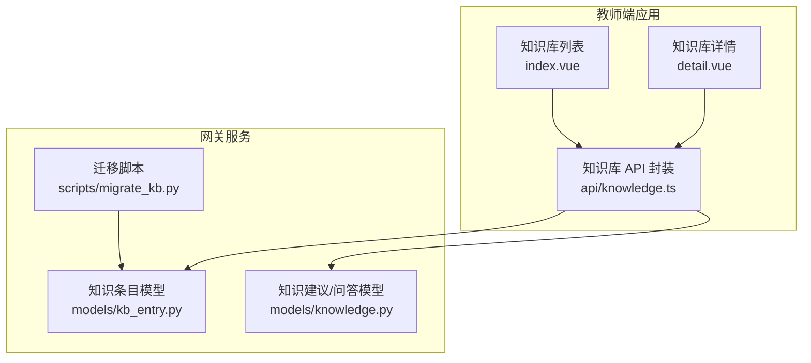
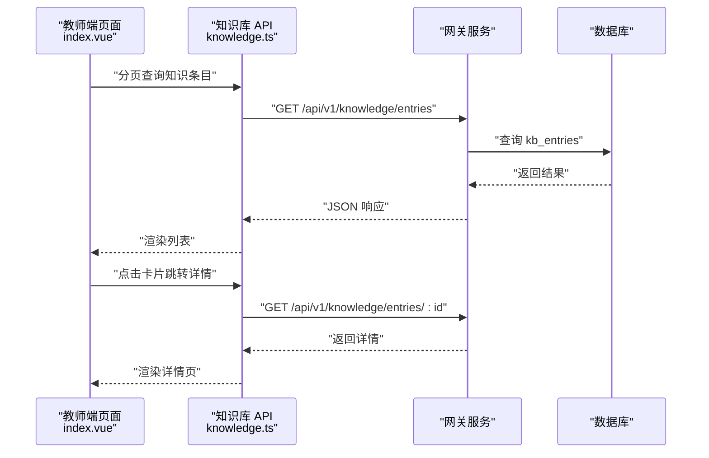
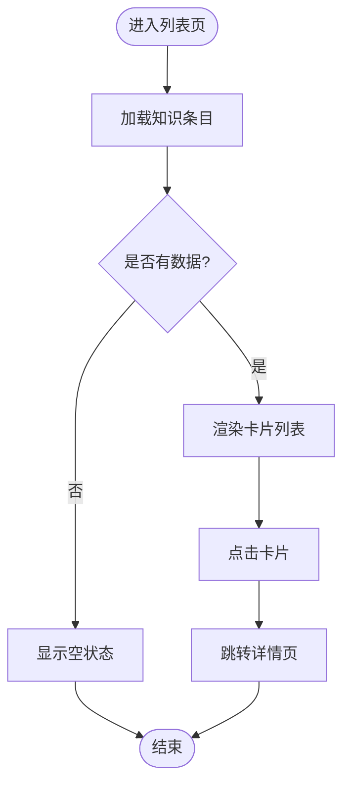
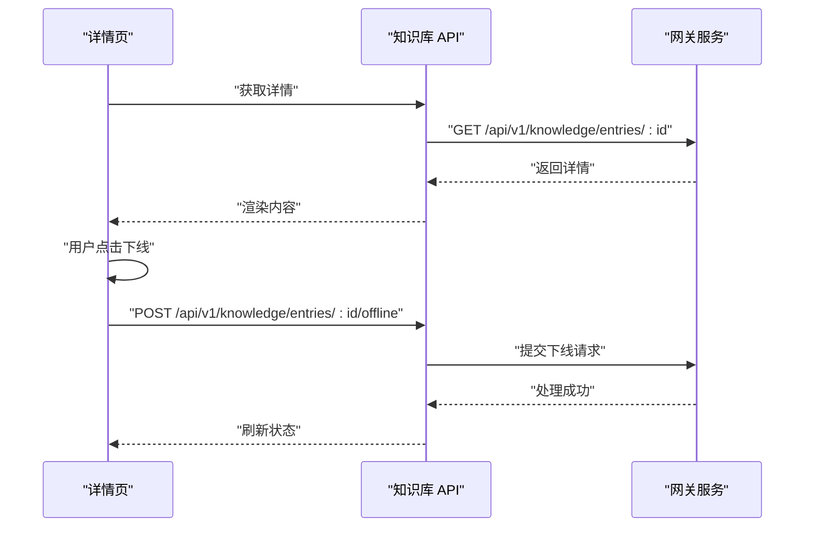
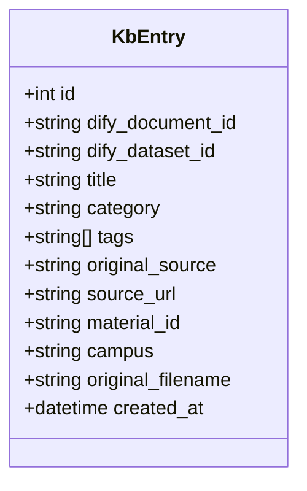
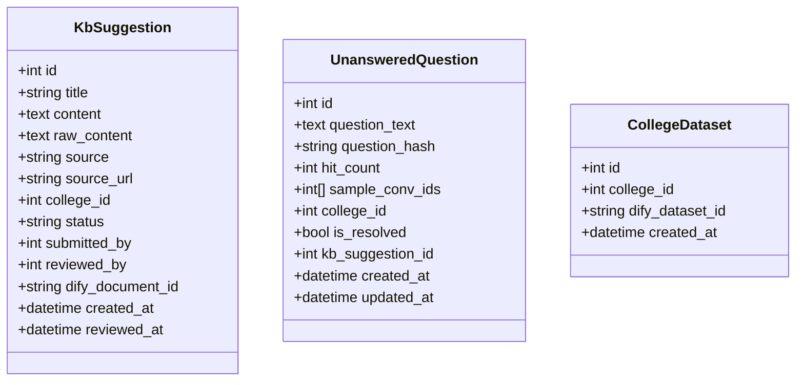
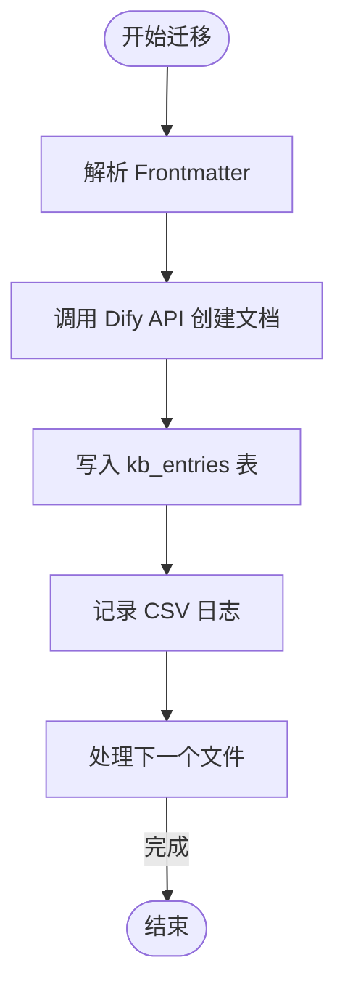
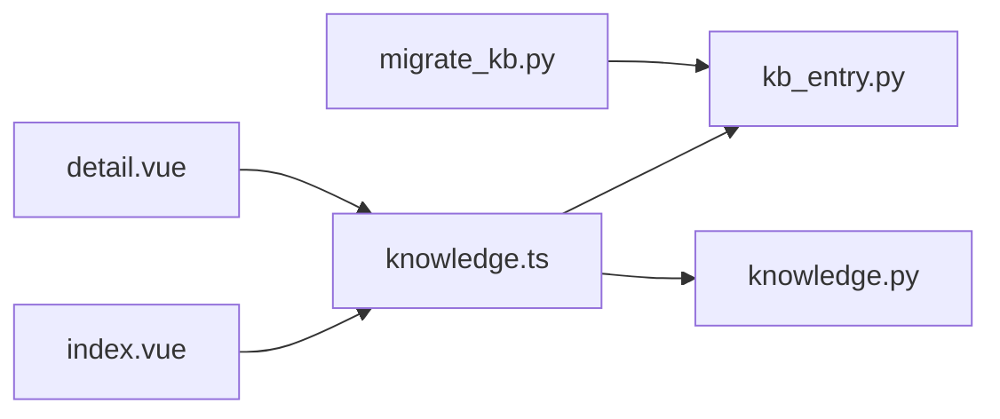

# 知识库管理页面

<cite>
**本文引用的文件**
- [apps/teacher-app/src/pages/knowledge/index.vue](file://apps/teacher-app/src/pages/knowledge/index.vue)
- [apps/teacher-app/src/pages/knowledge/detail.vue](file://apps/teacher-app/src/pages/knowledge/detail.vue)
- [apps/teacher-app/src/api/knowledge.ts](file://apps/teacher-app/src/api/knowledge.ts)
- [services/gateway/app/models/kb_entry.py](file://services/gateway/app/models/kb_entry.py)
- [services/gateway/app/models/knowledge.py](file://services/gateway/app/models/knowledge.py)
- [scripts/migrate_kb.py](file://scripts/migrate_kb.py)
</cite>

## 目录
1. [简介](#简介)
2. [项目结构](#项目结构)
3. [核心组件](#核心组件)
4. [架构总览](#架构总览)
5. [详细组件分析](#详细组件分析)
6. [依赖分析](#依赖分析)
7. [性能考虑](#性能考虑)
8. [故障排除指南](#故障排除指南)
9. [结论](#结论)
10. [附录](#附录)

## 简介
本文件面向“医小管 v2 教师端知识库管理页面”，系统性梳理前端页面与后端模型之间的交互关系，重点覆盖以下能力：
- 知识条目的增删改查：列表展示、搜索、详情查看、下线操作
- 知识分类管理：分类标签展示与筛选
- 审核与发布流程：草稿、发布、审核中、已下线等状态
- 数据结构设计：知识条目、建议与问答模型
- 版本与迁移：从 v1 到 Dify 的迁移脚本与映射
- 富文本与多媒体：当前实现以纯文本为主，后续可扩展
- 批量操作：当前页面未实现，建议在后端提供批量接口
- 最佳实践与质量保障：内容质量控制、权限与状态机约束

## 项目结构
教师端知识库页面位于 uni-app 应用中，采用分层组织：
- 页面层：知识库列表与详情页面
- API 层：封装知识库相关请求
- 后端模型层：知识条目、建议与问答相关模型
- 迁移脚本：从 v1 到 Dify 的知识库迁移

图表来源
- [apps/teacher-app/src/pages/knowledge/index.vue:1-493](file://apps/teacher-app/src/pages/knowledge/index.vue#L1-L493)
- [apps/teacher-app/src/pages/knowledge/detail.vue:1-397](file://apps/teacher-app/src/pages/knowledge/detail.vue#L1-L397)
- [apps/teacher-app/src/api/knowledge.ts:1-45](file://apps/teacher-app/src/api/knowledge.ts#L1-L45)
- [services/gateway/app/models/kb_entry.py:1-31](file://services/gateway/app/models/kb_entry.py#L1-L31)
- [services/gateway/app/models/knowledge.py:1-62](file://services/gateway/app/models/knowledge.py#L1-L62)
- [scripts/migrate_kb.py:1-201](file://scripts/migrate_kb.py#L1-L201)

章节来源
- [apps/teacher-app/src/pages/knowledge/index.vue:1-493](file://apps/teacher-app/src/pages/knowledge/index.vue#L1-L493)
- [apps/teacher-app/src/pages/knowledge/detail.vue:1-397](file://apps/teacher-app/src/pages/knowledge/detail.vue#L1-L397)
- [apps/teacher-app/src/api/knowledge.ts:1-45](file://apps/teacher-app/src/api/knowledge.ts#L1-L45)
- [services/gateway/app/models/kb_entry.py:1-31](file://services/gateway/app/models/kb_entry.py#L1-L31)
- [services/gateway/app/models/knowledge.py:1-62](file://services/gateway/app/models/knowledge.py#L1-L62)
- [scripts/migrate_kb.py:1-201](file://scripts/migrate_kb.py#L1-L201)

## 核心组件
- 知识库列表页：提供搜索、分类筛选、状态标签、摘要展示与跳转详情的能力
- 知识库详情页：展示标题、分类、状态、作者与更新时间、正文内容；支持下线操作
- 知识库 API：封装分页查询、详情获取、分类查询、下线条目等接口
- 知识条目模型：映射 Dify 文档与原始来源信息
- 知识建议/问答模型：支撑建议、问答与学院数据集关联
- 迁移脚本：将 v1 知识条目迁移至 Dify 并写入 kb_entries

章节来源
- [apps/teacher-app/src/pages/knowledge/index.vue:84-227](file://apps/teacher-app/src/pages/knowledge/index.vue#L84-L227)
- [apps/teacher-app/src/pages/knowledge/detail.vue:60-161](file://apps/teacher-app/src/pages/knowledge/detail.vue#L60-L161)
- [apps/teacher-app/src/api/knowledge.ts:3-44](file://apps/teacher-app/src/api/knowledge.ts#L3-L44)
- [services/gateway/app/models/kb_entry.py:9-31](file://services/gateway/app/models/kb_entry.py#L9-L31)
- [services/gateway/app/models/knowledge.py:22-62](file://services/gateway/app/models/knowledge.py#L22-L62)
- [scripts/migrate_kb.py:68-86](file://scripts/migrate_kb.py#L68-L86)

## 架构总览
前端通过 API 层访问后端服务，后端使用 SQLAlchemy ORM 映射数据库表。知识条目与 Dify 文档建立一一对应关系，便于检索与溯源。

图表来源
- [apps/teacher-app/src/pages/knowledge/index.vue:103-138](file://apps/teacher-app/src/pages/knowledge/index.vue#L103-L138)
- [apps/teacher-app/src/pages/knowledge/detail.vue:82-93](file://apps/teacher-app/src/pages/knowledge/detail.vue#L82-L93)
- [apps/teacher-app/src/api/knowledge.ts:3-28](file://apps/teacher-app/src/api/knowledge.ts#L3-L28)
- [services/gateway/app/models/kb_entry.py:9-31](file://services/gateway/app/models/kb_entry.py#L9-L31)

## 详细组件分析

### 知识库列表页（index.vue）
- 搜索与筛选
  - 支持按标题关键词搜索与按分类筛选
  - 默认加载第一页，每页固定数量
- 列表展示
  - 卡片包含分类标签、状态标签、标题、摘要、作者与更新时间
  - 点击卡片跳转详情页
- 状态与样式
  - 状态枚举：草稿、已发布、审核中、已下线
  - 不同状态对应不同颜色与文案
- 时间格式化
  - 支持“刚刚”、“X分钟前”、“X小时前”、“X天前”等人性化显示

图表来源
- [apps/teacher-app/src/pages/knowledge/index.vue:103-138](file://apps/teacher-app/src/pages/knowledge/index.vue#L103-L138)
- [apps/teacher-app/src/pages/knowledge/index.vue:182-223](file://apps/teacher-app/src/pages/knowledge/index.vue#L182-L223)

章节来源
- [apps/teacher-app/src/pages/knowledge/index.vue:84-227](file://apps/teacher-app/src/pages/knowledge/index.vue#L84-L227)

### 知识库详情页（detail.vue）
- 详情加载
  - 通过路由参数获取条目 ID，拉取详情并渲染
- 操作按钮
  - 下线：弹窗确认后调用下线接口
  - 编辑：提示“开发中”，后续可接入编辑流程
- 状态与分类
  - 分类名称与状态文案映射
  - 时间格式化为本地化日期时间

图表来源
- [apps/teacher-app/src/pages/knowledge/detail.vue:82-111](file://apps/teacher-app/src/pages/knowledge/detail.vue#L82-L111)
- [apps/teacher-app/src/api/knowledge.ts:22-44](file://apps/teacher-app/src/api/knowledge.ts#L22-L44)

章节来源
- [apps/teacher-app/src/pages/knowledge/detail.vue:60-161](file://apps/teacher-app/src/pages/knowledge/detail.vue#L60-L161)
- [apps/teacher-app/src/api/knowledge.ts:22-44](file://apps/teacher-app/src/api/knowledge.ts#L22-L44)

### 知识库 API（knowledge.ts）
- 接口定义
  - 分页查询知识条目：支持分类、状态、标题过滤
  - 获取知识条目详情
  - 获取分类列表
  - 下线条目
- 参数与默认值
  - 分页参数在客户端设置默认值，便于快速演示

章节来源
- [apps/teacher-app/src/api/knowledge.ts:3-44](file://apps/teacher-app/src/api/knowledge.ts#L3-L44)

### 知识条目模型（kb_entry.py）
- 字段设计
  - 主键自增 ID
  - Dify 侧字段：文档 ID、数据集 ID（唯一性约束）
  - 内容字段：标题、分类、标签数组
  - 原始来源字段：原始文件定位、URL、材料 ID、校区、原始文件名
  - 创建时间
- 设计要点
  - 与 Dify 文档一一对应，便于检索与溯源
  - 标签数组支持多维分类与检索

图表来源
- [services/gateway/app/models/kb_entry.py:9-31](file://services/gateway/app/models/kb_entry.py#L9-L31)

章节来源
- [services/gateway/app/models/kb_entry.py:9-31](file://services/gateway/app/models/kb_entry.py#L9-L31)

### 知识建议与问答模型（knowledge.py）
- 建议模型（KbSuggestion）
  - 标题、内容、原始内容、来源类型、来源 URL、所属学院、提交人、审核人、Dify 文档 ID、状态、创建/审核时间
- 未回答问题模型（UnansweredQuestion）
  - 问题文本、哈希、命中次数、示例对话 ID 数组、所属学院、是否已解决、关联建议 ID
- 学院数据集模型（CollegeDataset）
  - 学院 ID、Dify 数据集 ID、创建时间

图表来源
- [services/gateway/app/models/knowledge.py:22-62](file://services/gateway/app/models/knowledge.py#L22-L62)

章节来源
- [services/gateway/app/models/knowledge.py:10-62](file://services/gateway/app/models/knowledge.py#L10-L62)

### 迁移脚本（migrate_kb.py）
- 功能概述
  - 解析 Markdown Frontmatter，调用 Dify Dataset API 创建文档
  - 将元数据写入 PostgreSQL 的 kb_entries 表
  - 支持断点续传，输出迁移结果 CSV
- 关键流程
  - 解析 YAML Frontmatter
  - 调用 Dify API 创建文档并获取文档 ID
  - 写入 kb_entries 记录
  - 输出 CSV 日志

图表来源
- [scripts/migrate_kb.py:88-196](file://scripts/migrate_kb.py#L88-L196)
- [scripts/migrate_kb.py:68-86](file://scripts/migrate_kb.py#L68-L86)

章节来源
- [scripts/migrate_kb.py:1-201](file://scripts/migrate_kb.py#L1-L201)

## 依赖分析
- 前端依赖
  - 页面依赖 API 封装，API 封装依赖通用请求工具
  - 页面与组件之间通过路由参数传递 ID
- 后端依赖
  - 知识条目模型依赖数据库基类与 SQL 类型
  - 迁移脚本依赖 Dify API 与数据库会话
- 耦合与内聚
  - 前端页面职责清晰：列表与详情
  - API 层薄封装，便于替换后端实现
  - 模型层职责明确：仅负责数据结构与索引

图表来源
- [apps/teacher-app/src/pages/knowledge/index.vue:84-227](file://apps/teacher-app/src/pages/knowledge/index.vue#L84-L227)
- [apps/teacher-app/src/pages/knowledge/detail.vue:60-161](file://apps/teacher-app/src/pages/knowledge/detail.vue#L60-L161)
- [apps/teacher-app/src/api/knowledge.ts:1-45](file://apps/teacher-app/src/api/knowledge.ts#L1-L45)
- [services/gateway/app/models/kb_entry.py:1-31](file://services/gateway/app/models/kb_entry.py#L1-L31)
- [services/gateway/app/models/knowledge.py:1-62](file://services/gateway/app/models/knowledge.py#L1-L62)
- [scripts/migrate_kb.py:1-201](file://scripts/migrate_kb.py#L1-L201)

章节来源
- [apps/teacher-app/src/pages/knowledge/index.vue:84-227](file://apps/teacher-app/src/pages/knowledge/index.vue#L84-L227)
- [apps/teacher-app/src/pages/knowledge/detail.vue:60-161](file://apps/teacher-app/src/pages/knowledge/detail.vue#L60-L161)
- [apps/teacher-app/src/api/knowledge.ts:1-45](file://apps/teacher-app/src/api/knowledge.ts#L1-L45)
- [services/gateway/app/models/kb_entry.py:1-31](file://services/gateway/app/models/kb_entry.py#L1-L31)
- [services/gateway/app/models/knowledge.py:1-62](file://services/gateway/app/models/knowledge.py#L1-L62)
- [scripts/migrate_kb.py:1-201](file://scripts/migrate_kb.py#L1-L201)

## 性能考虑
- 列表分页
  - 当前前端设置固定分页大小，建议后端支持可配置分页参数
- 搜索与筛选
  - 建议在后端对标题与分类字段建立索引，提升查询性能
- 图片与多媒体
  - 当前详情以纯文本展示，若引入富文本/多媒体，需考虑懒加载与缓存策略
- 状态标签
  - 前端状态映射逻辑简单，建议统一维护在常量或枚举中，避免分散

## 故障排除指南
- 列表加载失败
  - 检查网络请求与后端接口可用性
  - 查看错误日志与异常捕获
- 详情为空或不存在
  - 校验 ID 是否有效
  - 确认后端是否存在对应记录
- 下线操作失败
  - 确认接口返回与权限校验
  - 查看错误提示并重试

章节来源
- [apps/teacher-app/src/pages/knowledge/index.vue:103-122](file://apps/teacher-app/src/pages/knowledge/index.vue#L103-L122)
- [apps/teacher-app/src/pages/knowledge/detail.vue:82-93](file://apps/teacher-app/src/pages/knowledge/detail.vue#L82-L93)
- [apps/teacher-app/src/pages/knowledge/detail.vue:95-111](file://apps/teacher-app/src/pages/knowledge/detail.vue#L95-L111)

## 结论
教师端知识库管理页面已完成基础的列表与详情展示、搜索与分类筛选、状态标签与下线操作。后端模型清晰地将知识条目与 Dify 文档关联，迁移脚本提供了从 v1 到 Dify 的完整路径。后续可在富文本编辑、多媒体支持、标签分类管理与批量操作等方面进一步完善，并在后端增加更丰富的过滤与排序能力，以提升内容管理效率与体验。

## 附录
- 状态枚举与含义
  - 草稿：0
  - 已发布：1
  - 审核中：2
  - 已下线：3
- 分类映射
  - 全部：无分类筛选
  - 教务管理：1
  - 学生服务：2
  - 生活指南：3