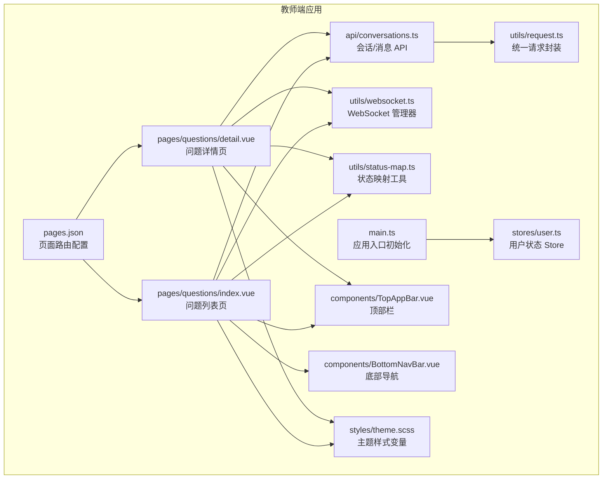
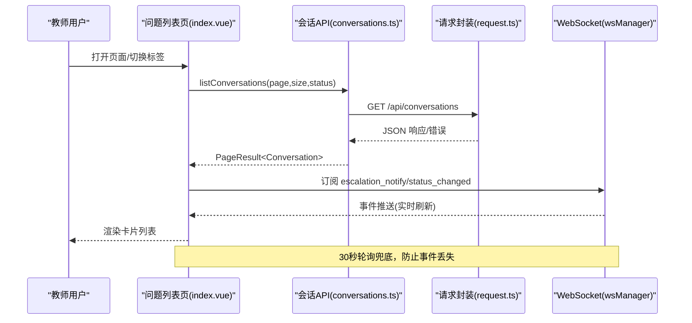
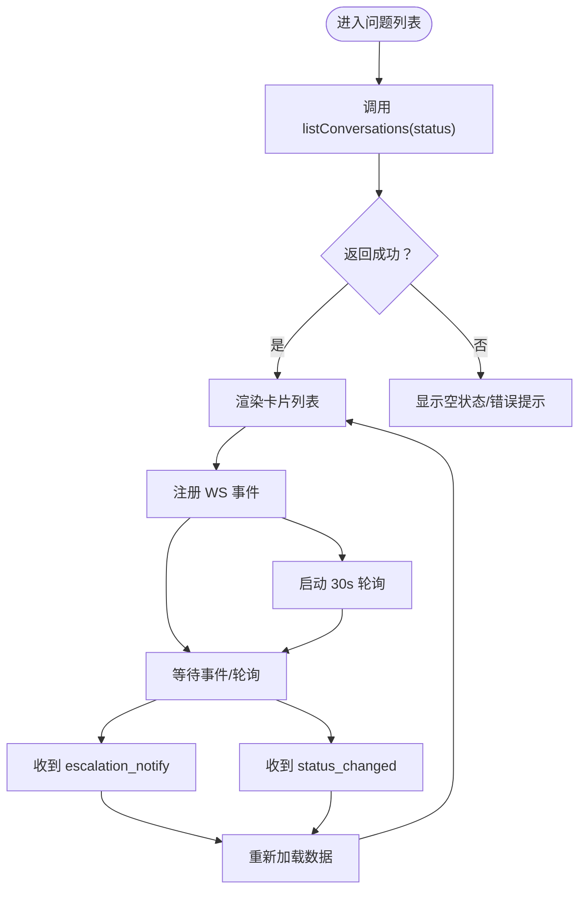
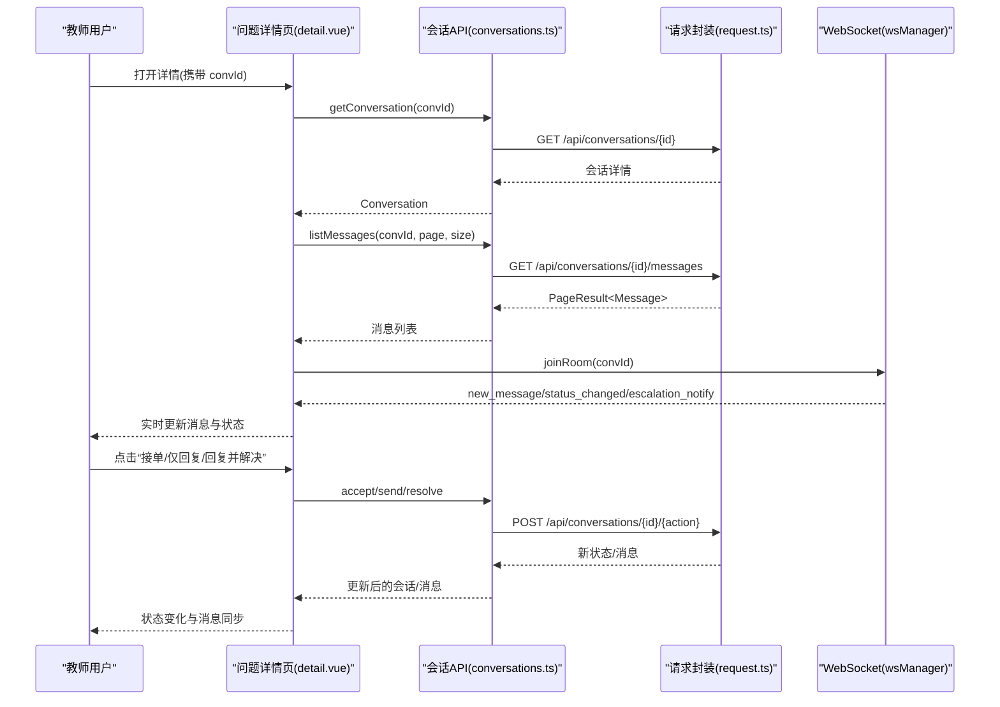
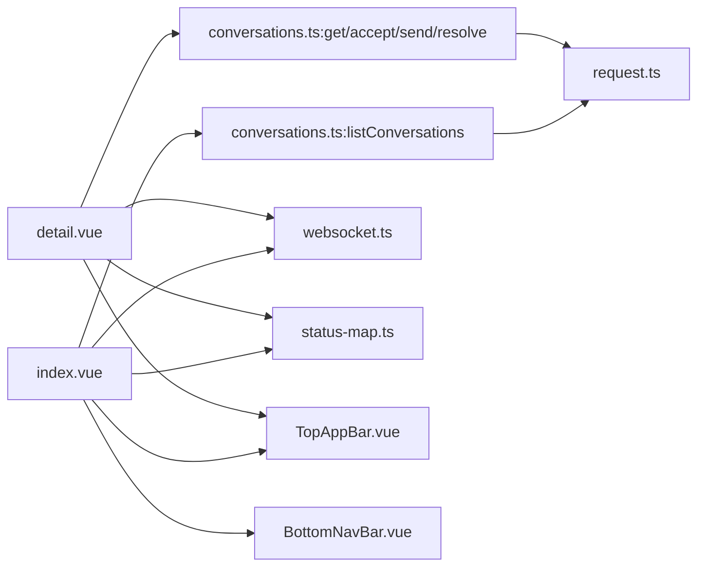

# 问题管理页面

<cite>
**本文引用的文件**
- [apps/teacher-app/src/pages/questions/index.vue](file://apps/teacher-app/src/pages/questions/index.vue)
- [apps/teacher-app/src/pages/questions/detail.vue](file://apps/teacher-app/src/pages/questions/detail.vue)
- [apps/teacher-app/src/api/conversations.ts](file://apps/teacher-app/src/api/conversations.ts)
- [apps/teacher-app/src/utils/request.ts](file://apps/teacher-app/src/utils/request.ts)
- [apps/teacher-app/src/utils/status-map.ts](file://apps/teacher-app/src/utils/status-map.ts)
- [apps/teacher-app/src/utils/websocket.ts](file://apps/teacher-app/src/utils/websocket.ts)
- [apps/teacher-app/src/stores/user.ts](file://apps/teacher-app/src/stores/user.ts)
- [apps/teacher-app/src/components/TopAppBar.vue](file://apps/teacher-app/src/components/TopAppBar.vue)
- [apps/teacher-app/src/components/BottomNavBar.vue](file://apps/teacher-app/src/components/BottomNavBar.vue)
- [apps/teacher-app/src/styles/theme.scss](file://apps/teacher-app/src/styles/theme.scss)
- [apps/teacher-app/src/main.ts](file://apps/teacher-app/src/main.ts)
- [apps/teacher-app/src/pages.json](file://apps/teacher-app/src/pages.json)
</cite>

## 目录
1. [简介](#简介)
2. [项目结构](#项目结构)
3. [核心组件](#核心组件)
4. [架构总览](#架构总览)
5. [详细组件分析](#详细组件分析)
6. [依赖关系分析](#依赖关系分析)
7. [性能考量](#性能考量)
8. [故障排查指南](#故障排查指南)
9. [结论](#结论)
10. [附录](#附录)

## 简介
本文件面向“医小管 v2 教师端问题管理页面”，系统性解析问题列表与问题详情两大页面的功能实现，涵盖以下关键主题：
- 问题工单的筛选与排序（按状态分组）
- 问题状态流转控制（待处理、处理中、已解决、已关闭）
- 问题详情的展示与编辑（消息流、状态标签、操作栏）
- 问题处理的操作流程（接单、回复、解决）
- 数据获取机制（HTTP API + WebSocket 实时推送）
- 状态管理策略（Pinia Store + 登录态）
- 错误处理与兜底策略（轮询、Toast 提示）
- 扩展能力（问题分类展示、搜索过滤、批量操作、实时状态更新）

## 项目结构
教师端问题管理页面位于 teacher-app 的 pages/questions 目录，采用 Vue 3 + TypeScript + UniApp 技术栈，结合 Pinia 状态管理与自研 WebSocket 管理器，实现问题工单的高效流转与实时交互。

图表来源
- [apps/teacher-app/src/pages/questions/index.vue:1-462](file://apps/teacher-app/src/pages/questions/index.vue#L1-L462)
- [apps/teacher-app/src/pages/questions/detail.vue:1-694](file://apps/teacher-app/src/pages/questions/detail.vue#L1-L694)
- [apps/teacher-app/src/api/conversations.ts:1-44](file://apps/teacher-app/src/api/conversations.ts#L1-L44)
- [apps/teacher-app/src/utils/request.ts:1-108](file://apps/teacher-app/src/utils/request.ts#L1-L108)
- [apps/teacher-app/src/utils/websocket.ts:1-169](file://apps/teacher-app/src/utils/websocket.ts#L1-L169)
- [apps/teacher-app/src/utils/status-map.ts:1-30](file://apps/teacher-app/src/utils/status-map.ts#L1-L30)
- [apps/teacher-app/src/stores/user.ts:1-63](file://apps/teacher-app/src/stores/user.ts#L1-L63)
- [apps/teacher-app/src/components/TopAppBar.vue:1-160](file://apps/teacher-app/src/components/TopAppBar.vue#L1-L160)
- [apps/teacher-app/src/components/BottomNavBar.vue:1-147](file://apps/teacher-app/src/components/BottomNavBar.vue#L1-L147)
- [apps/teacher-app/src/styles/theme.scss:1-88](file://apps/teacher-app/src/styles/theme.scss#L1-L88)
- [apps/teacher-app/src/main.ts:1-25](file://apps/teacher-app/src/main.ts#L1-L25)
- [apps/teacher-app/src/pages.json:1-84](file://apps/teacher-app/src/pages.json#L1-L84)

章节来源
- [apps/teacher-app/src/pages/questions/index.vue:1-462](file://apps/teacher-app/src/pages/questions/index.vue#L1-L462)
- [apps/teacher-app/src/pages/questions/detail.vue:1-694](file://apps/teacher-app/src/pages/questions/detail.vue#L1-L694)
- [apps/teacher-app/src/pages.json:1-84](file://apps/teacher-app/src/pages.json#L1-L84)

## 核心组件
- 问题列表页（index.vue）
  - 功能：筛选（全部/待处理/处理中/已解决）、加载工单、卡片展示（头像、学生信息、状态标签、AI 匹配度进度条）、跳转详情、底部导航徽章计数。
  - 关键逻辑：使用会话列表 API，按状态过滤；监听 WebSocket 事件进行实时刷新；30 秒轮询兜底。
- 问题详情页（detail.vue）
  - 功能：展示学生信息卡片、完整消息流（学生/AI/教师/系统）、固定底部操作栏（接单/仅回复/回复并解决/已解决/已关闭）、点击刷新（处理中）。
  - 关键逻辑：进入详情加入房间订阅消息；根据状态渲染不同操作按钮；发送消息与状态变更通过 API 与 WebSocket 同步。
- API 层（conversations.ts）
  - 提供：会话列表、会话详情、消息列表、发送消息、接单、解决。
- 请求封装（request.ts）
  - 统一注入 Authorization、处理 401、HTTP 错误码、超时与网络异常。
- 状态映射（status-map.ts）
  - 将状态字符串映射为展示文本与样式类名。
- WebSocket 管理（websocket.ts）
  - 单连接、房间模式、自动重连、心跳、发送队列、重入房间。
- 用户状态（user.ts）
  - Token 与用户信息持久化、登出清理。
- 顶部栏与底部导航（TopAppBar.vue、BottomNavBar.vue）
  - 通用 UI 组件，提供返回、动作按钮与底部导航切换。
- 主题样式（theme.scss）
  - MD3 风格色彩系统，用于统一视觉风格。
- 应用入口（main.ts）
  - 初始化 Pinia、读取本地登录态、自动建立 WebSocket 连接。
- 页面路由（pages.json）
  - 配置问题管理页面路径与标题。

章节来源
- [apps/teacher-app/src/pages/questions/index.vue:85-189](file://apps/teacher-app/src/pages/questions/index.vue#L85-L189)
- [apps/teacher-app/src/pages/questions/detail.vue:145-312](file://apps/teacher-app/src/pages/questions/detail.vue#L145-L312)
- [apps/teacher-app/src/api/conversations.ts:1-44](file://apps/teacher-app/src/api/conversations.ts#L1-L44)
- [apps/teacher-app/src/utils/request.ts:1-108](file://apps/teacher-app/src/utils/request.ts#L1-L108)
- [apps/teacher-app/src/utils/status-map.ts:1-30](file://apps/teacher-app/src/utils/status-map.ts#L1-L30)
- [apps/teacher-app/src/utils/websocket.ts:1-169](file://apps/teacher-app/src/utils/websocket.ts#L1-L169)
- [apps/teacher-app/src/stores/user.ts:1-63](file://apps/teacher-app/src/stores/user.ts#L1-L63)
- [apps/teacher-app/src/components/TopAppBar.vue:1-160](file://apps/teacher-app/src/components/TopAppBar.vue#L1-L160)
- [apps/teacher-app/src/components/BottomNavBar.vue:1-147](file://apps/teacher-app/src/components/BottomNavBar.vue#L1-L147)
- [apps/teacher-app/src/styles/theme.scss:1-88](file://apps/teacher-app/src/styles/theme.scss#L1-L88)
- [apps/teacher-app/src/main.ts:1-25](file://apps/teacher-app/src/main.ts#L1-L25)
- [apps/teacher-app/src/pages.json:1-84](file://apps/teacher-app/src/pages.json#L1-L84)

## 架构总览
问题管理页面采用“页面 + API 层 + 请求封装 + WebSocket 管理 + 状态映射”的分层设计，页面负责视图与交互，API 层负责业务接口，请求封装统一处理鉴权与错误，WebSocket 实现实时消息与状态变更通知，Pinia Store 管理用户登录态。

图表来源
- [apps/teacher-app/src/pages/questions/index.vue:135-188](file://apps/teacher-app/src/pages/questions/index.vue#L135-L188)
- [apps/teacher-app/src/api/conversations.ts:7-14](file://apps/teacher-app/src/api/conversations.ts#L7-L14)
- [apps/teacher-app/src/utils/request.ts:10-77](file://apps/teacher-app/src/utils/request.ts#L10-L77)
- [apps/teacher-app/src/utils/websocket.ts:37-44](file://apps/teacher-app/src/utils/websocket.ts#L37-L44)

章节来源
- [apps/teacher-app/src/pages/questions/index.vue:135-188](file://apps/teacher-app/src/pages/questions/index.vue#L135-L188)
- [apps/teacher-app/src/api/conversations.ts:1-44](file://apps/teacher-app/src/api/conversations.ts#L1-L44)
- [apps/teacher-app/src/utils/request.ts:1-108](file://apps/teacher-app/src/utils/request.ts#L1-L108)
- [apps/teacher-app/src/utils/websocket.ts:1-169](file://apps/teacher-app/src/utils/websocket.ts#L1-L169)

## 详细组件分析

### 问题列表页（index.vue）
- 筛选与排序
  - 通过 filterTabs 定义“全部/待处理/处理中/已解决”四类标签，切换时调用 loadData 并传入对应 status 参数。
  - 使用 listConversations(status) 获取分页数据，支持 total 计数与底部导航徽章联动。
- 数据展示
  - 卡片包含：学生头像占位、学号/标题/时间、状态标签、问题摘要、AI 匹配度百分比与进度条。
  - 时间格式化：支持“刚刚/分钟前/小时前/天前/日期”人性化显示。
- 交互与生命周期
  - onMounted：首次加载、注册 WebSocket 事件、启动 30 秒轮询。
  - onShow：页面可见时再次加载，保证数据新鲜度。
  - onUnmounted：清理事件与轮询，避免内存泄漏。
- 实时更新
  - 监听 escalation_notify 与 status_changed 事件，触发局部刷新。
  - 轮询兜底：即使 WS 断线或丢包，也能定时拉取最新数据。

图表来源
- [apps/teacher-app/src/pages/questions/index.vue:95-188](file://apps/teacher-app/src/pages/questions/index.vue#L95-L188)
- [apps/teacher-app/src/api/conversations.ts:7-14](file://apps/teacher-app/src/api/conversations.ts#L7-L14)
- [apps/teacher-app/src/utils/websocket.ts:37-44](file://apps/teacher-app/src/utils/websocket.ts#L37-L44)

章节来源
- [apps/teacher-app/src/pages/questions/index.vue:85-189](file://apps/teacher-app/src/pages/questions/index.vue#L85-L189)

### 问题详情页（detail.vue）
- 详情加载
  - 通过 onLoad 获取 convId，调用 getConversation 获取会话详情，随后加载消息列表。
  - 加入房间（joinRoom）以接收实时消息与状态变更。
- 消息展示
  - 支持四种消息类型：学生、AI、教师、系统；时间格式化为“月-日 小时:分钟”。
  - 处理中状态下提供“点击刷新”按钮，手动触发消息拉取。
- 操作栏
  - 待处理：显示“接单处理”按钮，调用 acceptConversation。
  - 处理中：显示“仅回复”和“回复并解决”两个按钮，先发送消息再可选择解决。
  - 已解决/已关闭：禁用操作按钮，仅展示状态。
- WebSocket 事件
  - new_message：追加新消息至列表。
  - status_changed：更新会话状态并刷新消息。
  - escalation_notify：重新加载详情（兜底）。

图表来源
- [apps/teacher-app/src/pages/questions/detail.vue:145-312](file://apps/teacher-app/src/pages/questions/detail.vue#L145-L312)
- [apps/teacher-app/src/api/conversations.ts:16-43](file://apps/teacher-app/src/api/conversations.ts#L16-L43)
- [apps/teacher-app/src/utils/request.ts:10-77](file://apps/teacher-app/src/utils/request.ts#L10-L77)
- [apps/teacher-app/src/utils/websocket.ts:46-54](file://apps/teacher-app/src/utils/websocket.ts#L46-L54)

章节来源
- [apps/teacher-app/src/pages/questions/detail.vue:145-312](file://apps/teacher-app/src/pages/questions/detail.vue#L145-L312)

### 状态映射与 UI 呈现
- 状态映射
  - getStatusText：将状态字符串映射为中文展示文本（如“待处理/处理中/已解决/已关闭”）。
  - getStatusClass：将状态映射为样式类名，用于状态标签的颜色与样式区分。
- 列表页状态标签
  - 不同状态使用不同背景色与文字色，配合小圆点指示器，提升可读性。
- 详情页状态标签
  - 与列表页一致，同时在操作栏根据状态动态渲染按钮。

章节来源
- [apps/teacher-app/src/utils/status-map.ts:1-30](file://apps/teacher-app/src/utils/status-map.ts#L1-L30)
- [apps/teacher-app/src/pages/questions/index.vue:340-386](file://apps/teacher-app/src/pages/questions/index.vue#L340-L386)
- [apps/teacher-app/src/pages/questions/detail.vue:395-424](file://apps/teacher-app/src/pages/questions/detail.vue#L395-L424)

### WebSocket 管理器（wsManager）
- 设计要点
  - 单连接模型，支持 join_room/leave_room 房间订阅。
  - 自动重连（指数退避，上限 30 秒），心跳保活（每 30 秒 ping）。
  - 发送队列：断线期间的消息缓存，连上后 flush。
  - 事件分发：按 type 分发到注册的处理器，支持通配符事件。
- 在问题管理中的应用
  - 列表页：订阅 escalation_notify 与 status_changed，触发局部刷新。
  - 详情页：加入房间订阅 new_message/status_changed/escalation_notify，实时更新消息与状态。

章节来源
- [apps/teacher-app/src/utils/websocket.ts:1-169](file://apps/teacher-app/src/utils/websocket.ts#L1-L169)
- [apps/teacher-app/src/pages/questions/index.vue:172-188](file://apps/teacher-app/src/pages/questions/index.vue#L172-L188)
- [apps/teacher-app/src/pages/questions/detail.vue:293-311](file://apps/teacher-app/src/pages/questions/detail.vue#L293-L311)

### 请求封装与错误处理
- 统一请求
  - 自动拼接 BASE_URL 与查询参数，注入 Authorization: Bearer token。
  - 处理 401：弹出提示、清空登录态、跳转登录页。
  - 处理 HTTP 错误码：提取 detail 或默认提示。
  - 网络异常：统一 Toast 提示。
- API 调用
  - 会话列表、详情、消息列表、发送消息、接单、解决均通过 request 封装发起。

章节来源
- [apps/teacher-app/src/utils/request.ts:1-108](file://apps/teacher-app/src/utils/request.ts#L1-L108)
- [apps/teacher-app/src/api/conversations.ts:1-44](file://apps/teacher-app/src/api/conversations.ts#L1-L44)

### 用户状态与应用初始化
- 用户 Store
  - 持久化存储 token 与用户信息，提供登录态判断与显示名称。
- 应用入口
  - 初始化 Pinia，读取本地登录态；若存在 token，则自动建立 WebSocket 连接。

章节来源
- [apps/teacher-app/src/stores/user.ts:1-63](file://apps/teacher-app/src/stores/user.ts#L1-L63)
- [apps/teacher-app/src/main.ts:1-25](file://apps/teacher-app/src/main.ts#L1-L25)

## 依赖关系分析
- 页面对 API 的依赖
  - index.vue 依赖 conversations.listConversations；detail.vue 依赖 getConversation/listMessages/sendMessage/acceptConversation/resolveConversation。
- API 对请求封装的依赖
  - 所有 API 均通过 request 封装发起，确保统一鉴权与错误处理。
- 页面对 WebSocket 的依赖
  - 两页面均依赖 wsManager 的 on/off/joinRoom/leaveRoom 与事件分发。
- 页面对状态映射的依赖
  - 通过 getStatusText/getStatusClass 渲染状态标签与样式。
- 页面对 UI 组件的依赖
  - 顶部栏与底部导航为通用组件，减少重复代码。

图表来源
- [apps/teacher-app/src/pages/questions/index.vue:91-93](file://apps/teacher-app/src/pages/questions/index.vue#L91-L93)
- [apps/teacher-app/src/pages/questions/detail.vue:150-152](file://apps/teacher-app/src/pages/questions/detail.vue#L150-L152)
- [apps/teacher-app/src/api/conversations.ts:1-44](file://apps/teacher-app/src/api/conversations.ts#L1-L44)
- [apps/teacher-app/src/utils/request.ts:1-108](file://apps/teacher-app/src/utils/request.ts#L1-L108)
- [apps/teacher-app/src/utils/websocket.ts:1-169](file://apps/teacher-app/src/utils/websocket.ts#L1-L169)
- [apps/teacher-app/src/utils/status-map.ts:1-30](file://apps/teacher-app/src/utils/status-map.ts#L1-L30)
- [apps/teacher-app/src/components/TopAppBar.vue:1-160](file://apps/teacher-app/src/components/TopAppBar.vue#L1-L160)
- [apps/teacher-app/src/components/BottomNavBar.vue:1-147](file://apps/teacher-app/src/components/BottomNavBar.vue#L1-L147)

章节来源
- [apps/teacher-app/src/pages/questions/index.vue:91-93](file://apps/teacher-app/src/pages/questions/index.vue#L91-L93)
- [apps/teacher-app/src/pages/questions/detail.vue:150-152](file://apps/teacher-app/src/pages/questions/detail.vue#L150-L152)
- [apps/teacher-app/src/api/conversations.ts:1-44](file://apps/teacher-app/src/api/conversations.ts#L1-L44)
- [apps/teacher-app/src/utils/request.ts:1-108](file://apps/teacher-app/src/utils/request.ts#L1-L108)
- [apps/teacher-app/src/utils/websocket.ts:1-169](file://apps/teacher-app/src/utils/websocket.ts#L1-L169)
- [apps/teacher-app/src/utils/status-map.ts:1-30](file://apps/teacher-app/src/utils/status-map.ts#L1-L30)
- [apps/teacher-app/src/components/TopAppBar.vue:1-160](file://apps/teacher-app/src/components/TopAppBar.vue#L1-L160)
- [apps/teacher-app/src/components/BottomNavBar.vue:1-147](file://apps/teacher-app/src/components/BottomNavBar.vue#L1-L147)

## 性能考量
- 列表渲染优化
  - 使用虚拟滚动/懒加载可进一步优化长列表性能（当前为简单列表渲染）。
  - 卡片入场动画延迟错峰，提升首屏体验。
- 网络与实时性
  - WebSocket 优先，30 秒轮询兜底，降低延迟与服务器压力。
  - 发送队列与重连机制保障消息可达性。
- 请求与缓存
  - 详情页进入时一次性加载会话与消息，后续通过 WS 实时增量更新，减少重复请求。
- 错误与降级
  - 401 自动登出，网络失败统一提示，避免页面卡死。

## 故障排查指南
- 无法加载工单/消息
  - 检查网络与 401 处理：确认 token 是否有效，必要时重新登录。
  - 查看请求封装的错误提示与状态码。
- WebSocket 不生效
  - 检查 wsManager 是否已 connect，是否加入房间，是否存在断线重连日志。
  - 确认后端 WS 地址与 token 参数正确。
- 状态不更新
  - 确认已订阅 status_changed 与 escalation_notify 事件。
  - 若 WS 异常，检查轮询是否正常执行。
- 操作按钮不可用
  - 检查当前会话状态是否为“待处理/处理中/已解决/已关闭”，不同状态按钮可用性不同。
- 详情页消息不显示
  - 确认 joinRoom 成功，new_message 事件是否被触发；必要时点击“刷新”手动拉取。

章节来源
- [apps/teacher-app/src/utils/request.ts:42-64](file://apps/teacher-app/src/utils/request.ts#L42-L64)
- [apps/teacher-app/src/utils/websocket.ts:78-114](file://apps/teacher-app/src/utils/websocket.ts#L78-L114)
- [apps/teacher-app/src/pages/questions/index.vue:172-188](file://apps/teacher-app/src/pages/questions/index.vue#L172-L188)
- [apps/teacher-app/src/pages/questions/detail.vue:293-311](file://apps/teacher-app/src/pages/questions/detail.vue#L293-L311)

## 结论
问题管理页面通过清晰的分层设计与完善的实时机制，实现了从问题发现、筛选、处理到解决的闭环流程。列表页强调效率与实时性，详情页强调交互与状态一致性。借助统一的请求封装与 WebSocket 管理器，系统在复杂场景下仍能保持稳定与可维护性。建议后续可引入搜索过滤、批量操作与更丰富的统计可视化，以进一步提升教师的工作效率。

## 附录
- 页面路由配置
  - 问题列表与详情页已在 pages.json 中注册，标题与导航样式统一。
- 主题与样式
  - 使用 MD3 风格色彩系统，确保视觉一致性与可读性。
- 最佳实践
  - 状态流转严格遵循后端状态机，前端仅做展示与交互约束。
  - 重要操作（接单/解决）增加二次确认与加载态，提升可靠性。
  - 对于长列表与高频刷新，建议引入分页与节流策略。

章节来源
- [apps/teacher-app/src/pages.json:17-44](file://apps/teacher-app/src/pages.json#L17-L44)
- [apps/teacher-app/src/styles/theme.scss:1-88](file://apps/teacher-app/src/styles/theme.scss#L1-L88)