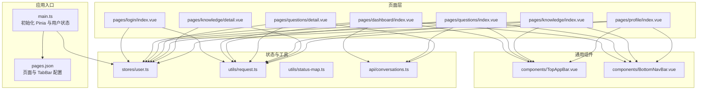
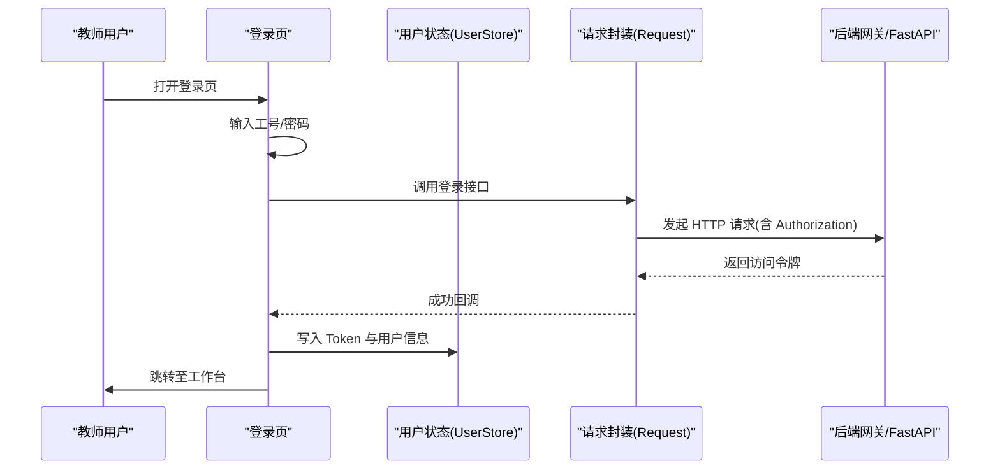
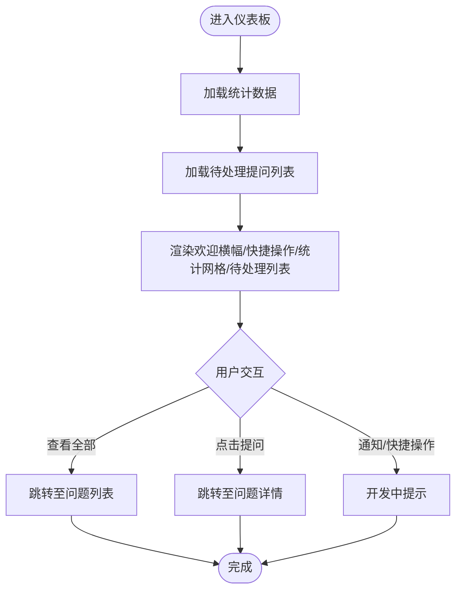
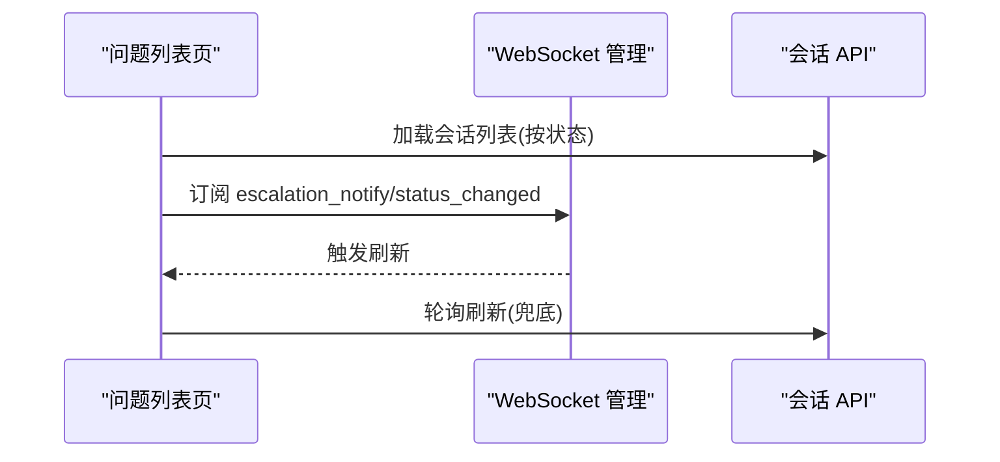
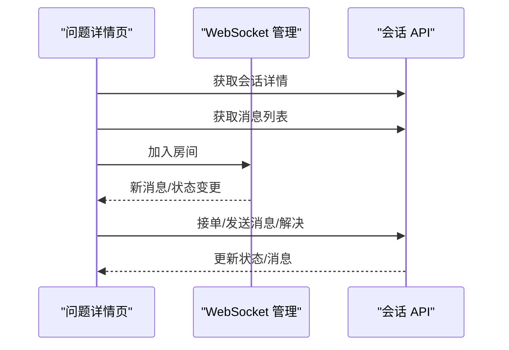
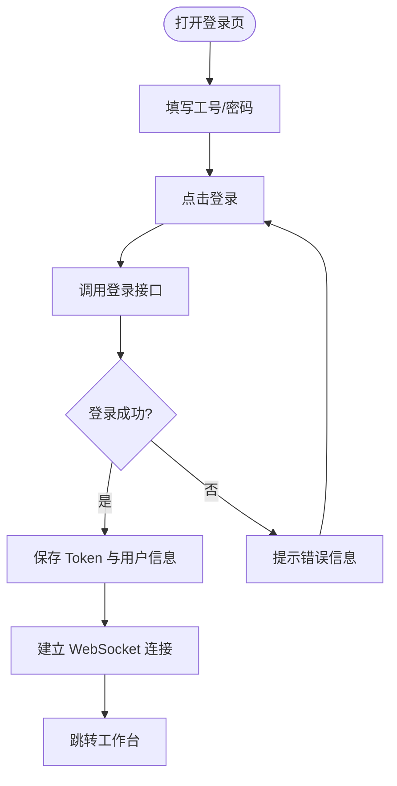
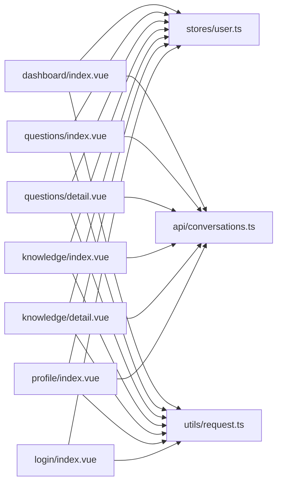

# 页面组件

<cite>
**本文引用的文件**
- [apps/teacher-app/src/pages/dashboard/index.vue](file://apps/teacher-app/src/pages/dashboard/index.vue)
- [apps/teacher-app/src/pages/questions/index.vue](file://apps/teacher-app/src/pages/questions/index.vue)
- [apps/teacher-app/src/pages/questions/detail.vue](file://apps/teacher-app/src/pages/questions/detail.vue)
- [apps/teacher-app/src/pages/knowledge/index.vue](file://apps/teacher-app/src/pages/knowledge/index.vue)
- [apps/teacher-app/src/pages/knowledge/detail.vue](file://apps/teacher-app/src/pages/knowledge/detail.vue)
- [apps/teacher-app/src/pages/login/index.vue](file://apps/teacher-app/src/pages/login/index.vue)
- [apps/teacher-app/src/pages/profile/index.vue](file://apps/teacher-app/src/pages/profile/index.vue)
- [apps/teacher-app/src/components/TopAppBar.vue](file://apps/teacher-app/src/components/TopAppBar.vue)
- [apps/teacher-app/src/components/BottomNavBar.vue](file://apps/teacher-app/src/components/BottomNavBar.vue)
- [apps/teacher-app/src/stores/user.ts](file://apps/teacher-app/src/stores/user.ts)
- [apps/teacher-app/src/api/conversations.ts](file://apps/teacher-app/src/api/conversations.ts)
- [apps/teacher-app/src/utils/status-map.ts](file://apps/teacher-app/src/utils/status-map.ts)
- [apps/teacher-app/src/utils/request.ts](file://apps/teacher-app/src/utils/request.ts)
- [apps/teacher-app/src/main.ts](file://apps/teacher-app/src/main.ts)
- [apps/teacher-app/src/pages.json](file://apps/teacher-app/src/pages.json)
</cite>

## 目录
1. [简介](#简介)
2. [项目结构](#项目结构)
3. [核心组件](#核心组件)
4. [架构总览](#架构总览)
5. [详细组件分析](#详细组件分析)
6. [依赖关系分析](#依赖关系分析)
7. [性能考量](#性能考量)
8. [故障排查指南](#故障排查指南)
9. [结论](#结论)
10. [附录](#附录)

## 简介
本文件面向“医小管 v2 教师端”应用，系统化梳理教师端页面组件的实现与交互，覆盖仪表板、问题管理、知识库、登录、个人资料等页面。文档重点阐述：
- 各页面的功能职责与数据流
- 路由配置与页面间导航
- 数据绑定、事件处理与组件交互
- 状态管理与鉴权机制
- 响应式布局与用户体验优化
- WebSocket 实时推送与轮询兜底策略
- 可能的性能瓶颈与优化建议

## 项目结构
教师端采用基于 Vue 3 + Pinia + UniApp 的多页面架构，页面通过 pages.json 声明式注册，底部 TabBar 提供跨页面导航；顶部自定义 TopAppBar 为各页面提供统一的头部行为。

图表来源
- [apps/teacher-app/src/main.ts:1-25](file://apps/teacher-app/src/main.ts#L1-L25)
- [apps/teacher-app/src/pages.json:1-84](file://apps/teacher-app/src/pages.json#L1-L84)
- [apps/teacher-app/src/pages/dashboard/index.vue:1-669](file://apps/teacher-app/src/pages/dashboard/index.vue#L1-L669)
- [apps/teacher-app/src/pages/questions/index.vue:1-462](file://apps/teacher-app/src/pages/questions/index.vue#L1-L462)
- [apps/teacher-app/src/pages/questions/detail.vue:1-694](file://apps/teacher-app/src/pages/questions/detail.vue#L1-L694)
- [apps/teacher-app/src/pages/knowledge/index.vue:1-493](file://apps/teacher-app/src/pages/knowledge/index.vue#L1-L493)
- [apps/teacher-app/src/pages/knowledge/detail.vue:1-397](file://apps/teacher-app/src/pages/knowledge/detail.vue#L1-L397)
- [apps/teacher-app/src/pages/login/index.vue:1-567](file://apps/teacher-app/src/pages/login/index.vue#L1-L567)
- [apps/teacher-app/src/pages/profile/index.vue:1-442](file://apps/teacher-app/src/pages/profile/index.vue#L1-L442)
- [apps/teacher-app/src/components/TopAppBar.vue:1-160](file://apps/teacher-app/src/components/TopAppBar.vue#L1-L160)
- [apps/teacher-app/src/components/BottomNavBar.vue:1-147](file://apps/teacher-app/src/components/BottomNavBar.vue#L1-L147)
- [apps/teacher-app/src/stores/user.ts:1-63](file://apps/teacher-app/src/stores/user.ts#L1-L63)
- [apps/teacher-app/src/api/conversations.ts:1-44](file://apps/teacher-app/src/api/conversations.ts#L1-L44)
- [apps/teacher-app/src/utils/request.ts:1-108](file://apps/teacher-app/src/utils/request.ts#L1-L108)
- [apps/teacher-app/src/utils/status-map.ts:1-30](file://apps/teacher-app/src/utils/status-map.ts#L1-L30)

章节来源
- [apps/teacher-app/src/pages.json:1-84](file://apps/teacher-app/src/pages.json#L1-L84)
- [apps/teacher-app/src/main.ts:1-25](file://apps/teacher-app/src/main.ts#L1-L25)

## 核心组件
- 顶部自定义栏 TopAppBar：统一标题、返回与右侧动作（搜索/设置/新增/编辑）
- 底部导航栏 BottomNavBar：Tab 切换、徽标提醒、当前页高亮
- 用户状态管理：Token 与用户信息持久化、鉴权拦截与自动重定向
- 会话 API：会话列表、详情、消息列表、教师接单与解决
- 请求封装：统一注入 Authorization、错误处理与 401 自动登出

章节来源
- [apps/teacher-app/src/components/TopAppBar.vue:1-160](file://apps/teacher-app/src/components/TopAppBar.vue#L1-L160)
- [apps/teacher-app/src/components/BottomNavBar.vue:1-147](file://apps/teacher-app/src/components/BottomNavBar.vue#L1-L147)
- [apps/teacher-app/src/stores/user.ts:1-63](file://apps/teacher-app/src/stores/user.ts#L1-L63)
- [apps/teacher-app/src/api/conversations.ts:1-44](file://apps/teacher-app/src/api/conversations.ts#L1-L44)
- [apps/teacher-app/src/utils/request.ts:1-108](file://apps/teacher-app/src/utils/request.ts#L1-L108)

## 架构总览
教师端整体采用“页面 + 组件 + 状态 + API”的分层设计。页面通过 Pinia 管理登录态与用户信息，使用统一请求封装进行后端交互；问题详情页集成 WebSocket 实时推送与轮询兜底，确保消息与状态变更的及时性。

图表来源
- [apps/teacher-app/src/pages/login/index.vue:165-191](file://apps/teacher-app/src/pages/login/index.vue#L165-L191)
- [apps/teacher-app/src/stores/user.ts:30-38](file://apps/teacher-app/src/stores/user.ts#L30-L38)
- [apps/teacher-app/src/utils/request.ts:10-77](file://apps/teacher-app/src/utils/request.ts#L10-L77)

## 详细组件分析

### 仪表板页面（dashboard/index.vue）
- 功能概览
  - 顶部自定义栏：标题“工作台”，右侧通知图标（开发中）
  - 欢迎横幅：显示教师昵称与待处理提问数
  - 快捷操作：新建知识、发布通知、数据报告、系统设置（开发中）
  - 统计网格：今日提问、待处理、知识条目、今日审批（v2 以会话统计）
  - 待处理提问列表：支持查看全部与跳转详情
  - 底部导航：当前页为“工作台”，徽标显示待处理数量
- 数据绑定与事件
  - 用户名来自用户状态计算属性
  - 统计数据通过会话列表接口聚合
  - 列表加载与刷新在挂载与页面显示时触发
- 导航与交互
  - “查看全部”跳转至问题列表页
  - 列表项点击进入问题详情页
  - 通知与快捷操作目前为开发中提示

图表来源
- [apps/teacher-app/src/pages/dashboard/index.vue:200-251](file://apps/teacher-app/src/pages/dashboard/index.vue#L200-L251)

章节来源
- [apps/teacher-app/src/pages/dashboard/index.vue:1-669](file://apps/teacher-app/src/pages/dashboard/index.vue#L1-L669)
- [apps/teacher-app/src/api/conversations.ts:7-14](file://apps/teacher-app/src/api/conversations.ts#L7-L14)

### 问题管理页面（questions/index.vue）
- 功能概览
  - 顶部自定义栏：标题“学生提问”，右侧搜索
  - 分类筛选：全部/待处理/处理中/已解决
  - 问题列表：头像占位、学生信息、状态标签、AI 匹配度进度条
  - 底部导航：当前页为“学生提问”，徽标显示总数
- 数据绑定与事件
  - 通过会话列表接口按状态过滤
  - 时间格式化与匹配度分级展示
  - 列表加载在挂载、显示与 WebSocket 事件触发时执行
- 实时性保障
  - WebSocket 监听“升级通知/状态变更”事件
  - 轮询兜底：30 秒一次，避免事件丢失

图表来源
- [apps/teacher-app/src/pages/questions/index.vue:135-188](file://apps/teacher-app/src/pages/questions/index.vue#L135-L188)
- [apps/teacher-app/src/api/conversations.ts:7-14](file://apps/teacher-app/src/api/conversations.ts#L7-L14)

章节来源
- [apps/teacher-app/src/pages/questions/index.vue:1-462](file://apps/teacher-app/src/pages/questions/index.vue#L1-L462)
- [apps/teacher-app/src/utils/status-map.ts:1-30](file://apps/teacher-app/src/utils/status-map.ts#L1-L30)

### 问题详情页面（questions/detail.vue）
- 功能概览
  - 顶部自定义栏：标题“提问详情”，返回按钮
  - 学生信息卡片：头像占位、在线指示、状态标签
  - 会话消息流：学生/教师/AI/系统消息分发
  - 底部固定操作栏：根据状态显示“接单/仅回复/回复并解决/已解决/已关闭”
- 数据绑定与事件
  - 通过会话详情与消息列表接口加载
  - WebSocket 加入房间监听新消息与状态变更
  - 支持手动刷新（处理中）
- 交互流程
  - 待处理：点击接单，状态切换为处理中
  - 处理中：输入回复内容，可选择仅回复或回复并解决
  - 已解决/已关闭：禁用操作

图表来源
- [apps/teacher-app/src/pages/questions/detail.vue:174-311](file://apps/teacher-app/src/pages/questions/detail.vue#L174-L311)
- [apps/teacher-app/src/api/conversations.ts:16-43](file://apps/teacher-app/src/api/conversations.ts#L16-L43)

章节来源
- [apps/teacher-app/src/pages/questions/detail.vue:1-694](file://apps/teacher-app/src/pages/questions/detail.vue#L1-L694)

### 知识库页面（knowledge/index.vue）
- 功能概览
  - 顶部自定义栏：标题“知识库”，右侧新增
  - 搜索框：支持按标题检索
  - 分类标签：全部/教务管理/学生服务/生活指南
  - 知识条目列表：分类标签、状态点与文本、摘要、作者与时间
  - 底部导航：当前页为“知识库”
- 数据绑定与事件
  - 通过知识条目接口加载，支持分类与标题过滤
  - 时间格式化与状态映射
  - 列表项点击进入详情页

章节来源
- [apps/teacher-app/src/pages/knowledge/index.vue:1-493](file://apps/teacher-app/src/pages/knowledge/index.vue#L1-L493)

### 知识详情页面（knowledge/detail.vue）
- 功能概览
  - 顶部自定义栏：标题“知识详情”，右侧编辑（开发中）
  - 英雄区：分类标签、状态标签、标题、作者与更新时间
  - 内容区：正文展示
  - 底部操作栏：下线、编辑（开发中）
- 数据绑定与事件
  - 通过知识详情接口加载
  - 下线操作二次确认

章节来源
- [apps/teacher-app/src/pages/knowledge/detail.vue:1-397](file://apps/teacher-app/src/pages/knowledge/detail.vue#L1-L397)

### 登录页面（login/index.vue）
- 功能概览
  - 背景装饰光晕、中心登录卡片
  - 表单项：用户名、密码、记住我、显示/隐藏密码
  - 其他登录方式：二维码、指纹（开发中）
  - 登录按钮：调用登录接口并写入用户信息与 Token
- 数据绑定与事件
  - 输入校验与加载状态
  - 登录成功后建立 WebSocket 连接并跳转工作台
  - 401 自动登出与跳转

图表来源
- [apps/teacher-app/src/pages/login/index.vue:165-191](file://apps/teacher-app/src/pages/login/index.vue#L165-L191)
- [apps/teacher-app/src/utils/request.ts:42-48](file://apps/teacher-app/src/utils/request.ts#L42-L48)

章节来源
- [apps/teacher-app/src/pages/login/index.vue:1-567](file://apps/teacher-app/src/pages/login/index.vue#L1-L567)
- [apps/teacher-app/src/stores/user.ts:30-38](file://apps/teacher-app/src/stores/user.ts#L30-L38)

### 个人资料页面（profile/index.vue）
- 功能概览
  - 顶部自定义栏：标题“我的”，右侧设置
  - 个人信息卡：姓名、职称/院系、工号标签
  - 统计网格：累计处理、本月审批、知识入库
  - 设置列表：通知提醒、声音提示、AI 自动回复（开关）、修改密码、关于我们（导航）、退出登录
  - 底部导航：当前页为“我的”
- 数据绑定与事件
  - 用户信息来自用户状态计算属性
  - 退出登录清空状态并回到登录页

章节来源
- [apps/teacher-app/src/pages/profile/index.vue:1-442](file://apps/teacher-app/src/pages/profile/index.vue#L1-L442)

## 依赖关系分析
- 页面到组件
  - 各页面均依赖顶部自定义栏与底部导航栏，保证一致的导航体验
- 页面到状态
  - 登录页、仪表板、问题列表、问题详情、知识库、知识详情、个人资料均读取/写入用户状态
- 页面到 API
  - 问题相关页面依赖会话 API；知识相关页面依赖知识 API
- 状态到存储
  - 用户状态持久化于本地存储，应用启动时初始化
- 请求到后端
  - 统一请求封装自动注入 Authorization，处理 401 并跳转登录

图表来源
- [apps/teacher-app/src/pages/dashboard/index.vue:138-251](file://apps/teacher-app/src/pages/dashboard/index.vue#L138-L251)
- [apps/teacher-app/src/pages/questions/index.vue:85-189](file://apps/teacher-app/src/pages/questions/index.vue#L85-L189)
- [apps/teacher-app/src/pages/questions/detail.vue:145-311](file://apps/teacher-app/src/pages/questions/detail.vue#L145-L311)
- [apps/teacher-app/src/pages/knowledge/index.vue:84-227](file://apps/teacher-app/src/pages/knowledge/index.vue#L84-L227)
- [apps/teacher-app/src/pages/knowledge/detail.vue:60-161](file://apps/teacher-app/src/pages/knowledge/detail.vue#L60-L161)
- [apps/teacher-app/src/pages/profile/index.vue:144-169](file://apps/teacher-app/src/pages/profile/index.vue#L144-L169)
- [apps/teacher-app/src/pages/login/index.vue:124-207](file://apps/teacher-app/src/pages/login/index.vue#L124-L207)
- [apps/teacher-app/src/stores/user.ts:1-63](file://apps/teacher-app/src/stores/user.ts#L1-L63)
- [apps/teacher-app/src/api/conversations.ts:1-44](file://apps/teacher-app/src/api/conversations.ts#L1-L44)
- [apps/teacher-app/src/utils/request.ts:1-108](file://apps/teacher-app/src/utils/request.ts#L1-L108)

章节来源
- [apps/teacher-app/src/stores/user.ts:1-63](file://apps/teacher-app/src/stores/user.ts#L1-L63)
- [apps/teacher-app/src/utils/request.ts:1-108](file://apps/teacher-app/src/utils/request.ts#L1-L108)

## 性能考量
- 列表渲染
  - 使用虚拟滚动与懒加载减少首屏压力（当前实现为简单列表，建议在数据量增大时引入分页/虚拟列表）
- 网络请求
  - 统一超时与错误处理，避免阻塞 UI
  - 401 自动登出，提升安全性
- 实时推送
  - WebSocket 优先，轮询兜底，降低延迟与丢失风险
- 图标与动画
  - 使用矢量图标与轻量动画，避免大体积资源
- 响应式与安全区域
  - 底部安全区域适配，TabBar 与页面内元素留白

## 故障排查指南
- 登录失败
  - 检查网络与后端连通性
  - 确认凭证正确，查看 Toast 提示
  - 若出现 401，确认 Token 是否过期，是否触发了自动登出
- 无法接收新消息
  - 确认 WebSocket 是否连接成功
  - 检查房间加入与事件订阅
  - 如事件丢失，确认轮询是否正常运行
- 列表为空或加载缓慢
  - 检查分页参数与状态过滤条件
  - 确认网络状况与后端接口可用性
- 退出登录后仍显示内容
  - 确认用户状态清除与页面跳转是否执行
  - 清除本地存储后重启应用验证

章节来源
- [apps/teacher-app/src/utils/request.ts:42-48](file://apps/teacher-app/src/utils/request.ts#L42-L48)
- [apps/teacher-app/src/pages/questions/detail.vue:293-311](file://apps/teacher-app/src/pages/questions/detail.vue#L293-L311)
- [apps/teacher-app/src/pages/profile/index.vue:164-168](file://apps/teacher-app/src/pages/profile/index.vue#L164-L168)

## 结论
教师端页面组件围绕“统一导航、状态驱动、API 集成、实时推送”构建，具备清晰的职责划分与良好的扩展性。建议后续在大数据量场景下引入虚拟滚动与缓存策略，在实时性方面持续优化 WebSocket 与轮询的协同机制，进一步提升用户体验与系统稳定性。

## 附录
- 页面与 TabBar 配置
  - 登录、工作台、问题列表、知识库、个人资料为主页面
  - 问题详情与知识详情为子页面，不参与 Tab 切换
- 顶部自定义栏能力
  - 支持返回、标题、右侧动作（搜索/设置/新增/编辑）
- 底部导航栏能力
  - 四个 Tab，支持徽标提醒与当前页高亮

章节来源
- [apps/teacher-app/src/pages.json:1-84](file://apps/teacher-app/src/pages.json#L1-L84)
- [apps/teacher-app/src/components/TopAppBar.vue:1-160](file://apps/teacher-app/src/components/TopAppBar.vue#L1-L160)
- [apps/teacher-app/src/components/BottomNavBar.vue:1-147](file://apps/teacher-app/src/components/BottomNavBar.vue#L1-L147)