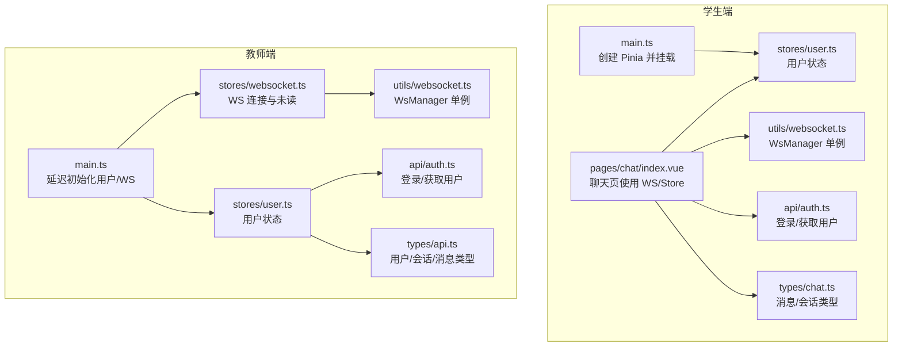
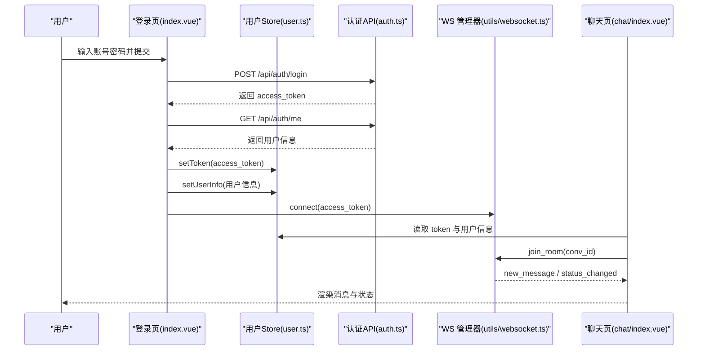
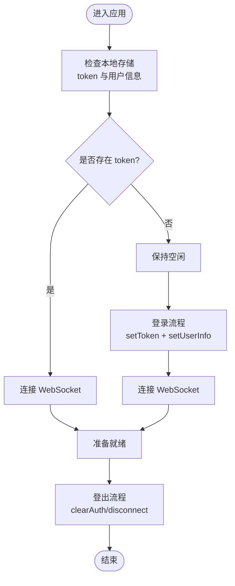
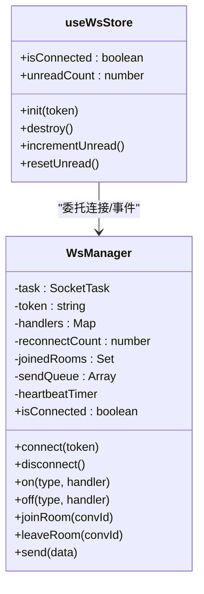
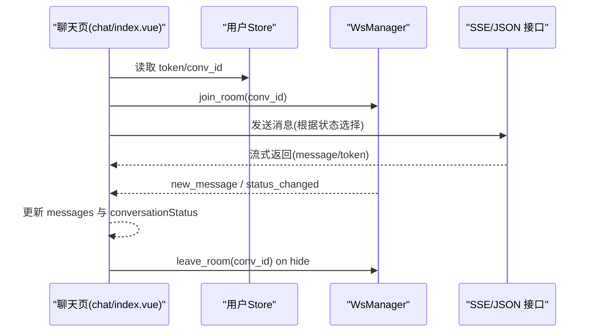
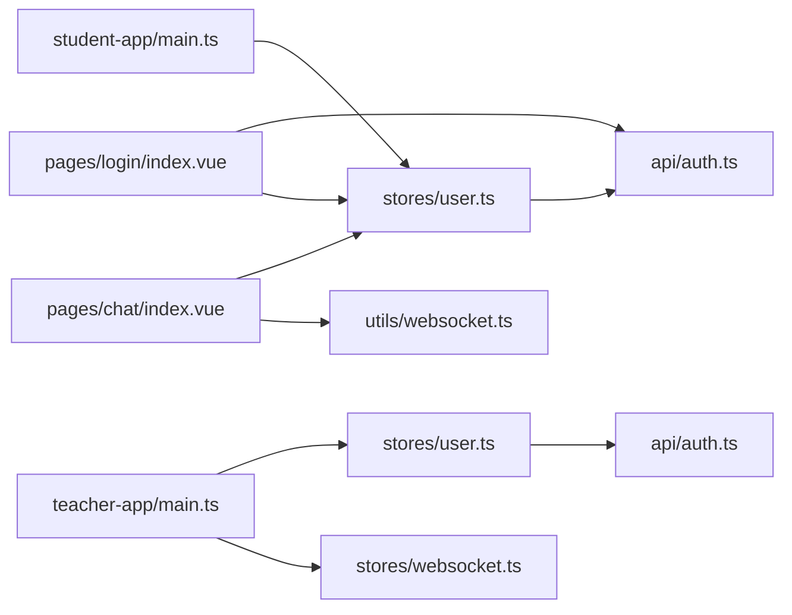

# 状态管理

<cite>
**本文档引用的文件**
- [apps/student-app/src/stores/user.ts](file://apps/student-app/src/stores/user.ts)
- [apps/teacher-app/src/stores/user.ts](file://apps/teacher-app/src/stores/user.ts)
- [apps/teacher-app/src/stores/websocket.ts](file://apps/teacher-app/src/stores/websocket.ts)
- [apps/teacher-app/src/stores/index.ts](file://apps/teacher-app/src/stores/index.ts)
- [apps/student-app/src/utils/websocket.ts](file://apps/student-app/src/utils/websocket.ts)
- [apps/teacher-app/src/utils/websocket.ts](file://apps/teacher-app/src/utils/websocket.ts)
- [apps/student-app/src/main.ts](file://apps/student-app/src/main.ts)
- [apps/teacher-app/src/main.ts](file://apps/teacher-app/src/main.ts)
- [apps/student-app/src/pages/login/index.vue](file://apps/student-app/src/pages/login/index.vue)
- [apps/teacher-app/src/pages/login/index.vue](file://apps/teacher-app/src/pages/login/index.vue)
- [apps/student-app/src/pages/chat/index.vue](file://apps/student-app/src/pages/chat/index.vue)
- [apps/student-app/src/api/auth.ts](file://apps/student-app/src/api/auth.ts)
- [apps/teacher-app/src/api/auth.ts](file://apps/teacher-app/src/api/auth.ts)
- [apps/student-app/src/utils/sse.ts](file://apps/student-app/src/utils/sse.ts)
- [apps/student-app/src/types/chat.ts](file://apps/student-app/src/types/chat.ts)
- [apps/teacher-app/src/types/api.ts](file://apps/teacher-app/src/types/api.ts)
</cite>

## 目录
1. [引言](#引言)
2. [项目结构](#项目结构)
3. [核心组件](#核心组件)
4. [架构总览](#架构总览)
5. [详细组件分析](#详细组件分析)
6. [依赖关系分析](#依赖关系分析)
7. [性能考量](#性能考量)
8. [故障排查指南](#故障排查指南)
9. [结论](#结论)
10. [附录](#附录)

## 引言
本文件系统性梳理“医小管 v2”前端的状态管理方案，围绕 Pinia 架构与 WebSocket 管理进行深入解析。重点覆盖：
- 用户状态管理：登录态、用户信息、持久化与登出清理
- WebSocket 状态管理：连接生命周期、房间订阅、消息分发、心跳与重连
- 状态同步与错误处理：SSE 流式响应、系统消息、状态变更广播
- 最佳实践与性能优化：持久化策略、状态同步机制、调试与开发辅助

## 项目结构
前端采用多应用架构，学生端与教师端分别拥有独立的 Pinia Store、WebSocket 管理器与入口初始化逻辑。二者共享部分通用类型与工具。

图表来源
- [apps/student-app/src/main.ts:1-11](file://apps/student-app/src/main.ts#L1-L11)
- [apps/teacher-app/src/main.ts:1-25](file://apps/teacher-app/src/main.ts#L1-L25)
- [apps/student-app/src/stores/user.ts:1-56](file://apps/student-app/src/stores/user.ts#L1-L56)
- [apps/teacher-app/src/stores/user.ts:1-63](file://apps/teacher-app/src/stores/user.ts#L1-L63)
- [apps/teacher-app/src/stores/websocket.ts:1-32](file://apps/teacher-app/src/stores/websocket.ts#L1-L32)
- [apps/student-app/src/utils/websocket.ts:1-153](file://apps/student-app/src/utils/websocket.ts#L1-L153)
- [apps/teacher-app/src/utils/websocket.ts:1-169](file://apps/teacher-app/src/utils/websocket.ts#L1-L169)
- [apps/student-app/src/pages/chat/index.vue:1-649](file://apps/student-app/src/pages/chat/index.vue#L1-L649)
- [apps/student-app/src/api/auth.ts:1-20](file://apps/student-app/src/api/auth.ts#L1-L20)
- [apps/teacher-app/src/api/auth.ts:1-43](file://apps/teacher-app/src/api/auth.ts#L1-L43)
- [apps/student-app/src/types/chat.ts:1-45](file://apps/student-app/src/types/chat.ts#L1-L45)
- [apps/teacher-app/src/types/api.ts:1-51](file://apps/teacher-app/src/types/api.ts#L1-L51)

章节来源
- [apps/student-app/src/main.ts:1-11](file://apps/student-app/src/main.ts#L1-L11)
- [apps/teacher-app/src/main.ts:1-25](file://apps/teacher-app/src/main.ts#L1-L25)

## 核心组件
- 用户状态 Store（Pinia）
  - 学生端：token、userInfo、isLoggedIn；支持 init、setToken、setUserInfo、logout
  - 教师端：token、userInfo、isLoggedIn、displayName；支持 init、setToken、setUserInfo、clearAuth、logout
- WebSocket Store（Pinia）
  - 教师端：isConnected、unreadCount；支持 init、destroy、incrementUnread、resetUnread
- WebSocket 管理器（WsManager 单例）
  - 连接/断开、事件监听、房间加入/离开、消息发送队列、心跳与指数退避重连

章节来源
- [apps/student-app/src/stores/user.ts:1-56](file://apps/student-app/src/stores/user.ts#L1-L56)
- [apps/teacher-app/src/stores/user.ts:1-63](file://apps/teacher-app/src/stores/user.ts#L1-L63)
- [apps/teacher-app/src/stores/websocket.ts:1-32](file://apps/teacher-app/src/stores/websocket.ts#L1-L32)
- [apps/student-app/src/utils/websocket.ts:1-153](file://apps/student-app/src/utils/websocket.ts#L1-L153)
- [apps/teacher-app/src/utils/websocket.ts:1-169](file://apps/teacher-app/src/utils/websocket.ts#L1-L169)

## 架构总览
整体状态流以 Pinia 为核心，用户态与 WS 连接在登录后建立，聊天页通过 WS 管理器与 Store 实现消息与状态的实时同步。

图表来源
- [apps/student-app/src/pages/login/index.vue:70-97](file://apps/student-app/src/pages/login/index.vue#L70-L97)
- [apps/student-app/src/api/auth.ts:1-20](file://apps/student-app/src/api/auth.ts#L1-L20)
- [apps/student-app/src/stores/user.ts:36-52](file://apps/student-app/src/stores/user.ts#L36-L52)
- [apps/student-app/src/utils/websocket.ts:20-64](file://apps/student-app/src/utils/websocket.ts#L20-L64)
- [apps/student-app/src/pages/chat/index.vue:249-276](file://apps/student-app/src/pages/chat/index.vue#L249-L276)

## 详细组件分析

### 用户状态管理（Pinia）
- 学生端
  - 初始化：从本地缓存读取 token 与用户信息，若存在则自动连接 WS
  - 登录：调用认证 API 后写入 token 与用户信息，随后连接 WS
  - 登出：清空 token 与用户信息，移除本地缓存并断开 WS
- 教师端
  - 初始化：从本地缓存读取 token 与用户信息（try/catch 容错）
  - 登录：写入 token 与用户信息，随后由页面初始化 WS Store 并建立连接
  - 登出：clearAuth 清理 token 与用户信息，logout 为别名

图表来源
- [apps/student-app/src/stores/user.ts:24-52](file://apps/student-app/src/stores/user.ts#L24-L52)
- [apps/teacher-app/src/stores/user.ts:19-49](file://apps/teacher-app/src/stores/user.ts#L19-L49)

章节来源
- [apps/student-app/src/stores/user.ts:1-56](file://apps/student-app/src/stores/user.ts#L1-L56)
- [apps/teacher-app/src/stores/user.ts:1-63](file://apps/teacher-app/src/stores/user.ts#L1-L63)
- [apps/student-app/src/pages/login/index.vue:70-97](file://apps/student-app/src/pages/login/index.vue#L70-L97)
- [apps/teacher-app/src/pages/login/index.vue:165-191](file://apps/teacher-app/src/pages/login/index.vue#L165-L191)

### WebSocket 状态管理（WsManager 与 Store）
- WsManager 能力
  - 连接与断开：统一处理 onOpen/onMessage/onClose/onError
  - 事件分发：支持通配符与具体类型，内部 dispatch
  - 房间管理：记录已加入房间，重连后自动 re-join
  - 发送队列：未连接时入队，连上后 flush
  - 心跳：每 30 秒发送 ping，维持长连
  - 重连：指数退避，最多尝试 N 次
- 教师端 Store
  - isConnected、unreadCount
  - init：触发 WsManager.connect 并监听 *_connected* 更新 isConnected
  - destroy：断开 WS 并重置状态
  - 未读计数：incrementUnread/resetUnread 供业务使用

图表来源
- [apps/teacher-app/src/utils/websocket.ts:9-169](file://apps/teacher-app/src/utils/websocket.ts#L9-L169)
- [apps/teacher-app/src/stores/websocket.ts:1-32](file://apps/teacher-app/src/stores/websocket.ts#L1-L32)

章节来源
- [apps/student-app/src/utils/websocket.ts:1-153](file://apps/student-app/src/utils/websocket.ts#L1-L153)
- [apps/teacher-app/src/utils/websocket.ts:1-169](file://apps/teacher-app/src/utils/websocket.ts#L1-L169)
- [apps/teacher-app/src/stores/websocket.ts:1-32](file://apps/teacher-app/src/stores/websocket.ts#L1-L32)

### 聊天页状态同步与消息处理
- 生命周期与房间订阅
  - onShow：注册 WS 监听、join_room、加载历史与会话状态
  - onHide/unmounted：leave_room、注销监听
- 消息与状态更新
  - 新消息：根据 conversation_id 或 conv_id 决定是否渲染
  - 状态变更：根据新旧状态推送系统提示消息
- 流式响应与 SSE
  - ai_serving：通过 SSE 流式接收 token，结束后填充 full_content 与 sources
  - teacher_serving：直接走 JSON 接口发送

图表来源
- [apps/student-app/src/pages/chat/index.vue:249-326](file://apps/student-app/src/pages/chat/index.vue#L249-L326)
- [apps/student-app/src/utils/sse.ts:1-69](file://apps/student-app/src/utils/sse.ts#L1-L69)
- [apps/student-app/src/utils/websocket.ts:44-51](file://apps/student-app/src/utils/websocket.ts#L44-L51)

章节来源
- [apps/student-app/src/pages/chat/index.vue:198-649](file://apps/student-app/src/pages/chat/index.vue#L198-L649)
- [apps/student-app/src/utils/sse.ts:1-69](file://apps/student-app/src/utils/sse.ts#L1-L69)
- [apps/student-app/src/types/chat.ts:1-45](file://apps/student-app/src/types/chat.ts#L1-L45)

### 类型与 API 对齐
- 学生端消息/会话类型与教师端用户/会话类型相互独立但遵循一致字段语义
- 登录 API 返回 access_token，随后调用 /api/auth/me 获取用户信息

章节来源
- [apps/student-app/src/types/chat.ts:1-45](file://apps/student-app/src/types/chat.ts#L1-L45)
- [apps/teacher-app/src/types/api.ts:1-51](file://apps/teacher-app/src/types/api.ts#L1-L51)
- [apps/student-app/src/api/auth.ts:1-20](file://apps/student-app/src/api/auth.ts#L1-L20)
- [apps/teacher-app/src/api/auth.ts:1-43](file://apps/teacher-app/src/api/auth.ts#L1-L43)

## 依赖关系分析
- 入口与 Store 注册
  - 学生端：main.ts 直接创建并挂载 Pinia
  - 教师端：main.ts 按需异步导入 user 与 websocket Store，并在登录后初始化
- 页面对 Store 与工具的依赖
  - 登录页：调用认证 API，写入用户状态，触发 WS 连接
  - 聊天页：读取用户状态，订阅 WS 事件，处理消息与状态变更

图表来源
- [apps/student-app/src/main.ts:1-11](file://apps/student-app/src/main.ts#L1-L11)
- [apps/teacher-app/src/main.ts:1-25](file://apps/teacher-app/src/main.ts#L1-L25)
- [apps/student-app/src/stores/user.ts:1-56](file://apps/student-app/src/stores/user.ts#L1-L56)
- [apps/teacher-app/src/stores/user.ts:1-63](file://apps/teacher-app/src/stores/user.ts#L1-L63)
- [apps/teacher-app/src/stores/websocket.ts:1-32](file://apps/teacher-app/src/stores/websocket.ts#L1-L32)
- [apps/student-app/src/pages/login/index.vue:60-97](file://apps/student-app/src/pages/login/index.vue#L60-L97)
- [apps/student-app/src/pages/chat/index.vue:198-276](file://apps/student-app/src/pages/chat/index.vue#L198-L276)
- [apps/student-app/src/api/auth.ts:1-20](file://apps/student-app/src/api/auth.ts#L1-L20)
- [apps/teacher-app/src/api/auth.ts:1-43](file://apps/teacher-app/src/api/auth.ts#L1-L43)

章节来源
- [apps/teacher-app/src/stores/index.ts:1-7](file://apps/teacher-app/src/stores/index.ts#L1-L7)

## 性能考量
- 连接与重连
  - 指数退避避免风暴重连，最大重连次数限制
  - 心跳维持长连，减少频繁握手开销
- 发送队列
  - 未连接时入队，连上后一次性 flush，降低网络抖动影响
- 房间重连
  - 断线后自动 re-join，减少业务侧重复逻辑
- 渲染与内存
  - 聊天页按需滚动与占位，避免大列表全量渲染
  - SSE 流式增量更新，减少 DOM 抖动
- 缓存与持久化
  - 使用本地存储缓存 token 与用户信息，减少重复登录成本

[本节为通用指导，不直接分析具体文件]

## 故障排查指南
- 登录后无消息
  - 检查用户 Store 是否写入 token 与用户信息
  - 检查聊天页是否 join_room 且 WS 是否 isConnected
- WS 连接频繁断开
  - 查看重连日志与指数退避是否生效
  - 检查心跳是否正常，服务器是否返回 pong
- 消息不显示或状态不同步
  - 确认 WS 事件类型匹配（new_message、status_changed）
  - 检查 conversation_id/conv_id 是否一致
- SSE 流式异常
  - 检查 HTTP 状态与事件类型 message/message_end/error
  - 确保 Authorization 头正确传递

章节来源
- [apps/student-app/src/utils/websocket.ts:44-63](file://apps/student-app/src/utils/websocket.ts#L44-L63)
- [apps/teacher-app/src/utils/websocket.ts:88-113](file://apps/teacher-app/src/utils/websocket.ts#L88-L113)
- [apps/student-app/src/utils/sse.ts:13-68](file://apps/student-app/src/utils/sse.ts#L13-L68)
- [apps/student-app/src/pages/chat/index.vue:279-326](file://apps/student-app/src/pages/chat/index.vue#L279-L326)

## 结论
本项目以 Pinia 为中心构建了清晰的用户态与 WS 管理体系：登录即初始化用户态与 WS 连接，聊天页通过统一的事件模型实现消息与状态的实时同步。WsManager 提供了完善的连接生命周期管理、房间订阅与重连机制，配合 SSE 的流式能力，满足教学场景下的即时交互需求。建议在后续迭代中进一步完善调试面板与状态快照导出能力，以提升可观测性与排障效率。

[本节为总结性内容，不直接分析具体文件]

## 附录
- 开发辅助
  - 在聊天页可利用 WS 事件回调快速定位消息来源与状态变更
  - 使用 Store 的 getter（如 displayName、isLoggedIn）简化模板逻辑
- 最佳实践
  - 登录后统一初始化用户态与 WS，避免分散初始化
  - 严格区分房间加入/离开时机，防止重复订阅
  - SSE 错误分支明确提示，保障用户体验

[本节为通用指导，不直接分析具体文件]