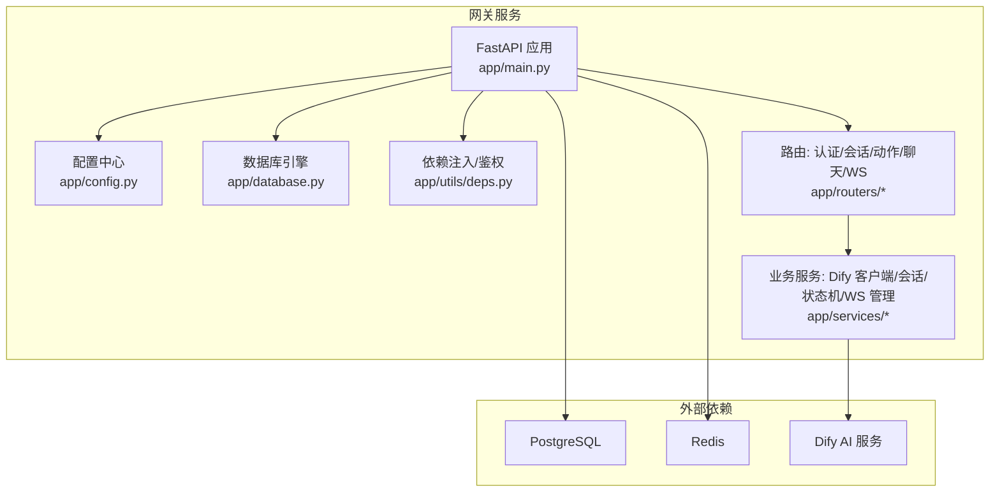
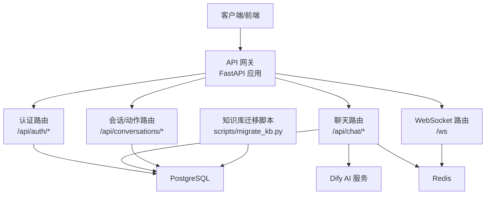
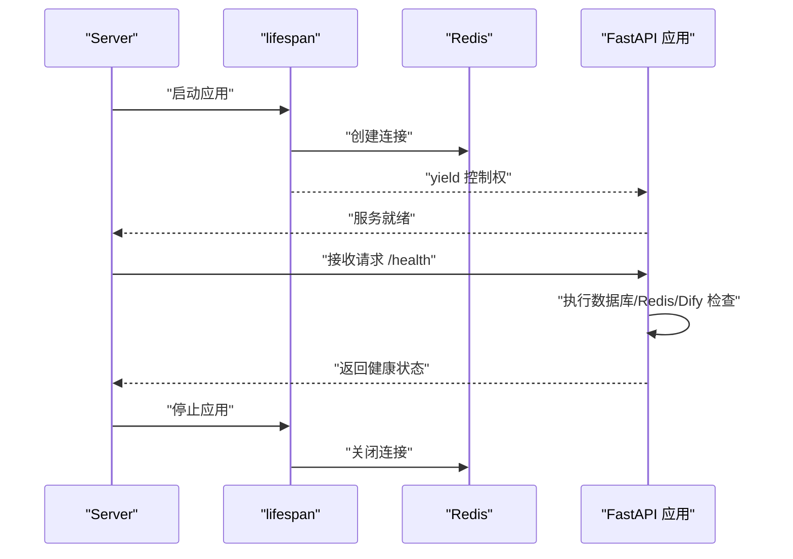
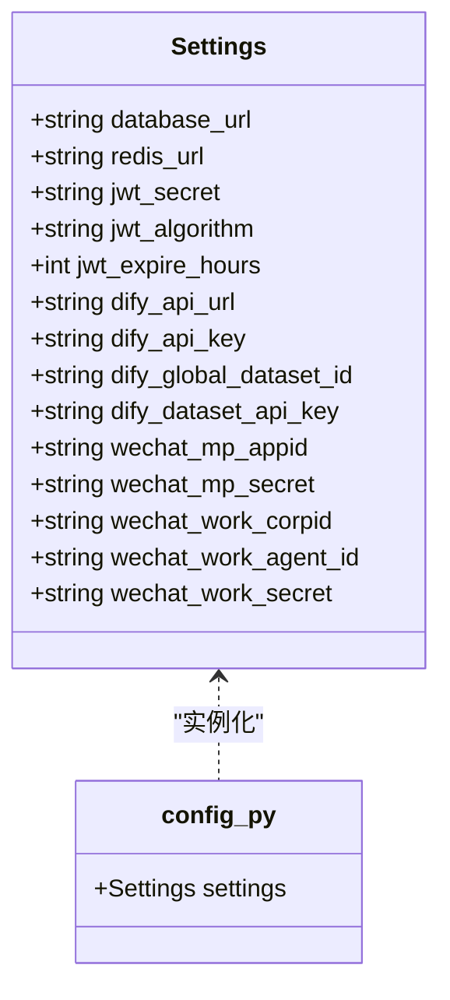
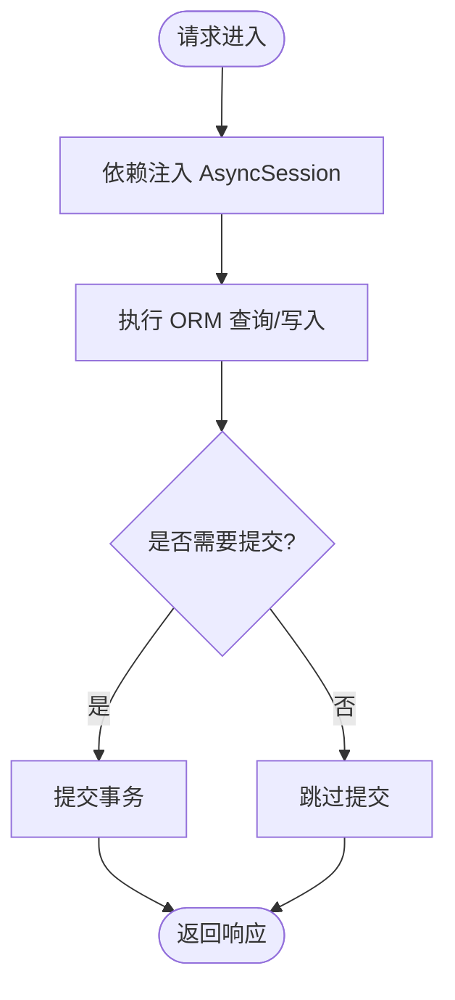
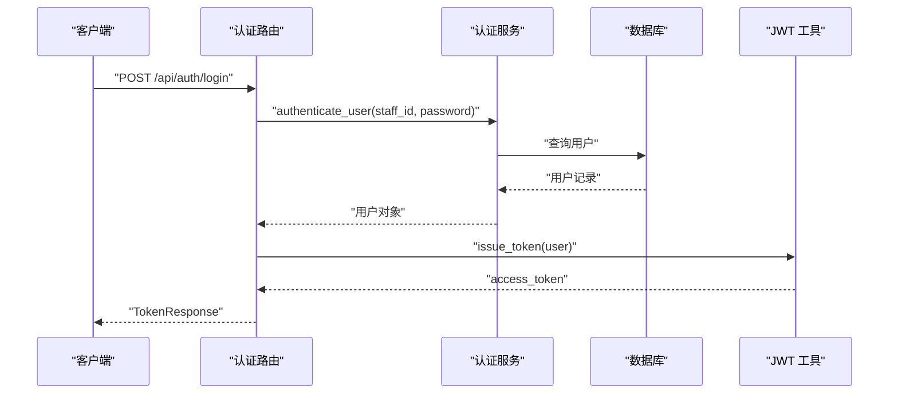
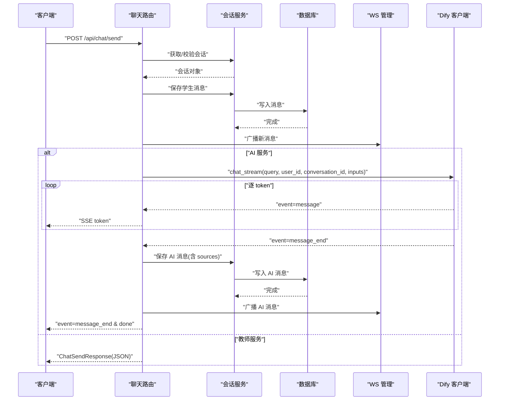
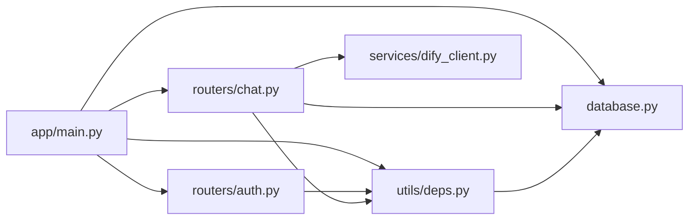
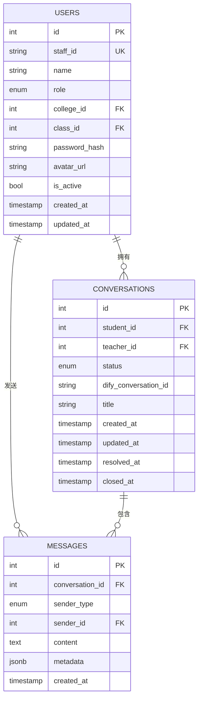

# API 网关

<cite>
**本文引用的文件**
- [services/gateway/app/main.py](file://services/gateway/app/main.py)
- [services/gateway/app/config.py](file://services/gateway/app/config.py)
- [services/gateway/app/database.py](file://services/gateway/app/database.py)
- [services/gateway/app/utils/deps.py](file://services/gateway/app/utils/deps.py)
- [services/gateway/app/routers/auth.py](file://services/gateway/app/routers/auth.py)
- [services/gateway/app/routers/chat.py](file://services/gateway/app/routers/chat.py)
- [services/gateway/app/services/dify_client.py](file://services/gateway/app/services/dify_client.py)
- [services/gateway/Dockerfile](file://services/gateway/Dockerfile)
- [deploy/docker-compose.yml](file://deploy/docker-compose.yml)
- [deploy/nginx/gateway.conf](file://deploy/nginx/gateway.conf)
- [deploy/dify/yixiaoguan-chatflow.yml](file://deploy/dify/yixiaoguan-chatflow.yml)
- [services/gateway/alembic/versions/e11bb6c9d4b8_v2_initial_schema.py](file://services/gateway/alembic/versions/e11bb6c9d4b8_v2_initial_schema.py)
- [services/gateway/alembic/versions/ff1f0ab0c5f8_add_kb_entries_table.py](file://services/gateway/alembic/versions/ff1f0ab0c5f8_add_kb_entries_table.py)
</cite>

## 目录
1. [简介](#简介)
2. [项目结构](#项目结构)
3. [核心组件](#核心组件)
4. [架构总览](#架构总览)
5. [详细组件分析](#详细组件分析)
6. [依赖分析](#依赖分析)
7. [性能考虑](#性能考虑)
8. [故障排查指南](#故障排查指南)
9. [结论](#结论)
10. [附录](#附录)

## 简介
本文件为“医小管 v2”API 网关的系统化技术文档，聚焦于 FastAPI 应用的初始化与生命周期管理、健康检查端点、路由注册；应用配置管理（数据库、Redis、Dify AI 服务）；数据库连接池与异步操作、连接状态监控；以及完整的网关部署与监控方案。文档以仓库中实际源码为依据，提供可操作的最佳实践与排障建议。

## 项目结构
- 后端服务位于 services/gateway，采用 FastAPI + SQLAlchemy Async + Alembic 迁移。
- 关键模块：
  - 应用入口与生命周期：app/main.py
  - 配置中心：app/config.py
  - 数据库引擎与会话：app/database.py
  - 依赖注入与鉴权：app/utils/deps.py
  - 路由层：app/routers/*
  - 业务服务：app/services/*
  - Docker 化与部署：Dockerfile、deploy/*

图表来源
- [services/gateway/app/main.py:1-78](file://services/gateway/app/main.py#L1-L78)
- [services/gateway/app/config.py:1-31](file://services/gateway/app/config.py#L1-L31)
- [services/gateway/app/database.py:1-15](file://services/gateway/app/database.py#L1-L15)
- [services/gateway/app/utils/deps.py:1-40](file://services/gateway/app/utils/deps.py#L1-L40)

章节来源
- [services/gateway/app/main.py:1-78](file://services/gateway/app/main.py#L1-L78)
- [services/gateway/app/config.py:1-31](file://services/gateway/app/config.py#L1-L31)
- [services/gateway/app/database.py:1-15](file://services/gateway/app/database.py#L1-L15)
- [services/gateway/app/utils/deps.py:1-40](file://services/gateway/app/utils/deps.py#L1-L40)

## 核心组件
- 应用初始化与生命周期
  - 使用 lifespan 管理 Redis 连接的创建与关闭，确保应用启动时建立连接、退出时释放资源。
  - 健康检查端点 /health 对 PostgreSQL、Redis、Dify 三类依赖进行连通性与可用性检测，并返回聚合状态。
  - 路由注册：按模块挂载 /api/auth、/api/conversations、/api/chat、WebSocket 路由。
- 配置管理
  - 通过 Settings 类集中管理数据库、Redis、JWT、Dify、微信等配置项，默认值来自 .env 文件。
- 数据库与会话
  - 异步引擎与会话工厂，连接池默认大小为 10；提供 get_db 依赖以在请求范围内提供 AsyncSession。
- 依赖注入与鉴权
  - HTTP Bearer 令牌解析与用户校验，结合数据库查询当前用户并验证激活状态。
  - Redis 注入通过 Request.app.state.redis 获取单例连接。
- 业务服务
  - Dify 客户端封装流式聊天接口，支持事件驱动的数据分发与错误处理。
  - 聊天路由根据会话状态选择 SSE 或 JSON 响应路径，集成 WebSocket 广播与消息持久化。

章节来源
- [services/gateway/app/main.py:16-78](file://services/gateway/app/main.py#L16-L78)
- [services/gateway/app/config.py:3-31](file://services/gateway/app/config.py#L3-L31)
- [services/gateway/app/database.py:6-15](file://services/gateway/app/database.py#L6-L15)
- [services/gateway/app/utils/deps.py:14-40](file://services/gateway/app/utils/deps.py#L14-L40)
- [services/gateway/app/services/dify_client.py:11-105](file://services/gateway/app/services/dify_client.py#L11-L105)

## 架构总览
下图展示网关与外部系统的交互关系，以及关键数据流（认证、聊天、知识库）：

图表来源
- [services/gateway/app/main.py:70-78](file://services/gateway/app/main.py#L70-L78)
- [services/gateway/app/routers/auth.py:12-35](file://services/gateway/app/routers/auth.py#L12-L35)
- [services/gateway/app/routers/chat.py:22-103](file://services/gateway/app/routers/chat.py#L22-L103)
- [services/gateway/app/services/dify_client.py:22-69](file://services/gateway/app/services/dify_client.py#L22-L69)

## 详细组件分析

### 应用初始化与生命周期
- 生命周期钩子
  - 在 lifespan 中创建 Redis 连接并注入到 app.state.redis，在应用结束时关闭连接。
- 健康检查
  - /health 同时检查 PostgreSQL、Redis、Dify 三个依赖，返回聚合状态与各子检查结果。
- 路由注册
  - 采用模块化挂载，便于扩展与维护。

图表来源
- [services/gateway/app/main.py:16-28](file://services/gateway/app/main.py#L16-L28)
- [services/gateway/app/main.py:30-68](file://services/gateway/app/main.py#L30-L68)

章节来源
- [services/gateway/app/main.py:16-28](file://services/gateway/app/main.py#L16-L28)
- [services/gateway/app/main.py:30-68](file://services/gateway/app/main.py#L30-L68)

### 配置管理
- 配置来源与覆盖
  - 通过 pydantic-settings 的 Settings 类加载 .env 文件，字段包含数据库、Redis、JWT、Dify、微信等。
- 默认值与安全建议
  - 生产环境需替换默认密钥与地址，避免硬编码敏感信息。

图表来源
- [services/gateway/app/config.py:3-31](file://services/gateway/app/config.py#L3-L31)

章节来源
- [services/gateway/app/config.py:3-31](file://services/gateway/app/config.py#L3-L31)

### 数据库连接池与异步操作
- 引擎与会话
  - 使用异步引擎与会话工厂，连接池默认大小为 10；expire_on_commit=False 降低会话过期带来的复杂度。
- 依赖注入
  - get_db 提供请求级 AsyncSession，确保并发安全与事务边界清晰。
- 迁移与模式
  - Alembic 迁移包含初始 schema 与知识库条目表，保证数据库演进可控。

图表来源
- [services/gateway/app/database.py:6-15](file://services/gateway/app/database.py#L6-L15)
- [services/gateway/alembic/versions/e11bb6c9d4b8_v2_initial_schema.py](file://services/gateway/alembic/versions/e11bb6c9d4b8_v2_initial_schema.py)
- [services/gateway/alembic/versions/ff1f0ab0c5f8_add_kb_entries_table.py](file://services/gateway/alembic/versions/ff1f0ab0c5f8_add_kb_entries_table.py)

章节来源
- [services/gateway/app/database.py:6-15](file://services/gateway/app/database.py#L6-L15)
- [services/gateway/alembic/versions/e11bb6c9d4b8_v2_initial_schema.py](file://services/gateway/alembic/versions/e11bb6c9d4b8_v2_initial_schema.py)
- [services/gateway/alembic/versions/ff1f0ab0c5f8_add_kb_entries_table.py](file://services/gateway/alembic/versions/ff1f0ab0c5f8_add_kb_entries_table.py)

### 认证与鉴权
- 登录流程
  - 校验学号/工号与密码，成功后签发访问令牌。
- 当前用户解析
  - 从 Authorization 头解析 JWT，查询用户并校验是否激活。
- 用户模型
  - 角色枚举包含 student、teacher、admin；支持绑定平台标识。

图表来源
- [services/gateway/app/routers/auth.py:12-21](file://services/gateway/app/routers/auth.py#L12-L21)
- [services/gateway/app/utils/deps.py:14-35](file://services/gateway/app/utils/deps.py#L14-L35)

章节来源
- [services/gateway/app/routers/auth.py:12-35](file://services/gateway/app/routers/auth.py#L12-L35)
- [services/gateway/app/utils/deps.py:14-35](file://services/gateway/app/utils/deps.py#L14-L35)
- [services/gateway/app/models/user.py:45-76](file://services/gateway/app/models/user.py#L45-L76)

### 聊天与会话（含 Dify 流式响应）
- 端点行为
  - 学生仅能调用 /api/chat/send；根据会话状态决定走 AI 流式 SSE 或教师路径 JSON。
- 流程要点
  - 保存学生消息 → 广播至房间 → 若 AI 服务则返回 SSE 流；流结束后保存 AI 消息、更新 Dify 会话 ID、广播 AI 消息。
- Dify 客户端
  - 封装流式聊天接口，逐 token 下发事件；对 message_end 时提取来源引用并保存元数据。

图表来源
- [services/gateway/app/routers/chat.py:22-103](file://services/gateway/app/routers/chat.py#L22-L103)
- [services/gateway/app/routers/chat.py:105-191](file://services/gateway/app/routers/chat.py#L105-L191)
- [services/gateway/app/services/dify_client.py:22-69](file://services/gateway/app/services/dify_client.py#L22-L69)

章节来源
- [services/gateway/app/routers/chat.py:22-103](file://services/gateway/app/routers/chat.py#L22-L103)
- [services/gateway/app/routers/chat.py:105-191](file://services/gateway/app/routers/chat.py#L105-L191)
- [services/gateway/app/services/dify_client.py:22-69](file://services/gateway/app/services/dify_client.py#L22-L69)

### WebSocket 与状态机（概念性说明）
- WebSocket 管理
  - 通过 app.state.redis 维持房间广播；聊天路由在消息变更时向房间推送事件。
- 状态机
  - 会话状态在不同服务模式间转换（如从 resolved 重激活），配合 WS 广播与消息持久化。

章节来源
- [services/gateway/app/routers/chat.py:45-51](file://services/gateway/app/routers/chat.py#L45-L51)
- [services/gateway/app/routers/chat.py:173-186](file://services/gateway/app/routers/chat.py#L173-L186)

## 依赖分析
- 组件耦合
  - 路由层依赖服务层与数据库依赖；服务层依赖配置与外部 Dify。
  - 依赖注入贯穿始终，降低模块间紧耦合。
- 外部依赖
  - PostgreSQL、Redis、Dify；Nginx 作为反向代理前置。
- 可能的循环依赖
  - 当前结构清晰，未见直接循环导入。

图表来源
- [services/gateway/app/main.py:10-14](file://services/gateway/app/main.py#L10-L14)
- [services/gateway/app/routers/auth.py:1-7](file://services/gateway/app/routers/auth.py#L1-L7)
- [services/gateway/app/routers/chat.py:1-16](file://services/gateway/app/routers/chat.py#L1-L16)
- [services/gateway/app/utils/deps.py:1-9](file://services/gateway/app/utils/deps.py#L1-L9)
- [services/gateway/app/database.py:1-7](file://services/gateway/app/database.py#L1-L7)
- [services/gateway/app/services/dify_client.py:1-6](file://services/gateway/app/services/dify_client.py#L1-L6)

章节来源
- [services/gateway/app/main.py:10-14](file://services/gateway/app/main.py#L10-L14)
- [services/gateway/app/routers/auth.py:1-7](file://services/gateway/app/routers/auth.py#L1-L7)
- [services/gateway/app/routers/chat.py:1-16](file://services/gateway/app/routers/chat.py#L1-L16)
- [services/gateway/app/utils/deps.py:1-9](file://services/gateway/app/utils/deps.py#L1-L9)
- [services/gateway/app/database.py:1-7](file://services/gateway/app/database.py#L1-L7)
- [services/gateway/app/services/dify_client.py:1-6](file://services/gateway/app/services/dify_client.py#L1-L6)

## 性能考虑
- 连接池与并发
  - 数据库连接池默认 10，建议根据 QPS 与慢查询情况调整；开启只读副本用于读多写少场景。
- 异步 I/O
  - 使用异步引擎与依赖注入，减少阻塞；注意在长耗时任务中避免阻塞事件循环。
- 缓存策略
  - 利用 Redis 缓存热点用户信息、会话元数据，降低数据库压力。
- SSE 与 WebSocket
  - SSE 逐 token 下发，注意客户端缓冲与网络抖动；WebSocket 房间广播需控制消息频率。
- Dify 调用
  - 设置合理超时与重试；对 message_end 时的元数据提取与入库进行幂等设计。

## 故障排查指南
- 健康检查异常
  - /health 返回 degraded 时，检查各子检查项（postgres、redis、dify）的具体错误信息，定位依赖问题。
- 认证失败
  - 确认 Authorization 头格式正确；检查 JWT 解析与用户激活状态。
- 聊天无响应
  - 检查会话状态与路由分支；确认 Dify 流式事件是否正常下发；查看消息持久化与 WS 广播日志。
- 数据库连接问题
  - 检查连接池参数与并发峰值；关注慢查询与锁等待。
- Redis 连接问题
  - 确认 Redis 地址与密码；观察连接数与内存使用。

章节来源
- [services/gateway/app/main.py:30-68](file://services/gateway/app/main.py#L30-L68)
- [services/gateway/app/utils/deps.py:14-35](file://services/gateway/app/utils/deps.py#L14-L35)
- [services/gateway/app/routers/chat.py:22-103](file://services/gateway/app/routers/chat.py#L22-L103)

## 结论
本网关以模块化与依赖注入为核心，结合异步数据库与 Redis 缓存，提供了稳定的认证、聊天与会话能力，并通过健康检查与 SSE/WS 实现良好的实时体验。建议在生产环境中完善配置管理、监控告警与限流策略，持续优化数据库与外部服务的调用性能。

## 附录

### 部署与运行
- Docker 化
  - 基于 Python slim 镜像，安装依赖后以 uvicorn 启动服务，暴露 8000 端口。
- Compose 与 Nginx
  - 使用 docker-compose 编排服务；Nginx 作为反向代理，转发 /api 与 /ws 到网关。
- Dify 集成
  - 通过 chatflow 配置文件部署 Dify，网关负责鉴权与消息编排。

章节来源
- [services/gateway/Dockerfile:1-14](file://services/gateway/Dockerfile#L1-L14)
- [deploy/docker-compose.yml](file://deploy/docker-compose.yml)
- [deploy/nginx/gateway.conf](file://deploy/nginx/gateway.conf)
- [deploy/dify/yixiaoguan-chatflow.yml](file://deploy/dify/yixiaoguan-chatflow.yml)

### 数据模型概览
- 用户、会话、消息与枚举类型定义清晰，索引覆盖常用查询路径，支撑高并发下的读写分离与扩展。

图表来源
- [services/gateway/app/models/user.py:45-76](file://services/gateway/app/models/user.py#L45-L76)
- [services/gateway/app/models/conversation.py:26-63](file://services/gateway/app/models/conversation.py#L26-L63)