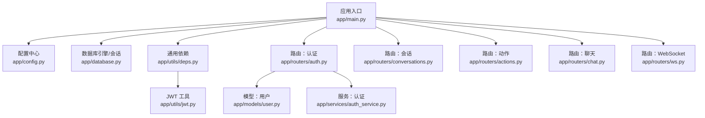
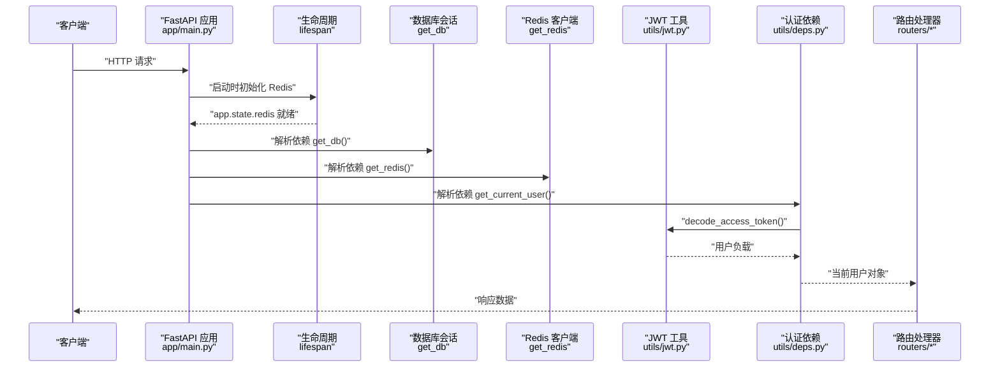
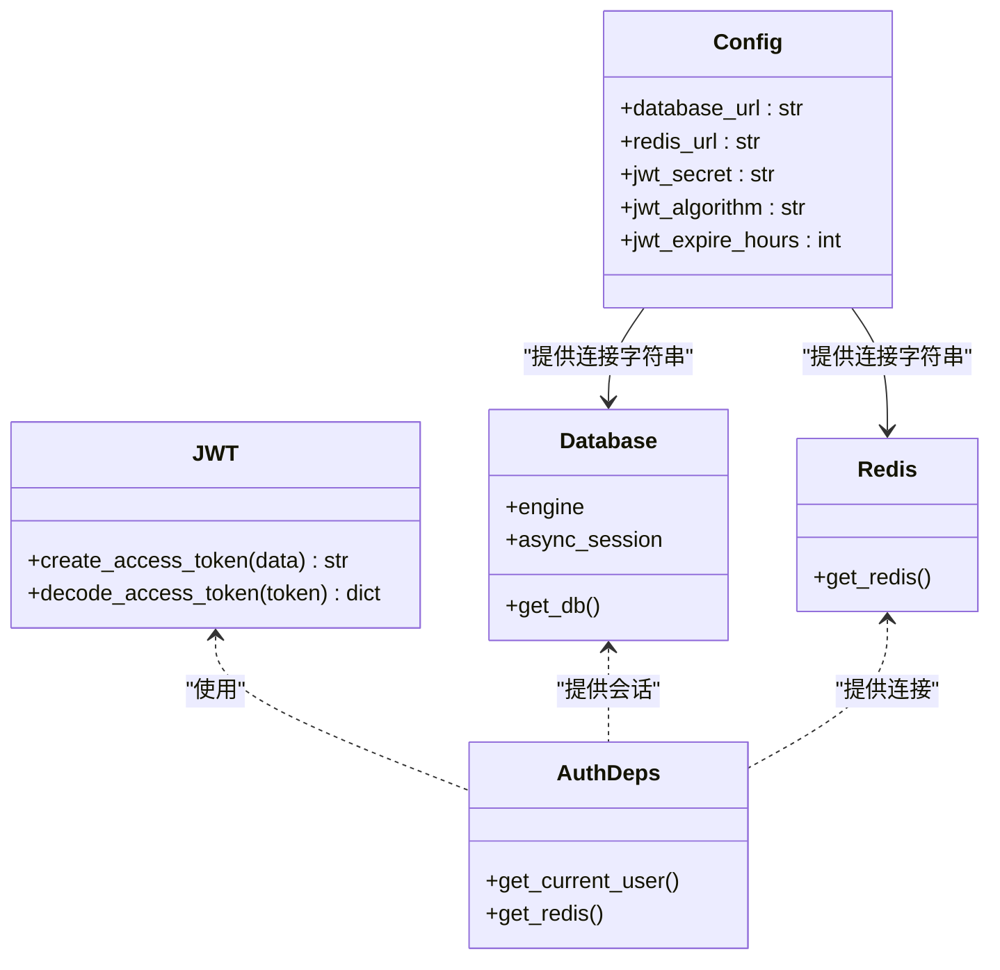
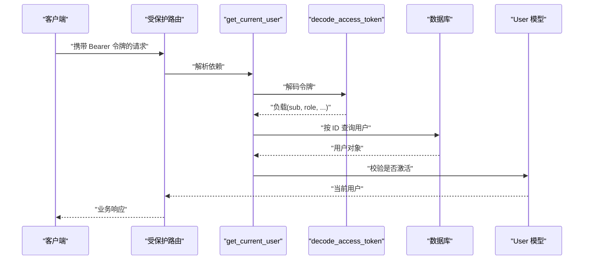
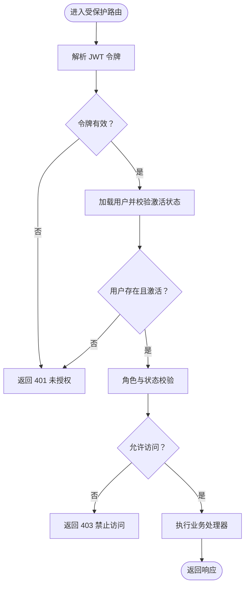
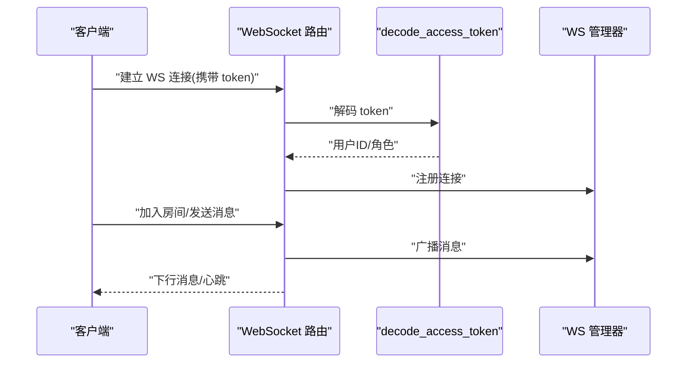
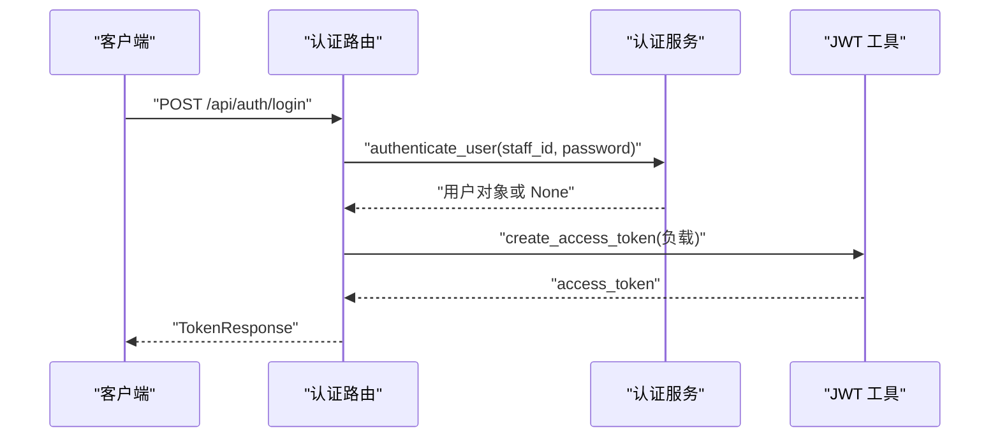
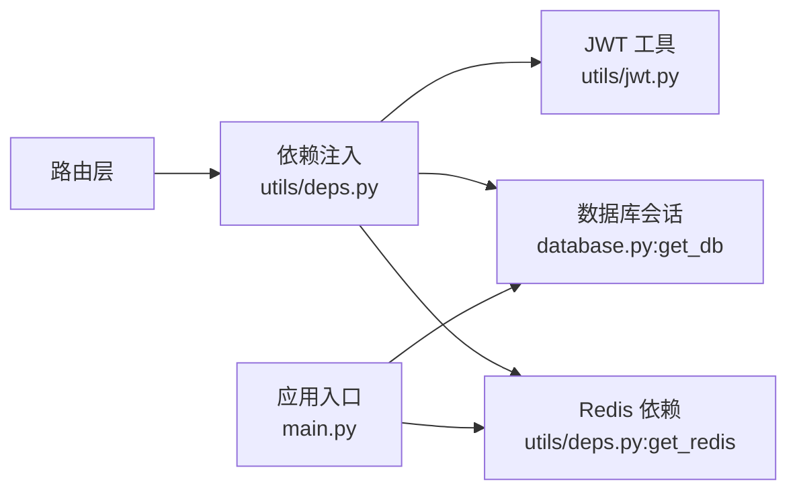

# 中间件与拦截器

<cite>
**本文引用的文件**
- [services/gateway/app/main.py](file://services/gateway/app/main.py)
- [services/gateway/app/config.py](file://services/gateway/app/config.py)
- [services/gateway/app/database.py](file://services/gateway/app/database.py)
- [services/gateway/app/utils/deps.py](file://services/gateway/app/utils/deps.py)
- [services/gateway/app/utils/jwt.py](file://services/gateway/app/utils/jwt.py)
- [services/gateway/app/routers/auth.py](file://services/gateway/app/routers/auth.py)
- [services/gateway/app/routers/chat.py](file://services/gateway/app/routers/chat.py)
- [services/gateway/app/routers/conversations.py](file://services/gateway/app/routers/conversations.py)
- [services/gateway/app/routers/actions.py](file://services/gateway/app/routers/actions.py)
- [services/gateway/app/routers/ws.py](file://services/gateway/app/routers/ws.py)
- [services/gateway/app/models/user.py](file://services/gateway/app/models/user.py)
- [services/gateway/app/services/auth_service.py](file://services/gateway/app/services/auth_service.py)
</cite>

## 目录
1. [简介](#简介)
2. [项目结构](#项目结构)
3. [核心组件](#核心组件)
4. [架构总览](#架构总览)
5. [详细组件分析](#详细组件分析)
6. [依赖分析](#依赖分析)
7. [性能考虑](#性能考虑)
8. [故障排查指南](#故障排查指南)
9. [结论](#结论)
10. [附录](#附录)

## 简介
本文件系统性梳理医小管 v2 网关服务中的“中间件与拦截器”实现，重点覆盖以下方面：
- 依赖注入系统：数据库会话管理、Redis 连接管理、认证依赖
- JWT 认证中间件设计与实现：令牌验证、权限检查、用户上下文注入
- 横切关注点：CORS 处理、日志记录、健康检查与外部服务连通性检测
- 扩展与自定义：如何在现有依赖注入体系上扩展新的拦截器与中间件

说明：本项目采用 FastAPI，未显式注册全局中间件；认证与权限控制主要通过依赖注入函数实现，相当于“函数式中间件”。下文将结合代码路径进行逐层解析。

## 项目结构
网关服务位于 services/gateway，核心入口为 FastAPI 应用，按功能模块组织：
- 应用入口与生命周期：app/main.py
- 配置中心：app/config.py
- 数据库引擎与会话工厂：app/database.py
- 通用依赖：app/utils/deps.py（JWT 解析、当前用户解析、Redis 获取）
- JWT 工具：app/utils/jwt.py
- 路由模块：app/routers/*（认证、会话、动作、聊天、WebSocket）
- 模型定义：app/models/user.py
- 业务服务：app/services/*（认证服务等）

图表来源
- [services/gateway/app/main.py:1-78](file://services/gateway/app/main.py#L1-L78)
- [services/gateway/app/config.py:1-31](file://services/gateway/app/config.py#L1-L31)
- [services/gateway/app/database.py:1-15](file://services/gateway/app/database.py#L1-L15)
- [services/gateway/app/utils/deps.py:1-40](file://services/gateway/app/utils/deps.py#L1-L40)
- [services/gateway/app/utils/jwt.py:1-17](file://services/gateway/app/utils/jwt.py#L1-L17)
- [services/gateway/app/routers/auth.py:1-35](file://services/gateway/app/routers/auth.py#L1-L35)
- [services/gateway/app/routers/conversations.py:1-129](file://services/gateway/app/routers/conversations.py#L1-L129)
- [services/gateway/app/routers/actions.py:1-154](file://services/gateway/app/routers/actions.py#L1-L154)
- [services/gateway/app/routers/chat.py:1-191](file://services/gateway/app/routers/chat.py#L1-L191)
- [services/gateway/app/routers/ws.py:1-119](file://services/gateway/app/routers/ws.py#L1-L119)
- [services/gateway/app/models/user.py:1-76](file://services/gateway/app/models/user.py#L1-L76)
- [services/gateway/app/services/auth_service.py:1-35](file://services/gateway/app/services/auth_service.py#L1-L35)

章节来源
- [services/gateway/app/main.py:1-78](file://services/gateway/app/main.py#L1-L78)
- [services/gateway/app/config.py:1-31](file://services/gateway/app/config.py#L1-L31)

## 核心组件
- 应用生命周期与外部依赖初始化
  - 在 lifespan 中创建 Redis 客户端并注入到 app.state，供依赖注入使用
  - 健康检查接口同时探测 Postgres、Redis 与 Dify 服务连通性
- 依赖注入系统
  - 数据库会话：异步引擎 + 会话工厂，通过 get_db 提供依赖
  - Redis 连接：通过 get_redis 从 app.state.redis 获取
  - 认证依赖：HTTP Bearer + JWT 解码 + 当前用户解析 + 权限校验
- JWT 认证
  - 令牌签发与解码工具
  - 登录流程中签发 JWT，并在受保护路由中解析用户上下文
- 路由级拦截器
  - 通过 Depends(get_current_user) 实现“函数式中间件”，统一执行认证与权限检查
  - 路由内部根据用户角色与会话状态进行细粒度权限控制

章节来源
- [services/gateway/app/main.py:16-68](file://services/gateway/app/main.py#L16-L68)
- [services/gateway/app/database.py:12-15](file://services/gateway/app/database.py#L12-L15)
- [services/gateway/app/utils/deps.py:14-39](file://services/gateway/app/utils/deps.py#L14-L39)
- [services/gateway/app/utils/jwt.py:6-17](file://services/gateway/app/utils/jwt.py#L6-L17)
- [services/gateway/app/routers/auth.py:12-34](file://services/gateway/app/routers/auth.py#L12-L34)

## 架构总览
下图展示应用启动、依赖注入与请求处理的关键交互：

图表来源
- [services/gateway/app/main.py:16-28](file://services/gateway/app/main.py#L16-L28)
- [services/gateway/app/utils/deps.py:14-39](file://services/gateway/app/utils/deps.py#L14-L39)
- [services/gateway/app/utils/jwt.py:14-16](file://services/gateway/app/utils/jwt.py#L14-L16)

## 详细组件分析

### 依赖注入系统
- 数据库会话管理
  - 异步引擎与会话工厂：基于 SQLAlchemy 异步组件，提供 AsyncSession 生命周期管理
  - 依赖函数：get_db 以上下文管理器方式提供会话，确保请求结束自动释放
- Redis 连接管理
  - 应用启动时创建 Redis 客户端并注入 app.state.redis
  - 依赖函数：get_redis 从 app.state.redis 获取连接实例
- 认证依赖
  - HTTP Bearer 令牌解析：HTTPBearer + HTTPAuthorizationCredentials
  - JWT 解码：decode_access_token，失败抛出异常
  - 用户解析：从令牌 sub 解析用户 ID，查询数据库并校验是否激活
  - 依赖注入：Depends(get_current_user) 在路由层统一注入当前用户

图表来源
- [services/gateway/app/config.py:3-30](file://services/gateway/app/config.py#L3-L30)
- [services/gateway/app/database.py:6-15](file://services/gateway/app/database.py#L6-L15)
- [services/gateway/app/utils/deps.py:14-39](file://services/gateway/app/utils/deps.py#L14-L39)
- [services/gateway/app/utils/jwt.py:6-16](file://services/gateway/app/utils/jwt.py#L6-L16)

章节来源
- [services/gateway/app/database.py:6-15](file://services/gateway/app/database.py#L6-L15)
- [services/gateway/app/utils/deps.py:14-39](file://services/gateway/app/utils/deps.py#L14-L39)
- [services/gateway/app/utils/jwt.py:6-16](file://services/gateway/app/utils/jwt.py#L6-L16)
- [services/gateway/app/config.py:3-30](file://services/gateway/app/config.py#L3-L30)

### JWT 认证中间件设计与实现
- 令牌签发
  - 构建负载：包含用户标识、角色、学院/班级等信息
  - 设置过期时间：基于配置项 jwt_expire_hours
  - 使用 HS256 算法签名
- 令牌验证
  - 路由层通过 HTTP Bearer 获取 Authorization 凭据
  - 使用 decode_access_token 解码并校验签名
  - 从负载提取 sub 作为用户 ID，查询数据库并校验用户是否激活
- 用户上下文注入
  - 通过 Depends(get_current_user) 将当前用户对象注入到路由处理器参数
  - 路由内部可直接使用 current_user 进行权限判断与业务处理

图表来源
- [services/gateway/app/routers/auth.py:24-34](file://services/gateway/app/routers/auth.py#L24-L34)
- [services/gateway/app/utils/deps.py:14-35](file://services/gateway/app/utils/deps.py#L14-L35)
- [services/gateway/app/utils/jwt.py:14-16](file://services/gateway/app/utils/jwt.py#L14-L16)
- [services/gateway/app/models/user.py:45-58](file://services/gateway/app/models/user.py#L45-L58)

章节来源
- [services/gateway/app/utils/jwt.py:6-16](file://services/gateway/app/utils/jwt.py#L6-L16)
- [services/gateway/app/utils/deps.py:14-35](file://services/gateway/app/utils/deps.py#L14-L35)
- [services/gateway/app/routers/auth.py:24-34](file://services/gateway/app/routers/auth.py#L24-L34)
- [services/gateway/app/models/user.py:45-58](file://services/gateway/app/models/user.py#L45-L58)

### CORS 处理
- 本项目未在 FastAPI 中显式注册 CORS 中间件
- 若需要跨域支持，可在应用初始化时添加 CORS 配置；当前路由未体现 CORS 相关逻辑

章节来源
- [services/gateway/app/main.py:24-28](file://services/gateway/app/main.py#L24-L28)

### 日志记录
- 健康检查：在 /health 中对 Postgres、Redis、Dify 进行连通性检查并记录结果
- 路由模块：聊天与 WebSocket 路由中使用标准日志记录异常与错误
- 建议：在应用层统一接入结构化日志（如 JSON 格式），便于链路追踪与告警

章节来源
- [services/gateway/app/main.py:30-68](file://services/gateway/app/main.py#L30-L68)
- [services/gateway/app/routers/chat.py:17-150](file://services/gateway/app/routers/chat.py#L17-L150)
- [services/gateway/app/routers/ws.py:7-118](file://services/gateway/app/routers/ws.py#L7-L118)

### 性能监控
- 本项目未在代码中显式集成性能监控中间件或指标导出
- 建议：结合 ASGI 中间件或 Prometheus 客户端，在应用层增加请求耗时、并发数、错误率等指标采集

章节来源
- [services/gateway/app/main.py:24-28](file://services/gateway/app/main.py#L24-L28)

### 路由级拦截器与权限控制
- 认证拦截器
  - 通过 Depends(get_current_user) 在路由层强制执行 JWT 解析与用户校验
- 角色与状态拦截器
  - 在聊天与会话相关路由中，依据用户角色（学生/教师/管理员）与会话状态（AI/教师服务/已解决/关闭等）进行访问控制
- 示例场景
  - /api/chat/send：仅学生可发送消息，且会话状态需允许发送
  - /api/conversations/{conv_id}/messages：教师仅可回复其接单的会话
  - /api/conversations/{conv_id}/escalate：仅学生可发起升级
  - /api/conversations/{conv_id}/accept：仅教师/管理员可接单
  - /api/conversations/{conv_id}/resolve：仅接单教师或管理员可标记解决
  - /api/conversations/{conv_id}/close：学生/教师/管理员均可关闭

图表来源
- [services/gateway/app/utils/deps.py:14-35](file://services/gateway/app/utils/deps.py#L14-L35)
- [services/gateway/app/routers/chat.py:22-102](file://services/gateway/app/routers/chat.py#L22-L102)
- [services/gateway/app/routers/conversations.py:21-128](file://services/gateway/app/routers/conversations.py#L21-L128)
- [services/gateway/app/routers/actions.py:68-153](file://services/gateway/app/routers/actions.py#L68-L153)

章节来源
- [services/gateway/app/routers/chat.py:22-102](file://services/gateway/app/routers/chat.py#L22-L102)
- [services/gateway/app/routers/conversations.py:21-128](file://services/gateway/app/routers/conversations.py#L21-L128)
- [services/gateway/app/routers/actions.py:68-153](file://services/gateway/app/routers/actions.py#L68-L153)

### WebSocket 认证与拦截
- 连接认证：通过查询参数 token 传递 JWT，解码后获取用户 ID 与角色
- 房间管理：加入/离开会话房间，广播消息与输入状态
- 错误处理：异常捕获并记录，断开连接

图表来源
- [services/gateway/app/routers/ws.py:11-118](file://services/gateway/app/routers/ws.py#L11-L118)
- [services/gateway/app/utils/jwt.py:14-16](file://services/gateway/app/utils/jwt.py#L14-L16)

章节来源
- [services/gateway/app/routers/ws.py:11-118](file://services/gateway/app/routers/ws.py#L11-L118)

### 登录与令牌签发
- 登录流程：校验学号/工号与密码，成功后构建 JWT 负载并签发令牌
- 令牌内容：包含用户标识、角色、学院/班级、姓名等字段

图表来源
- [services/gateway/app/routers/auth.py:12-21](file://services/gateway/app/routers/auth.py#L12-L21)
- [services/gateway/app/services/auth_service.py:8-34](file://services/gateway/app/services/auth_service.py#L8-L34)
- [services/gateway/app/utils/jwt.py:6-11](file://services/gateway/app/utils/jwt.py#L6-L11)

章节来源
- [services/gateway/app/routers/auth.py:12-21](file://services/gateway/app/routers/auth.py#L12-L21)
- [services/gateway/app/services/auth_service.py:8-34](file://services/gateway/app/services/auth_service.py#L8-L34)

## 依赖分析
- 组件耦合
  - 路由层通过依赖注入函数与工具模块解耦，职责清晰
  - 认证依赖与 JWT 工具形成稳定契约，便于替换算法或存储
- 外部依赖
  - 数据库：PostgreSQL（异步驱动）
  - 缓存：Redis（异步客户端）
  - 第三方服务：Dify（通过 HTTP 客户端访问）
- 潜在风险
  - 未使用全局中间件，需确保所有受保护路由均依赖 get_current_user
  - Redis 通过 app.state 注入，需保证生命周期正确

图表来源
- [services/gateway/app/main.py:16-22](file://services/gateway/app/main.py#L16-L22)
- [services/gateway/app/utils/deps.py:14-39](file://services/gateway/app/utils/deps.py#L14-L39)
- [services/gateway/app/database.py:12-15](file://services/gateway/app/database.py#L12-L15)

章节来源
- [services/gateway/app/main.py:16-22](file://services/gateway/app/main.py#L16-L22)
- [services/gateway/app/utils/deps.py:14-39](file://services/gateway/app/utils/deps.py#L14-L39)
- [services/gateway/app/database.py:12-15](file://services/gateway/app/database.py#L12-L15)

## 性能考虑
- 数据库连接池：异步引擎 pool_size 默认值需结合并发与资源评估
- Redis 连接复用：通过 app.state.redis 复用连接，避免频繁创建销毁
- 令牌解析：JWT 解码为纯 CPU 操作，建议缓存热点用户信息（如需）
- I/O 密集：聊天流式响应与 WebSocket 广播可能成为瓶颈，建议引入背压与限速策略

## 故障排查指南
- 401 未授权
  - 检查 Authorization 头是否为 Bearer 令牌
  - 核对令牌签名算法与密钥配置
  - 确认用户存在且 is_active 为真
- 403 禁止访问
  - 校验用户角色与目标会话状态
  - 确认会话归属与权限边界
- 健康检查异常
  - Postgres：检查连接串与网络连通
  - Redis：检查地址与密码
  - Dify：检查 API 地址与鉴权密钥
- WebSocket 连接失败
  - 校验 token 是否有效
  - 查看服务端日志定位异常

章节来源
- [services/gateway/app/utils/deps.py:14-35](file://services/gateway/app/utils/deps.py#L14-L35)
- [services/gateway/app/main.py:30-68](file://services/gateway/app/main.py#L30-L68)
- [services/gateway/app/routers/ws.py:35-42](file://services/gateway/app/routers/ws.py#L35-L42)

## 结论
- 本项目通过“函数式中间件”的依赖注入模式实现了统一的认证与权限控制，简洁而高效
- 数据库与 Redis 的依赖注入设计清晰，生命周期管理合理
- 健康检查与日志记录覆盖关键外部依赖，便于运维观测
- 建议后续补充 CORS、性能监控与统一日志规范，进一步提升可观测性与可维护性

## 附录
- 扩展与自定义指南
  - 新增依赖：在 utils/deps.py 中新增依赖函数，并在路由中通过 Depends 注入
  - 新增拦截器：在路由层继续沿用 Depends 模式，或封装为独立依赖函数
  - 新增认证方式：替换 JWT 工具或扩展多因子认证，保持与依赖注入契约一致
  - CORS 支持：在应用初始化时添加 CORS 配置
  - 性能监控：引入 ASGI 中间件或指标导出组件，采集关键指标

章节来源
- [services/gateway/app/utils/deps.py:14-39](file://services/gateway/app/utils/deps.py#L14-L39)
- [services/gateway/app/main.py:24-28](file://services/gateway/app/main.py#L24-L28)