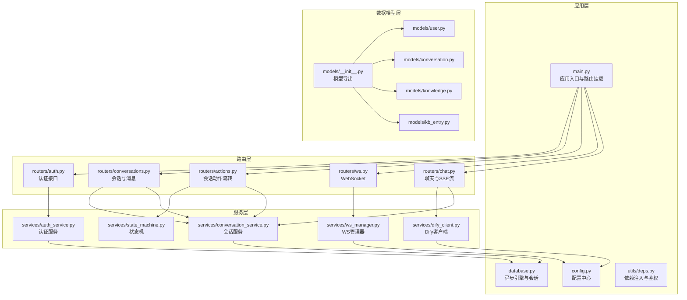
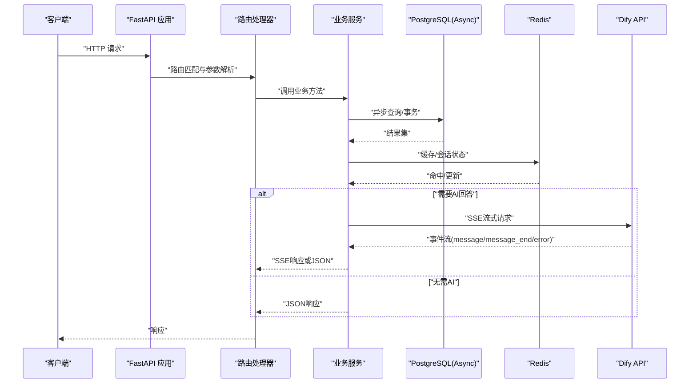
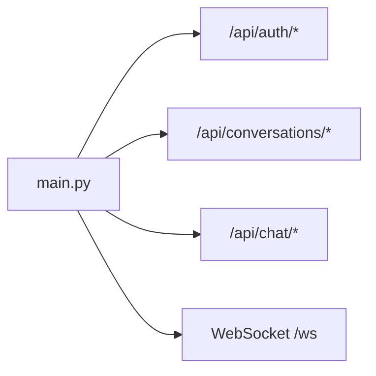
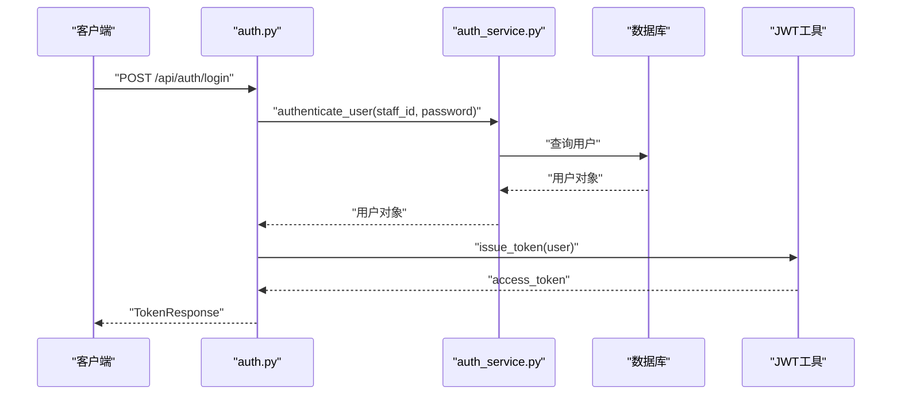
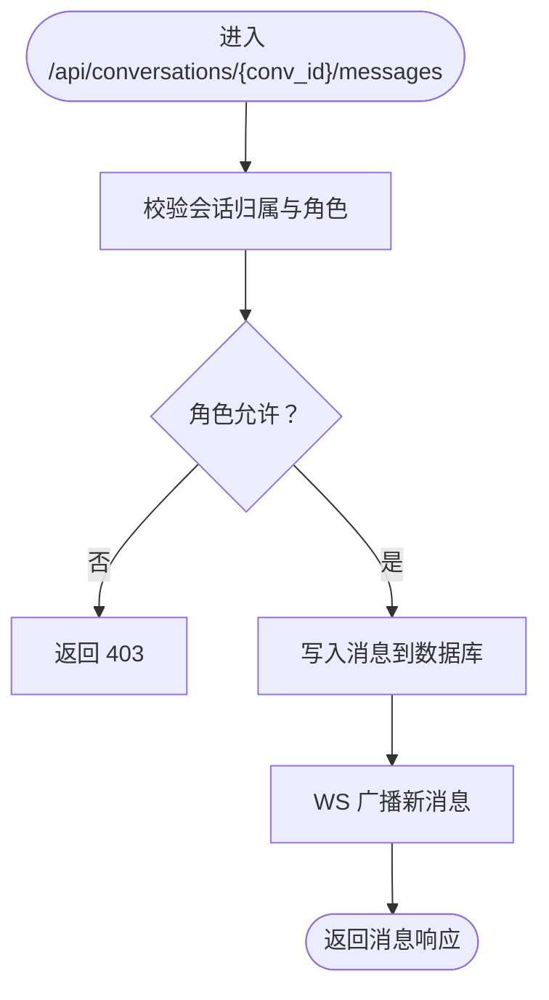
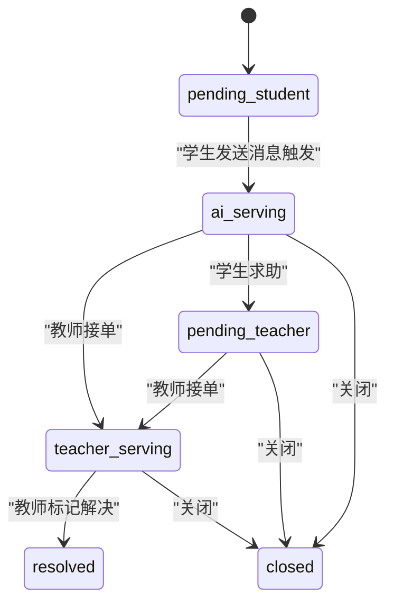
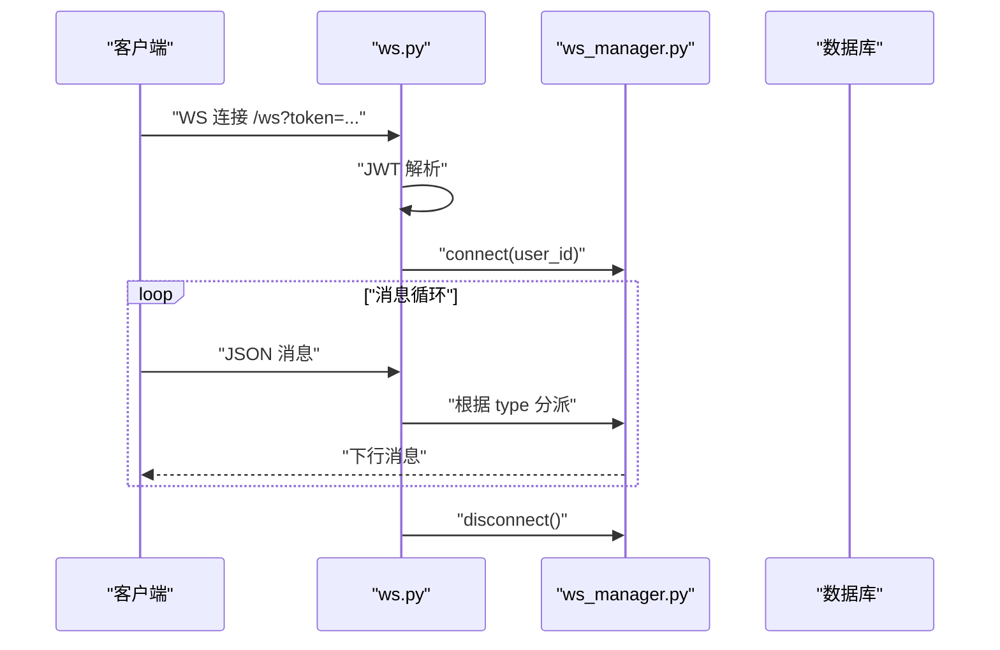
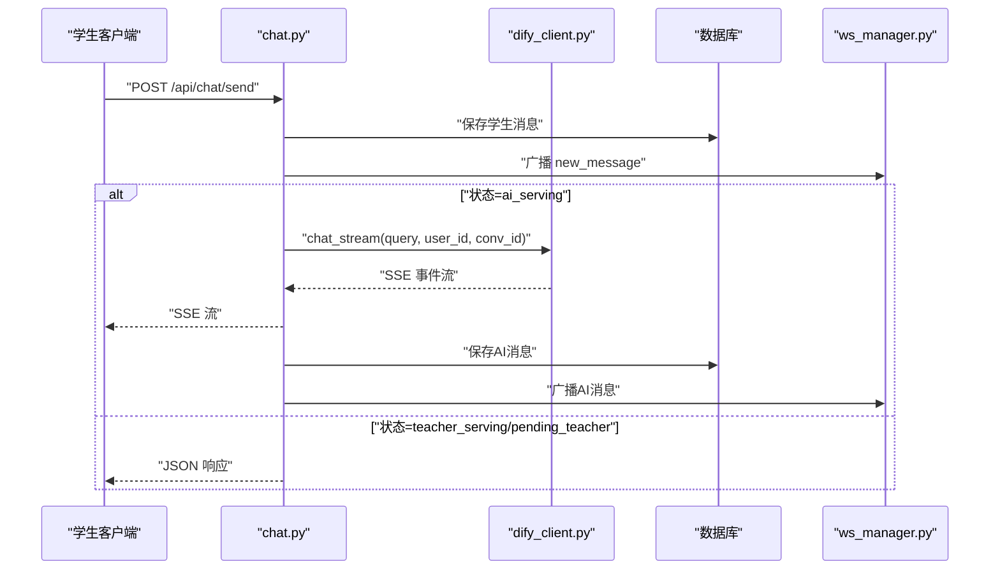
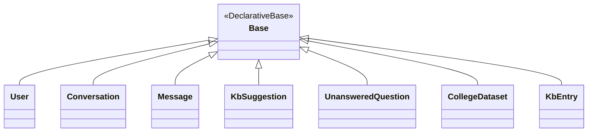
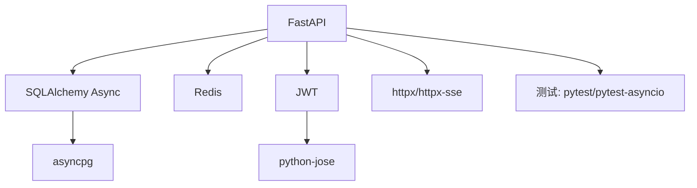

# 后端服务

<cite>
**本文引用的文件**
- [services/gateway/app/main.py](file://services/gateway/app/main.py)
- [services/gateway/app/config.py](file://services/gateway/app/config.py)
- [services/gateway/app/database.py](file://services/gateway/app/database.py)
- [services/gateway/app/utils/deps.py](file://services/gateway/app/utils/deps.py)
- [services/gateway/app/routers/auth.py](file://services/gateway/app/routers/auth.py)
- [services/gateway/app/routers/conversations.py](file://services/gateway/app/routers/conversations.py)
- [services/gateway/app/routers/actions.py](file://services/gateway/app/routers/actions.py)
- [services/gateway/app/routers/ws.py](file://services/gateway/app/routers/ws.py)
- [services/gateway/app/routers/chat.py](file://services/gateway/app/routers/chat.py)
- [services/gateway/app/models/__init__.py](file://services/gateway/app/models/__init__.py)
- [services/gateway/app/models/user.py](file://services/gateway/app/models/user.py)
- [services/gateway/app/models/conversation.py](file://services/gateway/app/models/conversation.py)
- [services/gateway/app/models/knowledge.py](file://services/gateway/app/models/knowledge.py)
- [services/gateway/app/models/kb_entry.py](file://services/gateway/app/models/kb_entry.py)
- [services/gateway/app/services/auth_service.py](file://services/gateway/app/services/auth_service.py)
- [services/gateway/app/services/conversation_service.py](file://services/gateway/app/services/conversation_service.py)
- [services/gateway/app/services/state_machine.py](file://services/gateway/app/services/state_machine.py)
- [services/gateway/app/services/dify_client.py](file://services/gateway/app/services/dify_client.py)
- [services/gateway/app/services/ws_manager.py](file://services/gateway/app/services/ws_manager.py)
- [services/gateway/app/schemas/auth.py](file://services/gateway/app/schemas/auth.py)
- [services/gateway/app/schemas/chat.py](file://services/gateway/app/schemas/chat.py)
- [services/gateway/app/schemas/conversation.py](file://services/gateway/app/schemas/conversation.py)
- [services/gateway/requirements.txt](file://services/gateway/requirements.txt)
- [services/gateway/Dockerfile](file://services/gateway/Dockerfile)
- [deploy/docker-compose.yml](file://deploy/docker-compose.yml)
- [deploy/nginx/gateway.conf](file://deploy/nginx/gateway.conf)
- [scripts/migrate_kb.py](file://scripts/migrate_kb.py)
- [scripts/seed.py](file://scripts/seed.py)
- [scripts/s2-ws-test.py](file://scripts/s2-ws-test.py)
- [test_login.py](file://test_login.py)
- [ws_test.py](file://ws_test.py)
</cite>

## 目录
1. [简介](#简介)
2. [项目结构](#项目结构)
3. [核心组件](#核心组件)
4. [架构总览](#架构总览)
5. [详细组件分析](#详细组件分析)
6. [依赖分析](#依赖分析)
7. [性能考虑](#性能考虑)
8. [故障排查指南](#故障排查指南)
9. [结论](#结论)
10. [附录](#附录)

## 简介
本文件为“医小管 v2”后端服务的综合技术文档，聚焦于 API 网关设计与实现、服务层架构（会话管理、认证授权、实时通信）、数据访问层设计（SQLAlchemy 模型与异步数据库连接）、中间件与拦截器（CORS、日志、性能监控）以及完整 API 接口说明与部署运维方案。文档面向开发者与运维人员，既提供高层概览也包含代码级细节与可视化图示。

## 项目结构
后端采用 FastAPI + SQLAlchemy Async 架构，核心位于 services/gateway 目录，按功能分层组织：
- 应用入口与生命周期：app/main.py
- 配置中心：app/config.py
- 数据库与会话：app/database.py
- 依赖注入与通用工具：app/utils/deps.py
- 路由模块：app/routers/*
- 业务服务：app/services/*
- 数据模型：app/models/*
- 请求/响应模型：app/schemas/*
- 部署与编排：deploy/*
- 运维脚本：scripts/*

图表来源
- [services/gateway/app/main.py:1-78](file://services/gateway/app/main.py#L1-L78)
- [services/gateway/app/config.py:1-31](file://services/gateway/app/config.py#L1-L31)
- [services/gateway/app/database.py:1-15](file://services/gateway/app/database.py#L1-L15)
- [services/gateway/app/utils/deps.py:1-40](file://services/gateway/app/utils/deps.py#L1-L40)
- [services/gateway/app/routers/auth.py:1-35](file://services/gateway/app/routers/auth.py#L1-L35)
- [services/gateway/app/routers/conversations.py:1-129](file://services/gateway/app/routers/conversations.py#L1-L129)
- [services/gateway/app/routers/actions.py:1-154](file://services/gateway/app/routers/actions.py#L1-L154)
- [services/gateway/app/routers/ws.py:1-119](file://services/gateway/app/routers/ws.py#L1-L119)
- [services/gateway/app/routers/chat.py:1-191](file://services/gateway/app/routers/chat.py#L1-L191)
- [services/gateway/app/models/__init__.py:1-5](file://services/gateway/app/models/__init__.py#L1-L5)

章节来源
- [services/gateway/app/main.py:1-78](file://services/gateway/app/main.py#L1-L78)
- [services/gateway/app/config.py:1-31](file://services/gateway/app/config.py#L1-L31)
- [services/gateway/app/database.py:1-15](file://services/gateway/app/database.py#L1-L15)
- [services/gateway/app/utils/deps.py:1-40](file://services/gateway/app/utils/deps.py#L1-L40)

## 核心组件
- 应用入口与生命周期管理：负责启动时初始化 Redis 连接，关闭时释放；提供健康检查端点；统一挂载各路由模块。
- 配置中心：集中管理数据库、Redis、JWT、Dify 等外部服务配置，并支持从 .env 文件加载。
- 数据库层：基于 SQLAlchemy 2.x 异步引擎与会话工厂，提供自动连接池与会话依赖注入。
- 依赖注入与通用工具：提供 JWT 解析、当前用户解析、Redis 获取等通用依赖。
- 路由模块：按功能划分认证、会话与消息、会话动作、WebSocket、聊天与SSE。
- 服务层：封装认证、会话管理、状态机、Dify 客户端、WebSocket 管理等业务逻辑。
- 数据模型层：用户、会话、消息、知识库相关实体及枚举。
- 中间件与拦截器：未显式注册全局中间件，但可通过 FastAPI 中间件扩展实现 CORS、日志、性能监控等。

章节来源
- [services/gateway/app/main.py:16-78](file://services/gateway/app/main.py#L16-L78)
- [services/gateway/app/config.py:3-31](file://services/gateway/app/config.py#L3-L31)
- [services/gateway/app/database.py:6-15](file://services/gateway/app/database.py#L6-L15)
- [services/gateway/app/utils/deps.py:14-40](file://services/gateway/app/utils/deps.py#L14-L40)

## 架构总览
下图展示应用启动、请求处理、数据库与外部服务交互的整体流程。

图表来源
- [services/gateway/app/main.py:24-78](file://services/gateway/app/main.py#L24-L78)
- [services/gateway/app/routers/chat.py:22-103](file://services/gateway/app/routers/chat.py#L22-L103)
- [services/gateway/app/services/dify_client.py](file://services/gateway/app/services/dify_client.py)
- [services/gateway/app/database.py:6-15](file://services/gateway/app/database.py#L6-L15)

## 详细组件分析

### API 网关与路由设计
- 路由挂载策略：在应用入口统一 include_router，按模块前缀区分命名空间，便于版本演进与扩展。
- 健康检查：提供多组件健康探测（PostgreSQL、Redis、Dify），返回聚合状态与明细。
- 路由职责分离：认证、会话、动作、WebSocket、聊天分别由独立模块处理，职责清晰。

图表来源
- [services/gateway/app/main.py:70-78](file://services/gateway/app/main.py#L70-L78)

章节来源
- [services/gateway/app/main.py:24-78](file://services/gateway/app/main.py#L24-L78)

### 认证与授权
- JWT 解析：通过 HTTP Bearer 令牌解析用户身份，校验用户存在且启用。
- 当前用户依赖：get_current_user 将用户对象注入到路由处理器。
- 登录接口：验证凭据后签发访问令牌；个人信息接口返回用户角色、学院/班级等信息。

图表来源
- [services/gateway/app/routers/auth.py:12-21](file://services/gateway/app/routers/auth.py#L12-L21)
- [services/gateway/app/utils/deps.py:14-35](file://services/gateway/app/utils/deps.py#L14-L35)
- [services/gateway/app/services/auth_service.py](file://services/gateway/app/services/auth_service.py)

章节来源
- [services/gateway/app/routers/auth.py:12-35](file://services/gateway/app/routers/auth.py#L12-L35)
- [services/gateway/app/utils/deps.py:14-35](file://services/gateway/app/utils/deps.py#L14-L35)

### 会话管理与消息处理
- 会话创建：仅学生可创建，带标题；列表分页与状态过滤；详情与消息列表。
- 消息发送：根据角色设置发送方类型；教师仅能回复其正在服务的会话；消息写入后通过 WebSocket 广播。
- 权限控制：通过 can_access_conversation 与角色校验确保操作合法性。

图表来源
- [services/gateway/app/routers/conversations.py:81-129](file://services/gateway/app/routers/conversations.py#L81-L129)
- [services/gateway/app/services/conversation_service.py](file://services/gateway/app/services/conversation_service.py)
- [services/gateway/app/services/ws_manager.py](file://services/gateway/app/services/ws_manager.py)

章节来源
- [services/gateway/app/routers/conversations.py:21-129](file://services/gateway/app/routers/conversations.py#L21-L129)

### 会话动作与状态机
- 动作接口：学生可“升级求助”（escalate），教师可“接单”（accept），教师或管理员可“标记解决”（resolve），任意角色可“关闭”（close）。
- 状态机：transition 定义合法状态转换，非法转换返回冲突错误；成功后通过 WebSocket 广播状态变更。
- 通知机制：学生求助时向同学院教师广播通知。

图表来源
- [services/gateway/app/services/state_machine.py](file://services/gateway/app/services/state_machine.py)
- [services/gateway/app/routers/actions.py:68-154](file://services/gateway/app/routers/actions.py#L68-L154)

章节来源
- [services/gateway/app/routers/actions.py:68-154](file://services/gateway/app/routers/actions.py#L68-L154)

### 实时通信（WebSocket）
- 连接认证：通过查询参数携带 JWT，解析用户身份与角色。
- 房间管理：加入/离开会话房间；房间名规则 conv:{conv_id}。
- 消息协议：支持 join_room、leave_room、send_message、typing、ping 等；下行消息包括 new_message、status_changed、escalation_notify、teacher_typing、pong、error。
- 错误处理：无效 JSON、未知类型、断开连接均进行清理与日志记录。

图表来源
- [services/gateway/app/routers/ws.py:11-119](file://services/gateway/app/routers/ws.py#L11-L119)
- [services/gateway/app/services/ws_manager.py](file://services/gateway/app/services/ws_manager.py)

章节来源
- [services/gateway/app/routers/ws.py:11-119](file://services/gateway/app/routers/ws.py#L11-L119)

### 聊天与 SSE 流
- 学生消息发送：先保存消息并广播；根据会话状态决定路径：
  - ai_serving：调用 Dify 流式回答，返回 SSE；
  - teacher_serving/pending_teacher：直接返回 JSON。
- Dify 集成：流式事件 message/token、message_end、error；保存 AI 回答并广播；必要时更新会话关联的 Dify 会话 ID。
- 状态回退：若会话处于 resolved，收到消息将触发 reactivation 并广播状态变更。

图表来源
- [services/gateway/app/routers/chat.py:22-191](file://services/gateway/app/routers/chat.py#L22-L191)
- [services/gateway/app/services/dify_client.py](file://services/gateway/app/services/dify_client.py)
- [services/gateway/app/services/conversation_service.py](file://services/gateway/app/services/conversation_service.py)

章节来源
- [services/gateway/app/routers/chat.py:22-191](file://services/gateway/app/routers/chat.py#L22-L191)

### 数据访问层设计
- 异步引擎与会话：使用 asyncpg 作为驱动，连接池大小可控，expire_on_commit 避免过早失效。
- 依赖注入：get_db 提供异步上下文会话，确保每个请求一个会话实例。
- 模型导出：通过 __init__.py 聚合导出，便于上层按需导入。
- 关键实体：用户、会话、消息、知识库建议、未解答问题、知识条目等。

图表来源
- [services/gateway/app/database.py:9-15](file://services/gateway/app/database.py#L9-L15)
- [services/gateway/app/models/__init__.py:1-5](file://services/gateway/app/models/__init__.py#L1-L5)
- [services/gateway/app/models/user.py](file://services/gateway/app/models/user.py)
- [services/gateway/app/models/conversation.py](file://services/gateway/app/models/conversation.py)
- [services/gateway/app/models/knowledge.py](file://services/gateway/app/models/knowledge.py)
- [services/gateway/app/models/kb_entry.py](file://services/gateway/app/models/kb_entry.py)

章节来源
- [services/gateway/app/database.py:6-15](file://services/gateway/app/database.py#L6-L15)
- [services/gateway/app/models/__init__.py:1-5](file://services/gateway/app/models/__init__.py#L1-L5)

### 中间件与拦截器
- CORS：未在应用中显式注册，如需跨域请通过 FastAPI 中间件添加。
- 日志：路由层与 WebSocket 层使用标准日志记录错误与异常。
- 性能监控：未内置指标采集，建议接入 Prometheus/Grafana 或 APM 工具。

章节来源
- [services/gateway/app/routers/ws.py:114-119](file://services/gateway/app/routers/ws.py#L114-L119)

### 完整 API 接口文档与使用示例
以下为关键接口清单与典型使用场景（以路径与语义描述为主，避免粘贴具体代码）：

- 认证
  - POST /api/auth/login：登录换取访问令牌
  - GET /api/auth/me：获取当前用户信息
- 会话
  - POST /api/conversations：创建会话（仅学生）
  - GET /api/conversations：分页列出会话（支持状态过滤）
  - GET /api/conversations/{conv_id}：获取会话详情
  - GET /api/conversations/{conv_id}/messages：分页获取消息
  - POST /api/conversations/{conv_id}/messages：发送消息（学生/教师）
- 会话动作
  - POST /api/conversations/{conv_id}/escalate：学生求助
  - POST /api/conversations/{conv_id}/accept：教师接单
  - POST /api/conversations/{conv_id}/resolve：教师标记解决
  - POST /api/conversations/{conv_id}/close：关闭会话
- 聊天
  - POST /api/chat/send：学生发送消息（AI 流式或直接返回）
- WebSocket
  - GET /ws?token=...：连接并加入房间、发送消息、打字提示、心跳

章节来源
- [services/gateway/app/routers/auth.py:12-35](file://services/gateway/app/routers/auth.py#L12-L35)
- [services/gateway/app/routers/conversations.py:21-129](file://services/gateway/app/routers/conversations.py#L21-L129)
- [services/gateway/app/routers/actions.py:68-154](file://services/gateway/app/routers/actions.py#L68-L154)
- [services/gateway/app/routers/chat.py:22-191](file://services/gateway/app/routers/chat.py#L22-L191)
- [services/gateway/app/routers/ws.py:11-119](file://services/gateway/app/routers/ws.py#L11-L119)

## 依赖分析
- 核心框架：FastAPI、Uvicorn
- 数据库：SQLAlchemy Async、asyncpg、Alembic
- 缓存：Redis（异步客户端）
- 认证：python-jose、passlib、bcrypt
- HTTP 客户端：httpx、httpx-sse
- 配置：pydantic-settings
- 开发测试：pytest、pytest-asyncio

图表来源
- [services/gateway/requirements.txt:1-29](file://services/gateway/requirements.txt#L1-L29)

章节来源
- [services/gateway/requirements.txt:1-29](file://services/gateway/requirements.txt#L1-L29)

## 性能考虑
- 异步化：全链路采用异步 I/O，降低阻塞。
- 连接池：数据库连接池大小适配并发；Redis 使用异步客户端。
- SSE 流：Dify 返回事件流，前端可渐进接收；注意 Nginx/反向代理对长连接与缓冲区的配置。
- 事务边界：消息写入与状态变更在事务内完成，避免不一致。
- 缓存策略：利用 Redis 缓存热点数据与会话元信息，减少数据库压力。

## 故障排查指南
- 健康检查
  - /health：检查 PostgreSQL、Redis、Dify 可达性与可用性，聚合状态为 ok 或 degraded。
- 认证失败
  - 401 未授权：检查 Bearer 令牌是否有效、用户是否存在且启用。
- 会话权限
  - 403 无权：确认当前用户与会话归属关系、角色限制。
- WebSocket
  - 断连与错误：查看日志定位异常；确认 JWT 有效性与房间加入流程。
- Dify 流式响应
  - message_end 未到达：检查 Dify 服务稳定性与网络超时；关注错误事件并降级处理。

章节来源
- [services/gateway/app/main.py:30-68](file://services/gateway/app/main.py#L30-L68)
- [services/gateway/app/utils/deps.py:14-35](file://services/gateway/app/utils/deps.py#L14-L35)
- [services/gateway/app/routers/conversations.py:81-129](file://services/gateway/app/routers/conversations.py#L81-L129)
- [services/gateway/app/routers/ws.py:114-119](file://services/gateway/app/routers/ws.py#L114-L119)
- [services/gateway/app/routers/chat.py:105-191](file://services/gateway/app/routers/chat.py#L105-L191)

## 结论
本后端服务以 FastAPI 为核心，结合 SQLAlchemy Async、Redis 与 Dify 流式能力，构建了高可用的会话与实时通信系统。通过清晰的分层与依赖注入，实现了认证授权、会话管理、状态机与 WebSocket 广播的协同工作。建议后续完善全局中间件（CORS/日志/监控）、补充单元与集成测试，并在生产环境优化 Nginx 配置与数据库索引。

## 附录

### 部署与运维
- Docker 编排：通过 docker-compose 构建并运行网关容器，映射端口、注入环境变量（数据库、Redis、Dify、JWT）。
- 反向代理：Nginx 配置用于暴露网关、转发 WebSocket 与静态资源。
- 运维脚本：迁移知识库、种子数据、WebSocket 测试脚本辅助本地与预发布环境验证。

章节来源
- [deploy/docker-compose.yml:1-22](file://deploy/docker-compose.yml#L1-L22)
- [deploy/nginx/gateway.conf](file://deploy/nginx/gateway.conf)
- [scripts/migrate_kb.py](file://scripts/migrate_kb.py)
- [scripts/seed.py](file://scripts/seed.py)
- [scripts/s2-ws-test.py](file://scripts/s2-ws-test.py)
- [test_login.py](file://test_login.py)
- [ws_test.py](file://ws_test.py)