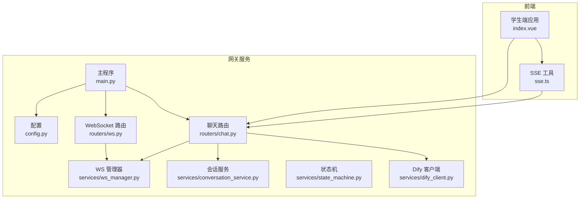
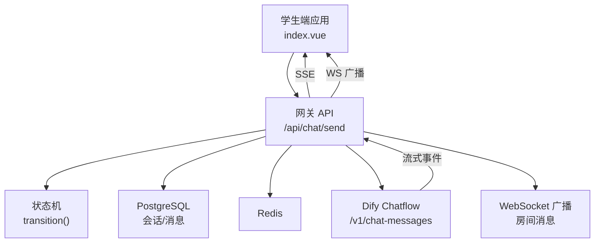
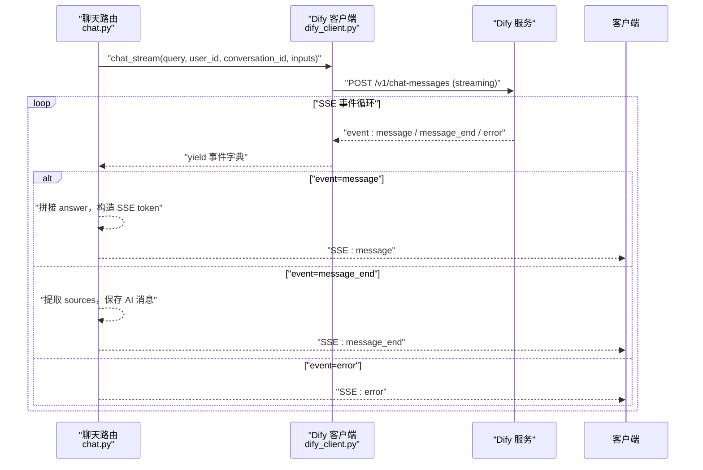
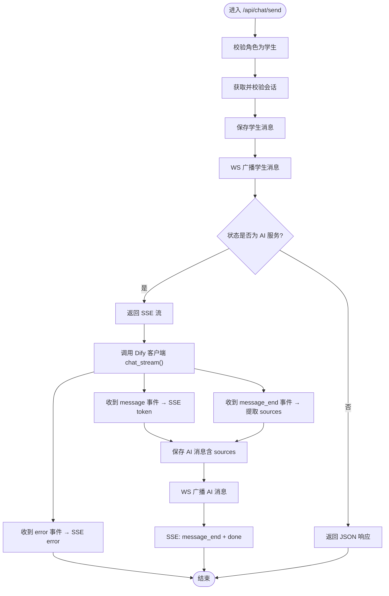
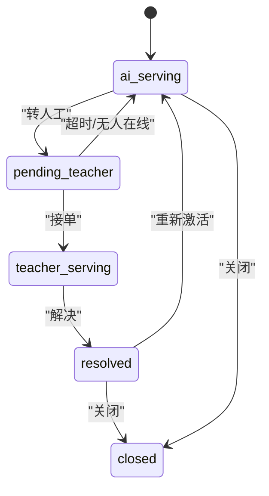
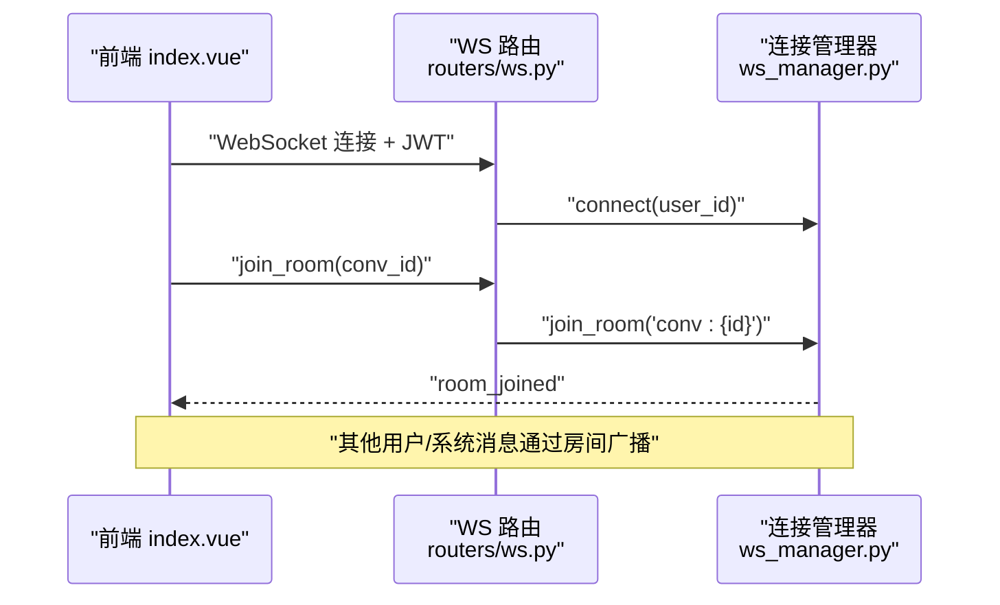
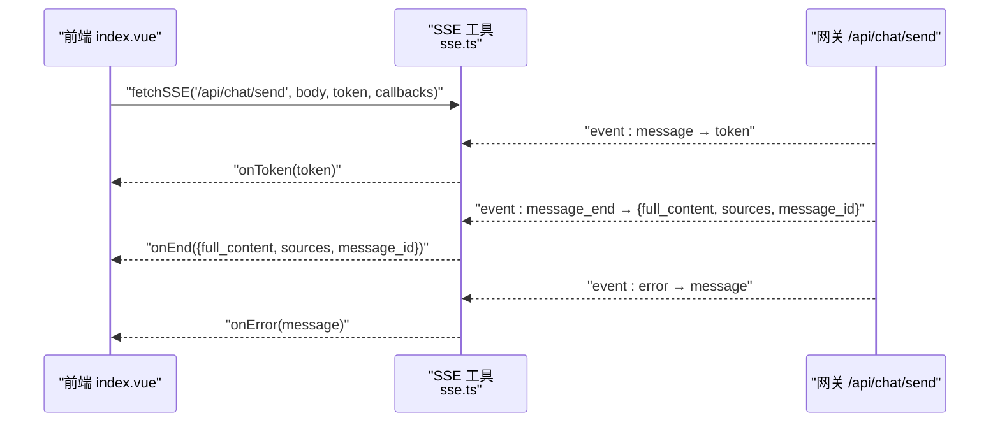
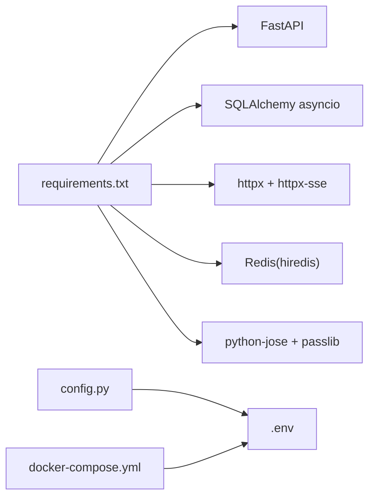

# AI 集成服务

<cite>
**本文档引用的文件**
- [services/gateway/app/main.py](file://services/gateway/app/main.py)
- [services/gateway/app/config.py](file://services/gateway/app/config.py)
- [services/gateway/app/services/dify_client.py](file://services/gateway/app/services/dify_client.py)
- [services/gateway/app/routers/chat.py](file://services/gateway/app/routers/chat.py)
- [services/gateway/app/routers/ws.py](file://services/gateway/app/routers/ws.py)
- [services/gateway/app/services/conversation_service.py](file://services/gateway/app/services/conversation_service.py)
- [services/gateway/app/models/conversation.py](file://services/gateway/app/models/conversation.py)
- [services/gateway/app/services/state_machine.py](file://services/gateway/app/services/state_machine.py)
- [services/gateway/app/services/ws_manager.py](file://services/gateway/app/services/ws_manager.py)
- [services/gateway/requirements.txt](file://services/gateway/requirements.txt)
- [deploy/docker-compose.yml](file://deploy/docker-compose.yml)
- [apps/student-app/src/utils/sse.ts](file://apps/student-app/src/utils/sse.ts)
- [apps/student-app/src/pages/chat/index.vue](file://apps/student-app/src/pages/chat/index.vue)
- [apps/student-app/src/api/chat.ts](file://apps/student-app/src/api/chat.ts)
- [apps/student-app/src/types/chat.ts](file://apps/student-app/src/types/chat.ts)
</cite>

## 目录
1. [简介](#简介)
2. [项目结构](#项目结构)
3. [核心组件](#核心组件)
4. [架构总览](#架构总览)
5. [详细组件分析](#详细组件分析)
6. [依赖分析](#依赖分析)
7. [性能考虑](#性能考虑)
8. [故障排查指南](#故障排查指南)
9. [结论](#结论)
10. [附录](#附录)

## 简介
本文件为“AI 集成服务”的综合技术文档，聚焦于 Dify AI 服务的集成方式、API 调用流程、流式响应处理机制，以及意图识别、自然语言理解、知识库检索在系统中的实现逻辑与边界。文档还阐述了配置管理、超时处理、错误重试策略，并给出流式数据传输、消息聚合、响应缓存的优化方案，最后提供监控指标、性能调优与故障恢复的最佳实践。

## 项目结构
系统采用前后端分离架构：
- 网关服务（FastAPI）负责认证、会话管理、状态机、与 Dify 的流式交互、WebSocket 广播。
- 学生端应用（Vue + UniApp）负责发起 SSE 请求、渲染消息与来源引用、触发转人工等操作。
- 部署通过 Docker Compose 将网关服务容器化并注入环境变量。

图表来源
- [services/gateway/app/main.py:1-78](file://services/gateway/app/main.py#L1-L78)
- [services/gateway/app/config.py:1-31](file://services/gateway/app/config.py#L1-L31)
- [services/gateway/app/routers/chat.py:1-191](file://services/gateway/app/routers/chat.py#L1-L191)
- [services/gateway/app/routers/ws.py:1-119](file://services/gateway/app/routers/ws.py#L1-L119)
- [services/gateway/app/services/dify_client.py:1-105](file://services/gateway/app/services/dify_client.py#L1-L105)
- [services/gateway/app/services/conversation_service.py:1-179](file://services/gateway/app/services/conversation_service.py#L1-L179)
- [services/gateway/app/services/state_machine.py:1-96](file://services/gateway/app/services/state_machine.py#L1-L96)
- [services/gateway/app/services/ws_manager.py:1-100](file://services/gateway/app/services/ws_manager.py#L1-L100)
- [apps/student-app/src/utils/sse.ts:1-69](file://apps/student-app/src/utils/sse.ts#L1-L69)

章节来源
- [services/gateway/app/main.py:1-78](file://services/gateway/app/main.py#L1-L78)
- [services/gateway/app/config.py:1-31](file://services/gateway/app/config.py#L1-L31)
- [services/gateway/app/routers/chat.py:1-191](file://services/gateway/app/routers/chat.py#L1-L191)
- [services/gateway/app/routers/ws.py:1-119](file://services/gateway/app/routers/ws.py#L1-L119)
- [services/gateway/app/services/dify_client.py:1-105](file://services/gateway/app/services/dify_client.py#L1-L105)
- [services/gateway/app/services/conversation_service.py:1-179](file://services/gateway/app/services/conversation_service.py#L1-L179)
- [services/gateway/app/services/state_machine.py:1-96](file://services/gateway/app/services/state_machine.py#L1-L96)
- [services/gateway/app/services/ws_manager.py:1-100](file://services/gateway/app/services/ws_manager.py#L1-L100)
- [apps/student-app/src/utils/sse.ts:1-69](file://apps/student-app/src/utils/sse.ts#L1-L69)

## 核心组件
- 配置中心：集中管理数据库、Redis、JWT、Dify API 等参数，支持从环境变量读取。
- Dify 客户端：封装 Dify Chatflow 流式接口与知识库文档创建接口，统一超时与错误处理。
- 聊天路由：处理学生消息发送、状态判断、SSE 流式响应、消息持久化与 WebSocket 广播。
- 会话服务：提供会话创建、查询、消息增删改查、访问控制与分页。
- 状态机：定义会话状态转换规则（AI 服务、转人工、教师服务、解决、关闭等）。
- WebSocket 管理：维护用户连接、房间广播、向教师推送新工单通知。
- 健康检查：对数据库、Redis、Dify 服务进行连通性检查。

章节来源
- [services/gateway/app/config.py:1-31](file://services/gateway/app/config.py#L1-L31)
- [services/gateway/app/services/dify_client.py:1-105](file://services/gateway/app/services/dify_client.py#L1-L105)
- [services/gateway/app/routers/chat.py:1-191](file://services/gateway/app/routers/chat.py#L1-L191)
- [services/gateway/app/services/conversation_service.py:1-179](file://services/gateway/app/services/conversation_service.py#L1-L179)
- [services/gateway/app/services/state_machine.py:1-96](file://services/gateway/app/services/state_machine.py#L1-L96)
- [services/gateway/app/services/ws_manager.py:1-100](file://services/gateway/app/services/ws_manager.py#L1-L100)
- [services/gateway/app/main.py:30-68](file://services/gateway/app/main.py#L30-L68)

## 架构总览
系统以“前端应用 → 网关服务 → Dify AI 服务”为主线，辅以数据库与 Redis 缓存、WebSocket 实时通知与状态机驱动的会话流转。

图表来源
- [services/gateway/app/routers/chat.py:22-191](file://services/gateway/app/routers/chat.py#L22-L191)
- [services/gateway/app/services/dify_client.py:22-105](file://services/gateway/app/services/dify_client.py#L22-L105)
- [services/gateway/app/services/state_machine.py:34-96](file://services/gateway/app/services/state_machine.py#L34-L96)
- [services/gateway/app/services/ws_manager.py:8-100](file://services/gateway/app/services/ws_manager.py#L8-L100)
- [services/gateway/app/main.py:30-68](file://services/gateway/app/main.py#L30-L68)

## 详细组件分析

### Dify 客户端与流式调用
- 封装 Dify Chatflow 流式接口，使用异步 HTTP 客户端与 SSE 连接，逐条事件解析并透传给上层。
- 事件类型包括：message（增量 token）、message_end（结束，携带检索来源）、error（错误）。
- 超时设置：聊天流默认较长超时，知识库文档创建接口有独立超时。
- 错误处理：JSON 解析失败时记录警告；异常捕获后向上游返回 error 事件。

图表来源
- [services/gateway/app/routers/chat.py:105-191](file://services/gateway/app/routers/chat.py#L105-L191)
- [services/gateway/app/services/dify_client.py:22-105](file://services/gateway/app/services/dify_client.py#L22-L105)

章节来源
- [services/gateway/app/services/dify_client.py:11-105](file://services/gateway/app/services/dify_client.py#L11-L105)
- [services/gateway/app/routers/chat.py:105-191](file://services/gateway/app/routers/chat.py#L105-L191)

### 聊天路由与消息生命周期
- 学生发送消息时，先校验会话状态与权限，保存学生消息，广播至房间。
- 若状态为 AI 服务，则返回 SSE 流；若为教师服务，则返回 JSON。
- 流式响应中，首条事件可能携带新的 Dify 会话 ID；最终保存完整 AI 消息并再次广播。
- 消息元数据包含来源引用（标题、分数、片段），用于 UI 展示。

图表来源
- [services/gateway/app/routers/chat.py:22-191](file://services/gateway/app/routers/chat.py#L22-L191)
- [services/gateway/app/services/conversation_service.py:148-179](file://services/gateway/app/services/conversation_service.py#L148-L179)

章节来源
- [services/gateway/app/routers/chat.py:22-191](file://services/gateway/app/routers/chat.py#L22-L191)
- [services/gateway/app/services/conversation_service.py:148-179](file://services/gateway/app/services/conversation_service.py#L148-L179)

### 会话状态机与转人工流程
- 定义合法状态转换：AI 服务 → 转人工、转人工 → 接单、接单 → 解决、解决 → 关闭/重新激活等。
- 执行转换时更新会话状态与时间戳，写入系统消息，必要时设置教师 ID 或清空。
- 学生可在 AI 服务中触发转人工，状态变为“等待教师”，前端收到状态变更通知。

图表来源
- [services/gateway/app/services/state_machine.py:16-31](file://services/gateway/app/services/state_machine.py#L16-L31)
- [services/gateway/app/services/state_machine.py:34-96](file://services/gateway/app/services/state_machine.py#L34-L96)

章节来源
- [services/gateway/app/services/state_machine.py:1-96](file://services/gateway/app/services/state_machine.py#L1-L96)

### WebSocket 广播与实时通知
- WS 路由负责鉴权、房间加入/离开、typing 通知、消息广播。
- 连接管理器维护用户到连接集合、房间到连接集合，断线自动清理。
- 前端在页面显示时加入房间，接收新消息与状态变更通知，实现准实时体验。

图表来源
- [services/gateway/app/routers/ws.py:11-119](file://services/gateway/app/routers/ws.py#L11-L119)
- [services/gateway/app/services/ws_manager.py:8-100](file://services/gateway/app/services/ws_manager.py#L8-L100)
- [apps/student-app/src/pages/chat/index.vue:260-326](file://apps/student-app/src/pages/chat/index.vue#L260-L326)

章节来源
- [services/gateway/app/routers/ws.py:1-119](file://services/gateway/app/routers/ws.py#L1-L119)
- [services/gateway/app/services/ws_manager.py:1-100](file://services/gateway/app/services/ws_manager.py#L1-L100)
- [apps/student-app/src/pages/chat/index.vue:260-326](file://apps/student-app/src/pages/chat/index.vue#L260-L326)

### 前端流式渲染与来源引用
- 前端通过 SSE 工具订阅 /api/chat/send，按事件类型更新 UI：增量 token、最终内容与来源。
- 来源引用以弹层形式展示，支持点击跳转查看。
- 当 AI 回答包含拒答关键词且无来源时，提供“转人工”入口。

图表来源
- [apps/student-app/src/utils/sse.ts:13-69](file://apps/student-app/src/utils/sse.ts#L13-L69)
- [services/gateway/app/routers/chat.py:105-191](file://services/gateway/app/routers/chat.py#L105-L191)
- [apps/student-app/src/pages/chat/index.vue:423-481](file://apps/student-app/src/pages/chat/index.vue#L423-L481)

章节来源
- [apps/student-app/src/utils/sse.ts:1-69](file://apps/student-app/src/utils/sse.ts#L1-L69)
- [apps/student-app/src/pages/chat/index.vue:423-481](file://apps/student-app/src/pages/chat/index.vue#L423-L481)

## 依赖分析
- 运行时依赖：FastAPI、SQLAlchemy 异步、httpx/httpx-sse、Redis、JWT、Alembic。
- 环境变量：数据库、Redis、Dify API 地址与密钥、JWT 秘钥与算法、微信配置占位。
- 部署：Docker Compose 将网关服务暴露端口并注入环境变量。

图表来源
- [services/gateway/requirements.txt:1-29](file://services/gateway/requirements.txt#L1-L29)
- [services/gateway/app/config.py:1-31](file://services/gateway/app/config.py#L1-L31)
- [deploy/docker-compose.yml:1-22](file://deploy/docker-compose.yml#L1-L22)

章节来源
- [services/gateway/requirements.txt:1-29](file://services/gateway/requirements.txt#L1-L29)
- [services/gateway/app/config.py:1-31](file://services/gateway/app/config.py#L1-L31)
- [deploy/docker-compose.yml:1-22](file://deploy/docker-compose.yml#L1-L22)

## 性能考虑
- 流式传输
  - 使用 SSE 逐 token 推送，降低首字延迟，提升感知速度。
  - 建议：前端按需滚动、避免频繁重排；后端按事件立即 yield，减少缓冲。
- 消息聚合
  - 将多条增量 token 聚合为一条消息，最终一次性保存，减少数据库写放大。
  - 建议：在消息末尾批量落库，避免中间态可见。
- 响应缓存
  - 对于相同查询可考虑短期缓存（如 Redis）以减轻 Dify 压力，但需注意时效性与一致性。
  - 建议：基于 query + inputs 的哈希作为键，设置 TTL，命中则回源并异步更新缓存。
- 超时与重试
  - Dify 客户端对聊天流设置较长超时，知识库文档创建设置较短超时。
  - 建议：对上游调用增加指数退避重试，区分可重试与不可重试错误码。
- 并发与资源
  - WebSocket 连接数与房间广播需限制每房间消息速率，防止风暴。
  - 建议：对广播队列限速与背压处理。

## 故障排查指南
- 健康检查
  - 网关健康端点同时检查数据库、Redis 与 Dify 服务连通性，返回整体状态与各子系统检查结果。
- 常见问题定位
  - SSE 无输出：检查 /api/chat/send 是否正确返回 StreamingResponse，确认前端 fetchSSE 的回调是否被触发。
  - 事件解析失败：Dify 客户端对非 JSON 数据记录警告，确认 Dify 返回格式。
  - 转人工无效：确认状态机转换是否成功，前端是否收到 status_changed 通知。
  - WS 断连：检查连接管理器断线清理逻辑，确认房间广播是否正常。
- 日志与监控
  - 建议：为 Dify 客户端、聊天路由、状态机、WS 管理器增加结构化日志，埋设关键指标（请求耗时、错误率、事件类型分布、房间广播延迟）。

章节来源
- [services/gateway/app/main.py:30-68](file://services/gateway/app/main.py#L30-L68)
- [services/gateway/app/services/dify_client.py:64-69](file://services/gateway/app/services/dify_client.py#L64-L69)
- [services/gateway/app/routers/ws.py:114-119](file://services/gateway/app/routers/ws.py#L114-L119)

## 结论
本系统通过“SSE 流式响应 + WebSocket 广播 + 状态机驱动”的组合，实现了从意图识别、自然语言理解到知识库检索的闭环体验。Dify 客户端承担对外 API 的统一封装，聊天路由负责业务编排与持久化，状态机确保会话流转的确定性，前端以增量渲染与来源展示提升用户体验。建议在生产环境中进一步完善缓存策略、重试与熔断、指标埋点与告警体系，以获得更稳健的性能与可观测性。

## 附录
- 配置项说明（来自配置中心）
  - 数据库与 Redis：连接字符串
  - JWT：密钥、算法、过期小时
  - Dify：API 地址、API Key、全局数据集 ID、数据集 API Key
  - 微信：小程序与企业微信占位配置
- 部署要点
  - Docker Compose 将网关服务映射到宿主机端口，注入数据库、Redis、Dify 与 JWT 环境变量
- 前端类型与 API
  - 消息与会话类型定义、聊天 API 方法（创建会话、列表、详情、消息列表、转人工）

章节来源
- [services/gateway/app/config.py:3-31](file://services/gateway/app/config.py#L3-L31)
- [deploy/docker-compose.yml:11-17](file://deploy/docker-compose.yml#L11-L17)
- [apps/student-app/src/types/chat.ts:1-45](file://apps/student-app/src/types/chat.ts#L1-L45)
- [apps/student-app/src/api/chat.ts:1-36](file://apps/student-app/src/api/chat.ts#L1-L36)