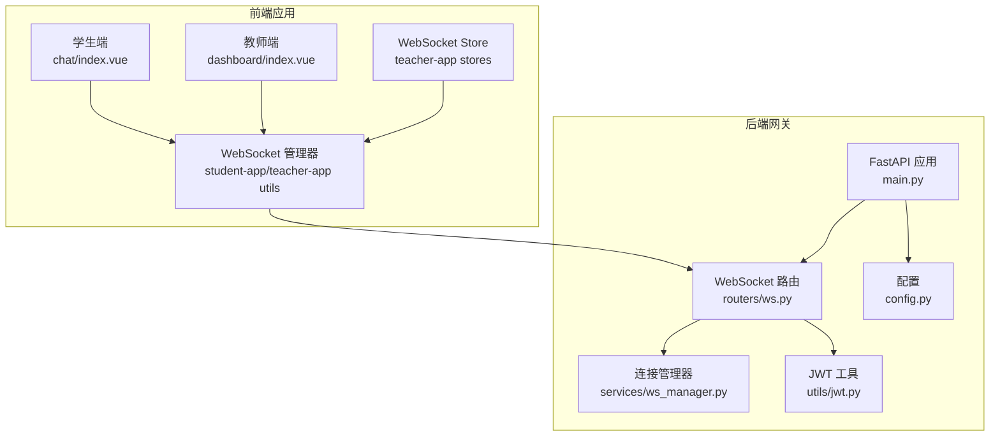
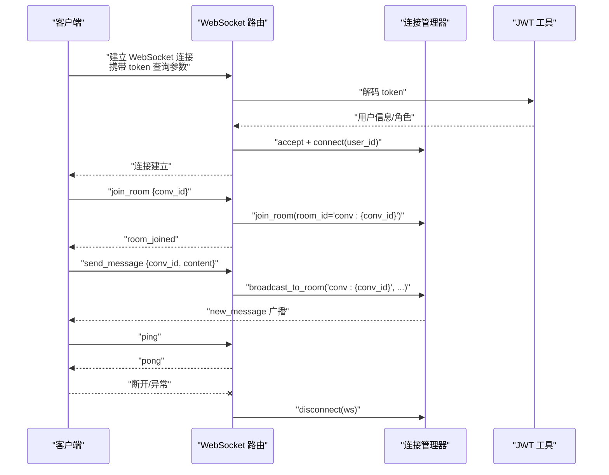
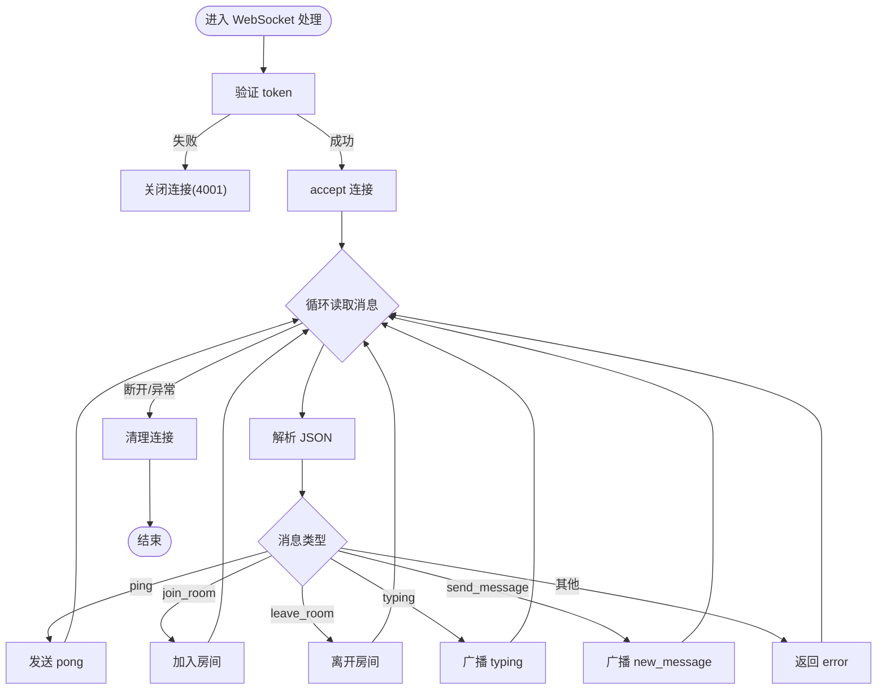
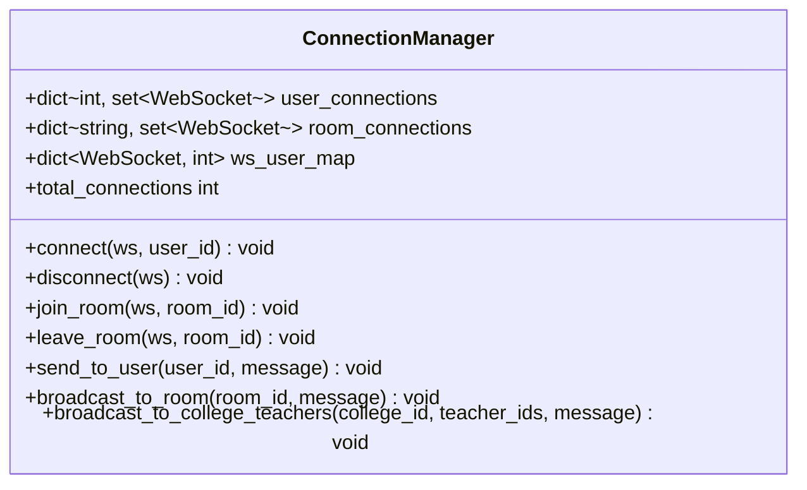
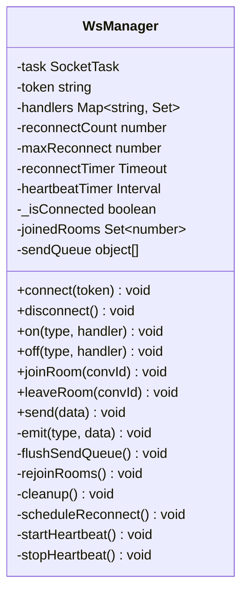
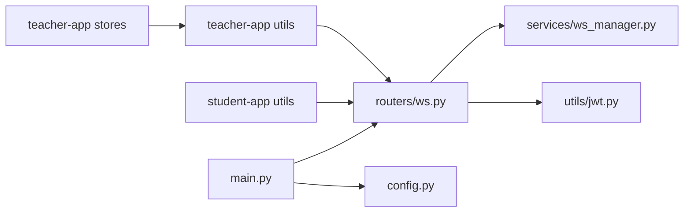

# WebSocket 管理服务

<cite>
**本文档引用的文件**
- [services/gateway/app/services/ws_manager.py](file://services/gateway/app/services/ws_manager.py)
- [services/gateway/app/routers/ws.py](file://services/gateway/app/routers/ws.py)
- [services/gateway/app/utils/jwt.py](file://services/gateway/app/utils/jwt.py)
- [services/gateway/app/main.py](file://services/gateway/app/main.py)
- [services/gateway/app/config.py](file://services/gateway/app/config.py)
- [apps/student-app/src/utils/websocket.ts](file://apps/student-app/src/utils/websocket.ts)
- [apps/teacher-app/src/utils/websocket.ts](file://apps/teacher-app/src/utils/websocket.ts)
- [apps/teacher-app/src/stores/websocket.ts](file://apps/teacher-app/src/stores/websocket.ts)
- [apps/student-app/src/pages/chat/index.vue](file://apps/student-app/src/pages/chat/index.vue)
- [apps/student-app/src/types/chat.ts](file://apps/student-app/src/types/chat.ts)
- [apps/teacher-app/src/types/conversation.ts](file://apps/teacher-app/src/types/conversation.ts)
- [scripts/s2-ws-test.py](file://scripts/s2-ws-test.py)
</cite>

## 目录
1. [简介](#简介)
2. [项目结构](#项目结构)
3. [核心组件](#核心组件)
4. [架构总览](#架构总览)
5. [详细组件分析](#详细组件分析)
6. [依赖关系分析](#依赖关系分析)
7. [性能考虑](#性能考虑)
8. [故障排除指南](#故障排除指南)
9. [结论](#结论)
10. [附录](#附录)

## 简介
本文件为 WebSocket 管理服务的技术文档，面向开发者与运维人员，系统性阐述以下主题：
- WebSocket 连接管理：连接建立、认证、断开清理
- 房间广播机制：基于会话房间的消息广播与房间加入/离开
- 客户端连接维护策略：心跳检测、断线重连、消息队列与自动 re-join
- 消息路由与序列化：消息格式、事件分发、错误处理
- 服务器架构设计：FastAPI 路由、连接管理器、JWT 认证
- 并发连接处理与内存管理优化
- 性能监控与故障排除

## 项目结构
该服务采用“网关 + 前端应用”的分层架构：
- 后端网关（FastAPI）：提供 WebSocket 路由、JWT 认证、连接管理器
- 前端应用（学生端/教师端）：统一的 WebSocket 管理器，负责心跳、重连、房间管理与消息分发

**图表来源**
- [services/gateway/app/main.py:1-78](file://services/gateway/app/main.py#L1-L78)
- [services/gateway/app/routers/ws.py:1-119](file://services/gateway/app/routers/ws.py#L1-L119)
- [services/gateway/app/services/ws_manager.py:1-100](file://services/gateway/app/services/ws_manager.py#L1-L100)
- [services/gateway/app/utils/jwt.py:1-17](file://services/gateway/app/utils/jwt.py#L1-L17)
- [apps/student-app/src/utils/websocket.ts:1-153](file://apps/student-app/src/utils/websocket.ts#L1-L153)
- [apps/teacher-app/src/utils/websocket.ts:1-169](file://apps/teacher-app/src/utils/websocket.ts#L1-L169)
- [apps/teacher-app/src/stores/websocket.ts:1-32](file://apps/teacher-app/src/stores/websocket.ts#L1-L32)

**章节来源**
- [services/gateway/app/main.py:1-78](file://services/gateway/app/main.py#L1-L78)
- [services/gateway/app/routers/ws.py:1-119](file://services/gateway/app/routers/ws.py#L1-L119)
- [services/gateway/app/services/ws_manager.py:1-100](file://services/gateway/app/services/ws_manager.py#L1-L100)
- [services/gateway/app/utils/jwt.py:1-17](file://services/gateway/app/utils/jwt.py#L1-L17)
- [services/gateway/app/config.py:1-31](file://services/gateway/app/config.py#L1-L31)

## 核心组件
- 连接管理器（ConnectionManager）：维护用户连接、房间连接、反向映射，提供用户级与房间级广播能力
- WebSocket 路由（ws.py）：认证、消息解析、消息类型分发、房间管理、错误处理
- WebSocket 管理器（前端）：心跳、断线重连、房间 re-join、消息队列、事件分发
- JWT 工具：签发与解码访问令牌
- FastAPI 应用：路由挂载、Redis/数据库健康检查、生命周期管理

**章节来源**
- [services/gateway/app/services/ws_manager.py:8-100](file://services/gateway/app/services/ws_manager.py#L8-L100)
- [services/gateway/app/routers/ws.py:11-119](file://services/gateway/app/routers/ws.py#L11-L119)
- [apps/student-app/src/utils/websocket.ts:3-153](file://apps/student-app/src/utils/websocket.ts#L3-L153)
- [apps/teacher-app/src/utils/websocket.ts:9-169](file://apps/teacher-app/src/utils/websocket.ts#L9-L169)
- [services/gateway/app/utils/jwt.py:6-17](file://services/gateway/app/utils/jwt.py#L6-L17)
- [services/gateway/app/main.py:16-78](file://services/gateway/app/main.py#L16-L78)

## 架构总览
WebSocket 服务器采用“单连接 + 房间模式”：
- 客户端通过查询参数携带 JWT 进行认证
- 连接成功后，客户端加入会话房间（conv_id），接收房间内广播
- 服务器通过 ConnectionManager 维护用户与房间的双向映射，并在异常时清理资源
- 前端 WebSocket 管理器负责心跳检测、指数退避重连、消息队列与房间 re-join

**图表来源**
- [services/gateway/app/routers/ws.py:11-119](file://services/gateway/app/routers/ws.py#L11-L119)
- [services/gateway/app/services/ws_manager.py:25-81](file://services/gateway/app/services/ws_manager.py#L25-L81)
- [services/gateway/app/utils/jwt.py:14-16](file://services/gateway/app/utils/jwt.py#L14-L16)

## 详细组件分析

### 后端 WebSocket 路由（ws.py）
- 认证：从查询参数提取 token，使用 JWT 工具解码，失败则关闭连接
- 连接注册：调用连接管理器完成 accept 与用户映射
- 消息处理：解析 JSON，根据 type 分发至不同处理逻辑
  - ping/pong：心跳响应
  - join_room/leave_room：房间加入/离开
  - typing/new_message：房间内广播
- 错误处理：捕获断开与异常，确保清理连接

**图表来源**
- [services/gateway/app/routers/ws.py:35-119](file://services/gateway/app/routers/ws.py#L35-L119)

**章节来源**
- [services/gateway/app/routers/ws.py:11-119](file://services/gateway/app/routers/ws.py#L11-L119)

### 连接管理器（ws_manager.py）
- 数据结构
  - user_connections: user_id → set[WebSocket]
  - room_connections: room_id → set[WebSocket]
  - ws_user_map: WebSocket → user_id（反向映射）
- 关键方法
  - connect/disconnect：连接建立与清理
  - join_room/leave_room：房间加入/离开
  - send_to_user/broadcast_to_room：用户级与房间级广播
  - broadcast_to_college_teachers：向多个教师广播（预留）

**图表来源**
- [services/gateway/app/services/ws_manager.py:8-99](file://services/gateway/app/services/ws_manager.py#L8-L99)

**章节来源**
- [services/gateway/app/services/ws_manager.py:8-99](file://services/gateway/app/services/ws_manager.py#L8-L99)

### 前端 WebSocket 管理器（学生端/教师端）
- 统一特性
  - 心跳：每 30 秒发送 ping，忽略 pong
  - 断线重连：指数退避，最大延迟 30 秒，最多重连 10 次
  - 房间管理：记录已加入房间，断线后自动 re-join
  - 消息队列：未连接时缓存消息，连接后 flush
  - 事件分发：收到消息后统一分发到监听者
- 学生端与教师端差异
  - 学生端使用 uni.connectSocket，事件回调略有差异
  - 教师端同时支持 H5 原生 WebSocket 与小程序 uni.connectSocket

**图表来源**
- [apps/teacher-app/src/utils/websocket.ts:9-169](file://apps/teacher-app/src/utils/websocket.ts#L9-L169)
- [apps/student-app/src/utils/websocket.ts:3-153](file://apps/student-app/src/utils/websocket.ts#L3-L153)

**章节来源**
- [apps/teacher-app/src/utils/websocket.ts:9-169](file://apps/teacher-app/src/utils/websocket.ts#L9-L169)
- [apps/student-app/src/utils/websocket.ts:3-153](file://apps/student-app/src/utils/websocket.ts#L3-L153)

### JWT 认证与配置
- JWT 工具：签发与解码访问令牌，包含过期时间与算法配置
- 配置：数据库、Redis、Dify、微信等配置项

**章节来源**
- [services/gateway/app/utils/jwt.py:6-17](file://services/gateway/app/utils/jwt.py#L6-L17)
- [services/gateway/app/config.py:3-31](file://services/gateway/app/config.py#L3-L31)

### 前端页面与事件绑定
- 学生端聊天页：在页面显示时注册 WebSocket 监听，加入/离开房间，处理新消息与状态变更
- 类型定义：消息、会话状态等 TypeScript 类型

**章节来源**
- [apps/student-app/src/pages/chat/index.vue:279-326](file://apps/student-app/src/pages/chat/index.vue#L279-L326)
- [apps/student-app/src/types/chat.ts:7-45](file://apps/student-app/src/types/chat.ts#L7-L45)
- [apps/teacher-app/src/types/conversation.ts:4-17](file://apps/teacher-app/src/types/conversation.ts#L4-L17)

## 依赖关系分析
- 路由依赖连接管理器与 JWT 工具
- 前端 WebSocket 管理器独立于后端，仅依赖浏览器/小程序 API
- FastAPI 应用挂载路由并提供健康检查

**图表来源**
- [services/gateway/app/routers/ws.py:1-119](file://services/gateway/app/routers/ws.py#L1-L119)
- [services/gateway/app/services/ws_manager.py:1-100](file://services/gateway/app/services/ws_manager.py#L1-L100)
- [services/gateway/app/utils/jwt.py:1-17](file://services/gateway/app/utils/jwt.py#L1-L17)
- [services/gateway/app/main.py:1-78](file://services/gateway/app/main.py#L1-L78)
- [services/gateway/app/config.py:1-31](file://services/gateway/app/config.py#L1-L31)
- [apps/student-app/src/utils/websocket.ts:1-153](file://apps/student-app/src/utils/websocket.ts#L1-L153)
- [apps/teacher-app/src/utils/websocket.ts:1-169](file://apps/teacher-app/src/utils/websocket.ts#L1-L169)
- [apps/teacher-app/src/stores/websocket.ts:1-32](file://apps/teacher-app/src/stores/websocket.ts#L1-L32)

**章节来源**
- [services/gateway/app/main.py:16-78](file://services/gateway/app/main.py#L16-L78)
- [services/gateway/app/routers/ws.py:1-119](file://services/gateway/app/routers/ws.py#L1-L119)

## 性能考虑
- 广播复杂度
  - 房间广播：O(N) 遍历房间内连接，逐个发送；异常连接会被清理
  - 用户广播：O(N) 遍历用户所有连接，逐个发送；异常连接会被清理
- 内存管理
  - 使用集合维护连接，便于快速增删
  - 断开时清理用户映射与房间映射，避免内存泄漏
- 心跳与重连
  - 心跳周期 30 秒，降低网络压力
  - 指数退避重连，避免雪崩效应
- 消息序列化
  - 前端统一 JSON 序列化与反序列化，减少解析错误
- 并发处理
  - FastAPI 的异步 WebSocket 处理模型天然支持高并发
- 建议优化
  - 对频繁广播场景可引入 Redis Pub/Sub 实现跨进程广播
  - 对超大房间可考虑分片广播或限流策略
  - 对高延迟网络可调整心跳周期与重连上限

[本节为通用性能讨论，无需具体文件分析]

## 故障排除指南
- 常见问题与定位
  - 认证失败：检查 token 是否有效、是否过期、算法与密钥是否匹配
  - 无法建立连接：检查路由是否正确挂载、健康检查是否通过
  - 广播无效：检查房间 ID 格式（conv:{conv_id}）、房间是否存在
  - 心跳异常：确认前端定时发送 ping、后端正确返回 pong
  - 断线不重连：检查重连次数上限、指数退避是否生效
- 日志与监控
  - 后端：连接/断开日志、异常错误日志
  - 前端：连接状态变化、重连日志、消息解析错误
- 自动测试
  - 提供 S2 WebSocket 冒烟测试脚本，覆盖 ping/pong、join_room、未知类型、无效 token 场景

**章节来源**
- [scripts/s2-ws-test.py:8-50](file://scripts/s2-ws-test.py#L8-L50)
- [services/gateway/app/routers/ws.py:35-119](file://services/gateway/app/routers/ws.py#L35-L119)
- [apps/student-app/src/utils/websocket.ts:129-153](file://apps/student-app/src/utils/websocket.ts#L129-L153)
- [apps/teacher-app/src/utils/websocket.ts:148-165](file://apps/teacher-app/src/utils/websocket.ts#L148-L165)

## 结论
本 WebSocket 管理服务通过清晰的连接管理器与统一的前端 WebSocket 管理器，实现了稳定的连接、房间广播与客户端维护策略。结合 JWT 认证与 FastAPI 的异步处理能力，系统具备良好的扩展性与可维护性。建议在生产环境中进一步引入 Redis 广播、限流与更细粒度的监控指标，以提升大规模并发下的稳定性与可观测性。

[本节为总结性内容，无需具体文件分析]

## 附录

### 消息格式规范
- 上行消息（客户端 → 服务器）
  - join_room：{"type": "join_room", "data": {"conv_id": 123}}
  - leave_room：{"type": "leave_room", "data": {"conv_id": 123}}
  - send_message：{"type": "send_message", "data": {"conv_id": 123, "content": "..."}}
  - typing：{"type": "typing", "data": {"conv_id": 123}}
  - ping：{"type": "ping"}
- 下行消息（服务器 → 客户端）
  - new_message：{"type": "new_message", "data": {...}}
  - status_changed：{"type": "status_changed", "data": {...}}
  - escalation_notify：{"type": "escalation_notify", "data": {...}}
  - teacher_typing/student_typing：{"type": "teacher_typing"/"student_typing", "data": {"conv_id": 123, "user_id": 1}}
  - pong：{"type": "pong"}
  - error：{"type": "error", "data": {"message": "..."}}

**章节来源**
- [services/gateway/app/routers/ws.py:16-34](file://services/gateway/app/routers/ws.py#L16-L34)

### 前端事件订阅示例
- 学生端：在聊天页注册 new_message、status_changed 等事件监听
- 教师端：通过 Pinia Store 订阅连接状态变化

**章节来源**
- [apps/student-app/src/pages/chat/index.vue:319-326](file://apps/student-app/src/pages/chat/index.vue#L319-L326)
- [apps/teacher-app/src/stores/websocket.ts:9-14](file://apps/teacher-app/src/stores/websocket.ts#L9-L14)