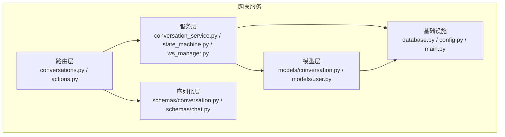
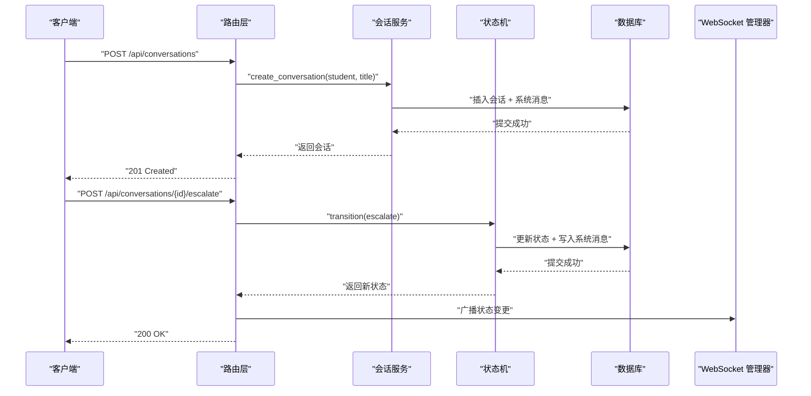
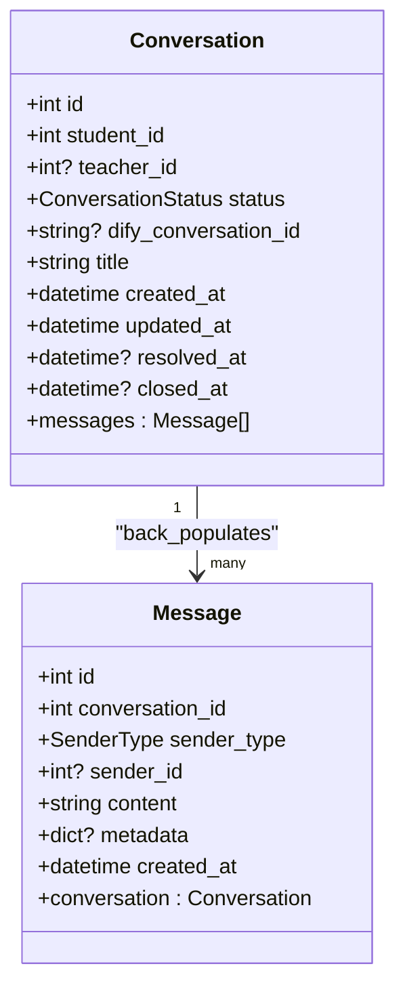
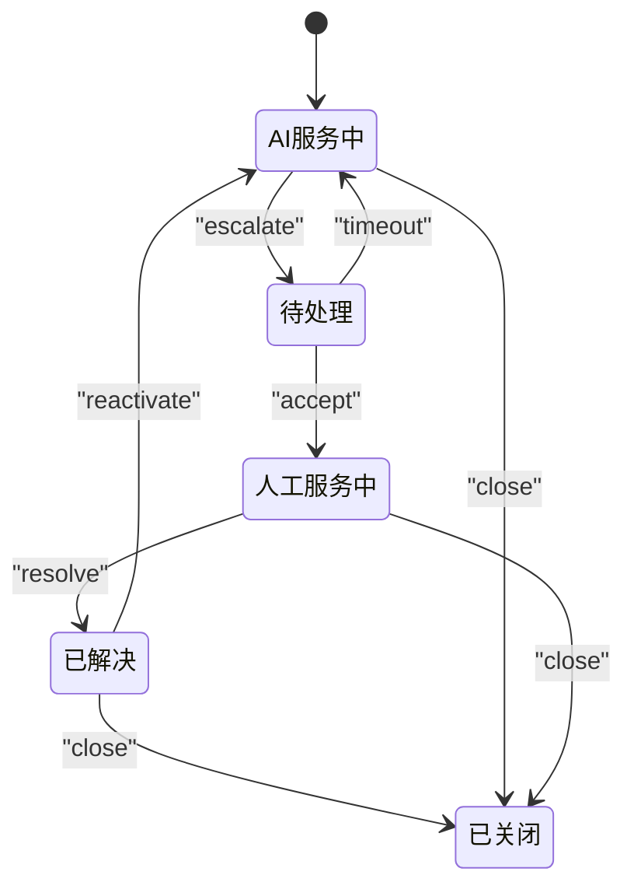
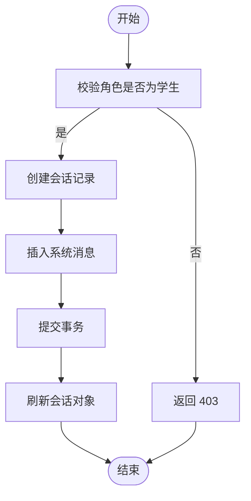
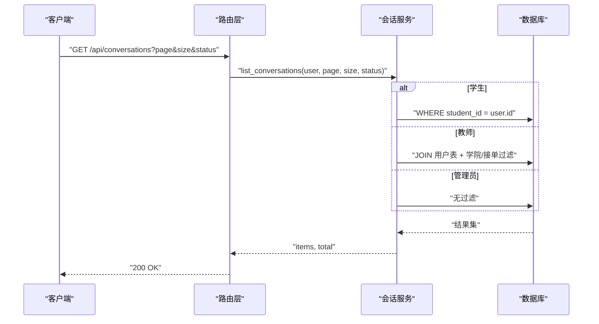
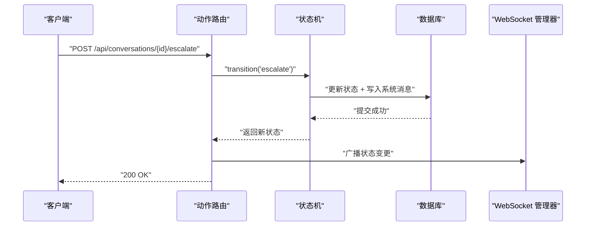
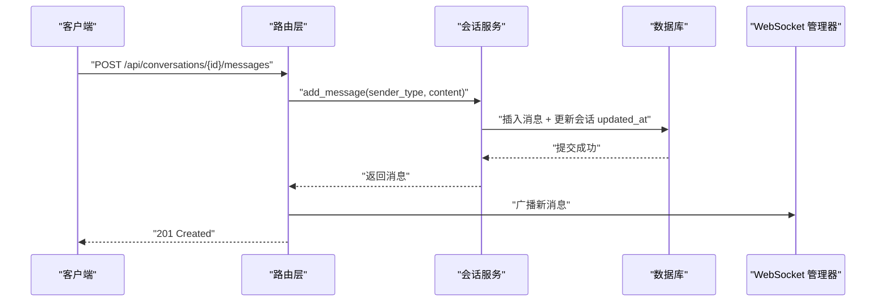
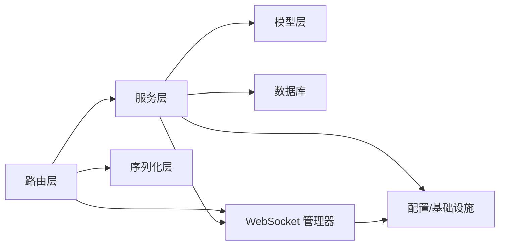

# 会话管理服务

<cite>
**本文档引用的文件**
- [conversation.py](file://services/gateway/app/models/conversation.py)
- [conversation_service.py](file://services/gateway/app/services/conversation_service.py)
- [state_machine.py](file://services/gateway/app/services/state_machine.py)
- [conversations.py](file://services/gateway/app/routers/conversations.py)
- [actions.py](file://services/gateway/app/routers/actions.py)
- [conversation.py](file://services/gateway/app/schemas/conversation.py)
- [user.py](file://services/gateway/app/models/user.py)
- [ws_manager.py](file://services/gateway/app/services/ws_manager.py)
- [chat.py](file://services/gateway/app/schemas/chat.py)
- [database.py](file://services/gateway/app/database.py)
- [main.py](file://services/gateway/app/main.py)
- [config.py](file://services/gateway/app/config.py)
</cite>

## 目录
1. [简介](#简介)
2. [项目结构](#项目结构)
3. [核心组件](#核心组件)
4. [架构总览](#架构总览)
5. [详细组件分析](#详细组件分析)
6. [依赖关系分析](#依赖关系分析)
7. [性能考虑](#性能考虑)
8. [故障排除指南](#故障排除指南)
9. [结论](#结论)

## 简介
本文件面向会话管理服务的技术文档，围绕会话生命周期管理、状态机设计模式的应用、会话创建与更新逻辑进行深入解析。文档详细说明了会话状态流转规则（AI服务中、待处理、人工服务中、已解决、已关闭）及其转换条件；阐述会话数据模型设计、状态持久化机制与并发控制策略；并提供会话查询接口与状态更新接口的实现细节。最后给出最佳实践与性能优化建议，帮助开发者在保证正确性的同时提升系统性能与可维护性。

## 项目结构
会话管理服务位于网关服务内部，采用分层架构组织：
- 模型层：定义会话与消息的数据模型及枚举类型
- 服务层：封装业务逻辑（会话创建、查询、消息管理、状态机）
- 路由层：暴露 REST 接口，负责参数校验与权限控制
- 序列化层：Pydantic 模型定义请求/响应格式
- 基础设施：数据库连接、Redis、WebSocket 管理器等

图表来源
- [conversations.py:1-129](file://services/gateway/app/routers/conversations.py#L1-L129)
- [actions.py:1-154](file://services/gateway/app/routers/actions.py#L1-L154)
- [conversation_service.py:1-179](file://services/gateway/app/services/conversation_service.py#L1-L179)
- [state_machine.py:1-96](file://services/gateway/app/services/state_machine.py#L1-L96)
- [conversation.py:1-63](file://services/gateway/app/models/conversation.py#L1-L63)
- [user.py:1-76](file://services/gateway/app/models/user.py#L1-L76)
- [conversation.py:1-50](file://services/gateway/app/schemas/conversation.py#L1-L50)
- [chat.py:1-18](file://services/gateway/app/schemas/chat.py#L1-L18)
- [database.py:1-15](file://services/gateway/app/database.py#L1-L15)
- [config.py:1-31](file://services/gateway/app/config.py#L1-L31)
- [main.py:1-78](file://services/gateway/app/main.py#L1-L78)

章节来源
- [main.py:70-78](file://services/gateway/app/main.py#L70-L78)
- [database.py:1-15](file://services/gateway/app/database.py#L1-L15)
- [config.py:1-31](file://services/gateway/app/config.py#L1-L31)

## 核心组件
- 会话模型与消息模型：定义会话状态、发送方类型、索引与关联关系
- 会话服务：封装会话创建、列表查询、详情获取、消息列表与新增消息
- 状态机：集中管理状态转换规则与系统消息写入
- 路由接口：会话 CRUD 与状态动作接口，含权限校验与广播通知
- WebSocket 管理器：房间广播与用户推送
- Pydantic 序列化：统一请求/响应结构

章节来源
- [conversation.py:26-63](file://services/gateway/app/models/conversation.py#L26-L63)
- [conversation_service.py:29-179](file://services/gateway/app/services/conversation_service.py#L29-L179)
- [state_machine.py:34-96](file://services/gateway/app/services/state_machine.py#L34-L96)
- [conversations.py:21-129](file://services/gateway/app/routers/conversations.py#L21-L129)
- [actions.py:68-154](file://services/gateway/app/routers/actions.py#L68-L154)
- [ws_manager.py:8-100](file://services/gateway/app/services/ws_manager.py#L8-L100)
- [conversation.py:5-50](file://services/gateway/app/schemas/conversation.py#L5-L50)
- [chat.py:5-18](file://services/gateway/app/schemas/chat.py#L5-L18)

## 架构总览
会话管理服务采用“路由层-服务层-模型层”的清晰分层，配合状态机与 WebSocket 实现状态变更与实时通知。数据库使用异步 SQLAlchemy，支持高并发读写；Redis 用于缓存与健康检查；Dify 客户端在后续阶段接入。

图表来源
- [conversations.py:21-31](file://services/gateway/app/routers/conversations.py#L21-L31)
- [actions.py:68-89](file://services/gateway/app/routers/actions.py#L68-L89)
- [state_machine.py:34-96](file://services/gateway/app/services/state_machine.py#L34-L96)
- [ws_manager.py:71-81](file://services/gateway/app/services/ws_manager.py#L71-L81)

## 详细组件分析

### 会话数据模型设计
- 会话状态枚举：ai_serving、pending_teacher、teacher_serving、resolved、closed
- 发送方类型枚举：student、ai、teacher、system
- 关键字段：学生/教师关联、状态、标题、Dify 会话 ID、时间戳（创建、更新、解决、关闭）
- 索引设计：按学生、状态建立索引，加速查询
- 关联关系：会话与消息一对多

图表来源
- [conversation.py:26-63](file://services/gateway/app/models/conversation.py#L26-L63)

章节来源
- [conversation.py:11-16](file://services/gateway/app/models/conversation.py#L11-L16)
- [conversation.py:19-23](file://services/gateway/app/models/conversation.py#L19-L23)
- [conversation.py:26-63](file://services/gateway/app/models/conversation.py#L26-L63)

### 会话生命周期管理与状态机
状态机集中定义合法转换路径，并在转换时写入系统消息与更新时间戳。支持的动作包括：escalate（转人工）、accept（教师接单）、timeout（超时回退 AI）、resolve（标记已解决）、reactivate（重新激活）、close（关闭）。任何非 closed 状态都可直接关闭。

图表来源
- [state_machine.py:20-31](file://services/gateway/app/services/state_machine.py#L20-L31)

章节来源
- [state_machine.py:8-14](file://services/gateway/app/services/state_machine.py#L8-L14)
- [state_machine.py:19-31](file://services/gateway/app/services/state_machine.py#L19-L31)
- [state_machine.py:34-96](file://services/gateway/app/services/state_machine.py#L34-L96)

### 会话创建与更新逻辑
- 创建会话：学生角色创建，初始状态为 AI 服务中，自动插入系统消息提示
- 更新会话：新增消息时同步更新会话 updated_at 时间戳
- 权限校验：根据用户角色与所属学院限制访问范围

图表来源
- [conversation_service.py:29-51](file://services/gateway/app/services/conversation_service.py#L29-L51)

章节来源
- [conversation_service.py:29-51](file://services/gateway/app/services/conversation_service.py#L29-L51)
- [conversation_service.py:148-179](file://services/gateway/app/services/conversation_service.py#L148-L179)

### 会话查询接口实现细节
- 分页与排序：按 updated_at 倒序分页
- 角色权限：
  - 学生：仅能查看自己的会话
  - 教师：可查看本学院待接单 + 自己正在服务的会话
  - 管理员：可查看全部
- 可选状态过滤：支持按状态筛选

图表来源
- [conversations.py:34-50](file://services/gateway/app/routers/conversations.py#L34-L50)
- [conversation_service.py:54-110](file://services/gateway/app/services/conversation_service.py#L54-L110)

章节来源
- [conversations.py:34-50](file://services/gateway/app/routers/conversations.py#L34-L50)
- [conversation_service.py:54-110](file://services/gateway/app/services/conversation_service.py#L54-L110)

### 状态更新接口实现细节
- 转人工 escalate：仅学生可发起，触发状态从 AI 服务中到待处理，并广播通知
- 接单 accept：教师或管理员可执行，状态从待处理到人工服务中，记录接单教师
- 标记已解决 resolve：仅接单教师可执行，状态从人工服务中到已解决
- 关闭 close：任意有权限用户可执行，直接关闭会话
- 超时回退 timeout：由状态机定义，从待处理回到 AI 服务中

图表来源
- [actions.py:68-89](file://services/gateway/app/routers/actions.py#L68-L89)
- [state_machine.py:34-96](file://services/gateway/app/services/state_machine.py#L34-L96)
- [ws_manager.py:71-81](file://services/gateway/app/services/ws_manager.py#L71-L81)

章节来源
- [actions.py:68-154](file://services/gateway/app/routers/actions.py#L68-L154)
- [state_machine.py:34-96](file://services/gateway/app/services/state_machine.py#L34-L96)

### 会话消息管理
- 新增消息：根据用户角色自动设置发送方类型（学生/教师/系统），并更新会话 updated_at
- 消息列表：按创建时间升序分页返回
- 实时通知：新增消息后通过 WebSocket 房间广播给会话参与者

图表来源
- [conversations.py:81-129](file://services/gateway/app/routers/conversations.py#L81-L129)
- [conversation_service.py:148-179](file://services/gateway/app/services/conversation_service.py#L148-L179)
- [ws_manager.py:71-81](file://services/gateway/app/services/ws_manager.py#L71-L81)

章节来源
- [conversations.py:81-129](file://services/gateway/app/routers/conversations.py#L81-L129)
- [conversation_service.py:148-179](file://services/gateway/app/services/conversation_service.py#L148-L179)

### 并发控制策略
- 异步数据库事务：使用 SQLAlchemy 异步引擎，支持高并发读写
- 会话状态更新原子性：状态机在单次事务中完成状态更新与系统消息写入
- WebSocket 广播容错：连接异常时自动清理无效连接，避免阻塞
- 会话锁与一致性：当前实现未显式加锁，但通过单事务更新与系统消息写入保证一致性

章节来源
- [database.py:6-7](file://services/gateway/app/database.py#L6-L7)
- [state_machine.py:66-70](file://services/gateway/app/services/state_machine.py#L66-L70)
- [ws_manager.py:34-46](file://services/gateway/app/services/ws_manager.py#L34-L46)

## 依赖关系分析
- 路由层依赖服务层与序列化层，负责参数校验与权限控制
- 服务层依赖模型层与数据库，封装业务逻辑
- 状态机独立于路由层，便于测试与复用
- WebSocket 管理器作为全局单例，被路由层调用以实现广播
- 基础设施层提供数据库连接、Redis 与配置

图表来源
- [conversations.py:1-129](file://services/gateway/app/routers/conversations.py#L1-L129)
- [actions.py:1-154](file://services/gateway/app/routers/actions.py#L1-L154)
- [conversation_service.py:1-179](file://services/gateway/app/services/conversation_service.py#L1-L179)
- [state_machine.py:1-96](file://services/gateway/app/services/state_machine.py#L1-L96)
- [ws_manager.py:1-100](file://services/gateway/app/services/ws_manager.py#L1-L100)
- [database.py:1-15](file://services/gateway/app/database.py#L1-L15)
- [config.py:1-31](file://services/gateway/app/config.py#L1-L31)

章节来源
- [main.py:70-78](file://services/gateway/app/main.py#L70-L78)

## 性能考虑
- 数据库连接池：异步引擎配置了连接池大小，建议结合实际负载调整
- 查询索引：会话表按学生与状态建立索引，有助于快速筛选
- 分页与排序：列表接口默认按更新时间倒序，避免全表扫描
- WebSocket 广播：对异常连接进行清理，减少广播开销
- 状态机事务：单事务完成状态更新与消息写入，减少往返次数
- 建议：
  - 对高频查询增加复合索引（如学生+状态+时间）
  - 使用连接池监控与超时配置
  - 对长列表场景启用游标分页
  - 对消息量大的会话启用消息归档策略

[本节为通用性能指导，无需具体文件来源]

## 故障排除指南
- 会话不存在：路由层在获取会话时进行权限校验，若无权限或不存在返回相应错误码
- 非法状态转换：状态机抛出非法转换异常，需检查当前状态与允许动作
- 无权操作：教师仅能对已接单会话进行回复，否则返回 403
- WebSocket 广播失败：连接异常会被自动清理，确保后续广播正常

章节来源
- [conversations.py:53-78](file://services/gateway/app/routers/conversations.py#L53-L78)
- [actions.py:98-100](file://services/gateway/app/routers/actions.py#L98-L100)
- [state_machine.py:8-14](file://services/gateway/app/services/state_machine.py#L8-L14)

## 结论
会话管理服务通过清晰的分层架构、集中式状态机与完善的权限控制，实现了会话生命周期的可靠管理。状态流转规则明确，接口职责单一，配合 WebSocket 实现实时通知。建议在生产环境中进一步完善索引策略、连接池配置与消息归档机制，以满足高并发与大数据量场景的需求。