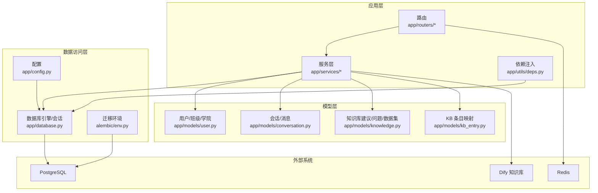
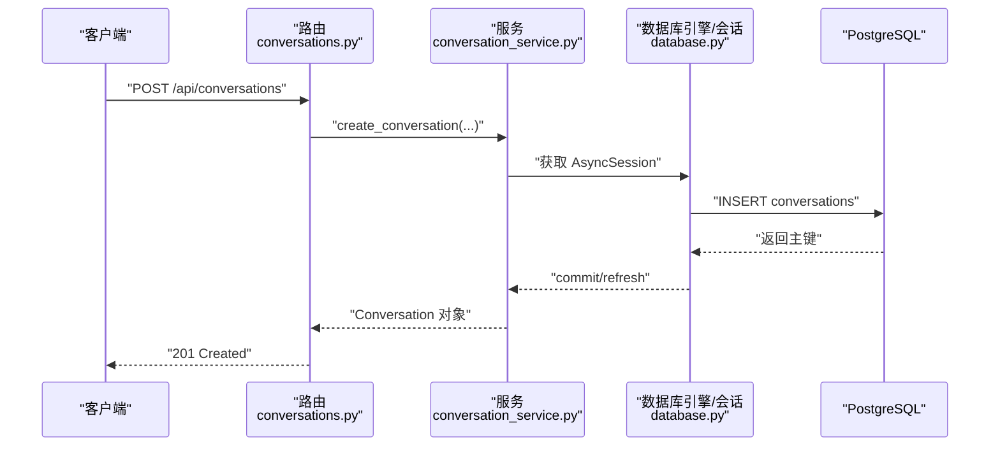
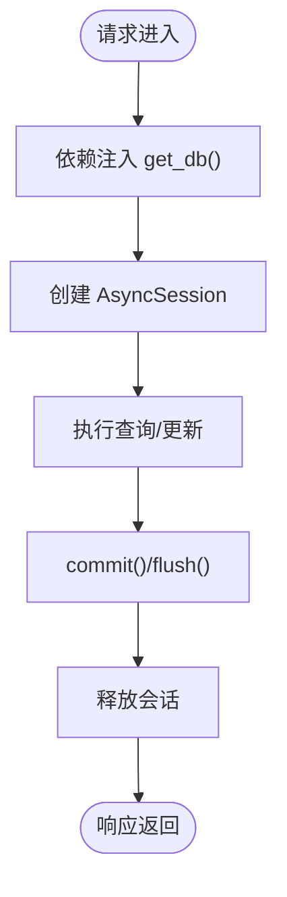
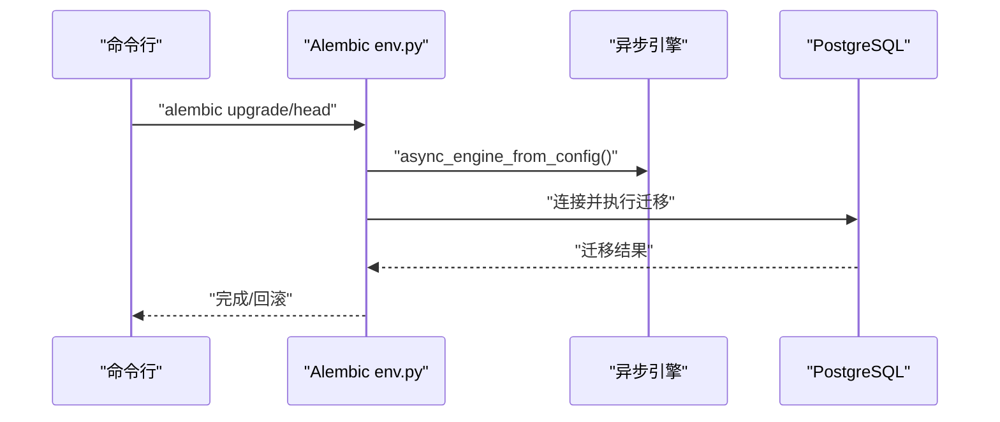
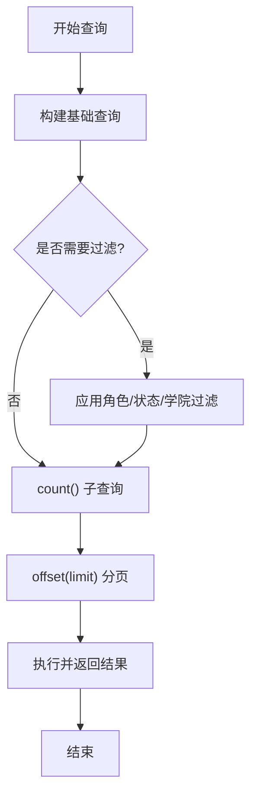
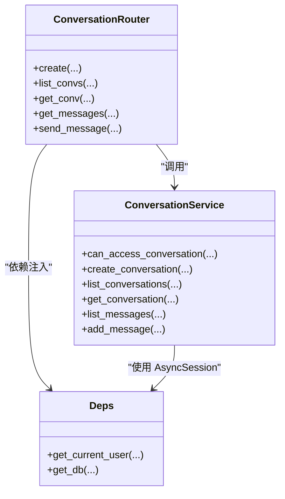
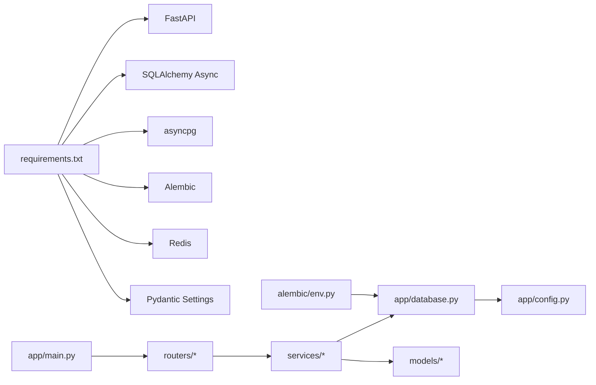

# 数据访问层

<cite>
**本文引用的文件**
- [services/gateway/app/database.py](file://services/gateway/app/database.py)
- [services/gateway/app/config.py](file://services/gateway/app/config.py)
- [services/gateway/app/models/__init__.py](file://services/gateway/app/models/__init__.py)
- [services/gateway/app/models/user.py](file://services/gateway/app/models/user.py)
- [services/gateway/app/models/conversation.py](file://services/gateway/app/models/conversation.py)
- [services/gateway/app/models/knowledge.py](file://services/gateway/app/models/knowledge.py)
- [services/gateway/app/models/kb_entry.py](file://services/gateway/app/models/kb_entry.py)
- [services/gateway/alembic/env.py](file://services/gateway/alembic/env.py)
- [services/gateway/alembic/versions/e11bb6c9d4b8_v2_initial_schema.py](file://services/gateway/alembic/versions/e11bb6c9d4b8_v2_initial_schema.py)
- [services/gateway/alembic/versions/ff1f0ab0c5f8_add_kb_entries_table.py](file://services/gateway/alembic/versions/ff1f0ab0c5f8_add_kb_entries_table.py)
- [services/gateway/app/utils/deps.py](file://services/gateway/app/utils/deps.py)
- [services/gateway/app/services/conversation_service.py](file://services/gateway/app/services/conversation_service.py)
- [services/gateway/app/routers/conversations.py](file://services/gateway/app/routers/conversations.py)
- [services/gateway/app/main.py](file://services/gateway/app/main.py)
- [services/gateway/scripts/migrate_kb.py](file://services/gateway/scripts/migrate_kb.py)
- [services/gateway/requirements.txt](file://services/gateway/requirements.txt)
</cite>

## 目录
1. [简介](#简介)
2. [项目结构](#项目结构)
3. [核心组件](#核心组件)
4. [架构总览](#架构总览)
5. [详细组件分析](#详细组件分析)
6. [依赖分析](#依赖分析)
7. [性能考虑](#性能考虑)
8. [故障排查指南](#故障排查指南)
9. [结论](#结论)
10. [附录](#附录)

## 简介
本文件聚焦于“数据访问层”的设计与实现，围绕以下主题展开：
- SQLAlchemy 异步 ORM 配置与依赖注入
- 数据库连接池管理与事务处理
- 数据模型设计、表关系映射与字段约束
- DAO 模式在本项目中的体现与查询优化策略
- 批量操作与迁移管理、版本控制、断点续迁
- 性能优化、连接池调优与错误处理最佳实践

## 项目结构
数据访问层位于后端服务 gateway 中，采用 FastAPI + SQLAlchemy Async 的异步架构。核心目录与职责如下：
- 配置与连接：app/config.py、app/database.py
- 模型定义：app/models/*
- 迁移与版本：alembic/*
- 依赖注入与路由：app/utils/deps.py、app/routers/*
- 业务服务：app/services/*
- 运行入口与健康检查：app/main.py
- 迁移脚本：scripts/migrate_kb.py



图表来源
- [services/gateway/app/database.py:1-15](file://services/gateway/app/database.py#L1-L15)
- [services/gateway/app/config.py:1-31](file://services/gateway/app/config.py#L1-L31)
- [services/gateway/alembic/env.py:1-97](file://services/gateway/alembic/env.py#L1-L97)
- [services/gateway/app/models/user.py:1-76](file://services/gateway/app/models/user.py#L1-L76)
- [services/gateway/app/models/conversation.py:1-63](file://services/gateway/app/models/conversation.py#L1-L63)
- [services/gateway/app/models/knowledge.py:1-62](file://services/gateway/app/models/knowledge.py#L1-L62)
- [services/gateway/app/models/kb_entry.py:1-31](file://services/gateway/app/models/kb_entry.py#L1-L31)
- [services/gateway/app/utils/deps.py:1-40](file://services/gateway/app/utils/deps.py#L1-L40)
- [services/gateway/app/routers/conversations.py:1-129](file://services/gateway/app/routers/conversations.py#L1-L129)
- [services/gateway/app/services/conversation_service.py:1-179](file://services/gateway/app/services/conversation_service.py#L1-L179)

章节来源
- [services/gateway/app/database.py:1-15](file://services/gateway/app/database.py#L1-L15)
- [services/gateway/app/config.py:1-31](file://services/gateway/app/config.py#L1-L31)
- [services/gateway/requirements.txt:1-29](file://services/gateway/requirements.txt#L1-L29)

## 核心组件
- 异步引擎与会话工厂：通过 create_async_engine 与 async_sessionmaker 构建异步连接池，默认池大小为 10；使用 expire_on_commit=False 以避免提交后对象过期导致的延迟查询。
- 依赖注入：get_db 提供基于上下文管理器的 AsyncSession 生命周期管理，确保每个请求拥有独立会话并自动释放。
- 配置中心：Settings 统一管理数据库 URL、Redis URL、JWT 参数等，支持从 .env 文件加载。
- 模型层：基于 DeclarativeBase 定义实体，使用 Enum、ForeignKey、UniqueConstraint、Index 等进行关系与约束声明。

章节来源
- [services/gateway/app/database.py:1-15](file://services/gateway/app/database.py#L1-L15)
- [services/gateway/app/config.py:1-31](file://services/gateway/app/config.py#L1-L31)
- [services/gateway/app/models/__init__.py:1-5](file://services/gateway/app/models/__init__.py#L1-L5)

## 架构总览
数据访问层遵循“路由 → 服务 → 模型 → 数据库”的分层结构。FastAPI 通过依赖注入将 AsyncSession 注入到服务层，服务层使用 SQLAlchemy 异步查询与更新，最终持久化至 PostgreSQL。迁移通过 Alembic 在启动时或命令行中执行，保证数据库结构演进一致。



图表来源
- [services/gateway/app/routers/conversations.py:21-31](file://services/gateway/app/routers/conversations.py#L21-L31)
- [services/gateway/app/services/conversation_service.py:29-51](file://services/gateway/app/services/conversation_service.py#L29-L51)
- [services/gateway/app/database.py:12-15](file://services/gateway/app/database.py#L12-L15)

## 详细组件分析

### 数据库连接与会话管理
- 引擎与会话工厂
  - 使用 create_async_engine 创建异步引擎，关闭 echo，设置 pool_size=10。
  - async_sessionmaker(class_=AsyncSession, expire_on_commit=False) 避免提交后属性失效引发的二次查询异常。
- 依赖注入
  - get_db 作为 FastAPI 依赖，使用 async with async_session() 生成会话，yield 给下游使用，结束后自动释放。
- 配置
  - Settings.database_url 提供连接字符串，支持从 .env 注入。



图表来源
- [services/gateway/app/database.py:6-15](file://services/gateway/app/database.py#L6-L15)
- [services/gateway/app/utils/deps.py:14-35](file://services/gateway/app/utils/deps.py#L14-L35)

章节来源
- [services/gateway/app/database.py:1-15](file://services/gateway/app/database.py#L1-L15)
- [services/gateway/app/utils/deps.py:1-40](file://services/gateway/app/utils/deps.py#L1-L40)

### 数据模型与表关系
- 用户与组织
  - College 与 Class 一对多；User 关联 College 与 Class，并通过 UserBinding 支持多平台绑定（唯一性约束）。
- 会话与消息
  - Conversation 与 Message 一对多；Message 通过 sender_type/sender_id 支持多方发送；索引覆盖学生与状态查询。
- 知识库
  - KbSuggestion 与 UnansweredQuestion 关联；CollegeDataset 绑定高校与 Dify 数据集；KbEntry 记录 Dify 文档与原始来源映射，含数组与 JSONB 字段。
- 约束与索引
  - 唯一约束：user.staff_id、user_bindings(platform, platform_uid)、college_datasets(college_id)、kb_entries(dify_document_id)。
  - 复合索引：conversations(student_id)、conversations(status)、messages(conversation_id)、messages(conversation_id, created_at)、kb_entries(title)。

```mermaid
erDiagram
COLLEGES {
int id PK
string name
timestamp created_at
}
CLASSES {
int id PK
string name
int college_id FK
int grade_year
timestamp created_at
}
USERS {
int id PK
string staff_id UK
string name
enum role
int college_id FK
int class_id FK
string password_hash
string avatar_url
bool is_active
timestamp created_at
timestamp updated_at
}
USER_BINDINGS {
int id PK
int user_id FK
enum platform
string platform_uid
timestamp bound_at
}
CONVERSATIONS {
int id PK
int student_id FK
int teacher_id FK
enum status
string dify_conversation_id
string title
timestamp created_at
timestamp updated_at
timestamp resolved_at
timestamp closed_at
}
MESSAGES {
int id PK
int conversation_id FK
enum sender_type
int sender_id FK
text content
json metadata
timestamp created_at
}
KB_SUGGESTIONS {
int id PK
string title
text content
text raw_content
enum source
string source_url
int college_id FK
enum status
int submitted_by FK
int reviewed_by FK
string dify_document_id
timestamp created_at
timestamp reviewed_at
}
UNANSWERED_QUESTIONS {
int id PK
text question_text
string question_hash
int hit_count
int[] sample_conv_ids
int college_id FK
bool is_resolved
int kb_suggestion_id FK
timestamp created_at
timestamp updated_at
}
COLLEGE_DATASETS {
int id PK
int college_id UK FK
string dify_dataset_id
timestamp created_at
}
KB_ENTRIES {
int id PK
string dify_document_id UK
string dify_dataset_id
string title
string category
string[] tags
string original_source
string source_url
string material_id
string campus
string original_filename
timestamp created_at
}
COLLEGES ||--o{ CLASSES : "拥有"
COLLEGES ||--o{ USERS : "拥有"
CLASSES ||--o{ USERS : "拥有"
USERS ||--o{ USER_BINDINGS : "绑定"
USERS ||--o{ CONVERSATIONS : "发起/指派"
CONVERSATIONS ||--o{ MESSAGES : "包含"
COLLEGES ||--o{ KB_SUGGESTIONS : "关联"
COLLEGES ||--o{ UNANSWERED_QUESTIONS : "关联"
COLLEGES ||--o{ COLLEGE_DATASETS : "绑定"
KB_SUGGESTIONS ||--o{ UNANSWERED_QUESTIONS : "关联"
```

图表来源
- [services/gateway/app/models/user.py:23-76](file://services/gateway/app/models/user.py#L23-L76)
- [services/gateway/app/models/conversation.py:26-63](file://services/gateway/app/models/conversation.py#L26-L63)
- [services/gateway/app/models/knowledge.py:22-62](file://services/gateway/app/models/knowledge.py#L22-L62)
- [services/gateway/app/models/kb_entry.py:9-31](file://services/gateway/app/models/kb_entry.py#L9-L31)

章节来源
- [services/gateway/app/models/user.py:1-76](file://services/gateway/app/models/user.py#L1-L76)
- [services/gateway/app/models/conversation.py:1-63](file://services/gateway/app/models/conversation.py#L1-L63)
- [services/gateway/app/models/knowledge.py:1-62](file://services/gateway/app/models/knowledge.py#L1-L62)
- [services/gateway/app/models/kb_entry.py:1-31](file://services/gateway/app/models/kb_entry.py#L1-L31)

### 迁移管理与版本控制
- 迁移环境
  - alembic/env.py 设置目标元数据为 Base.metadata，支持离线与在线两种迁移模式；在线模式通过 async_engine_from_config 创建异步引擎。
- 初始版本
  - e11bb6c9d4b8_v2_initial_schema.py 定义了 colleges/classes/users/conversations/messages/kb_suggestions/user_bindings/unanswered_questions/college_datasets 等表及索引、约束。
- 新增版本
  - ff1f0ab0c5f8_add_kb_entries_table.py 新增 kb_entries 表及其索引，用于记录 Dify 文档与原始来源映射。
- 断点续迁脚本
  - scripts/migrate_kb.py 支持从本地知识库目录批量导入至 Dify，并同步写入 kb_entries 表，具备断点续传与速率限制。



图表来源
- [services/gateway/alembic/env.py:67-96](file://services/gateway/alembic/env.py#L67-L96)
- [services/gateway/alembic/versions/e11bb6c9d4b8_v2_initial_schema.py:21-160](file://services/gateway/alembic/versions/e11bb6c9d4b8_v2_initial_schema.py#L21-L160)
- [services/gateway/alembic/versions/ff1f0ab0c5f8_add_kb_entries_table.py:21-50](file://services/gateway/alembic/versions/ff1f0ab0c5f8_add_kb_entries_table.py#L21-L50)

章节来源
- [services/gateway/alembic/env.py:1-97](file://services/gateway/alembic/env.py#L1-L97)
- [services/gateway/alembic/versions/e11bb6c9d4b8_v2_initial_schema.py:1-160](file://services/gateway/alembic/versions/e11bb6c9d4b8_v2_initial_schema.py#L1-L160)
- [services/gateway/alembic/versions/ff1f0ab0c5f8_add_kb_entries_table.py:1-50](file://services/gateway/alembic/versions/ff1f0ab0c5f8_add_kb_entries_table.py#L1-L50)
- [services/gateway/scripts/migrate_kb.py:1-201](file://services/gateway/scripts/migrate_kb.py#L1-L201)

### 查询优化与批量操作
- 分页与计数
  - 服务层对列表查询先执行子查询计数，再按偏移与限制取值，避免重复扫描全表。
- 索引与过滤
  - 会话与消息表建立复合索引，支撑按学生、状态、时间等条件高效检索。
- 批量写入
  - 迁移脚本通过 save_kb_entry 将单条记录写入 kb_entries，结合 commit 与 rollback 保障一致性。
- 事务边界
  - create_conversation 使用 flush/commit/refresh 保证插入顺序与可见性；add_message 在同一事务内更新会话时间戳并插入消息。



图表来源
- [services/gateway/app/services/conversation_service.py:54-111](file://services/gateway/app/services/conversation_service.py#L54-L111)
- [services/gateway/app/services/conversation_service.py:129-145](file://services/gateway/app/services/conversation_service.py#L129-L145)

章节来源
- [services/gateway/app/services/conversation_service.py:1-179](file://services/gateway/app/services/conversation_service.py#L1-L179)

### DAO 模式与路由集成
- DAO 角色
  - 服务层承担 DAO 职责：封装 CRUD 与复杂查询逻辑，屏蔽底层 ORM 细节。
- 路由与依赖
  - 路由层通过 Depends(get_db) 与 Depends(get_current_user) 获取会话与用户，统一鉴权与数据访问。
- 事务语义
  - 路由层不直接参与事务控制，事务在服务层显式 commit/rollback，确保幂等与一致性。



图表来源
- [services/gateway/app/services/conversation_service.py:1-179](file://services/gateway/app/services/conversation_service.py#L1-L179)
- [services/gateway/app/routers/conversations.py:1-129](file://services/gateway/app/routers/conversations.py#L1-L129)
- [services/gateway/app/utils/deps.py:14-35](file://services/gateway/app/utils/deps.py#L14-L35)

章节来源
- [services/gateway/app/routers/conversations.py:1-129](file://services/gateway/app/routers/conversations.py#L1-L129)
- [services/gateway/app/utils/deps.py:1-40](file://services/gateway/app/utils/deps.py#L1-L40)

## 依赖分析
- 外部依赖
  - FastAPI、SQLAlchemy Async、asyncpg、Alembic、Redis、Pydantic Settings。
- 内部依赖
  - 路由依赖服务，服务依赖模型与数据库会话，迁移依赖 Alembic 环境与配置。



图表来源
- [services/gateway/requirements.txt:1-29](file://services/gateway/requirements.txt#L1-L29)
- [services/gateway/app/main.py:1-78](file://services/gateway/app/main.py#L1-L78)
- [services/gateway/alembic/env.py:14-18](file://services/gateway/alembic/env.py#L14-L18)

章节来源
- [services/gateway/requirements.txt:1-29](file://services/gateway/requirements.txt#L1-L29)
- [services/gateway/app/main.py:1-78](file://services/gateway/app/main.py#L1-L78)

## 性能考虑
- 连接池调优
  - 当前 pool_size=10，适合中小规模并发；可根据峰值 QPS 与慢查询比例调整，配合连接超时与空闲回收策略。
- 查询优化
  - 使用索引覆盖高频过滤字段（如 conversations.student_id、conversations.status、messages.conversation_id、messages.created_at）。
  - 列表查询采用 count() 子查询与 limit+offset 分页，避免全表扫描。
- 事务与锁
  - 将短事务置于服务层，减少长事务持有锁的时间；对热点表使用合适的隔离级别。
- 批量导入
  - 迁移脚本限速与断点续传，降低对上游 Dify 与数据库的压力。
- 缓存与去重
  - 对高频读取的静态数据（如学院/班级）可引入 Redis 缓存，减少数据库压力。

## 故障排查指南
- 连接失败
  - 检查 Settings.database_url 是否正确，网络连通性与数据库实例状态。
- 会话过期
  - 若出现属性延迟加载失败，确认未误用 expire_on_commit=True 或在事务外访问已提交对象。
- 权限校验
  - get_current_user 对 JWT 解析失败或用户不存在/禁用时返回 401，需检查令牌与用户状态。
- 迁移异常
  - 在 alembic/env.py 的在线迁移中，若连接失败，检查异步引擎参数与 Alembic 配置；必要时切换离线模式。
- 导入失败
  - migrate_kb.py 写入 kb_entries 失败时会 rollback 并继续；关注 CSV 输出与日志定位失败原因。

章节来源
- [services/gateway/app/utils/deps.py:14-35](file://services/gateway/app/utils/deps.py#L14-L35)
- [services/gateway/alembic/env.py:67-96](file://services/gateway/alembic/env.py#L67-L96)
- [services/gateway/scripts/migrate_kb.py:172-182](file://services/gateway/scripts/migrate_kb.py#L172-L182)

## 结论
本数据访问层以 SQLAlchemy Async 为核心，结合 FastAPI 依赖注入与 Alembic 迁移，实现了清晰的分层与可维护的数据持久化方案。通过合理的索引、分页与事务边界控制，满足会话与知识库场景的性能与一致性要求。建议在生产环境中进一步细化连接池参数、引入缓存与监控告警，并完善批量导入的重试与补偿机制。

## 附录
- 健康检查
  - app/main.py 提供 /health 接口，检查 PostgreSQL、Redis 与 Dify 的可用性，便于部署与运维观测。
- 配置项
  - Settings 统一管理数据库、Redis、JWT、Dify 等参数，支持 .env 注入。

章节来源
- [services/gateway/app/main.py:30-68](file://services/gateway/app/main.py#L30-L68)
- [services/gateway/app/config.py:1-31](file://services/gateway/app/config.py#L1-L31)