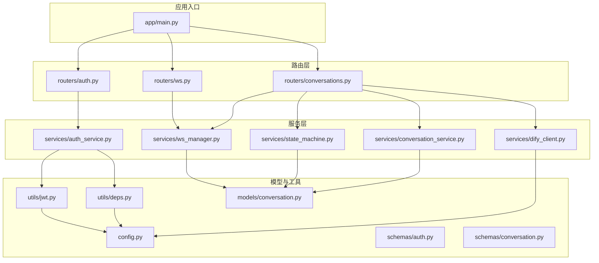
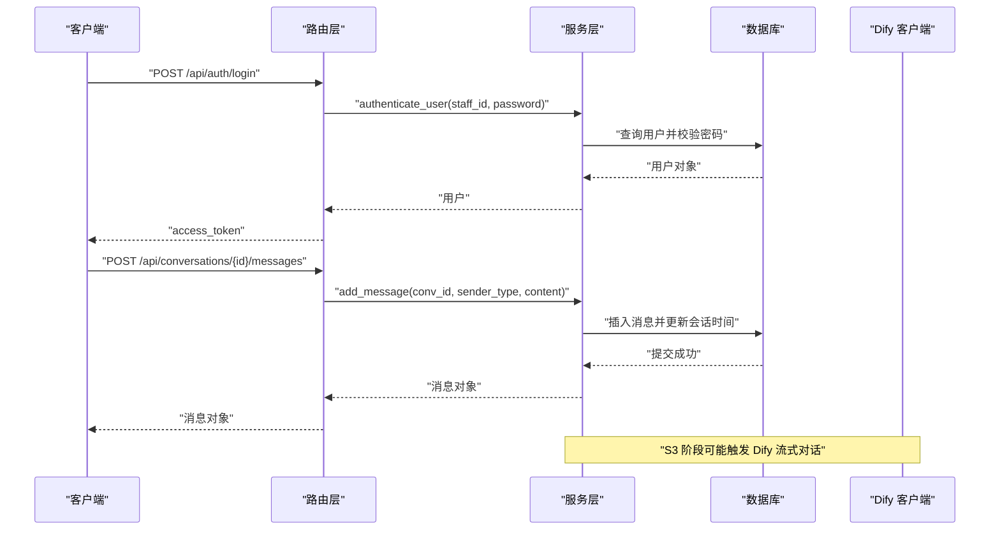
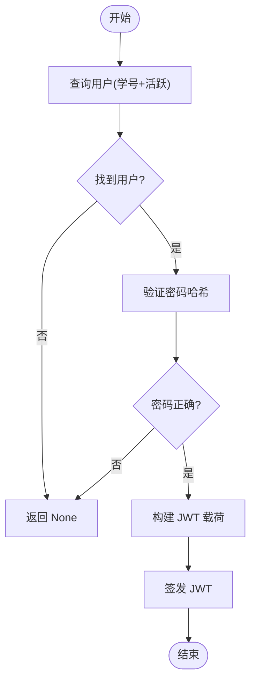
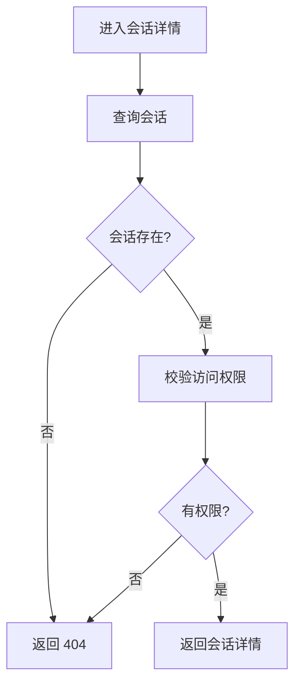
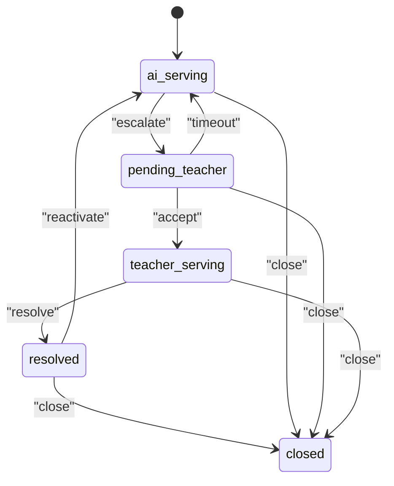
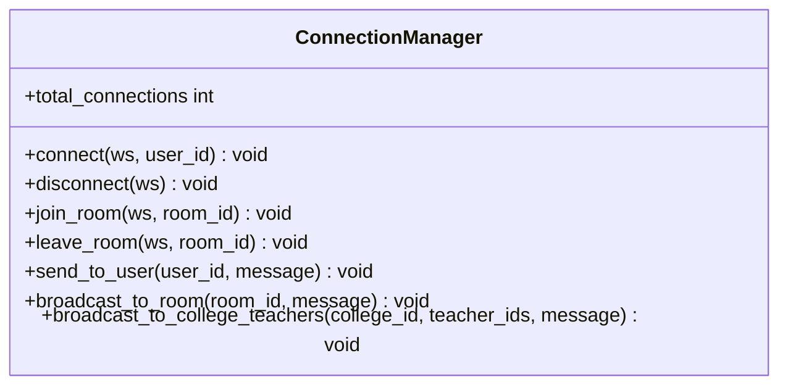
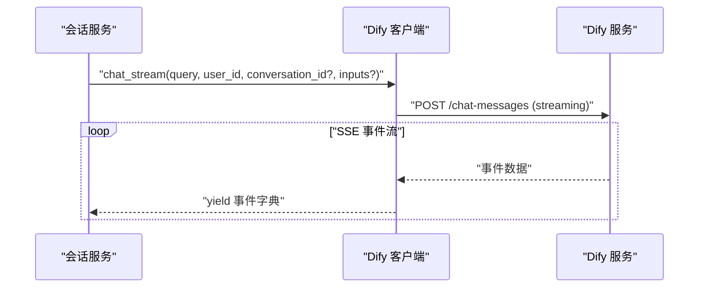
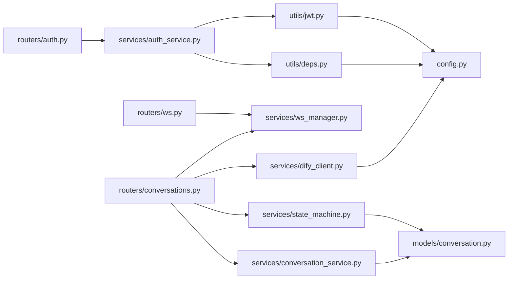

# 服务层架构

<cite>
**本文引用的文件**
- [services/gateway/app/main.py](file://services/gateway/app/main.py)
- [services/gateway/app/config.py](file://services/gateway/app/config.py)
- [services/gateway/app/utils/deps.py](file://services/gateway/app/utils/deps.py)
- [services/gateway/app/utils/jwt.py](file://services/gateway/app/utils/jwt.py)
- [services/gateway/app/models/conversation.py](file://services/gateway/app/models/conversation.py)
- [services/gateway/app/schemas/auth.py](file://services/gateway/app/schemas/auth.py)
- [services/gateway/app/schemas/conversation.py](file://services/gateway/app/schemas/conversation.py)
- [services/gateway/app/routers/auth.py](file://services/gateway/app/routers/auth.py)
- [services/gateway/app/routers/conversations.py](file://services/gateway/app/routers/conversations.py)
- [services/gateway/app/routers/ws.py](file://services/gateway/app/routers/ws.py)
- [services/gateway/app/services/auth_service.py](file://services/gateway/app/services/auth_service.py)
- [services/gateway/app/services/conversation_service.py](file://services/gateway/app/services/conversation_service.py)
- [services/gateway/app/services/state_machine.py](file://services/gateway/app/services/state_machine.py)
- [services/gateway/app/services/ws_manager.py](file://services/gateway/app/services/ws_manager.py)
- [services/gateway/app/services/dify_client.py](file://services/gateway/app/services/dify_client.py)
</cite>

## 目录
1. [引言](#引言)
2. [项目结构](#项目结构)
3. [核心组件](#核心组件)
4. [架构总览](#架构总览)
5. [详细组件分析](#详细组件分析)
6. [依赖分析](#依赖分析)
7. [性能考虑](#性能考虑)
8. [故障排查指南](#故障排查指南)
9. [结论](#结论)
10. [附录](#附录)

## 引言
本文件面向“医小管 v2”网关服务层，系统化梳理服务模块的设计与实现，覆盖认证服务、会话管理服务、WebSocket 管理服务、AI 客户端服务等，并阐明模块间依赖关系与交互模式。文档同时给出职责分离与设计模式的应用说明、扩展与定制建议，以及服务层单元测试与集成测试的最佳实践。

## 项目结构
服务层位于网关应用中，采用“路由层-服务层-模型/工具层”的分层组织方式：
- 路由层：定义 REST API 与 WebSocket 接入点，负责参数解析、鉴权依赖注入与响应模型。
- 服务层：封装业务逻辑，如认证、会话管理、状态机、连接管理、外部 AI 客户端调用。
- 模型/工具层：数据模型、配置、JWT 工具、数据库依赖等。
- 应用入口：FastAPI 应用装配各路由与生命周期资源。

图表来源
- [services/gateway/app/main.py:1-78](file://services/gateway/app/main.py#L1-L78)
- [services/gateway/app/routers/auth.py:1-35](file://services/gateway/app/routers/auth.py#L1-L35)
- [services/gateway/app/routers/conversations.py:1-129](file://services/gateway/app/routers/conversations.py#L1-L129)
- [services/gateway/app/routers/ws.py:1-119](file://services/gateway/app/routers/ws.py#L1-L119)
- [services/gateway/app/services/auth_service.py:1-35](file://services/gateway/app/services/auth_service.py#L1-L35)
- [services/gateway/app/services/conversation_service.py:1-179](file://services/gateway/app/services/conversation_service.py#L1-L179)
- [services/gateway/app/services/state_machine.py:1-96](file://services/gateway/app/services/state_machine.py#L1-L96)
- [services/gateway/app/services/ws_manager.py:1-100](file://services/gateway/app/services/ws_manager.py#L1-L100)
- [services/gateway/app/services/dify_client.py:1-105](file://services/gateway/app/services/dify_client.py#L1-L105)
- [services/gateway/app/config.py:1-31](file://services/gateway/app/config.py#L1-L31)
- [services/gateway/app/utils/deps.py:1-40](file://services/gateway/app/utils/deps.py#L1-L40)
- [services/gateway/app/utils/jwt.py:1-17](file://services/gateway/app/utils/jwt.py#L1-L17)
- [services/gateway/app/models/conversation.py:1-63](file://services/gateway/app/models/conversation.py#L1-L63)
- [services/gateway/app/schemas/auth.py:1-23](file://services/gateway/app/schemas/auth.py#L1-L23)
- [services/gateway/app/schemas/conversation.py:1-50](file://services/gateway/app/schemas/conversation.py#L1-L50)

章节来源
- [services/gateway/app/main.py:1-78](file://services/gateway/app/main.py#L1-L78)

## 核心组件
- 认证服务：提供用户认证与 JWT 签发；配合依赖注入在路由层完成登录与“我的信息”查询。
- 会话管理服务：封装会话创建、列表查询、详情获取、消息读写、访问控制与分页统计。
- 状态机服务：定义会话状态转换规则，确保状态变迁合法且记录系统消息。
- WebSocket 管理服务：维护用户连接与房间广播，支持按用户与房间进行消息推送。
- AI 客户端服务：封装 Dify Chatflow 流式对话与知识库文档创建接口，作为外部依赖客户端。
- 配置与工具：集中管理数据库、Redis、JWT、Dify 等配置；提供 JWT 编解码与当前用户解析。

章节来源
- [services/gateway/app/services/auth_service.py:1-35](file://services/gateway/app/services/auth_service.py#L1-L35)
- [services/gateway/app/services/conversation_service.py:1-179](file://services/gateway/app/services/conversation_service.py#L1-L179)
- [services/gateway/app/services/state_machine.py:1-96](file://services/gateway/app/services/state_machine.py#L1-L96)
- [services/gateway/app/services/ws_manager.py:1-100](file://services/gateway/app/services/ws_manager.py#L1-L100)
- [services/gateway/app/services/dify_client.py:1-105](file://services/gateway/app/services/dify_client.py#L1-L105)
- [services/gateway/app/config.py:1-31](file://services/gateway/app/config.py#L1-L31)
- [services/gateway/app/utils/deps.py:1-40](file://services/gateway/app/utils/deps.py#L1-L40)
- [services/gateway/app/utils/jwt.py:1-17](file://services/gateway/app/utils/jwt.py#L1-L17)

## 架构总览
服务层围绕“路由-服务-模型/工具”三层协作，形成清晰的职责边界：
- 路由层仅处理输入输出与鉴权，业务逻辑下沉至服务层。
- 服务层通过 SQLAlchemy 异步会话与数据库交互，必要时访问 Redis 与外部 Dify 服务。
- WebSocket 作为独立长连接通道，与 HTTP 会话消息通过房间广播协同。

图表来源
- [services/gateway/app/routers/auth.py:12-21](file://services/gateway/app/routers/auth.py#L12-L21)
- [services/gateway/app/services/auth_service.py:8-34](file://services/gateway/app/services/auth_service.py#L8-L34)
- [services/gateway/app/routers/conversations.py:81-128](file://services/gateway/app/routers/conversations.py#L81-L128)
- [services/gateway/app/services/conversation_service.py:148-178](file://services/gateway/app/services/conversation_service.py#L148-L178)
- [services/gateway/app/services/dify_client.py:22-69](file://services/gateway/app/services/dify_client.py#L22-L69)

## 详细组件分析

### 认证服务
- 职责：验证用户身份、构建 JWT 载荷、签发访问令牌。
- 关键流程：登录时根据学号查询活跃用户，使用哈希比对密码；成功后基于用户属性构建 JWT 载荷并签名。
- 依赖：bcrypt 哈希、SQLAlchemy 异步会话、JWT 工具、用户模型。

图表来源
- [services/gateway/app/services/auth_service.py:8-34](file://services/gateway/app/services/auth_service.py#L8-L34)

章节来源
- [services/gateway/app/services/auth_service.py:1-35](file://services/gateway/app/services/auth_service.py#L1-L35)
- [services/gateway/app/routers/auth.py:12-34](file://services/gateway/app/routers/auth.py#L12-L34)
- [services/gateway/app/utils/jwt.py:6-16](file://services/gateway/app/utils/jwt.py#L6-L16)
- [services/gateway/app/utils/deps.py:14-35](file://services/gateway/app/utils/deps.py#L14-L35)

### 会话管理服务
- 职责：会话创建、列表与详情查询、消息读写、访问控制与分页统计。
- 权限策略：
  - 学生：仅能查看/操作自己的会话。
  - 教师：可查看本学院待接单与自己正在服务的会话；仅能回复已接单会话。
  - 管理员：全量可见。
- 关键函数：can_access_conversation、create_conversation、list_conversations、get_conversation、list_messages、add_message。

图表来源
- [services/gateway/app/services/conversation_service.py:113-126](file://services/gateway/app/services/conversation_service.py#L113-L126)

章节来源
- [services/gateway/app/services/conversation_service.py:1-179](file://services/gateway/app/services/conversation_service.py#L1-L179)
- [services/gateway/app/routers/conversations.py:21-128](file://services/gateway/app/routers/conversations.py#L21-L128)

### 状态机服务
- 职责：以状态转换表约束会话状态变迁，记录系统消息，维护时间戳字段。
- 合法转换：AI 服务 → 转人工、待接单 → 接单、待接单 → 超时回退、教师服务 → 解决、已解决 → 重新激活/AI、任意非关闭 → 关闭。
- 错误处理：非法转换抛出异常，调用方可捕获并返回错误。

图表来源
- [services/gateway/app/services/state_machine.py:20-31](file://services/gateway/app/services/state_machine.py#L20-L31)
- [services/gateway/app/services/state_machine.py:34-95](file://services/gateway/app/services/state_machine.py#L34-L95)

章节来源
- [services/gateway/app/services/state_machine.py:1-96](file://services/gateway/app/services/state_machine.py#L1-L96)

### WebSocket 管理服务
- 职责：维护用户连接与房间映射，支持按用户/房间广播消息；自动清理失效连接。
- 房间命名：以“conv:{conversation_id}”标识会话房间。
- 广播场景：新消息、状态变更、转人工通知、输入中提示等。

图表来源
- [services/gateway/app/services/ws_manager.py:8-99](file://services/gateway/app/services/ws_manager.py#L8-L99)

章节来源
- [services/gateway/app/services/ws_manager.py:1-100](file://services/gateway/app/services/ws_manager.py#L1-L100)
- [services/gateway/app/routers/ws.py:11-119](file://services/gateway/app/routers/ws.py#L11-L119)

### AI 客户端服务
- 职责：封装 Dify Chatflow 流式对话与知识库文档创建接口。
- 流式对话：按 SSE 事件流逐条产出，调用方需在首次事件时持久化会话 ID，并在消息结束时保存完整消息。
- 文档创建：用于知识库迁移场景，按文本创建文档并返回批次信息。

图表来源
- [services/gateway/app/services/dify_client.py:22-69](file://services/gateway/app/services/dify_client.py#L22-L69)
- [services/gateway/app/services/conversation_service.py:148-178](file://services/gateway/app/services/conversation_service.py#L148-L178)

章节来源
- [services/gateway/app/services/dify_client.py:1-105](file://services/gateway/app/services/dify_client.py#L1-L105)

### 配置与工具
- 配置：集中管理数据库、Redis、JWT、Dify 等参数，支持从 .env 文件加载。
- JWT 工具：签发与解码，携带用户角色、学院/班级等上下文。
- 当前用户依赖：从 Authorization 头解析 JWT，查询用户并校验有效性。

章节来源
- [services/gateway/app/config.py:1-31](file://services/gateway/app/config.py#L1-L31)
- [services/gateway/app/utils/jwt.py:1-17](file://services/gateway/app/utils/jwt.py#L1-L17)
- [services/gateway/app/utils/deps.py:14-39](file://services/gateway/app/utils/deps.py#L14-L39)

## 依赖分析
- 路由层依赖服务层与工具层；服务层依赖模型与配置；WebSocket 与会话消息通过房间广播耦合。
- 外部依赖：PostgreSQL（SQLAlchemy）、Redis（异步）、HTTP(S) 客户端（Dify）。
- 设计模式：
  - 服务层职责单一：认证、会话、状态、连接、外部客户端各司其职。
  - 依赖注入：通过 FastAPI Depends 提供数据库会话、Redis 实例、当前用户。
  - 状态机：以转换表约束状态变迁，降低分支复杂度。

图表来源
- [services/gateway/app/routers/auth.py:1-35](file://services/gateway/app/routers/auth.py#L1-L35)
- [services/gateway/app/routers/conversations.py:1-129](file://services/gateway/app/routers/conversations.py#L1-L129)
- [services/gateway/app/routers/ws.py:1-119](file://services/gateway/app/routers/ws.py#L1-L119)
- [services/gateway/app/services/auth_service.py:1-35](file://services/gateway/app/services/auth_service.py#L1-L35)
- [services/gateway/app/services/conversation_service.py:1-179](file://services/gateway/app/services/conversation_service.py#L1-L179)
- [services/gateway/app/services/state_machine.py:1-96](file://services/gateway/app/services/state_machine.py#L1-L96)
- [services/gateway/app/services/ws_manager.py:1-100](file://services/gateway/app/services/ws_manager.py#L1-L100)
- [services/gateway/app/services/dify_client.py:1-105](file://services/gateway/app/services/dify_client.py#L1-L105)
- [services/gateway/app/utils/deps.py:1-40](file://services/gateway/app/utils/deps.py#L1-L40)
- [services/gateway/app/utils/jwt.py:1-17](file://services/gateway/app/utils/jwt.py#L1-L17)
- [services/gateway/app/config.py:1-31](file://services/gateway/app/config.py#L1-L31)
- [services/gateway/app/models/conversation.py:1-63](file://services/gateway/app/models/conversation.py#L1-L63)

## 性能考虑
- 数据库访问
  - 使用异步 SQLAlchemy 会话减少阻塞；对高频查询建立索引（会话与消息表）。
  - 分页查询与计数分离，避免大结果集扫描。
- 缓存与连接
  - Redis 用于会话元数据与短期缓存；注意连接池与超时设置。
- WebSocket
  - 房间广播批量发送，异常连接及时清理；避免向离线用户发送。
- 外部服务
  - Dify 请求设置合理超时与重试；流式事件解析需容错非 JSON 数据。
- 并发与限流
  - 在路由层增加速率限制中间件，防止恶意刷量。

## 故障排查指南
- 登录失败
  - 检查学号是否存在且用户处于活跃状态；确认密码哈希匹配。
  - 参考路径：[services/gateway/app/services/auth_service.py:8-17](file://services/gateway/app/services/auth_service.py#L8-L17)
- 会话不可见
  - 核对用户角色与会话归属；教师仅能查看本学院待接单与自己正在服务的会话。
  - 参考路径：[services/gateway/app/services/conversation_service.py:7-26](file://services/gateway/app/services/conversation_service.py#L7-L26)
- 状态转换异常
  - 非法动作将抛出异常；检查当前状态与允许的动作集合。
  - 参考路径：[services/gateway/app/services/state_machine.py:8-48](file://services/gateway/app/services/state_machine.py#L8-L48)
- WebSocket 断连
  - 检查 JWT 是否有效；确认房间加入与断开流程；观察日志中的断连记录。
  - 参考路径：[services/gateway/app/routers/ws.py:35-42](file://services/gateway/app/routers/ws.py#L35-L42)，[services/gateway/app/services/ws_manager.py:34-46](file://services/gateway/app/services/ws_manager.py#L34-L46)
- Dify 调用失败
  - 核对 API Key、基础地址与超时设置；关注非 JSON 事件数据的告警。
  - 参考路径：[services/gateway/app/services/dify_client.py:50-69](file://services/gateway/app/services/dify_client.py#L50-L69)

章节来源
- [services/gateway/app/services/auth_service.py:8-17](file://services/gateway/app/services/auth_service.py#L8-L17)
- [services/gateway/app/services/conversation_service.py:7-26](file://services/gateway/app/services/conversation_service.py#L7-L26)
- [services/gateway/app/services/state_machine.py:8-48](file://services/gateway/app/services/state_machine.py#L8-L48)
- [services/gateway/app/routers/ws.py:35-42](file://services/gateway/app/routers/ws.py#L35-L42)
- [services/gateway/app/services/ws_manager.py:34-46](file://services/gateway/app/services/ws_manager.py#L34-L46)
- [services/gateway/app/services/dify_client.py:50-69](file://services/gateway/app/services/dify_client.py#L50-L69)

## 结论
服务层通过明确的职责划分与清晰的依赖关系，实现了认证、会话、状态、连接与外部 AI 客户端的解耦。结合状态机与房间广播机制，满足了多角色、多场景下的交互需求。建议在后续阶段完善 Dify 对接与消息持久化一致性，持续优化数据库索引与缓存策略，并加强监控与告警体系。

## 附录
- 扩展与定制建议
  - 新增角色：在权限判断与 JWT 载荷中补充角色字段，调整访问控制逻辑。
  - 新增状态：在状态机转换表中补充新状态与动作，确保系统消息与时间戳字段同步更新。
  - 新增路由：遵循现有依赖注入与响应模型规范，保持服务层职责单一。
- 测试最佳实践
  - 单元测试：针对服务层函数（认证、会话、状态机、WS 管理）编写独立测试，使用内存数据库与模拟外部依赖。
  - 集成测试：通过 HTTP 客户端调用路由层，覆盖鉴权、权限、状态转换与 WebSocket 交互；使用真实数据库与外部服务进行端到端验证。
  - 性能测试：对高频接口（分页列表、消息读写、状态转换）进行压力测试，评估数据库与外部服务瓶颈。